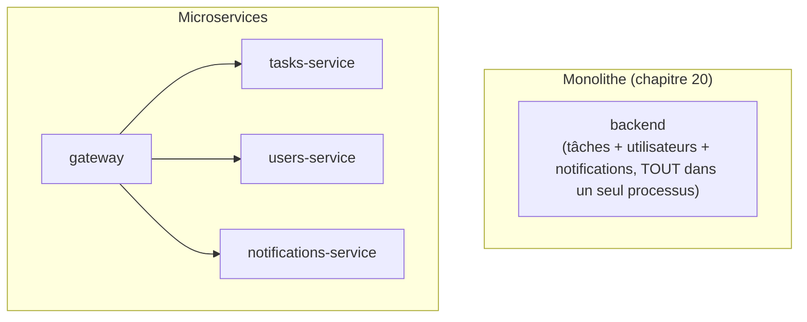

# Chapitre 37 — Docker et architecture microservices

**Niveau : Avancé**

---

## Introduction

Dernier chapitre de la Partie VIII. Chaque projet de ce manuel, jusqu'ici, a suivi un modèle **monolithique** : un seul processus backend (chapitre 14) gérant l'ensemble de la logique métier, même réparti en plusieurs conteneurs (frontend, backend, base de données, cache). Ce chapitre explore l'alternative — les microservices — sans jamais la présenter comme une évolution obligatoire.

---

## 🎯 Objectifs pédagogiques

À la fin de ce chapitre, tu sauras :
- distinguer un monolithe d'une architecture microservices ;
- citer les raisons réelles qui justifient les microservices, au-delà de l'effet de mode ;
- expliquer honnêtement le coût opérationnel réel qu'ils ajoutent ;
- construire un patron API Gateway avec Nginx devant plusieurs microservices, chacun avec sa propre base de données.

## 📋 Prérequis

Chapitre 19 (Nginx reverse proxy).

## Pourquoi ce chapitre est important

Les microservices sont un des sujets les plus discutés — et les plus mal compris — du développement backend moderne. Ce chapitre donne les moyens de juger, projet par projet, si cette architecture apporte un bénéfice réel ou seulement une complexité inutile.

---

## Concepts fondamentaux

1. **Monolithe vs microservices** — la distinction de base.
2. **Pourquoi ils existent** — des raisons réelles, pas une mode.
3. **Pourquoi ils ne sont pas obligatoires** — un coût honnête.
4. **API Gateway** — le patron d'entrée unique.
5. **Une base de données par service** — un principe central.

---

## 37.1 Monolithe vs microservices

Le projet du chapitre 20 est un **monolithe** : un seul processus `backend` gère les tâches, potentiellement les utilisateurs, les notifications, et tout le reste — même s'il tourne dans son propre conteneur, séparé de la base de données et du frontend (chapitre 20). Une architecture **microservices** irait plus loin : chaque **domaine métier** (tâches, utilisateurs, notifications) deviendrait un service indépendant, avec son propre code, son propre déploiement, et — principe central de la section 37.5 — sa propre base de données.



---

## 37.2 Pourquoi les microservices existent

| Raison | Détail |
|---|---|
| Équipes indépendantes | Plusieurs équipes peuvent développer et **déployer** leur service séparément, sans se bloquer mutuellement |
| Scalabilité indépendante | Un service très sollicité (rappel du chapitre 35) peut être mis à l'échelle seul, sans dupliquer inutilement les autres |
| Isolation de panne | Une panne dans un service n'entraîne pas nécessairement la panne de tous les autres |
| Diversité technologique | Chaque service peut, en théorie, utiliser le langage/framework le mieux adapté à son domaine précis |

---

## 37.3 Pourquoi ils ne sont pas obligatoires — le coût honnête

> ⚠️ **Attention — l'argument le plus important de ce chapitre** — Chaque bénéfice de la section 37.2 a un coût opérationnel réel et mesurable :

| Coût | Détail |
|---|---|
| Réseau entre services | Chaque appel entre services devient un appel réseau (chapitre 11), avec latence, et un nouveau point d'échec possible qui n'existait pas en appel de fonction interne à un monolithe |
| Transactions distribuées | Une opération touchant plusieurs services perd la garantie transactionnelle simple d'une seule base de données (rappel du chapitre 36) — un défi réel, souvent sous-estimé |
| Debugging plus complexe | Le chapitre 23 (diagnostic) devient nettement plus difficile : une erreur peut provenir de n'importe lequel des services impliqués dans une chaîne d'appels |
| Monitoring multiplié | Le chapitre 34 doit couvrir chaque service individuellement, avec une corrélation entre eux à construire |
| Plus de conteneurs, plus de healthchecks, plus de configurations | Chaque nouveau service ajoute sa propre surface à maintenir (chapitres 21, 25, 26) |

> 📌 **À retenir — le vrai signal, pas une mode** — Rappel direct du chapitre 2 (section 2.6) : la question n'est jamais "les microservices sont-ils modernes" mais **"ai-je un besoin réel et mesuré que seuls les microservices résolvent"** — une équipe qui grandit au point de se bloquer mutuellement sur un même code, ou un composant précis dont la charge dépasse largement celle du reste de l'application. Sans ce signal concret, un monolithe bien architecturé (avec des modules internes clairement séparés, une pratique de code propre indépendante de Docker) reste souvent le choix le plus pragmatique.

---

## 37.4 API Gateway avec Nginx

```nginx
# [gateway/nginx.conf]
server {
    listen 80;

    location /api/tasks/ {
        proxy_pass http://tasks-service:4000/;
        proxy_set_header Host $host;
        proxy_set_header X-Real-IP $remote_addr;
    }

    location /api/notifications/ {
        proxy_pass http://notifications-service:4001/;
        proxy_set_header Host $host;
        proxy_set_header X-Real-IP $remote_addr;
    }
}
```

**Explication :** rien de nouveau techniquement — c'est exactement le patron reverse proxy du chapitre 19, appliqué non plus à un seul backend mais à **plusieurs services distincts**, chacun résolu par son nom (rappel du chapitre 11) sur le réseau Compose commun. Nginx, ici, joue le rôle d'**API Gateway** : le point d'entrée unique qui masque, pour le client, le fait que plusieurs services distincts répondent en coulisses.

---

## 37.5 Une base de données par service (principe central)

```yaml
# [compose.yaml]
services:
  gateway:
    build: ./gateway
    ports:
      - "8080:80"
    depends_on:
      - tasks-service
      - notifications-service

  tasks-service:
    build: ./tasks-service
    environment:
      DB_HOST: tasks-db
    depends_on:
      tasks-db:
        condition: service_healthy

  tasks-db:
    image: postgres:16
    environment:
      POSTGRES_USER: tasks_user
      POSTGRES_PASSWORD: ${TASKS_DB_PASSWORD}
      POSTGRES_DB: tasks
    volumes:
      - tasks-db-data:/var/lib/postgresql/data
    healthcheck:
      test: ["CMD-SHELL", "pg_isready -U tasks_user"]

  notifications-service:
    build: ./notifications-service
    environment:
      REDIS_URL: redis://notifications-redis:6379

  notifications-redis:
    image: redis:7

volumes:
  tasks-db-data:
```

> ⚠️ **Attention — le principe le plus important de ce chapitre** — Chaque microservice possède **exclusivement** sa propre base de données (`tasks-service` ↔ `tasks-db`, `notifications-service` ↔ `notifications-redis`) — **aucun** service n'accède **jamais** directement à la base d'un autre service, même en simple lecture. Toute donnée nécessaire d'un autre domaine s'obtient en appelant l'**API** de ce service, jamais en interrogeant sa base directement. Violer ce principe (une pratique parfois vue, appelée "base de données partagée") recrée un couplage aussi fort qu'un monolithe, tout en gardant la complexité opérationnelle des microservices — le pire des deux mondes.

> 📌 **À retenir** — Compte les conteneurs : ce système à deux domaines métier seulement compte déjà **6 services** (`gateway`, `tasks-service`, `tasks-db`, `notifications-service`, `notifications-redis`, plus potentiellement `users-service` et sa propre base) contre **4** pour le monolithe équivalent du chapitre 20 — une démonstration concrète et immédiate du coût de la section 37.3, avant même d'ajouter un seul domaine métier supplémentaire.

---

## 37.6 Communication entre services : synchrone ou asynchrone

**Synchrone** (HTTP direct, comme la section 37.4) : simple à comprendre, mais couple les services dans le temps — si `tasks-service` doit attendre une réponse de `notifications-service` pour terminer sa propre requête, une lenteur de l'un ralentit directement l'autre.

**Asynchrone** (via une file d'attente, rappel du chapitre 18, section 18.2) : `tasks-service` dépose un événement ("une tâche a été créée") dans Redis, sans attendre de réponse ; `notifications-service` le traite en arrière-plan, à son propre rythme — un découplage réel, au prix d'une cohérence différée plutôt qu'immédiate.

> 📌 **À retenir** — Ce choix (synchrone vs asynchrone) est probablement la décision d'architecture la plus structurante d'un système microservices, bien au-delà de ce que Docker lui-même détermine — Docker fournit seulement le mécanisme de communication réseau (chapitre 11) et de file d'attente (chapitre 18), la décision architecturale reste entièrement du ressort de la conception applicative.

---

## Erreurs fréquentes (récapitulatif du chapitre)

| Erreur | Cause | Solution |
|---|---|---|
| Adopter les microservices sans besoin mesuré | Effet de mode plutôt que signal réel (rappel chapitre 2) | Toujours vérifier la grille de décision avant de complexifier l'architecture |
| Un service lit directement la base d'un autre service | Recherche d'un raccourci apparent | Toujours passer par l'API du service propriétaire de la donnée, jamais un accès direct à sa base |
| Debugging impossible en production | Absence de corrélation entre les logs de plusieurs services (chapitre 22) | Prévoir dès la conception un identifiant de corrélation transmis entre services |
| Système fragile, une panne d'un service casse tout | Communication uniquement synchrone, sans tolérance à la latence/panne d'un service dépendant | Envisager une communication asynchrone pour les flux non bloquants |

---

## Laboratoire pratique n°1 — Construire le patron Gateway + microservices

**Objectifs :** exécuter les sections 37.4-37.5.
**Prérequis :** Chapitre 19.

**Étapes :** construis l'architecture de la section 37.5 (deux services factices suffisent, avec une route simple chacun), vérifie le routage via `curl http://localhost:8080/api/tasks/...` et `.../api/notifications/...`.

**Résultat attendu :** le gateway route correctement vers chaque service selon le chemin, chacun avec sa propre base de données.

---

## Laboratoire pratique n°2 — Vérifier l'isolation base de données par service

**Objectifs :** confirmer concrètement le principe de la section 37.5.
**Prérequis :** Laboratoire 1 complété.

**Étapes :** depuis `notifications-service` (ou un conteneur de test sur le même réseau), tente une connexion directe à `tasks-db` — observe que rien n'empêche techniquement cette connexion réseau (même réseau Compose, chapitre 11), mais que ce n'est **jamais** fait dans le code applicatif, une discipline architecturale plutôt qu'une barrière technique imposée par Docker.

**Résultat attendu :** compréhension claire que l'isolation base-de-données-par-service est une **convention de conception**, pas une contrainte que Docker imposerait automatiquement — la responsabilité en revient entièrement au code applicatif.

---

## Laboratoire pratique n°3 — Mesurer le coût opérationnel

**Objectifs :** ancrer concrètement la section 37.3.
**Prérequis :** Laboratoires 1 et 2 complétés.

**Étapes :** compte le nombre de conteneurs, de healthchecks (chapitre 21), et de flux de logs séparés (chapitre 22) entre le projet monolithique du chapitre 20 et cette architecture microservices équivalente à fonctionnalités comparables.

**Résultat attendu :** un chiffre concret et personnellement vérifié, illustrant que le coût opérationnel de la section 37.3 n'est pas une affirmation abstraite.

---

## Exercices

1. Explique la différence entre un monolithe et une architecture microservices.
2. Cite deux bénéfices réels des microservices, et deux coûts réels qui les accompagnent.
3. Pourquoi un service ne doit-il jamais accéder directement à la base de données d'un autre service ?
4. Quelle est la différence entre une communication synchrone et asynchrone entre deux microservices ?
5. Selon quel signal concret déciderais-tu de migrer un monolithe vers des microservices ?

---

## Quiz

**Question 1.** Un monolithe, au sens de ce chapitre, désigne :
a) Une application qui ne peut jamais être conteneurisée
b) Un seul processus backend gérant l'ensemble de la logique métier, même conteneurisé séparément d'une base de données
c) Une application sans base de données
d) Une architecture obligatoirement plus lente que les microservices

**Question 2.** Le coût opérationnel des microservices inclut notamment :
a) Une réduction du nombre de conteneurs à gérer
b) Un debugging et un monitoring plus complexes, répartis sur plusieurs services
c) La disparition totale du besoin de réseau
d) Une simplification systématique du déploiement

**Question 3.** Le principe "une base de données par service" signifie :
a) Chaque service peut lire la base de tous les autres services librement
b) Aucun service n'accède jamais directement à la base d'un autre service, uniquement via son API
c) Un seul service centralise toutes les bases de données
d) Les bases de données sont interdites en architecture microservices

**Question 4.** Une communication asynchrone entre deux microservices, comparée à une communication synchrone :
a) Nécessite une réponse immédiate systématique
b) Découple les services dans le temps, au prix d'une cohérence différée
c) N'est jamais possible avec Docker
d) Est toujours plus rapide

**Question 5.** Selon ce chapitre, le bon signal pour migrer vers des microservices est :
a) Le fait que les microservices soient une tendance actuelle
b) Un besoin réel et mesuré (équipe qui se bloque, charge très déséquilibrée entre domaines)
c) Le nombre de lignes de code du projet, indépendamment de tout autre facteur
d) Une décision qui devrait toujours être prise dès le premier jour d'un projet

> 🔑 **Corrigé** — 1: b · 2: b · 3: b · 4: b · 5: b

---

## 📝 Résumé du chapitre

- Un monolithe regroupe toute la logique métier dans un seul processus backend ; une architecture microservices la répartit en services indépendants, chacun avec son propre domaine et sa propre base de données.
- Les microservices apportent des bénéfices réels (déploiement indépendant, scalabilité ciblée, isolation de panne) mais à un coût opérationnel tout aussi réel (réseau, transactions distribuées, debugging et monitoring multipliés).
- Un API Gateway (ici, Nginx — rien de nouveau techniquement par rapport au chapitre 19) route les requêtes entrantes vers le bon service, masquant la complexité interne pour le client.
- Chaque service possède exclusivement sa propre base de données — une discipline de conception, pas une contrainte imposée automatiquement par Docker.
- La décision d'adopter les microservices doit reposer sur un signal réel et mesuré, jamais sur une tendance — le même raisonnement que la grille de décision du chapitre 2 pour Kubernetes.

## ✅ Checklist avant de passer à la Partie IX

- [ ] Je sais distinguer un monolithe d'une architecture microservices.
- [ ] Je peux citer, sans les confondre, les bénéfices et les coûts réels des microservices.
- [ ] Je sais construire un patron API Gateway avec Nginx devant plusieurs services.
- [ ] Je comprends pourquoi une base de données par service est une discipline de conception, pas une barrière technique.
- [ ] J'ai réalisé les trois laboratoires de ce chapitre.
- [ ] J'ai obtenu au moins 4/5 au quiz.

---

## Glossaire du chapitre

**Monolithe**
Définition simple : une application dont toute la logique métier est regroupée dans un seul processus/service.
Voir : Chapitre 37, section 37.1.

**API Gateway**
Définition simple : le point d'entrée unique qui route les requêtes vers le bon microservice.
Voir : Chapitre 37, section 37.4.

**Database-per-service**
Définition simple : le principe selon lequel chaque microservice possède exclusivement sa propre base de données.
Voir : Chapitre 37, section 37.5.

---

## ❓ FAQ

**Un projet peut-il être "à moitié" microservices ?**
Oui, et c'est même courant en pratique — extraire un seul composant à forte charge ou à cycle de déploiement distinct (par exemple, un service de traitement d'images) d'un monolithe par ailleurs conservé, plutôt qu'une décomposition totale et immédiate.

**Kubernetes est-il nécessaire pour faire des microservices ?**
Non — ce chapitre démontre justement un système microservices simple, entièrement avec Docker Compose sur un seul serveur (cohérent avec le périmètre de ce manuel, rappel du chapitre 2). Kubernetes devient pertinent à une échelle de nombreux services répartis sur plusieurs machines physiques, un signal distinct de la simple adoption des microservices.

**Ce chapitre recommande-t-il les microservices pour les projets de ce manuel ?**
Non, explicitement — tous les projets complets de la Partie X restent des monolithes bien architecturés, cohérents avec le principe "pas de complexité sans besoin mesuré" défendu tout au long de ce chapitre.

---

## Références officielles

- Documentation Nginx — Reverse proxy (rappel chapitre 19) — [nginx.org/en/docs/http/ngx_http_proxy_module.html](https://nginx.org/en/docs/http/ngx_http_proxy_module.html)
- Martin Fowler — Microservices (référence largement citée sur le sujet) — [martinfowler.com/articles/microservices.html](https://martinfowler.com/articles/microservices.html)

---

## Conclusion

La Partie VIII se termine ici — production, déploiement, sécurité opérationnelle et architecture, dans toute leur profondeur. La Partie IX élargit maintenant la focale au-delà de Node.js : comment ce même socle Docker s'applique à Java, Python, et aux autres stacks qu'un développeur peut rencontrer.

---

⬅️ [Chapitre 36 — Bases de données en production](36-bases-de-donnees-en-production.md) · ➡️ **Suite : Chapitre 38 — Tour d'horizon : Docker par stack technologique**
