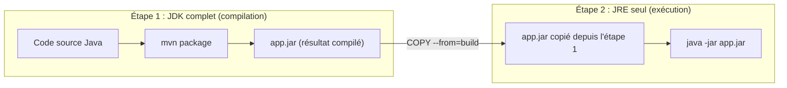

# Chapitre 39 — Étude de cas : Java Spring Boot + PostgreSQL

**Niveau : Avancé**

---

## Introduction

Première vraie étude de cas de la Partie IX, plus approfondie que le tour d'horizon du chapitre 38. Java pose un défi de taille d'image particulièrement marqué : le JDK complet (nécessaire pour compiler) pèse largement plus que le JRE seul (suffisant pour exécuter) — le multi-stage build, déjà vu trois fois dans ce manuel (React au chapitre 15, un backend générique au chapitre 25, NestJS au chapitre 38), y trouve sa démonstration la plus spectaculaire.

---

## 🎯 Objectifs pédagogiques

À la fin de ce chapitre, tu sauras :
- expliquer la différence entre JDK (compilation) et JRE (exécution), et pourquoi elle justifie un multi-stage build encore plus impérieux qu'ailleurs ;
- mettre en cache les dépendances Maven avec `mvn dependency:go-offline`, l'équivalent Java du patron `COPY package.json` du chapitre 7 ;
- configurer une application Spring Boot via des variables d'environnement, grâce à la convention de "relaxed binding" de Spring ;
- assembler un `compose.yaml` complet avec PostgreSQL et un healthcheck basé sur Spring Actuator.

## 📋 Prérequis

Chapitres 17 (PostgreSQL), 21 (healthchecks), 25 (multi-stage backend), 38.

## Pourquoi ce chapitre est important

Java reste un langage massivement utilisé en entreprise — un développeur capable de le dockeriser aussi rigoureusement que Node.js élargit considérablement le périmètre de projets qu'il peut prendre en charge.

---

## Concepts fondamentaux

1. **JDK vs JRE** — le multi-stage build à son maximum d'utilité.
2. **Cache Maven** — `mvn dependency:go-offline`.
3. **Relaxed binding Spring** — variables d'environnement sans code additionnel.
4. **Spring Actuator** — un healthcheck déjà fourni par le framework.

---

## 39.1 JDK vs JRE : le multi-stage build à son maximum d'utilité

> 📌 **À retenir, un principe déjà vu trois fois, ici à son paroxysme** — Le **JDK** (Java Development Kit) contient le compilateur et tous les outils nécessaires pour **construire** une application Java. Le **JRE** (Java Runtime Environment) ne contient que ce qui est nécessaire pour **exécuter** un programme Java déjà compilé — sans jamais pouvoir le recompiler. La différence de taille entre les deux est significative, rendant le multi-stage build (chapitre 15, section 15.2 ; chapitre 25, section 25.4 ; chapitre 38, section 38.3) particulièrement rentable ici — le même principe qu'avec Node.js (`node_modules` de développement vs production) ou React (outillage de build vs fichiers statiques), appliqué à un écart encore plus marqué.



---

## 39.2 Dockerfile multi-stage : Maven → JRE

```dockerfile
# Étape 1 : construction avec Maven (JDK complet)
FROM maven:3.9-eclipse-temurin-21 AS build
WORKDIR /app
COPY pom.xml ./
RUN mvn dependency:go-offline
COPY src/ ./src/
RUN mvn package -DskipTests

# Étape 2 : exécution avec le JRE seul
FROM eclipse-temurin:21-jre-alpine
WORKDIR /app
COPY --from=build /app/target/*.jar app.jar
RUN addgroup -S spring && adduser -S spring -G spring
USER spring
EXPOSE 8080
HEALTHCHECK --interval=15s --timeout=3s --start-period=30s \
  CMD wget -qO- http://localhost:8080/actuator/health || exit 1
ENTRYPOINT ["java", "-jar", "app.jar"]
```

**Explication, ligne par ligne :**
```text
FROM maven:3.9-eclipse-temurin-21 AS build
→ une image officielle combinant Maven (l'outil de build Java le plus courant)
  et le JDK 21 (via la distribution Eclipse Temurin, un OpenJDK largement adopté)

COPY pom.xml ./
RUN mvn dependency:go-offline
→ RAPPEL DIRECT du chapitre 7 : copier d'abord le fichier de déclaration
  des dépendances (ici, pom.xml, l'équivalent Java de package.json) et
  télécharger les dépendances AVANT de copier le code source — le cache
  de build (chapitre 7) reste valide tant que pom.xml ne change pas,
  même si le code source change à chaque commit

COPY src/ ./src/
RUN mvn package -DskipTests
→ copie le code source SEULEMENT ensuite, puis compile ("package")
  en un fichier .jar exécutable ("-DskipTests" : accélère le build
  en sautant les tests unitaires à cette étape — un choix à débattre
  selon le contexte du projet, mentionné ici pour être transparent,
  pas présenté comme une règle universelle)

FROM eclipse-temurin:21-jre-alpine
→ la DEUXIÈME étape repart d'une image totalement différente,
  ne contenant QUE le JRE (pas Maven, pas le JDK, pas le code source
  non compilé) — variante "alpine" pour la légèreté (chapitre 5)

COPY --from=build /app/target/*.jar app.jar
→ ne récupère QUE le fichier .jar final depuis l'étape "build"
  (rappel exact du mécanisme du chapitre 15, section 15.2)

RUN addgroup -S spring && adduser -S spring -G spring
USER spring
→ crée un utilisateur non-root DÉDIÉ (rappel chapitre 6, section 6.7 ;
  chapitre 26) — l'image "eclipse-temurin" n'inclut pas d'utilisateur
  applicatif prêt à l'emploi comme le fait l'image officielle Node.js
```

---

## 39.3 `application.properties` via variables d'environnement (relaxed binding)

Spring Boot offre une convention élégante : toute propriété de `application.properties` peut être surchargée par une variable d'environnement, sans aucune modification de code.

```properties
# [src/main/resources/application.properties]
spring.datasource.url=${SPRING_DATASOURCE_URL}
spring.datasource.username=${SPRING_DATASOURCE_USERNAME}
spring.datasource.password=${SPRING_DATASOURCE_PASSWORD}
```

```yaml
# [compose.yaml, extrait]
services:
  backend:
    build: ./backend
    environment:
      SPRING_DATASOURCE_URL: jdbc:postgresql://db:5432/app
      SPRING_DATASOURCE_USERNAME: app_user
      SPRING_DATASOURCE_PASSWORD: ${DB_PASSWORD}
```

**Explication :** Spring transforme automatiquement `SPRING_DATASOURCE_URL` (convention majuscules-underscore, la norme des variables d'environnement, chapitre 9) en la propriété `spring.datasource.url` — c'est le mécanisme dit de **relaxed binding**, propre à Spring. Contrairement à Node.js, où lire `process.env.VARIABLE` est un choix explicite écrit dans le code (chapitre 9), Spring effectue cette correspondance **automatiquement**, sans qu'aucune ligne de code Java ne soit nécessaire pour "aller chercher" la variable.

---

## 39.4 Healthcheck via Spring Actuator

```xml
<!-- [pom.xml, dépendance à ajouter] -->
<dependency>
    <groupId>org.springframework.boot</groupId>
    <artifactId>spring-boot-starter-actuator</artifactId>
</dependency>
```

**Explication :** Spring Boot Actuator fournit, prête à l'emploi, une route `/actuator/health` — exactement le type de route de santé que ce manuel construit manuellement depuis le chapitre 14 (`GET /health`) pour chaque projet. Le `HEALTHCHECK` de la section 39.2 s'appuie directement dessus, sans rien construire de plus.

---

## 39.5 `compose.yaml` complet

```yaml
services:
  db:
    image: postgres:16
    environment:
      POSTGRES_USER: app_user
      POSTGRES_PASSWORD: ${DB_PASSWORD}
      POSTGRES_DB: app
      PGDATA: /var/lib/postgresql/data/pgdata
    volumes:
      - db-data:/var/lib/postgresql/data
    healthcheck:
      test: ["CMD-SHELL", "pg_isready -U app_user -d app"]
      interval: 5s
      timeout: 3s
      retries: 5

  backend:
    build: ./backend
    environment:
      SPRING_DATASOURCE_URL: jdbc:postgresql://db:5432/app
      SPRING_DATASOURCE_USERNAME: app_user
      SPRING_DATASOURCE_PASSWORD: ${DB_PASSWORD}
    depends_on:
      db:
        condition: service_healthy
    ports:
      - "8080:8080"

volumes:
  db-data:
```

**Explication :** rien de nouveau ici, seulement l'application directe des chapitres 17 (variables PostgreSQL, `PGDATA`) et 21 (`condition: service_healthy`) à une nouvelle stack.

---

## Erreurs fréquentes (récapitulatif du chapitre)

| Erreur | Cause | Solution |
|---|---|---|
| Image finale volumineuse malgré une apparente optimisation | JDK complet resté dans l'image finale, `FROM ... AS build` non suivi d'une seconde étape JRE | Toujours vérifier que la seconde étape repart bien d'une image JRE, pas JDK |
| `mvn package` refait tout le téléchargement de dépendances à chaque build | `pom.xml` copié en même temps que le code source, cassant le cache | Toujours copier `pom.xml` et exécuter `dependency:go-offline` avant `COPY src/` |
| Variable d'environnement sans effet sur la configuration Spring | Non-respect de la convention de nommage du relaxed binding | Vérifier la correspondance exacte majuscules/underscores ↔ minuscules/points |
| `/actuator/health` renvoie 404 | Dépendance `spring-boot-starter-actuator` absente | L'ajouter au `pom.xml` |

---

## Laboratoire pratique n°1 — Construire et comparer JDK vs JRE

**Objectifs :** exécuter la section 39.2 et mesurer la différence de taille.
**Prérequis :** Chapitre 38.

**Étapes :** construis l'image finale (JRE), puis construis temporairement une version qui resterait sur l'image `maven` (JDK) pour l'exécution — compare les deux tailles avec `docker images`.

**Résultat attendu :** une différence de taille significative, confirmant concrètement l'intérêt du multi-stage pour Java en particulier.

---

## Laboratoire pratique n°2 — Vérifier le cache Maven

**Objectifs :** exécuter et vérifier la section 39.2, le cache spécifiquement.
**Prérequis :** Laboratoire 1 complété.

**Étapes :** modifie uniquement un fichier source Java (pas `pom.xml`), reconstruis, et confirme dans la sortie de `docker build` que l'étape `mvn dependency:go-offline` reste `CACHED` (rappel du chapitre 7).

**Résultat attendu :** confirmation que le patron de cache déjà maîtrisé pour Node.js (chapitre 7) fonctionne à l'identique pour Maven.

---

## Laboratoire pratique n°3 — Assembler et vérifier le projet complet

**Objectifs :** exécuter la section 39.5 de bout en bout.
**Prérequis :** Laboratoires 1 et 2 complétés.

**Étapes :** lance `docker compose up -d --build`, vérifie `docker compose ps` (statut `healthy` pour `db` et `backend`), puis `curl http://localhost:8080/actuator/health`.

**Résultat attendu :** un démarrage fiable, sans la course au démarrage déjà rencontrée aux chapitres 13 et 20, grâce à `condition: service_healthy`.

---

## Exercices

1. Explique la différence entre le JDK et le JRE, et pourquoi cette différence rend le multi-stage build particulièrement rentable pour Java.
2. Quel est l'équivalent Maven du patron `COPY package.json` puis `npm ci` du chapitre 7 ?
3. Qu'est-ce que le "relaxed binding" de Spring, et en quoi diffère-t-il de la lecture explicite de `process.env` en Node.js ?
4. Que fournit Spring Boot Actuator, déjà construit manuellement dans les projets Node.js de ce manuel ?
5. Pourquoi ce chapitre réutilise-t-il directement les patrons PostgreSQL et healthcheck des chapitres 17 et 21, sans les réexpliquer ?

---

## Quiz

**Question 1.** Le JRE, contrairement au JDK :
a) Contient le compilateur Java
b) Ne contient que ce qui est nécessaire pour exécuter un programme déjà compilé
c) Est toujours plus volumineux que le JDK
d) Ne peut jamais exécuter d'application Spring Boot

**Question 2.** `mvn dependency:go-offline`, exécuté après avoir copié uniquement `pom.xml` :
a) N'a aucun rapport avec le cache de build
b) Permet au cache Docker de rester valide tant que `pom.xml` ne change pas, même si le code source change
c) Supprime toutes les dépendances existantes
d) Nécessite une connexion Internet à chaque build, sans exception

**Question 3.** Le relaxed binding de Spring permet :
a) De surcharger une propriété via une variable d'environnement, sans code Java additionnel
b) D'ignorer totalement les variables d'environnement
c) De remplacer PostgreSQL par MySQL automatiquement
d) De compiler l'application plus rapidement

**Question 4.** Spring Boot Actuator fournit notamment :
a) Un compilateur alternatif
b) Une route `/actuator/health` prête à l'emploi pour les healthchecks
c) Un serveur PostgreSQL intégré
d) Un remplacement de Docker Compose

**Question 5.** Le `compose.yaml` de ce chapitre réutilise directement :
a) Un tout nouveau patron jamais vu dans ce manuel
b) Les patrons PostgreSQL (chapitre 17) et healthcheck (chapitre 21) déjà maîtrisés
c) Uniquement des concepts Java, sans lien avec les chapitres précédents
d) Le patron Redis du chapitre 18

> 🔑 **Corrigé** — 1: b · 2: b · 3: a · 4: b · 5: b

---

## 📝 Résumé du chapitre

- Le JDK (compilation) et le JRE (exécution) ont un écart de taille marqué, rendant le multi-stage build particulièrement rentable pour Java — le même principe que pour React ou NestJS, à son maximum d'utilité.
- `mvn dependency:go-offline`, exécuté après avoir copié uniquement `pom.xml`, reproduit exactement le patron de cache de build du chapitre 7 pour l'écosystème Maven.
- Le relaxed binding de Spring transforme automatiquement une variable d'environnement (`SPRING_DATASOURCE_URL`) en propriété de configuration, sans code Java additionnel — une convention différente, mais tout aussi fiable, de la lecture explicite de `process.env` en Node.js.
- Spring Boot Actuator fournit une route de santé prête à l'emploi, directement exploitable par le `HEALTHCHECK` du chapitre 21.
- Ce chapitre n'introduit aucun nouveau concept Docker — il applique, à une nouvelle stack, l'intégralité des patrons déjà maîtrisés.

## ✅ Checklist avant de passer au chapitre 40

- [ ] Je sais expliquer pourquoi Java bénéficie particulièrement du multi-stage build.
- [ ] Je sais mettre en cache les dépendances Maven correctement.
- [ ] Je sais configurer Spring Boot via des variables d'environnement.
- [ ] Je sais utiliser Spring Boot Actuator pour un healthcheck.
- [ ] J'ai réalisé les trois laboratoires de ce chapitre.
- [ ] J'ai obtenu au moins 4/5 au quiz.

---

## Glossaire du chapitre

**JDK / JRE**
Définition simple : le JDK sert à compiler du code Java, le JRE sert seulement à l'exécuter.
Voir : Chapitre 39, section 39.1.

**Relaxed binding (Spring)**
Définition simple : la correspondance automatique entre une variable d'environnement et une propriété de configuration Spring.
Voir : Chapitre 39, section 39.3.

**Spring Boot Actuator**
Définition simple : un module Spring fournissant des routes opérationnelles prêtes à l'emploi, dont une route de santé.
Voir : Chapitre 39, section 39.4.

---

## ❓ FAQ

**Gradle fonctionne-t-il selon le même principe que Maven pour ce chapitre ?**
Oui, avec les commandes propres à Gradle (`gradle build` plutôt que `mvn package`) — le principe du multi-stage et de la mise en cache des dépendances reste identique, seule la syntaxe de l'outil change.

**Pourquoi `-DskipTests` dans la commande de build ?**
Un choix pragmatique pour ce chapitre, à ne pas généraliser aveuglément — dans un vrai pipeline CI/CD (chapitre 31), les tests devraient plutôt être exécutés comme une étape séparée et explicite, avant la construction de l'image, jamais simplement sautés par défaut.

**Le layertools de Spring Boot (mentionné dans certaines documentations) est-il nécessaire ici ?**
C'est une optimisation plus avancée qui découpe le `.jar` lui-même en couches Docker distinctes (dépendances, ressources, code applicatif), pour un cache encore plus fin. Le patron de ce chapitre (un `.jar` unique copié en une fois) reste largement suffisant pour la majorité des projets et volontairement plus simple à comprendre en première approche.

---

## Références officielles

- Image officielle Maven — [hub.docker.com/_/maven](https://hub.docker.com/_/maven)
- Eclipse Temurin (JDK/JRE) — [hub.docker.com/_/eclipse-temurin](https://hub.docker.com/_/eclipse-temurin)
- Spring Boot Actuator — [docs.spring.io/spring-boot/reference/actuator](https://docs.spring.io/spring-boot/reference/actuator/index.html)
- Configuration externalisée Spring Boot — [docs.spring.io/spring-boot/reference/features/external-config.html](https://docs.spring.io/spring-boot/reference/features/external-config.html)

---

## Conclusion

Java, avec ses spécificités (JDK/JRE, Maven, relaxed binding), suit exactement le même raisonnement Docker que toutes les stacks précédentes. Le chapitre 40 conclut la Partie IX avec une dernière étude de cas — Django, assemblé cette fois avec PostgreSQL, Redis et Nginx, l'architecture la plus complète de cette partie.

---

⬅️ [Chapitre 38 — Tour d'horizon par stack](38-tour-dhorizon-par-stack.md) · ➡️ **Suite : Chapitre 40 — Étude de cas : Django + PostgreSQL + Redis + Nginx**
