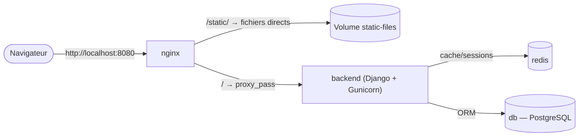

# Chapitre 40 — Étude de cas : Django + PostgreSQL + Redis + Nginx

**Niveau : Avancé**

---

## Introduction

Dernier chapitre de la Partie IX, et l'architecture la plus complète de toutes les études de cas — quatre services : Django (via Gunicorn), PostgreSQL, Redis, et Nginx qui sert les fichiers statiques directement plutôt que de tout faire transiter par l'application. Chaque brique reprend un chapitre déjà maîtrisé ; la nouveauté tient dans la façon dont Django, spécifiquement, les assemble.

---

## 🎯 Objectifs pédagogiques

À la fin de ce chapitre, tu sauras :
- dockeriser une application Django avec Gunicorn, en gérant la compilation du pilote PostgreSQL natif ;
- partager les fichiers statiques Django avec Nginx via un volume, pour qu'ils soient servis directement sans passer par Gunicorn ;
- configurer Redis comme moteur de cache et de sessions Django ;
- appliquer les migrations Django comme une étape de déploiement séparée, conformément au principe du chapitre 36.

## 📋 Prérequis

Chapitres 17 (PostgreSQL), 18 (Redis), 19 (Nginx), 21 (healthchecks), 36 (migrations), 38 (patron Python générique).

## Pourquoi ce chapitre est important

Django reste l'un des frameworks Python les plus utilisés pour des applications web complètes — cette étude de cas assemble, pour la dernière fois de la Partie IX, l'ensemble des patrons déjà maîtrisés dans une architecture à quatre services aussi riche que celle du chapitre 20.

---

## Concepts fondamentaux

1. **Dockerfile Django/Gunicorn** — avec compilation du pilote PostgreSQL.
2. **Fichiers statiques** — servis par Nginx, jamais par Gunicorn.
3. **Redis comme cache et moteur de sessions Django**.
4. **Migrations** — rappel appliqué du chapitre 36.

---

## 40.1 Architecture cible



---

## 40.2 Dockerfile : Django et Gunicorn

```dockerfile
FROM python:3.12-slim
WORKDIR /app

RUN apt-get update && apt-get install -y --no-install-recommends libpq-dev gcc \
    && rm -rf /var/lib/apt/lists/*

COPY requirements.txt ./
RUN pip install --no-cache-dir -r requirements.txt
COPY . .

RUN addgroup --system django && adduser --system --group django
USER django

EXPOSE 8000
HEALTHCHECK --interval=10s --timeout=3s CMD python -c \
  "import urllib.request; urllib.request.urlopen('http://localhost:8000/health/')" || exit 1

CMD ["sh", "-c", "python manage.py collectstatic --noinput && gunicorn --bind 0.0.0.0:8000 --workers 3 monprojet.wsgi:application"]
```

**Explication, avec les rappels de chapitres précédents :**
```text
RUN apt-get install -y --no-install-recommends libpq-dev gcc && rm -rf /var/lib/apt/lists/*
→ RAPPEL DIRECT du chapitre 25 (section 25.2) : nettoyage combiné dans la
  MÊME instruction que l'installation. "libpq-dev" et "gcc" sont nécessaires
  pour COMPILER "psycopg2" (le pilote PostgreSQL natif pour Python) — un cas
  concret du problème de compatibilité "musl vs glibc" évoqué au chapitre 25,
  ici avec "slim" (basé sur Debian) plutôt qu'Alpine, précisément pour
  éviter des complications de compilation de ce pilote natif

USER django
→ RAPPEL du chapitre 6/26 : un utilisateur non-root dédié, l'image Python
  officielle n'en fournissant pas par défaut (contrairement à l'image Node.js)

CMD ["sh", "-c", "python manage.py collectstatic --noinput && gunicorn ..."]
→ "collectstatic" (détaillé en 40.3) s'exécute À CHAQUE DÉMARRAGE du
  conteneur, une opération idempotente et rapide, AVANT le lancement de
  Gunicorn — noter que les MIGRATIONS, elles, ne sont PAS incluses ici
  (rappel du chapitre 36, section 40.5)
```

---

## 40.3 Fichiers statiques : servis par Nginx, jamais par Gunicorn

> ✅ **Bonne pratique, rappel du chapitre 19** — Gunicorn (comme tout serveur d'application) est optimisé pour exécuter du code Python, pas pour servir efficacement des fichiers statiques (CSS, JavaScript, images) — exactement la même logique que le chapitre 15, où Nginx sert le résultat compilé de React plutôt que Node.js. Django fournit une commande dédiée, `collectstatic`, qui rassemble tous les fichiers statiques du projet dans un seul dossier (`STATIC_ROOT`), prêt à être servi directement.

```yaml
# [compose.yaml, extrait]
services:
  backend:
    build: ./backend
    volumes:
      - static-files:/app/staticfiles
    environment:
      DATABASE_URL: postgresql://app_user:${DB_PASSWORD}@db:5432/app
      REDIS_URL: redis://redis:6379/1
    depends_on:
      db:
        condition: service_healthy
      redis:
        condition: service_healthy

  nginx:
    build: ./nginx
    volumes:
      - static-files:/app/staticfiles:ro
    ports:
      - "8080:80"
    depends_on:
      - backend

volumes:
  static-files:
```

```nginx
# [nginx/nginx.conf]
server {
    listen 80;

    location /static/ {
        alias /app/staticfiles/;
        expires 1y;
        add_header Cache-Control "public, immutable";
    }

    location / {
        proxy_pass http://backend:8000;
        proxy_set_header Host $host;
        proxy_set_header X-Real-IP $remote_addr;
        proxy_set_header X-Forwarded-For $proxy_add_x_forwarded_for;
        proxy_set_header X-Forwarded-Proto $scheme;
    }
}
```

**Explication :** le volume `static-files` (chapitre 10) est **partagé** entre `backend` (qui l'écrit, via `collectstatic` au démarrage) et `nginx` (qui le lit, en lecture seule `:ro`) — deux conteneurs distincts, communiquant via un volume commun plutôt que via le réseau, un patron déjà rencontré pour les scripts d'initialisation MySQL/PostgreSQL (chapitres 16-17) mais appliqué ici à des fichiers applicatifs plutôt qu'à des scripts SQL.

---

## 40.4 Redis pour le cache et les sessions Django

```python
# [monprojet/settings.py, extrait]
import os

CACHES = {
    "default": {
        "BACKEND": "django_redis.cache.RedisCache",
        "LOCATION": os.environ["REDIS_URL"],
    }
}

SESSION_ENGINE = "django.contrib.sessions.backends.cache"
SESSION_CACHE_ALIAS = "default"
```

**Explication :** rappel direct du chapitre 18 — Redis sert ici à la fois de **cache** (via `django-redis`) et de **moteur de sessions**, évitant de stocker les sessions utilisateur directement dans PostgreSQL (le comportement par défaut de Django), une pratique courante pour réduire la charge sur la base relationnelle.

---

## 40.5 Migrations : rappel appliqué du chapitre 36

> ⚠️ **Attention — cohérence directe avec le chapitre 36** — Les migrations Django (`python manage.py migrate`) ne figurent **volontairement pas** dans le `CMD` du Dockerfile (section 40.2), pour la même raison que le chapitre 36 : les exécuter au démarrage de **chaque** conteneur créerait une course dangereuse dès que plusieurs instances du backend démarrent simultanément (rappel du chapitre 35, mise à l'échelle).

```bash
# [Terminal] — étape de déploiement séparée, explicite (rappel chapitre 32, cycle Backup → ... → Deploy)
docker compose exec backend python manage.py migrate
```

> 📌 **À retenir** — Ce script, comme au chapitre 36, s'intègre naturellement comme une étape dédiée d'un pipeline CI/CD (chapitre 31), exécutée **une seule fois** par déploiement, jamais implicitement à chaque démarrage de conteneur.

---

## 40.6 Assembler et vérifier

```bash
# [Terminal]
docker compose up -d --build
docker compose exec backend python manage.py migrate
```

```bash
# [Terminal] — vérifications
curl http://localhost:8080/health/
curl -I http://localhost:8080/static/admin/css/base.css   # servi directement par Nginx
docker compose ps                                          # db, redis, backend : (healthy)
```

**Résultat attendu :** l'application répond, les fichiers statiques se chargent sans passer par Gunicorn (vérifiable via les logs de Nginx vs ceux du backend, rappel chapitre 22), et les migrations ont été appliquées explicitement.

---

## Erreurs fréquentes (récapitulatif du chapitre)

| Erreur | Cause | Solution |
|---|---|---|
| Échec de construction sur l'installation de `psycopg2` | `libpq-dev`/`gcc` absents de l'image | Les ajouter, combinés avec le nettoyage (section 40.2) |
| Fichiers CSS/JS de l'admin Django introuvables (404) | `collectstatic` jamais exécuté, ou volume non partagé avec Nginx | Vérifier le volume `static-files` monté des deux côtés |
| Sessions perdues entre deux requêtes | Redis mal configuré, ou `REDIS_URL` absente | Vérifier `CACHES`/`SESSION_ENGINE` et la variable d'environnement correspondante |
| Nouvelle table absente après un déploiement | Migration jamais appliquée explicitement | Toujours exécuter `python manage.py migrate` comme étape séparée (section 40.5) |

---

## Laboratoire pratique n°1 — Construire l'image Django avec son pilote PostgreSQL

**Objectifs :** exécuter la section 40.2.
**Prérequis :** Chapitre 38.

**Étapes :** construis l'image, vérifie que `psycopg2` s'installe sans erreur, confirme le healthcheck `(healthy)`.

**Résultat attendu :** une image construite avec succès, avec un utilisateur non-root confirmé (`docker exec ... whoami`, rappel chapitre 23).

---

## Laboratoire pratique n°2 — Vérifier le partage des fichiers statiques

**Objectifs :** exécuter et vérifier la section 40.3.
**Prérequis :** Laboratoire 1 complété.

**Étapes :** lance la stack complète, confirme via `docker compose logs nginx` (rappel chapitre 22) qu'une requête vers `/static/...` n'apparaît **jamais** dans les logs de `backend`, uniquement dans ceux de `nginx`.

**Résultat attendu :** confirmation que les fichiers statiques sont bien servis directement par Nginx, sans jamais solliciter Gunicorn.

---

## Laboratoire pratique n°3 — Assembler les quatre services et appliquer les migrations

**Objectifs :** exécuter la section 40.6 de bout en bout.
**Prérequis :** Laboratoires 1 et 2 complétés.

**Étapes :** lance la stack complète, applique les migrations séparément, vérifie le fonctionnement du cache Redis (par exemple via une vue Django qui met en cache un résultat, comme au chapitre 18).

**Résultat attendu :** une architecture à quatre services entièrement fonctionnelle et vérifiée, cohérente avec tous les principes déjà appris.

---

## Exercices

1. Pourquoi `libpq-dev` et `gcc` sont-ils nécessaires pour installer `psycopg2`, et pourquoi ce chapitre utilise-t-il `slim` plutôt qu'Alpine pour cette raison ?
2. Pourquoi les fichiers statiques Django sont-ils servis par Nginx plutôt que par Gunicorn ?
3. Comment le volume `static-files` permet-il à deux conteneurs distincts de partager des fichiers ?
4. Pourquoi `collectstatic` peut-il rester dans le `CMD` du conteneur, mais pas `migrate` ?
5. Quel rôle Redis joue-t-il dans cette architecture Django, au-delà du simple cache ?

---

## Quiz

**Question 1.** `libpq-dev` et `gcc` dans le Dockerfile Django servent à :
a) Accélérer Gunicorn
b) Permettre la compilation du pilote PostgreSQL natif `psycopg2`
c) Installer Redis
d) Configurer Nginx

**Question 2.** Les fichiers statiques Django sont servis par Nginx plutôt que par Gunicorn parce que :
a) Gunicorn ne peut techniquement pas les servir
b) Nginx est optimisé pour ce rôle, exactement le même principe qu'au chapitre 15 pour React
c) Django l'interdit explicitement
d) Cela n'a aucune importance en pratique

**Question 3.** Le volume `static-files`, partagé entre `backend` et `nginx` :
a) N'a aucun rapport avec le chapitre 10
b) Permet à deux conteneurs distincts d'accéder aux mêmes fichiers
c) Chiffre automatiquement les fichiers statiques
d) N'est nécessaire qu'en développement

**Question 4.** `migrate` n'est volontairement pas inclus dans le `CMD` du conteneur backend parce que :
a) Django ne le permet pas techniquement
b) Cela créerait une course dangereuse avec plusieurs instances démarrant simultanément
c) `collectstatic` le fait automatiquement
d) Les migrations Django n'existent pas

**Question 5.** Dans cette architecture, Redis sert :
a) Uniquement de base de données principale
b) De cache et de moteur de sessions Django
c) À remplacer entièrement PostgreSQL
d) À servir les fichiers statiques

> 🔑 **Corrigé** — 1: b · 2: b · 3: b · 4: b · 5: b

---

## 📝 Résumé du chapitre

- L'installation de `psycopg2` nécessite des outils de compilation (`libpq-dev`, `gcc`), un cas concret du problème de compatibilité native déjà évoqué au chapitre 25.
- Les fichiers statiques Django (`collectstatic`) sont servis directement par Nginx, jamais par Gunicorn — le même principe que React (chapitre 15), appliqué via un volume partagé plutôt qu'un multi-stage build.
- Redis, configuré via `django-redis`, sert de cache et de moteur de sessions Django, réduisant la charge sur PostgreSQL.
- Les migrations Django restent, comme au chapitre 36, une étape de déploiement séparée et explicite, jamais intégrée au démarrage automatique de chaque conteneur.

## ✅ Checklist avant de passer à la Partie X

- [ ] Je sais dockeriser Django avec Gunicorn et son pilote PostgreSQL natif.
- [ ] Je sais partager les fichiers statiques entre Django et Nginx via un volume.
- [ ] Je sais configurer Redis comme cache et moteur de sessions Django.
- [ ] J'applique les migrations comme une étape séparée, jamais intégrée au démarrage du conteneur.
- [ ] J'ai réalisé les trois laboratoires de ce chapitre.
- [ ] J'ai obtenu au moins 4/5 au quiz.

---

## Glossaire du chapitre

**`collectstatic`**
Définition simple : la commande Django qui rassemble tous les fichiers statiques du projet dans un seul dossier prêt à être servi.
Voir : Chapitre 40, section 40.3.

**`psycopg2`**
Définition simple : le pilote PostgreSQL natif le plus utilisé pour Python, nécessitant une compilation.
Voir : Chapitre 40, section 40.2.

---

## ❓ FAQ

**Pourquoi ne pas utiliser un multi-stage build pour copier les fichiers statiques dans l'image Nginx directement, comme au chapitre 15 ?**
C'est une alternative possible et parfois utilisée, mais elle exigerait de combiner les contextes de build de Django et Nginx dans un seul Dockerfile, plus complexe à maintenir que deux services séparés partageant un volume — ce chapitre choisit la solution la plus largement documentée et la plus simple à faire évoluer indépendamment.

**Ce Dockerfile Django est-il compatible avec un déploiement CI/CD comme au chapitre 31 ?**
Oui, directement — la seule adaptation est l'ajout d'une étape `docker compose exec backend python manage.py migrate` dans le pipeline de déploiement, exactement comme illustré au chapitre 36 pour Prisma.

**Faut-il obligatoirement Gunicorn, ou un serveur ASGI (Uvicorn) conviendrait-il pour Django ?**
Django reste principalement synchrone (WSGI) sauf usage explicite de ses fonctionnalités asynchrones plus récentes — Gunicorn reste le choix par défaut le plus courant et le plus documenté pour la majorité des projets Django.

---

## Références officielles

- Déploiement Django — fichiers statiques — [docs.djangoproject.com/en/stable/howto/static-files/deployment](https://docs.djangoproject.com/en/stable/howto/static-files/deployment/)
- `django-redis` — [github.com/jazzband/django-redis](https://github.com/jazzband/django-redis)
- Gunicorn — [docs.gunicorn.org](https://docs.gunicorn.org)

---

## Conclusion

La Partie IX se termine avec quatre stacks dockerisées en profondeur (Node.js, React, Java, Django), chacune confirmant le même raisonnement fondamental appris depuis le chapitre 1. La Partie X met maintenant tout ce savoir en pratique, à travers six projets progressifs, du plus simple au plus complet.

---

⬅️ [Chapitre 39 — Java Spring Boot](39-etude-de-cas-java-spring-boot.md) · ➡️ **Suite : Chapitre 41 — Projet 1 : premier contact (Nginx seul)**
