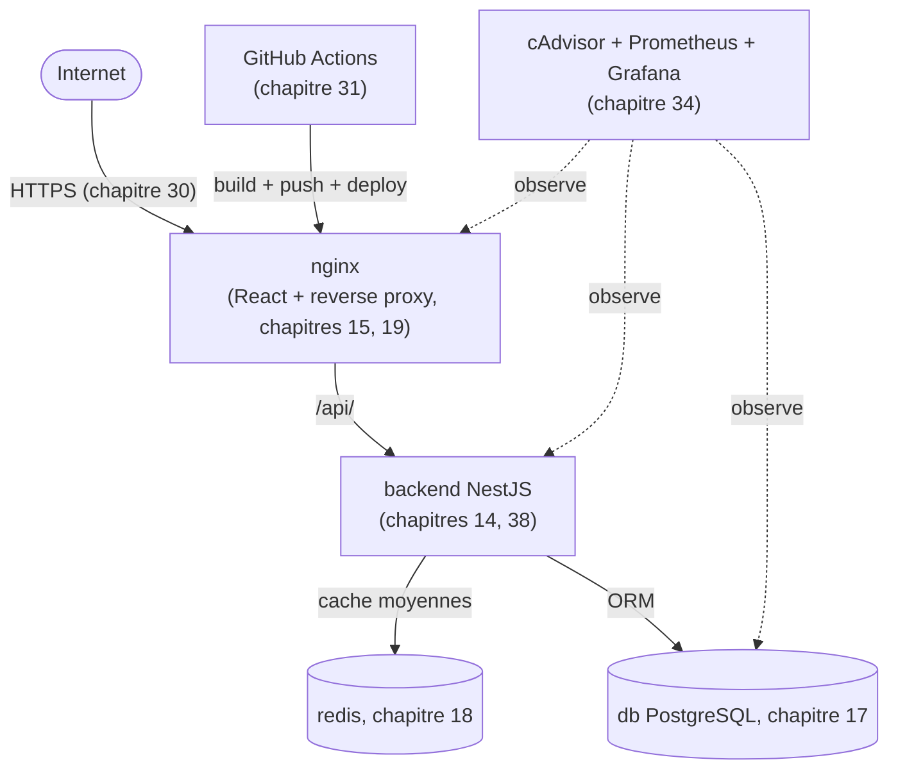

# Chapitre 47 — Projet final : système de gestion scolaire, du projet vide à la production

**Niveau : Avancé**

---

## Introduction

Ce chapitre referme la Partie X et tout le manuel avec un projet fil rouge complet : un système de gestion scolaire simplifié (élèves, classes, notes), construit du dossier vide jusqu'à une production automatisée, en HTTPS, surveillée et sauvegardée. Un domaine métier différent des six projets précédents, mais **exactement la même méthode** — l'occasion de vérifier que cette méthode, pas seulement le code recopié, est réellement acquise.

---

## 🎯 Objectif du projet

Un système de gestion scolaire avec : liste des élèves par classe, saisie de notes, calcul de moyenne — architecture Internet → HTTPS → Nginx → React + API NestJS → PostgreSQL + Redis, surveillée et déployée automatiquement.

## 📋 Prérequis

L'intégralité des Parties I à X.

## Pourquoi ce chapitre est important

C'est le test final de ce manuel : appliquer, sans guidage détaillé étape par étape comme aux chapitres précédents, l'ensemble des réflexes acquis à un domaine métier jamais rencontré dans ce livre.

---

## Cahier des charges complet

```text
1. Modèle de données : Classe, Élève, Matière, Note
2. API NestJS : CRUD élèves/classes, saisie de notes, calcul de moyenne par élève
3. Frontend React : liste des classes, fiche élève avec ses notes et sa moyenne
4. PostgreSQL pour les données, Redis pour le cache des moyennes calculées
5. Nginx : reverse proxy unique, sert le frontend
6. HTTPS via Let's Encrypt, domaine réel
7. Sauvegardes automatisées et testées
8. Monitoring de base (cAdvisor + Prometheus + Grafana)
9. CI/CD complet avec GitHub Actions
10. Sécurité conforme aux checklists des chapitres 25-26
```

---

## 47.1 Architecture complète



---

## 47.2 Parcours complet, chapitre par chapitre

| Étape | Ce qui est fait | Chapitre(s) |
|---|---|---|
| 1 | Modèle de données PostgreSQL (Classe, Élève, Matière, Note) | 17, 36 (migrations) |
| 2 | API NestJS multi-stage, `USER` non-root, `.dockerignore` | 14, 25, 38 |
| 3 | Cache Redis des moyennes, avec invalidation à l'écriture | 18, 20 |
| 4 | Frontend React, multi-stage, URL relative `/api` | 15, 20 |
| 5 | Nginx : reverse proxy, en-têtes, compression, `try_files` | 19 |
| 6 | Assemblage Compose complet, réseau et volumes | 10, 11, 12, 13 |
| 7 | Healthchecks sur chaque service, `condition: service_healthy` | 21 |
| 8 | Logs consultables, diagnostic de base | 22, 23 |
| 9 | Sécurité : `cap_drop`, `read_only`, secrets BuildKit si nécessaire | 26 |
| 10 | Environnements dev/test/prod séparés | 28 |
| 11 | VPS préparé, Docker installé | 29 |
| 12 | Domaine et HTTPS | 30 |
| 13 | CI/CD complet, double tag versionné | 31, 32 |
| 14 | Sauvegardes PostgreSQL automatisées et testées | 33, 36 |
| 15 | Monitoring cAdvisor/Prometheus/Grafana | 34 |
| 16 | Limites de ressources dimensionnées | 35 |

> 📌 **À retenir** — Ce tableau n'est rien d'autre que le sommaire de ce manuel, relu dans l'ordre d'exécution d'un vrai projet plutôt que dans l'ordre pédagogique d'apprentissage — la preuve que les 46 chapitres précédents forment un tout cohérent, pas une collection de sujets isolés.

---

## 47.3 Modèle de données (rappel des chapitres 17 et 36)

```sql
-- [prisma/migrations/.../migration.sql, généré par "prisma migrate dev"]
CREATE TABLE classes (id SERIAL PRIMARY KEY, nom VARCHAR(50) NOT NULL);
CREATE TABLE eleves (id SERIAL PRIMARY KEY, nom VARCHAR(100) NOT NULL, classe_id INT REFERENCES classes(id));
CREATE TABLE matieres (id SERIAL PRIMARY KEY, nom VARCHAR(50) NOT NULL, bareme INT NOT NULL DEFAULT 20);
CREATE TABLE notes (id SERIAL PRIMARY KEY, eleve_id INT REFERENCES eleves(id), matiere_id INT REFERENCES matieres(id), valeur DECIMAL(4,2) NOT NULL);
```

---

## 47.4 API NestJS avec cache de moyenne (rappel des chapitres 18, 20, 38)

```typescript
// [backend/src/eleves/eleves.service.ts, extrait]
async getMoyenne(eleveId: number) {
  const cle = `moyenne:${eleveId}`;
  const enCache = await this.redis.get(cle);
  if (enCache) return { source: "cache", moyenne: parseFloat(enCache) };

  const notes = await this.prisma.note.findMany({ where: { eleveId } });
  const moyenne = notes.reduce((s, n) => s + n.valeur, 0) / notes.length;
  await this.redis.set(cle, moyenne.toString(), "EX", 300);
  return { source: "postgresql", moyenne };
}

async ajouterNote(eleveId: number, data: CreerNoteDto) {
  const note = await this.prisma.note.create({ data: { eleveId, ...data } });
  await this.redis.del(`moyenne:${eleveId}`); // rappel chapitre 20 : invalidation à l'écriture
  return note;
}
```

---

## 47.5 `compose.yaml` de base

```yaml
services:
  db:
    image: postgres:16
    environment:
      POSTGRES_USER: ${DB_USER}
      POSTGRES_PASSWORD: ${DB_PASSWORD}
      POSTGRES_DB: ${DB_NAME}
      PGDATA: /var/lib/postgresql/data/pgdata
    volumes:
      - db-data:/var/lib/postgresql/data
    healthcheck:
      test: ["CMD-SHELL", "pg_isready -U ${DB_USER} -d ${DB_NAME}"]
      interval: 5s
      timeout: 3s
      retries: 5
    cap_drop: ["ALL"]

  redis:
    image: redis:7
    command: redis-server --requirepass ${REDIS_PASSWORD}
    volumes:
      - redis-data:/data
    healthcheck:
      test: ["CMD-SHELL", "redis-cli -a ${REDIS_PASSWORD} ping | grep PONG"]
      interval: 5s
      timeout: 3s
      retries: 5

  backend:
    build:
      context: ./backend
      target: production
    environment:
      DATABASE_URL: postgresql://${DB_USER}:${DB_PASSWORD}@db:5432/${DB_NAME}
      REDIS_URL: redis://:${REDIS_PASSWORD}@redis:6379
    depends_on:
      db:
        condition: service_healthy
      redis:
        condition: service_healthy
    healthcheck:
      test: ["CMD-SHELL", "wget -qO- http://localhost:4000/health || exit 1"]
      interval: 10s
      timeout: 3s
      start_period: 10s
    cap_drop: ["ALL"]
    read_only: true
    tmpfs: ["/tmp"]
    deploy:
      resources:
        limits:
          cpus: '0.75'
          memory: 512M

  nginx:
    build:
      context: ./frontend
      args:
        VITE_API_URL: /api
    depends_on:
      backend:
        condition: service_healthy

volumes:
  db-data:
  redis-data:
```

`compose.override.yaml` (développement, fusion automatique — rappel chapitre 28) et `compose.prod.yaml` (production, `image:` + `ports` + `restart: unless-stopped` + certbot — rappel chapitres 28, 30, 31) suivent exactement les patrons déjà construits aux chapitres 44-46, non reproduits ici pour éviter la répétition.

---

## 47.6 Pipeline CI/CD (rappel du chapitre 46)

Identique au workflow du chapitre 46, adapté aux noms d'images de ce projet — double tag `:latest`/`:${{ github.sha }}`, migration `prisma migrate deploy` comme étape séparée, déploiement SSH.

---

## 47.7 Monitoring et sauvegardes (rappel des chapitres 33-34)

```bash
# [backup.sh, sur le serveur — identique au chapitre 45]
docker compose exec -T db pg_dump -U "$DB_USER" "$DB_NAME" | gzip > "backups/ecole-$(date +%Y%m%d-%H%M%S).sql.gz"
```

```yaml
# [compose.monitoring.yml — identique au chapitre 34]
services:
  cadvisor: { image: gcr.io/cadvisor/cadvisor:v0.49.1, ... }
  prometheus: { image: prom/prometheus:v2.53.0, ... }
  grafana: { image: grafana/grafana:11.1.0, ... }
```

---

## 47.8 Vérification finale complète

```bash
# [Terminal, depuis n'importe quelle machine]
curl -I https://ecole-exemple.ht/
curl https://ecole-exemple.ht/api/eleves
```

```bash
# [Terminal, sur le serveur]
docker compose ps          # tous les services "healthy"
docker compose logs --tail 50
```

**Résultat attendu :** l'application complète, accessible en HTTPS, avec des données réelles, un déploiement automatisé, surveillée et sauvegardée.

---

## Grande checklist finale (synthèse de tout le manuel)

- [ ] Chaque image utilise un tag précis, jamais `latest` seul (chapitre 5).
- [ ] Chaque Dockerfile applique la checklist du chapitre 25.
- [ ] Chaque service applique la checklist sécurité du chapitre 26.
- [ ] Aucun secret n'est en dur dans un Dockerfile ou un fichier versionné (chapitres 9, 26).
- [ ] Seul Nginx publie un port vers l'hôte (chapitres 8, 11, 20).
- [ ] Chaque service critique a un `HEALTHCHECK` cohérent (chapitre 21).
- [ ] `depends_on: condition: service_healthy` élimine toute course au démarrage (chapitre 21).
- [ ] Les environnements dev/test/prod sont strictement séparés (chapitre 28).
- [ ] HTTPS est actif, avec un renouvellement automatique vérifié (chapitre 30).
- [ ] Le déploiement est entièrement automatisé, avec un rollback prêt (chapitres 31, 32).
- [ ] Les sauvegardes sont automatisées ET testées par restauration réelle (chapitre 33).
- [ ] Le monitoring de base est en place, avec au moins une alerte fonctionnelle (chapitre 34).
- [ ] Les limites de ressources sont dimensionnées, pas laissées par défaut (chapitre 35).
- [ ] Les migrations sont appliquées comme une étape séparée, jamais au démarrage du conteneur (chapitre 36).

---

## Laboratoire pratique n°1 — Construire le projet complet, du dossier vide

**Objectifs :** exécuter l'intégralité des sections 47.3 à 47.5, en autonomie.
**Prérequis :** Parties I à IX entières.

**Résultat attendu :** une application fonctionnelle en local, tous les services `(healthy)`.

---

## Laboratoire pratique n°2 — Déployer en production complète

**Objectifs :** exécuter les sections 47.6-47.7.
**Prérequis :** Laboratoire 1 complété.

**Résultat attendu :** l'application accessible en HTTPS, surveillée, sauvegardée, déployée automatiquement.

---

## Laboratoire pratique n°3 — Audit final selon la grande checklist

**Objectifs :** valider l'intégralité de la checklist finale, sans exception.
**Prérequis :** Laboratoires 1 et 2 complétés.

**Résultat attendu :** un projet entièrement conforme à tout ce que ce manuel a enseigné.

---

## Conclusion

Du dossier vide (chapitre 7) jusqu'à une application en production, surveillée, sauvegardée et déployée automatiquement — la même méthode, appliquée cette fois sans guidage détaillé, à un domaine métier inédit. Le manuel entre maintenant dans sa dernière partie : un catalogue de 50 pannes réelles, pour être prêt le jour où quelque chose casse.

---

⬅️ [Chapitre 46 — Projet 6 : CI/CD complet](46-projet-6-cicd-complet.md) · ➡️ **Suite : Chapitre 48 — Dépannage : catalogue de 50 pannes réelles**
