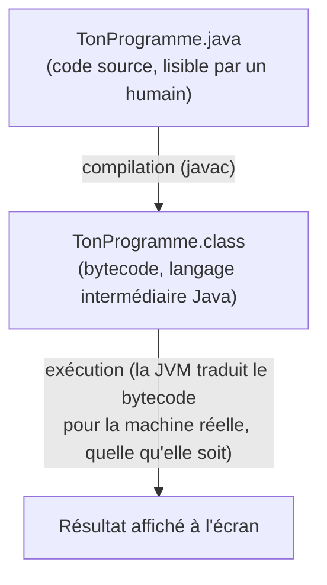

<div class="chapitre-titre-num">CHAPITRE 1</div>

# Bienvenue dans le monde de la programmation

## Objectifs pédagogiques

À la fin de ce chapitre, tu sauras expliquer avec tes propres mots ce qu'est un programme et un langage de programmation, tu sauras ce qu'est Java et où il est utilisé dans le monde réel, et tu auras écrit et compris ton tout premier programme Java.

Bienvenue. Si tu ouvres ce manuel sans jamais avoir écrit une seule ligne de code, tu es exactement là où il faut être. On part de zéro, vraiment de zéro, et on avance lentement, une brique à la fois.

---

## 1.1 Qu'est-ce qu'un programme ?

### A. Le problème

Un ordinateur, tout seul, ne sait rien faire. Il ne sait pas calculer une facture, afficher une photo, ni envoyer un message. Il a besoin qu'on lui donne, dans le moindre détail, la suite exacte des actions à effectuer.

### B. Exemple de la vie réelle

Pense à une recette de cuisine. Une recette est une suite d'instructions précises, dans un ordre précis :

```text
1. Faire bouillir 1 litre d'eau.
2. Ajouter une pincée de sel.
3. Verser 200 grammes de riz.
4. Attendre 18 minutes.
5. Retirer du feu.
```

Si tu inverses l'ordre (par exemple, retirer du feu avant d'avoir versé le riz), le résultat ne sera pas celui attendu. Une recette ne devine rien : elle décrit chaque étape, sans en sauter aucune.

### C. Explication très simple

> Un **programme** est une suite d'instructions, écrites dans un ordre précis, qu'un ordinateur exécute une par une pour accomplir une tâche.

Exactement comme une recette de cuisine, sauf que celui qui « cuisine » ici, c'est l'ordinateur, et les instructions doivent être écrites dans un langage qu'il comprend parfaitement, sans la moindre ambiguïté.

## 1.2 Qu'est-ce qu'un langage de programmation ?

### B. Exemple de la vie réelle

Si tu veux donner des instructions à quelqu'un qui ne parle pas ta langue, tu dois soit apprendre sa langue, soit trouver un interprète. Un ordinateur, au fond, ne comprend directement qu'un seul « langage » : des suites de 0 et de 1 (on appelle ça le **langage machine**). Écrire directement en 0 et 1 serait épuisant et quasiment impossible pour un humain.

### C. Explication très simple

> Un **langage de programmation** est un langage intermédiaire, lisible par un humain (avec des mots comme `if`, `class`, `print`), qui est ensuite automatiquement traduit vers le langage que l'ordinateur comprend réellement.

Il existe des centaines de langages de programmation : Python, JavaScript, C, C++, PHP, Java... Chacun a ses forces, ses usages typiques, et sa façon d'écrire les instructions. Ce manuel t'enseigne **Java**.

## 1.3 Qu'est-ce que Java ?

**Java** est un langage de programmation créé en 1995 par une entreprise appelée Sun Microsystems (rachetée depuis par Oracle). Il est aujourd'hui l'un des langages les plus utilisés au monde, en particulier pour construire de grosses applications professionnelles fiables et durables.

<div class="encadre astuce">
<span class="encadre-titre">💡 Pourquoi le nom "Java" ?</span>
L'histoire (souvent racontée par ses créateurs eux-mêmes) veut que le nom vienne tout simplement... du café. L'équipe qui a créé le langage buvait beaucoup de café originaire de l'île de Java, en Indonésie. C'est aussi pour ça que le logo de Java est une tasse de café fumante.
</div>

La particularité la plus importante de Java tient dans sa devise historique : **« Write Once, Run Anywhere »** (« écris une fois, exécute partout »). Un programme Java écrit sur un ordinateur Windows peut, sans le modifier, fonctionner sur Mac, sur Linux, ou sur un serveur professionnel. On explique **comment** c'est possible à la section 1.5, une fois que tu auras vu ton premier programme.

## 1.4 Où utilise-t-on Java ?

Java n'est pas un langage réservé aux étudiants ou aux exercices d'école. Il fait tourner une part énorme des systèmes informatiques du monde réel, aujourd'hui même.

- **Java dans les entreprises.** La très grande majorité des grandes banques, compagnies d'assurance, administrations publiques et entreprises de télécommunications dans le monde utilisent Java pour leurs systèmes internes (gestion des comptes, facturation, paie...). Sa stabilité et sa robustesse sur le long terme en font un choix privilégié pour du logiciel qui doit fonctionner sans interruption pendant des décennies.
- **Java pour Android.** Pendant longtemps, Java a été le langage officiel de développement des applications Android (le système d'exploitation mobile de Google, présent sur la majorité des téléphones dans le monde). Depuis 2017, Google recommande un nouveau langage nommé Kotlin pour les nouveaux projets Android — mais Kotlin partage énormément de concepts avec Java (il tourne d'ailleurs sur la même machine virtuelle, expliquée en 1.5), et un nombre gigantesque d'applications Android existantes restent écrites en Java pur. Comprendre Java reste donc un vrai atout, même côté mobile.
- **Java côté serveur.** Quand tu utilises un site web ou une application mobile, une partie du travail (vérifier ton mot de passe, enregistrer ta commande, calculer un prix) se déroule sur un ordinateur distant appelé un **serveur**, que tu ne vois jamais. Une part très importante de ces serveurs, dans le monde professionnel, tourne avec du code Java (souvent avec un outil très populaire nommé Spring, que tu pourras explorer une fois ce manuel terminé — voir l'Annexe D).
- **Java dans les applications professionnelles.** Logiciels de gestion, outils métiers internes aux entreprises, systèmes bancaires, plateformes e-commerce à grande échelle : Java reste, encore aujourd'hui, l'un des choix les plus fréquents dès qu'une application doit être fiable, maintenue pendant des années, et travaillée par de grandes équipes de développeurs en parallèle.

<div class="encadre vocabulaire">
<span class="encadre-titre">📖 Terme : Serveur</span>
Un <strong>serveur</strong> est simplement un ordinateur (souvent situé dans un centre de données, à distance) dont le rôle est de répondre aux demandes d'autres ordinateurs ou applications, en général via Internet. Quand ton téléphone envoie un message, il communique avec un serveur qui le fait suivre au bon destinataire.
</div>

## 1.5 Comment Java fonctionne réellement

C'est ici que se cache le secret du « écris une fois, exécute partout ».

Un programme Java n'est **pas directement traduit** vers le langage propre à Windows, ou à Mac, ou à Linux. Il est d'abord traduit vers un langage intermédiaire, propre à Java, qu'on appelle le **bytecode**. Ce bytecode est ensuite exécuté par un programme spécial installé sur chaque ordinateur, appelé la **JVM** (Java Virtual Machine, « machine virtuelle Java »).



Chaque système d'exploitation (Windows, Mac, Linux) a sa propre version de la JVM, capable de comprendre ce même bytecode. C'est cette étape intermédiaire qui permet au **même** fichier compilé de fonctionner partout, sans jamais réécrire le code source.

<div class="encadre vocabulaire">
<span class="encadre-titre">📖 Terme : Compilation</span>
La <strong>compilation</strong> est l'étape où un programme spécial (le <strong>compilateur</strong>, pour Java il s'appelle <code>javac</code>) lit ton code source et vérifie qu'il ne contient aucune erreur de syntaxe, avant de le traduire en bytecode. Si ton code contient une faute (un mot-clé mal orthographié, un point-virgule oublié), la compilation s'arrête avec un message d'erreur, et rien ne s'exécute.
</div>

Retiens seulement l'essentiel pour l'instant : tu écris ton code, Java le compile, puis la JVM l'exécute. Tu n'as rien à faire manuellement pour que cela fonctionne sur un autre système : c'est tout l'intérêt de Java.

## 1.6 Ton premier programme Java

Assez de théorie : il est temps d'écrire du vrai code. On va construire ce programme **progressivement**, étape par étape, pour bien voir à quoi sert chaque morceau.

**Étape 1 — Une classe vide.** En Java, absolument tout le code doit vivre à l'intérieur d'une **classe** (ce mot sera expliqué en profondeur à partir du chapitre 9 — pour l'instant, retiens juste que c'est une case obligatoire, un peu comme une enveloppe dans laquelle on range tout le reste).

```java
public class Main {

}
```

**Étape 2 — Le point d'entrée.** Un programme Java a besoin d'un endroit précis où commencer à s'exécuter. Cet endroit s'appelle toujours `main` :

```java
public class Main {
    public static void main(String[] args) {

    }
}
```

**Étape 3 — Une première instruction.** On ajoute une instruction qui affiche du texte à l'écran :

```java
public class Main {
    public static void main(String[] args) {
        System.out.println("Bonjour !");
    }
}
```

Ce programme, une fois exécuté, affiche simplement :

```text
Bonjour !
```

C'est ton tout premier programme Java. Il ne fait pas grand-chose, mais tu viens de comprendre la structure minimale que **chaque** programme Java devra respecter, du plus simple au plus complexe.

## 1.7 Explication ligne par ligne

Reprenons le programme complet, et décortiquons chaque morceau :

```{.uml}
public class Main {
  │      │     │
  │      │     └─ Nom de la classe. On choisit ce nom (ici "Main", une convention
  │      │        très courante pour un premier programme). Une règle stricte de
  │      │        Java : si la classe est "public", le fichier DOIT s'appeler
  │      │        exactement Main.java.
  │      │
  │      └─ Mot-clé qui annonce : "ce qui suit est une classe".
  │
  └─ Mot-clé qui rend la classe accessible depuis l'extérieur du fichier
     (détaillé au chapitre 11, sur l'encapsulation).

    public static void main(String[] args) {
      │      │      │    │      │
      │      │      │    │      └─ Les arguments que le programme pourrait recevoir
      │      │      │    │         au lancement, depuis l'extérieur (une notion
      │      │      │    │         avancée, ignorable pour l'instant).
      │      │      │    │
      │      │      │    └─ Nom de la méthode. "main" est OBLIGATOIRE et intouchable :
      │      │      │       c'est ici, et nulle part ailleurs, que la JVM commence
      │      │      │       à exécuter ton programme.
      │      │      │
      │      │      └─ "void" veut dire que cette méthode ne renvoie aucun résultat
      │      │         (le chapitre 7 détaille les méthodes qui, elles, renvoient
      │      │         un résultat).
      │      │
      │      └─ "static" veut dire que cette méthode appartient à la classe
      │         elle-même, et non à un objet précis créé à partir d'elle
      │         (la différence sera très claire après le chapitre 9).
      │
      └─ Accessible depuis l'extérieur, comme pour la classe.

        System.out.println("Bonjour !");
          │      │    │           │
          │      │    │           └─ Le texte à afficher, entre guillemets.
          │      │    │
          │      │    └─ "println" ("print line") : affiche le texte, puis passe
          │      │       à la ligne suivante.
          │      │
          │      └─ "out" représente la sortie standard : concrètement, l'écran
          │         du terminal où le programme affiche ses résultats.
          │
          └─ "System" est une classe fournie par Java lui-même, qui donne accès
             à des outils de base, comme l'affichage à l'écran.
```

Ne cherche pas à tout retenir par cœur dès maintenant. `public`, `static`, `void`, les classes : chacun de ces mots reviendra dans les chapitres suivants, expliqué en détail, avec le temps nécessaire pour vraiment le comprendre.

## 1.8 Comment exécuter ce programme

Pour transformer ton fichier `Main.java` en programme qui s'exécute réellement, deux étapes (que ton IDE — chapitre 40 — effectue en général automatiquement en un clic) :

```{.uml}
1. Compilation :   javac Main.java     →  produit Main.class (bytecode)
2. Exécution :     java Main           →  la JVM exécute Main.class
```

Tu n'as pas besoin d'installer quoi que ce soit pour comprendre ce manuel dans un premier temps : le chapitre 40 t'accompagnera pas à pas dans l'installation d'un environnement de travail complet (IntelliJ IDEA ou VS Code) quand tu seras prêt à passer à la pratique sur ta propre machine.

## Erreurs fréquentes

<div class="encadre attention">
<span class="encadre-titre">⚠️ Erreur n°1 — Le nom du fichier ne correspond pas au nom de la classe</span>

```java
// Fichier enregistré sous "Bonjour.java"
public class Main { // ❌ erreur : le nom de la classe publique doit être "Bonjour"
    public static void main(String[] args) {
        System.out.println("Bonjour !");
    }
}
```

Java exige que le nom du fichier corresponde **exactement**, lettre pour lettre et majuscule pour majuscule, au nom de la classe publique qu'il contient.
</div>

<div class="encadre attention">
<span class="encadre-titre">⚠️ Erreur n°2 — Oublier une accolade</span>

```java
public class Main {
    public static void main(String[] args) {
        System.out.println("Bonjour !");
    } // ❌ il manque l'accolade fermante de la classe Main
```

Chaque accolade ouvrante `{` doit avoir sa accolade fermante `}` correspondante. Un éditeur de code digne de ce nom (chapitre 40) les met automatiquement en surbrillance pour t'aider à repérer ce genre d'oubli.
</div>

<div class="encadre attention">
<span class="encadre-titre">⚠️ Erreur n°3 — Faute de frappe sur println</span>

```java
System.out.printLn("Bonjour !"); // ❌ erreur : "printLn" n'existe pas, c'est "println" (l minuscule)
```

Java est sensible à la casse (majuscules/minuscules) sur absolument tous les noms, y compris ceux fournis par Java lui-même.
</div>

<div class="encadre progression">
<span class="encadre-titre">🎯 CE QUE TU SAIS MAINTENANT</span>

```text
✓ Je sais expliquer ce qu'est un programme et un langage de programmation.
✓ Je sais ce qu'est Java et dans quels contextes professionnels il est utilisé.
✓ Je comprends, au moins dans les grandes lignes, comment la JVM permet à
  Java de fonctionner sur n'importe quel système.
✓ J'ai écrit et compris mon tout premier programme Java, ligne par ligne.
```
</div>

## Petit exercice

<div class="encadre exercice">
<span class="encadre-titre">📝 Vérifie ta compréhension</span>

Sans regarder le chapitre, essaie d'expliquer avec tes propres mots à quoi sert la JVM, et pourquoi elle permet à Java de fonctionner « partout ».
</div>

**Correction :** La JVM (Java Virtual Machine) est le programme, propre à chaque système d'exploitation, qui sait exécuter le bytecode produit par la compilation d'un programme Java. Comme le code source n'est jamais traduit directement vers un système précis, mais toujours vers ce bytecode intermédiaire, le même fichier compilé fonctionne sur n'importe quel ordinateur possédant une JVM installée, que ce soit Windows, Mac ou Linux.

## Défi

<div class="encadre defi">
<span class="encadre-titre">🧩 Défi — À toi de jouer</span>

Modifie le programme de la section 1.6 pour qu'il affiche, sur trois lignes distinctes (donc trois appels à `System.out.println`), ton prénom, ta ville, et un objectif que tu as en ce moment.
</div>

### Corrigé du défi

```java
public class Main {
    public static void main(String[] args) {
        System.out.println("Jaslin");
        System.out.println("Pignon");
        System.out.println("Devenir développeur Java professionnel");
    }
}
```

## Résumé du chapitre

- Un **programme** est une suite d'instructions précises exécutées dans l'ordre par un ordinateur, comme une recette de cuisine.
- Un **langage de programmation** est un intermédiaire lisible par un humain, traduit ensuite vers ce que l'ordinateur comprend réellement.
- **Java**, créé en 1995, est massivement utilisé aujourd'hui dans les entreprises, sur Android, côté serveur et dans les applications professionnelles.
- Un programme Java est **compilé** en bytecode, puis exécuté par la **JVM**, ce qui lui permet de tourner sur n'importe quel système sans être réécrit.
- Chaque programme Java a besoin d'une classe et d'une méthode `main`, le point de départ obligatoire de toute exécution.

---

## Exercices de fin de chapitre

<div class="encadre exercice">
<span class="encadre-titre">📝 Niveau 1 — Facile</span>

Vrai ou faux : un programme Java compilé sur Windows doit être recompilé pour fonctionner sur Mac.
</div>

**Corrigé :** Faux. Une fois compilé en bytecode, le même fichier `.class` peut être exécuté sur n'importe quel système possédant une JVM, sans recompilation. C'est tout le principe du « Write Once, Run Anywhere ».

<div class="encadre exercice">
<span class="encadre-titre">📝 Niveau 2 — Intermédiaire</span>

Remets ces quatre étapes dans le bon ordre : (a) la JVM exécute le bytecode, (b) le compilateur javac vérifie le code et produit le bytecode, (c) tu écris du code Java dans un fichier .java, (d) le programme affiche un résultat à l'écran.
</div>

**Corrigé :** c → b → a → d. On écrit le code source, on le compile en bytecode, la JVM exécute ce bytecode, ce qui produit un résultat observable.

<div class="encadre exercice">
<span class="encadre-titre">📝 Niveau 3 — Défi</span>

Sans exécuter de code, prédis ce qu'affichera ce programme, ligne par ligne, puis explique ton raisonnement en une phrase par ligne :

```java
public class Main {
    public static void main(String[] args) {
        System.out.println("Debut du programme");
        System.out.println("Je suis en train d'apprendre Java");
        System.out.println("Fin du programme");
    }
}
```
</div>

**Corrigé :**
```text
Debut du programme
Je suis en train d'apprendre Java
Fin du programme
```
Chaque `System.out.println` s'exécute l'un après l'autre, dans l'ordre exact où il apparaît dans le code, en affichant son texte suivi d'un passage à la ligne — exactement comme les étapes numérotées d'une recette de cuisine.

---

*Chapitre suivant : les variables, pour apprendre à faire retenir des informations à ton programme, la toute première brique indispensable avant de pouvoir écrire quoi que ce soit d'utile.*
