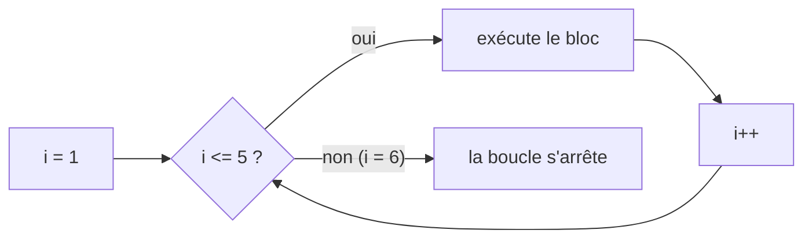

<div class="chapitre-titre-num">CHAPITRE 6</div>

# Les boucles

## Objectifs pédagogiques

À la fin de ce chapitre, tu sauras répéter automatiquement une action avec `for`, `while`, `do while` et `for-each`, et tu sauras choisir la bonne boucle selon la situation.

## A. Le problème

Imagine devoir afficher les nombres de 1 à 100. Avec ce qu'on sait jusqu'ici, il faudrait écrire 100 lignes de `System.out.println`, une par une. Non seulement c'est fastidieux, mais si on te demande d'aller jusqu'à 1000, il faudrait tout réécrire. Un programme a besoin d'un moyen de dire : *« répète cette action tant qu'une condition reste vraie »*.

## B. Exemple de la vie réelle

Pense à un professeur qui fait l'appel dans une classe. Il ne dit pas 30 fois, une par une, une phrase différente écrite à l'avance. Il applique la **même action** (« appeler le nom, cocher présent ou absent ») à chaque étudiant de la liste, l'un après l'autre, jusqu'à ce que la liste soit terminée. C'est exactement le principe d'une boucle.

## C. Explication très simple

> Une **boucle** répète un bloc d'instructions tant qu'une condition reste vraie, ou pour chaque élément d'une collection de valeurs.

Java propose quatre types de boucles ; on les voit une par une, de la plus courante à la plus spécialisée.

## D. La boucle for

```java
for (int i = 1; i <= 5; i++) {
    System.out.println("Tour numéro " + i);
}
```

Résultat :
```text
Tour numéro 1
Tour numéro 2
Tour numéro 3
Tour numéro 4
Tour numéro 5
```

## E. Explication ligne par ligne

```{.uml}
for ( int i = 1 ; i <= 5 ; i++ ) {
       │           │        │
       │           │        └─ INCRÉMENT : exécuté à la fin de CHAQUE tour.
       │           │           "i++" veut dire "augmente i de 1" (raccourci de "i = i + 1").
       │           │
       │           └─ CONDITION : vérifiée AVANT chaque tour. Tant qu'elle est vraie,
       │              la boucle continue. Dès qu'elle devient fausse, la boucle s'arrête.
       │
       └─ INITIALISATION : exécutée UNE SEULE FOIS, avant le tout premier tour.
          Crée une variable "compteur" (ici "i", un nom très conventionnel
          pour une boucle, abréviation d'"index" ou "iteration").
```

L'ordre réel d'exécution est : **initialisation** (une fois) → **condition** (vérifiée) → si vraie : **bloc** → **incrément** → retour à la condition → ... jusqu'à ce que la condition devienne fausse.



## F. Deuxième exemple : parcourir un tableau avec for

```java
public class SommeNotes {
    public static void main(String[] args) {
        int[] notes = {12, 15, 9, 18, 14};
        int somme = 0;

        for (int i = 0; i < notes.length; i++) {
            somme = somme + notes[i];
        }

        System.out.println("Somme des notes : " + somme); // 68
        double moyenne = (double) somme / notes.length;
        System.out.println("Moyenne : " + moyenne); // 13.6
    }
}
```

<div class="encadre astuce">
<span class="encadre-titre">💡 Pourquoi i < notes.length et pas i <= notes.length ?</span>
Un tableau de 5 éléments a des indices de <code>0</code> à <code>4</code> (chapitre 3). <code>notes.length</code> vaut <code>5</code>. Avec <code>i &lt; notes.length</code>, la boucle parcourt exactement <code>i = 0, 1, 2, 3, 4</code> — tous les indices valides. Avec <code>i &lt;= notes.length</code>, elle irait jusqu'à <code>i = 5</code>, qui n'existe pas : <code>ArrayIndexOutOfBoundsException</code> garantie.
</div>

## La boucle for-each

Quand on veut simplement parcourir **chaque élément** d'un tableau (sans avoir besoin de son indice), `for-each` est plus simple et plus sûr :

```java
int[] notes = {12, 15, 9, 18, 14};

for (int note : notes) {
    System.out.println("Note : " + note);
}
```

Se lit : *« pour chaque `note` dans `notes` »*. Java se charge lui-même de parcourir tous les indices, sans qu'on ait à écrire `i` ni à risquer un dépassement.

## La boucle while

```java
int compteur = 1;

while (compteur <= 5) {
    System.out.println("Compteur : " + compteur);
    compteur++;
}
```

`while` répète le bloc tant que sa condition reste vraie, mais **sans** initialisation ni incrément intégrés à sa syntaxe : c'est à toi de les gérer explicitement. On l'utilise surtout quand on ne connaît pas à l'avance le nombre exact de répétitions (par exemple, répéter tant que l'utilisateur n'a pas entré une valeur correcte).

<div class="encadre attention">
<span class="encadre-titre">⚠️ Erreur n°1 — La boucle infinie</span>

```java
int compteur = 1;
while (compteur <= 5) {
    System.out.println("Compteur : " + compteur);
    // ❌ oubli de compteur++ : la condition reste TOUJOURS vraie
}
```

Sans mise à jour de la variable testée par la condition, `while` ne s'arrête **jamais** — le programme semble "figé" (en réalité, il tourne à l'infini). C'est l'erreur la plus dangereuse de ce chapitre : toujours vérifier que la condition finira, un jour, par devenir fausse.
</div>

## La boucle do while

```java
int tentative = 0;

do {
    tentative++;
    System.out.println("Tentative numéro " + tentative);
} while (tentative < 3);
```

La différence avec `while` : le bloc de `do while` s'exécute **au moins une fois**, même si la condition est fausse dès le départ, car la condition n'est vérifiée qu'**après** le premier passage. `while` classique, lui, peut ne s'exécuter **zéro fois** si sa condition est fausse dès le début.

```{.uml}
while (condition) { ... }        →  condition testée AVANT : peut s'exécuter 0 fois
do { ... } while (condition);    →  condition testée APRÈS : s'exécute AU MOINS 1 fois
```

## Erreurs fréquentes

<div class="encadre attention">
<span class="encadre-titre">⚠️ Erreur n°2 — Off-by-one (se tromper d'une unité sur les bornes)</span>

```java
for (int i = 1; i <= notes.length; i++) { // ❌ i peut atteindre notes.length, indice invalide !
    System.out.println(notes[i]); // 💥 ArrayIndexOutOfBoundsException au dernier tour
}
```

Une des erreurs les plus fréquentes de toute la programmation, tous langages confondus. La règle sûre pour parcourir un tableau par indice : toujours commencer à `0` et s'arrêter strictement avant `length`, avec `<`, jamais `<=`.
</div>

<div class="encadre attention">
<span class="encadre-titre">⚠️ Erreur n°3 — Modifier la variable de boucle à l'intérieur du bloc</span>

```java
for (int i = 0; i < 5; i++) {
    System.out.println(i);
    i = i + 2; // ❌ perturbe le comptage prévu par l'incrément du for
}
```

Modifier manuellement la variable de boucle en plus de son incrément automatique rend le comportement difficile à prévoir et à relire. Sauf besoin très précis et volontaire, laisse le `for` gérer seul sa variable via sa clause d'incrément.
</div>

<div class="encadre progression">
<span class="encadre-titre">🎯 CE QUE TU SAIS MAINTENANT</span>

```text
✓ Je sais répéter une action un nombre de fois connu avec for.
✓ Je sais parcourir chaque élément d'un tableau avec for-each.
✓ Je sais répéter une action tant qu'une condition reste vraie avec while.
✓ Je connais la différence entre while (0 fois possible) et do while (1 fois minimum).
✓ Je sais éviter les boucles infinies et les erreurs de bornes (off-by-one).
```
</div>

## Petit exercice

<div class="encadre exercice">
<span class="encadre-titre">📝 Vérifie ta compréhension</span>

Écris une boucle `for` qui affiche uniquement les nombres pairs de 1 à 10 (aide-toi de l'opérateur modulo vu au chapitre 4).
</div>

## Correction

```java
for (int i = 1; i <= 10; i++) {
    if (i % 2 == 0) {
        System.out.println(i);
    }
}
// Affiche : 2 4 6 8 10
```

`i % 2 == 0` est vrai uniquement quand `i` est divisible par 2 sans reste, c'est-à-dire pair.

## Défi

<div class="encadre defi">
<span class="encadre-titre">🧩 Défi — À toi de jouer</span>

Écris un programme qui déclare un tableau `int[] ventes` d'au moins 5 valeurs, puis calcule et affiche la vente **maximale** du tableau, en utilisant une boucle `for` (sans utiliser de fonction toute faite).
</div>

### Corrigé du défi

```java
public class VenteMaximale {
    public static void main(String[] args) {
        int[] ventes = {1200, 850, 2300, 1750, 990};
        int maximum = ventes[0]; // on part de la première valeur

        for (int i = 1; i < ventes.length; i++) {
            if (ventes[i] > maximum) {
                maximum = ventes[i];
            }
        }

        System.out.println("Vente maximale : " + maximum); // 2300
    }
}
```

On initialise `maximum` avec le **premier** élément (pas `0`, qui serait faux si toutes les ventes étaient négatives), puis on compare chaque élément suivant : dès qu'on en trouve un plus grand, il devient le nouveau maximum. Ce schéma ("initialiser avec le premier élément, comparer tous les suivants") est un des tout premiers algorithmes classiques à maîtriser.

## Résumé du chapitre

- `for` répète un bloc un nombre de fois **connu à l'avance**, avec initialisation, condition et incrément regroupés.
- `for-each` parcourt chaque élément d'un tableau, sans gérer d'indice.
- `while` répète tant qu'une condition reste vraie, en gérant soi-même l'initialisation et la mise à jour.
- `do while` fonctionne comme `while`, mais garantit au moins un passage dans le bloc.
- Toujours vérifier que la condition d'une boucle finira par devenir fausse, sous peine de boucle infinie.

---

## Exercices de fin de chapitre

<div class="encadre exercice">
<span class="encadre-titre">📝 Niveau 1 — Facile</span>

Écris une boucle `for` qui affiche les nombres de 10 à 1, dans l'ordre décroissant (un compte à rebours).
</div>

**Corrigé :**
```java
for (int i = 10; i >= 1; i--) {
    System.out.println(i);
}
```
`i--` diminue `i` de 1 à chaque tour (l'inverse de `i++`) ; la boucle continue tant que `i >= 1`, donc s'arrête juste après avoir affiché `1`.

<div class="encadre exercice">
<span class="encadre-titre">📝 Niveau 2 — Intermédiaire</span>

Écris une boucle qui calcule la somme de tous les nombres **pairs** de 1 à 20 (aide-toi de l'opérateur modulo du chapitre 4).
</div>

**Corrigé :**
```java
int somme = 0;
for (int i = 1; i <= 20; i++) {
    if (i % 2 == 0) {
        somme += i;
    }
}
System.out.println("Somme des nombres pairs : " + somme); // 110
```

<div class="encadre exercice">
<span class="encadre-titre">📝 Niveau 3 — Défi</span>

Écris une méthode `estPremier(int nombre)` qui renvoie `true` si `nombre` est un nombre premier (un entier supérieur à 1, divisible uniquement par 1 et par lui-même), `false` sinon. Utilise une boucle qui teste chaque diviseur possible entre 2 et `nombre - 1`.
</div>

**Corrigé :**
```java
static boolean estPremier(int nombre) {
    if (nombre <= 1) {
        return false;
    }
    for (int diviseur = 2; diviseur < nombre; diviseur++) {
        if (nombre % diviseur == 0) {
            return false; // un diviseur trouvé : nombre n'est PAS premier
        }
    }
    return true; // aucun diviseur trouvé jusqu'ici : nombre EST premier
}
```
Dès qu'un diviseur exact est trouvé (`nombre % diviseur == 0`), `return false` arrête immédiatement la méthode (chapitre 7) : inutile de continuer à tester les diviseurs suivants. Si la boucle se termine entièrement sans jamais trouver de diviseur, le nombre est premier.

---

*Chapitre suivant : les méthodes, la dernière brique avant la POO — pour apprendre à découper ton code en morceaux réutilisables, nommés, qu'on peut appeler autant de fois qu'on veut.*
