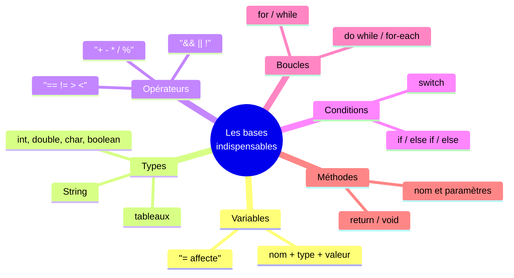

<div class="chapitre-titre-num">CHAPITRE 7</div>

# Les méthodes

## Objectifs pédagogiques

À la fin de ce chapitre, tu sauras découper ton code en blocs nommés et réutilisables, avec ou sans paramètres, avec ou sans valeur de retour — la dernière étape avant d'entrer dans la Programmation Orientée Objet.

## A. Le problème

Imagine devoir calculer, à plusieurs endroits différents d'un même programme, la moyenne d'un tableau de notes. Sans un moyen de "nommer" et réutiliser ce calcul, il faudrait recopier les mêmes lignes de boucle à chaque endroit — et si un jour tu corriges une erreur dans ce calcul, il faudrait la corriger partout où tu l'as recopiée, en espérant n'en oublier aucune.

## B. Exemple de la vie réelle

Pense à une action que tu sais faire, comme « préparer du café ». Tu ne réinventes pas cette action à chaque fois : tu la connais sous un nom (« préparer du café »), tu peux la réaliser autant de fois que tu veux, et elle peut légèrement varier selon ce qu'on te donne (du café fort ou léger) tout en gardant le même principe général.

## C. Explication très simple

> Une **méthode** est un bloc d'instructions nommé, qu'on peut exécuter (on dit **appeler**) autant de fois qu'on veut, avec éventuellement des informations en entrée (**paramètres**) et un résultat en sortie (**valeur de retour**).

## D. Premier exemple Java

```java
static void direBonjour() {
    System.out.println("Bonjour !");
}
```

Et pour l'utiliser, dans `main` :

```java
public class Main {
    public static void main(String[] args) {
        direBonjour();
        direBonjour();
        direBonjour();
    }

    static void direBonjour() {
        System.out.println("Bonjour !");
    }
}
```

Résultat : `"Bonjour !"` s'affiche trois fois, sans jamais réécrire trois fois le `System.out.println`.

## E. Explication ligne par ligne

```{.uml}
static void direBonjour() {
  │      │        │      │
  │      │        │      └─ Le bloc d'instructions de la méthode.
  │      │        │
  │      │        └─ Les parenthèses : là où on met les paramètres
  │      │           (ici, vides : cette méthode n'en prend aucun).
  │      │
  │      └─ Le nom de la méthode, choisi par toi. Convention Java :
  │         toujours en minuscule, plusieurs mots collés en "camelCase"
  │         (direBonjour, pas DireBonjour ni dire_bonjour).
  │
  └─ "void" : cette méthode ne renvoie AUCUN résultat, elle effectue
     seulement une action (ici, afficher du texte).

     direBonjour();
            │      │
            │      └─ Parenthèses vides : on n'envoie aucune information.
            └─ APPEL de la méthode : exécute son bloc d'instructions.
```

`static` sera expliqué en profondeur au chapitre 9 : retiens pour l'instant que c'est nécessaire pour qu'une méthode soit appelable directement depuis `main` (lui-même `static`), sans passer par un objet.

## F. Deuxième exemple : paramètres et valeur de retour

```java
static int additionner(int a, int b) {
    return a + b;
}

public class Main {
    public static void main(String[] args) {
        int resultat = additionner(5, 3);
        System.out.println(resultat); // 8

        System.out.println(additionner(10, 20)); // 30, sans variable intermédiaire
    }
}
```

```{.uml}
static int additionner(int a, int b) {
       │       │            │      │
       │       │            │      └─ Deuxième PARAMÈTRE : une "boîte" nommée b,
       │       │            │         remplie par la DEUXIÈME valeur envoyée à l'appel.
       │       │            │
       │       │            └─ Premier PARAMÈTRE : une "boîte" nommée a, remplie
       │       │               par la PREMIÈRE valeur envoyée à l'appel.
       │       │
       │       └─ Le nom de la méthode.
       │
       └─ TYPE DE RETOUR : indique que cette méthode va RENVOYER un int.
          (au lieu de "void", qui ne renvoyait rien).

    return a + b;
      │       │
      │       └─ La valeur effectivement renvoyée à l'endroit où la méthode a été appelée.
      └─ Mot-clé qui arrête immédiatement la méthode et renvoie une valeur.
```

<div class="encadre vocabulaire">
<span class="encadre-titre">📖 Terme : Paramètre vs Argument</span>
Un <strong>paramètre</strong> est le nom utilisé <em>dans la définition</em> de la méthode (<code>a</code> et <code>b</code> ci-dessus). Un <strong>argument</strong> est la valeur réelle envoyée <em>lors de l'appel</em> (<code>5</code> et <code>3</code> dans <code>additionner(5, 3)</code>). Les deux mots sont souvent utilisés l'un pour l'autre dans la conversation courante, mais cette distinction précise est utile à connaître.
</div>

<div class="encadre astuce">
<span class="encadre-titre">💡 return arrête immédiatement la méthode</span>
Dès qu'une instruction <code>return</code> s'exécute, la méthode s'arrête net, même s'il reste du code écrit après elle. Une méthode déclarée avec un type de retour (comme <code>int</code>) DOIT obligatoirement passer par un <code>return</code> sur tous ses chemins d'exécution possibles, sinon Java refuse de compiler.
</div>

## Un exemple avec plusieurs paramètres et de la logique

```java
static String determinerMention(double note) {
    if (note >= 16) {
        return "Très Bien";
    } else if (note >= 14) {
        return "Bien";
    } else if (note >= 10) {
        return "Admis";
    } else {
        return "Non admis";
    }
}

public class Main {
    public static void main(String[] args) {
        System.out.println(determinerMention(17.5)); // Très Bien
        System.out.println(determinerMention(8.0));  // Non admis
    }
}
```

Remarque : ici, chaque branche du `if / else if / else` se termine par son propre `return` — c'est une manière tout à fait valide de garantir qu'un `return` s'exécutera toujours, quelle que soit la valeur de `note`.

## Erreurs fréquentes

<div class="encadre attention">
<span class="encadre-titre">⚠️ Erreur n°1 — Oublier le return dans une méthode qui doit renvoyer une valeur</span>

```java
static int carre(int nombre) {
    int resultat = nombre * nombre;
    // ❌ erreur de compilation : "missing return statement"
}
```

Une méthode déclarée avec un type de retour autre que `void` doit **toujours** se terminer par un `return` sur chaque chemin possible. Java vérifie ça à la compilation, pas seulement à l'exécution.
</div>

<div class="encadre attention">
<span class="encadre-titre">⚠️ Erreur n°2 — Confondre le nom du paramètre et l'argument envoyé</span>

```java
static void afficherAge(int age) {
    System.out.println("Âge : " + age);
}

public class Main {
    public static void main(String[] args) {
        int age = 30; // une variable dans main, NOMMÉE PAREIL que le paramètre
        afficherAge(25); // ❌ piège de débutant : on envoie 25, PAS la variable "age" de main !
        // Affiche "Âge : 25", pas "Âge : 30"
    }
}
```

Le nom `age` dans `main` et le nom `age` (paramètre) dans `afficherAge` sont deux variables **totalement indépendantes**, même si elles portent le même nom par coïncidence. C'est la **valeur envoyée à l'appel** qui compte, pas le nom de la variable d'origine (si elle existe).
</div>

<div class="encadre attention">
<span class="encadre-titre">⚠️ Erreur n°3 — Croire qu'une méthode modifie la variable d'origine (paramètres primitifs)</span>

```java
static void doubler(int nombre) {
    nombre = nombre * 2;
}

public class Main {
    public static void main(String[] args) {
        int valeur = 5;
        doubler(valeur);
        System.out.println(valeur); // 5, PAS 10 !
    }
}
```

Pour un type primitif (`int`, `double`, `boolean`...), Java envoie toujours une **copie** de la valeur à la méthode. Modifier `nombre` à l'intérieur de `doubler` ne modifie donc **jamais** la variable `valeur` d'origine dans `main`. Ce comportement changera pour les objets, expliqué au chapitre 9 (références d'objets).
</div>

<div class="encadre progression">
<span class="encadre-titre">🎯 CE QUE TU SAIS MAINTENANT</span>

```text
✓ Je sais créer une méthode avec ou sans paramètres.
✓ Je sais créer une méthode qui renvoie une valeur avec return.
✓ Je connais la différence entre un paramètre et un argument.
✓ Je sais qu'une méthode int/double/boolean/String doit toujours finir par un return.
✓ Je comprends qu'un paramètre primitif reçoit une COPIE, jamais la variable d'origine.
```
</div>

## Petit exercice

<div class="encadre exercice">
<span class="encadre-titre">📝 Vérifie ta compréhension</span>

Écris une méthode `estMajeur(int age)` qui renvoie `true` si `age >= 18`, `false` sinon.
</div>

## Correction

```java
static boolean estMajeur(int age) {
    return age >= 18;
}
```

Remarque : pas besoin de `if/else` ici. `age >= 18` est déjà, en elle-même, une expression booléenne (chapitre 4) — on peut la renvoyer directement avec `return`, sans détour.

## Défi

<div class="encadre defi">
<span class="encadre-titre">🧩 Défi — À toi de jouer</span>

Écris une méthode `calculerMoyenne(int[] notes)` qui renvoie la moyenne (en `double`) d'un tableau de notes, en utilisant une boucle. Puis appelle-la depuis `main` avec un tableau de ton choix et affiche le résultat.
</div>

### Corrigé du défi

```java
public class Main {
    public static void main(String[] args) {
        int[] notes = {12, 15, 9, 18, 14};
        double moyenne = calculerMoyenne(notes);
        System.out.println("Moyenne : " + moyenne); // 13.6
    }

    static double calculerMoyenne(int[] notes) {
        int somme = 0;
        for (int i = 0; i < notes.length; i++) {
            somme = somme + notes[i];
        }
        return (double) somme / notes.length;
    }
}
```

Ce défi rassemble déjà les tableaux (chapitre 3), les boucles (chapitre 6) et les méthodes — un avant-goût de la façon dont un vrai programme combine plusieurs notions ensemble.

## Résumé du chapitre

- Une **méthode** regroupe des instructions sous un nom, réutilisable autant de fois que nécessaire.
- Les **paramètres** définissent les informations qu'une méthode reçoit ; les **arguments** sont les valeurs réellement envoyées à l'appel.
- `void` signifie qu'une méthode ne renvoie rien ; un autre type (`int`, `String`...) signifie qu'elle doit obligatoirement se terminer par un `return`.
- Un paramètre de type primitif reçoit toujours une **copie** de la valeur, jamais la variable d'origine.
- Découper son code en méthodes évite la duplication et rend chaque erreur corrigeable à un seul endroit.

---

# 🎓 Révision de la Partie 2 — Les bases indispensables

Tu viens de terminer la Partie 2 du manuel (chapitres 2 à 7). Avant de passer à la Programmation Orientée Objet en Partie 3, prenons un moment pour consolider ce qui a été vu — c'est la base sur laquelle repose absolument tout le reste du manuel.

## Carte mentale de la Partie 2



## Questions de révision

1. Pourquoi Java a-t-il besoin de connaître le type d'une variable dès sa création ?
2. Quelle est la différence entre `int` et `double` pour un résultat de division ?
3. Pourquoi faut-il ranger les conditions d'un `if / else if` de la plus stricte à la plus large ?
4. Quelle est la différence entre `while` et `do while` ?
5. Pourquoi modifier un paramètre `int` à l'intérieur d'une méthode ne change-t-il jamais la variable d'origine ?

**Réponses :** (1) Pour vérifier, avant même l'exécution, qu'aucune valeur incompatible n'y sera jamais rangée. (2) La division entre deux `int` tronque la partie décimale ; il faut au moins un `double` pour un résultat précis. (3) Parce que Java s'arrête à la première condition vraie rencontrée, même si une condition plus précise suit. (4) `while` peut ne jamais exécuter son bloc si la condition est fausse dès le départ ; `do while` l'exécute toujours au moins une fois. (5) Parce qu'un type primitif est toujours transmis par copie, jamais par référence à l'original.

## QCM

<div class="encadre exercice">
<span class="encadre-titre">📝 QCM — Une seule bonne réponse par question</span>

**1.** Quelle méthode doit obligatoirement contenir un `return` ?
a) `static void afficher()`  b) `static int calculer()`  c) Les deux  d) Aucune des deux

**2.** Que vaut `moyenne` après ce code ?
```java
int[] valeurs = {10, 20, 30};
int total = 0;
for (int v : valeurs) { total += v; }
double moyenne = total / valeurs.length;
```
a) 20.0  b) 20  c) 20.666...  d) Erreur de compilation

**3.** Quelle méthode Java n'accepte-t-il jamais sans erreur de compilation ?
a) `static void x() { }`  b) `static int x() { return 1; }`  c) `static int x() { }`  d) `static boolean x() { return true; }`
</div>

**Corrigé du QCM :** 1-b (`calculer()` a un type de retour `int`, donc `return` obligatoire). 2-a (`total / valeurs.length` est une division entre deux `int` qui donne `20`, mais rangée dans un `double` elle s'affiche `20.0` — la division elle-même reste entière et tronquée, seule l'affichage montre `.0`). 3-c (type de retour `int` sans aucun `return` : erreur de compilation garantie).

## Mini-projet de la Partie 2

<div class="encadre defi">
<span class="encadre-titre">🧩 Mini-projet — Gestionnaire de panier de boutique</span>

Écris un programme complet qui combine toutes les notions de la Partie 2 :

1. Une méthode `calculerTotal(double[] prix)` qui renvoie la somme d'un tableau de prix.
2. Une méthode `appliquerReduction(double total)` qui renvoie le total après réduction (reprends la règle du défi du chapitre 5 : 10% à partir de 1000 HTG, 5% à partir de 500 HTG, 0% en dessous).
3. Dans `main` : déclare un tableau de prix, calcule le total, applique la réduction, puis affiche le total avant et après réduction.
</div>

### Corrigé du mini-projet

```java
public class PanierBoutique {
    public static void main(String[] args) {
        double[] prix = {250.0, 180.0, 500.0, 90.0};

        double total = calculerTotal(prix);
        double totalAvecReduction = appliquerReduction(total);

        System.out.println("Total avant réduction : " + total + " HTG");
        System.out.println("Total après réduction : " + totalAvecReduction + " HTG");
    }

    static double calculerTotal(double[] prix) {
        double somme = 0;
        for (double p : prix) {
            somme = somme + p;
        }
        return somme;
    }

    static double appliquerReduction(double total) {
        double pourcentage;
        if (total >= 1000) {
            pourcentage = 0.10;
        } else if (total >= 500) {
            pourcentage = 0.05;
        } else {
            pourcentage = 0.0;
        }
        return total - (total * pourcentage);
    }
}
```

Résultat :
```text
Total avant réduction : 1020.0 HTG
Total après réduction : 918.0 HTG
```

Tu as maintenant toutes les briques nécessaires (variables, types, opérateurs, conditions, boucles, méthodes) pour aborder ce qui fait vraiment la particularité de Java : la Programmation Orientée Objet.

---

*Chapitre suivant : pourquoi avons-nous besoin de la POO ? La transition entre tout ce que tu viens d'apprendre et une toute nouvelle façon d'organiser le code.*
