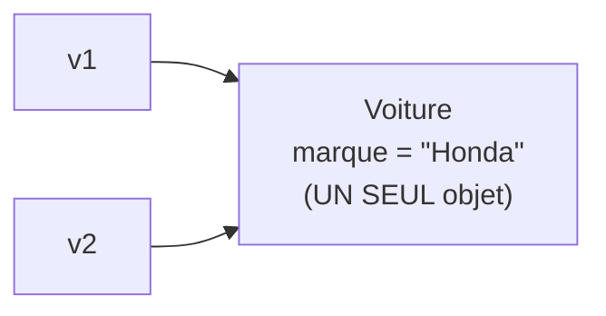

<div class="chapitre-titre-num">CHAPITRE 9</div>

# Classes et objets

## Objectifs pédagogiques

À la fin de ce chapitre, tu sauras créer une classe complète, créer des objets à partir d'elle avec `new`, comprendre ce que représente réellement une référence d'objet en mémoire, et savoir comparer deux objets correctement.

## A. Le problème

Au chapitre 8, on a vu **pourquoi** regrouper données et actions dans une classe. Mais on n'a encore jamais vraiment construit d'objet **concret** à partir d'un plan : on a seulement écrit le plan lui-même (la classe `Client`). Ce chapitre comble ce manque, étape par étape.

## B. Exemple de la vie réelle

Imagine une voiture. Une voiture possède une marque, une couleur, une vitesse. Elle peut démarrer, accélérer, freiner. Le **plan** d'une voiture (ses schémas techniques à l'usine) n'est qu'un document : on ne peut pas s'asseoir dedans ni la conduire. C'est seulement quand l'usine **construit** une voiture réelle, à partir de ce plan, qu'elle devient utilisable — et l'usine peut en construire autant qu'elle veut, chacune avec sa propre couleur, sa propre plaque d'immatriculation.

## C. Explication très simple

> En Programmation Orientée Objet, une **classe** est un plan permettant de fabriquer des **objets**. Un **objet** est une instance concrète créée à partir de ce plan, avec ses propres valeurs.

On construit maintenant une classe complète, **progressivement**, étape par étape.

## D. Construire une classe pas à pas

**Étape 1 — La classe, vide.**
```java
class Voiture {

}
```

**Étape 2 — Ajouter des attributs.**
```java
class Voiture {
    String marque;
    String couleur;
    double vitesse;
}
```

**Étape 3 — Ajouter une méthode.**
```java
class Voiture {
    String marque;
    String couleur;
    double vitesse;

    void demarrer() {
        System.out.println("La voiture démarre");
    }
}
```

**Étape 4 — Créer un objet, avec `new`.**
```java
public class Main {
    public static void main(String[] args) {
        Voiture voiture1 = new Voiture();
    }
}
```

**Étape 5 — Utiliser l'objet créé.**
```java
public class Main {
    public static void main(String[] args) {
        Voiture voiture1 = new Voiture();
        voiture1.marque = "Toyota";
        voiture1.couleur = "Rouge";

        voiture1.demarrer();
        System.out.println(voiture1.marque + " (" + voiture1.couleur + ")");
    }
}
```

**Étape 6 — Améliorer : un deuxième objet, indépendant du premier.**
```java
public class Main {
    public static void main(String[] args) {
        Voiture voiture1 = new Voiture();
        voiture1.marque = "Toyota";
        voiture1.couleur = "Rouge";

        Voiture voiture2 = new Voiture();
        voiture2.marque = "Honda";
        voiture2.couleur = "Bleue";

        voiture1.demarrer();
        voiture2.demarrer();

        System.out.println(voiture1.marque + " est " + voiture1.couleur);
        System.out.println(voiture2.marque + " est " + voiture2.couleur);
    }
}
```

## E. Explication ligne par ligne

```{.uml}
Voiture voiture1 = new Voiture();
   │        │       │      │
   │        │       │      └─ CONSTRUCTEUR : finalise la création de l'objet
   │        │       │         (détaillé au chapitre 10 — pour l'instant, Java
   │        │       │         en fournit un automatiquement, vide, si on n'en
   │        │       │         écrit aucun soi-même).
   │        │       │
   │        │       └─ "new" : demande à Java de FABRIQUER un nouvel objet,
   │        │          en réservant de la mémoire pour lui.
   │        │
   │        └─ Nom de la VARIABLE choisi par toi (convention : minuscule).
   │
   └─ TYPE de l'objet : le nom de la classe utilisée comme plan.
```

`new Voiture()` déclenche, dans l'ordre : (1) réservation d'un espace mémoire pour un nouvel objet `Voiture`, (2) initialisation de ses attributs avec des valeurs par défaut (`null` pour le texte/objets, `0` pour les nombres, `false` pour les booléens), (3) appel du constructeur, qui finalise l'initialisation.

<div class="encadre vocabulaire">
<span class="encadre-titre">📖 Terme : Instance</span>
Une <strong>instance</strong> est simplement un synonyme technique d'<strong>objet</strong>, utilisé surtout dans l'expression "instancier une classe" (= créer un objet à partir d'elle). <code>voiture1</code> et <code>voiture2</code> sont deux instances distinctes de la classe <code>Voiture</code>.
</div>

| Type d'attribut non initialisé | Valeur par défaut |
|---|---|
| `int`, `long`, `short`, `byte` | `0` |
| `double`, `float` | `0.0` |
| `boolean` | `false` |
| `char` | caractère nul |
| Tout type objet (`String`, `Voiture`...) | `null` |

<div class="encadre attention">
<span class="encadre-titre">⚠️ Erreur n°1 — NullPointerException sur un attribut objet non initialisé</span>

```java
Voiture v = new Voiture();
System.out.println(v.marque.length()); // 💥 NullPointerException : marque vaut null par défaut
```

Un attribut de type objet (`String`, ou toute classe) vaut `null` tant qu'il n'a pas été explicitement rempli. Appeler une méthode sur une référence `null` (ici `.length()` sur `marque`) déclenche l'erreur la plus fréquente de tout le langage Java : la `NullPointerException`. Le chapitre 10 (constructeurs) réglera ce problème définitivement.
</div>

## F. Les références d'objets : ce qui se passe réellement en mémoire

C'est un point subtil, mais essentiel à bien comprendre dès maintenant.

```java
Voiture v1 = new Voiture();
v1.marque = "Toyota";

Voiture v2 = v1; // v2 ne copie PAS l'objet, elle pointe vers le MÊME objet que v1 !
v2.marque = "Honda";

System.out.println(v1.marque); // "Honda" — car v1 et v2 référencent le même objet !
```



Une variable de type objet ne contient **jamais** l'objet lui-même : elle contient une **référence**, une sorte de "flèche" qui pointe vers l'endroit où l'objet vit réellement en mémoire. `Voiture v2 = v1;` copie la flèche, pas la voiture.

<div class="encadre astuce">
<span class="encadre-titre">💡 Pour une vraie copie indépendante</span>
Il faut créer explicitement un second objet et copier les valeurs de ses attributs une par une :

```java
Voiture v2 = new Voiture();
v2.marque = v1.marque; // copie la VALEUR du texte, pas l'objet Voiture lui-même
v2.couleur = v1.couleur;
```
</div>

## Comparer des objets : == vs equals()

```java
String a = new String("Jaslin");
String b = new String("Jaslin");

System.out.println(a == b);      // false : compare les RÉFÉRENCES (deux objets différents)
System.out.println(a.equals(b)); // true  : compare le CONTENU des deux chaînes
```

<div class="encadre attention">
<span class="encadre-titre">⚠️ Erreur très fréquente : comparer des objets avec ==</span>
<code>==</code> compare si deux références pointent vers <strong>le même emplacement mémoire</strong>, jamais si leur contenu "semble" égal. Pour comparer le contenu de deux objets, utilise toujours <code>.equals()</code> — y compris pour tes propres classes, une fois qu'on saura la redéfinir soi-même, après le chapitre 12 (héritage).
</div>

## Le cycle de vie d'un objet

1. **Création** : `new MaClasse()` réserve la mémoire et appelle le constructeur.
2. **Utilisation** : l'objet est manipulé tant qu'au moins une référence y pointe encore.
3. **Élimination automatique** : dès qu'**aucune** variable ne référence plus un objet, il devient éligible au **ramasse-miettes** (Garbage Collector) — un processus automatique de la JVM qui libère la mémoire, sans que tu aies jamais besoin de le demander toi-même (contrairement à certains langages comme C++).

```java
Voiture v = new Voiture();
v.marque = "Toyota";
v = null; // plus aucune variable ne référence l'objet créé plus haut
// → il devient éligible au Garbage Collector
```

<div class="encadre progression">
<span class="encadre-titre">🎯 CE QUE TU SAIS MAINTENANT</span>

```text
✓ Je sais créer une classe complète avec attributs et méthodes.
✓ Je sais créer un objet avec new, et l'utiliser via le point (.).
✓ Je comprends qu'une variable objet contient une référence, pas l'objet lui-même.
✓ Je sais que == compare des références, .equals() compare un contenu.
✓ Je comprends le cycle de vie d'un objet et le rôle du Garbage Collector.
```
</div>

## Petit exercice

<div class="encadre exercice">
<span class="encadre-titre">📝 Vérifie ta compréhension</span>

Que va afficher ce code, et pourquoi ?

```java
Voiture v1 = new Voiture();
v1.vitesse = 100;
Voiture v2 = v1;
v2.vitesse = 50;
System.out.println(v1.vitesse);
```
</div>

## Correction

Le code affiche **50.0**. `Voiture v2 = v1;` fait pointer `v2` vers le **même objet** que `v1` (pas une copie). Modifier `v2.vitesse` modifie donc bien l'unique objet partagé, lu à travers `v1` aussi.

## Défi

<div class="encadre defi">
<span class="encadre-titre">🧩 Défi — À toi de jouer</span>

Crée une classe `Livre` avec les attributs `titre` (String) et `disponible` (boolean), et deux méthodes : `emprunter()` (affiche un message différent selon que le livre est déjà emprunté ou non, et met à jour `disponible`) et `retourner()`. Teste-la avec un objet dans `main`.
</div>

### Corrigé du défi

```java
class Livre {
    String titre;
    boolean disponible;

    void emprunter() {
        if (disponible) {
            disponible = false;
            System.out.println(titre + " emprunté avec succès.");
        } else {
            System.out.println(titre + " n'est pas disponible actuellement.");
        }
    }

    void retourner() {
        disponible = true;
        System.out.println(titre + " a été retourné.");
    }
}

public class Main {
    public static void main(String[] args) {
        Livre livre1 = new Livre();
        livre1.titre = "Le Petit Prince";
        livre1.disponible = true;

        livre1.emprunter(); // Le Petit Prince emprunté avec succès.
        livre1.emprunter(); // Le Petit Prince n'est pas disponible actuellement.
        livre1.retourner(); // Le Petit Prince a été retourné.
    }
}
```

## Résumé du chapitre

- Une **classe** est un plan ; un **objet** est une instance concrète créée avec `new`.
- `new` réserve la mémoire, initialise les attributs par défaut, puis appelle le constructeur.
- Une variable objet contient une **référence** : affecter une variable objet à une autre partage le même objet, sans le copier.
- `==` compare des références ; `.equals()` compare un contenu.
- Le Garbage Collector libère automatiquement la mémoire des objets qui ne sont plus référencés par personne.

---

## Exercices de fin de chapitre

<div class="encadre exercice">
<span class="encadre-titre">📝 Niveau 1 — Facile</span>

Crée une classe `Produit` avec `nom`, `prix`, `quantiteEnStock`, et une méthode `afficherDetails()`. Crée deux objets distincts et affiche leurs détails.
</div>

**Corrigé :**
```java
class Produit {
    String nom;
    double prix;
    int quantiteEnStock;

    void afficherDetails() {
        System.out.println(nom + " - " + prix + " HTG (" + quantiteEnStock + " en stock)");
    }
}

public class Main {
    public static void main(String[] args) {
        Produit p1 = new Produit();
        p1.nom = "Riz";
        p1.prix = 250;
        p1.quantiteEnStock = 100;

        Produit p2 = new Produit();
        p2.nom = "Haricots";
        p2.prix = 180;
        p2.quantiteEnStock = 50;

        p1.afficherDetails();
        p2.afficherDetails();
    }
}
```

<div class="encadre exercice">
<span class="encadre-titre">📝 Niveau 2 — Intermédiaire</span>

Quelle valeur affiche ce code, et pourquoi ?

```java
Produit p1 = new Produit();
p1.quantiteEnStock = 100;
Produit p2 = p1;
p2.quantiteEnStock = 50;
p2 = new Produit();
p2.quantiteEnStock = 999;
System.out.println(p1.quantiteEnStock);
```
</div>

**Corrigé :** Le code affiche **50**. Après `Produit p2 = p1;`, `p1` et `p2` référencent le même objet : `p2.quantiteEnStock = 50;` modifie donc bien l'objet partagé. Mais `p2 = new Produit();` fait ensuite pointer `p2` vers un **tout autre objet**, sans jamais toucher à celui que `p1` référence encore. `p2.quantiteEnStock = 999;` ne modifie donc que ce nouvel objet.

<div class="encadre exercice">
<span class="encadre-titre">📝 Niveau 3 — Défi</span>

Une bibliothèque a besoin de savoir combien de livres au total ont été empruntés, tous livres confondus. Sans avoir encore vu les attributs `static` (une notion plus avancée, hors périmètre de ce chapitre), propose en une phrase pourquoi un simple attribut `disponible` par objet `Livre` ne suffit pas à répondre à cette question globale.
</div>

**Corrigé :** Chaque objet `Livre` ne connaît que **son propre** état (`disponible`) ; aucun objet individuel ne peut, à lui seul, compter combien d'emprunts ont eu lieu sur **l'ensemble** des livres, car cette information n'appartient à aucun livre en particulier — elle appartient à la bibliothèque dans son ensemble. (C'est exactement le rôle d'un attribut partagé entre tous les objets d'une classe, une notion que tu retrouveras plus tard sous le nom d'attribut `static`.)

---

*Chapitre suivant : les constructeurs, pour initialiser proprement un objet dès sa création, et enfin éliminer le risque de `NullPointerException` sur un attribut oublié.*
