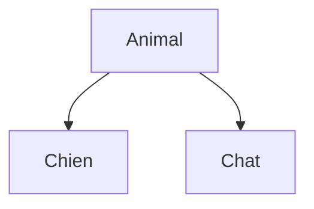

<div class="chapitre-titre-num">CHAPITRE 12</div>

# Héritage

## Objectifs pédagogiques

À la fin de ce chapitre, tu sauras créer une classe qui réutilise et étend le comportement d'une autre classe avec `extends`, tu comprendras `super`, et tu sauras redéfinir une méthode héritée avec `@Override`.

## A. Le problème

Imagine devoir créer des classes `Chien` et `Chat`. Tous les deux ont un nom, un âge, et savent manger et dormir. Sans un mécanisme de réutilisation, il faudrait recopier `nom`, `age`, `manger()` et `dormir()` dans **chaque** classe animale — et si un jour on corrige un bug dans `manger()`, il faudrait le corriger dans toutes les classes, une par une, en espérant n'en oublier aucune.

## B. Exemple de la vie réelle

Pense à une famille d'animaux :



Un chien **est un** animal : il a tout ce qu'un animal a (il mange, il dort), plus des choses qui lui sont propres (il aboie). Un chat aussi **est un** animal, avec ses propres particularités (il miaule). Pas besoin de réexpliquer "manger" et "dormir" à chaque fois : ces comportements sont **hérités** du concept général "Animal".

## C. Explication très simple

> **L'héritage** permet à une classe (dite **classe fille** ou **sous-classe**) de réutiliser automatiquement les attributs et méthodes d'une autre classe (dite **classe mère** ou **superclasse**), et d'y ajouter ses propres particularités.

## D. Premier exemple Java

```java
class Animal {
    void manger() {
        System.out.println("Je mange");
    }
}

class Chien extends Animal {
    void aboyer() {
        System.out.println("Ouaf !");
    }
}
```

```java
public class Main {
    public static void main(String[] args) {
        Chien monChien = new Chien();
        monChien.manger(); // hérité de Animal — "Chien" ne l'a jamais réécrit !
        monChien.aboyer(); // propre à Chien
    }
}
```

Résultat :
```text
Je mange
Ouaf !
```

## E. Explication ligne par ligne

```{.uml}
class Chien extends Animal {
   │            │        │
   │            │        └─ La classe MÈRE (superclasse) : celle dont on hérite.
   │            │
   │            └─ Mot-clé qui déclare l'héritage. Se lit : "Chien HÉRITE de Animal",
   │               ou "Chien EST UN Animal" (règle utile pour vérifier si un
   │               héritage a du sens : un chien EST bien un animal ;
   │               un moteur n'EST PAS une voiture, donc pas d'héritage entre eux).
   │
   └─ La classe FILLE (sous-classe) : celle qui hérite.
```

`Chien` obtient **automatiquement** tout ce que `Animal` définit (ici, `manger()`), sans avoir eu besoin de le réécrire, et y ajoute ses propres méthodes (`aboyer()`).

<div class="encadre vocabulaire">
<span class="encadre-titre">📖 Terme : Classe mère / Classe fille</span>
La <strong>classe mère</strong> (ou <strong>superclasse</strong>) est la classe générale dont on hérite (<code>Animal</code>). La <strong>classe fille</strong> (ou <strong>sous-classe</strong>) est la classe qui hérite et se spécialise (<code>Chien</code>). En Java, une classe fille ne peut hériter que d'<strong>une seule</strong> classe mère directe (pas d'héritage multiple, contrairement à certains langages).
</div>

## F. Deuxième exemple : redéfinir une méthode avec super

```java
class Animal {
    String nom;

    Animal(String nom) {
        this.nom = nom;
    }

    void manger() {
        System.out.println(nom + " mange de la nourriture générique");
    }
}

class Chien extends Animal {
    Chien(String nom) {
        super(nom); // appelle le CONSTRUCTEUR de la classe mère, en 1RE ligne obligatoirement
    }

    @Override
    void manger() {
        super.manger(); // appelle D'ABORD la version originale de la classe mère
        System.out.println(nom + " mange aussi des croquettes");
    }
}
```

```java
Chien rex = new Chien("Rex");
rex.manger();
```

Résultat :
```text
Rex mange de la nourriture générique
Rex mange aussi des croquettes
```

```{.uml}
super(nom);       →  appelle le CONSTRUCTEUR de la classe mère (Animal)
super.manger();   →  appelle la MÉTHODE manger() de la classe mère (Animal),
                      avant d'y ajouter du comportement supplémentaire
@Override         →  annonce clairement : "cette méthode REMPLACE une
                      méthode existante de la classe mère" (chapitre 13
                      détaille pourquoi c'est important)
```

<div class="encadre astuce">
<span class="encadre-titre">💡 super(...) doit être la toute première ligne du constructeur</span>
Si tu n'appelles pas explicitement <code>super(...)</code>, Java tente automatiquement d'appeler le constructeur <strong>sans paramètre</strong> de la classe mère, en tout premier. Si ce constructeur sans paramètre n'existe pas (comme ici, où <code>Animal</code> exige un <code>nom</code>), tu <strong>dois</strong> appeler <code>super(...)</code> toi-même, avec les bons arguments, sous peine d'erreur de compilation.
</div>

<div class="encadre vocabulaire">
<span class="encadre-titre">📖 Terme : @Override</span>
<code>@Override</code> est une <strong>annotation</strong> (une indication donnée au compilateur, pas une instruction exécutée) qui déclare : "cette méthode redéfinit une méthode déjà existante dans la classe mère". Ce n'est pas obligatoire pour que le code fonctionne, mais c'est une excellente pratique : si tu fais une faute de frappe dans le nom de la méthode, Java te signale une erreur de compilation au lieu de créer silencieusement une méthode complètement différente et non liée.
</div>

## Erreurs fréquentes

<div class="encadre attention">
<span class="encadre-titre">⚠️ Erreur n°1 — Oublier @Override et faire une faute de frappe silencieuse</span>

```java
class Animal {
    void manger() { System.out.println("..."); }
}

class Chien extends Animal {
    void mangerr() { // ❌ faute de frappe : "mangerr", pas "manger"
        System.out.println("Le chien mange des croquettes");
    }
}
```

Sans `@Override`, Java ne signale **aucune erreur** : il croit simplement que `Chien` ajoute une toute nouvelle méthode `mangerr()`, sans lien avec `manger()`. Avec `@Override` devant, Java aurait immédiatement signalé : "cette méthode ne redéfinit rien dans la classe mère", révélant la faute de frappe.
</div>

<div class="encadre attention">
<span class="encadre-titre">⚠️ Erreur n°2 — Hériter alors que la relation "EST UN" n'a pas de sens</span>

```java
class Moteur {
    void demarrer() { ... }
}

class Voiture extends Moteur { // ❌ une Voiture N'EST PAS un Moteur, elle EN A un
    ...
}
```

Une voiture **possède** un moteur, elle **n'est pas** un moteur (relation détaillée au chapitre 16, "composition"). Hériter uniquement pour "économiser du code", sans que la relation "EST UN" soit vraie, produit une hiérarchie de classes illogique et difficile à maintenir.
</div>

<div class="encadre progression">
<span class="encadre-titre">🎯 CE QUE TU SAIS MAINTENANT</span>

```text
✓ Je sais faire hériter une classe d'une autre avec extends.
✓ Je sais que la classe fille obtient automatiquement attributs et méthodes
  de la classe mère.
✓ Je sais appeler le constructeur de la classe mère avec super(...).
✓ Je sais redéfinir une méthode héritée avec @Override, et appeler
  l'originale avec super.methode().
✓ Je sais vérifier qu'un héritage a du sens avec le test "EST UN".
```
</div>

## Petit exercice

<div class="encadre exercice">
<span class="encadre-titre">📝 Vérifie ta compréhension</span>

Ce code compile-t-il ? Pourquoi ?

```java
class Animal {
    Animal(String nom) { ... }
}

class Chat extends Animal {
    Chat(String nom) {
        System.out.println("Création du chat");
        super(nom);
    }
}
```
</div>

## Correction

Non, ce code ne compile pas. `super(nom)` **doit** être la toute première instruction du constructeur de la classe fille. Ici, `System.out.println(...)` est exécuté avant, ce qui est interdit. Il faut inverser l'ordre : `super(nom);` en premier, puis le reste.

## Défi

<div class="encadre defi">
<span class="encadre-titre">🧩 Défi — À toi de jouer</span>

Crée une classe mère `Employe` (attributs `nom` et `salaireBase`, méthode `calculerSalaire()` qui renvoie simplement `salaireBase`), puis une classe fille `Commercial extends Employe` qui ajoute un attribut `commission` et redéfinit `calculerSalaire()` pour renvoyer `salaireBase + commission` (en réutilisant `super.calculerSalaire()` plutôt qu'en recopiant `salaireBase`).
</div>

### Corrigé du défi

```java
class Employe {
    String nom;
    double salaireBase;

    Employe(String nom, double salaireBase) {
        this.nom = nom;
        this.salaireBase = salaireBase;
    }

    double calculerSalaire() {
        return salaireBase;
    }
}

class Commercial extends Employe {
    double commission;

    Commercial(String nom, double salaireBase, double commission) {
        super(nom, salaireBase);
        this.commission = commission;
    }

    @Override
    double calculerSalaire() {
        return super.calculerSalaire() + commission;
    }
}
```

## Résumé du chapitre

- **L'héritage** (`extends`) permet à une classe fille de réutiliser automatiquement les attributs et méthodes d'une classe mère.
- Le test "EST UN" (un Chien EST UN Animal) valide qu'un héritage a du sens métier.
- `super(...)`, en première ligne du constructeur, appelle le constructeur de la classe mère.
- `super.methode()` appelle la version originale d'une méthode redéfinie.
- `@Override` signale explicitement une redéfinition et protège contre les fautes de frappe silencieuses.

---

## Exercices de fin de chapitre

<div class="encadre exercice">
<span class="encadre-titre">📝 Niveau 1 — Facile</span>

Vrai ou faux : une classe fille peut hériter de plusieurs classes mères directement en Java.
</div>

**Corrigé :** Faux. Java n'autorise l'héritage que d'**une seule** classe mère directe par classe (pas d'héritage multiple de classes — les interfaces, chapitre 15, offrent une alternative partielle à ce besoin).

<div class="encadre exercice">
<span class="encadre-titre">📝 Niveau 2 — Intermédiaire</span>

Complète cette classe fille pour qu'elle compile, sachant que `Vehicule` exige une `vitesseMax` à la construction :

```java
class Vehicule {
    double vitesseMax;
    Vehicule(double vitesseMax) { this.vitesseMax = vitesseMax; }
}

class Moto extends Vehicule {
    boolean aSideCar;
    Moto(double vitesseMax, boolean aSideCar) {
        // à compléter
        this.aSideCar = aSideCar;
    }
}
```
</div>

**Corrigé :**
```java
Moto(double vitesseMax, boolean aSideCar) {
    super(vitesseMax);
    this.aSideCar = aSideCar;
}
```

<div class="encadre exercice">
<span class="encadre-titre">📝 Niveau 3 — Défi</span>

Explique en une phrase pourquoi ce code, bien qu'il compile, représente une mauvaise conception :

```java
class Rectangle {
    double largeur, hauteur;
}

class Carre extends Rectangle {
    // hérite de largeur ET hauteur séparément, alors qu'un carré n'a qu'UN côté
}
```
</div>

**Corrigé :** Bien que "un Carré EST UN Rectangle" semble vrai géométriquement, hériter directement expose ici deux attributs indépendants (`largeur`, `hauteur`) alors qu'un carré n'a qu'une seule dimension réelle (son côté) — rien n'empêche, avec cet héritage, de créer un `Carre` avec `largeur` différent de `hauteur`, ce qui n'a plus aucun sens métier. C'est un cas classique où le test "EST UN" est trompeur : une meilleure conception éviterait ici l'héritage direct.

---

*Chapitre suivant : le polymorphisme, pour comprendre comment un même appel de méthode peut déclencher des comportements différents selon le type réel de l'objet.*
