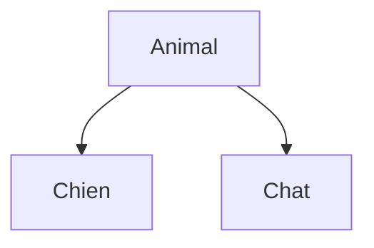

<div class="chapitre-titre-num">CHAPITRE 13</div>

# Polymorphisme

## Objectifs pédagogiques

À la fin de ce chapitre, tu comprendras comment un même appel de méthode peut déclencher des comportements différents selon le type réel de l'objet, et tu sauras utiliser cette idée pour écrire du code plus flexible.

Ne cherche pas encore de définition compliquée : ce chapitre part directement d'un exemple, comme d'habitude.

## A. Le problème

Reprenons `Animal`, `Chien` et `Chat` du chapitre 12. Sans polymorphisme, pour faire "parler" chaque animal d'une liste, il faudrait écrire un code différent selon le type précis de chaque objet :

```java
if (animal instanceof Chien) {
    ((Chien) animal).aboyer();
} else if (animal instanceof Chat) {
    ((Chat) animal).miauler();
}
// et un "else if" de plus à chaque nouveau type d'animal ajouté au programme...
```

Ce code devient de plus en plus long et fragile à chaque nouvel animal ajouté. Il doit exister une meilleure façon de dire simplement : *"fais parler cet animal, peu importe lequel exactement."*

## B. Exemple de la vie réelle



Imagine que tu demandes à n'importe quel animal de « faire du bruit ». Un chien aboie, un chat miaule, une vache meugle. C'est **la même demande** (« fais du bruit ! »), mais chaque animal y répond **à sa façon**, selon ce qu'il est réellement. Tu n'as pas besoin de savoir à l'avance quel animal précis se trouve devant toi pour lui donner cet ordre général.

## C. Explication très simple

> Le **polymorphisme** permet à des objets de classes différentes, mais reliées par héritage, de répondre différemment à un **même appel de méthode**, chacun selon sa propre implémentation.

## D. Premier exemple Java

```java
class Animal {
    void parler() {
        System.out.println("L'animal fait un bruit");
    }
}

class Chien extends Animal {
    @Override
    void parler() {
        System.out.println("Ouaf !");
    }
}

class Chat extends Animal {
    @Override
    void parler() {
        System.out.println("Miaou !");
    }
}
```

```java
Animal animal = new Chien();
animal.parler(); // affiche "Ouaf !"
```

## E. Explication : ce qui se passe étape par étape

```{.uml}
Animal animal = new Chien();
   │      │           │
   │      │           └─ L'objet RÉELLEMENT créé en mémoire est un Chien.
   │      │
   │      └─ Le nom de la variable.
   │
   └─ Le TYPE DÉCLARÉ de la variable est Animal — mais ce n'est qu'une
      "étiquette de référence", PAS le type réel de l'objet !

animal.parler();
   │
   └─ Java regarde le type RÉEL de l'objet (Chien, pas Animal) pour
      décider QUELLE version de parler() exécuter. Résultat : "Ouaf !",
      la version redéfinie dans Chien, PAS la version générique d'Animal.
```

C'est le cœur du polymorphisme : **la variable a un type déclaré (`Animal`), mais Java exécute toujours la méthode de la classe RÉELLE de l'objet** (`Chien`), pas celle du type déclaré de la variable.

<div class="encadre vocabulaire">
<span class="encadre-titre">📖 Terme : Liaison dynamique (dynamic binding)</span>
La <strong>liaison dynamique</strong> est le mécanisme, entièrement automatique en Java, par lequel la version exécutée d'une méthode redéfinie (<code>@Override</code>) est décidée à l'exécution, en fonction du type réel de l'objet, jamais du type déclaré de la variable qui le référence.
</div>

## F. Deuxième exemple : la vraie puissance du polymorphisme, avec un tableau

```java
public class Main {
    public static void main(String[] args) {
        Animal[] animaux = new Animal[3];
        animaux[0] = new Chien();
        animaux[1] = new Chat();
        animaux[2] = new Chien();

        for (Animal animal : animaux) {
            animal.parler(); // UN SEUL appel, un comportement DIFFÉRENT à chaque tour
        }
    }
}
```

Résultat :
```text
Ouaf !
Miaou !
Ouaf !
```

C'est ici que le polymorphisme devient réellement utile : la boucle `for-each` **ne sait absolument pas**, et n'a pas besoin de savoir, quel type précis d'animal elle traite à chaque tour. Elle appelle `parler()` sur chacun, et laisse Java choisir automatiquement le bon comportement. Ajouter une classe `Vache extends Animal` demain ne demanderait **aucune** modification de cette boucle.

<div class="encadre astuce">
<span class="encadre-titre">💡 Le vrai avantage : du code qui n'a pas besoin de changer quand on ajoute un type</span>
Sans polymorphisme, ajouter un nouvel animal obligerait à modifier CHAQUE endroit du programme contenant un <code>if (animal instanceof ...)</code>. Avec polymorphisme, ajouter une classe <code>Vache extends Animal</code> avec sa propre méthode <code>parler()</code> suffit : tout le code existant qui appelle déjà <code>animal.parler()</code> fonctionne immédiatement avec elle, sans une seule ligne modifiée.
</div>

## Erreurs fréquentes

<div class="encadre attention">
<span class="encadre-titre">⚠️ Erreur n°1 — Croire que le type déclaré décide quelle méthode s'exécute</span>

```java
Animal animal = new Chien();
animal.parler(); // ❌ un débutant croit parfois que ça affiche la version d'Animal, car "animal" est déclaré Animal
```

C'est une confusion très fréquente. Retiens la règle : c'est toujours le type **réel** de l'objet (déterminé par `new`), jamais le type déclaré de la variable, qui décide quelle version d'une méthode redéfinie s'exécute.
</div>

<div class="encadre attention">
<span class="encadre-titre">⚠️ Erreur n°2 — Vouloir appeler une méthode propre à la classe fille depuis une variable de type mère</span>

```java
Animal animal = new Chien();
animal.aboyer(); // ❌ erreur de compilation : Animal n'a pas de méthode aboyer()
```

Même si l'objet réel est un `Chien`, la variable `animal` est **déclarée** de type `Animal` : Java n'autorise que les méthodes connues du type déclaré. Pour appeler `aboyer()`, il faudrait soit déclarer la variable en `Chien` directement, soit faire un **transtypage** explicite : `((Chien) animal).aboyer();` (une technique avancée, à utiliser avec précaution, hors du périmètre principal de ce chapitre).
</div>

<div class="encadre progression">
<span class="encadre-titre">🎯 CE QUE TU SAIS MAINTENANT</span>

```text
✓ Je comprends qu'un même appel de méthode peut se comporter différemment
  selon le type réel de l'objet.
✓ Je sais qu'une variable de type Animal peut référencer un objet Chien.
✓ Je sais que c'est TOUJOURS le type réel de l'objet, jamais le type
  déclaré de la variable, qui décide quelle méthode redéfinie s'exécute.
✓ Je vois l'intérêt du polymorphisme : traiter des objets différents de
  façon uniforme, sans if/else répétés selon leur type.
```
</div>

## Petit exercice

<div class="encadre exercice">
<span class="encadre-titre">📝 Vérifie ta compréhension</span>

Que va afficher ce code ?

```java
class Forme {
    void dessiner() { System.out.println("Forme générique"); }
}
class Cercle extends Forme {
    @Override
    void dessiner() { System.out.println("Cercle"); }
}

Forme f = new Cercle();
f.dessiner();
```
</div>

## Correction

Le code affiche **"Cercle"**. Même si `f` est déclarée de type `Forme`, l'objet réel créé par `new Cercle()` est un `Cercle`. C'est ce type réel qui détermine quelle version de `dessiner()` s'exécute : celle redéfinie dans `Cercle`, pas la version générique de `Forme`.

## Défi

<div class="encadre defi">
<span class="encadre-titre">🧩 Défi — À toi de jouer</span>

Crée une classe mère `Employe` avec une méthode `calculerPrime()` renvoyant `0.0` par défaut, et deux classes filles `Vendeur` (prime = 10% de `chiffreAffaires`) et `Manager` (prime fixe de `500.0`). Dans `main`, crée un tableau `Employe[]` mélangeant les deux types, et affiche la prime de chacun avec une seule boucle.
</div>

### Corrigé du défi

```java
class Employe {
    String nom;
    Employe(String nom) { this.nom = nom; }

    double calculerPrime() {
        return 0.0;
    }
}

class Vendeur extends Employe {
    double chiffreAffaires;
    Vendeur(String nom, double chiffreAffaires) {
        super(nom);
        this.chiffreAffaires = chiffreAffaires;
    }

    @Override
    double calculerPrime() {
        return chiffreAffaires * 0.10;
    }
}

class Manager extends Employe {
    Manager(String nom) {
        super(nom);
    }

    @Override
    double calculerPrime() {
        return 500.0;
    }
}

public class Main {
    public static void main(String[] args) {
        Employe[] employes = new Employe[2];
        employes[0] = new Vendeur("Marie", 8000);
        employes[1] = new Manager("Paul");

        for (Employe e : employes) {
            System.out.println(e.nom + " : " + e.calculerPrime() + " HTG de prime");
        }
    }
}
```

Résultat :
```text
Marie : 800.0 HTG de prime
Paul : 500.0 HTG de prime
```

Une seule boucle, un seul appel `e.calculerPrime()`, deux comportements complètement différents. C'est exactement l'intérêt du polymorphisme.

## Résumé du chapitre

- Le **polymorphisme** permet à des objets de classes différentes de répondre différemment à un même appel de méthode.
- Une variable de type mère (`Animal`) peut référencer un objet de type fille (`Chien`).
- C'est toujours le type **réel** de l'objet, jamais le type déclaré de la variable, qui décide quelle méthode redéfinie s'exécute (**liaison dynamique**).
- Une variable ne peut appeler que les méthodes connues de son type **déclaré**, même si l'objet réel en connaît davantage.
- Le vrai bénéfice : du code qui reste inchangé quand on ajoute un nouveau type d'objet à traiter.

---

## Exercices de fin de chapitre

<div class="encadre exercice">
<span class="encadre-titre">📝 Niveau 1 — Facile</span>

Vrai ou faux : `Animal a = new Chien();` permet d'appeler `a.aboyer()` si `aboyer()` est propre à `Chien` et absente d'`Animal`.
</div>

**Corrigé :** Faux. La variable `a` est déclarée de type `Animal`, qui ne connaît pas `aboyer()`. Même si l'objet réel est un `Chien`, l'appel `a.aboyer()` provoque une erreur de compilation sans transtypage explicite.

<div class="encadre exercice">
<span class="encadre-titre">📝 Niveau 2 — Intermédiaire</span>

Un tableau `Forme[] formes` contient des objets `Cercle`, `Carre` et `Triangle`, tous héritant de `Forme` et redéfinissant `calculerAire()`. Écris la boucle qui affiche l'aire totale de toutes les formes, sans aucun `if` ni `instanceof`.
</div>

**Corrigé :**
```java
double total = 0;
for (Forme f : formes) {
    total += f.calculerAire();
}
System.out.println("Aire totale : " + total);
```

<div class="encadre exercice">
<span class="encadre-titre">📝 Niveau 3 — Défi</span>

Explique en une ou deux phrases pourquoi le polymorphisme réduit concrètement la maintenance d'un programme, en comparant avec une approche à base de `if (x instanceof TypeA) { ... } else if (x instanceof TypeB) { ... }` répétée à plusieurs endroits du code.
</div>

**Corrigé :** Avec une chaîne de `instanceof`, ajouter un nouveau type oblige à retrouver et modifier **chaque** endroit du programme contenant ce genre de test, avec le risque réel d'en oublier un. Avec le polymorphisme, ajouter un nouveau type ne demande que d'écrire sa propre classe avec sa méthode redéfinie : tout le code existant qui appelle déjà la méthode générique continue de fonctionner immédiatement, sans une seule ligne modifiée ailleurs.

---

*Chapitre suivant : l'abstraction, pour apprendre à définir "ce qu'une classe doit faire" sans imposer "comment elle doit le faire".*
