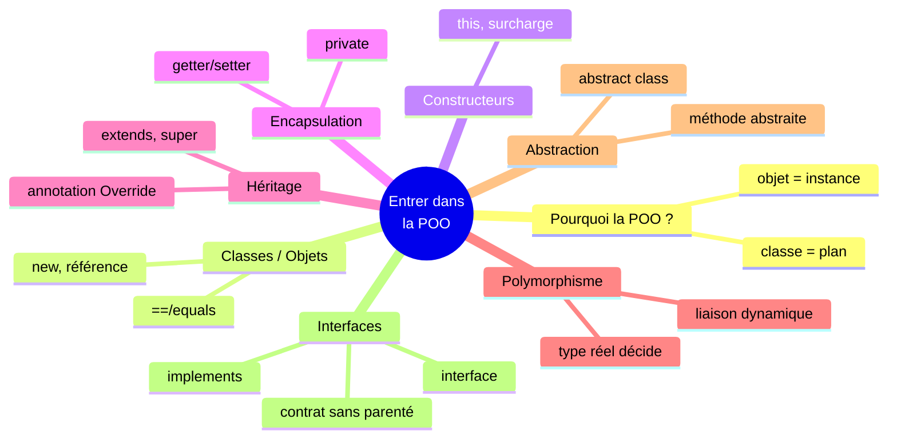

<div class="chapitre-titre-num">CHAPITRE 15</div>

# Les interfaces

## Objectifs pédagogiques

À la fin de ce chapitre, tu sauras créer et utiliser une interface pour définir un contrat que plusieurs classes, même sans aucun lien de parenté, peuvent respecter ensemble.

## A. Le problème

Une classe abstraite (chapitre 14) impose un contrat, mais uniquement à ses **propres classes filles** — et une classe Java ne peut hériter que d'**une seule** classe mère (chapitre 12). Or, dans la vraie vie, des choses très différentes peuvent partager une même capacité, sans avoir aucun autre lien entre elles : un Oiseau et un Avion peuvent tous les deux "voler", sans qu'un Avion soit un genre d'Oiseau, ni l'inverse.

## B. Exemple de la vie réelle

> Une interface, c'est un **contrat**.

Pense à un contrat d'embauche générique : *« Quiconque signe ce contrat s'engage à livrer un rapport chaque vendredi. »* Ce contrat ne précise absolument pas **comment** chaque personne doit rédiger son rapport — un comptable et un designer graphique respecteront ce même engagement, chacun à sa manière, sans avoir besoin d'appartenir au même service ni au même métier.

## C. Explication très simple

> Une **interface** est un contrat qui liste des méthodes qu'une classe **s'engage à implémenter**, sans imposer aucune relation de parenté (héritage) entre les classes qui la respectent.

## D. Premier exemple Java

```java
interface Volant {
    void voler();
}
```

```java
class Oiseau implements Volant {
    @Override
    public void voler() {
        System.out.println("L'oiseau bat des ailes et vole");
    }
}

class Avion implements Volant {
    @Override
    public void voler() {
        System.out.println("L'avion utilise ses réacteurs pour voler");
    }
}
```

## E. Explication ligne par ligne

```{.uml}
interface Volant {
    void voler();
}
   │            │
   │            └─ Une signature de méthode, SANS corps — un contrat, comme
   │               une méthode abstraite (chapitre 14). Implicitement
   │               "public abstract", même sans l'écrire.
   └─ Mot-clé qui déclare un contrat, PAS une classe.

class Oiseau implements Volant {
   │                │       │
   │                │       └─ Le nom du contrat respecté.
   │                └─ Mot-clé qui déclare : "Oiseau RESPECTE le contrat Volant"
   │                   (différent de "extends", qui déclare un héritage).
   └─ Oiseau reste une classe normale, sans AUCUN lien de parenté avec Avion.
```

`Oiseau` et `Avion` **n'ont aucun rapport d'héritage** entre eux, ni même de classe mère commune obligatoire — pourtant, les deux respectent le même contrat `Volant`, et peuvent donc être traités de façon interchangeable partout où ce contrat suffit.

<div class="encadre vocabulaire">
<span class="encadre-titre">📖 Terme : implements</span>
<code>implements</code> déclare qu'une classe respecte le contrat d'une interface, en fournissant une implémentation réelle pour chacune de ses méthodes. Contrairement à <code>extends</code> (une seule classe mère possible), une classe peut <code>implements</code> <strong>plusieurs</strong> interfaces à la fois, séparées par une virgule.
</div>

## F. Deuxième exemple : le polymorphisme via une interface

```java
public class Main {
    public static void main(String[] args) {
        Volant[] volants = new Volant[2];
        volants[0] = new Oiseau();
        volants[1] = new Avion();

        for (Volant v : volants) {
            v.voler(); // même principe qu'au chapitre 13, mais SANS lien d'héritage entre les classes !
        }
    }
}
```

Résultat :
```text
L'oiseau bat des ailes et vole
L'avion utilise ses réacteurs pour voler
```

Ce code retrouve exactement la même puissance que le polymorphisme du chapitre 13 (une seule boucle, des comportements différents) — mais ici, sans qu'`Oiseau` et `Avion` partagent la moindre classe mère, seulement un contrat commun.

<div class="encadre astuce">
<span class="encadre-titre">💡 Une classe peut respecter plusieurs interfaces à la fois</span>

```java
interface Nageur {
    void nager();
}

class Canard implements Volant, Nageur {
    @Override
    public void voler() { System.out.println("Le canard vole"); }

    @Override
    public void nager() { System.out.println("Le canard nage"); }
}
```

Une classe respecte autant d'interfaces qu'elle le souhaite, séparées par des virgules après `implements` — une flexibilité qu'aucun héritage de classe (limité à une seule classe mère) ne permet.
</div>

## Interface vs classe abstraite : comment choisir ?

| | Classe abstraite | Interface |
|---|---|---|
| Une classe peut en avoir combien ? | Une seule (`extends`) | Plusieurs (`implements`) |
| Peut contenir des attributs avec un état ? | Oui | Non (seulement des constantes) |
| Peut contenir des méthodes déjà implémentées ? | Oui | Rarement (méthodes `default`, notion avancée) |
| Utilisation typique | Des classes **proches**, qui partagent une vraie base commune (Animal → Chien/Chat) | Une **capacité** partagée par des choses potentiellement très différentes (Volant → Oiseau/Avion) |

## Erreurs fréquentes

<div class="encadre attention">
<span class="encadre-titre">⚠️ Erreur n°1 — Oublier public devant une méthode d'interface implémentée</span>

```java
class Oiseau implements Volant {
    void voler() { // ❌ erreur de compilation : doit être "public void voler()"
        System.out.println("...");
    }
}
```

Les méthodes d'une interface sont implicitement `public`. La classe qui les implémente **doit** respecter cette même visibilité, jamais une visibilité plus restrictive (`private` ou même l'absence de mot-clé, qui équivaut à un accès "de paquetage" plus restreint que `public`).
</div>

<div class="encadre attention">
<span class="encadre-titre">⚠️ Erreur n°2 — Instancier directement une interface</span>

```java
Volant v = new Volant(); // ❌ erreur de compilation : une interface n'est jamais instanciable
```

Exactement comme une classe abstraite, une interface ne peut jamais être créée directement avec `new`. Il faut instancier une classe **concrète** qui l'implémente (`new Oiseau()`).
</div>

<div class="encadre progression">
<span class="encadre-titre">🎯 CE QUE TU SAIS MAINTENANT</span>

```text
✓ Je sais créer une interface avec interface, et l'implémenter avec implements.
✓ Je sais qu'une classe peut implémenter plusieurs interfaces à la fois.
✓ Je comprends la différence entre extends (une seule classe mère) et
  implements (plusieurs interfaces possibles).
✓ Je sais choisir entre classe abstraite (base commune réelle) et
  interface (capacité partagée sans parenté).
✓ Je n'oublie plus le "public" devant une méthode d'interface implémentée.
```
</div>

## Petit exercice

<div class="encadre exercice">
<span class="encadre-titre">📝 Vérifie ta compréhension</span>

Pourquoi ce code ne compile-t-il pas ?

```java
interface Payable {
    double calculerMontant();
}

class Facture implements Payable {
    // (rien d'autre)
}
```
</div>

## Correction

`Facture implements Payable` s'engage à fournir une implémentation de `calculerMontant()`, mais la classe ne le fait jamais. Exactement comme pour une méthode abstraite (chapitre 14), c'est une erreur de compilation. Il faut ajouter une méthode `public double calculerMontant() { ... }` dans `Facture`.

## Défi

<div class="encadre defi">
<span class="encadre-titre">🧩 Défi — À toi de jouer</span>

Crée une interface `Comparable120` avec une méthode `boolean estMeilleurQue(Etudiant autre)`. Fais implémenter cette interface par une classe `Etudiant` (attributs `nom`, `moyenne`), où `estMeilleurQue` renvoie `true` si `this.moyenne > autre.moyenne`.
</div>

### Corrigé du défi

```java
interface Comparable120 {
    boolean estMeilleurQue(Etudiant autre);
}

class Etudiant implements Comparable120 {
    String nom;
    double moyenne;

    Etudiant(String nom, double moyenne) {
        this.nom = nom;
        this.moyenne = moyenne;
    }

    @Override
    public boolean estMeilleurQue(Etudiant autre) {
        return this.moyenne > autre.moyenne;
    }
}

public class Main {
    public static void main(String[] args) {
        Etudiant e1 = new Etudiant("Jaslin", 16.5);
        Etudiant e2 = new Etudiant("Marie", 14.0);

        System.out.println(e1.nom + " meilleur que " + e2.nom + " ? " + e1.estMeilleurQue(e2)); // true
    }
}
```

<div class="encadre astuce">
<span class="encadre-titre">💡 Ce défi annonce la vraie interface Comparable de Java</span>
Java fournit une interface standard, <code>Comparable&lt;T&gt;</code>, qui suit exactement ce principe (une méthode <code>compareTo</code>), utilisée par de nombreux outils de tri intégrés au langage. Tu la recroiseras dans un contexte plus avancé après le chapitre 26 (Generics).
</div>

## Résumé du chapitre

- Une **interface** est un contrat listant des méthodes qu'une classe s'engage à implémenter, sans lien d'héritage entre les classes qui la respectent.
- `implements` déclare qu'une classe respecte une interface ; une classe peut en implémenter **plusieurs** à la fois.
- Une interface ne peut jamais être instanciée directement, tout comme une classe abstraite.
- Une classe abstraite convient à des classes proches partageant une base commune ; une interface convient à une capacité partagée par des classes potentiellement très différentes.
- Les méthodes d'implémentation d'une interface doivent toujours être `public`.

---

# 🎓 Révision de la Partie 3 — Entrer dans la POO

Tu viens de terminer la Partie 3 (chapitres 8 à 15), le cœur historique de la Programmation Orientée Objet. C'est la partie la plus dense du manuel jusqu'ici : prends le temps de bien consolider avant de continuer.

## Carte mentale de la Partie 3



## Questions de révision

1. Quelle est la différence entre une classe et un objet ?
2. Pourquoi une variable objet contient-elle une référence, et non l'objet lui-même ?
3. Pourquoi faut-il valider les données dans le constructeur ET dans les setters, pas seulement l'un des deux ?
4. Dans `Animal a = new Chien();`, quel type décide quelle méthode redéfinie s'exécute : le type déclaré ou le type réel ?
5. Quand préférer une interface à une classe abstraite ?

**Réponses :** (1) Une classe est un plan ; un objet est une instance concrète créée à partir de ce plan avec `new`. (2) Parce que Java gère la mémoire des objets via des références, ce qui permet à plusieurs variables de partager le même objet sans le dupliquer. (3) Parce que le constructeur peut contourner un setter s'il assigne directement l'attribut ; valider aux deux endroits (ou faire appeler le setter par le constructeur) garantit qu'aucun chemin de création ne produit un objet invalide. (4) Le type réel de l'objet, jamais le type déclaré de la variable. (5) Quand des classes potentiellement très différentes partagent une capacité, sans base commune réelle, ou quand une classe a besoin de respecter plusieurs contrats à la fois.

## QCM

<div class="encadre exercice">
<span class="encadre-titre">📝 QCM — Une seule bonne réponse par question</span>

**1.** Que se passe-t-il si on écrit `Etudiant e = new Etudiant();` alors qu'un seul constructeur `Etudiant(String nom)` est défini ?
a) Ça compile, nom vaut null  b) Erreur de compilation  c) Erreur à l'exécution seulement  d) Avertissement, mais ça compile

**2.** Que fait `super.methode()` à l'intérieur d'une méthode redéfinie ?
a) Rien, erreur  b) Appelle la version de la classe mère  c) Appelle la version de la classe fille  d) Supprime la méthode

**3.** Une classe abstraite avec 2 méthodes abstraites est héritée par une classe fille qui n'en implémente qu'une seule. Résultat ?
a) Ça compile  b) Erreur de compilation  c) Erreur à l'exécution  d) Avertissement seulement

**4.** Combien d'interfaces une classe Java peut-elle implémenter à la fois ?
a) 0  b) 1 seule  c) Autant que nécessaire  d) Maximum 2
</div>

**Corrigé du QCM :** 1-b (le constructeur par défaut disparaît dès qu'un autre est écrit) ; 2-b (appelle explicitement la version de la classe mère) ; 3-b (toute méthode abstraite non implémentée dans une classe fille concrète est une erreur de compilation) ; 4-c (autant que nécessaire, séparées par des virgules).

## Mini-projet de la Partie 3

<div class="encadre defi">
<span class="encadre-titre">🧩 Mini-projet — Système de formes géométriques polymorphe</span>

Combine toutes les notions de la Partie 3 :

1. Une interface `Dessinable` avec une méthode `String description()`.
2. Une classe abstraite `Forme implements Dessinable`, avec un attribut protégé (utilise `protected`, une visibilité intermédiaire vue en détail plus tard dans le manuel — ou `private` avec un getter, si tu préfères rester prudent) `nom`, un constructeur qui l'initialise, une méthode abstraite `calculerAire()`, et une implémentation de `description()` qui utilise `nom` et `calculerAire()`.
3. Deux classes filles concrètes : `Cercle` et `Rectangle`, chacune implémentant `calculerAire()`.
4. Dans `main`, un tableau `Forme[]`, parcouru avec une seule boucle qui affiche `description()` pour chaque forme.
</div>

### Corrigé du mini-projet

```java
interface Dessinable {
    String description();
}

abstract class Forme implements Dessinable {
    String nom;

    Forme(String nom) {
        this.nom = nom;
    }

    abstract double calculerAire();

    @Override
    public String description() {
        return nom + " a une aire de " + calculerAire();
    }
}

class Cercle extends Forme {
    double rayon;

    Cercle(double rayon) {
        super("Cercle");
        this.rayon = rayon;
    }

    @Override
    double calculerAire() {
        return Math.PI * rayon * rayon;
    }
}

class Rectangle extends Forme {
    double largeur, hauteur;

    Rectangle(double largeur, double hauteur) {
        super("Rectangle");
        this.largeur = largeur;
        this.hauteur = hauteur;
    }

    @Override
    double calculerAire() {
        return largeur * hauteur;
    }
}

public class Main {
    public static void main(String[] args) {
        Forme[] formes = new Forme[2];
        formes[0] = new Cercle(3);
        formes[1] = new Rectangle(4, 5);

        for (Forme f : formes) {
            System.out.println(f.description());
        }
    }
}
```

Résultat :
```text
Cercle a une aire de 28.274333882308138
Rectangle a une aire de 20.0
```

Ce mini-projet combine classe abstraite, interface, héritage, polymorphisme et encapsulation dans un seul programme cohérent — exactement la façon dont ces notions collaborent dans un vrai projet Java professionnel.

---

*Chapitre suivant : les relations entre objets (association, agrégation, composition), pour apprendre à faire collaborer plusieurs classes ensemble, au-delà du seul héritage.*
