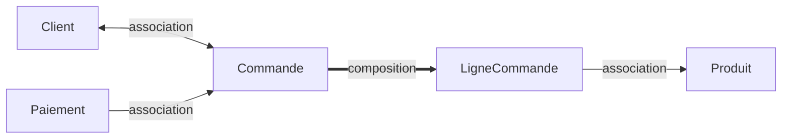
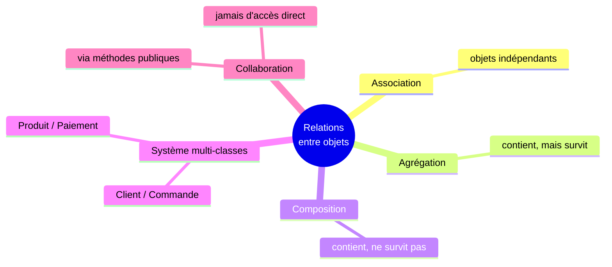

<div class="chapitre-titre-num">CHAPITRE 17</div>

# Classes, objets et relations complexes

## Objectifs pédagogiques

À la fin de ce chapitre, tu sauras faire collaborer plusieurs classes ensemble dans une situation métier réaliste, en combinant tout ce que tu as appris depuis le chapitre 8 : classes, constructeurs, encapsulation, héritage, relations entre objets.

## A. Le problème

Un vrai logiciel ne contient jamais une seule classe isolée. Une boutique en ligne a besoin, au minimum, de `Client`, `Produit`, `Commande` et `Paiement` — quatre classes différentes qui doivent **collaborer** pour qu'une vente se déroule correctement, du début à la fin.

## B. Exemple de la vie réelle

Pense à un restaurant. Le client passe commande auprès du serveur. Le serveur transmet la commande à la cuisine. La cuisine prépare chaque plat. Enfin, la caisse encaisse le paiement. Chaque rôle (client, serveur, cuisine, caisse) est **distinct**, avec ses propres responsabilités, mais tous collaborent pour qu'un repas soit servi et payé. C'est exactement ainsi qu'un vrai programme organise ses classes : chacune avec un rôle clair, qui collaborent entre elles.

## C. Explication très simple

> Une application réaliste répartit ses responsabilités entre **plusieurs classes distinctes**, chacune centrée sur un seul concept métier, reliées entre elles par les relations vues au chapitre 16 (association, agrégation, composition).

## D. Construire le système, étape par étape

**Étape 1 — Produit, la classe la plus simple, sans dépendance vers les autres.**

```java
class Produit {
    private String nom;
    private double prix;

    Produit(String nom, double prix) {
        this.nom = nom;
        this.prix = prix;
    }

    String getNom() { return nom; }
    double getPrix() { return prix; }
}
```

**Étape 2 — Client, également indépendante.**

```java
class Client {
    private String nom;
    private double soldeDu;

    Client(String nom) {
        this.nom = nom;
        this.soldeDu = 0;
    }

    String getNom() { return nom; }
    double getSoldeDu() { return soldeDu; }

    void ajouterDette(double montant) {
        this.soldeDu += montant;
    }

    void reduireDette(double montant) {
        this.soldeDu -= montant;
    }
}
```

**Étape 3 — LigneCommande, en composition avec Produit (association) et une quantité.**

```java
class LigneCommande {
    private Produit produit; // ASSOCIATION : le produit existe indépendamment
    private int quantite;

    LigneCommande(Produit produit, int quantite) {
        this.produit = produit;
        this.quantite = quantite;
    }

    double calculerSousTotal() {
        return produit.getPrix() * quantite;
    }

    String getDescription() {
        return quantite + "x " + produit.getNom();
    }
}
```

**Étape 4 — Commande, en composition avec LigneCommande, en association avec Client.**

```java
class Commande {
    private Client client;               // ASSOCIATION : le client existe indépendamment
    private LigneCommande[] lignes;       // COMPOSITION : créées ici, n'existent que pour cette commande
    private boolean payee;

    Commande(Client client, LigneCommande[] lignes) {
        this.client = client;
        this.lignes = lignes;
        this.payee = false;
    }

    double calculerTotal() {
        double total = 0;
        for (LigneCommande ligne : lignes) {
            total += ligne.calculerSousTotal();
        }
        return total;
    }

    void valider() {
        double total = calculerTotal();
        client.ajouterDette(total);
        System.out.println("Commande de " + client.getNom() + " validée, total : " + total + " HTG");
    }

    void marquerPayee() {
        this.payee = true;
    }

    boolean estPayee() {
        return payee;
    }
}
```

**Étape 5 — Paiement, qui collabore avec Commande et Client.**

```java
class Paiement {
    private Commande commande;
    private double montant;

    Paiement(Commande commande, double montant) {
        this.commande = commande;
        this.montant = montant;
    }

    void executer() {
        if (montant >= commande.calculerTotal()) {
            commande.marquerPayee();
            System.out.println("Paiement de " + montant + " HTG accepté, commande soldée.");
        } else {
            System.out.println("Paiement insuffisant : " + montant + " HTG reçus, "
                + commande.calculerTotal() + " HTG dus.");
        }
    }
}
```

## E. Explication : comment ces classes collaborent



Chaque flèche de ce schéma correspond exactement à un attribut vu aux étapes 1 à 5 : `Commande` a un `Client` et des `LigneCommande[]` ; `LigneCommande` a un `Produit` ; `Paiement` a une `Commande`. Aucune classe ne connaît **tout** le système — chacune ne connaît que ses voisines directes, exactement comme le serveur du restaurant ne connaît pas les fournisseurs de la cuisine.

## F. Deuxième exemple : le programme complet, assemblé

```java
public class Main {
    public static void main(String[] args) {
        Produit riz = new Produit("Riz", 250.0);
        Produit haricots = new Produit("Haricots", 180.0);

        Client marie = new Client("Marie");

        LigneCommande[] lignes = {
            new LigneCommande(riz, 2),
            new LigneCommande(haricots, 3)
        };

        Commande commande = new Commande(marie, lignes);
        commande.valider();

        Paiement paiement = new Paiement(commande, 1040.0);
        paiement.executer();

        System.out.println(marie.getNom() + " doit encore : " + marie.getSoldeDu() + " HTG");
    }
}
```

Résultat :
```text
Commande de Marie validée, total : 1040.0 HTG
Paiement de 1040.0 HTG accepté, commande soldée.
Marie doit encore : 1040.0 HTG
```

<div class="encadre attention">
<span class="encadre-titre">⚠️ Remarque volontaire : cet exemple simplifié a un défaut métier réel</span>
Le solde dû de <code>marie</code> n'est jamais réduit après le paiement — <code>Paiement.executer()</code> ne fait qu'appeler <code>commande.marquerPayee()</code>, sans jamais appeler <code>client.reduireDette(...)</code>. C'est volontaire : ce défaut illustre à quel point, dans un système à plusieurs classes, une action métier (payer) peut concerner <strong>plusieurs</strong> objets à la fois, et l'oublier sur l'un d'eux est une source d'erreur très réaliste. Le défi de ce chapitre te demande justement de la corriger.
</div>

## Erreurs fréquentes

<div class="encadre attention">
<span class="encadre-titre">⚠️ Erreur n°1 — Une classe qui en sait trop sur les autres</span>

```java
class Paiement {
    void executer(Commande commande) {
        // ❌ Paiement modifie DIRECTEMENT un attribut interne de Client,
        // en traversant Commande — une classe ne devrait jamais fouiller
        // aussi profondément dans les objets d'une autre classe.
        commande.client.soldeDu = commande.client.soldeDu - montant;
    }
}
```

Une classe ne devrait interagir qu'avec ses voisines **directes**, via leurs méthodes publiques — jamais en traversant plusieurs objets pour modifier un attribut lointain directement (une pratique parfois appelée, de façon imagée, "violer la loi de Déméter"). L'exemple correct de la section D, où `Paiement` appelle `commande.marquerPayee()` sans jamais toucher directement à `Client`, respecte ce principe.
</div>

<div class="encadre attention">
<span class="encadre-titre">⚠️ Erreur n°2 — Oublier qu'une action métier peut toucher plusieurs objets</span>

C'est exactement le défaut signalé dans l'encadré ci-dessus : "payer une commande" concerne à la fois la `Commande` (marquer payée) ET le `Client` (réduire sa dette). Oublier l'un des deux crée un état incohérent entre objets qui, chacun pris séparément, semblent pourtant valides.
</div>

<div class="encadre progression">
<span class="encadre-titre">🎯 CE QUE TU SAIS MAINTENANT</span>

```text
✓ Je sais construire un système de plusieurs classes qui collaborent,
  étape par étape.
✓ Je sais faire communiquer des objets entre eux via leurs méthodes
  publiques, sans jamais fouiller directement dans les attributs d'un
  objet lointain.
✓ Je comprends qu'une action métier peut nécessiter de mettre à jour
  PLUSIEURS objets à la fois pour rester cohérente.
```
</div>

## Petit exercice

<div class="encadre exercice">
<span class="encadre-titre">📝 Vérifie ta compréhension</span>

Dans le système de ce chapitre, quelle classe est en **composition** avec `Commande`, et quelle classe est seulement en **association** avec elle ?
</div>

## Correction

`LigneCommande` est en **composition** avec `Commande` : les lignes sont créées par (ou pour) la commande et n'ont aucun sens en dehors d'elle. `Client` est en **association** avec `Commande` : le client existe indépendamment, avant et après la commande.

## Défi

<div class="encadre defi">
<span class="encadre-titre">🧩 Défi — À toi de jouer</span>

Corrige le défaut signalé dans la section F : modifie `Paiement.executer()` pour qu'il réduise également la dette du client via une méthode publique de `Commande` que tu ajouteras (par exemple `getClient()`), sans jamais accéder directement à un attribut interne.
</div>

### Corrigé du défi

```java
class Commande {
    // ... (reste inchangé)

    Client getClient() { // un getter, pour un accès CONTRÔLÉ, public
        return client;
    }
}

class Paiement {
    private Commande commande;
    private double montant;

    Paiement(Commande commande, double montant) {
        this.commande = commande;
        this.montant = montant;
    }

    void executer() {
        if (montant >= commande.calculerTotal()) {
            commande.marquerPayee();
            commande.getClient().reduireDette(montant); // via le getter, méthode publique
            System.out.println("Paiement de " + montant + " HTG accepté, commande soldée.");
        } else {
            System.out.println("Paiement insuffisant.");
        }
    }
}
```

## Résumé du chapitre

- Une application réaliste répartit ses responsabilités entre plusieurs classes distinctes, chacune centrée sur un seul concept métier.
- Les classes collaborent via leurs méthodes **publiques**, jamais en fouillant directement dans les attributs internes d'une autre classe.
- Une action métier (comme "payer") peut nécessiter de mettre à jour plusieurs objets liés, sous peine d'état incohérent.
- Un schéma de collaboration (comme celui de la section E) aide à visualiser qui connaît qui, et selon quel type de relation (chapitre 16).

---

# 🎓 Révision de la Partie 4 — Maîtriser la POO

## Carte mentale de la Partie 4



## Questions de révision

1. Quelle est la différence essentielle entre agrégation et composition ?
2. Pourquoi une classe ne devrait-elle jamais modifier directement un attribut interne d'une autre classe qu'elle n'est pas censée connaître d'aussi près ?
3. Dans le système Client/Commande/Produit/Paiement, pourquoi `LigneCommande` est-elle en composition avec `Commande`, et pas en simple association ?

**Réponses :** (1) L'agrégation contient des objets qui pourraient survivre en dehors du conteneur ; la composition contient des objets créés par, et n'ayant aucun sens en dehors de, leur conteneur. (2) Parce que ça casse l'encapsulation (chapitre 11) et rend le code fragile : toute modification de la structure interne de l'autre classe casserait ce code lointain. (3) Parce qu'une ligne de commande n'a strictement aucune raison d'exister indépendamment de la commande qui la contient — elle est créée par elle, à l'intérieur de son constructeur.

## Mini-projet de la Partie 4

<div class="encadre defi">
<span class="encadre-titre">🧩 Mini-projet — Système de location de véhicules</span>

Construis un petit système avec : `Vehicule` (nom, tarifJournalier), `Client` (nom), `Location` (association avec Client, association avec Vehicule, un nombre de jours, une méthode `calculerCout()`). Dans `main`, crée 2 véhicules, 1 client, une location, et affiche le coût total.
</div>

### Corrigé du mini-projet

```java
class Vehicule {
    private String nom;
    private double tarifJournalier;

    Vehicule(String nom, double tarifJournalier) {
        this.nom = nom;
        this.tarifJournalier = tarifJournalier;
    }

    String getNom() { return nom; }
    double getTarifJournalier() { return tarifJournalier; }
}

class Client {
    private String nom;
    Client(String nom) { this.nom = nom; }
    String getNom() { return nom; }
}

class Location {
    private Client client;
    private Vehicule vehicule;
    private int nombreJours;

    Location(Client client, Vehicule vehicule, int nombreJours) {
        this.client = client;
        this.vehicule = vehicule;
        this.nombreJours = nombreJours;
    }

    double calculerCout() {
        return vehicule.getTarifJournalier() * nombreJours;
    }

    void afficherResume() {
        System.out.println(client.getNom() + " loue " + vehicule.getNom()
            + " pour " + nombreJours + " jours : " + calculerCout() + " HTG");
    }
}

public class Main {
    public static void main(String[] args) {
        Vehicule moto = new Vehicule("Moto Yamaha", 500.0);
        Client jean = new Client("Jean");

        Location location = new Location(jean, moto, 4);
        location.afficherResume();
    }
}
```

Résultat :
```text
Jean loue Moto Yamaha pour 4 jours : 2000.0 HTG
```

---

*Chapitre suivant : les tableaux, pour approfondir une notion déjà entrevue au chapitre 3, avant d'aborder les vraies structures de données dynamiques de Java (ArrayList, HashSet, HashMap).*
