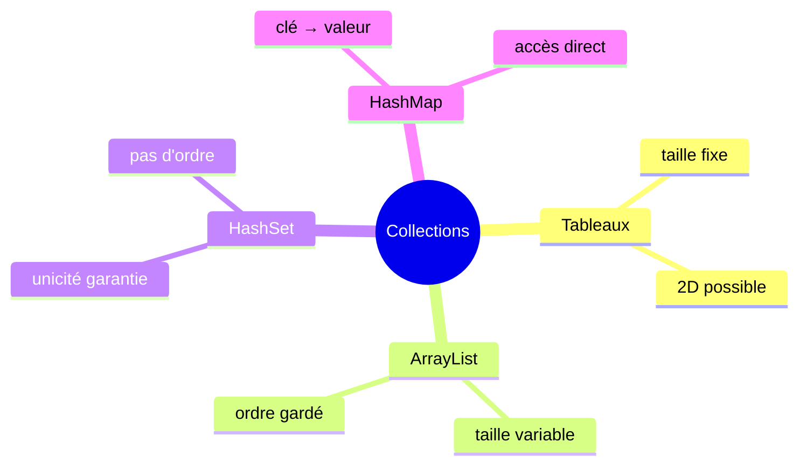

<div class="chapitre-titre-num">CHAPITRE 21</div>

# HashMap

## Objectifs pédagogiques

À la fin de ce chapitre, tu sauras utiliser `HashMap` pour associer une clé à une valeur, l'une des structures de données les plus utilisées dans tout le Java professionnel.

## A. Le problème

Retrouver une information à partir d'un identifiant (le nom d'un client, un code produit) en cherchant élément par élément dans un `ArrayList` fonctionne, mais devient lent sur une grande liste, et surtout, ce n'est pas naturel à écrire : on aimerait pouvoir écrire directement *« donne-moi les infos du client dont le code est JAS123 »*, sans avoir à parcourir toute une liste pour le retrouver.

## B. Exemple de la vie réelle

```{.uml}
clé            →    valeur

"JAS123"       →    "Jaslin"
"MAR456"       →    "Marie"
```

Pense à un annuaire téléphonique, ou à un casier avec des étiquettes numérotées. Tu ne cherches jamais un casier en les ouvrant tous un par un : tu regardes directement le numéro (la **clé**) et tu accèdes directement à son contenu (la **valeur**). C'est exactement le principe d'une `HashMap`.

## C. Explication très simple

> `HashMap` est une collection Java qui associe chaque **clé** unique à une **valeur**, permettant de retrouver instantanément une valeur à partir de sa clé, sans avoir à parcourir toute la collection.

## D. Premier exemple Java

```java
import java.util.HashMap;

HashMap<String, String> clients = new HashMap<>();
clients.put("JAS123", "Jaslin");
clients.put("MAR456", "Marie");

System.out.println(clients.get("JAS123")); // "Jaslin" → accès DIRECT, sans boucle !
```

## E. Explication ligne par ligne

```{.uml}
HashMap<String, String> clients = new HashMap<>();
    │        │       │       │
    │        │       │       └─ Le nom de la variable.
    │        │       └─ Type de la VALEUR (deuxième chevron).
    │        └─ Type de la CLÉ (premier chevron).
    └─ DEUX types entre les chevrons, séparés par une virgule — contrairement
       à ArrayList et HashSet qui n'en prenaient qu'un seul.

clients.put("JAS123", "Jaslin");
    │      │      │        │
    │      │      │        └─ La VALEUR associée.
    │      │      └─ La CLÉ, qui servira à la retrouver plus tard.
    │      └─ "put" (pas "add" !) : ajoute une association clé-valeur.
    └─ Sur l'objet HashMap.

clients.get("JAS123");
    │      │
    │      └─ Renvoie la valeur associée à cette clé, DIRECTEMENT,
    │         sans avoir besoin de la chercher parmi les autres.
    └─ "get" pour LIRE, "put" pour ÉCRIRE.
```

<div class="encadre vocabulaire">
<span class="encadre-titre">📖 Terme : Clé / Valeur</span>
Dans une <code>HashMap</code>, chaque entrée associe une <strong>clé</strong> (unique, utilisée pour retrouver l'entrée) à une <strong>valeur</strong> (l'information réellement stockée). Deux entrées ne peuvent jamais avoir la même clé : ajouter une clé déjà existante <strong>remplace</strong> silencieusement l'ancienne valeur associée.
</div>

## F. Deuxième exemple : les méthodes essentielles

```java
import java.util.HashMap;

public class GestionStock {
    public static void main(String[] args) {
        HashMap<String, Integer> stock = new HashMap<>();
        stock.put("Riz", 100);
        stock.put("Haricots", 50);
        stock.put("Sucre", 30);

        System.out.println(stock.get("Riz"));            // 100
        System.out.println(stock.containsKey("Sucre"));   // true
        System.out.println(stock.get("Farine"));          // null : clé absente !

        stock.put("Riz", 120); // remplace l'ancienne valeur (100 → 120), même clé
        System.out.println(stock.get("Riz")); // 120

        for (String produit : stock.keySet()) { // parcourir toutes les CLÉS
            System.out.println(produit + " : " + stock.get(produit));
        }
    }
}
```

| Méthode | Rôle |
|---|---|
| `put(cle, valeur)` | Ajoute, ou remplace si la clé existe déjà |
| `get(cle)` | Renvoie la valeur associée, ou `null` si la clé est absente |
| `containsKey(cle)` | `true` si la clé existe |
| `remove(cle)` | Retire l'entrée associée à cette clé |
| `keySet()` | Renvoie l'ensemble de toutes les clés (parcourable) |
| `size()` | Nombre d'associations clé-valeur |

<div class="encadre attention">
<span class="encadre-titre">⚠️ Erreur n°1 — Oublier de vérifier l'existence d'une clé avant get()</span>

```java
Integer quantite = stock.get("Farine"); // null, car "Farine" n'a jamais été ajoutée
int total = quantite + 10; // 💥 NullPointerException !
```

`get()` sur une clé absente renvoie `null`, pas une erreur immédiate — c'est **ensuite**, en essayant d'utiliser ce `null` comme un nombre, que le programme plante. Toujours vérifier avec `containsKey()` avant, ou utiliser la méthode `getOrDefault(cle, valeurParDefaut)`, qui évite complètement ce piège :

```java
int quantite = stock.getOrDefault("Farine", 0); // 0 si absente, jamais null
```
</div>

<div class="encadre astuce">
<span class="encadre-titre">💡 HashMap d'objets personnalisés en valeur</span>

```java
HashMap<String, Etudiant> etudiantsParMatricule = new HashMap<>();
etudiantsParMatricule.put("JAS123", new Etudiant("Jaslin", 22));

Etudiant e = etudiantsParMatricule.get("JAS123");
System.out.println(e.getNom());
```

C'est exactement ainsi qu'une vraie application retrouve, par exemple, un compte utilisateur à partir de son identifiant — bien plus naturel et rapide qu'un `ArrayList` parcouru en boucle.
</div>

## Erreurs fréquentes

<div class="encadre attention">
<span class="encadre-titre">⚠️ Erreur n°2 — Confondre put() et add()</span>

```java
HashMap<String, Integer> stock = new HashMap<>();
stock.add("Riz", 100); // ❌ erreur de compilation : HashMap n'a PAS de méthode add()
```

Contrairement à `ArrayList` et `HashSet`, `HashMap` utilise `put()`, jamais `add()` — une confusion très fréquente en changeant de structure de données.
</div>

<div class="encadre attention">
<span class="encadre-titre">⚠️ Erreur n°3 — Réutiliser une clé sans s'en rendre compte</span>

```java
HashMap<String, String> capitales = new HashMap<>();
capitales.put("Haiti", "Port-au-Prince");
capitales.put("Haiti", "Cap-Haïtien"); // ⚠️ remplace silencieusement la valeur précédente !

System.out.println(capitales.get("Haiti")); // "Cap-Haïtien", plus jamais "Port-au-Prince"
```

`put()` sur une clé déjà existante ne provoque **aucune erreur** : il remplace simplement l'ancienne valeur, silencieusement. Si tu veux détecter ce cas plutôt que l'ignorer, vérifie `containsKey()` avant d'appeler `put()`.
</div>

<div class="encadre progression">
<span class="encadre-titre">🎯 CE QUE TU SAIS MAINTENANT</span>

```text
✓ Je sais créer une HashMap avec un type de clé et un type de valeur.
✓ Je sais utiliser put() pour ajouter/remplacer, et get() pour lire.
✓ Je sais éviter le piège du null avec containsKey() ou getOrDefault().
✓ Je sais parcourir toutes les clés d'une HashMap avec keySet().
✓ Je sais qu'une HashMap peut stocker mes propres classes en valeur.
```
</div>

## Petit exercice

<div class="encadre exercice">
<span class="encadre-titre">📝 Vérifie ta compréhension</span>

Que va afficher ce code, et pourquoi ?

```java
HashMap<String, Integer> ages = new HashMap<>();
ages.put("Jaslin", 22);
ages.put("Jaslin", 23);
System.out.println(ages.size());
System.out.println(ages.get("Jaslin"));
```
</div>

## Correction

Le code affiche **1** puis **23**. La deuxième instruction `put("Jaslin", 23)` ne crée pas une nouvelle entrée : elle **remplace** la valeur associée à la clé `"Jaslin"`, déjà existante. La map ne contient donc qu'une seule entrée, avec la valeur la plus récente.

## Défi

<div class="encadre defi">
<span class="encadre-titre">🧩 Défi — À toi de jouer</span>

Écris une méthode `compterOccurrences(String[] mots)` qui renvoie une `HashMap<String, Integer>` associant chaque mot du tableau à son nombre d'occurrences (utilise `getOrDefault` pour incrémenter proprement).
</div>

### Corrigé du défi

```java
import java.util.HashMap;

public class Main {
    public static void main(String[] args) {
        String[] mots = {"riz", "haricots", "riz", "sucre", "riz", "haricots"};
        HashMap<String, Integer> compte = compterOccurrences(mots);

        for (String mot : compte.keySet()) {
            System.out.println(mot + " : " + compte.get(mot));
        }
    }

    static HashMap<String, Integer> compterOccurrences(String[] mots) {
        HashMap<String, Integer> compte = new HashMap<>();
        for (String mot : mots) {
            int occurrencesActuelles = compte.getOrDefault(mot, 0);
            compte.put(mot, occurrencesActuelles + 1);
        }
        return compte;
    }
}
```

Résultat (l'ordre d'affichage peut varier, `HashMap` ne le garantit pas, comme `HashSet`) :
```text
riz : 3
haricots : 2
sucre : 1
```

## Résumé du chapitre

- `HashMap<K, V>` associe une clé unique à une valeur, avec accès direct et rapide.
- `put(cle, valeur)` ajoute ou remplace ; `get(cle)` lit, et renvoie `null` si la clé est absente.
- `getOrDefault(cle, valeurParDefaut)` évite le piège du `null`.
- `put()` sur une clé existante remplace silencieusement la valeur précédente.
- `keySet()` permet de parcourir toutes les clés d'une map.

---

# 🎓 Révision de la Partie 5 — Collections

## Carte mentale de la Partie 5



## Questions de révision

1. Quelle est la limite principale d'un tableau classique par rapport à un ArrayList ?
2. Pourquoi un HashSet ne peut-il jamais contenir de doublon ?
3. Quelle méthode utilise-t-on pour lire une valeur dans une HashMap ? Et pour l'ajouter ?
4. Que renvoie `HashMap.get(cle)` si la clé n'existe pas ?

**Réponses :** (1) Sa taille est fixée une fois pour toutes à la création, elle ne peut ni grandir ni rétrécir. (2) Parce que `add()` vérifie automatiquement la présence de l'élément avant de l'ajouter, et ignore silencieusement toute tentative de doublon. (3) `get(cle)` pour lire, `put(cle, valeur)` pour ajouter ou remplacer. (4) `null`.

## Mini-projet de la Partie 5

<div class="encadre defi">
<span class="encadre-titre">🧩 Mini-projet — Gestion de stock avec alerte doublons</span>

Combine les trois structures de données de cette partie :

1. Un `ArrayList<String>` pour l'historique des mouvements de stock (des messages comme `"Ajout : Riz"`).
2. Un `HashSet<String>` des produits déjà catalogués, pour détecter si un produit est ajouté deux fois par erreur.
3. Un `HashMap<String, Integer>` pour la quantité actuelle de chaque produit.

Écris une méthode `ajouterProduit(String nom, int quantite)` qui : refuse (avec un message) si le produit existe déjà dans le HashSet, sinon l'ajoute au HashSet, à la HashMap, et enregistre le mouvement dans l'ArrayList.
</div>

### Corrigé du mini-projet

```java
import java.util.ArrayList;
import java.util.HashMap;
import java.util.HashSet;

public class GestionStock {
    static ArrayList<String> historique = new ArrayList<>();
    static HashSet<String> produitsCatalogues = new HashSet<>();
    static HashMap<String, Integer> quantites = new HashMap<>();

    public static void main(String[] args) {
        ajouterProduit("Riz", 100);
        ajouterProduit("Haricots", 50);
        ajouterProduit("Riz", 200); // refusé : déjà catalogué

        System.out.println("--- Historique ---");
        for (String mouvement : historique) {
            System.out.println(mouvement);
        }
    }

    static void ajouterProduit(String nom, int quantite) {
        if (produitsCatalogues.contains(nom)) {
            System.out.println("Refusé : " + nom + " est déjà catalogué");
            return;
        }
        produitsCatalogues.add(nom);
        quantites.put(nom, quantite);
        historique.add("Ajout : " + nom + " (" + quantite + ")");
    }
}
```

---

*Chapitre suivant : les exceptions, pour apprendre à gérer proprement les erreurs qui surviennent pendant l'exécution d'un programme.*
