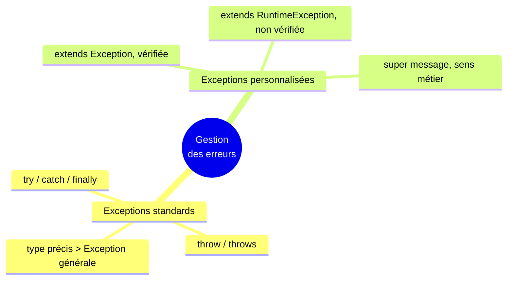

<div class="chapitre-titre-num">CHAPITRE 23</div>

# Exceptions personnalisées

## Objectifs pédagogiques

À la fin de ce chapitre, tu sauras créer tes propres types d'exceptions, avec un sens métier précis, plutôt que de toujours réutiliser les exceptions génériques de Java.

## A. Le problème

Au chapitre 22, on levait des exceptions génériques comme `IllegalArgumentException` pour signaler un stock insuffisant. Mais ce nom ne dit rien du **sens métier réel** de l'erreur. Dans une vraie application bancaire, on préférerait qu'un `catch (SoldeInsuffisantException e)` se lise clairement, plutôt qu'un vague `catch (IllegalArgumentException e)` qui pourrait, en réalité, venir de n'importe où dans le programme.

## B. Exemple de la vie réelle

Pense à des formulaires de réclamation différents selon le problème rencontré : un formulaire "colis perdu", un formulaire "colis endommagé", un formulaire "retard de livraison". Chacun a un nom précis, immédiatement reconnaissable, plutôt qu'un unique formulaire générique "problème" qu'il faudrait ouvrir et lire en entier pour comprendre de quoi il s'agit vraiment.

## C. Explication très simple

> Une **exception personnalisée** est une classe que tu crées toi-même, en héritant de `Exception` (ou d'une de ses sous-classes), pour représenter une erreur avec un sens métier précis et un nom explicite.

## D. Premier exemple Java

```java
class SoldeInsuffisantException extends Exception {
    public SoldeInsuffisantException(String message) {
        super(message); // transmet le message à la classe mère Exception
    }
}
```

## E. Explication ligne par ligne

```{.uml}
class SoldeInsuffisantException extends Exception {
   │                                  │        │
   │                                  │        └─ La classe MÈRE : Exception, fournie par Java.
   │                                  └─ Exactement l'héritage vu au chapitre 12 !
   └─ Le nom, choisi par toi, décrit précisément la situation d'erreur.

public SoldeInsuffisantException(String message) {
    super(message);
}
    │
    └─ "super(message)" transmet le texte explicatif au CONSTRUCTEUR de
       Exception, qui sait déjà comment le stocker et le rendre
       disponible via getMessage() (utilisé au chapitre 22).
```

Une exception personnalisée est une classe presque comme les autres — la seule règle particulière est qu'elle doit hériter (directement ou indirectement) de `Exception`, ce qui la rend utilisable avec `throw` et `catch`.

## F. Deuxième exemple : utilisation dans une application bancaire

```java
class CompteBancaire {
    private String titulaire;
    private double solde;

    CompteBancaire(String titulaire, double soldeInitial) {
        this.titulaire = titulaire;
        this.solde = soldeInitial;
    }

    void retirer(double montant) throws SoldeInsuffisantException {
        if (montant > solde) {
            throw new SoldeInsuffisantException(
                "Solde insuffisant : " + solde + " HTG disponibles, " + montant + " HTG demandés"
            );
        }
        solde -= montant;
    }

    double getSolde() {
        return solde;
    }
}
```

```java
public class Main {
    public static void main(String[] args) {
        CompteBancaire compte = new CompteBancaire("Jaslin", 1000);

        try {
            compte.retirer(1500);
        } catch (SoldeInsuffisantException e) {
            System.out.println("Retrait refusé : " + e.getMessage());
        }

        System.out.println("Solde final : " + compte.getSolde()); // 1000.0, inchangé
    }
}
```

Résultat :
```text
Retrait refusé : Solde insuffisant : 1000.0 HTG disponibles, 1500.0 HTG demandés
Solde final : 1000.0
```

<div class="encadre vocabulaire">
<span class="encadre-titre">📖 Terme : Exception vérifiée (checked) vs non vérifiée (unchecked)</span>
`SoldeInsuffisantException extends Exception` crée une exception <strong>vérifiée</strong> (<em>checked</em>) : le compilateur <strong>oblige</strong> à la déclarer avec <code>throws</code> sur toute méthode qui peut la lever (comme <code>retirer()</code> ci-dessus), et à l'attraper explicitement là où elle est appelée. À l'inverse, hériter de <code>RuntimeException</code> (comme <code>IllegalArgumentException</code> ou <code>ArithmeticException</code>, déjà croisées) crée une exception <strong>non vérifiée</strong> : elle n'exige ni <code>throws</code>, ni <code>catch</code> obligatoire — pratique, mais plus facile à oublier de gérer.
</div>

<div class="encadre astuce">
<span class="encadre-titre">💡 Quand créer une exception personnalisée ?</span>
Dès qu'une erreur possède un vrai sens métier récurrent dans ton application (solde insuffisant, stock épuisé, place déjà réservée, utilisateur non autorisé), une exception personnalisée rend le code bien plus lisible qu'une exception générique — et permet, plus tard, d'attraper précisément <strong>ce</strong> type d'erreur, sans risquer d'attraper autre chose par accident.
</div>

## Erreurs fréquentes

<div class="encadre attention">
<span class="encadre-titre">⚠️ Erreur n°1 — Oublier throws sur une méthode qui lève une exception vérifiée</span>

```java
void retirer(double montant) { // ❌ erreur de compilation : manque "throws SoldeInsuffisantException"
    if (montant > solde) {
        throw new SoldeInsuffisantException("...");
    }
    ...
}
```

Une exception héritant directement d'`Exception` (vérifiée) **oblige** à déclarer `throws NomException` sur la signature de toute méthode qui peut la lever, sous peine d'erreur de compilation. C'est le prix à payer pour la sécurité que ça apporte : le compilateur garantit qu'aucun appelant ne pourra "oublier" de gérer cette erreur.
</div>

<div class="encadre attention">
<span class="encadre-titre">⚠️ Erreur n°2 — Oublier super(message) dans le constructeur</span>

```java
class MonException extends Exception {
    public MonException(String message) {
        // ❌ super(message) oublié : le message ne sera JAMAIS accessible via getMessage() !
    }
}

try {
    throw new MonException("Erreur précise");
} catch (MonException e) {
    System.out.println(e.getMessage()); // affiche "null" au lieu du vrai message !
}
```

Sans `super(message)`, le message explicatif n'est jamais transmis à la classe mère `Exception`, et `getMessage()` renverra `null` — une erreur silencieuse et frustrante à déboguer.
</div>

<div class="encadre progression">
<span class="encadre-titre">🎯 CE QUE TU SAIS MAINTENANT</span>

```text
✓ Je sais créer une exception personnalisée en héritant de Exception.
✓ Je sais transmettre le message d'erreur via super(message).
✓ Je sais déclarer throws sur une méthode qui lève une exception vérifiée.
✓ Je comprends la différence entre exception vérifiée (Exception) et
  non vérifiée (RuntimeException).
✓ Je sais quand une exception personnalisée est préférable à une
  exception générique.
```
</div>

## Petit exercice

<div class="encadre exercice">
<span class="encadre-titre">📝 Vérifie ta compréhension</span>

Pourquoi ce code ne compile-t-il pas ?

```java
class StockEpuiseException extends Exception {
    public StockEpuiseException(String message) { super(message); }
}

class Produit {
    int stock;
    void retirer(int quantite) {
        if (quantite > stock) {
            throw new StockEpuiseException("Stock épuisé");
        }
        stock -= quantite;
    }
}
```
</div>

## Correction

`StockEpuiseException` hérite directement d'`Exception` : c'est une exception **vérifiée**. La méthode `retirer()` la lève (`throw`), mais ne déclare pas `throws StockEpuiseException` dans sa signature : erreur de compilation. Correction : `void retirer(int quantite) throws StockEpuiseException { ... }`.

## Défi

<div class="encadre defi">
<span class="encadre-titre">🧩 Défi — À toi de jouer</span>

Crée une exception personnalisée `PlaceIndisponibleException`, utilisée par une classe `Cinema` (attribut `int placesDisponibles`) dont la méthode `reserver(int nombrePlaces)` la lève si `nombrePlaces > placesDisponibles`. Teste-la avec un `try/catch` dans `main`.
</div>

### Corrigé du défi

```java
class PlaceIndisponibleException extends Exception {
    public PlaceIndisponibleException(String message) {
        super(message);
    }
}

class Cinema {
    private int placesDisponibles;

    Cinema(int placesDisponibles) {
        this.placesDisponibles = placesDisponibles;
    }

    void reserver(int nombrePlaces) throws PlaceIndisponibleException {
        if (nombrePlaces > placesDisponibles) {
            throw new PlaceIndisponibleException(
                "Seulement " + placesDisponibles + " place(s) restante(s), " + nombrePlaces + " demandée(s)"
            );
        }
        placesDisponibles -= nombrePlaces;
        System.out.println(nombrePlaces + " place(s) réservée(s) avec succès");
    }
}

public class Main {
    public static void main(String[] args) {
        Cinema cinema = new Cinema(5);

        try {
            cinema.reserver(3);
            cinema.reserver(4); // dépasse les 2 places restantes
        } catch (PlaceIndisponibleException e) {
            System.out.println("Réservation refusée : " + e.getMessage());
        }
    }
}
```

## Résumé du chapitre

- Une **exception personnalisée** hérite d'`Exception` (ou `RuntimeException`) et représente une erreur avec un sens métier précis.
- `super(message)` transmet le message explicatif à la classe mère, indispensable pour que `getMessage()` fonctionne.
- Hériter d'`Exception` crée une exception **vérifiée**, qui exige `throws` sur la méthode qui la lève.
- Hériter de `RuntimeException` crée une exception **non vérifiée**, sans `throws` obligatoire.
- Une exception au nom métier précis rend le code plus lisible et plus sûr qu'une exception générique.

---

# 🎓 Révision de la Partie 6 — Gestion des erreurs

## Carte mentale de la Partie 6



## Questions de révision

1. Que se passe-t-il avec le reste du bloc `try` dès qu'une exception survient ?
2. Dans quel cas `finally` ne s'exécute-t-il pas ?
3. Pourquoi une exception personnalisée est-elle souvent préférable à une exception générique ?
4. Quelle est la conséquence pratique d'hériter d'`Exception` plutôt que de `RuntimeException` ?

**Réponses :** (1) Il est immédiatement abandonné ; Java saute directement au `catch` correspondant. (2) Quasiment jamais — `finally` s'exécute dans (presque) tous les cas, y compris après un `return` dans le `try` ou le `catch`. (3) Parce qu'elle donne un nom explicite et un sens métier clair à l'erreur, facilitant la lecture du code et permettant de l'attraper précisément. (4) Le compilateur oblige à déclarer `throws` sur toute méthode qui la lève, et à la gérer explicitement là où elle est appelée.

## Mini-projet de la Partie 6

<div class="encadre defi">
<span class="encadre-titre">🧩 Mini-projet — Distributeur automatique sécurisé</span>

Crée deux exceptions personnalisées, `MonnaieInsuffisanteException` et `ProduitEpuiseException`, utilisées par une classe `Distributeur` (une `HashMap<String, Integer>` de stock par produit, chapitre 21) dont la méthode `acheter(String produit, double montantInsere, double prix)` lève l'une ou l'autre selon le cas, et diminue le stock en cas de succès.
</div>

### Corrigé du mini-projet

```java
import java.util.HashMap;

class MonnaieInsuffisanteException extends Exception {
    public MonnaieInsuffisanteException(String message) { super(message); }
}

class ProduitEpuiseException extends Exception {
    public ProduitEpuiseException(String message) { super(message); }
}

class Distributeur {
    private HashMap<String, Integer> stock = new HashMap<>();

    void approvisionner(String produit, int quantite) {
        stock.put(produit, quantite);
    }

    void acheter(String produit, double montantInsere, double prix)
            throws MonnaieInsuffisanteException, ProduitEpuiseException {
        int quantiteDisponible = stock.getOrDefault(produit, 0);
        if (quantiteDisponible <= 0) {
            throw new ProduitEpuiseException(produit + " est épuisé");
        }
        if (montantInsere < prix) {
            throw new MonnaieInsuffisanteException("Il manque " + (prix - montantInsere) + " HTG");
        }
        stock.put(produit, quantiteDisponible - 1);
        System.out.println(produit + " distribué avec succès");
    }
}

public class Main {
    public static void main(String[] args) {
        Distributeur distributeur = new Distributeur();
        distributeur.approvisionner("Soda", 1);

        try {
            distributeur.acheter("Soda", 30, 50);
        } catch (MonnaieInsuffisanteException | ProduitEpuiseException e) {
            // "|" : ATTRAPE PLUSIEURS types d'exceptions dans un SEUL catch (Java moderne)
            System.out.println("Achat refusé : " + e.getMessage());
        }
    }
}
```

<div class="encadre astuce">
<span class="encadre-titre">💡 Le catch multi-types avec |</span>
Depuis les versions récentes de Java, un seul <code>catch (TypeA | TypeB e)</code> peut attraper plusieurs types d'exceptions à la fois, quand la réaction souhaitée est identique — évitant de dupliquer le même code de réaction dans deux blocs <code>catch</code> séparés.
</div>

---

*Chapitre suivant : lire et écrire dans des fichiers, pour que ton programme puisse conserver des données au-delà de sa propre exécution.*
