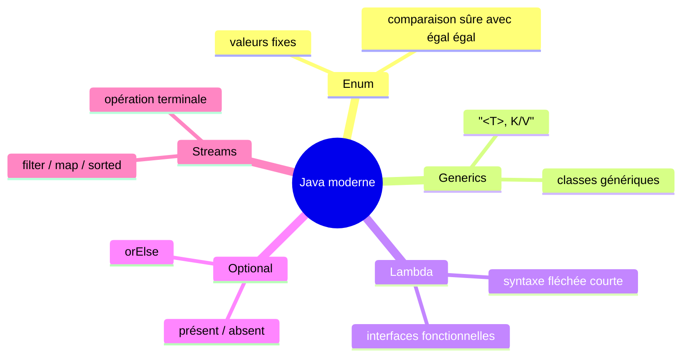

<div class="chapitre-titre-num">CHAPITRE 29</div>

# Stream API

## Objectifs pédagogiques

À la fin de ce chapitre, tu sauras traiter une collection entière de façon déclarative avec la Stream API, en combinant tableaux, ArrayList, lambdas et Optional — tout ce que tu as appris depuis le chapitre 18.

## A. Le problème

Reprenons le défi du chapitre 27 : filtrer les nombres pairs d'une liste, "à la main" :

```java
ArrayList<Integer> resultat = new ArrayList<>();
for (int n : nombres) {
    if (n % 2 == 0) {
        resultat.add(n);
    }
}
```

Ce code fonctionne, mais il décrit **comment** faire (créer une liste vide, boucler, tester, ajouter), plutôt que **ce qu'on veut** (les nombres pairs de cette liste). Sur des traitements plus complexes (filtrer, puis transformer, puis trier, puis compter), enchaîner les boucles devient vite long et difficile à relire d'un coup d'œil.

## B. Exemple de la vie réelle

Pense à une chaîne de tri postal : les colis passent par une série de stations, chacune effectuant **une seule** opération précise (trier par région, peser, étiqueter), avant de passer à la suivante. Chaque station ne s'occupe que de sa propre tâche, sans connaître le détail des autres. La Stream API fonctionne pareil : une suite d'opérations simples, enchaînées, chacune transformant les données avant de les transmettre à la suivante.

## C. Explication très simple

> Un **Stream** est une chaîne d'opérations qu'on applique successivement à une collection, chacune décrivant **ce qu'on veut faire** (filtrer, transformer, trier...), sans jamais écrire soi-même la boucle sous-jacente.

## D. Premier exemple Java

```java
import java.util.ArrayList;
import java.util.List;

ArrayList<Integer> nombres = new ArrayList<>(List.of(1, 2, 3, 4, 5, 6, 7, 8));

List<Integer> pairs = nombres.stream()
    .filter(n -> n % 2 == 0)
    .toList();

System.out.println(pairs); // [2, 4, 6, 8]
```

## E. Explication ligne par ligne

```{.uml}
nombres.stream()
    │       │
    │       └─ Transforme la collection en un STREAM : une chaîne
    │          d'opérations en attente, PAS encore exécutées.
    └─ La collection de départ (n'importe quel ArrayList, HashSet...).

    .filter(n -> n % 2 == 0)
        │           │
        │           └─ Une LAMBDA (chapitre 27) qui teste chaque élément :
        │              vrai = conservé, faux = écarté.
        └─ NE GARDE que les éléments qui respectent la condition.

    .toList();
        │
        └─ EXÉCUTE enfin toute la chaîne, et renvoie le résultat sous
           forme de vraie liste. Sans cette étape finale, rien ne
           s'exécute réellement — un Stream est "paresseux".
```

## F. Deuxième exemple : enchaîner plusieurs opérations

```java
import java.util.List;

public class TraitementEtudiants {
    public static void main(String[] args) {
        List<Etudiant> etudiants = List.of(
            new Etudiant("Marie", 16.5),
            new Etudiant("Paul", 8.0),
            new Etudiant("Jaslin", 14.0),
            new Etudiant("Anne", 19.0)
        );

        List<String> nomsDesAdmis = etudiants.stream()
            .filter(e -> e.getMoyenne() >= 10)         // ne garde que les admis
            .sorted((a, b) -> Double.compare(b.getMoyenne(), a.getMoyenne())) // trie par moyenne décroissante
            .map(e -> e.getNom())                        // transforme Etudiant → String (son nom)
            .toList();

        System.out.println(nomsDesAdmis); // [Anne, Marie, Jaslin]

        long nombreAdmis = etudiants.stream()
            .filter(e -> e.getMoyenne() >= 10)
            .count();

        System.out.println("Nombre d'admis : " + nombreAdmis); // 3

        double moyenneGenerale = etudiants.stream()
            .mapToDouble(e -> e.getMoyenne())
            .average()
            .orElse(0.0); // Optional, exactement comme au chapitre 28 !

        System.out.println("Moyenne générale : " + moyenneGenerale);
    }
}
```

| Opération | Rôle |
|---|---|
| `filter(condition)` | Ne garde que les éléments respectant la condition |
| `map(transformation)` | Transforme chaque élément en autre chose |
| `sorted(comparateur)` | Trie les éléments |
| `count()` | Compte les éléments restants |
| `toList()` | Termine la chaîne, renvoie une vraie liste |
| `average()`, `sum()`, `max()`, `min()` | Calculs numériques (sur `mapToDouble`/`mapToInt`) |

<div class="encadre vocabulaire">
<span class="encadre-titre">📖 Terme : Opération intermédiaire vs opération terminale</span>
<code>filter</code>, <code>map</code> et <code>sorted</code> sont des <strong>opérations intermédiaires</strong> : elles renvoient un nouveau Stream, permettant d'en enchaîner d'autres à la suite. <code>toList()</code>, <code>count()</code> et <code>average()</code> sont des <strong>opérations terminales</strong> : elles déclenchent réellement l'exécution de toute la chaîne et produisent un résultat final. Sans opération terminale, un Stream ne fait strictement rien.
</div>

## Erreurs fréquentes

<div class="encadre attention">
<span class="encadre-titre">⚠️ Erreur n°1 — Oublier l'opération terminale</span>

```java
nombres.stream().filter(n -> n % 2 == 0); // ❌ ne fait RIEN : aucune opération terminale !
```

Sans `toList()`, `count()`, ou une autre opération terminale, la chaîne de traitement n'est **jamais réellement exécutée** — un Stream ne fait rien tant qu'on ne lui demande pas explicitement un résultat final.
</div>

<div class="encadre attention">
<span class="encadre-titre">⚠️ Erreur n°2 — Réutiliser un Stream déjà consommé</span>

```java
var stream = nombres.stream().filter(n -> n % 2 == 0);
long count1 = stream.count();
long count2 = stream.count(); // 💥 IllegalStateException : un Stream ne se parcourt qu'UNE seule fois !
```

Un `Stream`, une fois son opération terminale exécutée, ne peut **plus jamais être réutilisé**. S'il faut refaire le même traitement, il faut repartir de `nombres.stream()`.
</div>

<div class="encadre progression">
<span class="encadre-titre">🎯 CE QUE TU SAIS MAINTENANT</span>

```text
✓ Je sais créer un Stream à partir d'une collection avec .stream().
✓ Je sais filtrer avec filter(), transformer avec map(), trier avec sorted().
✓ Je sais qu'un Stream ne s'exécute qu'avec une opération terminale
  (toList, count, average...).
✓ Je sais qu'un Stream ne peut être parcouru qu'une seule fois.
✓ Je vois comment tout ce que j'ai appris (collections, lambdas,
  Optional) collabore dans un seul outil.
```
</div>

## Petit exercice

<div class="encadre exercice">
<span class="encadre-titre">📝 Vérifie ta compréhension</span>

Écris, avec un Stream, le code qui transforme une liste de `String` en liste de leurs longueurs (`int`), puis affiche le résultat.
</div>

## Correction

```java
List<String> mots = List.of("Java", "POO", "Stream");
List<Integer> longueurs = mots.stream()
    .map(mot -> mot.length())
    .toList();

System.out.println(longueurs); // [4, 3, 6]
```

## Défi

<div class="encadre defi">
<span class="encadre-titre">🧩 Défi — À toi de jouer</span>

À partir d'une `List<Produit>` (attributs `nom`, `prix`, `quantiteEnStock`), écris une chaîne de Stream qui : ne garde que les produits en stock (`quantiteEnStock > 0`), calcule la valeur totale du stock restant (prix × quantité, sommés), avec `mapToDouble` et `sum()`.
</div>

### Corrigé du défi

```java
import java.util.List;

public class Main {
    public static void main(String[] args) {
        List<Produit> produits = List.of(
            new Produit("Riz", 250.0, 100),
            new Produit("Sucre", 150.0, 0),   // épuisé
            new Produit("Haricots", 180.0, 50)
        );

        double valeurTotale = produits.stream()
            .filter(p -> p.getQuantiteEnStock() > 0)
            .mapToDouble(p -> p.getPrix() * p.getQuantiteEnStock())
            .sum();

        System.out.println("Valeur totale du stock : " + valeurTotale + " HTG");
        // (250 * 100) + (180 * 50) = 25000 + 9000 = 34000.0
    }
}
```

## Résumé du chapitre

- Un **Stream** enchaîne des opérations déclaratives sur une collection, sans écrire de boucle manuelle.
- `filter()` sélectionne, `map()` transforme, `sorted()` trie : des **opérations intermédiaires**, enchaînables.
- `toList()`, `count()`, `sum()`, `average()` sont des **opérations terminales**, qui déclenchent réellement le traitement.
- Un Stream sans opération terminale ne fait rien ; un Stream déjà consommé ne peut pas être réutilisé.
- La Stream API combine naturellement tout ce qui a été appris : collections, lambdas, et `Optional` (pour `average()` notamment).

---

# 🎓 Révision de la Partie 8 — Java moderne

## Carte mentale de la Partie 8



## Questions de révision

1. Pourquoi comparer des `enum` avec `==` est-il sûr, contrairement aux `String` ?
2. À quoi servent les generics (`<T>`), concrètement ?
3. Quelle est la condition pour qu'une interface puisse être implémentée par une expression lambda ?
4. Pourquoi une méthode devrait-elle renvoyer `Optional.empty()` plutôt que `null` ?
5. Que se passe-t-il si on oublie l'opération terminale d'un Stream ?

**Réponses :** (1) Chaque valeur d'enum n'existe qu'en un seul exemplaire garanti dans toute l'application. (2) À vérifier, dès la compilation, la cohérence des types utilisés dans une classe ou une méthode, sans transtypage manuel risqué. (3) L'interface doit être fonctionnelle, c'est-à-dire n'avoir qu'une seule méthode abstraite. (4) Pour rendre l'absence de valeur explicite dans la signature de la méthode, et forcer l'appelant à la gérer proprement. (5) Rien ne s'exécute : un Stream reste entièrement "paresseux" tant qu'aucune opération terminale n'est appelée.

## Mini-projet de la Partie 8

<div class="encadre defi">
<span class="encadre-titre">🧩 Mini-projet — Tableau de bord d'une boutique, en Java moderne</span>

Combine toutes les notions de la Partie 8 :

1. Un `enum Categorie` (ALIMENTAIRE, HYGIENE, AUTRE).
2. Une classe `Produit` avec `nom`, `prix`, `quantiteEnStock`, `Categorie categorie`.
3. Une méthode `rechercherParNom(List<Produit> produits, String nom)` renvoyant un `Optional<Produit>`.
4. Un Stream qui calcule, pour la catégorie `ALIMENTAIRE` uniquement, la valeur totale du stock.
</div>

### Corrigé du mini-projet

```java
import java.util.List;
import java.util.Optional;

enum Categorie { ALIMENTAIRE, HYGIENE, AUTRE }

class Produit {
    private String nom;
    private double prix;
    private int quantiteEnStock;
    private Categorie categorie;

    Produit(String nom, double prix, int quantiteEnStock, Categorie categorie) {
        this.nom = nom;
        this.prix = prix;
        this.quantiteEnStock = quantiteEnStock;
        this.categorie = categorie;
    }

    String getNom() { return nom; }
    double getPrix() { return prix; }
    int getQuantiteEnStock() { return quantiteEnStock; }
    Categorie getCategorie() { return categorie; }
}

public class Main {
    public static void main(String[] args) {
        List<Produit> produits = List.of(
            new Produit("Riz", 250.0, 100, Categorie.ALIMENTAIRE),
            new Produit("Savon", 75.0, 200, Categorie.HYGIENE),
            new Produit("Haricots", 180.0, 50, Categorie.ALIMENTAIRE)
        );

        Optional<Produit> resultat = rechercherParNom(produits, "Riz");
        resultat.ifPresentOrElse(
            p -> System.out.println("Trouvé : " + p.getNom()),
            () -> System.out.println("Introuvable")
        );

        double valeurAlimentaire = produits.stream()
            .filter(p -> p.getCategorie() == Categorie.ALIMENTAIRE)
            .mapToDouble(p -> p.getPrix() * p.getQuantiteEnStock())
            .sum();

        System.out.println("Valeur stock alimentaire : " + valeurAlimentaire + " HTG");
    }

    static Optional<Produit> rechercherParNom(List<Produit> produits, String nom) {
        return produits.stream()
            .filter(p -> p.getNom().equals(nom))
            .findFirst(); // une opération terminale renvoyant directement un Optional !
    }
}
```

---

*Chapitre suivant : UML, pour apprendre à représenter visuellement l'architecture d'un programme avant même d'écrire la moindre ligne de code.*
