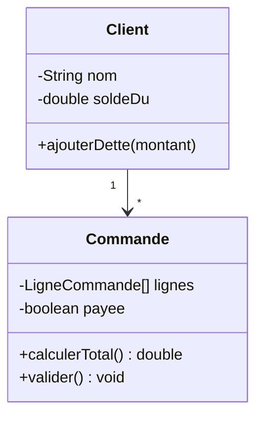
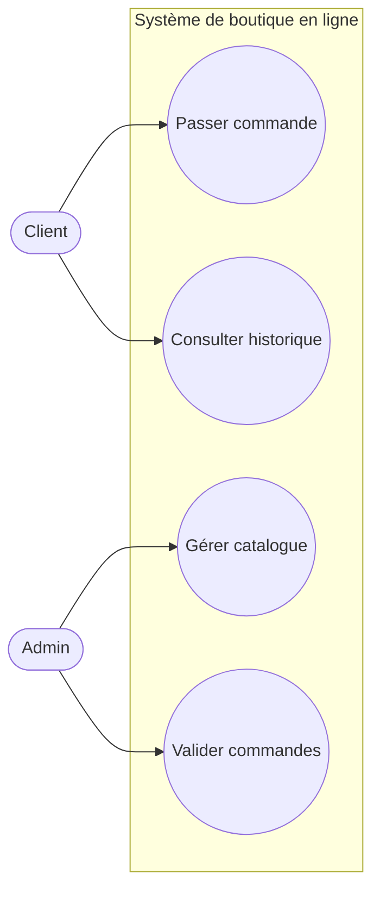
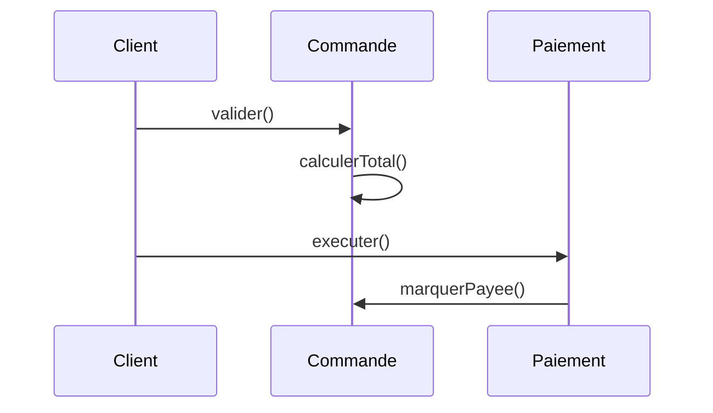
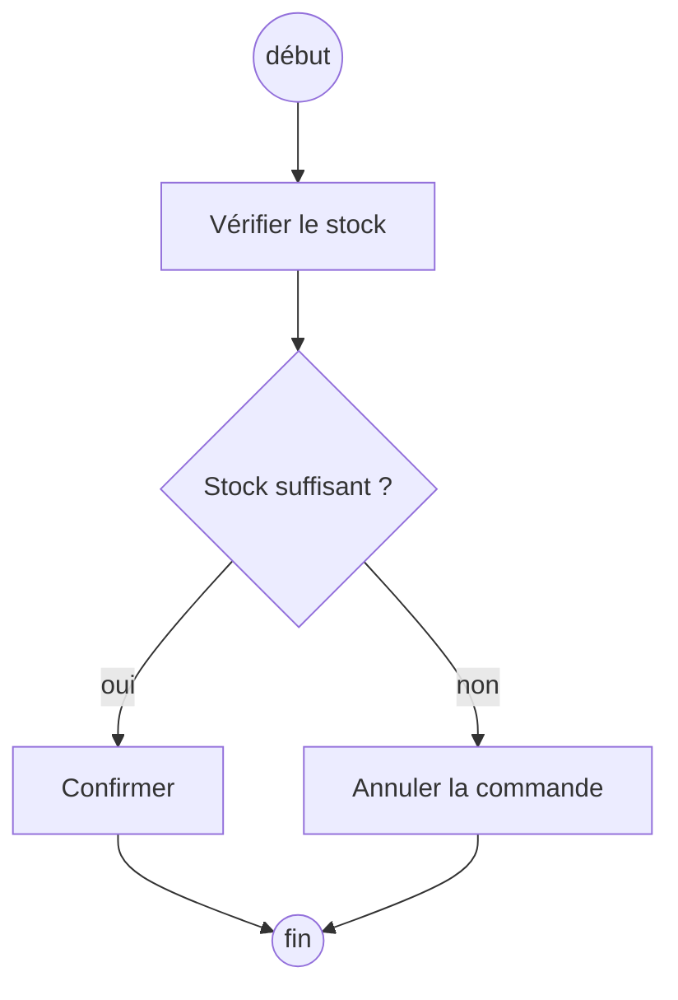
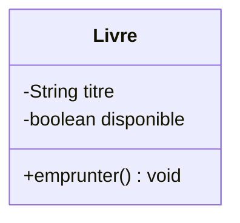
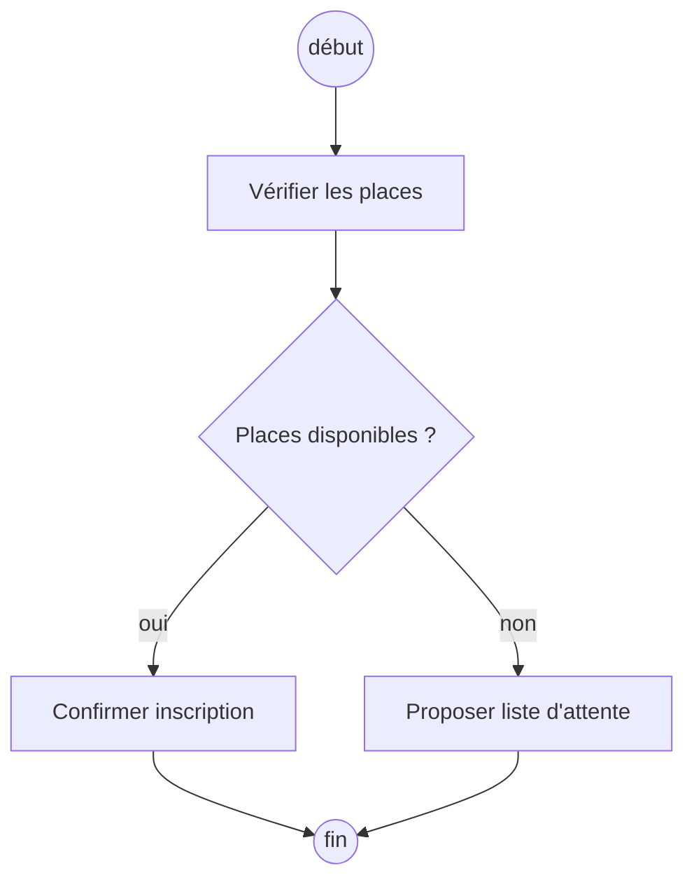

<div class="chapitre-titre-num">CHAPITRE 30</div>

# Comprendre UML

## Objectifs pédagogiques

À la fin de ce chapitre, tu sauras lire et dessiner les quatre diagrammes UML les plus utiles à un développeur débutant : diagramme de classes, cas d'utilisation, séquence et activités — et tu sauras transformer chacun d'eux en vrai code Java.

## A. Le problème

Construire un programme de plusieurs classes sans plan préalable, c'est comme construire une maison sans dessiner d'abord ses plans : on risque de découvrir, une fois le mur monté, qu'il manquait une porte. Avant même d'écrire la moindre ligne de code, il est souvent bien plus rapide de **dessiner** la structure et le déroulement d'un programme.

## B. Explication très simple

> **UML** (Unified Modeling Language, "langage de modélisation unifié") est un ensemble de conventions de **dessin standardisées**, comprises par tous les développeurs du monde, pour représenter visuellement la structure et le comportement d'un programme, avant ou pendant son écriture.

Tu as déjà croisé un diagramme UML très simple depuis le chapitre 1 (le diagramme de classe `Voiture`), sans qu'on le nomme formellement. Ce chapitre systématise ce que tu utilisais déjà intuitivement, et introduit trois nouveaux types de diagrammes.

## 1. Le diagramme de classes

### Le problème

Décrire par écrit, en une seule phrase, la structure complète d'un système de plusieurs classes en interaction devient vite confus. Un dessin structuré est bien plus rapide à lire d'un coup d'œil.

### Le diagramme



### Explication

```{.uml}
┌──────────┐
│   Nom     │  ← nom de la classe, en haut
├──────────┤
│ - attribut │  ← "-" = private ; "+" = public ; "#" = protected
├──────────┤
│ + methode()│  ← méthodes, en bas
└──────────┘

"1" et "*" sur la ligne de relation : la MULTIPLICITÉ. Ici, "1 Client
peut avoir PLUSIEURS (*) Commande" — exactement l'association du
chapitre 16, entre Client et Commande.
```

### Transformation en Java

```java
class Client {
    private String nom;
    private double soldeDu;

    void ajouterDette(double montant) {
        soldeDu += montant;
    }
}

class Commande {
    private LigneCommande[] lignes;
    private boolean payee;

    double calculerTotal() { /* ... */ return 0; }
    void valider() { /* ... */ }
}
```

Chaque `-` du diagramme devient un attribut `private` ; chaque `+` devient une méthode `public` — une correspondance directe, presque mécanique.

## 2. Le diagramme de cas d'utilisation (Use Case)

### Le problème

Avant même de penser aux classes, il faut savoir **qui** utilise le système, et **pour quoi faire**. Un diagramme de classes ne répond pas à cette question — il décrit la structure interne, pas les besoins des utilisateurs.

### Le diagramme



### Explication

```{.uml}
Bonhomme (ou rectangle avec le nom) = un ACTEUR : une personne (ou un
                                       autre système) qui interagit
                                       avec le programme.
(Ellipse)                           = un CAS D'UTILISATION : une action
                                       concrète que l'acteur peut réaliser.
Ligne acteur → cas d'utilisation    = cet acteur PEUT réaliser cette action.
```

Ce diagramme se dessine **avant** le diagramme de classes : il aide à identifier les vraies fonctionnalités attendues, avant même de réfléchir à la structure technique qui les réalisera.

### Transformation en Java

Chaque cas d'utilisation devient typiquement une **méthode publique**, généralement regroupée dans une classe "service" (notion approfondie au chapitre 37, MVC) :

```java
class ServiceBoutique {
    void passerCommande(Client client, Commande commande) { /* ... */ }
    void consulterHistorique(Client client) { /* ... */ }
    void gererCatalogue(Admin admin) { /* ... */ }
    void validerCommandes(Admin admin) { /* ... */ }
}
```

## 3. Le diagramme de séquence

### Le problème

Un diagramme de classes montre **qui connaît qui**, mais pas **dans quel ordre** les objets s'appellent entre eux pour réaliser une action précise, étape par étape, dans le temps.

### Le diagramme



### Explication

```text
Colonne verticale = un OBJET participant à l'échange, avec sa "ligne de
                     vie" verticale (le temps s'écoule de haut en bas).
Flèche horizontale = un APPEL DE MÉTHODE d'un objet vers un autre,
                      dans l'ORDRE exact où il se produit.
```

Ce diagramme retrouve exactement le schéma de collaboration dessiné "à la main" au chapitre 17 — UML lui donne simplement une notation standardisée et universellement reconnue.

### Transformation en Java

```java
Client client = ...;
Commande commande = new Commande(client, lignes);
commande.valider();           // appelle calculerTotal() en interne

Paiement paiement = new Paiement(commande, montant);
paiement.executer();          // appelle commande.marquerPayee() en interne
```

Chaque flèche du diagramme correspond directement à une ligne d'appel de méthode dans le code, dans le même ordre exact.

## 4. Le diagramme d'activités

### Le problème

Un processus métier (comme "traiter une commande") comporte souvent des étapes, des décisions, et des chemins différents selon les cas — un `if/else` (chapitre 5) visuel, avant même d'écrire une ligne de code.

### Le diagramme



### Explication

```text
● (point plein)     = DÉBUT du processus
[Rectangle]         = une ACTION à réaliser
<Losange>            = une DÉCISION, avec plusieurs chemins possibles
⬤ (point cerclé)    = FIN du processus
```

### Transformation en Java

```java
static void traiterCommande(Commande commande) {
    if (commande.stockSuffisant()) {
        commande.confirmer();
    } else {
        commande.annuler();
    }
}
```

Le losange du diagramme devient directement un `if/else` (chapitre 5) ; chaque rectangle devient un appel de méthode.

## Erreurs fréquentes

<div class="encadre attention">
<span class="encadre-titre">⚠️ Erreur n°1 — Confondre diagramme de classes et diagramme de séquence</span>
Le diagramme de classes montre la structure <strong>statique</strong> (qui connaît qui, en permanence) ; le diagramme de séquence montre un déroulement <strong>dynamique</strong> précis, pour un seul scénario donné, dans un ordre temporel exact. Les deux sont complémentaires, jamais interchangeables.
</div>

<div class="encadre attention">
<span class="encadre-titre">⚠️ Erreur n°2 — Vouloir tout modéliser en UML avant de coder</span>
UML est un <strong>outil de communication et de réflexion</strong>, pas une contrainte bureaucratique. Pour un petit programme, un rapide croquis à la main du diagramme de classes principal suffit largement — inutile de formaliser chaque détail avec une rigueur excessive avant d'avoir écrit la moindre ligne de code.
</div>

<div class="encadre progression">
<span class="encadre-titre">🎯 CE QUE TU SAIS MAINTENANT</span>

```text
✓ Je sais lire et dessiner un diagramme de classes (attributs, méthodes, visibilité).
✓ Je sais identifier les acteurs et cas d'utilisation d'un système.
✓ Je sais lire un diagramme de séquence pour comprendre l'ordre des appels.
✓ Je sais transformer un diagramme d'activités en if/else Java.
✓ Je sais transformer chacun de ces diagrammes en code Java concret.
```
</div>

## Petit exercice

<div class="encadre exercice">
<span class="encadre-titre">📝 Vérifie ta compréhension</span>

Dessine (en texte/ASCII) un diagramme de classe simple pour une classe `Livre`, avec 2 attributs privés et 1 méthode publique de ton choix.
</div>

## Correction



## Défi

<div class="encadre defi">
<span class="encadre-titre">🧩 Défi — À toi de jouer</span>

Dessine un diagramme d'activités pour le processus "s'inscrire à un cours en ligne" : vérifier si des places sont disponibles, puis soit confirmer l'inscription, soit proposer la liste d'attente. Traduis-le ensuite en une méthode Java.
</div>

### Corrigé du défi



```java
static void sInscrire(Cours cours, Etudiant etudiant) {
    if (cours.aDesPlacesDisponibles()) {
        cours.confirmerInscription(etudiant);
    } else {
        cours.ajouterListeAttente(etudiant);
    }
}
```

## Résumé du chapitre

- **UML** offre des conventions de dessin standardisées pour représenter un programme, avant ou pendant son écriture.
- Le **diagramme de classes** montre la structure statique (attributs, méthodes, relations) — vu depuis le chapitre 1.
- Le **diagramme de cas d'utilisation** identifie les acteurs et les fonctionnalités attendues, avant la structure technique.
- Le **diagramme de séquence** montre l'ordre exact des appels de méthode entre objets, pour un scénario précis.
- Le **diagramme d'activités** modélise un processus avec ses décisions, se traduisant directement en `if/else`.

---

# 🎓 Révision de la Partie 9 — UML

## Questions de révision

1. Quel diagramme UML choisir pour identifier qui utilise le système et pourquoi ?
2. Quelle est la différence entre diagramme de classes et diagramme de séquence ?
3. À quelle structure de contrôle Java correspond un losange dans un diagramme d'activités ?

**Réponses :** (1) Le diagramme de cas d'utilisation. (2) Le diagramme de classes montre la structure statique et permanente ; le diagramme de séquence montre le déroulement dynamique et temporel d'un scénario précis. (3) Un `if/else` (chapitre 5).

## Mini-projet de la Partie 9

<div class="encadre defi">
<span class="encadre-titre">🧩 Mini-projet — De UML au code, un système complet</span>

Pour un système de réservation de salle de réunion : dessine (1) un diagramme de cas d'utilisation (acteurs : Employé, Administrateur), (2) un diagramme de classes (`Salle`, `Reservation`, `Employe`), (3) un diagramme d'activités pour "réserver une salle" (vérifier disponibilité → confirmer ou refuser). Traduis ensuite le tout en squelette de classes Java.
</div>

### Corrigé du mini-projet (squelette Java, résultat de la transformation)

```java
class Salle {
    private String nom;
    private int capacite;

    boolean estDisponible(String creneauHoraire) { return true; /* ... */ }
}

class Employe {
    private String nom;

    Reservation reserver(Salle salle, String creneauHoraire) {
        if (salle.estDisponible(creneauHoraire)) {
            return new Reservation(this, salle, creneauHoraire);
        }
        System.out.println("Créneau indisponible");
        return null;
    }
}

class Reservation {
    private Employe employe;
    private Salle salle;
    private String creneauHoraire;

    Reservation(Employe employe, Salle salle, String creneauHoraire) {
        this.employe = employe;
        this.salle = salle;
        this.creneauHoraire = creneauHoraire;
    }
}
```

Ce squelette découle **directement** des trois diagrammes dessinés au préalable — exactement la démarche professionnelle attendue avant d'écrire un vrai projet.

---

*Chapitre suivant : comprendre une base de données, pour apprendre à faire persister durablement les données de ton programme au-delà d'un simple fichier texte.*
