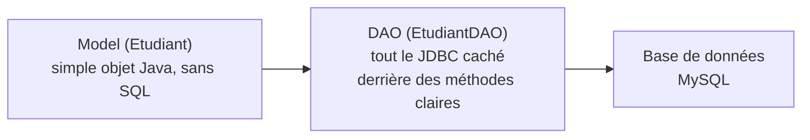
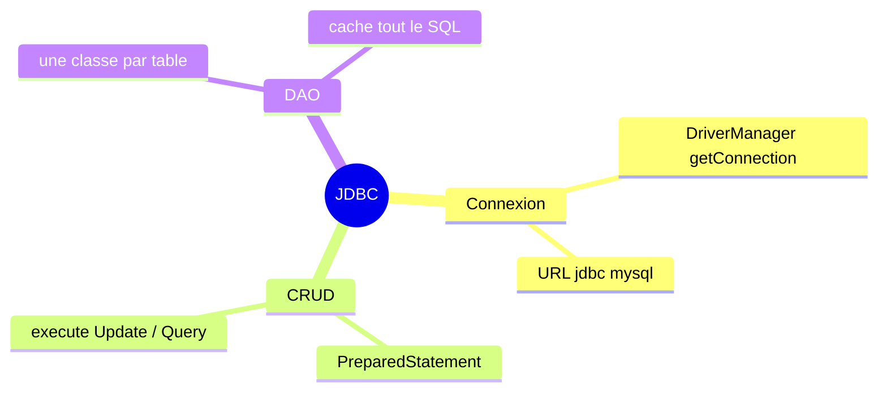

<div class="chapitre-titre-num">CHAPITRE 35</div>

# DAO (Data Access Object)

## Objectifs pédagogiques

À la fin de ce chapitre, tu sauras organiser proprement le code JDBC d'une application, en le regroupant dans des classes DAO dédiées, séparées du reste de la logique métier.

## A. Le problème

Le chapitre 34 a montré comment insérer, lire, modifier et supprimer des données avec JDBC — mais chaque exemple mélangeait la connexion, le SQL, et l'utilisation des résultats en un seul bloc, souvent directement dans `main()`. Imagine ce même code JDBC recopié à chaque endroit du programme qui a besoin de parler à la table `etudiants` : toute modification de structure de la table obligerait à corriger du SQL éparpillé un peu partout.

## B. Exemple de la vie réelle

Pense à un guichet unique dans une administration : tout le monde s'adresse **au même guichet** pour une démarche précise (renouveler une pièce d'identité), sans avoir besoin de connaître les procédures internes exactes. Si la procédure interne change, seul le personnel du guichet doit s'adapter — les usagers, eux, continuent de s'adresser au même guichet, de la même façon qu'avant.

## C. Explication très simple

> Un **DAO** (Data Access Object) est une classe dédiée à l'accès aux données d'**une seule** table (ou d'un seul concept métier), regroupant tout le code JDBC nécessaire derrière des méthodes claires, comme `sauvegarder()`, `trouverParId()`, `listerTous()`.



## D. Premier exemple Java

D'abord, le **modèle** : une classe Java simple, sans aucune trace de JDBC.

```java
class Etudiant {
    private int id;
    private String nom;
    private int age;
    private double moyenne;

    Etudiant(String nom, int age, double moyenne) {
        this.nom = nom;
        this.age = age;
        this.moyenne = moyenne;
    }

    // getters, setters (chapitre 11)...
    int getId() { return id; }
    void setId(int id) { this.id = id; }
    String getNom() { return nom; }
    double getMoyenne() { return moyenne; }
}
```

Ensuite, le **DAO**, qui seul connaît le SQL :

```java
import java.sql.*;
import java.util.ArrayList;

class EtudiantDAO {
    private Connection connexion;

    EtudiantDAO(Connection connexion) {
        this.connexion = connexion;
    }

    void sauvegarder(Etudiant etudiant) throws SQLException {
        String sql = "INSERT INTO etudiants (nom, age, moyenne) VALUES (?, ?, ?)";
        try (PreparedStatement requete = connexion.prepareStatement(sql)) {
            requete.setString(1, etudiant.getNom());
            requete.setInt(2, etudiant.getAge());
            requete.setDouble(3, etudiant.getMoyenne());
            requete.executeUpdate();
        }
    }

    ArrayList<Etudiant> listerTous() throws SQLException {
        ArrayList<Etudiant> resultat = new ArrayList<>();
        String sql = "SELECT id, nom, age, moyenne FROM etudiants";

        try (PreparedStatement requete = connexion.prepareStatement(sql);
             ResultSet rs = requete.executeQuery()) {

            while (rs.next()) {
                Etudiant e = new Etudiant(rs.getString("nom"), rs.getInt("age"), rs.getDouble("moyenne"));
                e.setId(rs.getInt("id"));
                resultat.add(e);
            }
        }
        return resultat;
    }
}
```

## E. Explication : le rôle de chaque couche

```{.uml}
class EtudiantDAO {
   │
   └─ Convention de nommage : "NomDeLaClasseModel" + "DAO".

sauvegarder(Etudiant etudiant)
    │
    └─ Reçoit un OBJET Java, transforme ses attributs en paramètres SQL
       à l'INTÉRIEUR de la méthode — celui qui appelle sauvegarder()
       n'écrit jamais lui-même de SQL.

listerTous()
    │
    └─ Fait l'inverse : lit des LIGNES SQL, les transforme en une
       liste d'objets Etudiant — celui qui appelle listerTous() ne
       manipule que des objets Java normaux, jamais un ResultSet brut.
```

Le reste du programme (`main`, ou une future classe "service", chapitre 37) n'a **jamais** besoin d'écrire de SQL : il utilise `EtudiantDAO` comme un simple objet Java normal.

## F. Deuxième exemple : utiliser le DAO

```java
public class Main {
    public static void main(String[] args) throws SQLException {
        String url = "jdbc:mysql://localhost:3306/ecole";

        try (Connection connexion = DriverManager.getConnection(url, "root", "motdepasse123")) {
            EtudiantDAO dao = new EtudiantDAO(connexion);

            dao.sauvegarder(new Etudiant("Jaslin", 22, 16.5));
            dao.sauvegarder(new Etudiant("Marie", 20, 14.0));

            ArrayList<Etudiant> tous = dao.listerTous();
            for (Etudiant e : tous) {
                System.out.println(e.getNom() + " : " + e.getMoyenne());
            }
        }
    }
}
```

Remarque : **aucune** trace de `PreparedStatement`, de `ResultSet`, ni de SQL dans `main` — tout est caché, proprement, derrière `EtudiantDAO`.

<div class="encadre astuce">
<span class="encadre-titre">💡 Le vrai bénéfice du DAO : changer l'implémentation sans casser le reste</span>
Si demain la table <code>etudiants</code> change de structure, ou si le projet migre vers une base de données totalement différente, <strong>seul</strong> le code à l'intérieur d'<code>EtudiantDAO</code> doit être modifié. <code>main</code> et tout le reste du programme, qui n'utilisent que <code>sauvegarder()</code> et <code>listerTous()</code>, continuent de fonctionner sans une seule ligne changée — exactement le bénéfice de l'encapsulation (chapitre 11), appliqué ici à l'échelle de toute une couche d'accès aux données.
</div>

## Erreurs fréquentes

<div class="encadre attention">
<span class="encadre-titre">⚠️ Erreur n°1 — Laisser du SQL fuir hors du DAO</span>

```java
// Dans main(), directement :
PreparedStatement requete = connexion.prepareStatement("SELECT * FROM etudiants WHERE ..."); // ❌
```

Dès qu'une requête SQL apparaît en dehors d'une classe DAO, le bénéfice de cette organisation disparaît : le SQL redevient dispersé et difficile à maintenir. La règle est stricte : **tout** le SQL vit dans les DAO, sans exception.
</div>

<div class="encadre attention">
<span class="encadre-titre">⚠️ Erreur n°2 — Un DAO qui connaît la logique métier</span>

```java
class EtudiantDAO {
    void sauvegarder(Etudiant etudiant) throws SQLException {
        if (etudiant.getMoyenne() < 0 || etudiant.getMoyenne() > 20) { // ❌ ce n'est pas le rôle d'un DAO !
            throw new IllegalArgumentException("Moyenne invalide");
        }
        ...
    }
}
```

Un DAO ne devrait s'occuper **que** de l'accès aux données (lire, écrire), jamais de règles métier (validations complexes, calculs). Ces responsabilités reviennent au modèle lui-même (chapitre 11, encapsulation) ou à une future couche "service" (chapitre 37).
</div>

<div class="encadre progression">
<span class="encadre-titre">🎯 CE QUE TU SAIS MAINTENANT</span>

```text
✓ Je sais pourquoi regrouper tout le SQL d'une table dans une classe DAO dédiée.
✓ Je sais écrire un DAO avec sauvegarder() et listerTous().
✓ Je comprends que le reste du programme n'utilise que des objets Java
  normaux, jamais de SQL directement.
✓ Je sais qu'un DAO ne doit contenir AUCUNE règle métier, seulement de
  l'accès aux données.
```
</div>

## Petit exercice

<div class="encadre exercice">
<span class="encadre-titre">📝 Vérifie ta compréhension</span>

Pourquoi un DAO facilite-t-il un changement futur de base de données (par exemple, passer de MySQL à PostgreSQL) ?
</div>

## Correction

Parce que tout le SQL et toute la logique de connexion sont concentrés dans les classes DAO. Le reste du programme, qui n'appelle que des méthodes comme `sauvegarder()` ou `listerTous()`, n'a jamais besoin d'être modifié : seul le contenu interne des DAO doit être adapté à la nouvelle base de données.

## Défi

<div class="encadre defi">
<span class="encadre-titre">🧩 Défi — À toi de jouer</span>

Ajoute à `EtudiantDAO` deux méthodes : `trouverParId(int id)` (renvoyant un `Optional<Etudiant>`, chapitre 28) et `supprimer(int id)`.
</div>

### Corrigé du défi

```java
Optional<Etudiant> trouverParId(int id) throws SQLException {
    String sql = "SELECT id, nom, age, moyenne FROM etudiants WHERE id = ?";
    try (PreparedStatement requete = connexion.prepareStatement(sql)) {
        requete.setInt(1, id);

        try (ResultSet rs = requete.executeQuery()) {
            if (rs.next()) {
                Etudiant e = new Etudiant(rs.getString("nom"), rs.getInt("age"), rs.getDouble("moyenne"));
                e.setId(rs.getInt("id"));
                return Optional.of(e);
            }
            return Optional.empty();
        }
    }
}

void supprimer(int id) throws SQLException {
    String sql = "DELETE FROM etudiants WHERE id = ?";
    try (PreparedStatement requete = connexion.prepareStatement(sql)) {
        requete.setInt(1, id);
        requete.executeUpdate();
    }
}
```

## Résumé du chapitre

- Un **DAO** regroupe tout le code JDBC lié à une table (ou un concept métier) derrière des méthodes claires.
- Le modèle (`Etudiant`) reste une classe Java simple, sans aucune trace de SQL.
- Le reste du programme n'utilise que les méthodes du DAO, jamais directement `PreparedStatement` ou `ResultSet`.
- Le vrai bénéfice : changer la structure de données ou de base de données n'impacte que le DAO, jamais le reste du programme.
- Un DAO ne doit jamais contenir de règles métier, seulement de l'accès aux données.

---

# 🎓 Révision de la Partie 11 — JDBC

## Carte mentale de la Partie 11



## Questions de révision

1. Pourquoi utiliser `PreparedStatement` plutôt que de coller du texte directement dans une requête SQL ?
2. Que renvoie `executeQuery()` ? Et `executeUpdate()` ?
3. Quel est le rôle exact d'une classe DAO ?

**Réponses :** (1) Pour empêcher structurellement l'injection SQL, une faille de sécurité majeure. (2) `executeQuery()` renvoie un `ResultSet` (pour `SELECT`) ; `executeUpdate()` renvoie le nombre de lignes affectées (pour `INSERT`/`UPDATE`/`DELETE`). (3) Regrouper tout l'accès aux données d'une table derrière des méthodes claires, isolant le SQL du reste du programme.

## Mini-projet de la Partie 11

<div class="encadre defi">
<span class="encadre-titre">🧩 Mini-projet — DAO complet pour un catalogue de produits</span>

Écris une classe `Produit` (id, nom, prix, quantite) et une classe `ProduitDAO` avec `sauvegarder()`, `listerTous()`, `trouverParId(int id)` (`Optional<Produit>`), `mettreAJourQuantite(int id, int nouvelleQuantite)`.
</div>

### Corrigé du mini-projet

```java
class Produit {
    private int id;
    private String nom;
    private double prix;
    private int quantite;

    Produit(String nom, double prix, int quantite) {
        this.nom = nom;
        this.prix = prix;
        this.quantite = quantite;
    }

    int getId() { return id; }
    void setId(int id) { this.id = id; }
    String getNom() { return nom; }
    double getPrix() { return prix; }
    int getQuantite() { return quantite; }
}

class ProduitDAO {
    private Connection connexion;

    ProduitDAO(Connection connexion) {
        this.connexion = connexion;
    }

    void sauvegarder(Produit p) throws SQLException {
        String sql = "INSERT INTO produits (nom, prix, quantite) VALUES (?, ?, ?)";
        try (PreparedStatement requete = connexion.prepareStatement(sql)) {
            requete.setString(1, p.getNom());
            requete.setDouble(2, p.getPrix());
            requete.setInt(3, p.getQuantite());
            requete.executeUpdate();
        }
    }

    ArrayList<Produit> listerTous() throws SQLException {
        ArrayList<Produit> resultat = new ArrayList<>();
        String sql = "SELECT id, nom, prix, quantite FROM produits";
        try (PreparedStatement requete = connexion.prepareStatement(sql);
             ResultSet rs = requete.executeQuery()) {
            while (rs.next()) {
                Produit p = new Produit(rs.getString("nom"), rs.getDouble("prix"), rs.getInt("quantite"));
                p.setId(rs.getInt("id"));
                resultat.add(p);
            }
        }
        return resultat;
    }

    void mettreAJourQuantite(int id, int nouvelleQuantite) throws SQLException {
        String sql = "UPDATE produits SET quantite = ? WHERE id = ?";
        try (PreparedStatement requete = connexion.prepareStatement(sql)) {
            requete.setInt(1, nouvelleQuantite);
            requete.setInt(2, id);
            requete.executeUpdate();
        }
    }
}
```

---

*Chapitre suivant : organiser un projet Java, pour structurer un vrai projet en dossiers clairs, plutôt que d'entasser toutes les classes ensemble.*
