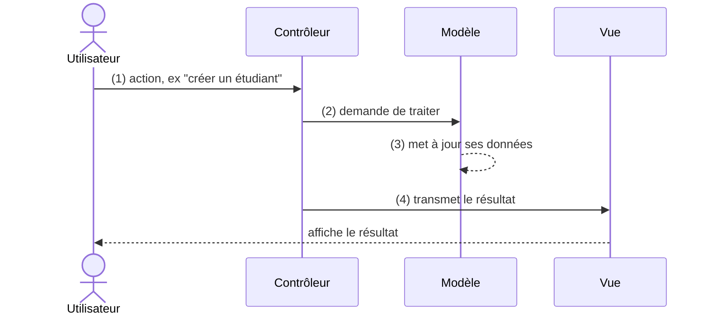

<div class="chapitre-titre-num">CHAPITRE 37</div>

# MVC

## Objectifs pédagogiques

À la fin de ce chapitre, tu comprendras le patron d'architecture MVC (Modèle-Vue-Contrôleur), l'un des plus utilisés dans tout le développement logiciel professionnel.

## A. Le problème

Le chapitre 36 a organisé un projet en dossiers (model, dao, service, ui...), mais sans préciser **comment** ces pièces doivent réellement communiquer entre elles pour répondre à une action de l'utilisateur (par exemple, cliquer sur "Créer un étudiant"). Sans règle claire, l'interface utilisateur finit souvent par contenir elle-même de la logique métier, ou par accéder directement à la base de données — recréant le même mélange de responsabilités déjà signalé au chapitre 36.

## B. Exemple de la vie réelle

Pense à un restaurant, à nouveau. Le **client** (l'utilisateur) donne sa commande au **serveur** (le contrôleur), qui la transmet à la **cuisine** (le modèle, qui prépare réellement le plat), puis rapporte le résultat sur **l'assiette présentée à table** (la vue). Le client ne parle jamais directement à la cuisine ; la cuisine ne décide jamais comment présenter l'assiette.

## C. Explication très simple

> **MVC** (Modèle-Vue-Contrôleur) sépare une application en trois responsabilités distinctes : le **Modèle** (les données et règles métier), la **Vue** (ce que l'utilisateur voit), et le **Contrôleur** (qui reçoit les actions de l'utilisateur et orchestre la réponse).



## D. Premier exemple Java : les trois couches

**Le Modèle** (avec son DAO, chapitre 35, considéré comme faisant partie du Modèle au sens large) :

```java
class Etudiant {
    private String nom;
    private double moyenne;
    // attributs, constructeur, getters/setters...
}

class EtudiantService { // la logique métier du Modèle
    private EtudiantDAO dao;

    EtudiantService(EtudiantDAO dao) {
        this.dao = dao;
    }

    void creerEtudiant(String nom, double moyenne) throws SQLException {
        if (moyenne < 0 || moyenne > 20) {
            throw new IllegalArgumentException("Moyenne invalide");
        }
        dao.sauvegarder(new Etudiant(nom, moyenne));
    }
}
```

**La Vue** :

```java
class EtudiantVue {
    void afficherConfirmation(String nom) {
        System.out.println(nom + " a été créé avec succès !");
    }

    void afficherErreur(String message) {
        System.out.println("Erreur : " + message);
    }
}
```

**Le Contrôleur**, qui relie les deux :

```java
class EtudiantControleur {
    private EtudiantService service;
    private EtudiantVue vue;

    EtudiantControleur(EtudiantService service, EtudiantVue vue) {
        this.service = service;
        this.vue = vue;
    }

    void creerEtudiant(String nom, double moyenne) {
        try {
            service.creerEtudiant(nom, moyenne);
            vue.afficherConfirmation(nom);
        } catch (Exception e) {
            vue.afficherErreur(e.getMessage());
        }
    }
}
```

## E. Explication : qui parle à qui

```{.uml}
EtudiantControleur.creerEtudiant(nom, moyenne)
   │
   ├──► EtudiantService.creerEtudiant(...)   ← délègue au MODÈLE
   │        │
   │        └──► EtudiantDAO.sauvegarder(...)  ← qui utilise lui-même le DAO
   │
   └──► EtudiantVue.afficherConfirmation(...)  ← puis informe la VUE du résultat
```

Le contrôleur ne contient **aucune règle métier** lui-même (il ne vérifie pas la moyenne, par exemple — c'est le rôle du service) et **ne sait pas comment** les données sont affichées (c'est le rôle de la vue). Il ne fait qu'**orchestrer** l'échange entre les deux.

<div class="encadre vocabulaire">
<span class="encadre-titre">📖 Terme : Séparation des préoccupations</span>
Le principe général derrière MVC (et derrière l'organisation du chapitre 36) s'appelle la <strong>séparation des préoccupations</strong> (<em>separation of concerns</em>) : chaque partie du code ne se préoccupe que d'une seule chose. Le modèle ne se préoccupe pas de l'affichage ; la vue ne se préoccupe pas des règles métier ; le contrôleur ne se préoccupe ni de l'un ni de l'autre en détail, seulement de les coordonner.
</div>

## F. Deuxième exemple : pourquoi cette séparation aide vraiment

```java
public class Main {
    public static void main(String[] args) throws SQLException {
        Connection connexion = DriverManager.getConnection(url, "root", "motdepasse123");
        EtudiantDAO dao = new EtudiantDAO(connexion);
        EtudiantService service = new EtudiantService(dao);
        EtudiantVue vue = new EtudiantVue();
        EtudiantControleur controleur = new EtudiantControleur(service, vue);

        controleur.creerEtudiant("Jaslin", 16.5);
        controleur.creerEtudiant("Marie", 25.0); // moyenne invalide : erreur gérée proprement
    }
}
```

Résultat :
```text
Jaslin a été créé avec succès !
Erreur : Moyenne invalide
```

Imagine maintenant devoir remplacer `EtudiantVue` (affichage console) par une vraie interface graphique, ou une interface web : **seule** la classe `EtudiantVue` serait à réécrire. `EtudiantService` (les règles métier) et `EtudiantDAO` (l'accès aux données) resteraient identiques, sans une seule ligne modifiée.

## Erreurs fréquentes

<div class="encadre attention">
<span class="encadre-titre">⚠️ Erreur n°1 — Un contrôleur qui contient lui-même la logique métier</span>

```java
class EtudiantControleur {
    void creerEtudiant(String nom, double moyenne) {
        if (moyenne < 0 || moyenne > 20) { // ❌ cette validation appartient au SERVICE, pas au contrôleur !
            vue.afficherErreur("Moyenne invalide");
            return;
        }
        ...
    }
}
```

Un contrôleur "gonflé" qui absorbe la logique métier recrée exactement le problème que MVC cherche à éviter : impossible de réutiliser cette règle ailleurs (par exemple, dans une API), et impossible de la tester indépendamment de l'interface.
</div>

<div class="encadre attention">
<span class="encadre-titre">⚠️ Erreur n°2 — Une vue qui accède directement au DAO</span>

```java
class EtudiantVue {
    void afficherTous(EtudiantDAO dao) throws SQLException { // ❌ la vue ne devrait JAMAIS connaître le DAO !
        for (Etudiant e : dao.listerTous()) { ... }
    }
}
```

La vue ne devrait communiquer **qu'avec** le contrôleur (ou recevoir des données déjà prêtes), jamais directement avec le modèle ou le DAO — sinon, la frontière entre les couches disparaît, et le bénéfice de MVC avec elle.
</div>

<div class="encadre progression">
<span class="encadre-titre">🎯 CE QUE TU SAIS MAINTENANT</span>

```text
✓ Je comprends le rôle du Modèle, de la Vue et du Contrôleur.
✓ Je sais que le contrôleur orchestre, sans contenir de règle métier lui-même.
✓ Je sais que la vue ne communique jamais directement avec le DAO.
✓ Je comprends le vrai bénéfice : remplacer une couche (l'affichage,
  par exemple) sans toucher aux autres.
```
</div>

## Petit exercice

<div class="encadre exercice">
<span class="encadre-titre">📝 Vérifie ta compréhension</span>

Dans une application MVC, où doit vivre la règle "un client ne peut pas retirer plus que son solde disponible" ?
</div>

## Correction

Dans le **Modèle** (typiquement, dans un service `CompteService`, ou directement dans la classe `CompteBancaire` elle-même, chapitre 11) — jamais dans le contrôleur ni dans la vue, puisque c'est une règle métier, indépendante de la façon dont elle est déclenchée ou affichée.

## Défi

<div class="encadre defi">
<span class="encadre-titre">🧩 Défi — À toi de jouer</span>

Construis une mini-architecture MVC pour "consulter le solde d'un compte" : un `CompteService.consulterSolde(int idCompte)`, une `CompteVue.afficherSolde(double solde)`, et un `CompteControleur.consulterSolde(int idCompte)` qui relie les deux.
</div>

### Corrigé du défi

```java
class CompteService {
    private CompteDAO dao;

    CompteService(CompteDAO dao) {
        this.dao = dao;
    }

    double consulterSolde(int idCompte) throws SQLException {
        return dao.trouverParId(idCompte)
            .map(CompteBancaire::getSolde)
            .orElseThrow(() -> new IllegalArgumentException("Compte introuvable"));
    }
}

class CompteVue {
    void afficherSolde(double solde) {
        System.out.println("Solde actuel : " + solde + " HTG");
    }

    void afficherErreur(String message) {
        System.out.println("Erreur : " + message);
    }
}

class CompteControleur {
    private CompteService service;
    private CompteVue vue;

    CompteControleur(CompteService service, CompteVue vue) {
        this.service = service;
        this.vue = vue;
    }

    void consulterSolde(int idCompte) {
        try {
            double solde = service.consulterSolde(idCompte);
            vue.afficherSolde(solde);
        } catch (Exception e) {
            vue.afficherErreur(e.getMessage());
        }
    }
}
```

## Résumé du chapitre

- **MVC** sépare une application en Modèle (données + règles métier), Vue (affichage) et Contrôleur (orchestration).
- Le contrôleur ne contient jamais lui-même de règle métier ; il délègue au modèle.
- La vue ne communique jamais directement avec le DAO ou la base de données.
- Le vrai bénéfice : remplacer une couche (par exemple, la vue) sans devoir toucher aux autres.

---

# 🎓 Révision de la Partie 12 — Architecture professionnelle

Cette partie se termine avec le chapitre 38 : Récapitulons d'abord ce que tu viens d'apprendre sur MVC avant d'aborder DTO et Repository.

## Question de révision

Pourquoi un contrôleur qui contiendrait lui-même des règles métier rend-il plus difficile la création, plus tard, d'une seconde interface (par exemple une API web) pour la même application ?

**Réponse :** Parce que la règle métier serait alors "piégée" dans le code du contrôleur lié à cette interface précise. Une seconde interface (API web, par exemple) aurait besoin de son propre contrôleur, et devrait soit dupliquer cette même règle métier, soit la réécrire — alors qu'avec la règle correctement placée dans le modèle/service, les deux interfaces pourraient la réutiliser telle quelle, sans aucune duplication.

---

*Chapitre suivant : DTO et Repository, pour approfondir encore l'organisation d'une application professionnelle.*
