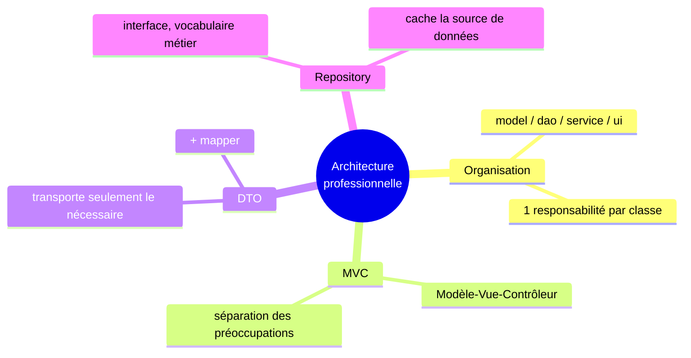

<div class="chapitre-titre-num">CHAPITRE 38</div>

# DTO et Repository

## Objectifs pédagogiques

À la fin de ce chapitre, tu comprendras deux notions supplémentaires très courantes dans les projets Java professionnels : le DTO (Data Transfer Object) et le pattern Repository.

## A. Le problème du DTO

Imagine une classe `Etudiant` (modèle) contenant, en plus de `nom` et `moyenne`, des informations sensibles comme un `motDePasseHash`. Si cette classe `Etudiant` complète est directement envoyée telle quelle vers l'extérieur de l'application (par exemple, affichée dans une interface, ou renvoyée par une API web, notion hors périmètre direct de ce manuel mais fréquente en pratique), le `motDePasseHash` risque de fuiter avec elle, sans que ce soit jamais intentionnel.

## B. Exemple de la vie réelle

Pense à une fiche complète de dossier médical (avec des informations très privées) versus un résumé simplifié qu'on remettrait à un employeur pour justifier une absence : seules certaines informations, sélectionnées consciemment, doivent en sortir — jamais le dossier complet, en un seul bloc, sans filtre.

## C. Explication très simple

> Un **DTO** (Data Transfer Object, "objet de transfert de données") est une classe simple, dédiée uniquement à **transporter** un sous-ensemble précis de données entre deux couches d'une application, sans jamais exposer le modèle complet.

## D. Premier exemple Java

```java
class Etudiant { // le MODÈLE complet, avec des données sensibles
    private int id;
    private String nom;
    private double moyenne;
    private String motDePasseHash; // ⚠️ ne doit JAMAIS sortir de l'application telle quelle

    // getters, setters...
}

class EtudiantDTO { // le DTO : SEULEMENT ce qui doit être partagé
    private String nom;
    private double moyenne;

    EtudiantDTO(String nom, double moyenne) {
        this.nom = nom;
        this.moyenne = moyenne;
    }

    String getNom() { return nom; }
    double getMoyenne() { return moyenne; }
}
```

## E. Explication : la conversion entre modèle et DTO

```java
class EtudiantMapper { // une classe dédiée à la CONVERSION entre les deux
    static EtudiantDTO versDTO(Etudiant etudiant) {
        return new EtudiantDTO(etudiant.getNom(), etudiant.getMoyenne());
        // note : motDePasseHash n'est JAMAIS recopié dans le DTO !
    }
}
```

```{.uml}
Etudiant (modèle complet)         EtudiantDTO (sous-ensemble sûr)
┌────────────────────┐            ┌────────────────────┐
│ id                   │            │ nom                 │
│ nom                  │  ──────►   │ moyenne             │
│ moyenne              │  mapper    └────────────────────┘
│ motDePasseHash        │            (id et motDePasseHash
└────────────────────┘             n'existent MÊME PAS
                                     dans le DTO)
```

<div class="encadre vocabulaire">
<span class="encadre-titre">📖 Terme : Mapper</span>
Un <strong>mapper</strong> (littéralement "celui qui fait correspondre") est une classe ou une méthode dédiée à la conversion d'un objet vers un autre, généralement d'un modèle vers un DTO ou inversement. C'est le seul endroit du programme où les deux représentations se rencontrent.
</div>

## Le pattern Repository

### Le problème

Le chapitre 35 a présenté le DAO, centré sur les opérations SQL brutes (`sauvegarder`, `trouverParId`). Un **Repository** va un cran plus loin : il expose une interface centrée sur le **vocabulaire métier**, potentiellement en cachant même l'existence d'une base de données (peut-être des données viennent-elles d'un fichier, d'une API externe, ou d'une base — le Repository ne le révèle jamais à celui qui l'utilise).

### Premier exemple Java

```java
interface EtudiantRepository { // une INTERFACE (chapitre 15) : le CONTRAT, sans dire COMMENT
    void ajouter(Etudiant etudiant);
    List<Etudiant> trouverLesAdmis(); // vocabulaire MÉTIER, pas juste "SELECT ... WHERE"
    Optional<Etudiant> trouverParNom(String nom);
}

class EtudiantRepositoryMySQL implements EtudiantRepository { // UNE implémentation possible
    private EtudiantDAO dao;

    EtudiantRepositoryMySQL(EtudiantDAO dao) {
        this.dao = dao;
    }

    @Override
    public void ajouter(Etudiant etudiant) {
        try {
            dao.sauvegarder(etudiant);
        } catch (SQLException e) {
            throw new RuntimeException(e);
        }
    }

    @Override
    public List<Etudiant> trouverLesAdmis() {
        // implémentation utilisant le DAO, filtrée par moyenne >= 10...
        return List.of(); // simplifié pour l'exemple
    }

    @Override
    public Optional<Etudiant> trouverParNom(String nom) {
        return Optional.empty(); // simplifié pour l'exemple
    }
}
```

<div class="encadre astuce">
<span class="encadre-titre">💡 Le vrai bénéfice, exactement comme au chapitre 15</span>
Parce que <code>EtudiantRepository</code> est une interface, le <code>EtudiantService</code> qui l'utilise (chapitre 37) ne connaît <strong>jamais</strong> l'implémentation réelle — MySQL, un fichier, ou même de fausses données pour un test. C'est exactement le même bénéfice de polymorphisme déjà vu au chapitre 13 et 15, appliqué ici à l'échelle de toute une couche d'accès aux données. Remplacer <code>EtudiantRepositoryMySQL</code> par une autre implémentation ne demande de modifier <strong>aucun</strong> code utilisant l'interface.
</div>

## DAO vs Repository : la nuance

| | DAO | Repository |
|---|---|---|
| Vocabulaire | Proche du SQL (`sauvegarder`, `trouverParId`) | Proche du métier (`trouverLesAdmis`) |
| Généralement | Une classe concrète | Une interface, avec une ou plusieurs implémentations |
| Source de données | Toujours une base de données | Potentiellement masquée (base, fichier, API...) |

Dans la pratique, beaucoup de petits projets utilisent les deux termes de façon presque interchangeable — l'important est de retenir le **principe** commun : isoler et cacher l'accès aux données derrière un vocabulaire clair.

## Erreurs fréquentes

<div class="encadre attention">
<span class="encadre-titre">⚠️ Erreur n°1 — Laisser un mot de passe (ou toute donnée sensible) fuiter dans un DTO</span>

```java
class EtudiantDTO {
    private String nom;
    private String motDePasseHash; // ❌ n'a AUCUNE raison d'être ici !
}
```

Un DTO doit contenir **exactement** ce qui est nécessaire à sa destination, jamais "tout, par facilité". Chaque champ ajouté à un DTO doit être une décision consciente.
</div>

<div class="encadre attention">
<span class="encadre-titre">⚠️ Erreur n°2 — Un Repository qui expose des détails d'implémentation</span>

```java
interface EtudiantRepository {
    ResultSet executerRequeteSQL(String sql); // ❌ expose du JDBC brut dans le CONTRAT !
}
```

Une méthode de Repository ne devrait jamais révéler, dans sa signature, la technologie utilisée en interne (`ResultSet`, `Connection`...). Le contrat doit rester entièrement dans le vocabulaire métier.
</div>

<div class="encadre progression">
<span class="encadre-titre">🎯 CE QUE TU SAIS MAINTENANT</span>

```text
✓ Je sais pourquoi un DTO ne doit contenir que ce qui est nécessaire à sa destination.
✓ Je sais écrire un mapper pour convertir un modèle en DTO.
✓ Je comprends la différence de vocabulaire entre DAO et Repository.
✓ Je sais qu'un Repository, en interface, permet de changer la source
  de données sans impacter le reste du programme.
```
</div>

## Petit exercice

<div class="encadre exercice">
<span class="encadre-titre">📝 Vérifie ta compréhension</span>

Pourquoi un `ProduitDTO` destiné à l'affichage public d'un catalogue ne devrait-il pas contenir l'attribut `coutAchat` (le prix payé par la boutique au fournisseur, différent du prix de vente) ?
</div>

## Correction

Parce que `coutAchat` est une information interne et sensible (elle révélerait la marge exacte de la boutique), sans aucune utilité pour un client consultant le catalogue. Le DTO destiné à cet affichage ne devrait contenir que `nom`, `prix` (de vente), et éventuellement `description` — jamais des informations internes non pertinentes pour cette destination précise.

## Défi

<div class="encadre defi">
<span class="encadre-titre">🧩 Défi — À toi de jouer</span>

Pour un modèle `Employe` (nom, poste, salaire, numeroSecuriteSociale), crée un `EmployeDTO` adapté à un annuaire public de l'entreprise (sans salaire ni numéro de sécurité sociale), et son mapper.
</div>

### Corrigé du défi

```java
class EmployeDTO {
    private String nom;
    private String poste;

    EmployeDTO(String nom, String poste) {
        this.nom = nom;
        this.poste = poste;
    }

    String getNom() { return nom; }
    String getPoste() { return poste; }
}

class EmployeMapper {
    static EmployeDTO versDTO(Employe employe) {
        return new EmployeDTO(employe.getNom(), employe.getPoste());
        // salaire et numeroSecuriteSociale ne sont JAMAIS recopiés
    }
}
```

## Résumé du chapitre

- Un **DTO** transporte uniquement le sous-ensemble de données nécessaire à sa destination, jamais le modèle complet.
- Un **mapper** convertit entre modèle et DTO, dans un seul endroit clairement identifié.
- Un **Repository** (souvent une interface) expose un vocabulaire métier, potentiellement en cachant totalement la source de données réelle.
- La différence entre DAO et Repository est surtout une question de vocabulaire et d'abstraction, le principe sous-jacent restant le même : isoler l'accès aux données.

---

# 🎓 Révision de la Partie 12 — Architecture professionnelle

## Carte mentale de la Partie 12



## Questions de révision

1. Pourquoi organiser un projet en packages selon leur rôle plutôt que de tout mettre dans un seul dossier ?
2. Quelle couche de MVC ne doit jamais contenir de règle métier ?
3. Pourquoi un DTO ne devrait-il jamais contenir un mot de passe, même haché ?
4. Quelle est la principale différence de vocabulaire entre DAO et Repository ?

**Réponses :** (1) Pour que chaque classe ait une seule responsabilité claire, facilitant la maintenance et l'évolution indépendante de chaque partie. (2) Le contrôleur — il orchestre, sans décider lui-même des règles métier, qui appartiennent au modèle. (3) Parce qu'un DTO est destiné à être transmis vers l'extérieur (affichage, API), et toute donnée sensible qui y figure risque une fuite non intentionnelle. (4) Le DAO utilise un vocabulaire proche du SQL ; le Repository utilise un vocabulaire métier, potentiellement sans révéler la source de données réelle.

## Mini-projet de la Partie 12

<div class="encadre defi">
<span class="encadre-titre">🧩 Mini-projet — Architecture complète pour un module "Commande"</span>

Construis, pour un module de gestion de commandes : (1) un `Commande` (modèle complet), (2) un `CommandeDTO` (sans détails internes sensibles, seulement client, articles, total), (3) un `CommandeRepository` (interface), (4) un `CommandeService` qui l'utilise, (5) un `CommandeControleur` et une `CommandeVue` minimalistes, reliant le tout selon MVC.
</div>

### Corrigé du mini-projet (structure, simplifiée)

```java
// model/Commande.java
class Commande {
    private int id;
    private String client;
    private double total;
    private String noteInterne; // information sensible, jamais exposée
}

// model/CommandeDTO.java
class CommandeDTO {
    private String client;
    private double total;

    CommandeDTO(String client, double total) {
        this.client = client;
        this.total = total;
    }
}

// dao/CommandeRepository.java
interface CommandeRepository {
    void ajouter(Commande commande);
    List<Commande> listerToutes();
}

// service/CommandeService.java
class CommandeService {
    private CommandeRepository repository;

    CommandeService(CommandeRepository repository) {
        this.repository = repository;
    }

    List<CommandeDTO> listerPourAffichage() {
        return repository.listerToutes().stream()
            .map(c -> new CommandeDTO(c.getClient(), c.getTotal()))
            .toList(); // Stream API, chapitre 29 !
    }
}

// ui/CommandeVue.java + ui/CommandeControleur.java : suivent exactement le patron du chapitre 37
```

Ce mini-projet rassemble presque toutes les notions des Parties 9 à 12 dans une seule architecture cohérente — exactement la structure d'un vrai petit projet Java professionnel.

---

*Chapitre suivant : pourquoi tester son programme, pour vérifier automatiquement que tout ce code fonctionne réellement comme prévu, avec JUnit 5.*
