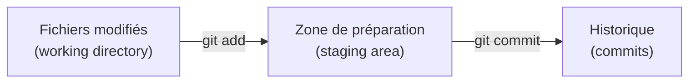
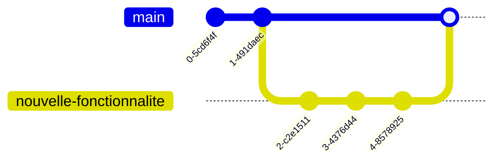
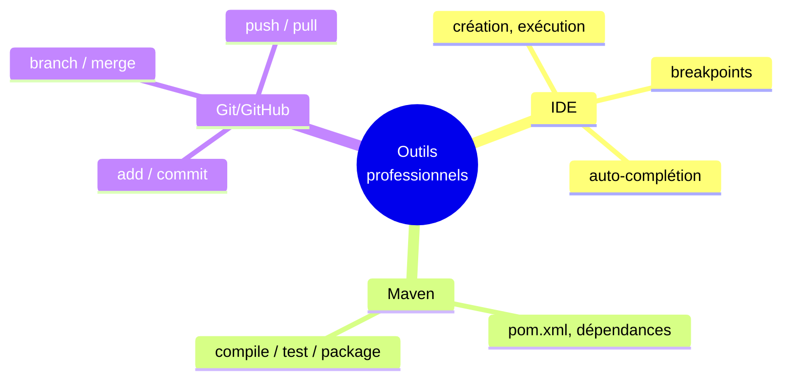

<div class="chapitre-titre-num">CHAPITRE 42</div>

# Git et GitHub

## Objectifs pédagogiques

À la fin de ce chapitre, tu sauras utiliser les commandes Git essentielles pour suivre l'historique des modifications d'un projet, et comprendre le rôle de GitHub pour collaborer avec d'autres développeurs.

## A. Le problème

Imagine modifier un fichier de code, se rendre compte trois jours plus tard qu'une ancienne version fonctionnait mieux, et ne plus avoir aucune trace de cette version antérieure — écrasée, perdue. Sans outil dédié, revenir en arrière, comprendre qui a changé quoi et pourquoi, ou travailler à plusieurs sur le même projet sans se marcher dessus devient extrêmement risqué.

## B. Exemple de la vie réelle

Pense à un document partagé avec un historique complet des versions : à tout moment, tu peux voir qui a modifié quoi, revenir à une version antérieure, ou comparer deux versions côte à côte. **Git** offre exactement ça pour du code, avec une précision et une puissance bien supérieures à un simple "historique de versions" classique.

## C. Explication très simple

> **Git** est un outil qui enregistre l'historique complet des modifications d'un projet, permettant de revenir en arrière, de comparer des versions, et de travailler à plusieurs sans écraser le travail des autres. **GitHub** est un service en ligne qui héberge des projets Git, facilitant le partage et la collaboration.

## D. Les commandes essentielles, étape par étape

**Étape 1 — Initialiser un dépôt Git dans un projet.**

```text
git init
```

Transforme le dossier courant en un projet suivi par Git, capable désormais d'enregistrer son historique.

**Étape 2 — Vérifier l'état actuel.**

```text
git status
```

Affiche les fichiers modifiés, ajoutés ou supprimés depuis le dernier enregistrement — la commande la plus utilisée au quotidien, pour toujours savoir où on en est.

**Étape 3 — Préparer les modifications.**

```text
git add CompteBancaire.java
git add .          # ajoute TOUS les fichiers modifiés d'un coup
```

**Étape 4 — Enregistrer un instantané (commit).**

```text
git commit -m "Ajout de la validation du solde dans deposer()"
```

```{.uml}
git commit -m "message"
     │            │
     │            └─ Un message DESCRIPTIF, expliquant CE QUI a changé
     │               et POURQUOI — indispensable pour se relire, ou
     │               relire le travail d'un collègue, des mois plus tard.
     └─ ENREGISTRE définitivement un instantané du projet, à cet instant précis.
```

## E. Explication : le cycle de travail Git



Cette étape intermédiaire (`git add`) permet de choisir **précisément** quels fichiers inclure dans le prochain instantané, plutôt que de tout enregistrer en bloc sans distinction.

## F. Branches et collaboration

```{.uml}
git branch nouvelle-fonctionnalite   →  crée une nouvelle BRANCHE
git checkout nouvelle-fonctionnalite  →  bascule dessus (Git récent : "git switch")
git merge nouvelle-fonctionnalite     →  fusionne cette branche dans la branche courante
```



<div class="encadre vocabulaire">
<span class="encadre-titre">📖 Terme : Branche</span>
Une <strong>branche</strong> est une ligne de développement indépendante, permettant de travailler sur une nouvelle fonctionnalité (ou de corriger un bug) sans jamais perturber la branche principale (souvent nommée <code>main</code>), tant que le travail n'est pas terminé et prêt à être intégré via un <code>merge</code>.
</div>

Une fois le travail terminé localement, `git push` envoie les commits vers GitHub, rendant le travail visible et partageable ; `git pull` récupère les modifications que d'autres développeurs ont poussées entre-temps.

```{.uml}
git push   →  envoie les commits locaux vers GitHub
git pull   →  récupère les commits distants vers ta machine
```

<div class="encadre astuce">
<span class="encadre-titre">💡 Pourquoi des commits fréquents et bien décrits comptent vraiment</span>
Un historique fait de nombreux petits commits, chacun avec un message clair et précis, permet de retrouver <strong>exactement</strong> le moment où un bug a été introduit (via <code>git log</code>, qui affiche tout l'historique), et de comprendre le raisonnement derrière chaque changement, bien après l'avoir oublié soi-même.
</div>

## Erreurs fréquentes

<div class="encadre attention">
<span class="encadre-titre">⚠️ Erreur n°1 — Un message de commit vide de sens</span>

```text
git commit -m "fix"        # ❌ fix quoi exactement ?
git commit -m "modif"      # ❌ toujours aussi vague
```

Un message de commit devrait décrire **précisément** le changement effectué et, idéalement, pourquoi il était nécessaire — utile à toi-même dans six mois, et à quiconque relira l'historique du projet.
</div>

<div class="encadre attention">
<span class="encadre-titre">⚠️ Erreur n°2 — Commiter des informations sensibles (déjà signalé au chapitre 33)</span>

```java
String motDePasse = "motdepasse123"; // et ce fichier est commité sur GitHub, PUBLIQUEMENT visible !
```

Une fois un secret (mot de passe, clé API) commité, il reste techniquement présent dans **l'historique complet** du dépôt, même après l'avoir supprimé du fichier dans un commit ultérieur — un problème de sécurité déjà rencontré très concrètement, à plusieurs reprises, dans le portefeuille de projets réels de Jaslin. Toujours exclure ces informations du dépôt Git dès le départ.
</div>

<div class="encadre progression">
<span class="encadre-titre">🎯 CE QUE TU SAIS MAINTENANT</span>

```text
✓ Je comprends le rôle de Git (historique local) et de GitHub (hébergement, collaboration).
✓ Je sais initialiser un dépôt, vérifier son état, et créer un commit.
✓ Je sais créer une branche et fusionner son travail avec merge.
✓ Je sais envoyer (push) et récupérer (pull) des modifications avec GitHub.
✓ Je sais qu'un secret commité reste dans l'historique, même après suppression.
```
</div>

## Petit exercice

<div class="encadre exercice">
<span class="encadre-titre">📝 Vérifie ta compréhension</span>

Quelle est la différence entre `git add` et `git commit` ?
</div>

## Correction

`git add` prépare (met en "zone de préparation") les fichiers modifiés qu'on souhaite inclure dans le prochain instantané, sans encore les enregistrer définitivement. `git commit` enregistre réellement, de façon permanente dans l'historique, tous les fichiers ainsi préparés, accompagnés d'un message descriptif.

## Défi

<div class="encadre defi">
<span class="encadre-titre">🧩 Défi — À toi de jouer</span>

Décris, dans l'ordre, la suite complète de commandes Git pour : créer une nouvelle branche `correction-bug-solde`, y basculer, effectuer un commit décrivant une correction, puis fusionner cette branche dans `main`.
</div>

### Corrigé du défi

```text
git branch correction-bug-solde
git checkout correction-bug-solde

# (modifications du code effectuées ici)

git add .
git commit -m "Correction du calcul de solde négatif dans retirer()"

git checkout main
git merge correction-bug-solde
```

## Résumé du chapitre

- **Git** enregistre l'historique complet des modifications d'un projet ; **GitHub** héberge ces projets en ligne pour le partage et la collaboration.
- `git add` prépare les fichiers modifiés ; `git commit -m "message"` enregistre un instantané définitif.
- Une **branche** permet de développer une fonctionnalité isolément, avant de la fusionner (`merge`) dans la branche principale.
- `git push` envoie les commits vers GitHub ; `git pull` récupère ceux des autres développeurs.
- Un secret commité reste présent dans l'historique, même après suppression apparente — ne jamais commiter de mot de passe.

---

# 🎓 Révision de la Partie 14 — Outils professionnels

## Carte mentale de la Partie 14



## Questions de révision

1. Pourquoi un breakpoint est-il souvent plus efficace qu'une série de `println` pour comprendre un bug complexe ?
2. Que se passe-t-il si une dépendance est mal orthographiée dans `pom.xml` ?
3. Pourquoi ne faut-il jamais commiter un mot de passe, même si on le supprime dans un commit suivant ?

**Réponses :** (1) Parce qu'il permet d'inspecter TOUTES les variables en direct, à un instant précis, sans avoir à deviner à l'avance quelles valeurs afficher. (2) Maven ne trouve pas la bibliothèque correspondante, provoquant une erreur de compilation (dépendance introuvable). (3) Parce qu'il reste présent dans l'historique complet du dépôt, consultable par quiconque a accès au dépôt, même après sa suppression apparente du fichier actuel.

## Mini-projet de la Partie 14

<div class="encadre defi">
<span class="encadre-titre">🧩 Mini-projet — Mettre en place l'outillage complet d'un nouveau projet</span>

Décris, étape par étape, comment démarrer un nouveau projet Java professionnel : (1) créer le projet dans un IDE, (2) ajouter les dépendances MySQL et JUnit dans `pom.xml`, (3) initialiser un dépôt Git, (4) effectuer un premier commit, (5) créer une branche pour une première fonctionnalité.
</div>

### Corrigé du mini-projet

```{.uml}
1. IDE : File → New → Project → "Java" (IntelliJ) ou Java: Create Java Project (VS Code)

2. pom.xml :
   <dependency>
       <groupId>mysql</groupId>
       <artifactId>mysql-connector-java</artifactId>
       <version>8.0.33</version>
   </dependency>
   <dependency>
       <groupId>org.junit.jupiter</groupId>
       <artifactId>junit-jupiter</artifactId>
       <version>5.10.0</version>
       <scope>test</scope>
   </dependency>

3. git init

4. git add .
   git commit -m "Structure initiale du projet"

5. git branch fonctionnalite-inscription
   git checkout fonctionnalite-inscription
```

---

*Chapitre suivant : écrire du bon code, pour découvrir les principes de qualité qui distinguent un code fonctionnel d'un code réellement professionnel.*
