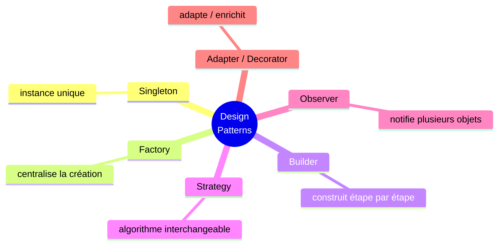

<div class="chapitre-titre-num">CHAPITRE 45</div>

# Design Patterns

## Objectifs pédagogiques

À la fin de ce chapitre, tu connaîtras sept design patterns parmi les plus utilisés en Java, chacun présenté par le problème précis qu'il résout, avant même sa structure.

## A. Le problème

Certains problèmes de conception reviennent sans cesse, projet après projet : garantir qu'une seule instance d'une classe existe, construire un objet avec beaucoup de paramètres optionnels, notifier plusieurs objets d'un changement... Plutôt que de réinventer une solution à chaque fois, la communauté des développeurs a documenté des solutions **éprouvées et réutilisables** à ces problèmes récurrents.

## B. Explication très simple

> Un **design pattern** (patron de conception) est une solution éprouvée à un problème de conception récurrent — pas du code à copier-coller tel quel, mais une **structure d'organisation des classes** à adapter à chaque contexte précis.

<div class="encadre attention">
<span class="encadre-titre">⚠️ Règle d'or de ce chapitre</span>
Aucun pattern n'est présenté ci-dessous sans d'abord expliquer le PROBLÈME qu'il résout. Un design pattern appliqué sans besoin réel n'ajoute que de la complexité inutile — retiens toujours le problème avant la solution.
</div>

## 1. Singleton : garantir une instance unique

**Le problème :** certaines ressources (une configuration globale) ne doivent exister qu'en **un seul exemplaire** dans toute l'application. Rien, jusqu'ici, n'empêche de créer accidentellement plusieurs objets `Configuration`, chacun avec potentiellement des valeurs différentes.

```java
class ConfigurationApplication {
    private static ConfigurationApplication instanceUnique;
    private String urlBaseDeDonnees;

    private ConfigurationApplication() { // constructeur PRIVÉ : new interdit ailleurs !
        this.urlBaseDeDonnees = "jdbc:mysql://localhost:3306/ecole";
    }

    static ConfigurationApplication getInstance() {
        if (instanceUnique == null) {
            instanceUnique = new ConfigurationApplication(); // créée UNE SEULE FOIS
        }
        return instanceUnique;
    }
}
```

```java
ConfigurationApplication c1 = ConfigurationApplication.getInstance();
ConfigurationApplication c2 = ConfigurationApplication.getInstance();
System.out.println(c1 == c2); // true : LITTÉRALEMENT le même objet
```

<div class="encadre attention">
<span class="encadre-titre">⚠️ Un pattern controversé, à utiliser avec parcimonie</span>
Le Singleton introduit un état global, ce qui complique les tests (chapitre 39) et crée une dépendance cachée. L'injection de dépendance (chapitre 44, Dependency Inversion) est souvent préférée, y compris pour des cas qui semblent, à première vue, réclamer un Singleton.
</div>

## 2. Factory : centraliser la création d'objets

**Le problème :** la logique de **choix** de quelle classe concrète créer ne devrait pas être dispersée, copiée-collée, dans tout le code appelant.

```java
interface Notification {
    void envoyer(String message);
}
class NotificationEmail implements Notification {
    public void envoyer(String m) { System.out.println("Email : " + m); }
}
class NotificationSMS implements Notification {
    public void envoyer(String m) { System.out.println("SMS : " + m); }
}

class NotificationFactory {
    static Notification creer(String type) {
        return switch (type) {
            case "EMAIL" -> new NotificationEmail();
            case "SMS" -> new NotificationSMS();
            default -> throw new IllegalArgumentException("Type inconnu : " + type);
        };
    }
}
```

```java
Notification notif = NotificationFactory.creer("EMAIL"); // le code appelant ne connaît AUCUNE classe concrète
notif.envoyer("Commande confirmée");
```

## 3. Builder : construire un objet complexe étape par étape

**Le problème :** un constructeur avec de nombreux paramètres devient illisible et sujet aux erreurs d'ordre.

```java
// ❌ constructeur "télescope" : illisible, ordre facilement confondu
Etudiant e = new Etudiant("Jaslin", 22, "MAT001", "Info", true, "Bourse");
```

```java
class Etudiant {
    private final String nom;
    private final int age;
    private final boolean boursier;

    private Etudiant(Builder b) { // constructeur PRIVÉ, appelé uniquement par le Builder
        this.nom = b.nom;
        this.age = b.age;
        this.boursier = b.boursier;
    }

    static class Builder {
        private String nom;
        private int age;
        private boolean boursier = false; // valeur par défaut raisonnable

        Builder nom(String nom) { this.nom = nom; return this; } // "return this" : chaînage fluide
        Builder age(int age) { this.age = age; return this; }
        Builder boursier(boolean b) { this.boursier = b; return this; }

        Etudiant build() { return new Etudiant(this); }
    }
}
```

```java
Etudiant e = new Etudiant.Builder()
    .nom("Jaslin")
    .age(22)
    .boursier(true)
    .build();
```

## 4. Strategy : rendre un algorithme interchangeable

**Le problème :** un grand `if`/`switch` pour choisir un comportement devient rigide, et viole le principe Open/Closed (chapitre 44).

```java
interface StrategiePaiement {
    void payer(double montant);
}
class PaiementCarte implements StrategiePaiement {
    public void payer(double m) { System.out.println("Carte : " + m); }
}
class PaiementMonCash implements StrategiePaiement {
    public void payer(double m) { System.out.println("MonCash : " + m); }
}

class Commande {
    private StrategiePaiement strategie;

    void definirModePaiement(StrategiePaiement strategie) { // change de comportement À L'EXÉCUTION
        this.strategie = strategie;
    }

    void payer(double montant) {
        strategie.payer(montant);
    }
}
```

```java
Commande commande = new Commande();
commande.definirModePaiement(new PaiementMonCash());
commande.payer(1500);
```

## 5. Observer : notifier automatiquement des changements

**Le problème :** plusieurs objets doivent être informés automatiquement quand l'état d'un autre change, sans être fortement liés entre eux.

```java
interface Observateur {
    void notifier(String evenement);
}

class Commande {
    private List<Observateur> observateurs = new ArrayList<>();

    void ajouterObservateur(Observateur o) {
        observateurs.add(o);
    }

    void changerStatut(String nouveauStatut) {
        for (Observateur o : observateurs) {
            o.notifier("Statut changé : " + nouveauStatut); // NOTIFIE TOUS les observateurs
        }
    }
}

class ServiceEmail implements Observateur {
    public void notifier(String e) { System.out.println("[Email] " + e); }
}
class ServiceSMS implements Observateur {
    public void notifier(String e) { System.out.println("[SMS] " + e); }
}
```

```java
Commande commande = new Commande();
commande.ajouterObservateur(new ServiceEmail());
commande.ajouterObservateur(new ServiceSMS());
commande.changerStatut("EXPEDIEE"); // les DEUX services réagissent automatiquement
```

## 6. Adapter : rendre compatibles deux interfaces incompatibles

**Le problème :** intégrer une classe existante (souvent externe, non modifiable) dont l'interface ne correspond pas à celle attendue par le reste du programme.

```java
class LecteurCSVExterne { // classe EXISTANTE, non modifiable (une bibliothèque tierce)
    String[] lireLigneCSV(String ligne) { return ligne.split(","); }
}

interface LecteurDonnees { // interface ATTENDUE par le reste de l'application
    List<String> lireDonnees(String source);
}

class AdaptateurCSV implements LecteurDonnees { // le PONT entre les deux
    private LecteurCSVExterne lecteurExterne = new LecteurCSVExterne();

    public List<String> lireDonnees(String source) {
        return Arrays.asList(lecteurExterne.lireLigneCSV(source));
    }
}
```

## 7. Decorator : ajouter des comportements dynamiquement

**Le problème :** ajouter des fonctionnalités à un objet sans modifier sa classe, ni créer une sous-classe pour chaque combinaison possible (imagine `CafeAvecLait`, `CafeAvecSucre`, `CafeAvecLaitEtSucre`... une explosion de classes).

```java
interface Cafe {
    double getPrix();
    String getDescription();
}

class CafeSimple implements Cafe {
    public double getPrix() { return 50; }
    public String getDescription() { return "Café"; }
}

abstract class DecorateurCafe implements Cafe {
    protected Cafe cafeDecore; // COMPOSITION (chapitre 16) : enveloppe un AUTRE Cafe

    DecorateurCafe(Cafe cafeDecore) { this.cafeDecore = cafeDecore; }
}

class AvecLait extends DecorateurCafe {
    AvecLait(Cafe c) { super(c); }
    public double getPrix() { return cafeDecore.getPrix() + 15; }
    public String getDescription() { return cafeDecore.getDescription() + " + Lait"; }
}

class AvecSucre extends DecorateurCafe {
    AvecSucre(Cafe c) { super(c); }
    public double getPrix() { return cafeDecore.getPrix() + 5; }
    public String getDescription() { return cafeDecore.getDescription() + " + Sucre"; }
}
```

```java
Cafe commande = new AvecSucre(new AvecLait(new CafeSimple())); // empile les décorateurs
System.out.println(commande.getDescription() + " : " + commande.getPrix());
// "Café + Lait + Sucre : 70.0"
```

<div class="encadre vocabulaire">
<span class="encadre-titre">📖 Terme : Composition dynamique</span>
Le pattern Decorator illustre bien l'intérêt de la <strong>composition</strong> (chapitre 16) sur l'héritage seul : chaque décorateur enveloppe un autre <code>Cafe</code>, et on peut empiler autant de décorateurs qu'on veut, dans n'importe quel ordre, sans jamais avoir à créer une nouvelle classe pour chaque combinaison possible.
</div>

## Erreurs fréquentes

<div class="encadre attention">
<span class="encadre-titre">⚠️ Erreur n°1 — Utiliser un pattern parce qu'il est "connu", sans besoin réel</span>
Le piège le plus fréquent chez qui vient de découvrir les design patterns : vouloir en placer partout, même là où une solution simple suffirait largement. Un design pattern répond à un problème précis (rappelé au début de chaque section ci-dessus) — l'absence de ce problème signifie l'absence de besoin du pattern correspondant.
</div>

<div class="encadre attention">
<span class="encadre-titre">⚠️ Erreur n°2 — Confondre Strategy et Factory</span>
Les deux utilisent une interface, mais résolvent des problèmes différents : Factory centralise la <strong>création</strong> d'un objet (une seule fois) ; Strategy permet de <strong>changer de comportement</strong> pour un objet déjà existant, potentiellement plusieurs fois au cours de son cycle de vie.
</div>

<div class="encadre progression">
<span class="encadre-titre">🎯 CE QUE TU SAIS MAINTENANT</span>

```text
✓ Je connais 7 design patterns et le problème précis que chacun résout.
✓ Je sais implémenter un Singleton, une Factory, un Builder.
✓ Je sais rendre un comportement interchangeable avec Strategy.
✓ Je sais notifier plusieurs objets avec Observer.
✓ Je sais adapter une classe existante avec Adapter.
✓ Je sais ajouter des comportements dynamiquement avec Decorator.
✓ Je sais qu'un pattern sans problème réel à résoudre ajoute de la
  complexité inutile.
```
</div>

## Petit exercice

<div class="encadre exercice">
<span class="encadre-titre">📝 Vérifie ta compréhension</span>

Un projet a besoin d'une seule instance partagée de son gestionnaire de logs, dans toute l'application. Quel pattern utiliser ?
</div>

## Correction

Le pattern **Singleton** — exactement le problème qu'il résout : garantir qu'une seule instance existe, accessible depuis n'importe où via une méthode statique comme `getInstance()`.

## Défi

<div class="encadre defi">
<span class="encadre-titre">🧩 Défi — À toi de jouer</span>

Utilise le pattern Builder pour construire une classe `Pizza` avec une base obligatoire (`taille`) et des garnitures optionnelles (`fromage`, `pepperoni`, `champignons`, tous booléens).
</div>

### Corrigé du défi

```java
class Pizza {
    private final String taille;
    private final boolean fromage;
    private final boolean pepperoni;
    private final boolean champignons;

    private Pizza(Builder b) {
        this.taille = b.taille;
        this.fromage = b.fromage;
        this.pepperoni = b.pepperoni;
        this.champignons = b.champignons;
    }

    static class Builder {
        private String taille;
        private boolean fromage = false;
        private boolean pepperoni = false;
        private boolean champignons = false;

        Builder(String taille) { this.taille = taille; } // obligatoire, dès la création du Builder

        Builder avecFromage() { this.fromage = true; return this; }
        Builder avecPepperoni() { this.pepperoni = true; return this; }
        Builder avecChampignons() { this.champignons = true; return this; }

        Pizza build() { return new Pizza(this); }
    }
}
```

```java
Pizza pizza = new Pizza.Builder("Large").avecFromage().avecChampignons().build();
```

## Résumé du chapitre

- **Singleton** : une seule instance globale (à utiliser avec parcimonie).
- **Factory** : centralise la logique de création d'objets.
- **Builder** : construit un objet complexe étape par étape, sans erreur d'ordre.
- **Strategy** : rend un algorithme interchangeable à l'exécution.
- **Observer** : notifie automatiquement plusieurs objets d'un changement d'état.
- **Adapter** : rend compatibles deux interfaces incompatibles, sans modifier le code existant.
- **Decorator** : ajoute des comportements dynamiquement, sans explosion de sous-classes.

---

# 🎓 Révision de la Partie 17 — Design Patterns

## Carte mentale de la Partie 17



## Questions de révision

1. Pourquoi le Singleton est-il considéré comme un pattern à utiliser avec parcimonie ?
2. Quelle est la différence entre Factory et Strategy ?
3. Quel pattern choisirais-tu pour ajouter, dynamiquement et sans multiplier les sous-classes, plusieurs options à un produit ?

**Réponses :** (1) Parce qu'il introduit un état global qui complique les tests et crée une dépendance cachée. (2) Factory centralise la création d'un objet (une seule fois) ; Strategy permet de changer de comportement pour un objet déjà existant, potentiellement plusieurs fois. (3) Decorator.

## Mini-projet de la Partie 17

<div class="encadre defi">
<span class="encadre-titre">🧩 Mini-projet — Système de notification combinant 3 patterns</span>

Combine Factory (créer le bon canal selon une préférence utilisateur), Strategy (permettre de changer de canal à l'exécution) et Observer (notifier plusieurs services quand une commande change de statut) dans un seul petit système cohérent.
</div>

### Corrigé du mini-projet (structure condensée)

```java
interface Observateur {
    void notifier(String evenement);
}

class EmailObservateur implements Observateur {
    public void notifier(String e) { System.out.println("[Email] " + e); }
}
class SmsObservateur implements Observateur {
    public void notifier(String e) { System.out.println("[SMS] " + e); }
}

class ObservateurFactory { // FACTORY
    static Observateur creer(String type) {
        return switch (type) {
            case "EMAIL" -> new EmailObservateur();
            case "SMS" -> new SmsObservateur();
            default -> throw new IllegalArgumentException("Type inconnu");
        };
    }
}

class Commande { // OBSERVER
    private List<Observateur> observateurs = new ArrayList<>();

    void ajouterObservateur(Observateur o) { observateurs.add(o); } // STRATEGY-like : ajouté/retiré librement

    void changerStatut(String statut) {
        for (Observateur o : observateurs) {
            o.notifier("Statut changé : " + statut);
        }
    }
}

public class Main {
    public static void main(String[] args) {
        Commande commande = new Commande();
        commande.ajouterObservateur(ObservateurFactory.creer("EMAIL"));
        commande.ajouterObservateur(ObservateurFactory.creer("SMS"));
        commande.changerStatut("EXPEDIEE");
    }
}
```

Tu disposes maintenant de toute la boîte à outils théorique (POO complète, collections, exceptions, Java moderne, UML, base de données, architecture, tests, bonnes pratiques, SOLID, design patterns) pour aborder les projets pratiques des parties suivantes.

---

*Chapitre suivant : le premier des sept projets progressifs — une calculatrice, pour mettre en application, sur un vrai petit programme complet, tout ce qui a été vu jusqu'ici.*
