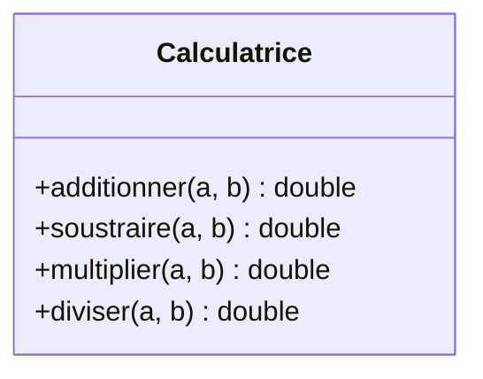

<div class="chapitre-titre-num">CHAPITRE 46</div>

# Projet 1 — Calculatrice

## Objectifs pédagogiques

Construire, de bout en bout, une calculatrice en console, en appliquant les notions des Parties 2 et 3 (variables, types, opérateurs, conditions, boucles, méthodes, classes et objets).

<div class="encadre astuce">
<span class="encadre-titre">💡 Note sur la profondeur des 7 projets de cette partie</span>
Ce premier projet est volontairement simple : pas de base de données, pas d'architecture en couches — ces aspects seront introduits progressivement, projet après projet, jusqu'au Projet 7 (chapitre 52) qui les combinera tous. Chaque projet suit la même méthode professionnelle en 7 à 11 étapes, adaptée à sa complexité réelle.
</div>

## 1. Cahier des charges

Construire une calculatrice en ligne de commande qui : demande deux nombres et une opération à l'utilisateur (addition, soustraction, multiplication, division), affiche le résultat, gère la division par zéro proprement, et permet d'enchaîner plusieurs calculs jusqu'à ce que l'utilisateur choisisse de quitter.

## 2. Analyse du problème

Les briques nécessaires, déjà toutes vues : lire une entrée utilisateur (`Scanner`, une classe pas encore formellement présentée — voir l'encadré ci-dessous), une structure de choix (`switch`, chapitre 5), une boucle pour enchaîner les calculs (chapitre 6), des méthodes pour chaque opération (chapitre 7), et une gestion d'erreur pour la division par zéro (chapitre 22).

<div class="encadre vocabulaire">
<span class="encadre-titre">📖 Terme : Scanner</span>
<code>Scanner</code> est une classe fournie par Java (package <code>java.util</code>) permettant de lire une saisie de l'utilisateur depuis le clavier, dans la console. <code>Scanner sc = new Scanner(System.in); double n = sc.nextDouble();</code> lit un nombre saisi au clavier — le complément naturel de <code>System.out.println</code>, déjà utilisé depuis le chapitre 1, mais pour lire plutôt qu'afficher.
</div>

## 3. UML



Un modèle très simple : une seule classe, sans attribut (chaque méthode est autonome, sans état à conserver entre deux calculs).

## 4. Modèle de données

Aucune donnée à faire persister ici : chaque calcul est indépendant, sans besoin de mémoriser un historique (une amélioration possible, proposée en fin de chapitre).

## 5-6. Création des classes et programmation

```java
import java.util.Scanner;

class Calculatrice {
    double additionner(double a, double b) { return a + b; }
    double soustraire(double a, double b) { return a - b; }
    double multiplier(double a, double b) { return a * b; }

    double diviser(double a, double b) {
        if (b == 0) {
            throw new ArithmeticException("Division par zéro impossible");
        }
        return a / b;
    }
}

public class Main {
    public static void main(String[] args) {
        Scanner sc = new Scanner(System.in);
        Calculatrice calculatrice = new Calculatrice();
        boolean continuer = true;

        while (continuer) {
            System.out.println("\n--- Calculatrice ---");
            System.out.print("Premier nombre : ");
            double a = sc.nextDouble();
            System.out.print("Opération (+, -, *, /) : ");
            String operation = sc.next();
            System.out.print("Deuxième nombre : ");
            double b = sc.nextDouble();

            try {
                double resultat = switch (operation) {
                    case "+" -> calculatrice.additionner(a, b);
                    case "-" -> calculatrice.soustraire(a, b);
                    case "*" -> calculatrice.multiplier(a, b);
                    case "/" -> calculatrice.diviser(a, b);
                    default -> throw new IllegalArgumentException("Opération inconnue : " + operation);
                };
                System.out.println("Résultat : " + resultat);
            } catch (ArithmeticException | IllegalArgumentException e) {
                System.out.println("Erreur : " + e.getMessage());
            }

            System.out.print("Continuer ? (o/n) : ");
            continuer = sc.next().equalsIgnoreCase("o");
        }

        System.out.println("Au revoir !");
    }
}
```

<div class="encadre astuce">
<span class="encadre-titre">💡 switch en expression (Java moderne)</span>
Ce projet utilise un <code>switch</code> sous sa forme moderne, en expression (avec <code>-&gt;</code>, sans <code>break</code>) plutôt que la forme classique du chapitre 5 : chaque <code>case</code> renvoie directement une valeur, affectée à <code>resultat</code>. Les deux formes restent valides ; celle-ci est simplement plus concise pour ce genre de cas.
</div>

## 7. Tests

```java
class CalculatriceTest {
    @Test
    void addition() { assertEquals(7.0, new Calculatrice().additionner(3, 4)); }

    @Test
    void divisionParZero() {
        assertThrows(ArithmeticException.class, () -> new Calculatrice().diviser(10, 0));
    }
}
```

## 11. Amélioration

<div class="encadre defi">
<span class="encadre-titre">🧩 Défi — Améliore le projet</span>

Ajoute un historique des calculs effectués (un `ArrayList<String>`, chapitre 19), avec une option pour l'afficher à tout moment. Va plus loin : ajoute la persistance de cet historique dans un fichier (chapitre 24), pour qu'il survive à la fermeture du programme.
</div>

### Corrigé de l'amélioration (extrait)

```java
ArrayList<String> historique = new ArrayList<>();
// ... après chaque calcul réussi :
historique.add(a + " " + operation + " " + b + " = " + resultat);
// ... nouvelle option de menu :
if (sc.next().equalsIgnoreCase("h")) {
    for (String ligne : historique) {
        System.out.println(ligne);
    }
}
```

---

*Chapitre suivant : Projet 2 — Gestion des étudiants, pour appliquer la POO complète (encapsulation, collections) à un vrai petit système de données.*
