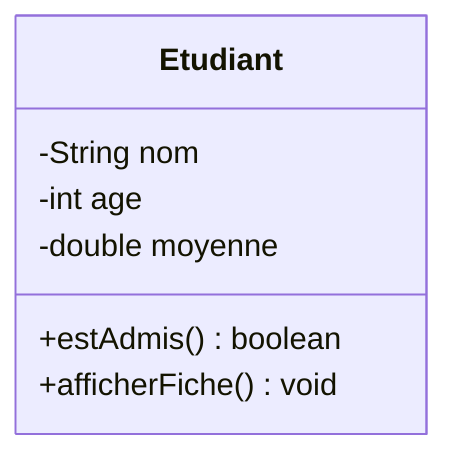

<div class="chapitre-titre-num">CHAPITRE 47</div>

# Projet 2 — Gestion des étudiants

## Objectifs pédagogiques

Construire un système de gestion d'étudiants en mémoire, appliquant l'encapsulation, les collections (`ArrayList`) et un menu console interactif.

## 1. Cahier des charges

Un programme qui permet : d'ajouter un étudiant (nom, âge, moyenne), de lister tous les étudiants, de rechercher un étudiant par nom, de calculer la moyenne générale de la classe, et de lister les étudiants admis (moyenne ≥ 10).

## 2. Analyse du problème

Une classe `Etudiant` encapsulée (chapitre 11), stockée dans un `ArrayList<Etudiant>` (chapitre 19), avec un menu console en boucle (repris du Projet 1) proposant plusieurs actions via `switch`.

## 3. UML



## 4. Modèle de données

Une seule entité, `Etudiant`, sans relation avec d'autres classes à ce stade (les relations complexes viendront au Projet 6).

## 5-6. Création des classes et programmation

```java
class Etudiant {
    private String nom;
    private int age;
    private double moyenne;

    Etudiant(String nom, int age, double moyenne) {
        setNom(nom);
        setAge(age);
        setMoyenne(moyenne);
    }

    void setNom(String nom) {
        if (nom == null || nom.isBlank()) throw new IllegalArgumentException("Nom invalide");
        this.nom = nom;
    }
    void setAge(int age) {
        if (age < 0 || age > 120) throw new IllegalArgumentException("Âge invalide");
        this.age = age;
    }
    void setMoyenne(double moyenne) {
        if (moyenne < 0 || moyenne > 20) throw new IllegalArgumentException("Moyenne invalide");
        this.moyenne = moyenne;
    }

    String getNom() { return nom; }
    double getMoyenne() { return moyenne; }

    boolean estAdmis() {
        return moyenne >= 10;
    }

    void afficherFiche() {
        System.out.println(nom + " (" + age + " ans) — Moyenne : " + moyenne
            + (estAdmis() ? " [ADMIS]" : " [NON ADMIS]"));
    }
}
```

```java
import java.util.ArrayList;
import java.util.Scanner;

class GestionnaireEtudiants {
    private ArrayList<Etudiant> etudiants = new ArrayList<>();

    void ajouter(Etudiant e) {
        etudiants.add(e);
    }

    void listerTous() {
        for (Etudiant e : etudiants) {
            e.afficherFiche();
        }
    }

    void listerAdmis() {
        for (Etudiant e : etudiants) {
            if (e.estAdmis()) e.afficherFiche();
        }
    }

    java.util.Optional<Etudiant> rechercherParNom(String nom) {
        for (Etudiant e : etudiants) {
            if (e.getNom().equalsIgnoreCase(nom)) return java.util.Optional.of(e);
        }
        return java.util.Optional.empty();
    }

    double calculerMoyenneGenerale() {
        if (etudiants.isEmpty()) return 0;
        double somme = 0;
        for (Etudiant e : etudiants) {
            somme += e.getMoyenne();
        }
        return somme / etudiants.size();
    }
}

public class Main {
    public static void main(String[] args) {
        Scanner sc = new Scanner(System.in);
        GestionnaireEtudiants gestionnaire = new GestionnaireEtudiants();
        boolean continuer = true;

        while (continuer) {
            System.out.println("\n1. Ajouter  2. Lister tous  3. Rechercher  4. Admis  5. Moyenne générale  6. Quitter");
            int choix = sc.nextInt();
            sc.nextLine(); // consomme le retour à la ligne restant

            switch (choix) {
                case 1 -> {
                    System.out.print("Nom : "); String nom = sc.nextLine();
                    System.out.print("Âge : "); int age = sc.nextInt();
                    System.out.print("Moyenne : "); double moyenne = sc.nextDouble();
                    try {
                        gestionnaire.ajouter(new Etudiant(nom, age, moyenne));
                        System.out.println("Étudiant ajouté.");
                    } catch (IllegalArgumentException e) {
                        System.out.println("Erreur : " + e.getMessage());
                    }
                }
                case 2 -> gestionnaire.listerTous();
                case 3 -> {
                    System.out.print("Nom recherché : ");
                    String nom = sc.nextLine();
                    gestionnaire.rechercherParNom(nom).ifPresentOrElse(
                        Etudiant::afficherFiche,
                        () -> System.out.println("Introuvable")
                    );
                }
                case 4 -> gestionnaire.listerAdmis();
                case 5 -> System.out.println("Moyenne générale : " + gestionnaire.calculerMoyenneGenerale());
                case 6 -> continuer = false;
                default -> System.out.println("Choix invalide");
            }
        }
    }
}
```

<div class="encadre astuce">
<span class="encadre-titre">💡 Etudiant::afficherFiche : une référence de méthode</span>
<code>Etudiant::afficherFiche</code> est une écriture raccourcie d'une lambda (chapitre 27) qui appellerait simplement <code>afficherFiche()</code> sur l'objet reçu — strictement équivalent à <code>e -&gt; e.afficherFiche()</code>, mais encore plus court quand la lambda ne fait rien d'autre qu'appeler une seule méthode existante.
</div>

## 7. Tests

```java
class EtudiantTest {
    @Test
    void unEtudiantAvecMoyenne12EstAdmis() {
        Etudiant e = new Etudiant("Jaslin", 22, 12);
        assertTrue(e.estAdmis());
    }

    @Test
    void moyenneNegativeLeveUneException() {
        assertThrows(IllegalArgumentException.class, () -> new Etudiant("Jaslin", 22, -5));
    }
}
```

## 11. Amélioration

<div class="encadre defi">
<span class="encadre-titre">🧩 Défi — Améliore le projet</span>

Ajoute la persistance des étudiants dans un fichier (chapitre 24), pour qu'ils ne disparaissent plus à la fermeture du programme, avec chargement automatique au démarrage.
</div>

---

*Chapitre suivant : Projet 3 — Gestion d'une bibliothèque, avec des relations entre objets et une vraie persistance sur fichier.*
