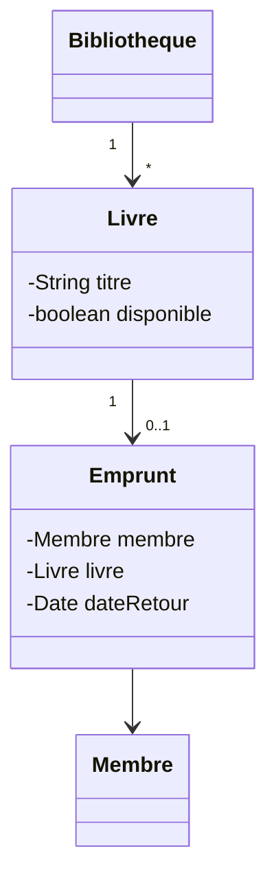

<div class="chapitre-titre-num">CHAPITRE 48</div>

# Projet 3 — Gestion d'une bibliothèque

## Objectifs pédagogiques

Construire un système de bibliothèque avec plusieurs classes en relation (chapitres 16-17), et une persistance réelle sur fichier (chapitre 24).

## 1. Cahier des charges

Gérer un catalogue de livres et leurs emprunts : ajouter un livre, l'emprunter (si disponible), le retourner, lister les livres disponibles, et sauvegarder/charger le catalogue depuis un fichier.

## 2. Analyse du problème

Trois entités en relation : `Livre` (composition avec `Bibliotheque`, qui les possède), `Membre` (association avec `Emprunt`), `Emprunt` (association entre un `Livre` et un `Membre`, avec une date).

## 3. UML



## 4. Modèle de données

```text
Livre        : titre, auteur, disponible
Membre       : nom
Emprunt      : livre (référence), membre (référence), dateEmprunt
Bibliotheque : liste de Livre (composition), liste d'Emprunt (composition)
```

## 5-6. Création des classes et programmation

```java
class Livre {
    private String titre;
    private String auteur;
    private boolean disponible = true;

    Livre(String titre, String auteur) {
        this.titre = titre;
        this.auteur = auteur;
    }

    String getTitre() { return titre; }
    boolean estDisponible() { return disponible; }
    void setDisponible(boolean disponible) { this.disponible = disponible; }

    @Override
    public String toString() {
        return titre + " (" + auteur + ") - " + (disponible ? "Disponible" : "Emprunté");
    }
}

class Membre {
    private String nom;
    Membre(String nom) { this.nom = nom; }
    String getNom() { return nom; }
}

class LivreIndisponibleException extends Exception {
    LivreIndisponibleException(String message) { super(message); }
}

class Bibliotheque {
    private ArrayList<Livre> livres = new ArrayList<>();

    void ajouterLivre(Livre livre) {
        livres.add(livre);
    }

    void emprunter(String titre, Membre membre) throws LivreIndisponibleException {
        Livre livre = trouverParTitre(titre)
            .orElseThrow(() -> new LivreIndisponibleException("Livre introuvable : " + titre));

        if (!livre.estDisponible()) {
            throw new LivreIndisponibleException(titre + " est déjà emprunté");
        }
        livre.setDisponible(false);
        System.out.println(membre.getNom() + " a emprunté " + titre);
    }

    void retourner(String titre) {
        trouverParTitre(titre).ifPresent(livre -> {
            livre.setDisponible(true);
            System.out.println(titre + " a été retourné");
        });
    }

    java.util.Optional<Livre> trouverParTitre(String titre) {
        return livres.stream().filter(l -> l.getTitre().equalsIgnoreCase(titre)).findFirst();
    }

    void listerDisponibles() {
        livres.stream().filter(Livre::estDisponible).forEach(System.out::println);
    }

    void sauvegarder(String cheminFichier) throws java.io.IOException {
        try (java.io.FileWriter writer = new java.io.FileWriter(cheminFichier)) {
            for (Livre l : livres) {
                writer.write(l.getTitre() + ";" + l.estDisponible() + "\n");
            }
        }
    }
}
```

<div class="encadre astuce">
<span class="encadre-titre">💡 Stream + méthode toString(), deux raccourcis pratiques</span>
<code>livres.stream().filter(Livre::estDisponible).forEach(System.out::println)</code> combine la Stream API (chapitre 29) et une référence de méthode (chapitre 47) pour afficher, en une seule ligne, tous les livres disponibles. <code>toString()</code>, redéfinie dans <code>Livre</code>, contrôle ce qu'affiche automatiquement <code>System.out.println(livre)</code> — une méthode spéciale, héritée silencieusement de la classe <code>Object</code> (l'ancêtre implicite de toute classe Java), qu'on peut redéfinir avec <code>@Override</code> exactement comme au chapitre 12.
</div>

## 7. Tests

```java
class BibliothequeTest {
    @Test
    void empunterUnLivreDisponible() throws LivreIndisponibleException {
        Bibliotheque b = new Bibliotheque();
        b.ajouterLivre(new Livre("1984", "Orwell"));
        b.emprunter("1984", new Membre("Jaslin"));
        assertFalse(b.trouverParTitre("1984").get().estDisponible());
    }

    @Test
    void empunterUnLivreDejaEmprunteLeveUneException() throws LivreIndisponibleException {
        Bibliotheque b = new Bibliotheque();
        b.ajouterLivre(new Livre("1984", "Orwell"));
        b.emprunter("1984", new Membre("Jaslin"));

        assertThrows(LivreIndisponibleException.class, () -> b.emprunter("1984", new Membre("Marie")));
    }
}
```

## 11. Amélioration

<div class="encadre defi">
<span class="encadre-titre">🧩 Défi — Améliore le projet</span>

Ajoute une classe `Emprunt` (chapitre 17, relation complexe) qui trace **qui** a emprunté **quel** livre et **quand**, avec une méthode `listerEmpruntsDeMembre(Membre membre)`. Ajoute aussi le chargement du fichier au démarrage, symétrique de `sauvegarder()`.
</div>

---

*Chapitre suivant : Projet 4 — Gestion d'un magasin, avec une gestion de stock et des exceptions personnalisées.*
