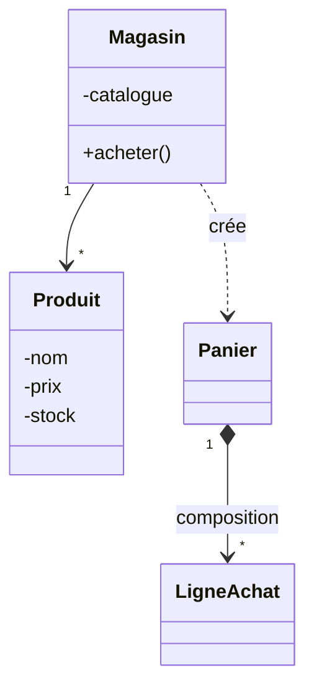

<div class="chapitre-titre-num">CHAPITRE 49</div>

# Projet 4 — Gestion d'un magasin

## Objectifs pédagogiques

Construire un système de gestion de stock avec panier d'achat, en combinant `HashMap` (chapitre 21), exceptions personnalisées (chapitre 23), et enum (chapitre 25).

## 1. Cahier des charges

Un magasin qui gère un catalogue de produits avec quantités en stock, un panier d'achat qui vérifie la disponibilité avant chaque ajout, et un calcul du total avec application d'une catégorie de réduction selon le type de client.

## 2. Analyse du problème

Un `HashMap<String, Produit>` pour un accès rapide par nom (chapitre 21), un `enum TypeClient` pour les catégories de réduction (chapitre 25), une exception personnalisée `StockInsuffisantException` (chapitre 23), et une classe `Panier` en composition avec des lignes d'achat (chapitre 16).

## 3. UML



## 4. Modèle de données

```text
Produit    : nom, prix, quantiteEnStock
LigneAchat : produit (référence), quantite
Panier     : liste de LigneAchat (composition), TypeClient
TypeClient : STANDARD (0%), FIDELE (5%), VIP (10%)
```

## 5-6. Création des classes et programmation

```java
enum TypeClient {
    STANDARD(0.0), FIDELE(0.05), VIP(0.10);

    private final double tauxReduction;
    TypeClient(double taux) { this.tauxReduction = taux; }
    double getTauxReduction() { return tauxReduction; }
}

class StockInsuffisantException extends Exception {
    StockInsuffisantException(String message) { super(message); }
}

class Produit {
    private String nom;
    private double prix;
    private int quantiteEnStock;

    Produit(String nom, double prix, int quantiteEnStock) {
        this.nom = nom;
        this.prix = prix;
        this.quantiteEnStock = quantiteEnStock;
    }

    String getNom() { return nom; }
    double getPrix() { return prix; }
    int getQuantiteEnStock() { return quantiteEnStock; }

    void retirerStock(int quantite) throws StockInsuffisantException {
        if (quantite > quantiteEnStock) {
            throw new StockInsuffisantException(
                "Stock insuffisant pour " + nom + " : " + quantiteEnStock + " disponible(s)");
        }
        quantiteEnStock -= quantite;
    }
}

class LigneAchat {
    private Produit produit;
    private int quantite;

    LigneAchat(Produit produit, int quantite) {
        this.produit = produit;
        this.quantite = quantite;
    }

    double calculerSousTotal() {
        return produit.getPrix() * quantite;
    }
}

class Panier {
    private ArrayList<LigneAchat> lignes = new ArrayList<>();
    private TypeClient typeClient;

    Panier(TypeClient typeClient) {
        this.typeClient = typeClient;
    }

    void ajouter(Produit produit, int quantite) throws StockInsuffisantException {
        produit.retirerStock(quantite); // valide ET décrémente en une seule étape
        lignes.add(new LigneAchat(produit, quantite));
    }

    double calculerTotal() {
        double total = 0;
        for (LigneAchat ligne : lignes) {
            total += ligne.calculerSousTotal();
        }
        return total - (total * typeClient.getTauxReduction());
    }
}

class Magasin {
    private HashMap<String, Produit> catalogue = new HashMap<>();

    void ajouterProduit(Produit p) {
        catalogue.put(p.getNom(), p);
    }

    java.util.Optional<Produit> trouverProduit(String nom) {
        return java.util.Optional.ofNullable(catalogue.get(nom));
    }
}
```

## 7. Tests

```java
class PanierTest {
    @Test
    void ajouterUnProduitDisponibleReduitLeStock() throws StockInsuffisantException {
        Produit riz = new Produit("Riz", 250, 100);
        Panier panier = new Panier(TypeClient.STANDARD);
        panier.ajouter(riz, 10);
        assertEquals(90, riz.getQuantiteEnStock());
    }

    @Test
    void reductionVipAppliqueeCorrectement() throws StockInsuffisantException {
        Produit riz = new Produit("Riz", 1000, 100);
        Panier panier = new Panier(TypeClient.VIP); // 10%
        panier.ajouter(riz, 1);
        assertEquals(900.0, panier.calculerTotal());
    }

    @Test
    void stockInsuffisantLeveUneException() {
        Produit riz = new Produit("Riz", 250, 5);
        Panier panier = new Panier(TypeClient.STANDARD);
        assertThrows(StockInsuffisantException.class, () -> panier.ajouter(riz, 10));
    }
}
```

## 11. Amélioration

<div class="encadre defi">
<span class="encadre-titre">🧩 Défi — Améliore le projet</span>

Ajoute une méthode `Magasin.acheter(String nomProduit, int quantite, Panier panier)` qui recherche le produit dans le catalogue via `trouverProduit()` (`Optional`, chapitre 28) avant de l'ajouter au panier, en gérant proprement le cas d'un produit introuvable.
</div>

---

*Chapitre suivant : Projet 5 — Gestion bancaire, avec des interfaces, de l'héritage entre types de comptes, et une gestion d'erreurs approfondie.*
