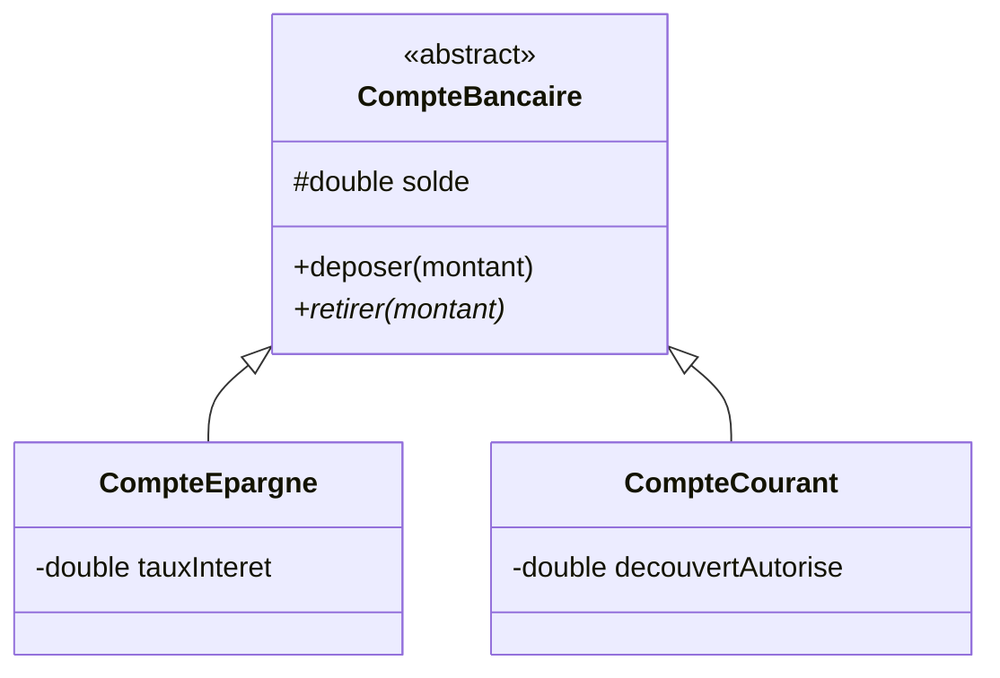

<div class="chapitre-titre-num">CHAPITRE 50</div>

# Projet 5 — Gestion bancaire

## Objectifs pédagogiques

Construire un mini-système bancaire combinant héritage entre types de comptes (chapitre 12), polymorphisme (chapitre 13), interfaces (chapitre 15), et exceptions personnalisées (chapitre 23).

## 1. Cahier des charges

Gérer deux types de comptes (Épargne, avec un taux d'intérêt ; Courant, avec un découvert autorisé), chacun avec ses propres règles de retrait, tout en partageant une base commune (dépôt, consultation du solde).

## 2. Analyse du problème

Une classe abstraite `CompteBancaire` (chapitre 14) impose un contrat commun (`retirer()`, abstraite, car chaque type de compte a des règles différentes), avec deux classes filles `CompteEpargne` et `CompteCourant`. Une interface `Relevable` (chapitre 15) définit la capacité "générer un relevé", implémentée par les deux.

## 3. UML



## 4. Modèle de données

```text
CompteBancaire (abstraite) : titulaire, solde
CompteEpargne extends CompteBancaire : tauxInteret (retrait limité au solde)
CompteCourant extends CompteBancaire : decouvertAutorise (retrait possible en négatif, dans la limite)
```

## 5-6. Création des classes et programmation

```java
class SoldeInsuffisantException extends Exception {
    SoldeInsuffisantException(String message) { super(message); }
}

interface Relevable {
    String genererReleve();
}

abstract class CompteBancaire implements Relevable {
    protected String titulaire;
    protected double solde;

    CompteBancaire(String titulaire, double soldeInitial) {
        this.titulaire = titulaire;
        this.solde = soldeInitial;
    }

    void deposer(double montant) {
        if (montant <= 0) throw new IllegalArgumentException("Montant invalide");
        solde += montant;
    }

    abstract void retirer(double montant) throws SoldeInsuffisantException;

    double getSolde() { return solde; }

    @Override
    public String genererReleve() {
        return titulaire + " — Solde : " + solde + " HTG";
    }
}

class CompteEpargne extends CompteBancaire {
    private double tauxInteret;

    CompteEpargne(String titulaire, double soldeInitial, double tauxInteret) {
        super(titulaire, soldeInitial);
        this.tauxInteret = tauxInteret;
    }

    @Override
    void retirer(double montant) throws SoldeInsuffisantException {
        if (montant > solde) {
            throw new SoldeInsuffisantException("Solde épargne insuffisant");
        }
        solde -= montant;
    }

    void appliquerInterets() {
        solde += solde * tauxInteret;
    }
}

class CompteCourant extends CompteBancaire {
    private double decouvertAutorise;

    CompteCourant(String titulaire, double soldeInitial, double decouvertAutorise) {
        super(titulaire, soldeInitial);
        this.decouvertAutorise = decouvertAutorise;
    }

    @Override
    void retirer(double montant) throws SoldeInsuffisantException {
        if (solde - montant < -decouvertAutorise) {
            throw new SoldeInsuffisantException("Découvert autorisé dépassé");
        }
        solde -= montant;
    }
}
```

```java
public class Main {
    public static void main(String[] args) throws SoldeInsuffisantException {
        CompteBancaire[] comptes = {
            new CompteEpargne("Jaslin", 1000, 0.03),
            new CompteCourant("Marie", 500, 200)
        };

        comptes[0].retirer(200); // OK, épargne
        comptes[1].retirer(600); // OK, découvert autorisé jusqu'à -200

        for (CompteBancaire c : comptes) {
            System.out.println(c.genererReleve()); // POLYMORPHISME : un seul appel, comportement propre à chaque type
        }
    }
}
```

<div class="encadre astuce">
<span class="encadre-titre">💡 Le polymorphisme, encore et toujours au cœur d'un vrai système</span>
La boucle finale (<code>for (CompteBancaire c : comptes)</code>) ne sait jamais, et n'a jamais besoin de savoir, si chaque compte est une épargne ou un courant — exactement le bénéfice démontré au chapitre 13, appliqué ici à un vrai petit système bancaire.
</div>

## 7. Tests

```java
class CompteBancaireTest {
    @Test
    void retirerAuDelaDuDecouvertAutoriseLeveUneException() {
        CompteCourant c = new CompteCourant("Marie", 100, 50);
        assertThrows(SoldeInsuffisantException.class, () -> c.retirer(200));
    }

    @Test
    void appliquerInteretsAugmenteLeSolde() {
        CompteEpargne c = new CompteEpargne("Jaslin", 1000, 0.05);
        c.appliquerInterets();
        assertEquals(1050.0, c.getSolde());
    }
}
```

## 11. Amélioration

<div class="encadre defi">
<span class="encadre-titre">🧩 Défi — Améliore le projet</span>

Ajoute un troisième type de compte, `CompteJeunesse`, avec un plafond de solde maximal (dépôt refusé au-delà), sans modifier une seule ligne des classes existantes — exactement le principe Open/Closed du chapitre 44.
</div>

---

*Chapitre suivant : Projet 6 — Gestion scolaire, le projet le plus complexe avant l'introduction de la base de données, combinant plusieurs entités en relation.*
