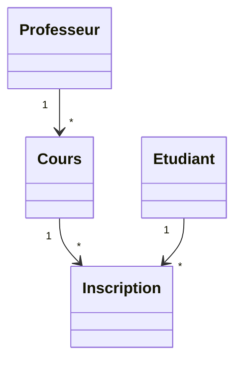

<div class="chapitre-titre-num">CHAPITRE 51</div>

# Projet 6 — Gestion scolaire

## Objectifs pédagogiques

Construire un système scolaire combinant plusieurs entités en relation (chapitre 17), le projet le plus riche en POO pure de ce manuel, avant l'introduction de la base de données au Projet 7.

## 1. Cahier des charges

Gérer une école avec des professeurs, des étudiants, des cours (chacun enseigné par un professeur), et des inscriptions (un étudiant à un cours), avec calcul de la charge d'enseignement d'un professeur et de la liste des cours d'un étudiant.

## 2. Analyse du problème

Cinq classes en relation : `Ecole` (agrégation de `Professeur` et `Etudiant`, composition de `Cours` et `Inscription`), `Professeur`, `Etudiant`, `Cours` (association avec `Professeur`), `Inscription` (association avec `Etudiant` et `Cours` — exactement le même patron que `Client`/`Commande`/`Produit` du chapitre 17).

## 3. UML



## 4. Modèle de données

```text
Professeur   : nom, specialite
Etudiant     : nom
Cours        : nom, professeur (association)
Inscription  : etudiant (association), cours (association)
Ecole        : listes de Professeur, Etudiant, Cours, Inscription (composition pour Cours/Inscription)
```

## 5-6. Création des classes et programmation

```java
class Professeur {
    private String nom;
    private String specialite;

    Professeur(String nom, String specialite) {
        this.nom = nom;
        this.specialite = specialite;
    }

    String getNom() { return nom; }
}

class Etudiant {
    private String nom;
    Etudiant(String nom) { this.nom = nom; }
    String getNom() { return nom; }
}

class Cours {
    private String nom;
    private Professeur professeur; // ASSOCIATION

    Cours(String nom, Professeur professeur) {
        this.nom = nom;
        this.professeur = professeur;
    }

    String getNom() { return nom; }
    Professeur getProfesseur() { return professeur; }
}

class Inscription {
    private Etudiant etudiant;
    private Cours cours;

    Inscription(Etudiant etudiant, Cours cours) {
        this.etudiant = etudiant;
        this.cours = cours;
    }

    Etudiant getEtudiant() { return etudiant; }
    Cours getCours() { return cours; }
}
```

```java
class Ecole {
    private ArrayList<Cours> cours = new ArrayList<>();
    private ArrayList<Inscription> inscriptions = new ArrayList<>();

    void ajouterCours(Cours c) {
        cours.add(c);
    }

    void inscrire(Etudiant etudiant, Cours cours) {
        inscriptions.add(new Inscription(etudiant, cours)); // COMPOSITION : créée ici, pour l'école
    }

    List<Cours> listerCoursDe(Etudiant etudiant) {
        return inscriptions.stream()
            .filter(i -> i.getEtudiant() == etudiant)
            .map(Inscription::getCours)
            .toList();
    }

    long compterEtudiantsDe(Cours cours) {
        return inscriptions.stream()
            .filter(i -> i.getCours() == cours)
            .count();
    }

    Map<String, Long> chargeParProfesseur() {
        return cours.stream()
            .collect(java.util.stream.Collectors.groupingBy(
                c -> c.getProfesseur().getNom(),
                java.util.stream.Collectors.counting()
            ));
    }
}
```

<div class="encadre astuce">
<span class="encadre-titre">💡 Collectors.groupingBy : le GROUP BY du chapitre 32, en Java</span>
<code>Collectors.groupingBy(...)</code> est l'équivalent, côté Stream API (chapitre 29), du <code>GROUP BY</code> SQL vu au chapitre 32 : il regroupe les éléments d'un stream selon un critère (ici, le nom du professeur), puis applique un calcul à chaque groupe (ici, <code>counting()</code>, le nombre de cours). Retrouver ce même principe des deux côtés (base de données et code Java) n'est pas un hasard : ce sont deux façons différentes de répondre au même besoin très courant.
</div>

## 7. Tests

```java
class EcoleTest {
    @Test
    void listerCoursDUnEtudiantInscrit() {
        Ecole ecole = new Ecole();
        Professeur prof = new Professeur("M. Pierre", "Mathématiques");
        Cours maths = new Cours("Mathématiques", prof);
        ecole.ajouterCours(maths);

        Etudiant jaslin = new Etudiant("Jaslin");
        ecole.inscrire(jaslin, maths);

        assertEquals(1, ecole.listerCoursDe(jaslin).size());
    }

    @Test
    void compterEtudiantsDUnCours() {
        Ecole ecole = new Ecole();
        Cours cours = new Cours("SQL", new Professeur("Mme Anne", "Info"));
        ecole.ajouterCours(cours);
        ecole.inscrire(new Etudiant("Marie"), cours);
        ecole.inscrire(new Etudiant("Paul"), cours);

        assertEquals(2, ecole.compterEtudiantsDe(cours));
    }
}
```

## 11. Amélioration

<div class="encadre defi">
<span class="encadre-titre">🧩 Défi — Améliore le projet</span>

Ajoute une règle métier : un cours ne peut accepter plus de 30 inscriptions (une `CoursCompletException`, chapitre 23, levée par `inscrire()` au-delà de cette limite). Réutilise `compterEtudiantsDe()` déjà écrite pour cette vérification.
</div>

---

*Chapitre suivant : Projet 7 — Gestion commerciale avec MySQL, le projet intégrateur qui combine enfin tout : POO, JDBC, DAO et architecture en couches.*
