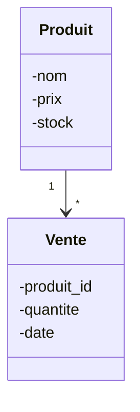

<div class="chapitre-titre-num">CHAPITRE 52</div>

# Projet 7 — Gestion commerciale avec MySQL

## Objectifs pédagogiques

Construire le projet intégrateur de cette partie : un système de gestion commerciale combinant POO complète, base de données MySQL, DAO, et une amorce d'architecture en couches (service) — la synthèse de tout ce qui a été appris depuis le chapitre 8.

## 1. Cahier des charges

Gérer un catalogue de produits et des ventes, avec persistance réelle en base de données MySQL (contrairement aux six projets précédents, en mémoire ou sur fichier) : enregistrer une vente décrémente le stock, avec vérification de disponibilité, et calcul du chiffre d'affaires total.

## 2. Analyse du problème

Ce projet applique, dans l'ordre : le modèle (`Produit`, `Vente`), la base de données (chapitre 31-32), les DAO (chapitre 35) qui isolent tout le JDBC (chapitre 33-34), et un service (chapitre 37) qui orchestre la règle métier (vérifier le stock avant de vendre).

## 3. UML



## 4. Modèle de données (SQL, chapitres 31-32)

```sql
CREATE TABLE produits (
    id INT PRIMARY KEY AUTO_INCREMENT,
    nom VARCHAR(100),
    prix DOUBLE,
    stock INT
);

CREATE TABLE ventes (
    id INT PRIMARY KEY AUTO_INCREMENT,
    produit_id INT,
    quantite INT,
    date_vente DATE,
    FOREIGN KEY (produit_id) REFERENCES produits(id)
);
```

## 5-6. Création des classes, DAO et JDBC (chapitres 33-35)

```java
class Produit {
    private int id;
    private String nom;
    private double prix;
    private int stock;

    Produit(String nom, double prix, int stock) {
        this.nom = nom; this.prix = prix; this.stock = stock;
    }

    int getId() { return id; }
    void setId(int id) { this.id = id; }
    String getNom() { return nom; }
    double getPrix() { return prix; }
    int getStock() { return stock; }
    void setStock(int stock) { this.stock = stock; }
}

class StockInsuffisantException extends Exception {
    StockInsuffisantException(String message) { super(message); }
}

class ProduitDAO {
    private Connection connexion;
    ProduitDAO(Connection connexion) { this.connexion = connexion; }

    void sauvegarder(Produit p) throws SQLException {
        String sql = "INSERT INTO produits (nom, prix, stock) VALUES (?, ?, ?)";
        try (PreparedStatement req = connexion.prepareStatement(sql)) {
            req.setString(1, p.getNom());
            req.setDouble(2, p.getPrix());
            req.setInt(3, p.getStock());
            req.executeUpdate();
        }
    }

    Optional<Produit> trouverParId(int id) throws SQLException {
        String sql = "SELECT id, nom, prix, stock FROM produits WHERE id = ?";
        try (PreparedStatement req = connexion.prepareStatement(sql)) {
            req.setInt(1, id);
            try (ResultSet rs = req.executeQuery()) {
                if (rs.next()) {
                    Produit p = new Produit(rs.getString("nom"), rs.getDouble("prix"), rs.getInt("stock"));
                    p.setId(rs.getInt("id"));
                    return Optional.of(p);
                }
                return Optional.empty();
            }
        }
    }

    void mettreAJourStock(int id, int nouveauStock) throws SQLException {
        String sql = "UPDATE produits SET stock = ? WHERE id = ?";
        try (PreparedStatement req = connexion.prepareStatement(sql)) {
            req.setInt(1, nouveauStock);
            req.setInt(2, id);
            req.executeUpdate();
        }
    }
}
```

## 10. Architecture : le service (chapitre 37)

```java
class VenteService {
    private ProduitDAO produitDAO;

    VenteService(ProduitDAO produitDAO) {
        this.produitDAO = produitDAO;
    }

    void enregistrerVente(int produitId, int quantite) throws SQLException, StockInsuffisantException {
        Produit produit = produitDAO.trouverParId(produitId)
            .orElseThrow(() -> new IllegalArgumentException("Produit introuvable"));

        if (quantite > produit.getStock()) {
            throw new StockInsuffisantException("Stock insuffisant pour " + produit.getNom());
        }

        produitDAO.mettreAJourStock(produitId, produit.getStock() - quantite);
        System.out.println("Vente enregistrée : " + quantite + "x " + produit.getNom());
    }
}
```

```java
public class Main {
    public static void main(String[] args) throws SQLException, StockInsuffisantException {
        try (Connection connexion = DriverManager.getConnection(
                "jdbc:mysql://localhost:3306/gestion_commerciale", "root", "motdepasse123")) {

            ProduitDAO produitDAO = new ProduitDAO(connexion);
            VenteService venteService = new VenteService(produitDAO);

            Produit riz = new Produit("Riz", 250, 100);
            produitDAO.sauvegarder(riz);

            venteService.enregistrerVente(1, 10); // vend 10 sacs de riz
        }
    }
}
```

<div class="encadre astuce">
<span class="encadre-titre">💡 Remarque architecturale : main ne connaît AUCUN SQL</span>
Compare ce <code>main</code> à celui du Projet 1 (chapitre 46) : ici, aucune trace de <code>PreparedStatement</code>, aucun <code>ResultSet</code> — tout est proprement isolé dans <code>ProduitDAO</code> et orchestré par <code>VenteService</code>. C'est la démonstration concrète de tout ce qui a été appris depuis la Partie 12 (Architecture professionnelle).
</div>

## 7. Tests

```java
class VenteServiceTest {
    @Test
    void venteAvecStockSuffisantReussit() throws Exception {
        ProduitDAO daoSimule = mock(ProduitDAO.class); // simulation, technique avancée hors périmètre détaillé
        // ... (voir l'Annexe D pour approfondir les tests avec des DAO simulés)
    }
}
```

<div class="encadre attention">
<span class="encadre-titre">⚠️ Tester du code qui dépend d'une base de données réelle</span>
Tester directement `VenteService`, qui dépend de `ProduitDAO`, donc d'une vraie connexion MySQL, complique les tests unitaires (chapitre 39) : chaque test nécessiterait une base de données réellement démarrée. La solution professionnelle (remplacer le DAO par une version simulée, une technique appelée <em>mocking</em>) dépasse le cadre de ce manuel, mais l'architecture en couches déjà mise en place (DAO séparé du service) est précisément ce qui rend cette technique possible plus tard — un bénéfice direct de l'architecture professionnelle du chapitre 37-38.
</div>

## 11. Amélioration

<div class="encadre defi">
<span class="encadre-titre">🧩 Défi — Améliore le projet</span>

Ajoute une classe `Vente` et une table `ventes` réelle (déjà définie à l'étape 4), avec une méthode `VenteDAO.sauvegarder(Vente vente)`, appelée par `VenteService.enregistrerVente()` en plus de la mise à jour du stock — pour garder une trace de chaque vente, pas seulement le stock final.
</div>

---

# 🎓 Révision de la Partie 18 — Projets progressifs

## Carte mentale des 7 projets

```{.uml}
Projet 1 Calculatrice        → bases, méthodes
Projet 2 Gestion étudiants   → encapsulation, ArrayList
Projet 3 Bibliothèque        → relations, fichiers
Projet 4 Magasin             → HashMap, exceptions perso, enum
Projet 5 Bancaire            → héritage, polymorphisme, interfaces
Projet 6 Scolaire            → relations complexes, Streams
Projet 7 Commercial MySQL    → JDBC, DAO, architecture en couches
```

## Question de révision

Pourquoi le Projet 7 est-il significativement plus facile à tester et à faire évoluer que si tout son code (SQL compris) avait été écrit directement dans `main`, comme au Projet 1 ?

**Réponse :** Parce que chaque responsabilité est isolée dans sa propre classe (`Produit` pour la donnée, `ProduitDAO` pour l'accès aux données, `VenteService` pour la règle métier) — exactement les principes des chapitres 36 à 38. Modifier la base de données n'impacterait que le DAO ; modifier une règle métier n'impacterait que le service ; `main` resterait presque inchangé dans les deux cas.

---

*Chapitre suivant : le projet final — GestionCommerciale, une application professionnelle complète, construite chapitre après chapitre en réutilisant absolument tout ce que ce manuel a enseigné.*
