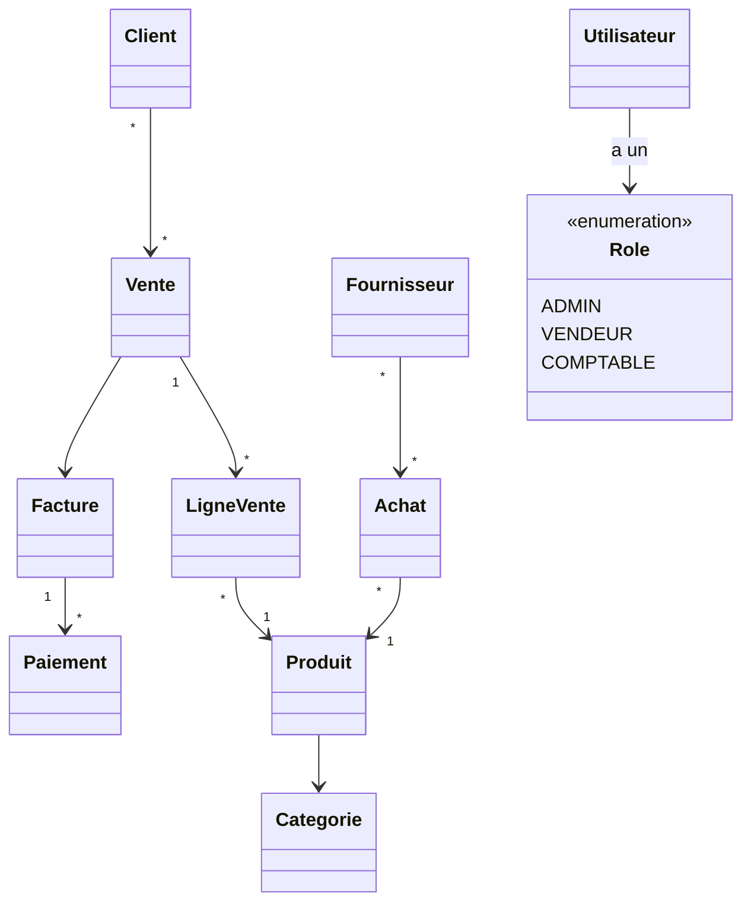
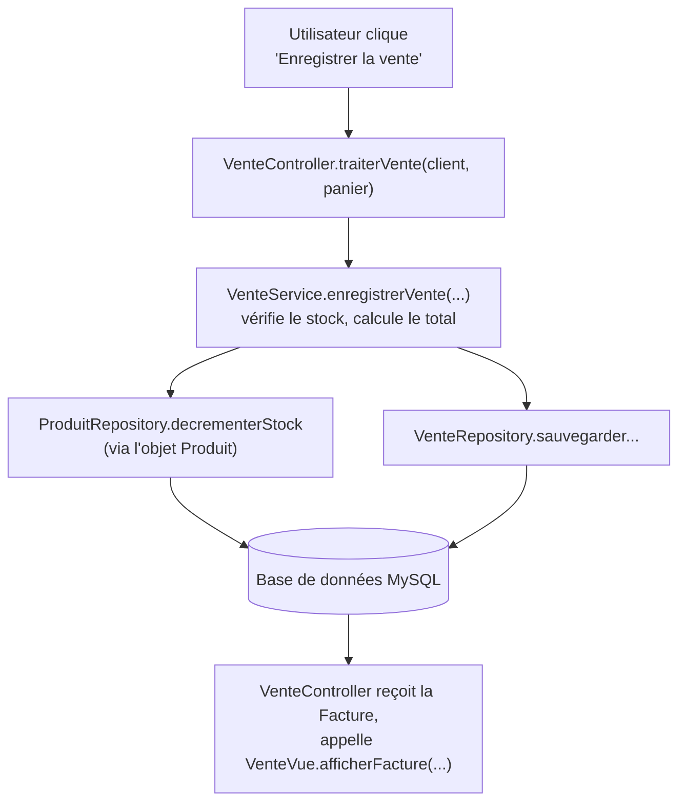

<div class="chapitre-titre-num">CHAPITRE 53</div>

# Projet final — GestionCommerciale

## Objectifs pédagogiques

Concevoir et construire, de bout en bout, une application professionnelle complète : GestionCommerciale, qui réutilise et assemble absolument tout ce que ce manuel a enseigné depuis le chapitre 1.

<div class="encadre astuce">
<span class="encadre-titre">💡 Ce chapitre est un plan d'architecture complet, pas 15 modules recodés en entier</span>
Le Projet 7 (chapitre 52) a déjà démontré, en miniature, l'architecture complète (POO + JDBC + DAO + service). Ce chapitre final l'étend à l'échelle d'une vraie application, avec TOUS ses modules métier. Trois modules représentatifs sont codés intégralement (Utilisateurs/Rôles, Produits/Catégories/Stock, Ventes/Factures/Paiements) ; les autres (Clients, Fournisseurs/Achats, Recherche, Statistiques/Rapports) sont expliqués architecturalement, en réutilisant exactement le même patron — à toi de les construire, en appliquant ce que tu viens d'apprendre.
</div>

## 1. Cahier des charges

Une application de gestion commerciale complète pour une entreprise (boutique ou grossiste), avec : connexion sécurisée et gestion des rôles (Administrateur, Vendeur, Comptable), gestion des clients et fournisseurs, gestion des produits et catégories, suivi du stock, achats auprès des fournisseurs, ventes aux clients avec génération de factures, enregistrement des paiements, recherche transversale, statistiques et rapports.

## 2. Analyse du problème

Chaque grand domaine métier devient un **module**, suivant l'organisation du chapitre 36 (`model`, `dao`, `service`, `ui`) et l'architecture MVC du chapitre 37 :

```text
UI (console ou interface)
    ↓
Controller (orchestration, un par module)
    ↓
Service (règles métier, un par module)
    ↓
Repository / DAO (accès aux données, un par entité)
    ↓
Database (MySQL)
```

*Pourquoi cette architecture, et pas une seule grande classe ?* Parce que chaque couche a une seule responsabilité claire (chapitre 36, principe de responsabilité unique du chapitre 44) : la base de données peut changer sans toucher au service ; l'interface peut changer (console → web) sans toucher à la logique métier ; une règle métier peut changer sans toucher à l'accès aux données.

## 3. UML global (vue d'ensemble simplifiée)



## 4. Modèle de données (extrait, base complète)

```sql
CREATE TABLE utilisateurs (
    id INT PRIMARY KEY AUTO_INCREMENT,
    nom_utilisateur VARCHAR(50) UNIQUE,
    mot_de_passe_hash VARCHAR(255),
    role VARCHAR(20)
);

CREATE TABLE categories (
    id INT PRIMARY KEY AUTO_INCREMENT,
    nom VARCHAR(100)
);

CREATE TABLE produits (
    id INT PRIMARY KEY AUTO_INCREMENT,
    nom VARCHAR(100),
    prix DOUBLE,
    stock INT,
    categorie_id INT,
    FOREIGN KEY (categorie_id) REFERENCES categories(id)
);

CREATE TABLE clients (
    id INT PRIMARY KEY AUTO_INCREMENT,
    nom VARCHAR(100),
    solde_du DOUBLE DEFAULT 0
);

CREATE TABLE ventes (
    id INT PRIMARY KEY AUTO_INCREMENT,
    client_id INT,
    date_vente DATE,
    FOREIGN KEY (client_id) REFERENCES clients(id)
);

CREATE TABLE lignes_vente (
    id INT PRIMARY KEY AUTO_INCREMENT,
    vente_id INT,
    produit_id INT,
    quantite INT,
    FOREIGN KEY (vente_id) REFERENCES ventes(id),
    FOREIGN KEY (produit_id) REFERENCES produits(id)
);

CREATE TABLE factures (
    id INT PRIMARY KEY AUTO_INCREMENT,
    vente_id INT,
    montant_total DOUBLE,
    FOREIGN KEY (vente_id) REFERENCES ventes(id)
);

CREATE TABLE paiements (
    id INT PRIMARY KEY AUTO_INCREMENT,
    facture_id INT,
    montant DOUBLE,
    date_paiement DATE,
    FOREIGN KEY (facture_id) REFERENCES factures(id)
);
```

*(Les tables `fournisseurs` et `achats` suivent exactement le même patron que `clients`/`ventes`.)*

## 5. Module 1 — Utilisateurs et rôles (authentification simplifiée)

```java
enum Role { ADMIN, VENDEUR, COMPTABLE }

class Utilisateur {
    private int id;
    private String nomUtilisateur;
    private String motDePasseHash;
    private Role role;

    Utilisateur(String nomUtilisateur, String motDePasseHash, Role role) {
        this.nomUtilisateur = nomUtilisateur;
        this.motDePasseHash = motDePasseHash;
        this.role = role;
    }

    String getNomUtilisateur() { return nomUtilisateur; }
    Role getRole() { return role; }
    boolean verifierMotDePasse(String motDePasseHashSaisi) {
        return motDePasseHash.equals(motDePasseHashSaisi);
    }
}

class AccesRefuseException extends Exception {
    AccesRefuseException(String message) { super(message); }
}

class AuthentificationService {
    private UtilisateurDAO dao;

    AuthentificationService(UtilisateurDAO dao) { this.dao = dao; }

    Utilisateur connecter(String nomUtilisateur, String motDePasseHash) throws AccesRefuseException, SQLException {
        return dao.trouverParNom(nomUtilisateur)
            .filter(u -> u.verifierMotDePasse(motDePasseHash))
            .orElseThrow(() -> new AccesRefuseException("Identifiants incorrects"));
    }

    void verifierRole(Utilisateur utilisateur, Role roleRequis) throws AccesRefuseException {
        if (utilisateur.getRole() != roleRequis && utilisateur.getRole() != Role.ADMIN) {
            throw new AccesRefuseException("Accès réservé au rôle " + roleRequis);
        }
    }
}
```

<div class="encadre astuce">
<span class="encadre-titre">💡 Pourquoi un hash, jamais le mot de passe en clair</span>
`motDePasseHash` ne stocke jamais le mot de passe réel, mais le résultat d'une fonction de hachage à sens unique (impossible à "dé-hacher"). Générer réellement ce hash (avec des bibliothèques dédiées comme BCrypt) dépasse le périmètre de ce manuel, mais retiens ce principe de sécurité fondamental, déjà évoqué au chapitre 33 : ne **jamais**, dans aucun projet réel, stocker un mot de passe en clair.
</div>

## 6. Module 2 — Produits, catégories et stock

```java
class Categorie {
    private int id;
    private String nom;
    Categorie(String nom) { this.nom = nom; }
    String getNom() { return nom; }
}

class Produit {
    private int id;
    private String nom;
    private double prix;
    private int stock;
    private Categorie categorie; // ASSOCIATION, chapitre 16

    Produit(String nom, double prix, int stock, Categorie categorie) {
        this.nom = nom; this.prix = prix; this.stock = stock; this.categorie = categorie;
    }

    int getId() { return id; }
    void setId(int id) { this.id = id; }
    String getNom() { return nom; }
    double getPrix() { return prix; }
    int getStock() { return stock; }

    void decrementerStock(int quantite) throws StockInsuffisantException {
        if (quantite > stock) throw new StockInsuffisantException(nom + " : stock insuffisant");
        stock -= quantite;
    }
}

class ProduitRepository { // pattern Repository, chapitre 38
    private Connection connexion;
    ProduitRepository(Connection connexion) { this.connexion = connexion; }

    void ajouter(Produit p) throws SQLException {
        String sql = "INSERT INTO produits (nom, prix, stock, categorie_id) VALUES (?, ?, ?, ?)";
        try (PreparedStatement req = connexion.prepareStatement(sql)) {
            req.setString(1, p.getNom());
            req.setDouble(2, p.getPrix());
            req.setInt(3, p.getStock());
            req.setInt(4, p.getCategorie().getId());
            req.executeUpdate();
        }
    }

    List<Produit> rechercherParNom(String motCle) throws SQLException { // module Recherche
        String sql = "SELECT * FROM produits WHERE nom LIKE ?";
        List<Produit> resultat = new ArrayList<>();
        try (PreparedStatement req = connexion.prepareStatement(sql)) {
            req.setString(1, "%" + motCle + "%");
            try (ResultSet rs = req.executeQuery()) {
                while (rs.next()) {
                    // construction du Produit à partir de rs, comme au chapitre 35
                }
            }
        }
        return resultat;
    }
}
```

## 7. Module 3 — Ventes, factures et paiements (le cas d'usage complet, de l'UI à la base)

C'est ici que **toutes** les couches collaborent, sur le scénario central de l'application : enregistrer une vente.

```java
class Facture {
    private int id;
    private double montantTotal;
    private boolean payee = false;

    Facture(double montantTotal) { this.montantTotal = montantTotal; }
    void marquerPayee() { payee = true; }
    double getMontantTotal() { return montantTotal; }
    boolean estPayee() { return payee; }
}

class VenteService { // COUCHE SERVICE : la règle métier
    private ProduitRepository produitRepository;
    private VenteRepository venteRepository;

    VenteService(ProduitRepository produitRepository, VenteRepository venteRepository) {
        this.produitRepository = produitRepository;
        this.venteRepository = venteRepository;
    }

    Facture enregistrerVente(Client client, Map<Produit, Integer> panier)
            throws StockInsuffisantException, SQLException {

        double total = 0;
        for (Map.Entry<Produit, Integer> ligne : panier.entrySet()) {
            Produit produit = ligne.getKey();
            int quantite = ligne.getValue();
            produit.decrementerStock(quantite); // règle métier : jamais de stock négatif
            total += produit.getPrix() * quantite;
        }

        venteRepository.sauvegarderVenteEtLignes(client, panier); // persistance, DAO
        Facture facture = new Facture(total);
        venteRepository.sauvegarderFacture(facture);
        return facture;
    }
}

class VenteController { // COUCHE CONTROLLER : orchestre service + vue, chapitre 37
    private VenteService service;
    private VenteVue vue;

    VenteController(VenteService service, VenteVue vue) {
        this.service = service;
        this.vue = vue;
    }

    void traiterVente(Client client, Map<Produit, Integer> panier) {
        try {
            Facture facture = service.enregistrerVente(client, panier);
            vue.afficherFacture(facture);
        } catch (StockInsuffisantException | SQLException e) {
            vue.afficherErreur(e.getMessage());
        }
    }
}

class VenteVue { // COUCHE UI
    void afficherFacture(Facture facture) {
        System.out.println("Facture générée — Total : " + facture.getMontantTotal() + " HTG");
    }
    void afficherErreur(String message) {
        System.out.println("Erreur : " + message);
    }
}
```



Ce schéma de bout en bout — de l'action utilisateur jusqu'à la base de données, et retour — est **exactement** le fonctionnement de n'importe quelle application professionnelle réelle du portefeuille de projets construits avec Claude Code (BANKA, GESCOM, LAKAY...), toutes proportions gardées.

## Les modules restants (à construire en réutilisant le même patron)

```{.uml}
Clients / Fournisseurs   →  suivent exactement le patron de Produit/ProduitRepository
Achats                    →  suit exactement le patron de Vente/VenteService, inversé
                              (Fournisseur au lieu de Client, INCRÉMENTE le stock)
Recherche                 →  déjà amorcée avec rechercherParNom(), à étendre par
                              catégorie, par plage de prix (chapitre 32, WHERE)
Statistiques / Rapports   →  Stream API (chapitre 29) + GROUP BY (chapitre 32) sur
                              les données déjà en base : chiffre d'affaires par
                              période, produits les plus vendus, etc.
```

## Tests

```java
class VenteServiceTest {
    @Test
    void venteReduitLeStockEtGenereUneFacture() throws Exception {
        // avec un DAO simulé (mock), comme évoqué au chapitre 52
    }
}
```

## Erreurs fréquentes sur un projet de cette taille

<div class="encadre attention">
<span class="encadre-titre">⚠️ Erreur n°1 — Vouloir tout écrire d'un coup, sans étapes</span>
Un projet de cette ampleur ne se construit jamais en une seule fois. La méthode professionnelle : un module à la fois (ici, Utilisateurs, puis Produits, puis Ventes...), chacun testé et fonctionnel avant de passer au suivant — exactement l'ordre suivi dans ce chapitre, et dans les 7 projets progressifs qui l'ont précédé.
</div>

<div class="encadre attention">
<span class="encadre-titre">⚠️ Erreur n°2 — Laisser une couche "déborder" sur une autre</span>
Le risque le plus fréquent sur un grand projet : un peu de SQL qui s'infiltre dans un contrôleur, une règle métier qui s'infiltre dans un DAO. Chaque fois que ce risque apparaît, relire les chapitres 36 à 38 suffit généralement à identifier où le code déplacé devrait réellement vivre.
</div>

<div class="encadre progression">
<span class="encadre-titre">🎯 CE QUE TU SAIS MAINTENANT</span>

```{.uml}
✓ Je sais concevoir l'architecture complète d'une vraie application
  professionnelle, en couches (UI → Controller → Service → Repository → DB).
✓ Je sais construire un module métier complet, de la table SQL jusqu'à
  l'interface utilisateur.
✓ Je sais pourquoi chaque classe de ce projet existe, et à quelle
  couche elle appartient.
✓ Je sais étendre un projet existant en réutilisant un patron déjà établi.
```
</div>

## Résumé du chapitre

- **GestionCommerciale** assemble tous les modules d'une vraie application commerciale, en réutilisant l'architecture en couches des chapitres 36-38.
- Chaque module suit le même patron : modèle → repository/DAO → service → contrôleur → vue.
- Le scénario "enregistrer une vente" illustre la collaboration complète entre toutes les couches, de l'action utilisateur jusqu'à la base de données.
- Construire un projet de cette taille se fait toujours module par module, jamais d'un seul bloc.

---

# 🎓 Révision de la Partie 19 — Projet final

## Question de synthèse

En repensant à l'ensemble de ce manuel, du chapitre 1 (« Bonjour ! ») jusqu'à ce projet final : quelle est, selon toi, la notion qui a le plus transformé ta façon de concevoir un programme ?

Il n'y a pas de mauvaise réponse ici. Beaucoup de développeurs citent le **polymorphisme** (chapitre 13) ou la **séparation des responsabilités** (chapitres 36-38) comme le vrai déclic qui sépare "écrire du code qui marche" de "concevoir un logiciel". Prends un moment pour identifier le tien, avant de continuer vers les annexes.

---

*Suite : les annexes — dictionnaire Java, aide-mémoire, erreurs fréquentes récapitulées, et une conclusion avec une feuille de route pour continuer après ce manuel.*
