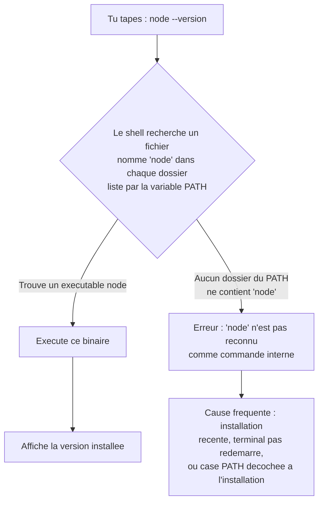
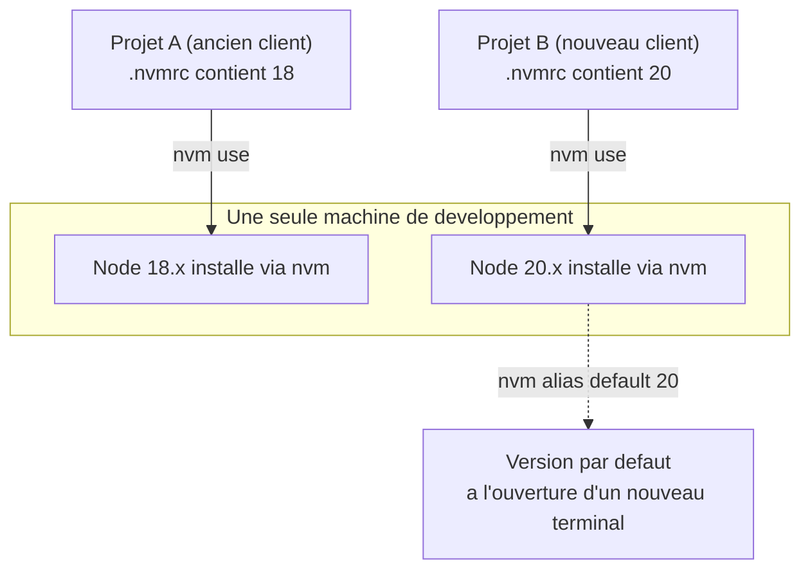

<div class="chapitre-titre-num">CHAPITRE 2</div>

# Installation de Node.js

<div class="encadre objectif">
<span class="encadre-titre">🎯 Objectif du chapitre</span>
Installer Node.js correctement, comprendre la différence entre versions LTS et Current, et savoir gérer plusieurs versions sur une même machine grâce à nvm. À la fin de ce chapitre, tu sauras diagnostiquer toi-même les deux erreurs d'installation les plus fréquentes chez un débutant, et tu comprendras pourquoi verrouiller une version de Node.js par projet n'est pas un détail de confort mais une vraie garantie de fiabilité en équipe.
</div>

<div class="encadre scenario">
<span class="encadre-titre">🎬 Mise en situation</span>
C'est ton premier jour dans une nouvelle mission freelance. Le client te donne accès au dépôt Git d'un projet existant, avec un simple message : "installe tout et lance le serveur, on a une démo demain." Tu clones le projet, tu lances <code>npm install</code>... et la moitié des dépendances refusent de s'installer avec des erreurs cryptiques. Après vérification, le fichier <code>package.json</code> exige Node.js 18, mais ta machine a Node.js 22 installé (le dernier en date, installé "par défaut" quelques semaines plus tôt pour un autre projet). Sans savoir gérer plusieurs versions de Node.js sur une même machine, tu serais bloqué la veille d'une démo client. Ce chapitre t'évite exactement ce piège.
</div>

## 2.1 Versions LTS vs Current

Le site officiel (nodejs.org) propose toujours deux versions au téléchargement :

- **LTS** (*Long Term Support*) : version stable, recommandée pour tout projet professionnel, avec des correctifs de sécurité garantis pendant plusieurs années.
- **Current** : version la plus récente, incluant les toutes dernières fonctionnalités du langage/runtime, mais moins testée en production et avec un cycle de support plus court.

<div class="encadre astuce">
<span class="encadre-titre">💡 Toujours choisir LTS pour un projet professionnel</span>
Sauf besoin très spécifique d'une fonctionnalité expérimentale récente, la version **LTS** est le choix par défaut pour tout projet destiné à la production — c'est la version que ce manuel utilise pour l'ensemble de ses exemples.
</div>

<div class="encadre astuce">
<span class="encadre-titre">💡 Analogie</span>
Choisir Current pour un projet professionnel, c'est comme équiper la voiture d'un client avec un moteur encore en phase d'essai constructeur plutôt qu'un modèle éprouvé : plus impressionnant sur le papier, mais tu prends le risque d'un défaut de jeunesse découvert après la livraison. LTS, c'est le moteur dont les débuts de vie ont déjà été observés par des millions d'utilisateurs avant toi.
</div>

<div class="encadre retenir">
<span class="encadre-titre">📌 À retenir</span>
Chaque version majeure paire de Node.js (18, 20, 22...) devient LTS environ 6 mois après sa sortie et reste supportée (correctifs de sécurité) pendant environ 30 mois au total. Les versions impaires (19, 21, 23...) ne deviennent jamais LTS — à éviter en production.
</div>

## 2.2 Installation directe (site officiel)

```
1. Se rendre sur nodejs.org
2. Télécharger la version LTS correspondant à son système d'exploitation
3. Exécuter l'installateur (inclut automatiquement npm, chapitre 3)
4. Vérifier l'installation :

$ node --version
v20.11.0

$ npm --version
10.2.4
```

<div class="encadre capture">
<span class="encadre-titre">📷 Capture d'écran recommandée</span>
La page d'accueil de nodejs.org, avec les deux boutons de téléchargement bien visibles ("LTS" à gauche, "Current" à droite) — utile pour repérer immédiatement lequel choisir sans se tromper de bouton.
</div>

<div class="encadre capture">
<span class="encadre-titre">📷 Capture d'écran recommandée</span>
L'assistant d'installation Windows (ou macOS) à l'étape où il propose d'ajouter Node.js au PATH système (case cochée par défaut) — l'étape exacte qui, si elle est décochée par erreur, provoque le message "'node' n'est pas reconnu" traité en section Débogage.
</div>

Ce que fait réellement cette installation directe, c'est déposer un exécutable `node` quelque part sur le disque, puis enregistrer ce dossier dans le `PATH` du système — la liste des dossiers où le système d'exploitation cherche automatiquement une commande tapée dans un terminal.



<div class="encadre astuce">
<span class="encadre-titre">💡 Explication du schéma</span>
Ce diagramme illustre pourquoi une simple commande comme `node --version` peut échouer même quand Node.js est bel et bien présent sur le disque : le système ne le trouve que si son dossier d'installation figure dans le `PATH`. C'est exactement le mécanisme derrière l'erreur la plus fréquente de ce chapitre (section Débogage).
</div>

## 2.3 nvm : gérer plusieurs versions de Node.js

<div class="encadre astuce">
<span class="encadre-titre">💡 Pourquoi ne pas se contenter d'une seule installation directe</span>
Sur une carrière de développeur, il est très courant de devoir travailler sur plusieurs projets utilisant des versions différentes de Node.js (un ancien projet figé sur Node 16, un nouveau sur Node 20). **nvm** (*Node Version Manager*) permet d'installer et de basculer entre plusieurs versions **sans jamais avoir à désinstaller/réinstaller** Node.js manuellement.
</div>

```
$ # Installation de nvm (macOS/Linux)
$ curl -o- https://raw.githubusercontent.com/nvm-sh/nvm/v0.39.7/install.sh | bash

$ # Sous Windows, utiliser nvm-windows (coreybutler/nvm-windows) à la place
```

```
$ nvm install 20        # installe la dernière version 20.x
$ nvm install 18        # installe aussi la dernière version 18.x, EN PARALLÈLE
$ nvm use 20            # bascule la version active de Node.js pour la session en cours
$ nvm list              # liste toutes les versions installées localement
$ nvm alias default 20  # définit la version 20 comme version par défaut à l'ouverture d'un terminal
```

```
$ # Dans un projet, on peut fixer la version attendue dans un fichier .nvmrc
$ echo "20.11.0" > .nvmrc
$ nvm use    # lit automatiquement .nvmrc et bascule sur la bonne version
```



<div class="encadre astuce">
<span class="encadre-titre">💡 Explication du schéma</span>
Chaque projet garde sa propre exigence de version dans son `.nvmrc`, indépendamment des autres. nvm ne "désinstalle" jamais une version pour en installer une autre : les deux coexistent sur le disque, et `nvm use` bascule simplement laquelle est active dans le terminal courant — exactement le scénario de la mise en situation d'ouverture.
</div>

<div class="encadre bonne-pratique">
<span class="encadre-titre">✅ Bonne pratique</span>
Committer le fichier `.nvmrc` à la racine de chaque projet, dès sa création. N'importe quel collègue (ou futur toi, six mois plus tard) qui clone le projet et tape `nvm use` retombe instantanément sur la bonne version, sans avoir à demander "c'est quoi la version Node.js de ce projet déjà ?".
</div>

<div class="encadre mauvaise-pratique">
<span class="encadre-titre">❌ Mauvaise pratique</span>
Partir du principe que "la dernière version installée sur ma machine" est forcément celle attendue par le projet sur lequel tu travailles aujourd'hui — exactement l'erreur vécue dans la mise en situation d'ouverture de ce chapitre.
</div>

## 2.4 Vérifier son installation

```
$ node --version
v20.11.0

$ node -e "console.log(process.version)"
v20.11.0

$ node -e "console.log(process.platform, process.arch)"
win32 x64
```

`node -e "code"` exécute une ligne de JavaScript directement, sans créer de fichier — pratique pour des vérifications rapides.

<div class="encadre capture">
<span class="encadre-titre">📷 Capture d'écran recommandée</span>
Un terminal affichant l'enchaînement des trois commandes ci-dessus avec leur sortie réelle — utile comme repère visuel de "à quoi ressemble une installation qui fonctionne".
</div>

## 2.5 Le REPL Node.js

```
$ node
Welcome to Node.js v20.11.0.
Type ".help" for more information.
> 2 + 2
4
> const nom = "Jaslin";
undefined
> `Bonjour ${nom}`
'Bonjour Jaslin'
> .exit
```

Le **REPL** (*Read-Eval-Print Loop*) est une console interactive permettant de tester du JavaScript ligne par ligne, utile pour explorer rapidement une API ou vérifier une syntaxe sans créer de fichier de script.

<div class="encadre astuce">
<span class="encadre-titre">💡 Analogie</span>
Le REPL, c'est le brouillon d'un cahier de laboratoire : tu testes une réaction rapidement, sur un coin de table, avant de l'intégrer proprement au protocole final (ton vrai fichier de code). Personne ne rédige un rapport de laboratoire directement en REPL — mais personne de sérieux ne s'en prive non plus pour vérifier une hypothèse en 5 secondes.
</div>

## Atelier — Installer et gérer deux versions de Node.js avec nvm

<div class="encadre exercice">
<span class="encadre-titre">🛠️ Atelier 2 — Basculer entre deux projets à versions différentes</span>

**Objectif** : reproduire, en conditions contrôlées, exactement la situation de la mise en situation d'ouverture — deux projets fictifs exigeant deux versions différentes de Node.js sur la même machine.

**Préparation** : nvm (ou nvm-windows) installé selon la section 2.3. Un terminal ouvert.

**Étapes détaillées** :
1. Installe deux versions : `nvm install 18` puis `nvm install 20`.
2. Vérifie qu'elles coexistent : `nvm list` doit afficher les deux.
3. Crée deux dossiers vides, `projet-a` et `projet-b`.
4. Dans `projet-a`, exécute `echo "18" > .nvmrc`. Dans `projet-b`, exécute `echo "20" > .nvmrc`.
5. Place-toi dans `projet-a`, exécute `nvm use`, puis `node --version` : doit afficher une version 18.x.
6. Place-toi dans `projet-b`, exécute `nvm use`, puis `node --version` : doit afficher une version 20.x.

**Validation** : la version affichée par `node --version` doit changer automatiquement selon le dossier, sans jamais réinstaller ni désinstaller quoi que ce soit.

**Résultat attendu** : tu viens de reproduire, en 5 minutes, le problème exact de la mise en situation — et sa solution.

**Dépannage** : si `nvm use` sans argument affiche une erreur "N/A" ou ne trouve pas de version, vérifie que le fichier s'appelle bien `.nvmrc` (avec le point initial) et qu'il ne contient qu'un numéro de version, sans caractère superflu.

**Nettoyage** : les dossiers `projet-a`/`projet-b` peuvent être supprimés sans conséquence, ce n'est pas nécessaire de désinstaller les versions Node.js installées (elles resserviront pour la suite du manuel).
</div>

## Erreurs fréquentes

<div class="encadre attention">
<span class="encadre-titre">⚠️ Erreur n°1 — 'node' n'est pas reconnu en tant que commande interne</span>
Si le terminal ne reconnaît pas la commande `node` après installation, la variable d'environnement `PATH` du système ne pointe probablement pas vers le dossier d'installation de Node.js — un redémarrage du terminal (voire de la session) après installation résout souvent ce problème, sinon il faut ajouter manuellement le chemin d'installation au `PATH`.
</div>

<div class="encadre attention">
<span class="encadre-titre">⚠️ Erreur n°2 — Mélanger une installation directe ET nvm sur la même machine</span>
Installer Node.js à la fois via l'installateur officiel **et** via nvm peut créer des conflits de `PATH` (le système ne sachant plus laquelle utiliser). La pratique recommandée : choisir **une seule** méthode de gestion de version dès le départ (nvm est recommandé dès qu'on prévoit de travailler sur plusieurs projets à versions différentes).
</div>

<div class="encadre attention">
<span class="encadre-titre">⚠️ Erreur n°3 — "EACCES: permission denied" à l'installation sur macOS/Linux</span>
Survient quand Node.js a été installé une première fois avec des privilèges administrateur (`sudo`), puis qu'un outil (comme nvm) tente d'écrire dans les mêmes dossiers sans ces privilèges. La solution durable n'est **jamais** de systématiser `sudo npm install -g` (couvert au chapitre 3), mais de faire gérer entièrement l'installation de Node.js par nvm, qui installe toujours dans le dossier personnel de l'utilisateur, sans jamais nécessiter les droits administrateur.
</div>

## Débogage

<div class="encadre attention">
<span class="encadre-titre">🩺 Symptôme : "'node' n'est pas reconnu" juste après l'installation</span>

- **Cause** : le `PATH` du système n'a pas encore été rechargé dans le terminal actuellement ouvert.
- **Diagnostic** : ferme complètement le terminal et rouvre-en un nouveau (pas un nouvel onglet, une nouvelle fenêtre) ; si le problème persiste, vérifie dans les variables d'environnement du système que le dossier d'installation de Node.js est bien listé dans `Path`.
- **Solution** : ajoute manuellement le dossier d'installation (généralement `C:\Program Files\nodejs\` sous Windows) aux variables d'environnement, puis redémarre le terminal.
- **Prévention** : ne jamais décocher l'option "Add to PATH" pendant l'installation (voir la capture recommandée de la section 2.2).
</div>

<div class="encadre attention">
<span class="encadre-titre">🩺 Symptôme : nvm installé mais "nvm: command not found"</span>

- **Cause** : le script d'installation de nvm modifie le fichier de configuration du shell (`.bashrc`, `.zshrc`), mais ce fichier n'a pas encore été rechargé.
- **Diagnostic** : exécute `source ~/.bashrc` (ou `~/.zshrc` selon le shell) et retente la commande.
- **Solution** : si le problème persiste après un redémarrage complet du terminal, vérifie que le script d'installation de nvm n'a pas échoué silencieusement (relire sa sortie complète).
</div>

## En entreprise

- **Verrouillage de version en CI/CD** : la quasi-totalité des pipelines d'intégration continue (GitHub Actions, GitLab CI) lisent directement le fichier `.nvmrc` ou le champ `engines` de `package.json` (chapitre 4) pour installer exactement la bonne version de Node.js avant de lancer les tests — évitant qu'un test passe "chez moi" et échoue en CI, ou l'inverse.
- **Images Docker versionnées** : en production (chapitre 37), l'image de base Docker (`node:20-alpine`, par exemple) fixe la version de Node.js de façon encore plus stricte qu'un `.nvmrc`, garantissant un environnement d'exécution identique du poste du développeur jusqu'au serveur.
- **Erreur classique observée** : une équipe qui met à jour Node.js sur les machines de développement "au fil de l'eau", sans jamais synchroniser cette mise à jour avec le `.nvmrc` du projet ni l'image Docker de production — provoquant des bugs qui n'apparaissent qu'en production, invisibles en développement.

## Entretien technique

<div class="encadre exercice">
<span class="encadre-titre">💼 Questions fréquemment posées en entretien</span>

**Q1. "Pourquoi une entreprise choisirait-elle LTS plutôt que la dernière version disponible ?"**
Réponse attendue : la stabilité et la durée de support garantie priment sur l'accès aux toutes dernières fonctionnalités pour un projet en production — le risque d'un bug de jeunesse non détecté sur une version Current est jugé disproportionné par rapport au gain.

**Q2. "À quoi sert un fichier .nvmrc ?"**
Réponse attendue : il fixe, dans le dépôt du projet lui-même, la version de Node.js attendue, permettant à `nvm use` (sans argument) de basculer automatiquement dessus — utile en équipe et en CI/CD pour garantir un environnement homogène.

**Q3. "Quelle est la différence entre installer Node.js via l'installateur officiel et via nvm ?"**
Réponse attendue : l'installateur officiel installe une seule version globale du système ; nvm permet d'installer plusieurs versions en parallèle et de basculer entre elles par projet, sans droits administrateur.
</div>

## Optimisation, sécurité et maintenabilité

<div class="encadre securite">
<span class="encadre-titre">🔒 Sécurité</span>
Une version de Node.js qui n'est plus LTS (par exemple, une version dont le support s'est terminé) ne reçoit plus de correctifs de sécurité, même pour des failles critiques découvertes après coup. Garder un projet sur une version obsolète par simple inertie est un risque de sécurité concret, pas seulement un manque de modernité.
</div>

<div class="encadre bonne-pratique">
<span class="encadre-titre">✅ Maintenabilité</span>
Documenter dans le `README.md` du projet la commande exacte pour installer le bon environnement (`nvm install && nvm use`), pour qu'un nouveau développeur n'ait jamais à deviner quoi que ce soit avant de pouvoir lancer le projet.
</div>

## Résumé du chapitre

- Toujours privilégier la version **LTS** pour un projet professionnel.
- **nvm** permet d'installer et de basculer entre plusieurs versions de Node.js sans conflit, avec un fichier `.nvmrc` pour fixer la version attendue par projet.
- Le **REPL** (`node` sans argument) permet de tester rapidement du JavaScript en ligne de commande.
- Une commande introuvable après installation est presque toujours un problème de `PATH` non rechargé, pas une installation ratée.

## Quiz

<div class="encadre exercice">
<span class="encadre-titre">📝 QCM</span>

1. Quelle version de Node.js faut-il choisir pour un projet en production ?
   - a) Toujours la version Current, la plus récente
   - b) La version LTS
   - c) Peu importe, elles sont strictement identiques
   - d) La plus ancienne version disponible

2. Que permet nvm ?
   - a) D'installer npm séparément de Node.js
   - b) De gérer plusieurs versions de Node.js sur la même machine
   - c) De compiler du TypeScript
   - d) De déployer une application sur un serveur

3. À quoi sert un fichier `.nvmrc` ?
   - a) À lister les dépendances du projet
   - b) À fixer la version de Node.js attendue par le projet
   - c) À configurer le pare-feu du serveur
   - d) À stocker les variables d'environnement secrètes

**Corrigé** : 1-b, 2-b, 3-b.
</div>

<div class="encadre exercice">
<span class="encadre-titre">📝 Vrai ou Faux</span>

1. Les versions impaires de Node.js (19, 21, 23...) deviennent LTS après quelques mois. — **Faux** (seules les versions paires deviennent LTS).
2. nvm nécessite les droits administrateur pour installer une version de Node.js. — **Faux** (c'est justement l'un de ses avantages sur macOS/Linux).
3. Installer Node.js à la fois via l'installateur officiel et via nvm est sans risque. — **Faux** (conflits de `PATH` possibles, voir Erreur n°2).
</div>

<div class="encadre exercice">
<span class="encadre-titre">📝 Question ouverte</span>

Un collègue te dit : "Chez moi ça marche, `npm install` plante seulement sur ton poste." Quelles sont les deux premières choses que tu vérifies, à la lumière de ce chapitre ?

**Corrigé** : 1) la version de Node.js active sur chaque poste (`node --version`), en comparant au `.nvmrc`/`engines` du projet — une divergence de version explique une large part des comportements "ça marche chez moi, pas chez toi" ; 2) si un `.nvmrc` existe dans le projet et si chacun a bien exécuté `nvm use` avant de lancer `npm install`.
</div>

## Exercices

<div class="encadre exercice">
<span class="encadre-titre">📝 Exercice 2.1</span>

Installe nvm, puis installe et bascule entre deux versions différentes de Node.js (par exemple 18 et 20). Crée un fichier `.nvmrc` fixant la version 20, puis vérifie que `nvm use` (sans argument) bascule automatiquement dessus.
</div>

**Corrigé (démarche attendue) :** `nvm install 18`, `nvm install 20`, `nvm use 18` puis `node --version` doit afficher une version 18.x ; `nvm use 20` puis vérifier la version 20.x. Créer `.nvmrc` avec le contenu `20`, puis `nvm use` (sans préciser de version) doit lire ce fichier et basculer automatiquement sur Node 20.

<div class="encadre exercice">
<span class="encadre-titre">📝 Exercice 2.2</span>

Ouvre le REPL Node.js (`node` sans argument) et, sans créer aucun fichier, calcule combien de secondes se sont écoulées depuis le 1er janvier 2000 jusqu'à aujourd'hui (indice : `Date.now()` renvoie des millisecondes depuis 1970).
</div>

**Corrigé (exemple) :**
```
> const debut = new Date("2000-01-01").getTime();
> const maintenant = Date.now();
> Math.floor((maintenant - debut) / 1000)
```

## Checklist de fin de chapitre

<ul class="checklist">
<li>☐ J'ai installé Node.js (version LTS) et vérifié avec <code>node --version</code>.</li>
<li>☐ Je comprends la différence entre LTS et Current.</li>
<li>☐ J'ai installé nvm et je sais basculer entre deux versions.</li>
<li>☐ Je sais créer un fichier <code>.nvmrc</code> et l'utiliser avec <code>nvm use</code>.</li>
<li>☐ Je sais diagnostiquer une erreur "'node' n'est pas reconnu".</li>
<li>☐ J'ai testé le REPL Node.js.</li>
</ul>

## FAQ

<dl class="faq">
<dt>Dois-je désinstaller une ancienne version de Node.js avant d'en installer une nouvelle ?</dt>
<dd>Non, surtout si tu utilises nvm : plusieurs versions coexistent sans conflit sur la même machine. Une installation directe (sans nvm) peut en revanche être simplement mise à jour par un nouvel installateur.</dd>

<dt>nvm fonctionne-t-il de la même façon sous Windows ?</dt>
<dd>Le principe est identique, mais l'outil change : nvm (nvm-sh) est pour macOS/Linux, nvm-windows (coreybutler/nvm-windows) est son équivalent pour Windows, avec une syntaxe de commandes très proche.</dd>

<dt>Que se passe-t-il si mon projet n'a pas de fichier .nvmrc ?</dt>
<dd>`nvm use` (sans argument) ne saura pas quelle version choisir automatiquement. Il faudra soit préciser explicitement une version (`nvm use 20`), soit ajouter un `.nvmrc` toi-même une fois que tu sais quelle version le projet attend (souvent indiquée dans son `README.md` ou son `package.json`).</dd>
</dl>

## Références et pour aller plus loin

- Téléchargement officiel Node.js : [https://nodejs.org](https://nodejs.org)
- Calendrier de support des versions Node.js : [https://nodejs.org/en/about/previous-releases](https://nodejs.org/en/about/previous-releases)
- nvm (macOS/Linux) : [https://github.com/nvm-sh/nvm](https://github.com/nvm-sh/nvm)
- nvm-windows : [https://github.com/coreybutler/nvm-windows](https://github.com/coreybutler/nvm-windows)

*Chapitre suivant : npm et npx, les outils de gestion de paquets fournis avec Node.js.*
