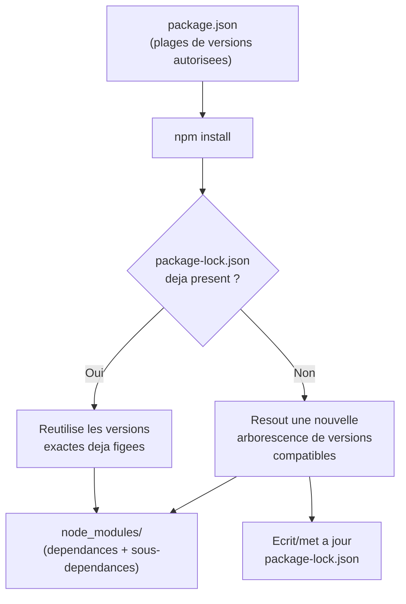
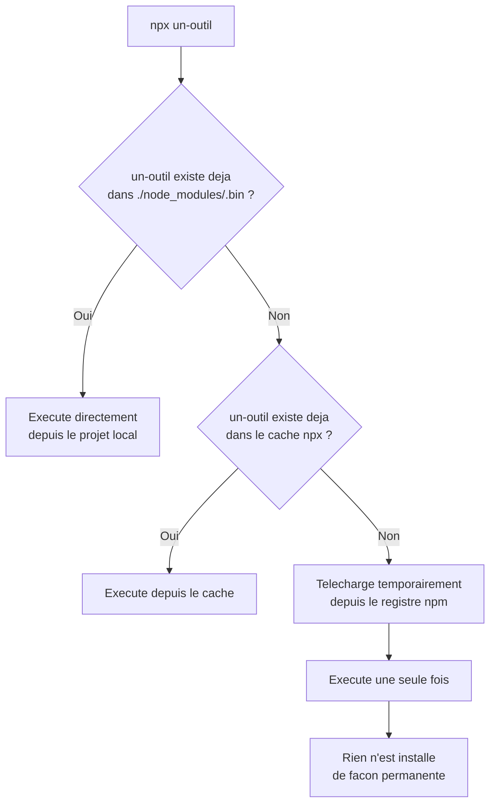

<div class="chapitre-titre-num">CHAPITRE 3</div>

# npm et npx

<div class="encadre objectif">
<span class="encadre-titre">🎯 Objectif du chapitre</span>
Maîtriser npm pour installer, gérer et exécuter des scripts de paquets, et comprendre la différence fondamentale entre `npm` et `npx`. À la fin de ce chapitre, tu sauras expliquer pourquoi `package-lock.json` doit toujours être commité, choisir correctement entre `dependencies` et `devDependencies`, et utiliser `npx` pour exécuter un outil sans polluer ton système d'installations globales.
</div>

<div class="encadre scenario">
<span class="encadre-titre">🎬 Mise en situation</span>
Tu reprends un projet existant pour un client. En clonant le dépôt, tu remarques que `node_modules/` fait partie des fichiers versionnés dans Git — le clone met plusieurs minutes et pèse 400 Mo. Pire : quand tu lances `npm install` toi-même, une dépendance s'installe dans une version légèrement différente de celle utilisée par le développeur précédent, et un bug apparaît... qui n'existait pas chez lui. Ton client te demande d'expliquer pourquoi "la même base de code" se comporte différemment selon qui l'installe. Ce chapitre te donne exactement les deux réponses attendues : ce que `node_modules/` ne doit jamais faire dans un dépôt Git, et pourquoi `package-lock.json` existe précisément pour éviter ce genre de dérive.
</div>

## 3.1 Qu'est-ce que npm

**npm** (*Node Package Manager*) est à la fois : (1) un **registre en ligne** hébergeant plus d'un million de paquets JavaScript open source, et (2) l'**outil en ligne de commande** installé automatiquement avec Node.js, permettant d'installer, mettre à jour et gérer ces paquets dans un projet.

<div class="encadre astuce">
<span class="encadre-titre">💡 Analogie</span>
npm, c'est à la fois la bibliothèque municipale (le registre, avec plus d'un million d'ouvrages disponibles) et le bibliothécaire qui va chercher le bon livre à ta place, vérifie qu'il est compatible avec ce que tu as déjà emprunté, et tient un registre exact de tes emprunts (`package-lock.json`) pour que n'importe qui puisse reproduire exactement la même pile de livres sur son propre bureau.
</div>

## 3.2 Initialiser un projet

```
$ mkdir mon-api && cd mon-api
$ npm init -y

Wrote to /home/jaslin/mon-api/package.json:
{
  "name": "mon-api",
  "version": "1.0.0",
  "main": "index.js",
  "scripts": {
    "test": "echo \"Error: no test specified\" && exit 1"
  }
}
```

`npm init -y` accepte toutes les valeurs par défaut sans poser de questions ; `npm init` (sans `-y`) pose une série de questions interactives (nom, version, description, auteur...).

<div class="encadre capture">
<span class="encadre-titre">📷 Capture d'écran recommandée</span>
Un terminal montrant l'enchaînement `npm init` (sans `-y`), avec les questions interactives posées une à une (nom, version, description, point d'entrée, commande de test, dépôt Git, mots-clés, auteur, licence) et le résumé JSON final avant confirmation.
</div>

## 3.3 Installer des dépendances

```
$ npm install express          # ajoute express aux dependencies (nécessaire en production)
$ npm install --save-dev jest   # ajoute jest aux devDependencies (nécessaire seulement en développement)
$ npm install express@4.18.2   # installe une version PRÉCISE
$ npm install -g nodemon        # installation GLOBALE (disponible dans tout le système, pas juste ce projet)
```

<div class="encadre astuce">
<span class="encadre-titre">💡 dependencies vs devDependencies</span>
`dependencies` : paquets nécessaires pour que l'application **fonctionne réellement en production** (Express, un client de base de données...). `devDependencies` : paquets utiles **seulement pendant le développement** (Jest pour les tests, nodemon pour le rechargement automatique, ESLint pour le linting) — jamais installés en production (`npm install --production` ou `NODE_ENV=production npm install` les ignore).
</div>

Ce qui se passe réellement lors d'un `npm install` va plus loin qu'une simple copie de fichiers : npm lit `package.json`, résout des plages de versions compatibles pour chaque dépendance **et leurs propres sous-dépendances**, construit un arbre complet, puis l'écrit noir sur blanc dans `package-lock.json`.



<div class="encadre astuce">
<span class="encadre-titre">💡 Explication du schéma</span>
C'est précisément cette étape de résolution (E) qui peut produire un arbre de dépendances légèrement différent d'une machine à l'autre si `package-lock.json` n'existe pas encore ou n'est pas respecté — la cause exacte du problème vécu dans la mise en situation d'ouverture.
</div>

## 3.4 Le fichier package.json

```json
{
  "name": "mon-api",
  "version": "1.0.0",
  "description": "API de gestion",
  "main": "src/index.js",
  "scripts": {
    "start": "node src/index.js",
    "dev": "nodemon src/index.js",
    "test": "jest"
  },
  "dependencies": {
    "express": "^4.18.2",
    "dotenv": "^16.4.5"
  },
  "devDependencies": {
    "jest": "^29.7.0",
    "nodemon": "^3.1.0"
  }
}
```

`package.json` est la **carte d'identité** du projet : nom, version, scripts exécutables, et surtout la liste exacte des dépendances nécessaires pour que quiconque (un collègue, un serveur de production) puisse recréer un environnement identique via `npm install`.

<div class="encadre retenir">
<span class="encadre-titre">📌 À retenir</span>
`package.json` décrit des <strong>intentions</strong> (des plages de versions acceptables) ; `package-lock.json` décrit une <strong>réalité figée</strong> (les versions exactes réellement installées la dernière fois). Les deux fichiers ont des rôles distincts et complémentaires, jamais interchangeables.
</div>

## 3.5 Comprendre le versionnage sémantique (semver)

```
"express": "^4.18.2"
```

Une version semver s'écrit `MAJEUR.MINEUR.CORRECTIF` :

| Partie | Signification | Exemple de changement |
|---|---|---|
| MAJEUR | Changement cassant (breaking change), API incompatible avec la version précédente | `4.x.x` → `5.0.0` |
| MINEUR | Nouvelle fonctionnalité, rétrocompatible | `4.18.x` → `4.19.0` |
| CORRECTIF | Correction de bug, rétrocompatible | `4.18.2` → `4.18.3` |

| Préfixe | Signification |
|---|---|
| `^4.18.2` | Accepte toute mise à jour MINEURE ou CORRECTIF (`4.x.x`, mais jamais `5.0.0`) — le préfixe **par défaut** de npm |
| `~4.18.2` | Accepte seulement les mises à jour de CORRECTIF (`4.18.x`) |
| `4.18.2` (sans préfixe) | Version EXACTE, aucune mise à jour automatique autorisée |

<div class="encadre mauvaise-pratique">
<span class="encadre-titre">❌ Mauvaise pratique</span>
Considérer semver comme une garantie absolue plutôt qu'une convention. Rien n'empêche techniquement un mainteneur de paquet de publier, par erreur, un changement cassant dans une version MINEURE ou CORRECTIF — semver réduit le risque, il ne l'élimine pas. C'est une raison de plus pour laquelle `package-lock.json` (section suivante) reste indispensable, même en respectant scrupuleusement semver.
</div>

## 3.6 package-lock.json : figer les versions exactes

<div class="encadre attention">
<span class="encadre-titre">⚠️ Sans package-lock.json, deux installations du même projet peuvent différer</span>
`package.json` autorise une **plage** de versions (`^4.18.2`). Sans verrouillage, deux `npm install` exécutés à des moments différents pourraient installer des versions mineures différentes (l'une avec `4.18.2`, l'autre avec `4.19.0` sortie entre-temps) — un risque réel d'incohérence entre l'environnement d'un développeur et celui de production. **`package-lock.json`** fige les versions **exactes** de chaque dépendance (et sous-dépendance) installée, garantissant une reproduction identique de l'arbre de dépendances à chaque `npm install` ultérieur. Ce fichier doit **toujours** être commité dans le dépôt Git, jamais ignoré.
</div>

<div class="encadre bonne-pratique">
<span class="encadre-titre">✅ Bonne pratique</span>
Toujours committer `package-lock.json`, y compris pour un projet personnel en solo — l'habitude prise dès le premier projet évite l'oubli sur un projet d'équipe où les conséquences sont bien plus coûteuses.
</div>

<div class="encadre mauvaise-pratique">
<span class="encadre-titre">❌ Mauvaise pratique</span>
Committer `node_modules/` dans Git "pour être sûr que ça marche partout" — exactement le piège de la mise en situation d'ouverture. Cela alourdit le dépôt de centaines de mégaoctets pour un problème que `package-lock.json` (quelques centaines de kilo-octets) résout déjà, proprement.
</div>

## 3.7 npm ci : installation reproductible (production/CI)

```
$ npm ci
```

<div class="encadre astuce">
<span class="encadre-titre">💡 npm ci vs npm install</span>
`npm ci` (*clean install*) supprime d'abord `node_modules/` puis installe **exactement** les versions figées dans `package-lock.json`, sans jamais le modifier ni tenter de résoudre de nouvelles versions — plus rapide et strictement reproductible, c'est la commande à utiliser en environnement de production ou d'intégration continue (chapitre 39), jamais `npm install` (qui peut légèrement faire évoluer `package-lock.json`).
</div>

<div class="encadre performance">
<span class="encadre-titre">🚀 Performance</span>
`npm ci` est généralement plus rapide que `npm install` sur un environnement propre (CI, conteneur Docker) : il saute entièrement l'étape de résolution de versions (déjà figée dans `package-lock.json`) et installe directement l'arbre exact.
</div>

## 3.8 npx : exécuter un paquet sans l'installer globalement

```
$ npx create-react-app mon-projet
$ npx prisma init
$ npx jest --version
```

**npx** exécute un paquet **sans l'installer de façon permanente** sur le système : s'il n'est pas déjà présent localement, npx le télécharge temporairement, l'exécute, puis ne le conserve pas de façon globale — idéal pour des outils utilisés ponctuellement (générateurs de projet, CLI d'outils comme Prisma) sans polluer le système d'installations globales.



<div class="encadre astuce">
<span class="encadre-titre">💡 npx utilise en priorité les paquets déjà installés localement</span>
Si un paquet (comme `jest`) est déjà présent dans `node_modules/.bin` du projet courant (installé via `--save-dev`), `npx jest` l'exécute directement depuis là, sans aucun téléchargement — c'est en réalité l'usage le plus fréquent de npx au quotidien : exécuter les outils de développement du projet sans avoir à écrire le chemin complet `./node_modules/.bin/jest`.
</div>

<div class="encadre securite">
<span class="encadre-titre">🔒 Sécurité</span>
`npx un-paquet-inconnu` exécute du code arbitraire téléchargé depuis le registre npm, potentiellement sans jamais l'avoir audité au préalable. Ne jamais exécuter via `npx` un paquet dont le nom t'est inconnu ou suspect (fautes de frappe volontaires imitant un paquet populaire — le "typosquatting" — sont une attaque réelle et documentée sur le registre npm).
</div>

## 3.9 Scripts npm personnalisés

```json
"scripts": {
  "start": "node src/index.js",
  "dev": "nodemon src/index.js",
  "test": "jest",
  "test:watch": "jest --watch",
  "lint": "eslint src/"
}
```

```
$ npm run dev
$ npm test          # raccourci spécial pour "npm run test"
$ npm start          # raccourci spécial pour "npm run start"
$ npm run test:watch # les autres scripts nécessitent "run"
```

## Atelier — Reproduire (et corriger) le problème de la mise en situation

<div class="encadre exercice">
<span class="encadre-titre">🛠️ Atelier 3 — package-lock.json en action</span>

**Objectif** : observer concrètement ce que `package-lock.json` fige, et ce qui se passerait sans lui.

**Préparation** : Node.js et npm installés (chapitre 2).

**Étapes détaillées** :
1. Crée un projet vide : `mkdir atelier-npm && cd atelier-npm && npm init -y`.
2. Installe une dépendance avec une plage large : `npm install express`.
3. Ouvre `package.json` : observe le préfixe `^` devant la version d'Express.
4. Ouvre `package-lock.json` : cherche l'entrée `"express"` et note sa version **exacte**, sans aucun préfixe.
5. Supprime `node_modules/` (`rm -rf node_modules` ou l'équivalent Windows) puis relance `npm ci`.
6. Vérifie que la version installée dans `node_modules/express/package.json` correspond **exactement** à celle figée dans `package-lock.json`.

**Validation** : la version d'Express après `npm ci` doit être identique, au numéro de correctif près, à celle notée à l'étape 4 — même si une nouvelle version mineure d'Express est sortie entre-temps sur le registre npm.

**Résultat attendu** : la preuve concrète que `package-lock.json`, pas `package.json`, est ce qui garantit réellement la reproductibilité.

**Dépannage** : si `npm ci` échoue avec une erreur mentionnant une incohérence entre `package.json` et `package-lock.json`, c'est que l'un des deux a été modifié manuellement sans régénérer l'autre — relance `npm install` une fois pour resynchroniser, puis recommence.

**Nettoyage** : le dossier `atelier-npm` peut être supprimé sans conséquence après l'atelier.
</div>

## Erreurs fréquentes

<div class="encadre attention">
<span class="encadre-titre">⚠️ Erreur n°1 — Commiter node_modules/ dans Git</span>
`node_modules/` peut peser plusieurs centaines de Mo et se régénère entièrement via `npm install`/`npm ci` à partir de `package.json`/`package-lock.json`. Il doit **toujours** figurer dans `.gitignore`, jamais être commité.
</div>

<div class="encadre attention">
<span class="encadre-titre">⚠️ Erreur n°2 — Installer une dépendance de développement en dependencies (ou l'inverse)</span>
Installer `jest` sans `--save-dev` le place dans `dependencies`, ce qui l'installera **inutilement en production** (`npm install --production` l'inclurait alors qu'il ne sert jamais en dehors des tests) — toujours vérifier la bonne catégorie au moment de l'installation.
</div>

<div class="encadre attention">
<span class="encadre-titre">⚠️ Erreur n°3 — Modifier package-lock.json à la main</span>
Ce fichier est généré et maintenu automatiquement par npm. Le modifier manuellement (ou le fusionner à la main après un conflit Git mal résolu) casse fréquemment sa cohérence interne — en cas de conflit Git sur ce fichier, la solution la plus sûre est de le supprimer et de relancer `npm install` pour le régénérer proprement.
</div>

## Débogage

<div class="encadre attention">
<span class="encadre-titre">🩺 Symptôme : "npm ERR! peer dep missing" ou conflit de peer dependencies</span>

- **Cause** : un paquet installé déclare avoir besoin d'un autre paquet (une "peer dependency", par exemple un plugin qui exige une version précise de React) qui n'est pas présent ou dans une version incompatible.
- **Diagnostic** : lire attentivement le message d'erreur complet, qui indique généralement quel paquet exige quelle version.
- **Solution** : installer explicitement la peer dependency dans la version attendue, ou vérifier s'il existe une version plus récente du paquet plugin compatible avec ta version actuelle.
</div>

<div class="encadre attention">
<span class="encadre-titre">🩺 Symptôme : npm install très lent ou semble bloqué</span>

- **Cause probable** : cache npm corrompu, connexion réseau lente, ou registre npm temporairement indisponible.
- **Diagnostic** : `npm config get registry` pour vérifier le registre utilisé ; `npm cache verify` pour vérifier l'intégrité du cache local.
- **Solution** : `npm cache clean --force` (à utiliser en dernier recours, force un nouveau téléchargement complet) puis relancer l'installation.
</div>

## En entreprise

- **`npm ci` systématique en CI/CD** : la quasi-totalité des pipelines professionnels utilisent `npm ci`, jamais `npm install`, précisément pour garantir qu'aucune dérive de version ne s'introduise silencieusement entre deux exécutions.
- **Audit de sécurité des dépendances** : `npm audit` (approfondi au chapitre 4) fait partie du contrôle qualité standard avant toute mise en production dans la plupart des équipes sérieuses.
- **Erreur classique observée** : une équipe qui ignore les avertissements `npm audit` pendant des mois, accumulant des dizaines de vulnérabilités connues, jusqu'à ce qu'une mise à jour corrective de sécurité devienne un chantier majeur plutôt qu'une routine.

## Entretien technique

<div class="encadre exercice">
<span class="encadre-titre">💼 Questions fréquemment posées en entretien</span>

**Q1. "Quelle est la différence entre npm install et npm ci ?"**
Réponse attendue : `npm install` peut résoudre de nouvelles versions compatibles et met à jour `package-lock.json` si nécessaire ; `npm ci` installe strictement les versions déjà figées dans `package-lock.json`, sans jamais le modifier, et supprime d'abord `node_modules/` — plus rapide et strictement reproductible, à utiliser en CI/production.

**Q2. "Pourquoi commit package-lock.json mais pas node_modules/ ?"**
Réponse attendue : `package-lock.json` est une petite description texte de l'arbre exact de versions, suffisante pour reconstruire `node_modules/` à l'identique via `npm ci` ; `node_modules/` est le résultat volumineux et entièrement régénérable de cette reconstruction, qui n'a aucune valeur à être versionné.

**Q3. "Que fait npx que npm ne fait pas ?"**
Réponse attendue : `npx` exécute un paquet exécutable (souvent une CLI) sans nécessiter une installation globale permanente sur le système, en téléchargeant temporairement le paquet s'il n'est pas déjà disponible localement.
</div>

## Optimisation, sécurité et maintenabilité

<div class="encadre securite">
<span class="encadre-titre">🔒 Sécurité</span>
`npm audit` (chapitre 4) doit faire partie de la routine régulière d'un projet, pas d'une vérification ponctuelle une fois par an.
</div>

<div class="encadre bonne-pratique">
<span class="encadre-titre">✅ Maintenabilité</span>
Documenter dans le `README.md` les scripts npm principaux du projet (`npm run dev`, `npm test`...) — un nouveau développeur ne devrait jamais avoir à ouvrir `package.json` pour découvrir comment lancer le projet.
</div>

## Résumé du chapitre

- npm gère les dépendances via `package.json` (versions autorisées) et `package-lock.json` (versions exactes figées, toujours commité).
- `dependencies` (nécessaires en production) vs `devDependencies` (développement/tests uniquement).
- `npm ci` (installation stricte et reproductible) doit remplacer `npm install` en production/CI.
- `npx` exécute un paquet sans installation globale permanente, en priorité depuis les paquets déjà locaux au projet.

## Quiz

<div class="encadre exercice">
<span class="encadre-titre">📝 QCM</span>

1. Que fige exactement `package-lock.json` ?
   - a) Uniquement le nom des dépendances
   - b) Les versions exactes de toutes les dépendances et sous-dépendances installées
   - c) Les variables d'environnement du projet
   - d) La version de Node.js utilisée

2. Quelle commande utiliser en CI/production pour une installation strictement reproductible ?
   - a) `npm install`
   - b) `npm update`
   - c) `npm ci`
   - d) `npm init`

3. Que fait `npx jest --version` si jest est déjà dans `devDependencies` du projet ?
   - a) Il télécharge une nouvelle copie de jest à chaque fois
   - b) Il exécute directement la copie locale déjà installée
   - c) Il échoue car npx ne fonctionne pas avec devDependencies
   - d) Il installe jest globalement

**Corrigé** : 1-b, 2-c, 3-b.
</div>

<div class="encadre exercice">
<span class="encadre-titre">📝 Vrai ou Faux</span>

1. `node_modules/` doit toujours être commité dans Git pour garantir que le projet fonctionne partout. — **Faux** (l'exact opposé : il doit toujours être ignoré, `package-lock.json` suffit).
2. Le préfixe `^` autorise les mises à jour majeures. — **Faux** (seulement mineures et correctifs).
3. `npm ci` peut modifier `package-lock.json`. — **Faux** (il installe strictement ce qui y est déjà figé).
</div>

<div class="encadre exercice">
<span class="encadre-titre">📝 Question ouverte</span>

Un collègue propose de supprimer `package-lock.json` du dépôt Git "pour alléger le projet". Que lui réponds-tu ?

**Corrigé** : s'y opposer clairement — ce fichier est justement ce qui garantit qu'une installation ultérieure du projet (par un collègue, un serveur de production, un pipeline CI) reproduit exactement le même arbre de dépendances que celui testé et validé. Sa taille est minime comparée au risque qu'il évite (le scénario exact de la mise en situation d'ouverture de ce chapitre).
</div>

## Exercices

<div class="encadre exercice">
<span class="encadre-titre">📝 Exercice 3.1</span>

Initialise un nouveau projet npm, installe `express` en dépendance de production et `nodemon` en dépendance de développement, puis ajoute un script `dev` qui lance `nodemon` sur un fichier `src/index.js`.
</div>

**Corrigé :**
```
$ npm init -y
$ npm install express
$ npm install --save-dev nodemon
```
```json
"scripts": {
  "dev": "nodemon src/index.js"
}
```

<div class="encadre exercice">
<span class="encadre-titre">📝 Exercice 3.2</span>

Sans exécuter `npm install -g` pour quoi que ce soit, utilise `npx` pour vérifier la version de `cowsay` (un petit paquet de démonstration qui affiche du texte dans une bulle ASCII tenue par une vache) installée sur le registre npm, sans jamais l'installer de façon permanente sur ta machine.
</div>

**Corrigé :**
```
$ npx cowsay "Bonjour Node.js"
```
Aucune installation globale persistante n'est créée ; `cowsay` est téléchargé temporairement, exécuté une fois, puis mis en cache pour un usage futur éventuel.

## Checklist de fin de chapitre

<ul class="checklist">
<li>☐ Je sais initialiser un projet avec <code>npm init</code>.</li>
<li>☐ Je comprends la différence entre <code>dependencies</code> et <code>devDependencies</code>.</li>
<li>☐ Je sais lire une version semver et ses préfixes (<code>^</code>, <code>~</code>).</li>
<li>☐ Je comprends pourquoi <code>package-lock.json</code> doit toujours être commité.</li>
<li>☐ Je sais utiliser <code>npm ci</code> à la place de <code>npm install</code> en CI/production.</li>
<li>☐ Je comprends la différence entre <code>npm</code> et <code>npx</code>.</li>
</ul>

## FAQ

<dl class="faq">
<dt>Dois-je toujours utiliser npm, ou existe-t-il des alternatives ?</dt>
<dd>Oui, yarn et pnpm sont des alternatives populaires résolvant le même problème avec des optimisations différentes (pnpm, par exemple, économise de l'espace disque en partageant les paquets entre projets). Ce manuel utilise npm, l'outil fourni par défaut avec Node.js et le plus universellement compris.</dd>

<dt>Que faire si npm install échoue avec une erreur de permission ?</dt>
<dd>Sur macOS/Linux, évite `sudo npm install` (couvert comme mauvaise pratique au chapitre 2) : le problème vient presque toujours d'une installation de Node.js mal configurée (souvent réglé en utilisant nvm, qui installe toujours dans le dossier personnel de l'utilisateur).</dd>

<dt>Puis-je avoir plusieurs versions du même paquet dans un projet ?</dt>
<dd>Oui, npm gère cela automatiquement via des sous-dossiers imbriqués dans `node_modules/` quand deux dépendances exigent des versions incompatibles d'un même paquet tiers — invisible au quotidien, géré entièrement par la résolution de npm.</dd>
</dl>

## Références et pour aller plus loin

- Documentation officielle npm : [https://docs.npmjs.com](https://docs.npmjs.com)
- Spécification semver : [https://semver.org](https://semver.org)
- Documentation npx : [https://docs.npmjs.com/cli/v10/commands/npx](https://docs.npmjs.com/cli/v10/commands/npx)

*Chapitre suivant : approfondir la gestion des packages (organisation des dépendances, audit de sécurité, mises à jour).*
