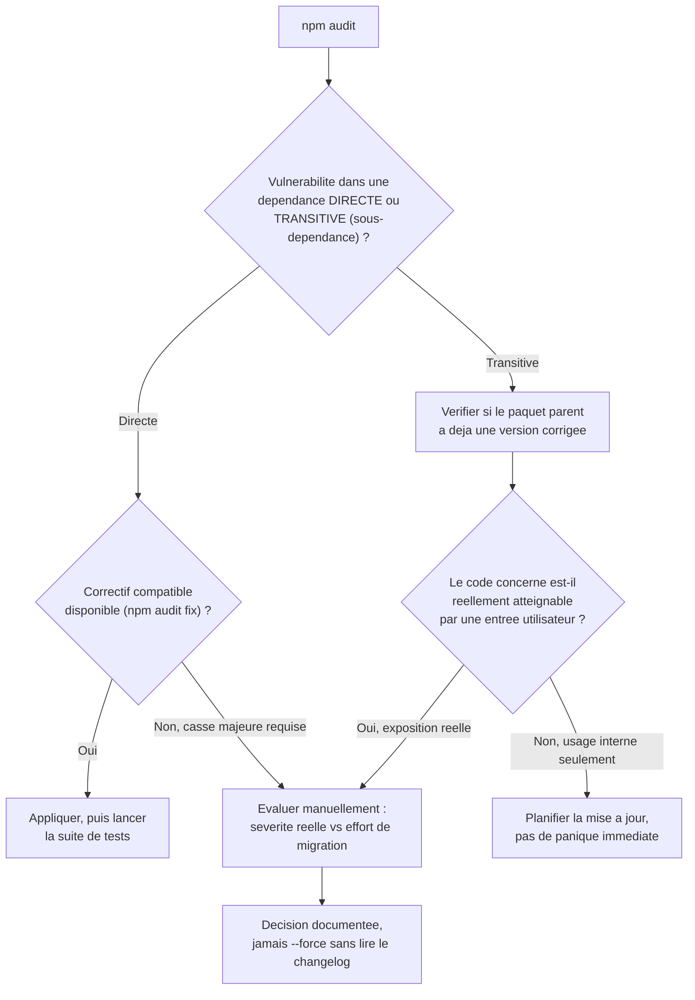
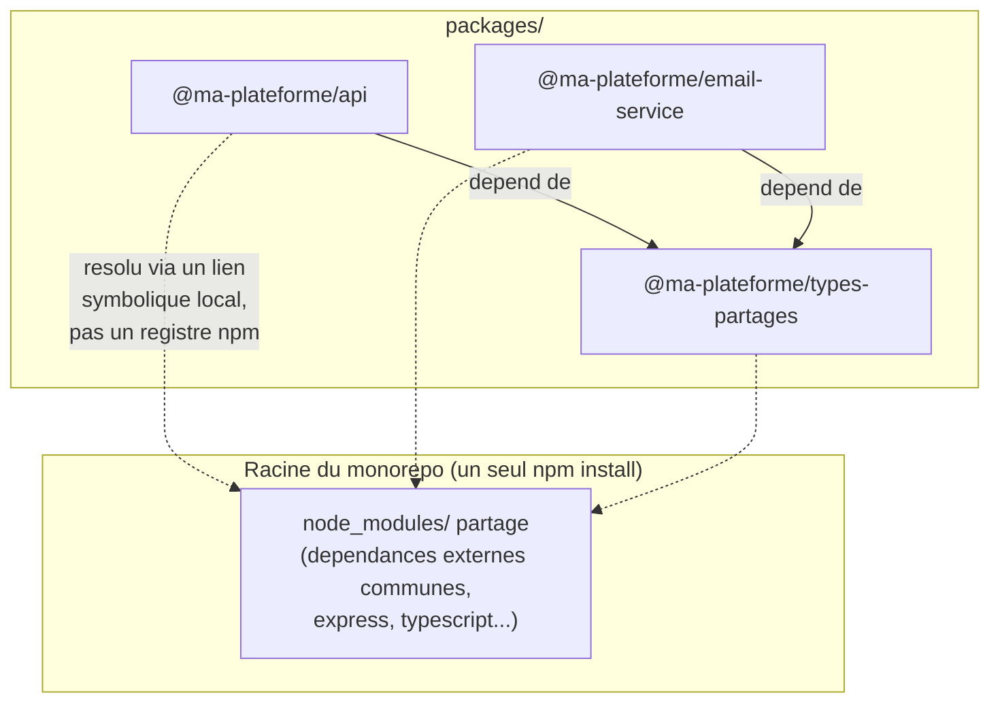

<div class="chapitre-titre-num">CHAPITRE 4</div>

# Gestion des packages

<div class="encadre objectif">
<span class="encadre-titre">🎯 Objectif du chapitre</span>
Approfondir la gestion des dépendances au-delà de l'installation de base : audit de sécurité, mise à jour maîtrisée, dépendances peer et optionnelles, et organisation de plusieurs paquets liés dans un monorepo via npm workspaces. À la fin de ce chapitre, tu sauras réagir correctement face à un rapport `npm audit`, distinguer les trois colonnes de `npm outdated`, et structurer un projet composé de plusieurs paquets internes sans dupliquer leurs dépendances communes.
</div>

<div class="encadre scenario">
<span class="encadre-titre">🎬 Mise en situation</span>
Ton client te demande une "revue de sécurité rapide" avant la mise en production de son API. Tu exécutes `npm audit` par réflexe et tu obtiens un mur de texte : 14 vulnérabilités, certaines "high", d'autres "low", certaines avec un correctif automatique, d'autres qui exigeraient de faire monter une dépendance de version majeure. Le client te demande : "c'est grave ? on peut lancer en prod ?" Répondre "je lance `npm audit fix --force` et on verra" serait irresponsable — tu pourrais casser silencieusement une partie de l'application quelques heures avant la mise en ligne. Ce chapitre te donne la méthode pour trier, comprendre et corriger un rapport d'audit sans jouer à la roulette russe avec le code du client.
</div>

## 4.1 Auditer les vulnérabilités connues

```
$ npm audit

# npm audit report

json5  <2.2.2
Severity: moderate
Prototype Pollution in JSON5 - GHSA-9c47-m6qq-7p4h
fix available via `npm audit fix`

2 vulnerabilities (1 moderate, 1 high)
```

```
$ npm audit fix          # applique automatiquement les correctifs compatibles (mise à jour mineure/patch)
$ npm audit fix --force  # applique MÊME les correctifs nécessitant une montée de version majeure (risqué)
```

<div class="encadre attention">
<span class="encadre-titre">⚠️ npm audit fix --force peut casser l'application</span>
`--force` accepte de faire monter une dépendance vers une version majeure potentiellement **incompatible** avec le reste du code (rappel du semver, chapitre 3). Toujours tester l'application après un `npm audit fix --force`, jamais l'exécuter en confiance aveugle juste avant un déploiement.
</div>

Le vrai travail face à un rapport d'audit n'est pas "tout corriger d'un coup", mais **trier par sévérité et par exposition réelle** avant d'agir :



<div class="encadre astuce">
<span class="encadre-titre">💡 Explication du schéma</span>
Une vulnérabilité "high" dans un paquet transitif utilisé uniquement en interne (jamais exposé à une entrée utilisateur) n'a pas la même urgence qu'une vulnérabilité "moderate" dans un paquet qui traite directement des requêtes HTTP entrantes. Le triage par exposition réelle, pas seulement par étiquette de sévérité, est exactement ce qui manque à un simple réflexe `npm audit fix --force`.
</div>

<div class="encadre bonne-pratique">
<span class="encadre-titre">✅ Bonne pratique</span>
Toujours lire le changelog (ou au minimum le titre de la vulnérabilité, comme "Prototype Pollution" ci-dessus) avant de corriger. Comprendre la nature de la faille (injection, déni de service, pollution de prototype...) permet de juger si elle concerne réellement la façon dont ton application utilise ce paquet.
</div>

## 4.2 Mettre à jour ses dépendances de façon maîtrisée

```
$ npm outdated

Package   Current  Wanted  Latest
express     4.18.2  4.19.2   5.0.0

$ npm update          # met à jour vers la version la plus récente AUTORISÉE par package.json (^4.x.x)
$ npm install express@latest  # force la dernière version, MÊME majeure (à faire consciemment)
```

`npm outdated` distingue trois colonnes : **Current** (version actuellement installée), **Wanted** (la plus récente respectant la plage semver de `package.json`), **Latest** (la toute dernière publiée, même si elle nécessiterait une modification de `package.json`).

<div class="encadre retenir">
<span class="encadre-titre">📌 À retenir</span>
Passer de <strong>Current</strong> à <strong>Wanted</strong> est presque toujours sûr (`npm update`, respecte le semver déjà accepté). Passer à <strong>Latest</strong> quand il diffère de <strong>Wanted</strong> signifie franchir une version majeure — à traiter comme une tâche à part entière, avec lecture du changelog et tests dédiés, jamais glissée discrètement dans une autre tâche.
</div>

## 4.3 Dépendances peerDependencies

```json
{
  "name": "mon-plugin-express",
  "peerDependencies": {
    "express": "^4.0.0"
  }
}
```

Une **peerDependency** signale qu'un paquet **attend** qu'une certaine version d'un autre paquet soit déjà installée par le projet **hôte**, sans l'installer lui-même — utile pour les plugins/extensions (par exemple, un middleware Express qui suppose que le projet installe déjà Express lui-même, évitant d'avoir deux copies différentes d'Express installées en parallèle).

<div class="encadre astuce">
<span class="encadre-titre">💡 Analogie</span>
Une peerDependency, c'est comme un accessoire de téléphone qui précise "nécessite un iPhone 15" sans vendre l'iPhone lui-même : l'accessoire ne fonctionne qu'avec un hôte compatible déjà présent, mais ce n'est pas à lui de le fournir.
</div>

## 4.4 Dépendances optionnelles et dépendances transitives

<div class="encadre astuce">
<span class="encadre-titre">💡 Le "arbre de dépendances" : pourquoi node_modules devient si volumineux</span>
Chaque paquet installé peut lui-même dépendre d'autres paquets (ses propres dépendances, dites "transitives"). `express`, par exemple, dépend d'une dizaine d'autres petits paquets. C'est pourquoi `node_modules/` grandit rapidement même avec peu de dépendances directes — npm résout et installe automatiquement tout cet arbre complet.
</div>

```
$ npm ls express        # affiche express ET la chaîne de dépendances qui y mènent
$ npm ls --depth=0       # n'affiche que les dépendances DIRECTES du projet (le plus lisible au quotidien)
```

Une **optionalDependency** (`optionalDependencies` dans `package.json`) est une dépendance dont l'échec d'installation **n'interrompt pas** `npm install` — utile pour un paquet qui apporte une optimisation facultative (par exemple, un binding natif accélérant une opération, mais avec un repli en JavaScript pur si son installation échoue sur une plateforme non supportée).

## 4.5 Organiser plusieurs paquets liés : npm workspaces (monorepo)

<div class="encadre scenario">
<span class="encadre-titre">🎬 Cas concret</span>
Une plateforme grandit : l'API principale, un service d'envoi d'e-mails séparé, et une bibliothèque de types partagés entre les deux. Trois dépôts Git séparés obligeraient à publier la bibliothèque de types sur un registre npm (privé ou public) à chaque changement, juste pour que l'API et le service d'e-mails la retéléchargent — beaucoup de friction pour du code qui évolue ensemble, dans la même équipe.
</div>

Un **monorepo** regroupe plusieurs paquets liés dans un seul dépôt Git, et **npm workspaces** (natif depuis npm 7, aucune dépendance externe nécessaire) permet de les gérer comme un ensemble cohérent : une seule installation à la racine, un `node_modules/` partagé pour les dépendances communes, et des paquets internes référencés directement sans passer par un registre.

```json
{
  "name": "ma-plateforme",
  "private": true,
  "workspaces": ["packages/*"]
}
```

```
ma-plateforme/
├── package.json           (racine, declare les workspaces)
├── packages/
│   ├── api/
│   │   └── package.json   (name: "@ma-plateforme/api")
│   ├── email-service/
│   │   └── package.json   (name: "@ma-plateforme/email-service")
│   └── types-partages/
│       └── package.json   (name: "@ma-plateforme/types-partages")
```



```
$ npm install                                   # installe TOUT le monorepo depuis la racine
$ npm install lodash --workspace=api            # ajoute une dependance a UN SEUL paquet interne
$ npm run test --workspace=email-service        # execute un script dans un seul paquet
$ npm run test --workspaces                     # execute ce script dans TOUS les paquets qui le definissent
```

<div class="encadre astuce">
<span class="encadre-titre">💡 Explication du schéma</span>
`@ma-plateforme/types-partages` n'est jamais publié sur npmjs.com : npm workspaces crée un lien symbolique local vers son dossier réel, si bien que `api` et `email-service` l'importent exactement comme n'importe quel autre paquet installé (`import { Utilisateur } from '@ma-plateforme/types-partages'`), mais toute modification est immédiatement visible des deux côtés, sans étape de publication.
</div>

<div class="encadre bonne-pratique">
<span class="encadre-titre">✅ Bonne pratique</span>
Réserver le monorepo aux cas où plusieurs paquets évoluent réellement **ensemble**, par la même équipe, au même rythme. Un monorepo pour des projets sans lien réel n'apporte que de la complexité sans bénéfice.
</div>

## 4.6 Nettoyer un projet

```
$ rm -rf node_modules package-lock.json
$ npm install
```

<div class="encadre astuce">
<span class="encadre-titre">💡 Quand faire un nettoyage complet</span>
Face à des erreurs d'installation étranges ou incohérentes (souvent après un changement de branche Git avec des dépendances différentes), supprimer entièrement `node_modules/` et `package-lock.json` puis relancer `npm install` "à froid" résout la majorité des problèmes de dépendances corrompues ou mal résolues.
</div>

## Atelier — Trier un rapport npm audit sans le subir

<div class="encadre exercice">
<span class="encadre-titre">🛠️ Atelier 4 — De l'audit à la décision documentée</span>

**Objectif** : reproduire la méthode de triage du schéma de la section 4.1 sur un vrai projet, exactement comme dans la mise en situation d'ouverture.

**Préparation** : un projet Node.js existant avec quelques dépendances déjà un peu datées (ou crée-en un : `npm init -y && npm install express@4.17.0`, une version volontairement ancienne).

**Étapes détaillées** :
1. Exécute `npm audit` et compte le nombre de vulnérabilités par niveau de sévérité.
2. Pour chacune, identifie si le paquet concerné est une dépendance **directe** ou **transitive** (`npm ls <nom-du-paquet>` te montre la chaîne).
3. Exécute `npm audit fix` (sans `--force`) et relance `npm audit` : combien de vulnérabilités restent ?
4. Pour les vulnérabilités restantes nécessitant `--force`, résiste à la tentation immédiate : consulte d'abord le changelog du paquet concerné (sur son dépôt GitHub) pour évaluer l'ampleur du changement majeur.
5. Rédige, en 2-3 phrases, la décision que tu prendrais (corriger maintenant avec tests complets, ou planifier pour un chantier dédié) — exactement la réponse que le client de la mise en situation attend de toi.

**Validation** : ta décision doit citer explicitement la sévérité **et** l'exposition réelle du paquet concerné, pas seulement "npm a dit que c'était grave".

**Résultat attendu** : un rapport `npm audit` propre (ou des vulnérabilités restantes explicitement justifiées et planifiées), jamais un `--force` réflexe.

**Dépannage** : si `npm audit fix` semble ne rien corriger, vérifie que les vulnérabilités ne sont pas toutes de type "nécessite --force" (visible dans le détail du rapport) — dans ce cas, l'absence de changement est normale et attendue, pas un échec de la commande.

**Nettoyage** : aucun, le projet de test peut rester en l'état ou être supprimé.
</div>

## Erreurs fréquentes

<div class="encadre attention">
<span class="encadre-titre">⚠️ Erreur n°1 — Ignorer les avertissements npm audit pendant des mois</span>
Une vulnérabilité connue non corrigée reste une porte ouverte, particulièrement si le paquet concerné traite des entrées utilisateur ou de l'authentification. Intégrer `npm audit` dans le pipeline CI/CD (chapitre 39) permet de détecter ces vulnérabilités **avant** qu'elles ne s'accumulent silencieusement.
</div>

<div class="encadre attention">
<span class="encadre-titre">⚠️ Erreur n°2 — Utiliser --force par réflexe juste avant une mise en production</span>
Exactement le piège de la mise en situation d'ouverture. `--force` peut introduire une version majeure incompatible, transformant une "revue de sécurité rapide" en incident de production.
</div>

<div class="encadre attention">
<span class="encadre-titre">⚠️ Erreur n°3 — Dupliquer les dépendances communes entre plusieurs projets liés sans workspaces</span>
Sans monorepo, chaque paquet lié maintient sa propre copie des dépendances communes (souvent des versions légèrement différentes au fil du temps), et toute bibliothèque interne partagée doit être publiée manuellement à chaque changement — une charge de maintenance que npm workspaces élimine directement.
</div>

## Débogage

<div class="encadre attention">
<span class="encadre-titre">🩺 Symptôme : "npm audit fix" ne corrige presque rien</span>

- **Cause** : la majorité des vulnérabilités restantes nécessitent une montée de version majeure, que `npm audit fix` (sans `--force`) refuse délibérément d'appliquer automatiquement.
- **Diagnostic** : relire le rapport complet (`npm audit`, pas juste le résumé) pour voir la mention explicite du niveau de correctif requis pour chaque vulnérabilité.
- **Solution** : traiter ces cas un par un, manuellement, en suivant la méthode de la section 4.1 — jamais en bloc avec `--force`.
</div>

<div class="encadre attention">
<span class="encadre-titre">🩺 Symptôme : un paquet workspace n'est pas trouvé par les autres paquets du monorepo</span>

- **Cause** : `npm install` n'a pas été relancé depuis la **racine** du monorepo après l'ajout d'un nouveau paquet interne (les liens symboliques entre workspaces sont créés à ce moment-là).
- **Solution** : toujours exécuter `npm install` depuis la racine, jamais depuis un sous-dossier `packages/xxx/` individuellement.
</div>

## En entreprise

- **`npm audit` en CI/CD** : de nombreuses équipes font échouer automatiquement un pipeline si une vulnérabilité "high" ou "critical" apparaît dans une dépendance de production, forçant une décision consciente avant tout déploiement.
- **Renovate / Dependabot** : en pratique, la mise à jour des dépendances est souvent automatisée par un bot (Dependabot sur GitHub, Renovate ailleurs) qui ouvre une pull request par mise à jour, avec les tests CI comme garde-fou avant fusion — plutôt qu'un `npm update` manuel occasionnel.
- **Monorepos en production** : de grandes plateformes (Google, Meta, mais aussi de nombreuses startups à partir d'une certaine taille d'équipe) utilisent des monorepos pour exactement la raison de la section 4.5 — coordonner des paquets internes qui évoluent ensemble sans friction de publication.

## Entretien technique

<div class="encadre exercice">
<span class="encadre-titre">💼 Questions fréquemment posées en entretien</span>

**Q1. "Que ferais-tu si npm audit signale une vulnérabilité critique sans correctif automatique disponible ?"**
Réponse attendue : évaluer l'exposition réelle (le code concerné est-il atteignable par une entrée utilisateur ?), consulter le changelog du paquet, et soit migrer manuellement vers la version corrigée avec des tests dédiés, soit isoler/remplacer temporairement la dépendance si la migration est trop risquée dans l'immédiat — jamais ignorer ni forcer aveuglément.

**Q2. "Quelle est la différence entre une dependency, une peerDependency et une optionalDependency ?"**
Réponse attendue : `dependencies` est installée automatiquement et nécessaire au fonctionnement ; `peerDependencies` signale une attente envers le projet hôte sans l'installer soi-même ; `optionalDependencies` n'interrompt pas l'installation globale si elle échoue.

**Q3. "Pourquoi utiliser un monorepo plutôt que plusieurs dépôts séparés ?"**
Réponse attendue : pour des paquets internes qui évoluent ensemble par la même équipe, un monorepo élimine la friction de publication d'une bibliothèque partagée à chaque changement et garantit une cohérence de version entre paquets liés.
</div>

## Optimisation, sécurité et maintenabilité

<div class="encadre securite">
<span class="encadre-titre">🔒 Sécurité</span>
Une politique d'équipe explicite ("`npm audit` obligatoire avant toute mise en production", "vulnérabilités high/critical bloquantes en CI") évite que la sécurité des dépendances dépende de la mémoire individuelle d'un développeur.
</div>

<div class="encadre performance">
<span class="encadre-titre">🚀 Performance</span>
Dans un monorepo, `node_modules/` partagé à la racine évite l'installation redondante des mêmes dépendances externes dans chaque paquet interne, réduisant à la fois l'espace disque et le temps d'installation.
</div>

## Résumé du chapitre

- `npm audit`/`npm audit fix` détectent et corrigent les vulnérabilités connues des dépendances ; `--force` doit rester une décision consciente, jamais automatique.
- `npm outdated` distingue version installée, souhaitable (selon semver) et la toute dernière disponible.
- Les `peerDependencies` signalent une attente de version côté projet hôte, sans installation automatique ; les `optionalDependencies` n'interrompent pas l'installation en cas d'échec.
- **npm workspaces** permet d'organiser plusieurs paquets liés dans un monorepo, avec des dépendances communes partagées et des paquets internes résolus sans registre.
- Un nettoyage complet (`node_modules` + `package-lock.json` supprimés, puis `npm install`) résout la majorité des incohérences de dépendances.

## Quiz

<div class="encadre exercice">
<span class="encadre-titre">📝 QCM</span>

1. Que fait `npm audit fix --force` que `npm audit fix` seul ne fait pas ?
   - a) Il corrige plus vite
   - b) Il accepte des montées de version majeure potentiellement incompatibles
   - c) Il supprime les dépendances vulnérables sans les remplacer
   - d) Rien, ils sont identiques

2. Dans `npm outdated`, que représente la colonne "Wanted" ?
   - a) La version installée actuellement
   - b) La dernière version publiée, toutes versions majeures confondues
   - c) La version la plus récente respectant la plage semver de package.json
   - d) La version recommandée par la communauté

3. Que permet npm workspaces ?
   - a) De publier automatiquement des paquets sur npmjs.com
   - b) De gérer plusieurs paquets liés dans un seul dépôt avec des dépendances partagées
   - c) De chiffrer les dépendances sensibles
   - d) De remplacer package-lock.json

**Corrigé** : 1-b, 2-c, 3-b.
</div>

<div class="encadre exercice">
<span class="encadre-titre">📝 Vrai ou Faux</span>

1. Une peerDependency est installée automatiquement par npm, comme une dependency classique. — **Faux** (elle signale une attente, sans installation automatique).
2. `npm audit fix --force` doit être exécuté systématiquement pour "tout nettoyer". — **Faux** (à réserver à une décision consciente après évaluation).
3. Dans un monorepo npm workspaces, un paquet interne doit être publié sur npm pour être utilisé par un autre paquet du même monorepo. — **Faux** (résolution locale via lien symbolique, sans publication).
</div>

<div class="encadre exercice">
<span class="encadre-titre">📝 Question ouverte</span>

Le client de la mise en situation d'ouverture insiste : "juste lance le fix complet, on n'a pas le temps." Que lui réponds-tu ?

**Corrigé** : expliquer clairement le risque concret (une montée de version majeure forcée peut casser silencieusement une fonctionnalité, potentiellement découverte seulement après la mise en ligne) et proposer un compromis raisonnable : appliquer immédiatement les correctifs sûrs (`npm audit fix` sans `--force`), puis évaluer les vulnérabilités restantes une par une selon leur exposition réelle, avec un test complet avant toute décision de forcer une mise à jour majeure. Le temps gagné en sautant cette étape est largement inférieur au temps perdu si une régression atteint la production.
</div>

## Exercices

<div class="encadre exercice">
<span class="encadre-titre">📝 Exercice 4.1</span>

Sur un projet existant, exécute `npm audit`, `npm outdated` et `npm ls --depth=0`. Pour chaque vulnérabilité modérée ou faible détectée, applique `npm audit fix` (sans `--force`) et vérifie que le projet démarre toujours normalement ensuite.
</div>

**Corrigé (démarche attendue) :** `npm audit` liste les vulnérabilités avec leur sévérité ; `npm audit fix` applique les correctifs compatibles avec le semver actuel de `package.json` ; relancer les tests (chapitre 29) ou démarrer l'application confirme l'absence de régression avant de commiter le `package-lock.json` mis à jour.

<div class="encadre exercice">
<span class="encadre-titre">📝 Exercice 4.2</span>

Crée un monorepo minimal avec npm workspaces : un paquet `packages/utils` exportant une fonction simple, et un paquet `packages/api` qui l'importe. Vérifie qu'une modification dans `utils` est immédiatement visible depuis `api`, sans aucune étape de publication.
</div>

**Corrigé (démarche attendue) :** créer `package.json` racine avec `"workspaces": ["packages/*"]`, deux dossiers `packages/utils` et `packages/api` chacun avec leur propre `package.json` (`name: "@monorepo/utils"` et `"@monorepo/api"`), ajouter `"@monorepo/utils": "*"` aux dépendances de `api`, puis `npm install` depuis la racine. Modifier une fonction exportée par `utils` et l'utiliser immédiatement depuis `api` sans réinstallation confirme la résolution locale par lien symbolique.

## Checklist de fin de chapitre

<ul class="checklist">
<li>☐ Je sais lire un rapport <code>npm audit</code> et distinguer sévérité et exposition réelle.</li>
<li>☐ Je sais quand utiliser <code>npm audit fix</code> vs <code>--force</code> (et pourquoi être prudent avec ce dernier).</li>
<li>☐ Je comprends les 3 colonnes de <code>npm outdated</code>.</li>
<li>☐ Je sais différencier <code>dependencies</code>, <code>peerDependencies</code> et <code>optionalDependencies</code>.</li>
<li>☐ Je sais organiser plusieurs paquets liés avec npm workspaces.</li>
<li>☐ Je sais nettoyer complètement un projet en cas d'incohérence de dépendances.</li>
</ul>

## FAQ

<dl class="faq">
<dt>Faut-il corriger absolument toutes les vulnérabilités signalées par npm audit ?</dt>
<dd>Non, pas systématiquement dans l'instant : la priorité doit suivre la sévérité réelle et l'exposition du code concerné (section 4.1). Une vulnérabilité "low" dans un outil de build utilisé uniquement en développement n'a pas la même urgence qu'une vulnérabilité "high" dans un paquet qui traite des requêtes HTTP entrantes.</dd>

<dt>npm workspaces remplace-t-il des outils comme Lerna ou Nx ?</dt>
<dd>npm workspaces couvre le socle (installation partagée, résolution locale des paquets internes). Des outils comme Nx ou Turborepo ajoutent des fonctionnalités avancées (cache de build, exécution parallèle intelligente) par-dessus ce socle, utiles surtout à partir d'un monorepo de taille conséquente.</dd>

<dt>Une peerDependency non installée bloque-t-elle npm install ?</dt>
<dd>Selon la version de npm : depuis npm 7, une peerDependency manquante ou incompatible est installée automatiquement par défaut (contrairement aux versions plus anciennes qui se contentaient d'un avertissement) — mais le concept reste le même : le paquet suppose un hôte compatible plutôt que d'imposer sa propre copie.</dd>
</dl>

## Références et pour aller plus loin

- Documentation npm audit : [https://docs.npmjs.com/cli/v10/commands/npm-audit](https://docs.npmjs.com/cli/v10/commands/npm-audit)
- Documentation npm workspaces : [https://docs.npmjs.com/cli/v10/using-npm/workspaces](https://docs.npmjs.com/cli/v10/using-npm/workspaces)
- Base de données de vulnérabilités GitHub Advisory : [https://github.com/advisories](https://github.com/advisories)

*Chapitre suivant : l'architecture d'un projet Node.js professionnel, dossier par dossier.*
