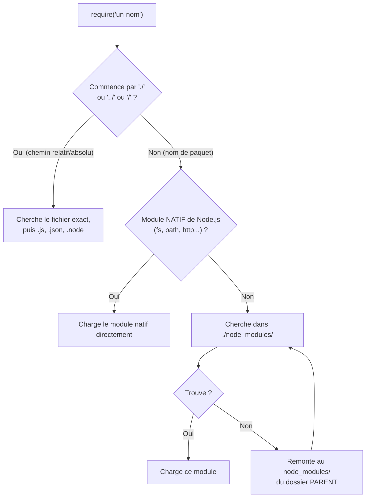
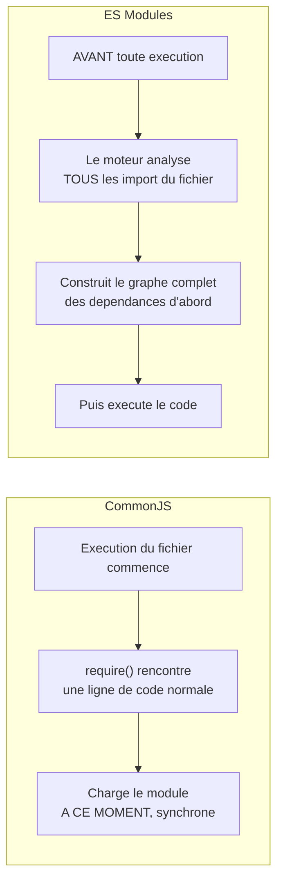

<div class="chapitre-titre-num">CHAPITRE 6</div>

# Modules CommonJS et ES Modules

<div class="encadre objectif">
<span class="encadre-titre">🎯 Objectif du chapitre</span>
Comprendre les deux systèmes de modules coexistant en Node.js (CommonJS historique, ES Modules standard moderne), savoir les utiliser correctement, et connaître leurs différences pratiques. À la fin de ce chapitre, tu sauras choisir le bon système pour un nouveau projet, et diagnostiquer les deux erreurs les plus fréquentes lors d'un passage de l'un à l'autre.
</div>

<div class="encadre scenario">
<span class="encadre-titre">🎬 Mise en situation</span>
Tu ajoutes une dépendance récente à un projet existant en CommonJS. En l'important avec `require("nom-du-paquet")`, tu obtiens une erreur cryptique : `Error [ERR_REQUIRE_ESM]: require() of ES Module not supported`. Le mainteneur du paquet a choisi de ne publier qu'en ES Modules, un choix de plus en plus fréquent dans l'écosystème JavaScript récent. Comprendre la coexistence — parfois conflictuelle — de CommonJS et ES Modules en Node.js n'est donc pas une curiosité historique : c'est une compétence qui te sert dès la première dépendance un peu récente que tu ajoutes à un projet plus ancien.
</div>

## 6.1 Pourquoi des modules

Sans système de modules, tout le code d'une application vivrait dans un espace global unique, avec des risques constants de collision de noms de variables/fonctions. Un **module** encapsule du code dans son propre espace, n'exposant que ce qu'il choisit explicitement d'exporter.

<div class="encadre astuce">
<span class="encadre-titre">💡 Analogie</span>
Un module, c'est une pièce fermée dans une maison partagée : ce qui s'y passe reste privé, sauf ce que la porte (les exports) laisse volontairement sortir. Sans cloisonnement, tout le monde partagerait le même espace, avec le risque constant que deux personnes réutilisent sans le savoir le même nom pour deux choses différentes.
</div>

## 6.2 CommonJS : le système historique de Node.js

```js
// math.js — définit un module
function additionner(a, b) {
  return a + b;
}

function soustraire(a, b) {
  return a - b;
}

module.exports = { additionner, soustraire };
```

```js
// index.js — utilise le module
const { additionner, soustraire } = require("./math");

console.log(additionner(2, 3)); // 5
```

```js
// Export unique (par défaut)
module.exports = function additionner(a, b) {
  return a + b;
};

// Utilisation
const additionner = require("./math");
```

**CommonJS** (`require`/`module.exports`) est le système de modules **originel** de Node.js, présent depuis sa création, bien avant que JavaScript ne dispose de son propre système standard.

Quand `require("./math")` est appelé, Node.js suit un algorithme de résolution précis pour retrouver le bon fichier :



<div class="encadre astuce">
<span class="encadre-titre">💡 Explication du schéma</span>
C'est cette remontée successive (I → F) qui explique pourquoi un seul `node_modules/` à la racine d'un projet suffit à satisfaire tous les `require()` de tous les fichiers du projet, même profondément imbriqués dans des sous-dossiers : Node.js remonte l'arborescence jusqu'à trouver le paquet demandé (ou jusqu'à la racine du système de fichiers, avec une erreur si rien n'est trouvé).
</div>

## 6.3 ES Modules : le système standard du langage JavaScript

```js
// math.mjs (ou math.js avec "type": "module" dans package.json)
export function additionner(a, b) {
  return a + b;
}

export function soustraire(a, b) {
  return a - b;
}

export default function multiplier(a, b) {
  return a * b;
}
```

```js
// index.mjs
import multiplier, { additionner, soustraire } from "./math.mjs";

console.log(additionner(2, 3)); // 5
console.log(multiplier(2, 3));  // 6
```

**ES Modules** (ESM, `import`/`export`) est le système de modules **standardisé** du langage JavaScript lui-même (introduit en 2015 avec ES6), utilisé aussi bien dans le navigateur que côté Node.js depuis les versions récentes.

<div class="encadre retenir">
<span class="encadre-titre">📌 À retenir</span>
La différence la plus structurante entre les deux n'est pas seulement syntaxique : CommonJS résout ses `require()` <strong>au moment de l'exécution</strong> (donc conditionnellement possible), alors qu'ES Modules analyse tous ses `import` <strong>avant même d'exécuter le code</strong> (analyse statique) — ce qui permet des optimisations impossibles en CommonJS, mais impose que `import` reste toujours au niveau racine du fichier.
</div>

## 6.4 Activer ES Modules dans un projet Node.js

```json
// package.json
{
  "type": "module"
}
```

<div class="encadre attention">
<span class="encadre-titre">⚠️ "type": "module" change le comportement de TOUS les fichiers .js du projet</span>
Une fois `"type": "module"` défini, **tous** les fichiers `.js` du projet sont interprétés comme des ES Modules — `require()` n'y fonctionne plus, il faut utiliser `import`. Pour mélanger les deux dans un même projet, il faut nommer explicitement les fichiers `.cjs` (CommonJS) ou `.mjs` (ES Modules), indépendamment du réglage `"type"` du `package.json`.
</div>

## 6.5 Différences pratiques essentielles

| Critère | CommonJS | ES Modules |
|---|---|---|
| Syntaxe | `require()` / `module.exports` | `import` / `export` |
| Chargement | Synchrone | Asynchrone (mais l'écriture reste simple grâce au support natif) |
| Résolution | Dynamique, `require()` peut être appelé conditionnellement | Statique, `import` doit être au niveau racine du fichier (analysé avant exécution) |
| Extension de fichier par défaut | `.js` (sauf si `"type": "module"`) | `.mjs`, ou `.js` avec `"type": "module"` |
| `__dirname`/`__filename` | Disponibles nativement | Absents (nécessitent `import.meta.url` + un calcul manuel) |
| Écosystème npm | Historiquement dominant, toujours largement supporté | De plus en plus répandu, notamment pour du code neuf |



<div class="encadre astuce">
<span class="encadre-titre">💡 Explication du schéma</span>
Cette différence de timing explique directement pourquoi `import` ne peut pas être conditionnel (le graphe de dépendances doit être connu avant toute exécution), alors que `require()` le peut très bien (rien n'empêche de l'appeler à l'intérieur d'un `if`).
</div>

## 6.6 import dynamique (import())

```js
// Import CONDITIONNEL, possible même en ES Modules (contrairement à `import` statique)
async function chargerModuleSelonEnv() {
  if (process.env.NODE_ENV === "production") {
    const module = await import("./config.production.js");
    return module.default;
  } else {
    const module = await import("./config.development.js");
    return module.default;
  }
}
```

`import()` (fonction, contrairement au mot-clé `import` statique) retourne une Promise (chapitre 9) et peut être appelé n'importe où dans le code, y compris conditionnellement — comblant la limitation de `import` statique évoquée dans le tableau ci-dessus.

## 6.7 __dirname en ES Modules

```js
// CommonJS : __dirname disponible nativement
console.log(__dirname); // /home/jaslin/mon-api/src

// ES Modules : __dirname n'existe pas, il faut le recalculer
import { fileURLToPath } from "url";
import { dirname } from "path";

const __filename = fileURLToPath(import.meta.url);
const __dirname = dirname(__filename);
console.log(__dirname);
```

## 6.8 Lequel choisir pour un nouveau projet

<div class="encadre astuce">
<span class="encadre-titre">💡 Recommandation pour ce manuel et les projets neufs</span>
Ce manuel utilise principalement **CommonJS** dans ses exemples de code (encore extrêmement répandu dans l'écosystème Express et la majorité des tutoriels/documentations existants), tout en signalant les équivalents ES Modules quand c'est pertinent. Pour un **nouveau** projet démarré aujourd'hui sans contrainte de compatibilité avec du code legacy, **ES Modules** est la direction recommandée par l'évolution du langage — mais CommonJS reste parfaitement valide et largement utilisé en production.
</div>

<div class="encadre bonne-pratique">
<span class="encadre-titre">✅ Bonne pratique</span>
Choisir un système de modules **au démarrage** du projet et s'y tenir de façon cohérente sur l'ensemble du code applicatif. Mélanger les deux systèmes fichier par fichier (au-delà de la coexistence normale avec des dépendances tierces) complique inutilement la maintenance.
</div>

## Atelier — Convertir un module entre les deux systèmes

<div class="encadre exercice">
<span class="encadre-titre">🛠️ Atelier 6 — CommonJS vers ES Modules, et retour</span>

**Objectif** : expérimenter concrètement la conversion entre les deux systèmes, et observer l'erreur exacte de la mise en situation d'ouverture.

**Préparation** : un dossier de projet avec Node.js installé.

**Étapes détaillées** :
1. Crée `math.js` en CommonJS (section 6.2) et un `index.js` qui l'utilise avec `require`.
2. Vérifie que `node index.js` fonctionne.
3. Ajoute `"type": "module"` dans `package.json`, sans rien changer d'autre.
4. Relance `node index.js` : observe l'erreur exacte produite par `require()` dans un contexte désormais ESM.
5. Convertis `math.js` et `index.js` en syntaxe ES Modules (`export`/`import`), en ajoutant l'extension `.js` explicite dans l'import.
6. Relance `node index.js` : confirme que ça fonctionne à nouveau.

**Validation** : l'étape 4 doit reproduire une erreur `require is not defined` ou équivalente — la preuve concrète que `"type": "module"` change le comportement de tous les fichiers `.js`, pas seulement d'un fichier isolé.

**Résultat attendu** : comprendre par l'expérience directe pourquoi ce changement de configuration ne peut pas être fait "à moitié" sans renommer les fichiers concernés en `.cjs`/`.mjs`.

**Dépannage** : si l'erreur ne correspond pas à celle attendue, vérifie que `package.json` a bien été sauvegardé avant de relancer `node index.js`.

**Nettoyage** : aucun, ce petit projet peut être conservé comme référence personnelle.
</div>

## Erreurs fréquentes

<div class="encadre attention">
<span class="encadre-titre">⚠️ Erreur n°1 — Mélanger require() et import dans le même fichier</span>

```js
const express = require("express"); // CommonJS
import cors from "cors";             // ❌ Erreur : ne peut pas cohabiter dans le même fichier
```
Un fichier donné doit être **cohérent** : soit entièrement CommonJS, soit entièrement ES Modules — jamais un mélange des deux syntaxes dans le même fichier.
</div>

<div class="encadre attention">
<span class="encadre-titre">⚠️ Erreur n°2 — Oublier l'extension de fichier dans un import ES Modules</span>

```js
import { additionner } from "./math"; // ❌ Erreur en ES Modules natif Node.js : extension manquante
import { additionner } from "./math.js"; // ✅ l'extension est OBLIGATOIRE en ESM natif Node.js
```
Contrairement à CommonJS (qui résout automatiquement l'extension `.js` manquante) et contrairement à certains bundlers frontend (Webpack, Vite), Node.js en ES Modules natif **exige** l'extension complète du fichier importé.
</div>

<div class="encadre attention">
<span class="encadre-titre">⚠️ Erreur n°3 — ERR_REQUIRE_ESM en important une dépendance récente</span>
Exactement l'erreur de la mise en situation d'ouverture : certains paquets npm récents ne publient **plus qu'**en ES Modules. Un projet resté en CommonJS ne peut pas les charger via `require()` classique — la solution est soit de migrer le projet vers ESM, soit d'utiliser `import()` dynamique (section 6.6) même depuis un fichier CommonJS (Node.js l'autorise dans ce sens précis).
</div>

## Débogage

<div class="encadre attention">
<span class="encadre-titre">🩺 Symptôme : "Cannot use import statement outside a module"</span>

- **Cause** : le fichier utilise `import`/`export` mais Node.js l'interprète encore comme du CommonJS (pas de `"type": "module"` dans `package.json`, et l'extension n'est pas `.mjs`).
- **Diagnostic** : vérifier `package.json` (`"type"`) et l'extension du fichier concerné.
- **Solution** : ajouter `"type": "module"` au `package.json`, ou renommer le fichier en `.mjs`.
</div>

<div class="encadre attention">
<span class="encadre-titre">🩺 Symptôme : "ERR_REQUIRE_ESM"</span>

- **Cause** : tentative de `require()` d'un paquet publié uniquement en ES Modules.
- **Solution** : remplacer par `const module = await import("nom-du-paquet")` dans une fonction `async`, ou migrer le projet entier vers ESM si plusieurs dépendances imposent ce choix.
</div>

## En entreprise

- **Migration progressive** : de nombreuses équipes migrent un projet CommonJS existant vers ES Modules progressivement, fichier par fichier, plutôt qu'en un seul changement risqué de `"type": "module"` sur un gros projet déjà en production.
- **Bibliothèques "dual-mode"** : beaucoup de paquets npm sérieux publient à la fois une version CommonJS et une version ES Modules (via le champ `exports` conditionnel de `package.json`), pour rester compatibles avec les deux écosystèmes.
- **Erreur classique observée** : une équipe qui bascule `"type": "module"` sur un projet Express volumineux sans avoir anticipé que certaines dépendances internes utilisaient encore `require()` de façon dynamique/conditionnelle, cassant plusieurs modules d'un coup.

## Entretien technique

<div class="encadre exercice">
<span class="encadre-titre">💼 Questions fréquemment posées en entretien</span>

**Q1. "Quelle est la différence fondamentale entre CommonJS et ES Modules, au-delà de la syntaxe ?"**
Réponse attendue : CommonJS résout ses `require()` de façon dynamique, au moment de l'exécution ; ES Modules analyse tous ses `import` de façon statique, avant toute exécution, ce qui autorise certaines optimisations mais interdit un `import` conditionnel.

**Q2. "Comment charger conditionnellement un module en ES Modules ?"**
Réponse attendue : via `import()` dynamique (une fonction qui retourne une Promise), utilisable n'importe où dans le code, contrairement au mot-clé `import` statique qui doit rester au niveau racine du fichier.

**Q3. "Pourquoi __dirname n'existe-t-il pas en ES Modules ?"**
Réponse attendue : ES Modules est le standard du langage JavaScript, y compris côté navigateur, où la notion de système de fichiers local n'a pas de sens — `__dirname` est une commodité spécifique à Node.js en CommonJS, remplacée en ESM par un calcul manuel via `import.meta.url`.
</div>

## Optimisation, sécurité et maintenabilité

<div class="encadre bonne-pratique">
<span class="encadre-titre">✅ Maintenabilité</span>
Documenter explicitement, dans le `README.md` d'un projet, le système de modules utilisé (CommonJS ou ES Modules) — une ambiguïté à ce sujet ralentit systématiquement l'arrivée d'un nouveau développeur sur le projet.
</div>

## Résumé du chapitre

- **CommonJS** (`require`/`module.exports`) est le système historique, encore dominant dans l'écosystème Express.
- **ES Modules** (`import`/`export`) est le système standardisé du langage, activé via `"type": "module"` dans `package.json`.
- `import()` dynamique permet un chargement conditionnel, même en ES Modules.
- `__dirname`/`__filename` n'existent pas nativement en ES Modules ; il faut les recalculer via `import.meta.url`.
- Un fichier ne peut jamais mélanger les deux syntaxes ; les imports ES Modules natifs exigent l'extension complète du fichier.

## Quiz

<div class="encadre exercice">
<span class="encadre-titre">📝 QCM</span>

1. Quel système de modules résout ses imports de façon statique, avant l'exécution ?
   - a) CommonJS
   - b) ES Modules
   - c) Les deux de la même façon
   - d) Aucun des deux

2. Que faut-il ajouter à package.json pour activer ES Modules ?
   - a) `"esm": true`
   - b) `"type": "module"`
   - c) `"modules": "es6"`
   - d) Rien, c'est automatique

3. Comment charger un module de façon conditionnelle en ES Modules ?
   - a) `require()` classique
   - b) `import()` dynamique
   - c) C'est impossible en ES Modules
   - d) `import.meta.load()`

**Corrigé** : 1-b, 2-b, 3-b.
</div>

<div class="encadre exercice">
<span class="encadre-titre">📝 Vrai ou Faux</span>

1. On peut utiliser require() et import dans le même fichier. — **Faux**.
2. `__dirname` existe nativement en ES Modules. — **Faux** (il faut le recalculer via `import.meta.url`).
3. Les imports ES Modules natifs Node.js exigent l'extension complète du fichier. — **Vrai**.
</div>

<div class="encadre exercice">
<span class="encadre-titre">📝 Question ouverte</span>

Un projet CommonJS existant a besoin d'une seule dépendance publiée uniquement en ES Modules. Faut-il migrer tout le projet vers ESM pour autant ?

**Corrigé** : pas nécessairement. `import()` dynamique (section 6.6) peut être utilisé depuis un fichier CommonJS pour charger cette seule dépendance de façon asynchrone, sans imposer une migration complète du projet — une solution proportionnée quand une seule dépendance est concernée, réservant la migration complète aux cas où plusieurs dépendances imposent ce choix.
</div>

## Exercices

<div class="encadre exercice">
<span class="encadre-titre">📝 Exercice 6.1</span>

Convertis ce module CommonJS en ES Modules :
```js
function formaterPrix(montant) {
  return montant.toFixed(2) + " HTG";
}
module.exports = { formaterPrix };
```
</div>

**Corrigé :**
```js
export function formaterPrix(montant) {
  return montant.toFixed(2) + " HTG";
}
```
Et dans `package.json`, ajouter `"type": "module"` (ou nommer le fichier `.mjs`).

## Checklist de fin de chapitre

<ul class="checklist">
<li>☐ Je sais écrire un module en CommonJS et en ES Modules.</li>
<li>☐ Je comprends la différence entre résolution statique et dynamique.</li>
<li>☐ Je sais activer ES Modules dans un projet via package.json.</li>
<li>☐ Je sais utiliser import() dynamique pour un chargement conditionnel.</li>
<li>☐ Je sais diagnostiquer une erreur ERR_REQUIRE_ESM.</li>
</ul>

## FAQ

<dl class="faq">
<dt>Puis-je utiliser TypeScript pour éviter ce choix ?</dt>
<dd>TypeScript compile généralement vers l'un ou l'autre système selon sa configuration (`tsconfig.json`, champ `module`) — le choix reste donc présent, seulement déplacé au niveau de la configuration de compilation plutôt que de la syntaxe quotidienne.</dd>

<dt>Node.js va-t-il un jour abandonner CommonJS ?</dt>
<dd>Rien ne l'indique à court ou moyen terme : l'écosystème npm historique dépend massivement de CommonJS, et Node.js maintient une compatibilité descendante forte. Les deux systèmes coexisteront probablement encore longtemps.</dd>

<dt>Que se passe-t-il si je nomme un fichier .cjs dans un projet "type": "module" ?</dt>
<dd>Ce fichier spécifique est traité comme CommonJS malgré le réglage global du projet — l'extension explicite (`.cjs`/`.mjs`) prime toujours sur le champ `"type"` de `package.json`.</dd>
</dl>

## Références et pour aller plus loin

- Documentation Node.js sur les modules ES : [https://nodejs.org/api/esm.html](https://nodejs.org/api/esm.html)
- Documentation Node.js sur les modules CommonJS : [https://nodejs.org/api/modules.html](https://nodejs.org/api/modules.html)
- Spécification ECMAScript des modules : [https://tc39.es/ecma262/#sec-modules](https://tc39.es/ecma262/#sec-modules)

*Ceci clôt la Partie 1 (fondamentaux Node.js). Chapitre suivant : le JavaScript moderne (ES6+), première étape de la Partie 2.*
