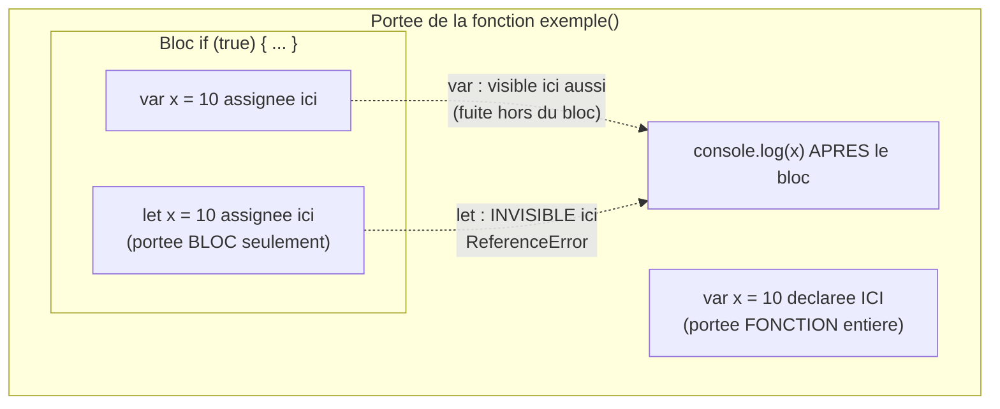
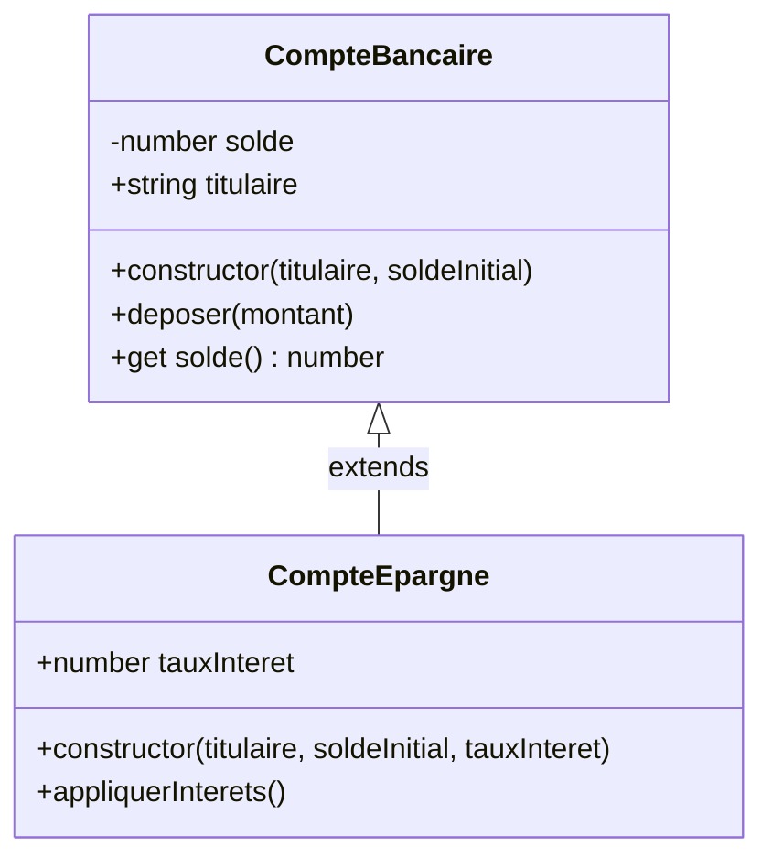

<div class="chapitre-titre-num">CHAPITRE 7</div>

# JavaScript moderne (ES6+)

<div class="encadre objectif">
<span class="encadre-titre">🎯 Objectif du chapitre</span>
Maîtriser les fonctionnalités du JavaScript moderne indispensables pour écrire du code Node.js idiomatique et lisible : `let`/`const`, fonctions fléchées, déstructuration, spread/rest, template literals, classes, et les opérateurs modernes (`?.`, `??`). À la fin de ce chapitre, tu écriras un code sensiblement plus court, plus sûr et plus proche de ce qui s'attend dans une revue de code professionnelle.
</div>

<div class="encadre scenario">
<span class="encadre-titre">🎬 Mise en situation</span>
Un recruteur technique te soumet un extrait de code volontairement écrit "à l'ancienne" (`var`, concaténation de chaînes, fonctions classiques partout) et te demande de le moderniser en direct, à l'oral, en expliquant chaque changement. Ce n'est pas un exercice de style : une bonne partie des tests techniques et des revues de code en entreprise jugent justement ta maîtrise de ces fondamentaux modernes, qui reviennent dans littéralement chaque fichier JavaScript que tu écriras dans ce manuel à partir de maintenant.
</div>

## 7.1 let et const : en finir avec var

```js
// ❌ var : portée de FONCTION (pas de bloc), sujette au hoisting confus
function exemple() {
  if (true) {
    var x = 10;
  }
  console.log(x); // 10 — accessible en dehors du bloc if, un piège fréquent
}

// ✅ let/const : portée de BLOC, comportement prévisible
function exempleModerne() {
  if (true) {
    let x = 10;
  }
  console.log(x); // ❌ ReferenceError : x n'est pas défini ici — comportement attendu
}
```

<div class="encadre astuce">
<span class="encadre-titre">💡 Règle pratique : const par défaut, let si réassignation nécessaire</span>
`const` empêche la **réassignation** de la variable (pas la mutation de son contenu si c'est un objet/tableau — rappel similaire au `final` de Java, si tu as suivi ce manuel). Utilise `const` par défaut pour tout, et `let` uniquement quand la variable doit réellement changer de valeur (un compteur de boucle, un accumulateur). `var` ne devrait plus jamais apparaître dans du code neuf.
</div>

```js
const utilisateur = { nom: "Jaslin" };
utilisateur.nom = "Marie"; // ✅ autorisé : on MODIFIE le contenu, pas la référence elle-même
utilisateur = {};           // ❌ TypeError : Assignment to constant variable
```

| Critère | `var` | `let` | `const` |
|---|---|---|---|
| Portée | Fonction (ignore les blocs `{}`) | Bloc | Bloc |
| Redéclaration | Autorisée (dangereuse) | Interdite | Interdite |
| Réassignation | Autorisée | Autorisée | Interdite |
| Hoisting | Oui, initialisée à `undefined` | Oui, mais inaccessible avant déclaration ("zone morte temporelle") | Idem que `let` |
| Recommandation | À bannir en code neuf | Si réassignation nécessaire | Par défaut, systématiquement |



<div class="encadre astuce">
<span class="encadre-titre">💡 Explication du schéma</span>
`var` "fuit" hors du bloc `if` où elle est définie, restant accessible (et modifiable) dans toute la fonction englobante — la source du piège illustré en section 7.1. `let`/`const` restent strictement confinées au bloc `{}` où elles sont déclarées, un comportement bien plus prévisible et aligné avec la plupart des autres langages modernes.
</div>

## 7.2 Fonctions fléchées (arrow functions)

```js
// Fonction classique
function additionner(a, b) {
  return a + b;
}

// Fonction fléchée équivalente
const additionner = (a, b) => a + b; // retour implicite si le corps tient sur une expression

// Avec un corps de bloc, le retour doit être explicite
const traiterCommande = (commande) => {
  const total = commande.lignes.reduce((somme, l) => somme + l.prix, 0);
  return { ...commande, total };
};
```

<div class="encadre attention">
<span class="encadre-titre">⚠️ Les fonctions fléchées n'ont pas leur propre "this"</span>

```js
const utilisateur = {
  nom: "Jaslin",
  saluerClassique: function () {
    console.log("Bonjour " + this.nom); // "this" = l'objet utilisateur
  },
  saluerFlechee: () => {
    console.log("Bonjour " + this.nom); // "this" = le contexte EXTÉRIEUR (souvent undefined en module), pas utilisateur !
  },
};
```
Une fonction fléchée hérite du `this` de son **contexte englobant** au moment de sa définition, plutôt que de recevoir son propre `this` selon la façon dont elle est appelée (comportement des fonctions classiques). C'est précieux dans les callbacks (évite le classique `const self = this;`), mais dangereux pour les méthodes d'objet destinées à utiliser leur propre `this`.
</div>

<div class="encadre retenir">
<span class="encadre-titre">📌 À retenir</span>
Règle simple : utilise une fonction classique (<code>function</code>) pour une méthode d'objet/de classe qui a besoin de son propre <code>this</code> ; utilise une fonction fléchée pour un callback qui doit hériter du <code>this</code> englobant (ou qui n'utilise <code>this</code> nulle part).
</div>

## 7.3 Template literals

```js
const nom = "Jaslin";
const age = 24;

// ❌ Concaténation classique, verbeuse
const message = "Bonjour " + nom + ", tu as " + age + " ans.";

// ✅ Template literal : interpolation directe, multi-lignes naturelles
const messageModerne = `Bonjour ${nom}, tu as ${age} ans.`;

const html = `
  <div>
    <h1>${nom}</h1>
    <p>${age} ans</p>
  </div>
`;
```

## 7.4 Déstructuration

```js
// Objets
const utilisateur = { nom: "Jaslin", email: "jaslin@mail.com", age: 24 };
const { nom, email } = utilisateur;
const { nom: nomUtilisateur } = utilisateur; // renommage à l'extraction

// Avec valeur par défaut
const { role = "UTILISATEUR" } = utilisateur; // "role" n'existe pas dans l'objet → valeur par défaut utilisée

// Tableaux
const coordonnees = [48.85, 2.35];
const [latitude, longitude] = coordonnees;

// Très utilisé pour les paramètres de fonction (lisibilité + auto-documentation)
function creerUtilisateur({ nom, email, age = 18 }) {
  console.log(`${nom} (${email}), ${age} ans`);
}
creerUtilisateur({ nom: "Jaslin", email: "jaslin@mail.com" }); // age prend 18 par défaut
```

## 7.5 Spread et Rest (l'opérateur ...)

```js
// Spread : "étale" les éléments d'un tableau/objet
const partie1 = [1, 2, 3];
const partie2 = [4, 5, 6];
const complet = [...partie1, ...partie2]; // [1, 2, 3, 4, 5, 6]

const utilisateurBase = { nom: "Jaslin", role: "UTILISATEUR" };
const utilisateurAdmin = { ...utilisateurBase, role: "ADMIN" }; // écrase "role", copie le reste

// Rest : regroupe les arguments RESTANTS dans un tableau
function additionnerTout(...nombres) {
  return nombres.reduce((total, n) => total + n, 0);
}
additionnerTout(1, 2, 3, 4); // 10

// Rest en déstructuration : récupère "le reste" des propriétés
const { nom, ...autresProprietes } = utilisateur;
```

<div class="encadre astuce">
<span class="encadre-titre">💡 Le spread est la base de l'immuabilité en JavaScript</span>
`{ ...utilisateurBase, role: "ADMIN" }` crée un **nouvel** objet plutôt que de modifier `utilisateurBase` directement — un principe d'immuabilité qui limite les effets de bord inattendus, particulièrement précieux dès que l'état est partagé entre plusieurs parties du code (services, middlewares).
</div>

## 7.6 Classes

```js
class CompteBancaire {
  #solde; // champ PRIVÉ (# préfixe), inaccessible depuis l'extérieur de la classe

  constructor(titulaire, soldeInitial = 0) {
    this.titulaire = titulaire;
    this.#solde = soldeInitial;
  }

  deposer(montant) {
    if (montant <= 0) {
      throw new Error("Le montant doit être positif");
    }
    this.#solde += montant;
  }

  get solde() { // getter : accessible comme une propriété, pas comme un appel de méthode
    return this.#solde;
  }
}

const compte = new CompteBancaire("Jaslin", 1000);
compte.deposer(500);
console.log(compte.solde); // 1500 (via le getter, sans parenthèses)
console.log(compte.#solde); // ❌ SyntaxError : champ privé inaccessible de l'extérieur
```

```js
class CompteEpargne extends CompteBancaire {
  constructor(titulaire, soldeInitial, tauxInteret) {
    super(titulaire, soldeInitial); // appelle le constructeur de la classe mère
    this.tauxInteret = tauxInteret;
  }

  appliquerInterets() {
    this.deposer(this.solde * this.tauxInteret);
  }
}
```



<div class="encadre astuce">
<span class="encadre-titre">💡 Explication du schéma</span>
Ce diagramme de classes UML montre exactement ce que `extends`/`super` expriment en code : `CompteEpargne` hérite de tout ce que `CompteBancaire` expose publiquement (`deposer`, le getter `solde`), sans jamais avoir accès au champ privé `#solde` directement — seul le getter public y donne accès, y compris depuis la classe fille.
</div>

Les classes JavaScript restent, en coulisses, du **sucre syntaxique** au-dessus du système de prototypes historique du langage — mais leur syntaxe (`class`, `extends`, `super`, champs privés `#`) rend le code orienté objet bien plus lisible qu'avec l'ancienne syntaxe à base de prototypes explicites.

## 7.7 Optional chaining (?.) et nullish coalescing (??)

```js
const utilisateur = { profil: { adresse: null } };

// ❌ Sans optional chaining : risque de TypeError si une étape intermédiaire est null/undefined
console.log(utilisateur.profil.adresse.ville); // 💥 TypeError si adresse est null

// ✅ Optional chaining : retourne undefined au lieu de planter, si un maillon est null/undefined
console.log(utilisateur.profil?.adresse?.ville); // undefined, sans erreur

// Nullish coalescing : valeur par défaut UNIQUEMENT si null ou undefined (contrairement à ||)
const port = process.env.PORT ?? 3000;
```

<div class="encadre attention">
<span class="encadre-titre">⚠️ ?? n'est pas la même chose que ||</span>

```js
const quantite = 0;
const quantiteAffichee1 = quantite || 10; // 10 — car 0 est "falsy", || le remplace à tort !
const quantiteAffichee2 = quantite ?? 10; // 0  — ?? ne remplace QUE null/undefined, pas 0
```
`||` remplace **toute** valeur "falsy" (`0`, `""`, `false`, `null`, `undefined`), ce qui est souvent une erreur quand `0` ou `""` sont des valeurs légitimes à conserver. `??` (nullish coalescing) ne remplace que `null`/`undefined`, un comportement bien plus précis pour les valeurs par défaut.
</div>

## 7.8 Méthodes de tableaux modernes

```js
const produits = [
  { nom: "Riz", prix: 250, categorie: "alimentaire" },
  { nom: "Savon", prix: 80, categorie: "hygiene" },
  { nom: "Haricots", prix: 180, categorie: "alimentaire" },
];

const alimentaires = produits.filter((p) => p.categorie === "alimentaire");
const noms = produits.map((p) => p.nom);
const total = produits.reduce((somme, p) => somme + p.prix, 0);
const cher = produits.find((p) => p.prix > 200);
const auMoinsUnCher = produits.some((p) => p.prix > 200);
const tousAbordables = produits.every((p) => p.prix < 1000);
```

| Méthode | Retourne | Usage typique |
|---|---|---|
| `map` | Un nouveau tableau, même longueur | Transformer chaque élément |
| `filter` | Un nouveau tableau, longueur ≤ originale | Garder certains éléments selon une condition |
| `reduce` | Une valeur unique (n'importe quel type) | Agréger (somme, regroupement, construction d'objet) |
| `find` | Un élément, ou `undefined` | Trouver le premier élément correspondant |
| `some` | `true`/`false` | Vérifier qu'au moins un élément correspond |
| `every` | `true`/`false` | Vérifier que tous les éléments correspondent |

## Atelier — Moderniser un fichier "à l'ancienne"

<div class="encadre exercice">
<span class="encadre-titre">🛠️ Atelier 7 — L'exercice de la mise en situation, en conditions réelles</span>

**Objectif** : reproduire l'exercice du recruteur de la mise en situation d'ouverture sur un exemple complet.

**Préparation** : un fichier `avant.js` contenant ce code volontairement daté :

```js
function creerRapport(utilisateur, produits) {
  var alimentaires = [];
  for (var i = 0; i < produits.length; i++) {
    if (produits[i].categorie === "alimentaire") {
      alimentaires.push(produits[i]);
    }
  }
  var total = 0;
  for (var j = 0; j < alimentaires.length; j++) {
    total = total + alimentaires[j].prix;
  }
  var role = utilisateur.role || "UTILISATEUR";
  return "Rapport pour " + utilisateur.nom + " (" + role + ") : " + total + " HTG";
}
```

**Étapes détaillées** :
1. Remplace tous les `var` par `let`/`const` selon la règle de la section 7.1.
2. Remplace la boucle `for` de filtrage par `.filter()`.
3. Remplace la boucle `for` de somme par `.reduce()`.
4. Remplace `utilisateur.role || "UTILISATEUR"` par une déstructuration avec valeur par défaut.
5. Remplace la concaténation de chaînes par un template literal.

**Validation** : le résultat doit produire exactement la même sortie que la version originale pour les mêmes entrées, mais en nettement moins de lignes.

**Résultat attendu** :
```js
function creerRapport({ nom, role = "UTILISATEUR" }, produits) {
  const total = produits
    .filter((p) => p.categorie === "alimentaire")
    .reduce((somme, p) => somme + p.prix, 0);
  return `Rapport pour ${nom} (${role}) : ${total} HTG`;
}
```

**Dépannage** : si le total diffère, vérifie que `.filter()` est bien appliqué **avant** `.reduce()`, dans cet ordre — inverser les deux ne donnerait pas le même résultat ici.

**Nettoyage** : aucun.
</div>

## Erreurs fréquentes

<div class="encadre attention">
<span class="encadre-titre">⚠️ Erreur n°1 — Oublier que const n'empêche pas la mutation d'un objet/tableau</span>

```js
const liste = [1, 2, 3];
liste.push(4); // ✅ autorisé : on modifie le CONTENU, la référence "liste" ne change pas
console.log(liste); // [1, 2, 3, 4]
```
Ce n'est pas une erreur en soi, mais une confusion fréquente chez les débutants qui pensent, à tort, que `const` rend un tableau/objet totalement immuable.
</div>

<div class="encadre attention">
<span class="encadre-titre">⚠️ Erreur n°2 — Utiliser une fonction fléchée pour une méthode d'objet qui a besoin de this</span>
Vue en détail en section 7.2 : `saluerFlechee` ne fonctionne pas comme attendu car elle n'a pas son propre `this`. Une confusion fréquente pour les débutants venant d'un langage où toutes les fonctions se comportent de la même façon.
</div>

## Débogage

<div class="encadre attention">
<span class="encadre-titre">🩺 Symptôme : "this.nom is undefined" dans une méthode d'objet</span>

- **Cause** : la méthode a été définie comme une fonction fléchée au lieu d'une fonction classique.
- **Diagnostic** : vérifier la syntaxe de définition de la méthode (`nom: () => {...}` au lieu de `nom() {...}` ou `nom: function() {...}`).
- **Solution** : convertir en fonction classique si la méthode a besoin de son propre `this`.
</div>

## En entreprise

- **ESLint** : la quasi-totalité des équipes professionnelles configurent ESLint pour interdire `var` et forcer `const`/`let` (règle `no-var`, `prefer-const`) — ce n'est plus une question de style mais un standard imposé automatiquement en CI.
- **Revue de code** : la maîtrise de ces fondamentaux modernes (justement le sujet de la mise en situation) est un critère de revue de code de premier niveau, avant même d'examiner la logique métier.

## Entretien technique

<div class="encadre exercice">
<span class="encadre-titre">💼 Questions fréquemment posées en entretien</span>

**Q1. "Quelle est la différence entre let et const ?"**
Réponse attendue : les deux ont une portée de bloc (contrairement à `var`), mais `const` interdit la réassignation de la variable elle-même — sans empêcher la mutation du contenu si c'est un objet ou un tableau.

**Q2. "Pourquoi une fonction fléchée n'est-elle pas adaptée comme méthode d'objet ?"**
Réponse attendue : parce qu'elle n'a pas son propre `this` et hérite de celui du contexte englobant au moment de sa définition, ce qui casse le comportement attendu d'une méthode censée utiliser `this` pour référencer l'instance qui l'appelle.

**Q3. "Quelle est la différence entre || et ?? pour une valeur par défaut ?"**
Réponse attendue : `||` remplace toute valeur "falsy" (y compris `0`, `""`, `false`), tandis que `??` ne remplace que `null`/`undefined` — un comportement bien plus précis quand `0` ou `""` sont des valeurs légitimes.
</div>

## Optimisation, sécurité et maintenabilité

<div class="encadre bonne-pratique">
<span class="encadre-titre">✅ Maintenabilité</span>
Adopter `const` par défaut rend immédiatement visible, à la lecture, quelles variables sont censées changer de valeur (`let`) et lesquelles ne le sont jamais (`const`) — une information précieuse pour quiconque relit le code plus tard.
</div>

## Résumé du chapitre

- `const` par défaut, `let` seulement si réassignation nécessaire ; `var` à bannir.
- Les fonctions fléchées héritent du `this` de leur contexte englobant, contrairement aux fonctions classiques.
- La déstructuration et le spread/rest rendent le code plus concis et favorisent l'immuabilité.
- Les classes JavaScript modernes (champs privés `#`, `extends`, `super`) structurent le code orienté objet.
- `?.` protège contre les erreurs sur une chaîne d'accès potentiellement `null`/`undefined` ; `??` ne remplace que `null`/`undefined`, contrairement à `||`.

## Quiz

<div class="encadre exercice">
<span class="encadre-titre">📝 QCM</span>

1. Que se passe-t-il si on utilise `var` dans un bloc `if` ?
   - a) La variable reste confinée au bloc
   - b) La variable "fuit" et reste accessible dans toute la fonction englobante
   - c) Une erreur de syntaxe est levée
   - d) Rien de particulier, comme avec `let`

2. Que retourne `0 ?? 10` ?
   - a) 10
   - b) 0
   - c) undefined
   - d) Une erreur

3. Une fonction fléchée définie comme méthode d'un objet littéral...
   - a) A son propre `this` pointant vers l'objet
   - b) Hérite du `this` du contexte englobant, pas de l'objet
   - c) N'a jamais de `this`, quel que soit le contexte
   - d) Se comporte exactement comme une fonction classique

**Corrigé** : 1-b, 2-b, 3-b.
</div>

<div class="encadre exercice">
<span class="encadre-titre">📝 Vrai ou Faux</span>

1. `const tableau = [1,2,3]; tableau.push(4);` provoque une erreur. — **Faux** (mutation du contenu autorisée).
2. Les champs privés `#` d'une classe sont accessibles depuis une classe qui en hérite (`extends`). — **Faux** (accessibles uniquement via des méthodes/getters publics de la classe qui les déclare).
3. `??` remplace uniquement `null` et `undefined`, jamais `0` ni `""`. — **Vrai**.
</div>

<div class="encadre exercice">
<span class="encadre-titre">📝 Question ouverte</span>

Pourquoi `const utilisateur = {...}` n'empêche-t-il pas `utilisateur.nom = "Marie"`, mais empêche `utilisateur = {}` ?

**Corrigé** : `const` gèle la **liaison** entre le nom de variable et la référence mémoire qu'il pointe — pas le contenu de cette référence. `utilisateur.nom = "Marie"` modifie une propriété de l'objet pointé (autorisé), tandis que `utilisateur = {}` tenterait de faire pointer la variable vers une toute nouvelle référence (interdit par `const`).
</div>

## Exercices

<div class="encadre exercice">
<span class="encadre-titre">📝 Exercice 7.1</span>

Réécris cette fonction avec les fonctionnalités modernes vues dans ce chapitre (déstructuration, template literal, valeur par défaut) :
```js
function presenter(utilisateur) {
  var nom = utilisateur.nom;
  var role = utilisateur.role || "UTILISATEUR";
  return "Bonjour " + nom + ", rôle : " + role;
}
```
</div>

**Corrigé :**
```js
function presenter({ nom, role = "UTILISATEUR" }) {
  return `Bonjour ${nom}, rôle : ${role}`;
}
```

## Checklist de fin de chapitre

<ul class="checklist">
<li>☐ Je n'utilise plus jamais <code>var</code> dans du code neuf.</li>
<li>☐ Je sais quand utiliser une fonction fléchée vs une fonction classique.</li>
<li>☐ Je maîtrise la déstructuration d'objets et de tableaux, avec valeurs par défaut.</li>
<li>☐ Je sais utiliser spread et rest dans des contextes différents.</li>
<li>☐ Je sais écrire une classe avec héritage et champs privés.</li>
<li>☐ Je comprends la différence entre <code>||</code> et <code>??</code>.</li>
</ul>

## FAQ

<dl class="faq">
<dt>Dois-je connaître par cœur toutes les méthodes de tableaux (map, filter, reduce...) ?</dt>
<dd>Il faut surtout comprendre ce que chacune retourne (tableau transformé, tableau filtré, valeur unique...) pour choisir la bonne — la syntaxe exacte se retient vite avec la pratique répétée dans les chapitres suivants.</dd>

<dt>Les classes JavaScript sont-elles identiques aux classes d'autres langages comme Java ?</dt>
<dd>Similaires en syntaxe et en usage courant, mais différentes en interne : JavaScript reste basé sur les prototypes, les classes n'étant qu'une syntaxe plus lisible par-dessus ce mécanisme — une nuance rarement visible au quotidien, mais utile à connaître pour un entretien technique approfondi.</dd>

<dt>Optional chaining et nullish coalescing fonctionnent-ils dans toutes les versions de Node.js ?</dt>
<dd>Depuis Node.js 14, les deux sont nativement supportés sans configuration ni transpileur — un bon argument de plus pour toujours utiliser une version LTS récente (chapitre 2).</dd>
</dl>

## Références et pour aller plus loin

- Documentation MDN sur let/const : [https://developer.mozilla.org/fr/docs/Web/JavaScript/Reference/Statements/let](https://developer.mozilla.org/fr/docs/Web/JavaScript/Reference/Statements/let)
- Documentation MDN sur les classes JavaScript : [https://developer.mozilla.org/fr/docs/Web/JavaScript/Reference/Classes](https://developer.mozilla.org/fr/docs/Web/JavaScript/Reference/Classes)
- Documentation MDN sur les méthodes de tableaux : [https://developer.mozilla.org/fr/docs/Web/JavaScript/Reference/Global_Objects/Array](https://developer.mozilla.org/fr/docs/Web/JavaScript/Reference/Global_Objects/Array)

*Chapitre suivant : la programmation asynchrone, en commençant par les callbacks.*
