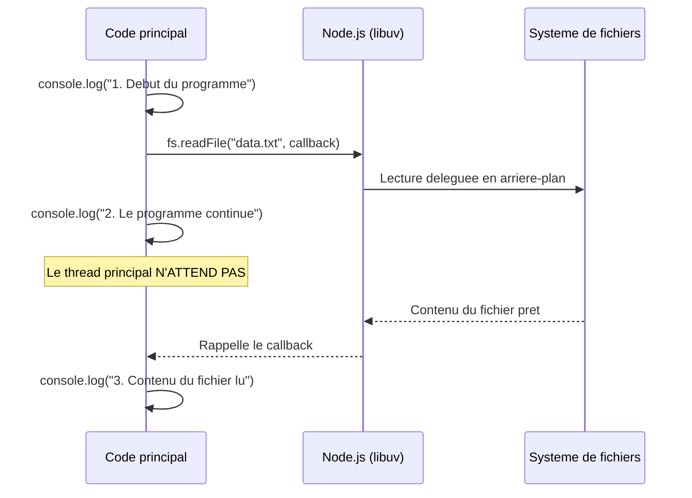
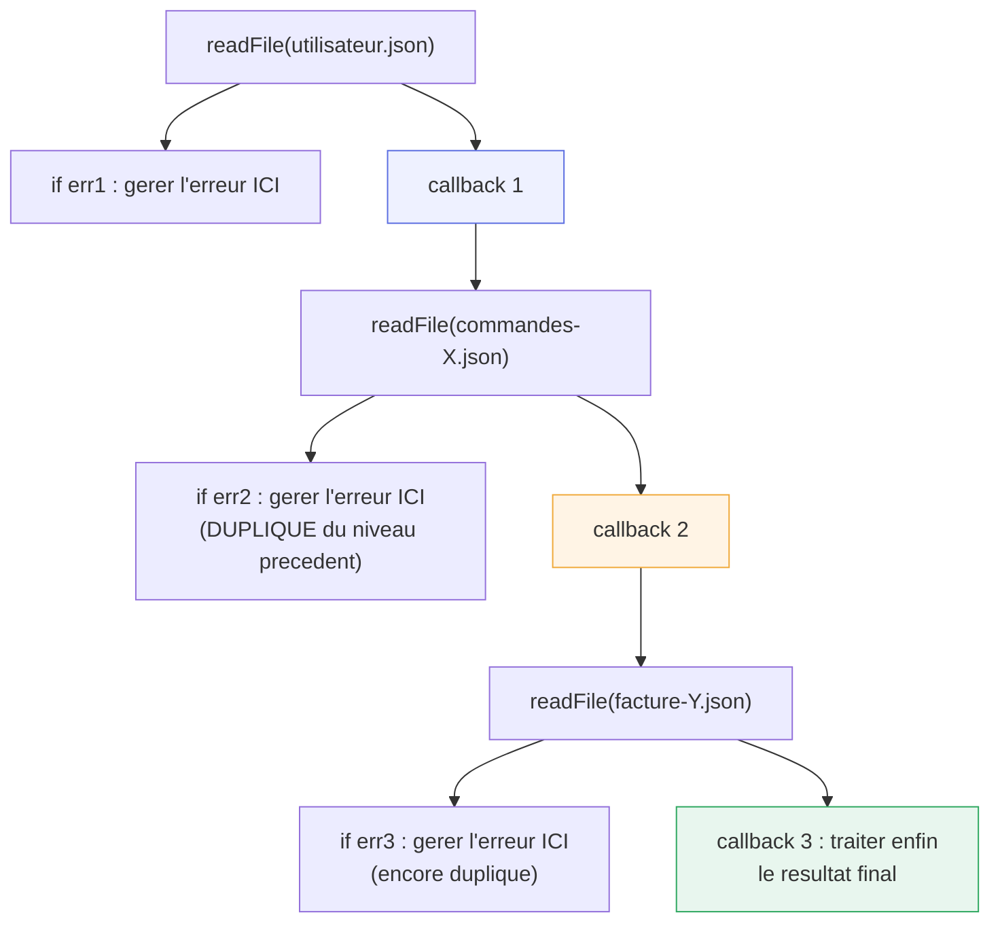

<div class="chapitre-titre-num">CHAPITRE 8</div>

# Callbacks

<div class="encadre objectif">
<span class="encadre-titre">🎯 Objectif du chapitre</span>
Comprendre le modèle de callback, la toute première façon de gérer l'asynchrone en JavaScript, ses conventions en Node.js, et ses limites (qui motivent les Promises du chapitre 9). À la fin de ce chapitre, tu sauras écrire et consommer une fonction à callback en respectant la convention "error-first", et tu comprendras précisément pourquoi le "Callback Hell" a poussé l'écosystème JavaScript à inventer autre chose.
</div>

<div class="encadre scenario">
<span class="encadre-titre">🎬 Mise en situation</span>
Tu reprends un vieux script Node.js écrit il y a plusieurs années : il enchaîne la lecture d'un fichier utilisateur, puis ses commandes, puis sa facture, chaque étape imbriquée dans la précédente. Le code dérive de plus en plus vers la droite de l'écran à chaque étape ajoutée, et une erreur oubliée dans un des niveaux intermédiaires provoque un plantage silencieux difficile à localiser. Comprendre exactement pourquoi ce style de code devient ingérable — pas seulement "qu'il est moche" — est la première étape avant de le refactoriser proprement avec les outils des chapitres 9 et 10.
</div>

## 8.1 Qu'est-ce qu'un callback

Un **callback** est simplement une fonction passée en argument à une autre fonction, pour être **rappelée plus tard**, typiquement une fois qu'une opération asynchrone se termine.

```js
const fs = require("fs");

console.log("1. Début du programme");

fs.readFile("data.txt", "utf8", (erreur, contenu) => {
  console.log("3. Contenu du fichier lu :", contenu);
});

console.log("2. Le programme continue SANS ATTENDRE la lecture du fichier");

// Ordre d'affichage réel :
// 1. Début du programme
// 2. Le programme continue SANS ATTENDRE la lecture du fichier
// 3. Contenu du fichier lu : ...
```

Ceci illustre concrètement le modèle non bloquant du chapitre 1 : `readFile` délègue la lecture du fichier en arrière-plan et **rappelle** la fonction callback fournie une fois l'opération terminée, sans jamais bloquer l'exécution du reste du programme.



<div class="encadre astuce">
<span class="encadre-titre">💡 Explication du schéma</span>
Ce diagramme de séquence rend visible ce que le chapitre 1 décrivait en théorie : la ligne 2 (`console.log("2. ...")`) s'exécute **avant** que le callback ne soit rappelé, précisément parce que la lecture du fichier est déléguée en arrière-plan pendant que le thread principal continue son travail.
</div>

## 8.2 La convention "error-first callback" de Node.js

<div class="encadre astuce">
<span class="encadre-titre">💡 Convention systématique dans toute l'API native de Node.js</span>
Par convention (respectée par `fs`, `http`, et la quasi-totalité des anciennes API Node.js à base de callbacks), le callback reçoit **toujours** l'erreur éventuelle en **premier paramètre** (`null` si tout s'est bien passé), suivi du résultat réel.
</div>

```js
fs.readFile("data.txt", "utf8", (erreur, contenu) => {
  if (erreur) {
    console.error("Erreur de lecture :", erreur.message);
    return; // toujours arrêter ici en cas d'erreur, ne pas continuer avec un "contenu" invalide
  }
  console.log(contenu);
});
```

<div class="encadre retenir">
<span class="encadre-titre">📌 À retenir</span>
"Error-first" n'est pas une règle imposée par le langage JavaScript lui-même, mais une **convention** adoptée par Node.js dès sa création et respectée par la quasi-totalité de son écosystème — au point que la reconnaître instantanément est attendu de tout développeur Node.js expérimenté.
</div>

## 8.3 Le "Callback Hell" (pyramide de la mort)

```js
// ❌ Callbacks imbriqués : chaque étape dépend du résultat de la précédente
fs.readFile("utilisateur.json", "utf8", (err1, donneesUtilisateur) => {
  if (err1) return console.error(err1);

  const utilisateur = JSON.parse(donneesUtilisateur);

  fs.readFile(`commandes-${utilisateur.id}.json`, "utf8", (err2, donneesCommandes) => {
    if (err2) return console.error(err2);

    const commandes = JSON.parse(donneesCommandes);

    fs.readFile(`facture-${commandes[0].id}.json`, "utf8", (err3, donneesFacture) => {
      if (err3) return console.error(err3);
      // ... et ainsi de suite, la pyramide continue de s'enfoncer vers la droite
      console.log(JSON.parse(donneesFacture));
    });
  });
});
```



<div class="encadre astuce">
<span class="encadre-titre">💡 Explication du schéma</span>
Chaque niveau imbriqué **duplique** sa propre gestion d'erreur (`if err1`, `if err2`, `if err3`), et le résultat final n'est disponible qu'au niveau le plus profond de l'imbrication. C'est exactement ce que les Promises (chapitre 9) résolvent : une seule chaîne linéaire, avec une gestion d'erreur centralisée en un seul `.catch()`, quel que soit le nombre d'étapes.
</div>

<div class="encadre attention">
<span class="encadre-titre">⚠️ Le vrai problème du Callback Hell n'est pas esthétique</span>
Au-delà de l'indentation croissante (problème purement visuel, contournable en nommant des fonctions séparées), le vrai problème est la **gestion d'erreur dupliquée** à chaque niveau (`if (err) return ...` répété), et la difficulté de combiner plusieurs opérations asynchrones **en parallèle** plutôt qu'en série. C'est précisément ce que les Promises (chapitre 9) et `async`/`await` (chapitre 10) résolvent structurellement.
</div>

## 8.4 Callbacks synchrones vs asynchrones

```js
// Callback SYNCHRONE : appelé immédiatement, dans le même tick d'exécution
[1, 2, 3].forEach((n) => console.log(n)); // callback de forEach : synchrone

// Callback ASYNCHRONE : appelé plus tard, après une opération différée
setTimeout(() => console.log("Plus tard"), 1000); // callback de setTimeout : asynchrone
```

<div class="encadre attention">
<span class="encadre-titre">⚠️ Ne pas confondre les deux : un piège classique avec des boucles et setTimeout</span>

```js
for (let i = 0; i < 3; i++) {
  setTimeout(() => console.log(i), 100); // affiche 0, 1, 2 (avec `let`, portée de bloc par itération)
}
```
Avec `var` au lieu de `let`, ce code afficherait `3, 3, 3` (toutes les callbacks partageraient la même variable `i`, dont la valeur finale est 3 au moment où les callbacks s'exécutent enfin) — un exemple concret de l'importance de `let` pour la portée de bloc, vue au chapitre 7.
</div>

## 8.5 Créer sa propre fonction à callback

```js
function diviser(a, b, callback) {
  if (b === 0) {
    return callback(new Error("Division par zéro impossible"));
  }
  callback(null, a / b); // convention error-first respectée
}

diviser(10, 2, (erreur, resultat) => {
  if (erreur) {
    console.error(erreur.message);
    return;
  }
  console.log(resultat); // 5
});
```

## Atelier — Ressentir concrètement le Callback Hell

<div class="encadre exercice">
<span class="encadre-titre">🛠️ Atelier 8 — Compter les niveaux d'imbrication</span>

**Objectif** : mesurer concrètement la complexité qui s'accumule à chaque étape asynchrone ajoutée à une chaîne de callbacks.

**Préparation** : Node.js installé, un dossier de travail.

**Étapes détaillées** :
1. Crée trois fichiers `etape1.json`, `etape2.json`, `etape3.json` avec un contenu JSON simple chacun (`{"id": 1}`, par exemple).
2. Écris un script qui lit `etape1.json`, puis utilise son contenu pour lire `etape2.json`, puis `etape3.json`, en callbacks imbriqués (comme la section 8.3).
3. Ajoute volontairement une quatrième étape (un `etape4.json`) en l'imbriquant de la même façon.
4. Observe l'indentation du code à ce stade, et compte le nombre de blocs `if (erreur)` désormais présents.

**Validation** : à 4 niveaux, le code doit être visiblement plus difficile à lire qu'à 2 niveaux, avec au moins 4 blocs de gestion d'erreur quasi identiques.

**Résultat attendu** : ressentir, pas seulement lire, pourquoi ce style ne passe pas à l'échelle au-delà de 2-3 étapes — la meilleure préparation pour apprécier réellement la solution du chapitre 9.

**Dépannage** : si une étape échoue silencieusement, vérifie que chaque `if (erreur) return ...` est bien présent — son absence est justement l'erreur fréquente n°1 ci-dessous.

**Nettoyage** : les fichiers `etape*.json` peuvent être supprimés après l'atelier.
</div>

## Erreurs fréquentes

<div class="encadre attention">
<span class="encadre-titre">⚠️ Erreur n°1 — Oublier le return après avoir géré l'erreur</span>

```js
fs.readFile("data.txt", "utf8", (erreur, contenu) => {
  if (erreur) {
    console.error(erreur.message);
    // ❌ pas de return : le code continue quand même !
  }
  console.log(contenu.toUpperCase()); // 💥 TypeError si erreur était définie (contenu est undefined)
});
```
Sans `return` après la gestion d'erreur, l'exécution continue avec des données potentiellement invalides — toujours `return` immédiatement après avoir traité une erreur dans un callback.
</div>

<div class="encadre attention">
<span class="encadre-titre">⚠️ Erreur n°2 — Appeler le callback plusieurs fois</span>

```js
function operationRisquee(callback) {
  if (Math.random() > 0.5) {
    callback(new Error("Échec"));
  }
  callback(null, "Succès"); // ❌ appelé MÊME si l'erreur ci-dessus l'a déjà été, sans return
}
```
Un callback appelé deux fois (une fois avec l'erreur, une fois avec le résultat) peut provoquer un comportement imprévisible chez l'appelant, qui ne s'attend à être rappelé qu'une seule fois — toujours `return` après le premier appel au callback.
</div>

## Débogage

<div class="encadre attention">
<span class="encadre-titre">🩺 Symptôme : "Cannot read properties of undefined" dans un callback</span>

- **Cause** : le code suppose que le résultat est valide sans avoir vérifié l'erreur en premier (erreur fréquente n°1 ci-dessus).
- **Diagnostic** : ajouter un `console.log(erreur)` en tout début de callback pour vérifier si une erreur était réellement présente avant d'accéder au résultat.
- **Solution** : toujours vérifier `if (erreur)` en tout premier, avec un `return` immédiat.
</div>

## En entreprise

- **API historiques encore en callbacks** : de nombreux modules npm plus anciens (et l'intégralité du module natif `fs` en version non-Promise) exposent encore une API à callbacks — savoir les reconnaître et les utiliser correctement reste indispensable, même dans un code moderne à base de `async`/`await`.
- **`util.promisify`** : Node.js fournit un utilitaire natif pour convertir une fonction à callback error-first en fonction retournant une Promise, permettant d'utiliser `async`/`await` (chapitre 10) même avec une ancienne API à callback.
- **Erreur classique observée** : une équipe qui mélange callbacks et Promises dans le même fichier sans convertir clairement les uns vers les autres, rendant le flux de contrôle difficile à suivre pour quiconque relit le code.

## Entretien technique

<div class="encadre exercice">
<span class="encadre-titre">💼 Questions fréquemment posées en entretien</span>

**Q1. "Qu'est-ce que la convention error-first callback ?"**
Réponse attendue : le callback reçoit toujours l'erreur éventuelle en premier paramètre (`null` si aucune erreur), suivi du résultat réel — une convention systématique dans l'API native de Node.js et une grande partie de son écosystème.

**Q2. "Quel est le vrai problème du Callback Hell, au-delà de l'esthétique ?"**
Réponse attendue : la duplication de la gestion d'erreur à chaque niveau d'imbrication, et la difficulté de composer plusieurs opérations asynchrones en parallèle plutôt qu'en série.

**Q3. "Que fait util.promisify ?"**
Réponse attendue : convertit une fonction à callback error-first en une fonction retournant une Promise, permettant de l'utiliser avec `async`/`await` sans réécrire la fonction originale.
</div>

## Optimisation, sécurité et maintenabilité

<div class="encadre securite">
<span class="encadre-titre">🔒 Sécurité</span>
Un callback appelé plusieurs fois par erreur (erreur fréquente n°2) peut, dans un contexte sensible (paiement, écriture en base de données), déclencher une action deux fois — un bug de callback mal maîtrisé peut donc avoir des conséquences bien réelles, pas seulement esthétiques.
</div>

<div class="encadre bonne-pratique">
<span class="encadre-titre">✅ Maintenabilité</span>
Nommer les fonctions callback plutôt que d'utiliser systématiquement des fonctions anonymes imbriquées réduit déjà une partie de la profondeur visuelle du Callback Hell, même avant de migrer vers les Promises.
</div>

## Résumé du chapitre

- Un callback est une fonction rappelée plus tard, typiquement à la fin d'une opération asynchrone.
- La convention Node.js "error-first" place toujours l'erreur éventuelle en premier paramètre du callback.
- Le "Callback Hell" (imbrication croissante) complique la gestion d'erreur et la composition d'opérations — résolu par les Promises (chapitre 9).
- Toujours `return` immédiatement après avoir traité une erreur dans un callback, pour éviter de continuer avec des données invalides.

## Quiz

<div class="encadre exercice">
<span class="encadre-titre">📝 QCM</span>

1. Dans la convention error-first, que représente le premier paramètre du callback ?
   - a) Le résultat de l'opération
   - b) L'erreur éventuelle (ou null)
   - c) Un identifiant de requête
   - d) Le contexte `this`

2. Que se passe-t-il si on oublie `return` après avoir géré une erreur dans un callback ?
   - a) Rien, le code s'arrête automatiquement
   - b) Le code continue à s'exécuter avec des données potentiellement invalides
   - c) Une erreur de syntaxe est levée
   - d) Le callback est rappelé automatiquement

3. Quel est le vrai problème structurel du Callback Hell ?
   - a) L'indentation visuelle uniquement
   - b) La duplication de gestion d'erreur et la difficulté de paralléliser
   - c) Il n'existe aucun vrai problème, juste une question de goût
   - d) Les callbacks sont plus lents que les Promises

**Corrigé** : 1-b, 2-b, 3-b.
</div>

<div class="encadre exercice">
<span class="encadre-titre">📝 Vrai ou Faux</span>

1. Tous les callbacks sont asynchrones. — **Faux** (`forEach`, par exemple, appelle son callback de façon synchrone).
2. La convention error-first est imposée par la syntaxe JavaScript elle-même. — **Faux** (c'est une convention adoptée par Node.js, pas une règle du langage).
3. Un callback ne devrait jamais être appelé plus d'une fois. — **Vrai**.
</div>

<div class="encadre exercice">
<span class="encadre-titre">📝 Question ouverte</span>

Pourquoi `[1,2,3].forEach(cb)` exécute-t-il `cb` de façon synchrone, alors que `fs.readFile(path, cb)` l'exécute de façon asynchrone ?

**Corrigé** : la nature synchrone ou asynchrone d'un callback dépend entièrement de la fonction qui l'appelle, pas du callback lui-même. `forEach` n'a aucune raison de différer son travail (parcourir un tableau déjà en mémoire est instantané), tandis que `readFile` délègue une opération I/O réellement lente (lecture disque) en arrière-plan, ce qui impose un rappel différé une fois l'opération terminée.
</div>

## Exercices

<div class="encadre exercice">
<span class="encadre-titre">📝 Exercice 8.1</span>

Écris une fonction `verifierAge(age, callback)` qui appelle `callback` avec une erreur si `age < 0` ou `age > 120`, et avec `null, true` si l'âge est valide, en suivant la convention error-first.
</div>

**Corrigé :**
```js
function verifierAge(age, callback) {
  if (age < 0 || age > 120) {
    return callback(new Error("Âge invalide : " + age));
  }
  callback(null, true);
}

verifierAge(25, (erreur, estValide) => {
  if (erreur) return console.error(erreur.message);
  console.log("Âge valide :", estValide);
});
```

## Checklist de fin de chapitre

<ul class="checklist">
<li>☐ Je sais expliquer ce qu'est un callback et à quoi il sert.</li>
<li>☐ Je connais la convention error-first et je l'applique dans mes propres fonctions.</li>
<li>☐ Je sais identifier un Callback Hell et expliquer son vrai problème (pas juste l'esthétique).</li>
<li>☐ Je distingue un callback synchrone d'un callback asynchrone.</li>
<li>☐ Je pense systématiquement à <code>return</code> après avoir géré une erreur dans un callback.</li>
</ul>

## FAQ

<dl class="faq">
<dt>Les callbacks sont-ils encore utilisés en 2026, ou complètement remplacés par async/await ?</dt>
<dd>Encore très présents, notamment dans l'API historique de nombreux modules npm et certaines API natives de Node.js. Comprendre les callbacks reste nécessaire même si le code neuf privilégie largement `async`/`await` (chapitre 10).</dd>

<dt>Peut-on convertir n'importe quelle fonction à callback en Promise ?</dt>
<dd>Oui, tant qu'elle respecte la convention error-first, via `util.promisify` (module natif `util` de Node.js) ou une conversion manuelle — approfondi au chapitre 9.</dd>

<dt>Pourquoi Node.js n'a-t-il pas adopté les Promises dès le départ ?</dt>
<dd>Les Promises n'ont été standardisées dans le langage JavaScript qu'avec ES6 (2015), plusieurs années après la création de Node.js (2009) — les callbacks étaient alors le seul mécanisme disponible pour gérer l'asynchrone.</dd>
</dl>

## Références et pour aller plus loin

- Documentation Node.js sur les conventions de callback error-first : [https://nodejs.org/api/errors.html#error-first-callbacks](https://nodejs.org/api/errors.html#error-first-callbacks)
- Documentation `util.promisify` : [https://nodejs.org/api/util.html#utilpromisifyoriginal](https://nodejs.org/api/util.html#utilpromisifyoriginal)

*Chapitre suivant : les Promises, qui structurent la composition d'opérations asynchrones sans imbrication croissante.*
