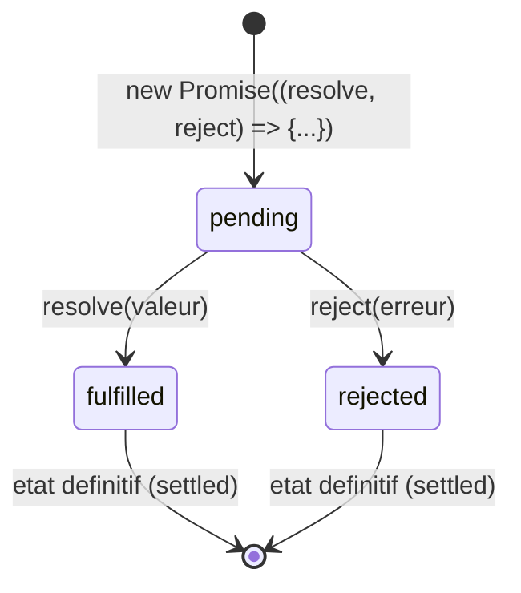

<div class="chapitre-titre-num">CHAPITRE 9</div>

# Promises

<div class="encadre objectif">
<span class="encadre-titre">🎯 Objectif du chapitre</span>
Comprendre ce qu'est une Promise, ses trois états, savoir la créer et la chaîner, et combiner plusieurs Promises en parallèle. À la fin de ce chapitre, tu sauras choisir entre `Promise.all`, `allSettled`, `race` et `any` selon le besoin réel, et éviter les deux pièges qui causent la majorité des bugs liés aux Promises en production.
</div>

<div class="encadre scenario">
<span class="encadre-titre">🎬 Mise en situation</span>
Le tableau de bord d'une application doit afficher, sur une seule page, les statistiques utilisateurs, les produits en rupture de stock et les commandes du jour — trois appels réseau indépendants. Un développeur junior les enchaîne l'un après l'autre avec trois `await` séquentiels (chapitre 10), et le tableau de bord met 3 secondes à charger alors que chaque appel individuel ne prend qu'une seconde. Le problème n'est pas la lenteur du serveur : c'est que rien n'empêchait ces trois appels de partir **en même temps**. Ce chapitre te donne exactement l'outil pour ça — et pour bien d'autres façons de combiner des opérations asynchrones selon le besoin réel.
</div>

## 9.1 Le problème résolu par les Promises

Rappel du chapitre 8 : les callbacks imbriqués créent une pyramide difficile à lire et à maintenir. Une **Promise** représente une valeur qui sera **disponible plus tard** (ou une erreur qui surviendra plus tard), avec une syntaxe qui évite l'imbrication croissante.

<div class="encadre astuce">
<span class="encadre-titre">💡 Analogie</span>
Une Promise, c'est un ticket de retrait donné au comptoir d'un pressing : tu ne repars pas avec tes vêtements immédiatement (la valeur n'est pas encore là), mais avec la garantie qu'ils seront prêts plus tard, avec une façon claire de savoir si ça s'est bien passé (le ticket peut être échangé contre les vêtements) ou mal passé (le pressing t'appelle pour dire qu'un vêtement est abîmé). Le ticket lui-même (la Promise) existe immédiatement, même si son contenu final n'est disponible que plus tard.
</div>

## 9.2 Les trois états d'une Promise



- **pending** : état initial, l'opération n'est pas encore terminée.
- **fulfilled** (résolue) : l'opération a réussi, une valeur est disponible.
- **rejected** (rejetée) : l'opération a échoué, une erreur est disponible.

<div class="encadre astuce">
<span class="encadre-titre">💡 Explication du schéma</span>
Ce diagramme d'état montre une règle absolue : depuis `pending`, une Promise ne peut transiter que **vers un seul** des deux états finaux, jamais les deux, et jamais revenir en arrière une fois `fulfilled` ou `rejected` atteint.
</div>

<div class="encadre astuce">
<span class="encadre-titre">💡 Une Promise ne peut changer d'état qu'une seule fois</span>
Une fois résolue ou rejetée, une Promise reste **définitivement** dans cet état — on parle de Promise "réglée" (*settled*). Appeler `resolve()` une seconde fois après un premier appel n'a aucun effet.
</div>

## 9.3 Créer une Promise

```js
function attendre(millisecondes) {
  return new Promise((resolve, reject) => {
    if (millisecondes < 0) {
      reject(new Error("La durée ne peut pas être négative"));
      return;
    }
    setTimeout(() => {
      resolve(`Attente de ${millisecondes}ms terminée`);
    }, millisecondes);
  });
}
```

## 9.4 Consommer une Promise avec .then() / .catch() / .finally()

```js
attendre(1000)
  .then((resultat) => {
    console.log(resultat); // "Attente de 1000ms terminée"
  })
  .catch((erreur) => {
    console.error("Erreur :", erreur.message);
  })
  .finally(() => {
    console.log("Terminé, succès ou échec"); // s'exécute TOUJOURS
  });
```

## 9.5 Chaîner des Promises (résoudre le Callback Hell)

```js
function lireUtilisateur(id) {
  return fetch(`/api/utilisateurs/${id}`).then((res) => res.json());
}
function lireCommandes(utilisateurId) {
  return fetch(`/api/commandes?utilisateur=${utilisateurId}`).then((res) => res.json());
}

// ✅ Chaînage PLAT, contrairement à l'imbrication du chapitre 8
lireUtilisateur(42)
  .then((utilisateur) => lireCommandes(utilisateur.id))
  .then((commandes) => {
    console.log(commandes);
  })
  .catch((erreur) => {
    // UN SEUL catch attrape une erreur survenue À N'IMPORTE QUELLE étape de la chaîne
    console.error("Erreur dans la chaîne :", erreur.message);
  });
```

<div class="encadre astuce">
<span class="encadre-titre">💡 Chaque .then() retourne une NOUVELLE Promise</span>
C'est ce mécanisme qui permet le chaînage : la valeur retournée par un `.then()` (qu'elle soit une valeur simple ou une nouvelle Promise) devient l'entrée du `.then()` suivant. Un seul `.catch()` final suffit à intercepter une erreur survenue à **n'importe quelle** étape précédente de la chaîne — un net progrès par rapport à la gestion d'erreur dupliquée à chaque niveau des callbacks imbriqués.
</div>

<div class="encadre retenir">
<span class="encadre-titre">📌 À retenir</span>
Callback Hell (chapitre 8) vs chaînage de Promises : même logique métier, mais une seule gestion d'erreur centralisée au lieu d'une par niveau, et une structure qui reste plate quel que soit le nombre d'étapes.
</div>

## 9.6 Promise.all : exécuter plusieurs opérations en parallèle

```js
const p1 = fetch("/api/utilisateurs").then((r) => r.json());
const p2 = fetch("/api/produits").then((r) => r.json());
const p3 = fetch("/api/commandes").then((r) => r.json());

Promise.all([p1, p2, p3])
  .then(([utilisateurs, produits, commandes]) => {
    console.log(utilisateurs, produits, commandes); // les TROIS résultats, dans l'ordre d'origine
  })
  .catch((erreur) => {
    // Si UNE SEULE des trois échoue, tout Promise.all est rejeté immédiatement
    console.error("Au moins une requête a échoué :", erreur.message);
  });
```

Ceci résout exactement le problème de la mise en situation d'ouverture : les trois appels réseau `p1`, `p2`, `p3` **démarrent simultanément** dès leur création (avant même `Promise.all`), et le tableau de bord n'attend que la durée du plus lent des trois — pas la somme des trois.

<div class="encadre attention">
<span class="encadre-titre">⚠️ Promise.all échoue entièrement si UNE SEULE Promise échoue</span>
Si `p2` échoue alors que `p1` et `p3` réussissent, `Promise.all` rejette **immédiatement** avec l'erreur de `p2`, sans attendre les autres ni exposer leurs résultats réussis. Si ce comportement n'est pas souhaité (vouloir connaître le résultat de chaque Promise, succès ou échec), `Promise.allSettled` est la bonne alternative (section 9.7).
</div>

## 9.7 Promise.allSettled, Promise.race, Promise.any

```js
// allSettled : attend TOUTES les Promises, quel que soit leur résultat individuel
const resultats = await Promise.allSettled([p1, p2, p3]);
resultats.forEach((r) => {
  if (r.status === "fulfilled") {
    console.log("Succès :", r.value);
  } else {
    console.log("Échec :", r.reason.message);
  }
});

// race : résout/rejette dès que la PREMIÈRE Promise se règle (succès ou échec)
Promise.race([p1, attendre(5000)]).then((resultat) => console.log(resultat));

// any : résout dès la PREMIÈRE Promise réussie ; ne rejette que si TOUTES échouent
Promise.any([p1, p2, p3]).then((premierSucces) => console.log(premierSucces));
```

| Méthode | Se règle quand... | Rejette quand... | Cas d'usage typique |
|---|---|---|---|
| `Promise.all` | Toutes réussissent | Une seule échoue (immédiat) | Plusieurs appels indépendants, tous nécessaires (mise en situation d'ouverture) |
| `Promise.allSettled` | Toutes se sont réglées (succès ou échec) | Jamais | Vouloir le résultat individuel de chaque opération, même partiel |
| `Promise.race` | La première se règle (succès OU échec) | Si la première réglée est un échec | Timeout (une Promise "limite de temps" contre l'opération réelle) |
| `Promise.any` | La première réussit | Seulement si TOUTES échouent | Interroger plusieurs sources équivalentes, garder la plus rapide qui réussit |

<div class="encadre astuce">
<span class="encadre-titre">💡 Analogie</span>
`Promise.all` : un chef d'orchestre qui attend que tous les musiciens aient fini leur partition, sinon rien ne compte. `Promise.race` : une course où seul le premier arrivé (peu importe s'il gagne ou trébuche) compte. `Promise.any` : la même course, mais seuls les coureurs qui terminent réellement comptent, on ignore ceux qui abandonnent. `Promise.allSettled` : un relevé de présence complet, qui note qui a réussi et qui a échoué, sans jamais s'arrêter en cours de route.
</div>

## 9.8 Promisifier une fonction à callback

```js
const fs = require("fs");
const util = require("util");

// util.promisify convertit automatiquement une fonction "error-first callback" (chapitre 8) en fonction Promise
const readFilePromise = util.promisify(fs.readFile);

readFilePromise("data.txt", "utf8")
  .then((contenu) => console.log(contenu))
  .catch((erreur) => console.error(erreur.message));
```

```js
// Alternative moderne : de nombreux modules Node.js fournissent déjà une version Promise
const fs = require("fs/promises");

fs.readFile("data.txt", "utf8")
  .then((contenu) => console.log(contenu))
  .catch((erreur) => console.error(erreur.message));
```

## Atelier — Paralléliser un chargement de tableau de bord

<div class="encadre exercice">
<span class="encadre-titre">🛠️ Atelier 9 — De séquentiel à parallèle</span>

**Objectif** : reproduire concrètement le problème et la solution de la mise en situation d'ouverture.

**Préparation** : Node.js installé (version 18+ pour `fetch` natif, sinon utiliser trois appels à `attendre()` de la section 9.3 comme simulation).

**Étapes détaillées** :
1. Crée trois fonctions simulant des appels réseau avec `attendre(1000)`, `attendre(1200)`, `attendre(800)` (section 9.3).
2. Écris une première version qui les enchaîne en **séquentiel** avec trois `.then()` successifs, et mesure le temps total avec `console.time`/`console.timeEnd`.
3. Écris une seconde version utilisant `Promise.all` pour les lancer en **parallèle**, et mesure à nouveau.
4. Compare les deux durées mesurées.

**Validation** : la version séquentielle doit prendre environ 3000ms (la somme des trois), la version parallèle environ 1200ms (le maximum des trois, pas la somme).

**Résultat attendu** : la preuve chronométrée, pas seulement théorique, de l'intérêt de `Promise.all` face à un enchaînement séquentiel inutile.

**Dépannage** : si les deux durées sont proches, vérifie que la version "parallèle" ne contient pas malencontreusement des `await` séquentiels avant `Promise.all` — les trois Promises doivent être créées **avant** d'être attendues.

**Nettoyage** : aucun.
</div>

## Erreurs fréquentes

<div class="encadre attention">
<span class="encadre-titre">⚠️ Erreur n°1 — Oublier de retourner la Promise dans un .then() pour chaîner correctement</span>

```js
// ❌ lireCommandes n'est PAS retourné : le .then() suivant reçoit undefined, pas les commandes
lireUtilisateur(42).then((utilisateur) => {
  lireCommandes(utilisateur.id); // manque un "return" ici !
}).then((commandes) => {
  console.log(commandes); // undefined
});
```
```js
// ✅ Toujours retourner explicitement la Promise pour poursuivre la chaîne correctement
lireUtilisateur(42).then((utilisateur) => {
  return lireCommandes(utilisateur.id);
}).then((commandes) => {
  console.log(commandes); // les commandes, correctement chaînées
});
```
</div>

<div class="encadre attention">
<span class="encadre-titre">⚠️ Erreur n°2 — Un .catch() manquant laisse une Promise "rejetée sans gestion"</span>
Une Promise rejetée sans aucun `.catch()` (ni `try/catch` avec `async`/`await`, chapitre 10) génère un avertissement `UnhandledPromiseRejection`, et dans les versions récentes de Node.js, peut même **faire planter le processus entier**. Toujours prévoir une gestion d'erreur sur toute chaîne de Promises.
</div>

<div class="encadre attention">
<span class="encadre-titre">⚠️ Erreur n°3 — Créer les Promises séquentiellement au lieu de les créer d'abord</span>

```js
// ❌ Chaque await bloque la création de la suivante : SÉQUENTIEL malgré l'apparence
const utilisateurs = await fetch("/api/utilisateurs").then((r) => r.json());
const produits = await fetch("/api/produits").then((r) => r.json());
```
Exactement le piège de la mise en situation d'ouverture — approfondi au chapitre 10 avec `async`/`await`.
</div>

## Débogage

<div class="encadre attention">
<span class="encadre-titre">🩺 Symptôme : "UnhandledPromiseRejectionWarning"</span>

- **Cause** : une Promise a été rejetée sans qu'aucun `.catch()` (ou `try/catch` équivalent) ne la gère.
- **Diagnostic** : le message d'avertissement indique généralement la ligne d'origine de la Promise rejetée.
- **Solution** : ajouter un `.catch()` à la chaîne concernée, ou entourer l'`await` correspondant d'un `try/catch` (chapitre 10).
</div>

## En entreprise

- **Parallélisation systématique des appels indépendants** : dans la quasi-totalité des équipes, un enchaînement séquentiel d'appels réseau indépendants (le bug de la mise en situation) est signalé en revue de code comme une optimisation évidente à corriger.
- **Timeout via Promise.race** : de nombreuses API internes implémentent un timeout applicatif via `Promise.race([appelReel, promesseTimeout])`, indépendamment du timeout réseau bas niveau, pour garantir qu'aucune requête ne reste bloquée indéfiniment.

## Entretien technique

<div class="encadre exercice">
<span class="encadre-titre">💼 Questions fréquemment posées en entretien</span>

**Q1. "Quelle est la différence entre Promise.all et Promise.allSettled ?"**
Réponse attendue : `Promise.all` rejette immédiatement dès qu'une seule Promise échoue, sans exposer les résultats des autres ; `Promise.allSettled` attend toujours toutes les Promises et retourne le statut individuel (succès ou échec) de chacune.

**Q2. "Comment paralléliser trois appels réseau indépendants ?"**
Réponse attendue : créer les trois Promises d'abord (sans `await` immédiat), puis les combiner avec `Promise.all([p1, p2, p3])` — les trois opérations démarrent simultanément dès leur création.

**Q3. "Que se passe-t-il si une Promise est rejetée sans .catch() ?"**
Réponse attendue : un avertissement `UnhandledPromiseRejectionWarning` est émis, et dans les versions récentes de Node.js, cela peut faire planter le processus entier.
</div>

## Optimisation, sécurité et maintenabilité

<div class="encadre performance">
<span class="encadre-titre">🚀 Performance</span>
La différence entre paralléliser et enchaîner séquentiellement des opérations indépendantes peut représenter un facteur de plusieurs secondes sur un temps de réponse API — exactement l'écart mesuré dans l'atelier de ce chapitre.
</div>

<div class="encadre bonne-pratique">
<span class="encadre-titre">✅ Bonne pratique</span>
Toujours se poser la question "ces opérations dépendent-elles réellement l'une de l'autre ?" avant d'enchaîner des `await` en série. Si la réponse est non, `Promise.all` (ou son équivalent avec `async`/`await`, chapitre 10) est presque toujours la bonne réponse.
</div>

## Résumé du chapitre

- Une Promise représente une valeur future, dans l'un de trois états : pending, fulfilled, rejected — définitivement réglée une fois résolue ou rejetée.
- `.then()`/`.catch()`/`.finally()` consomment une Promise ; chaque `.then()` retourne une nouvelle Promise, permettant un chaînage plat.
- `Promise.all` (échoue si une seule échoue), `Promise.allSettled` (attend toutes, expose chaque résultat), `Promise.race`/`Promise.any` combinent plusieurs Promises selon des besoins différents.
- `util.promisify` (ou les versions `/promises` natives comme `fs/promises`) convertit une fonction à callback en fonction basée sur les Promises.

## Quiz

<div class="encadre exercice">
<span class="encadre-titre">📝 QCM</span>

1. Combien d'états peut prendre une Promise ?
   - a) 2
   - b) 3
   - c) 4
   - d) Un nombre illimité

2. Quelle méthode utiliser pour connaître le résultat individuel de chaque Promise, même en cas d'échec partiel ?
   - a) Promise.all
   - b) Promise.allSettled
   - c) Promise.race
   - d) Promise.any

3. Que retourne chaque appel à `.then()` ?
   - a) La valeur résolue directement
   - b) Une nouvelle Promise
   - c) undefined systématiquement
   - d) Le même objet Promise d'origine

**Corrigé** : 1-b, 2-b, 3-b.
</div>

<div class="encadre exercice">
<span class="encadre-titre">📝 Vrai ou Faux</span>

1. Une Promise peut passer de `rejected` à `fulfilled` si on appelle `resolve()` après. — **Faux** (état définitif une fois réglée).
2. `Promise.all` attend toutes les Promises même si l'une échoue. — **Faux** (rejette immédiatement à la première erreur).
3. Créer plusieurs Promises avant de les `await` ensemble les exécute en parallèle. — **Vrai**.
</div>

<div class="encadre exercice">
<span class="encadre-titre">📝 Question ouverte</span>

Dans quel cas précis choisirais-tu `Promise.any` plutôt que `Promise.race` ?

**Corrigé** : quand plusieurs sources équivalentes sont interrogées en parallèle et que seul un **succès** compte (peu importe lequel est le plus rapide), en ignorant les échecs individuels tant qu'au moins une source réussit. `Promise.race` se règle sur la première Promise réglée, succès **ou échec** — si la source la plus rapide échoue, `Promise.race` rejette immédiatement même si une autre source plus lente aurait réussi, ce qui n'est généralement pas le comportement souhaité pour ce cas d'usage.
</div>

## Exercices

<div class="encadre exercice">
<span class="encadre-titre">📝 Exercice 9.1</span>

Écris une fonction `verifierAgePromise(age)` retournant une Promise qui se résout avec `true` si l'âge est valide (0-120), ou se rejette avec une erreur sinon (reprends la logique de l'exercice 8.1, mais avec des Promises).
</div>

**Corrigé :**
```js
function verifierAgePromise(age) {
  return new Promise((resolve, reject) => {
    if (age < 0 || age > 120) {
      reject(new Error("Âge invalide : " + age));
      return;
    }
    resolve(true);
  });
}

verifierAgePromise(25)
  .then((estValide) => console.log("Âge valide :", estValide))
  .catch((erreur) => console.error(erreur.message));
```

## Checklist de fin de chapitre

<ul class="checklist">
<li>☐ Je connais les trois états d'une Promise et leurs transitions possibles.</li>
<li>☐ Je sais créer et consommer une Promise avec then/catch/finally.</li>
<li>☐ Je sais chaîner des Promises sans oublier de return.</li>
<li>☐ Je sais choisir entre Promise.all, allSettled, race et any selon le besoin.</li>
<li>☐ Je sais promisifier une fonction à callback.</li>
</ul>

## FAQ

<dl class="faq">
<dt>Dois-je encore apprendre .then()/.catch() si async/await existe ?</dt>
<dd>Oui : `async`/`await` (chapitre 10) est du sucre syntaxique au-dessus des Promises, pas un système différent. Comprendre les Promises sous-jacentes reste nécessaire pour bien utiliser `Promise.all` et consorts, même dans du code écrit majoritairement en `async`/`await`.</dd>

<dt>Que se passe-t-il si je passe une valeur simple (pas une Promise) à Promise.all ?</dt>
<dd>`Promise.all` accepte un mélange de Promises et de valeurs simples — une valeur simple est automatiquement traitée comme une Promise déjà résolue avec cette valeur.</dd>

<dt>Une Promise peut-elle être annulée une fois créée ?</dt>
<dd>Pas nativement. Le pattern courant pour simuler une annulation combine `Promise.race` avec un `AbortController` (API native de Node.js/navigateur) qui rejette la Promise concernée sur demande.</dd>
</dl>

## Références et pour aller plus loin

- Documentation MDN sur Promise : [https://developer.mozilla.org/fr/docs/Web/JavaScript/Reference/Global_Objects/Promise](https://developer.mozilla.org/fr/docs/Web/JavaScript/Reference/Global_Objects/Promise)
- Documentation Node.js `fs/promises` : [https://nodejs.org/api/fs.html#promises-api](https://nodejs.org/api/fs.html#promises-api)

*Chapitre suivant : async/await, la syntaxe qui rend le code asynchrone aussi lisible que du code synchrone.*
