<div class="chapitre-titre-num">CHAPITRE 10</div>

# Async/Await

<div class="encadre objectif">
<span class="encadre-titre">🎯 Objectif du chapitre</span>
Maîtriser `async`/`await`, la syntaxe qui rend le code asynchrone aussi lisible qu'un code synchrone classique, et savoir gérer les erreurs et le parallélisme correctement avec elle. À la fin de ce chapitre, tu sauras repérer et corriger le piège de performance le plus fréquent chez les développeurs Node.js débutants : des `await` enchaînés qui devraient être parallélisés.
</div>

<div class="encadre scenario">
<span class="encadre-titre">🎬 Mise en situation</span>
Un test de charge révèle qu'un endpoint `/tableau-de-bord` de l'API d'un client répond en 900ms — nettement plus lent que les autres endpoints. En lisant le code, tu découvres cinq appels `await` à des services indépendants, enchaînés les uns après les autres, chacun prenant environ 180ms. Rien dans la logique métier n'exige cet ordre : les cinq résultats sont simplement assemblés dans le même objet de réponse à la fin. Ce chapitre t'apprend exactement à repérer ce genre de code — et à le corriger en une poignée de lignes, potentiellement pour diviser le temps de réponse par cinq.
</div>

## 10.1 async/await : du sucre syntaxique au-dessus des Promises

```js
// Avec .then() (chapitre 9)
function chargerDonnees() {
  return lireUtilisateur(42)
    .then((utilisateur) => lireCommandes(utilisateur.id))
    .then((commandes) => {
      console.log(commandes);
    })
    .catch((erreur) => {
      console.error(erreur.message);
    });
}

// Avec async/await : même logique, syntaxe QUASI-SYNCHRONE
async function chargerDonnees() {
  try {
    const utilisateur = await lireUtilisateur(42);
    const commandes = await lireCommandes(utilisateur.id);
    console.log(commandes);
  } catch (erreur) {
    console.error(erreur.message);
  }
}
```

<div class="encadre astuce">
<span class="encadre-titre">💡 async/await ne remplace pas les Promises, il les utilise</span>
`async`/`await` **est** entièrement basé sur les Promises du chapitre 9 — une fonction `async` retourne **toujours** une Promise, et `await` ne fait qu'attendre qu'une Promise se règle avant de continuer. Comprendre les Promises reste indispensable, même en n'écrivant plus jamais de `.then()` au quotidien.
</div>

## 10.2 Le mot-clé async

```js
async function direBonjour() {
  return "Bonjour"; // une fonction async retourne TOUJOURS une Promise, même pour une valeur simple
}

direBonjour().then((message) => console.log(message)); // "Bonjour"

// Équivalent : lever une exception dans une fonction async = rejeter la Promise retournée
async function echouerToujours() {
  throw new Error("Ça a échoué");
}
echouerToujours().catch((erreur) => console.error(erreur.message));
```

## 10.3 Le mot-clé await

```js
async function exemple() {
  console.log("1. Avant l'attente");
  const resultat = await attendre(1000); // met en PAUSE cette fonction (pas tout le programme) jusqu'à résolution
  console.log("3. Après l'attente :", resultat);
}

exemple();
console.log("2. Le reste du programme continue pendant l'attente");
```

<div class="encadre attention">
<span class="encadre-titre">⚠️ await ne peut être utilisé qu'à l'intérieur d'une fonction async</span>

```js
function normale() {
  const resultat = await attendre(1000); // ❌ SyntaxError : await n'est valide que dans une fonction async
}
```
Depuis Node.js récent, `await` est également autorisé au **niveau racine d'un module ES Modules** ("top-level await"), mais reste interdit dans une fonction classique non déclarée `async`, et dans les modules CommonJS classiques.
</div>

<div class="encadre retenir">
<span class="encadre-titre">📌 À retenir</span>
`await` met en pause **la fonction async courante**, jamais tout le programme ni le thread principal (rappel du chapitre 1). C'est précisément ce qui permet à la ligne "2. Le reste du programme continue" de s'afficher avant "3. Après l'attente" dans l'exemple ci-dessus.
</div>

## 10.4 try/catch : la gestion d'erreur avec async/await

```js
async function creerUtilisateur(donnees) {
  try {
    const utilisateurExistant = await UtilisateurRepository.trouverParEmail(donnees.email);
    if (utilisateurExistant) {
      throw new Error("Cet email est déjà utilisé");
    }
    const nouvelUtilisateur = await UtilisateurRepository.creer(donnees);
    return nouvelUtilisateur;
  } catch (erreur) {
    console.error("Échec de création :", erreur.message);
    throw erreur; // souvent utile de RE-lever l'erreur pour que l'appelant puisse aussi réagir (chapitre 19)
  }
}
```

## 10.5 Le piège classique : await en série vs Promise.all en parallèle

```js
// ❌ SÉQUENTIEL : chaque requête attend que la précédente soit TERMINÉE, alors qu'elles sont indépendantes
async function chargerTableauDeBordLent() {
  const utilisateurs = await UtilisateurRepository.compter();  // attend 200ms
  const produits = await ProduitRepository.compter();          // attend encore 200ms APRÈS le premier
  const commandes = await CommandeRepository.compter();         // attend encore 200ms APRÈS le second
  return { utilisateurs, produits, commandes }; // Total : ~600ms
}

// ✅ PARALLÈLE : les trois requêtes indépendantes démarrent EN MÊME TEMPS
async function chargerTableauDeBordRapide() {
  const [utilisateurs, produits, commandes] = await Promise.all([
    UtilisateurRepository.compter(),
    ProduitRepository.compter(),
    CommandeRepository.compter(),
  ]);
  return { utilisateurs, produits, commandes }; // Total : ~200ms (le temps de la plus lente des trois)
}
```



<div class="encadre astuce">
<span class="encadre-titre">💡 Explication du schéma</span>

```mermaid
gantt
    title Sequentiel (600ms) vs Parallele (200ms)
    dateFormat X
    axisFormat %Lms

    section Sequentiel
    UtilisateurRepository.compter() : 0, 200
    ProduitRepository.compter()     : 200, 400
    CommandeRepository.compter()    : 400, 600

    section Parallele
    UtilisateurRepository.compter() : 0, 200
    ProduitRepository.compter()     : 0, 200
    CommandeRepository.compter()    : 0, 200
```

La version séquentielle additionne les trois durées (200 + 200 + 200 = 600ms) parce que chaque `await` bloque le démarrage du suivant. La version parallèle démarre les trois en même temps ; le temps total n'est jamais que celui de l'opération **la plus lente** des trois (200ms), pas leur somme — exactement le facteur 3 (ou 5, dans la mise en situation d'ouverture) que la parallélisation peut gagner.
</div>

<div class="encadre attention">
<span class="encadre-titre">⚠️ Erreur de performance très fréquente chez les débutants</span>
Enchaîner des `await` un par un pour des opérations **totalement indépendantes** (qui ne dépendent pas du résultat les unes des autres) gaspille du temps en attendant inutilement en série ce qui pourrait s'exécuter en parallèle. La règle : si une opération asynchrone ne dépend pas du résultat d'une autre, les lancer via `Promise.all` plutôt que des `await` successifs.
</div>

## 10.6 await dans une boucle : un autre piège de performance

```js
// ❌ Chaque itération ATTEND la précédente, même si les appels sont indépendants
async function envoyerTousLesEmails(destinataires) {
  for (const destinataire of destinataires) {
    await envoyerEmail(destinataire); // sérialise TOUS les envois, un par un
  }
}

// ✅ Lance tous les envois en parallèle, attend qu'ils soient TOUS terminés
async function envoyerTousLesEmailsRapide(destinataires) {
  await Promise.all(destinataires.map((destinataire) => envoyerEmail(destinataire)));
}
```

<div class="encadre astuce">
<span class="encadre-titre">💡 Nuance : le parallélisme n'est pas toujours souhaitable</span>
Envoyer des centaines d'emails ou requêtes en parallèle sans limite peut saturer un service externe (limite de débit d'un fournisseur SMTP, chapitre 27) ou une base de données. Pour un grand volume, une librairie de contrôle de concurrence (comme `p-limit`) permet de paralléliser **par lots** plutôt que tout d'un coup.
</div>

<div class="encadre performance">
<span class="encadre-titre">🚀 Performance</span>
La règle de décision : opérations **dépendantes** (le résultat de l'une nourrit l'entrée de la suivante) → `await` séquentiel, obligatoire. Opérations **indépendantes** → `Promise.all`, sauf volume important nécessitant une limite de concurrence.
</div>

## Atelier — Diagnostiquer et corriger le tableau de bord lent

<div class="encadre exercice">
<span class="encadre-titre">🛠️ Atelier 10 — Reproduire la mise en situation d'ouverture</span>

**Objectif** : chronométrer concrètement l'écart entre séquentiel et parallèle sur un cas à 5 opérations, comme dans la mise en situation.

**Préparation** : Node.js installé, une fonction utilitaire `attendre(ms)` (chapitre 9, section 9.3).

**Étapes détaillées** :
1. Crée 5 fonctions simulant des services indépendants, chacune `attendre(180)`.
2. Écris une fonction `chargerTableauDeBordLent` qui les `await` une par une, chronométrée avec `console.time`/`console.timeEnd`.
3. Écris `chargerTableauDeBordRapide` qui les combine avec `Promise.all`, chronométrée de la même façon.
4. Compare les deux durées.

**Validation** : la version lente doit approcher 900ms (5 × 180ms), la version rapide environ 180ms.

**Résultat attendu** : la preuve chronométrée exacte du scénario de l'endpoint lent de la mise en situation d'ouverture, et sa correction.

**Dépannage** : si les durées sont proches, vérifie que `.map()` crée bien toutes les Promises avant que `Promise.all` ne les attende — un `await` glissé par erreur à l'intérieur du `.map()` resérialiserait tout.

**Nettoyage** : aucun.
</div>

## Erreurs fréquentes

<div class="encadre attention">
<span class="encadre-titre">⚠️ Erreur n°1 — Oublier await, obtenir une Promise au lieu de la valeur attendue</span>

```js
async function exemple() {
  const utilisateur = lireUtilisateur(42); // ❌ "await" oublié !
  console.log(utilisateur.nom); // 💥 undefined : "utilisateur" est une Promise, pas l'objet attendu
}
```
</div>

<div class="encadre attention">
<span class="encadre-titre">⚠️ Erreur n°2 — Fonction async sans gestion d'erreur, dans un contexte qui ne la propage pas</span>
Dans un contrôleur Express (chapitre 13-15), une erreur levée dans une fonction `async` non entourée de `try/catch` (ou sans middleware de capture dédié, chapitre 19) peut ne **jamais** atteindre le gestionnaire d'erreurs global d'Express, contrairement au code synchrone. Ce point est développé en détail au chapitre 19.
</div>

<div class="encadre attention">
<span class="encadre-titre">⚠️ Erreur n°3 — await séquentiel sur des opérations indépendantes</span>
Exactement le sujet central de ce chapitre et de sa mise en situation d'ouverture — l'erreur de performance la plus fréquente observée chez les développeurs Node.js débutants, et l'une des plus simples à corriger une fois repérée.
</div>

## Débogage

<div class="encadre attention">
<span class="encadre-titre">🩺 Symptôme : un endpoint API anormalement lent sans erreur applicative</span>

- **Cause probable** : des `await` séquentiels sur des opérations indépendantes (exactement la mise en situation d'ouverture).
- **Diagnostic** : chronométrer chaque `await` individuellement (`console.time` autour de chaque appel), ou utiliser un profileur ; une somme de durées proches du temps de réponse total est un signal fort de sérialisation évitable.
- **Solution** : identifier les opérations réellement indépendantes et les regrouper via `Promise.all`.
</div>

<div class="encadre attention">
<span class="encadre-titre">🩺 Symptôme : "[object Promise]" affiché au lieu d'une vraie valeur</span>

- **Cause** : `await` oublié devant un appel de fonction `async` (erreur fréquente n°1).
- **Solution** : ajouter `await` devant l'appel concerné.
</div>

## En entreprise

- **Revue de performance systématique** : de nombreuses équipes intègrent une recherche de `await` séquentiels évitables comme point de contrôle standard en revue de code, exactement comme la découverte de la mise en situation d'ouverture.
- **Limite de concurrence en production** : l'envoi en masse (emails, notifications, appels vers une API tierce à quota limité) utilise presque toujours une limite de concurrence (`p-limit` ou équivalent), jamais un `Promise.all` sans limite sur des milliers d'éléments.

## Entretien technique

<div class="encadre exercice">
<span class="encadre-titre">💼 Questions fréquemment posées en entretien</span>

**Q1. "Que retourne une fonction déclarée async, même si elle ne contient aucun await ?"**
Réponse attendue : toujours une Promise, même pour une valeur de retour simple — elle est automatiquement enveloppée dans une Promise résolue.

**Q2. "Comment repérerais-tu un problème de performance lié à async/await dans une revue de code ?"**
Réponse attendue : chercher des `await` consécutifs sur des appels dont les résultats ne dépendent pas les uns des autres, candidats à un regroupement via `Promise.all`.

**Q3. "Pourquoi await dans une boucle for...of peut-il être un problème ?"**
Réponse attendue : chaque itération attend la précédente avant de démarrer, sérialisant des opérations potentiellement indépendantes — `Promise.all(tableau.map(...))` les paralléliserait, sous réserve d'une limite de concurrence si le volume est important.
</div>

## Optimisation, sécurité et maintenabilité

<div class="encadre bonne-pratique">
<span class="encadre-titre">✅ Bonne pratique</span>
Toujours envelopper le code `async` d'un contrôleur Express dans un `try/catch` (ou un middleware de capture dédié, chapitre 19) — une erreur non gérée dans une fonction `async` appelée par Express peut sinon rester silencieuse côté client, sans réponse HTTP claire.
</div>

## Résumé du chapitre

- `async`/`await` est du sucre syntaxique au-dessus des Promises, rendant le code asynchrone lisible comme du code synchrone.
- Une fonction `async` retourne toujours une Promise ; `throw` à l'intérieur rejette cette Promise.
- `try/catch` gère les erreurs d'un bloc `await`, de façon bien plus lisible qu'une chaîne `.catch()`.
- Des `await` successifs sur des opérations **indépendantes** gaspillent du temps : préférer `Promise.all` pour les paralléliser.

## Quiz

<div class="encadre exercice">
<span class="encadre-titre">📝 QCM</span>

1. Que retourne toujours une fonction déclarée `async` ?
   - a) La valeur littérale du `return`
   - b) Une Promise
   - c) undefined
   - d) Un callback

2. Trois appels indépendants enchaînés avec await successifs prennent 200ms chacun. Quelle est la durée totale ?
   - a) 200ms
   - b) 400ms
   - c) 600ms
   - d) Impossible à déterminer

3. Où `await` peut-il être utilisé ?
   - a) N'importe où dans le code
   - b) Uniquement dans une fonction async (ou au niveau racine d'un module ESM)
   - c) Uniquement dans un callback
   - d) Uniquement dans une boucle

**Corrigé** : 1-b, 2-c, 3-b.
</div>

<div class="encadre exercice">
<span class="encadre-titre">📝 Vrai ou Faux</span>

1. `await` bloque le thread principal de Node.js pendant l'attente. — **Faux** (il met en pause uniquement la fonction async courante).
2. `Promise.all(tableau.map(fn))` exécute les appels de fn en parallèle. — **Vrai**.
3. Une erreur `throw`ée dans une fonction async fait planter tout le processus, sans possibilité de la rattraper. — **Faux** (rejette la Promise retournée, rattrapable via `.catch()` ou `try/catch` chez l'appelant).
</div>

<div class="encadre exercice">
<span class="encadre-titre">📝 Question ouverte</span>

Un développeur remplace systématiquement TOUS ses `await` séquentiels par `Promise.all`, même quand une étape dépend du résultat de la précédente. Que va-t-il se passer, et pourquoi est-ce une erreur ?

**Corrigé** : `Promise.all` créerait toutes les Promises **immédiatement**, y compris celles qui ont besoin d'une donnée produite par une étape précédente — cette donnée ne serait pas encore disponible au moment de la création de la Promise dépendante, provoquant une erreur ou un comportement incorrect (valeur `undefined` passée trop tôt). La parallélisation ne s'applique qu'aux opérations réellement **indépendantes** ; une dépendance réelle entre étapes impose un `await` séquentiel.
</div>

## Exercices

<div class="encadre exercice">
<span class="encadre-titre">📝 Exercice 10.1</span>

Réécris cette fonction séquentielle pour paralléliser les trois appels indépendants avec `Promise.all` :
```js
async function chargerProfil(utilisateurId) {
  const utilisateur = await UtilisateurRepository.trouverParId(utilisateurId);
  const commandes = await CommandeRepository.trouverParUtilisateur(utilisateurId);
  const notifications = await NotificationRepository.trouverParUtilisateur(utilisateurId);
  return { utilisateur, commandes, notifications };
}
```
</div>

**Corrigé :**
```js
async function chargerProfil(utilisateurId) {
  const [utilisateur, commandes, notifications] = await Promise.all([
    UtilisateurRepository.trouverParId(utilisateurId),
    CommandeRepository.trouverParUtilisateur(utilisateurId),
    NotificationRepository.trouverParUtilisateur(utilisateurId),
  ]);
  return { utilisateur, commandes, notifications };
}
```

## Checklist de fin de chapitre

<ul class="checklist">
<li>☐ Je comprends qu'une fonction async retourne toujours une Promise.</li>
<li>☐ Je sais gérer les erreurs avec try/catch autour d'un await.</li>
<li>☐ Je sais repérer des await séquentiels qui devraient être parallélisés.</li>
<li>☐ Je sais paralléliser un traitement sur un tableau avec map + Promise.all.</li>
<li>☐ Je connais la limite du parallélisme illimité (saturation d'un service externe).</li>
</ul>

## FAQ

<dl class="faq">
<dt>async/await est-il plus rapide que .then() ?</dt>
<dd>Non, les performances sont identiques puisque `async`/`await` est du sucre syntaxique au-dessus des mêmes Promises. Le bénéfice est uniquement la lisibilité du code, pas la vitesse d'exécution.</dd>

<dt>Puis-je utiliser await en dehors d'une fonction async ?</dt>
<dd>Uniquement au niveau racine d'un module ES Modules ("top-level await", chapitre 6) dans les versions récentes de Node.js. Dans une fonction classique ou un module CommonJS, `await` hors d'une fonction `async` provoque une erreur de syntaxe.</dd>

<dt>Comment limiter la concurrence si je ne veux pas paralléliser 10 000 appels d'un coup ?</dt>
<dd>Une bibliothèque comme `p-limit` permet de traiter un grand tableau par lots de taille contrôlée, gardant les bénéfices de la parallélisation sans saturer le service appelé.</dd>
</dl>

## Références et pour aller plus loin

- Documentation MDN sur async/await : [https://developer.mozilla.org/fr/docs/Web/JavaScript/Reference/Statements/async_function](https://developer.mozilla.org/fr/docs/Web/JavaScript/Reference/Statements/async_function)
- Documentation MDN sur await : [https://developer.mozilla.org/fr/docs/Web/JavaScript/Reference/Operators/await](https://developer.mozilla.org/fr/docs/Web/JavaScript/Reference/Operators/await)

*Chapitre suivant : la gestion des fichiers avec le module fs.*
