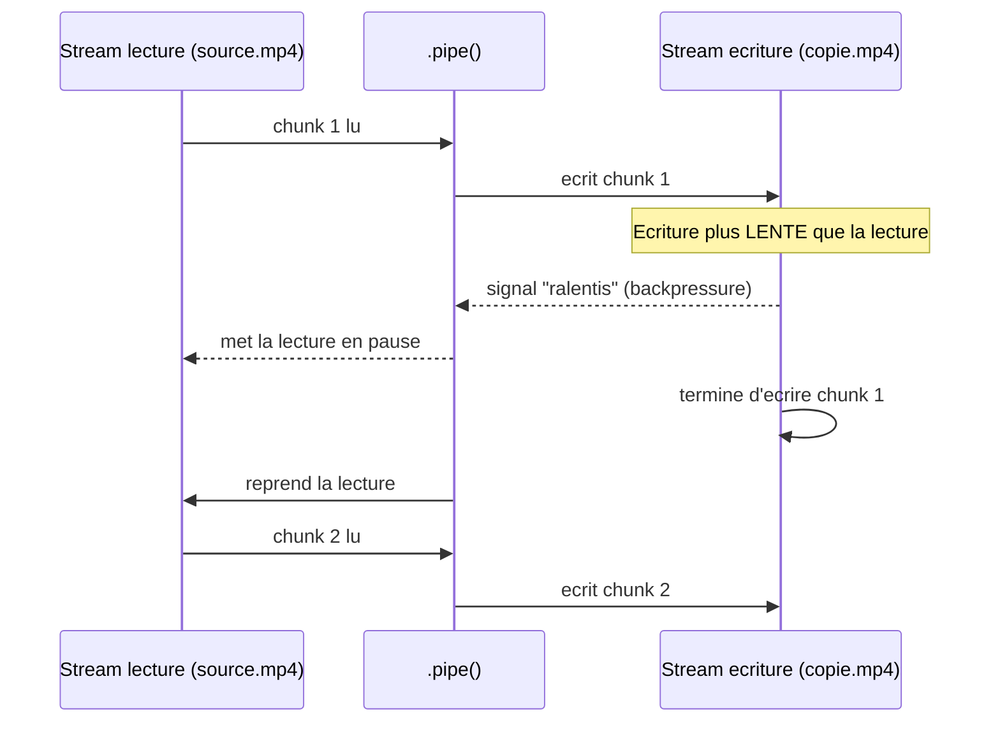

<div class="chapitre-titre-num">CHAPITRE 11</div>

# Gestion des fichiers

<div class="encadre objectif">
<span class="encadre-titre">🎯 Objectif du chapitre</span>
Maîtriser le module `fs` (système de fichiers) dans ses trois variantes (callback, Promise, synchrone), et comprendre les Streams pour traiter de gros fichiers efficacement. À la fin de ce chapitre, tu sauras choisir la bonne variante de `fs` selon le contexte, et expliquer pourquoi un Stream peut copier un fichier de plusieurs gigaoctets sans jamais saturer la mémoire du serveur.
</div>

<div class="encadre scenario">
<span class="encadre-titre">🎬 Mise en situation</span>
Un client te signale que son serveur "plante" (processus tué par le système, mémoire épuisée) dès qu'un utilisateur exporte un rapport CSV volumineux — plusieurs centaines de milliers de lignes. En lisant le code, tu trouves `fs.readFileSync()` chargeant le fichier entier en mémoire avant de le traiter ligne par ligne. Le problème n'est pas le volume de données en soi : c'est de charger la totalité d'un fichier avant même de commencer à le traiter, plutôt que de le lire par petits morceaux. Ce chapitre t'explique précisément comment les Streams résolvent ce problème, dans exactement ce genre de situation.
</div>

## 11.1 Le module fs : trois façons de faire la même chose

```js
const fs = require("fs");             // API à callbacks (historique)
const fsPromises = require("fs/promises"); // API à Promises (recommandée avec async/await)
// fs.readFileSync(...)                 // API synchrone (bloque le thread, cas d'usage restreints)
```

| Variante | Syntaxe | Bloque le thread ? | Cas d'usage recommandé |
|---|---|---|---|
| Callback | `fs.readFile(chemin, cb)` | Non | Code legacy, rarement choisi pour du code neuf |
| Promise | `fs.promises.readFile()` / `require("fs/promises")` | Non | **Recommandée** pour tout code neuf avec `async`/`await` |
| Synchrone | `fs.readFileSync(chemin)` | **Oui** | Uniquement au démarrage de l'application, jamais pendant une requête |

## 11.2 Lire un fichier

```js
// Avec Promises (recommandé)
const fs = require("fs/promises");

async function lireConfig() {
  const contenu = await fs.readFile("config.json", "utf8");
  return JSON.parse(contenu);
}
```

```js
// Version SYNCHRONE : bloque le thread principal jusqu'à la fin de la lecture
const fs = require("fs");
const contenu = fs.readFileSync("config.json", "utf8");
```

<div class="encadre attention">
<span class="encadre-titre">⚠️ Ne jamais utiliser les méthodes *Sync dans le traitement d'une requête HTTP</span>
Rappel du chapitre 1 : Node.js exécute le code sur un thread unique. Une méthode synchrone comme `readFileSync` **bloque ce thread** jusqu'à la fin de l'opération, empêchant le traitement de **toutes les autres requêtes** en attente pendant ce temps. Les méthodes `*Sync` ne sont acceptables qu'au **démarrage** de l'application (avant que le serveur n'accepte de requêtes), jamais dans un contrôleur ou middleware traitant une requête utilisateur.
</div>

## 11.3 Écrire un fichier

```js
const fs = require("fs/promises");

async function sauvegarderLog(message) {
  await fs.writeFile("app.log", message + "\n", { flag: "a" }); // "a" = append, ajoute sans écraser
}

async function ecrireConfig(config) {
  await fs.writeFile("config.json", JSON.stringify(config, null, 2)); // écrase le fichier existant
}
```

## 11.4 Vérifier l'existence, créer des dossiers, supprimer

```js
const fs = require("fs/promises");
const path = require("path");

async function assurerDossierUploads() {
  const dossier = path.join(__dirname, "uploads");
  try {
    await fs.access(dossier); // lève une erreur si le dossier n'existe pas
  } catch {
    await fs.mkdir(dossier, { recursive: true }); // recursive : crée aussi les dossiers parents manquants
  }
}

async function supprimerFichier(chemin) {
  await fs.unlink(chemin);
}
```

## 11.5 Le module path : construire des chemins de façon portable

```js
const path = require("path");

// ❌ Concaténation manuelle : casse sur Windows (antislash) vs Linux/macOS (slash)
const cheminFragile = __dirname + "/uploads/" + "photo.jpg";

// ✅ path.join gère automatiquement le bon séparateur selon le système d'exploitation
const cheminSur = path.join(__dirname, "uploads", "photo.jpg");

console.log(path.extname("photo.jpg"));   // ".jpg"
console.log(path.basename("/a/b/photo.jpg")); // "photo.jpg"
console.log(path.dirname("/a/b/photo.jpg"));  // "/a/b"
console.log(path.resolve("uploads", "photo.jpg")); // chemin ABSOLU, résolu depuis le dossier courant
```

## 11.6 Les Streams : traiter de gros fichiers sans tout charger en mémoire

<div class="encadre attention">
<span class="encadre-titre">⚠️ readFile charge le fichier ENTIER en mémoire</span>
`fs.readFile` charge la **totalité** du contenu d'un fichier en mémoire avant de le retourner. Pour un fichier de quelques Ko, aucun problème. Pour un fichier vidéo de plusieurs Go, cela peut épuiser la mémoire disponible du serveur. Les **Streams** résolvent ce problème en traitant les données **par morceaux** (chunks), sans jamais charger l'intégralité en mémoire.
</div>


<div class="encadre astuce">
<span class="encadre-titre">💡 Explication du schéma</span>
Avec `readFile`, la mémoire utilisée est proportionnelle à la taille **totale** du fichier — un fichier de 2 Go nécessite (au moins) 2 Go de RAM disponible. Avec un Stream, la mémoire utilisée à un instant donné ne dépend que de la taille d'un **chunk** (souvent 64 Ko par défaut), quelle que soit la taille totale du fichier — c'est ce qui permet de traiter un fichier de 2 Go, ou de 200 Go, avec la même empreinte mémoire minime.
</div>

```js
const fs = require("fs");

const streamLecture = fs.createReadStream("gros-fichier.csv", { encoding: "utf8" });

streamLecture.on("data", (chunk) => {
  console.log("Morceau reçu :", chunk.length, "caractères");
});

streamLecture.on("end", () => {
  console.log("Lecture terminée");
});

streamLecture.on("error", (erreur) => {
  console.error("Erreur de lecture :", erreur.message);
});
```

```js
// Copier un fichier volumineux SANS jamais le charger entièrement en mémoire
const streamLecture = fs.createReadStream("source.mp4");
const streamEcriture = fs.createWriteStream("copie.mp4");

streamLecture.pipe(streamEcriture); // "pipe" relie directement la sortie de l'un à l'entrée de l'autre

streamEcriture.on("finish", () => console.log("Copie terminée"));
```



<div class="encadre astuce">
<span class="encadre-titre">💡 .pipe() : la façon idiomatique de connecter des Streams</span>
`.pipe()` gère automatiquement le rythme de transfert (*backpressure*, illustré ci-dessus) : si la destination (écriture) est plus lente que la source (lecture), Node.js ralentit automatiquement la lecture pour éviter d'accumuler des données non écrites en mémoire — un mécanisme important pour le téléversement de fichiers volumineux (chapitre 26).
</div>

<div class="encadre retenir">
<span class="encadre-titre">📌 À retenir</span>
Règle de décision simple : fichier de configuration, petit JSON, template HTML → <code>fs.readFile</code>/<code>fs.promises.readFile</code> suffit largement. Fichier potentiellement volumineux dont la taille n'est pas maîtrisée à l'avance (upload utilisateur, export de rapport, vidéo) → Streams, systématiquement.
</div>

## Atelier — Comparer readFile et Stream sur un gros fichier

<div class="encadre exercice">
<span class="encadre-titre">🛠️ Atelier 11 — Observer la mémoire utilisée</span>

**Objectif** : reproduire concrètement le problème de la mise en situation d'ouverture, et sa solution.

**Préparation** : générer un fichier CSV volumineux de test (quelques centaines de milliers de lignes, un simple script de génération répétitive suffit).

**Étapes détaillées** :
1. Écris un script qui lit ce fichier avec `fs.readFileSync`, et affiche `process.memoryUsage().heapUsed` avant et après la lecture.
2. Écris un second script qui lit le même fichier avec `fs.createReadStream`, comptant simplement le nombre de chunks reçus via l'événement `data`, et affiche à nouveau `process.memoryUsage().heapUsed` pendant le traitement.
3. Compare les deux mesures de mémoire.

**Validation** : la version `readFileSync` doit montrer un bond de mémoire proportionnel à la taille du fichier ; la version Stream doit rester quasiment stable, peu importe la taille du fichier testé.

**Résultat attendu** : une preuve mesurée, pas seulement théorique, de pourquoi les Streams évitent le plantage de la mise en situation d'ouverture.

**Dépannage** : si les deux mesures semblent proches, vérifie que le fichier de test est réellement volumineux (plusieurs dizaines de Mo au minimum) pour que la différence devienne mesurable.

**Nettoyage** : supprime le fichier CSV de test généré.
</div>

## Erreurs fréquentes

<div class="encadre attention">
<span class="encadre-titre">⚠️ Erreur n°1 — Chemins relatifs fragiles selon le dossier de lancement du script</span>

```js
// ❌ Fragile : dépend du dossier depuis lequel "node index.js" est lancé
fs.readFile("config.json", ...);
```
```js
// ✅ Toujours ancrer les chemins sur __dirname (l'emplacement RÉEL du fichier de code, invariable)
fs.readFile(path.join(__dirname, "config.json"), ...);
```
Un chemin relatif comme `"config.json"` est résolu par rapport au **répertoire de travail courant** du processus (celui d'où la commande `node` a été lancée), pas par rapport à l'emplacement du fichier source — une source de bugs fréquente dès que le script est lancé depuis un autre dossier ou par un gestionnaire de processus (PM2, Docker).
</div>

<div class="encadre attention">
<span class="encadre-titre">⚠️ Erreur n°2 — Utiliser readFile sur un fichier dont la taille n'est pas maîtrisée</span>
Exactement le piège de la mise en situation d'ouverture : un fichier utilisateur téléversé peut avoir n'importe quelle taille. Traiter systématiquement les fichiers potentiellement volumineux via des Streams évite ce risque, quelle que soit la taille réellement rencontrée en production.
</div>

## Débogage

<div class="encadre attention">
<span class="encadre-titre">🩺 Symptôme : "JavaScript heap out of memory" en traitant un fichier</span>

- **Cause** : très probablement un `readFile`/`readFileSync` sur un fichier trop volumineux pour la mémoire disponible.
- **Diagnostic** : identifier l'opération de lecture concernée et estimer la taille réelle du fichier en cause.
- **Solution** : remplacer par un Stream (`createReadStream`), traitant les données par morceaux.
</div>

<div class="encadre attention">
<span class="encadre-titre">🩺 Symptôme : "ENOENT: no such file or directory"</span>

- **Cause** : chemin relatif mal résolu (erreur fréquente n°1) ou fichier réellement absent.
- **Solution** : vérifier le chemin absolu réellement utilisé (`console.log(path.join(__dirname, ...))`) avant l'appel `fs`.
</div>

## En entreprise

- **Traitement de fichiers volumineux en Streams** : quasiment systématique en production pour l'export de rapports, le traitement de logs, ou la manipulation de fichiers médias — jamais `readFileSync` pour un fichier de taille non maîtrisée.
- **Limite de taille d'upload** : combinée aux Streams, une limite de taille explicite (Multer, chapitre 26) protège contre un fichier délibérément énorme envoyé par un utilisateur malveillant.

## Entretien technique

<div class="encadre exercice">
<span class="encadre-titre">💼 Questions fréquemment posées en entretien</span>

**Q1. "Pourquoi préférer un Stream à readFile pour un gros fichier ?"**
Réponse attendue : un Stream traite les données par morceaux, gardant une empreinte mémoire constante indépendante de la taille totale du fichier, contrairement à `readFile` qui charge tout en mémoire d'un coup.

**Q2. "Qu'est-ce que le backpressure dans le contexte des Streams ?"**
Réponse attendue : le mécanisme par lequel `.pipe()` ralentit automatiquement la lecture quand l'écriture (ou tout autre consommateur en aval) est plus lente, pour éviter d'accumuler des données non traitées en mémoire.

**Q3. "Dans quel cas readFileSync est-il acceptable ?"**
Réponse attendue : uniquement lors du démarrage de l'application (lecture de configuration avant que le serveur n'accepte des requêtes), jamais pendant le traitement d'une requête utilisateur.
</div>

## Optimisation, sécurité et maintenabilité

<div class="encadre performance">
<span class="encadre-titre">🚀 Performance</span>
La consommation mémoire d'un Stream reste stable quelle que soit la taille du fichier traité — un critère de scalabilité essentiel pour toute fonctionnalité manipulant des fichiers dont la taille dépend de l'utilisateur.
</div>

<div class="encadre securite">
<span class="encadre-titre">🔒 Sécurité</span>
Ne jamais faire confiance à un chemin de fichier construit à partir d'une entrée utilisateur sans validation (risque de "path traversal", par exemple `../../etc/passwd`) — approfondi au chapitre 26 (upload) et au chapitre 25 (sécurité générale).
</div>

## Résumé du chapitre

- Le module `fs` existe en trois variantes : callback (historique), Promise (`fs/promises`, recommandée), synchrone (`*Sync`, réservée au démarrage de l'application).
- `path.join`/`path.resolve` construisent des chemins de façon portable entre systèmes d'exploitation.
- Les Streams traitent de gros fichiers par morceaux, sans les charger entièrement en mémoire ; `.pipe()` gère automatiquement le backpressure.
- Toujours ancrer les chemins de fichiers sur `__dirname`, jamais sur des chemins relatifs fragiles.

## Quiz

<div class="encadre exercice">
<span class="encadre-titre">📝 QCM</span>

1. Que fait fs.readFileSync pendant son exécution ?
   - a) Rien de spécial, comme les autres méthodes
   - b) Bloque le thread principal jusqu'à la fin de la lecture
   - c) Lit le fichier en arrière-plan sans bloquer
   - d) Lève toujours une erreur

2. Quel est l'avantage principal d'un Stream face à readFile pour un gros fichier ?
   - a) Un Stream est toujours plus rapide
   - b) Un Stream garde une empreinte mémoire constante, indépendante de la taille du fichier
   - c) Un Stream ne peut jamais échouer
   - d) Un Stream lit le fichier à l'envers

3. Que gère automatiquement .pipe() entre deux Streams ?
   - a) Le chiffrement des données
   - b) Le backpressure (ralentir la lecture si l'écriture est plus lente)
   - c) La compression du fichier
   - d) La suppression du fichier source

**Corrigé** : 1-b, 2-b, 3-b.
</div>

<div class="encadre exercice">
<span class="encadre-titre">📝 Vrai ou Faux</span>

1. `fs.readFileSync` est acceptable dans un contrôleur Express traitant une requête. — **Faux**.
2. Un chemin relatif comme `"config.json"` est toujours résolu par rapport à l'emplacement du fichier de code. — **Faux** (résolu par rapport au répertoire de travail courant du processus).
3. Un Stream peut copier un fichier de plusieurs gigaoctets sans jamais le charger entièrement en mémoire. — **Vrai**.
</div>

<div class="encadre exercice">
<span class="encadre-titre">📝 Question ouverte</span>

Le client de la mise en situation d'ouverture demande : "Pourquoi mon fichier de configuration de 2 Ko n'a jamais posé de problème, alors que le rapport CSV de 500 Mo fait planter le serveur, si les deux utilisent fs ?"

**Corrigé** : la taille compte directement dans le cas de `readFile`/`readFileSync`, puisque le fichier entier est chargé en mémoire d'un coup. 2 Ko est négligeable pour n'importe quel serveur ; 500 Mo (voire plus, selon le nombre d'utilisateurs simultanés générant chacun un rapport) peut réellement épuiser la mémoire disponible. La solution n'est pas d'éviter `fs`, mais de choisir la bonne méthode selon la taille attendue : `readFile` pour les petits fichiers maîtrisés, Streams pour tout fichier dont la taille dépend des données utilisateur.
</div>

## Exercices

<div class="encadre exercice">
<span class="encadre-titre">📝 Exercice 11.1</span>

Écris une fonction async `ajouterLigneLog(message)` qui ajoute une ligne horodatée à un fichier `app.log` situé dans le même dossier que le script, en créant le fichier s'il n'existe pas encore.
</div>

**Corrigé :**
```js
const fs = require("fs/promises");
const path = require("path");

async function ajouterLigneLog(message) {
  const cheminLog = path.join(__dirname, "app.log");
  const ligne = `[${new Date().toISOString()}] ${message}\n`;
  await fs.writeFile(cheminLog, ligne, { flag: "a" }); // "a" crée le fichier s'il n'existe pas, puis ajoute
}
```

## Checklist de fin de chapitre

<ul class="checklist">
<li>☐ Je sais choisir entre les 3 variantes de fs selon le contexte.</li>
<li>☐ Je sais construire des chemins portables avec path.join.</li>
<li>☐ Je comprends pourquoi readFileSync est dangereux dans un contrôleur.</li>
<li>☐ Je sais utiliser un Stream pour traiter un gros fichier.</li>
<li>☐ Je comprends le mécanisme de backpressure de .pipe().</li>
<li>☐ Je pense toujours à ancrer mes chemins sur __dirname.</li>
</ul>

## FAQ

<dl class="faq">
<dt>Faut-il toujours utiliser des Streams, même pour de petits fichiers ?</dt>
<dd>Non, ce serait disproportionné : pour un fichier de configuration de quelques Ko, `readFile`/`fs.promises.readFile` est plus simple et parfaitement adapté. Les Streams se justifient quand la taille du fichier n'est pas maîtrisée ou potentiellement volumineuse.</dd>

<dt>Un Stream peut-il aussi traiter des données qui ne viennent pas d'un fichier ?</dt>
<dd>Oui, les Streams sont une abstraction générale en Node.js : une requête HTTP entrante, une réponse HTTP sortante, une connexion réseau — tous exposent une interface de Stream, pas seulement les fichiers.</dd>

<dt>Que se passe-t-il si une erreur survient au milieu d'un .pipe() ?</dt>
<dd>L'événement `error` doit être géré sur chaque Stream impliqué (lecture et écriture) — une erreur non gérée sur un Stream peut faire planter le processus, contrairement à une Promise rejetée qui reste au moins visible comme avertissement.</dd>
</dl>

## Références et pour aller plus loin

- Documentation Node.js sur fs : [https://nodejs.org/api/fs.html](https://nodejs.org/api/fs.html)
- Documentation Node.js sur les Streams : [https://nodejs.org/api/stream.html](https://nodejs.org/api/stream.html)
- Documentation Node.js sur path : [https://nodejs.org/api/path.html](https://nodejs.org/api/path.html)

*Chapitre suivant : les variables d'environnement, pour séparer la configuration du code.*
