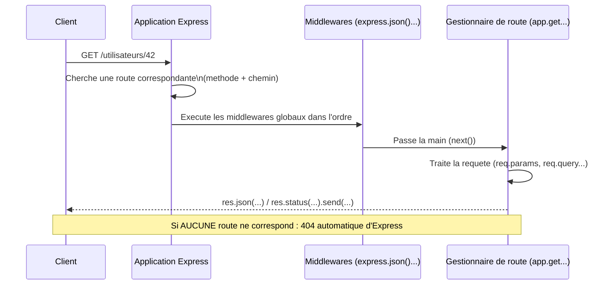
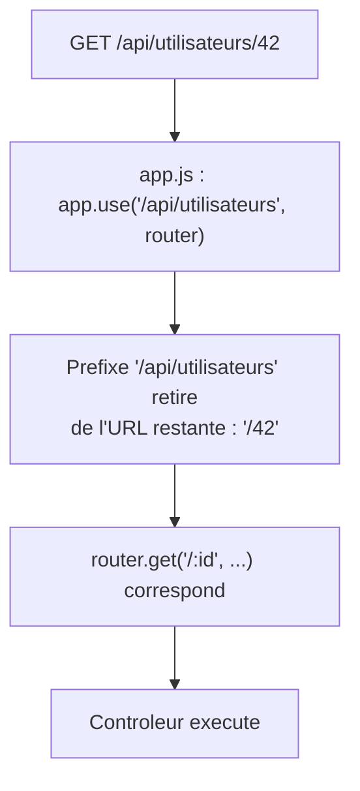

<div class="chapitre-titre-num">CHAPITRE 13</div>

# Introduction à Express.js et routage

<div class="encadre objectif">
<span class="encadre-titre">🎯 Objectif du chapitre</span>
Comprendre le rôle d'Express.js, créer une première API, et maîtriser le routage (paramètres, query strings, groupement de routes). À la fin de ce chapitre, tu sauras créer une API REST correctement routée, organisée par domaine métier avec `express.Router()`, et répondant avec les bons codes de statut HTTP.
</div>

<div class="encadre scenario">
<span class="encadre-titre">🎬 Mise en situation</span>
Tu démarres une nouvelle mission freelance : construire l'API backend d'une application de gestion pour une PME haïtienne. Le client n'a aucune exigence technique précise — juste "une API qui marche, qu'on puisse faire évoluer facilement". C'est exactement la situation où le bon choix d'outil et une organisation propre dès le départ font la différence entre un projet qui grandit sereinement sur plusieurs mois, et un autre qui devient ingérable après trois fonctionnalités. Express.js, le framework central de ce manuel à partir de maintenant, est ce bon choix pour la quasi-totalité des API REST Node.js.
</div>

## 13.1 Pourquoi Express.js plutôt que le module http natif

```js
// Avec le module "http" natif : très verbeux pour la moindre logique de routage
const http = require("http");

const serveur = http.createServer((req, res) => {
  if (req.url === "/utilisateurs" && req.method === "GET") {
    res.writeHead(200, { "Content-Type": "application/json" });
    res.end(JSON.stringify([{ id: 1, nom: "Jaslin" }]));
  } else if (req.url === "/produits" && req.method === "GET") {
    // ... répéter cette logique pour CHAQUE route ...
  } else {
    res.writeHead(404);
    res.end("Non trouvé");
  }
});

serveur.listen(3000);
```

```js
// Avec Express.js : déclaratif, lisible, extensible
const express = require("express");
const app = express();

app.get("/utilisateurs", (req, res) => {
  res.json([{ id: 1, nom: "Jaslin" }]);
});

app.listen(3000);
```

**Express.js** est un framework web minimaliste construit au-dessus du module `http` natif de Node.js, ajoutant un système de routage, des middlewares (chapitre 14), et des méthodes pratiques (`res.json()`, `res.status()`) qui simplifient considérablement l'écriture d'une API.

<div class="encadre astuce">
<span class="encadre-titre">💡 Analogie</span>
Le module `http` natif, c'est construire une maison en coulant soi-même chaque brique. Express.js, c'est partir de fondations, de murs porteurs et d'une charpente déjà prêts — tu te concentres sur l'agencement des pièces (les routes et la logique métier), pas sur la fabrication des briques.
</div>

| Critère | Module http natif | Express.js |
|---|---|---|
| Routage | Manuel (`if`/`switch` sur `req.url`) | Déclaratif (`app.get`, `app.post`...) |
| Parsing du corps de requête | Manuel (accumuler les chunks du Stream) | `express.json()` intégré |
| Middlewares | À réimplémenter soi-même | Système natif (chapitre 14) |
| Écosystème | Aucun | Vaste (Helmet, Multer, Swagger...) |
| Courbe d'apprentissage | Plus raide pour une vraie API | Douce, orientée productivité |

## 13.2 Premier serveur Express

```
$ npm install express
```

```js
const express = require("express");
const app = express();

app.use(express.json()); // middleware permettant de lire un corps de requête JSON (chapitre 14)

app.get("/", (req, res) => {
  res.send("API en ligne");
});

const PORT = process.env.PORT || 3000;
app.listen(PORT, () => {
  console.log(`Serveur démarré sur http://localhost:${PORT}`);
});
```

<div class="encadre capture">
<span class="encadre-titre">📷 Capture d'écran recommandée</span>
Postman (ou un navigateur) affichant une requête GET vers `http://localhost:3000/` et la réponse "API en ligne" — la toute première vérification concrète qu'un serveur Express répond réellement.
</div>

## 13.3 Le cycle complet d'une requête Express



<div class="encadre astuce">
<span class="encadre-titre">💡 Explication du schéma</span>
Ce cycle est la base de tout ce que ce manuel construit à partir de maintenant : Express reçoit la requête, la fait passer par une chaîne de middlewares (chapitre 14) avant d'atteindre le bon gestionnaire de route, qui produit la réponse. Comprendre cet ordre est indispensable pour savoir où intervenir (authentification, validation, logging) dans les chapitres suivants.
</div>

## 13.4 Les méthodes HTTP et leur usage RESTful

| Méthode | Usage conventionnel | Exemple |
|---|---|---|
| `GET` | Lire une ressource, sans effet de bord | `GET /utilisateurs`, `GET /utilisateurs/42` |
| `POST` | Créer une nouvelle ressource | `POST /utilisateurs` |
| `PUT` | Remplacer entièrement une ressource existante | `PUT /utilisateurs/42` |
| `PATCH` | Modifier partiellement une ressource | `PATCH /utilisateurs/42` |
| `DELETE` | Supprimer une ressource | `DELETE /utilisateurs/42` |

```js
app.get("/utilisateurs", listerUtilisateurs);
app.post("/utilisateurs", creerUtilisateur);
app.get("/utilisateurs/:id", obtenirUtilisateur);
app.put("/utilisateurs/:id", remplacerUtilisateur);
app.patch("/utilisateurs/:id", modifierUtilisateur);
app.delete("/utilisateurs/:id", supprimerUtilisateur);
```

## 13.5 Paramètres de route

```js
app.get("/utilisateurs/:id", (req, res) => {
  const { id } = req.params; // req.params contient TOUS les segments dynamiques (":...") de l'URL
  res.json({ message: `Utilisateur demandé : ${id}` });
});

// Plusieurs paramètres
app.get("/utilisateurs/:utilisateurId/commandes/:commandeId", (req, res) => {
  const { utilisateurId, commandeId } = req.params;
  res.json({ utilisateurId, commandeId });
});
```

## 13.6 Query strings (paramètres de requête)

```js
// GET /produits?categorie=alimentaire&prixMax=300
app.get("/produits", (req, res) => {
  const { categorie, prixMax } = req.query; // req.query contient les paramètres APRÈS le "?"
  res.json({ categorie, prixMax });
});
```

<div class="encadre astuce">
<span class="encadre-titre">💡 req.params vs req.query : quand utiliser lequel</span>
`req.params` identifie **une ressource précise** dans le chemin de l'URL (`/utilisateurs/:id` — l'id fait partie de l'identité de la ressource). `req.query` sert aux options de la requête (filtres, tri, pagination — chapitre 21) qui ne changent pas la nature de la ressource demandée, seulement la façon de la présenter.
</div>

## 13.7 Router : organiser les routes par domaine

```js
// src/routes/utilisateurs.routes.js
const express = require("express");
const router = express.Router();
const utilisateursController = require("../controllers/utilisateurs.controller");

router.get("/", utilisateursController.lister);
router.post("/", utilisateursController.creer);
router.get("/:id", utilisateursController.obtenir);
router.put("/:id", utilisateursController.modifier);
router.delete("/:id", utilisateursController.supprimer);

module.exports = router;
```

```js
// src/app.js
const express = require("express");
const app = express();

app.use(express.json());

const utilisateursRoutes = require("./routes/utilisateurs.routes");
const produitsRoutes = require("./routes/produits.routes");

app.use("/api/utilisateurs", utilisateursRoutes); // toutes les routes de ce router préfixées par /api/utilisateurs
app.use("/api/produits", produitsRoutes);

module.exports = app;
```



<div class="encadre astuce">
<span class="encadre-titre">💡 Un Router par ressource, jamais toutes les routes dans app.js</span>
Rappel de l'architecture du chapitre 5 : regrouper les routes par domaine métier dans des fichiers séparés (`utilisateurs.routes.js`, `produits.routes.js`) évite un `app.js` de plusieurs centaines de lignes, et rend chaque domaine facile à localiser et à faire évoluer indépendamment.
</div>

## 13.8 Réponses JSON et codes de statut HTTP

```js
app.get("/utilisateurs/:id", async (req, res) => {
  const utilisateur = await UtilisateurService.trouverParId(req.params.id);

  if (!utilisateur) {
    return res.status(404).json({ message: "Utilisateur introuvable" });
  }

  res.status(200).json(utilisateur);
});

app.post("/utilisateurs", async (req, res) => {
  const nouvelUtilisateur = await UtilisateurService.creer(req.body);
  res.status(201).json(nouvelUtilisateur); // 201 Created, pas 200, pour une création réussie
});
```

| Code | Signification | Cas d'usage typique |
|---|---|---|
| 200 | OK | Lecture ou modification réussie |
| 201 | Created | Création réussie (réponse à un POST) |
| 204 | No Content | Suppression réussie, aucun contenu à renvoyer |
| 400 | Bad Request | Données de la requête invalides (chapitre 18) |
| 401 | Unauthorized | Authentification manquante ou invalide (chapitre 23) |
| 403 | Forbidden | Authentifié, mais sans les droits nécessaires (chapitre 24) |
| 404 | Not Found | Ressource inexistante |
| 500 | Internal Server Error | Erreur inattendue côté serveur (chapitre 19) |

## Atelier — Construire une première API CRUD complète

<div class="encadre exercice">
<span class="encadre-titre">🛠️ Atelier 13 — API produits en mémoire</span>

**Objectif** : construire une API REST minimale mais complète, préfigurant l'architecture du reste du manuel.

**Préparation** : projet Express initialisé (chapitre 5), `npm install express`.

**Étapes détaillées** :
1. Crée un tableau en mémoire `let produits = []` dans un module dédié (une vraie base de données arrive au chapitre 31).
2. Crée `routes/produits.routes.js` avec un `express.Router()` couvrant les 5 routes CRUD (section 13.7).
3. Monte ce router dans `app.js` sous `/api/produits`.
4. Teste chaque route avec Postman ou `curl` : liste vide au départ, création d'un produit (201), lecture (200), lecture d'un id inexistant (404), suppression (204).

**Validation** : les 5 routes doivent répondre avec le bon code de statut HTTP selon le tableau de la section 13.8.

**Résultat attendu** : une API fonctionnelle de bout en bout, base de départ que les chapitres 14 à 18 (middlewares, contrôleurs/services, architecture, validation) viendront structurer et enrichir progressivement.

**Dépannage** : si `req.body` est `undefined` sur le POST, vérifie que `app.use(express.json())` est bien présent avant les routes (erreur fréquente n°1 ci-dessous).

**Nettoyage** : aucun, ce projet sert de base aux chapitres suivants.
</div>

## Erreurs fréquentes

<div class="encadre attention">
<span class="encadre-titre">⚠️ Erreur n°1 — Oublier express.json() : req.body reste undefined</span>

```js
const app = express();
// ❌ app.use(express.json()); oublié !

app.post("/utilisateurs", (req, res) => {
  console.log(req.body); // undefined, même si le client a bien envoyé un JSON !
});
```
Sans le middleware `express.json()`, Express ne parse **jamais** automatiquement le corps JSON d'une requête — `req.body` reste `undefined`, une des toutes premières confusions rencontrées par les débutants sur Express.
</div>

<div class="encadre attention">
<span class="encadre-titre">⚠️ Erreur n°2 — Toujours renvoyer une réponse, sinon la requête reste "en attente" indéfiniment</span>

```js
app.get("/utilisateurs/:id", async (req, res) => {
  const utilisateur = await UtilisateurService.trouverParId(req.params.id);
  if (!utilisateur) {
    console.log("Utilisateur introuvable"); // ❌ pas de res.status(404)... : le client attend indéfiniment !
  }
  res.json(utilisateur); // si utilisateur est undefined, envoie "null" au client sans code d'erreur pertinent
});
```
</div>

<div class="encadre attention">
<span class="encadre-titre">⚠️ Erreur n°3 — Ordre des routes qui se chevauchent</span>

```js
app.get("/utilisateurs/:id", obtenirUtilisateur);
app.get("/utilisateurs/moi", obtenirProfilConnecte); // ❌ jamais atteinte : ":id" capture aussi "moi" !
```
Express évalue les routes **dans l'ordre de déclaration** ; une route dynamique déclarée avant une route statique similaire l'intercepte silencieusement. Toujours déclarer les routes **statiques** (`/moi`) avant les routes **dynamiques** (`/:id`) qui pourraient les capturer par erreur.
</div>

## Débogage

<div class="encadre attention">
<span class="encadre-titre">🩺 Symptôme : "Cannot GET /api/utilisateurs" (404 Express)</span>

- **Cause** : soit la route n'existe pas réellement, soit le router n'a pas été monté avec le bon préfixe dans `app.js`.
- **Diagnostic** : vérifier `app.use("/prefixe", router)` et le chemin exact déclaré dans le router lui-même.
- **Solution** : corriger le préfixe ou le chemin de route concerné.
</div>

<div class="encadre attention">
<span class="encadre-titre">🩺 Symptôme : la requête reste indéfiniment en attente (timeout côté client)</span>

- **Cause** : un gestionnaire de route qui ne renvoie jamais de réponse dans un certain cas (erreur fréquente n°2).
- **Solution** : vérifier que chaque branche logique du gestionnaire se termine par un appel `res.send()`/`res.json()`/`res.end()`.
</div>

## En entreprise

- **Structure de routes cohérente** : la quasi-totalité des API Express professionnelles suivent la convention REST des méthodes HTTP (section 13.4), rendant l'API prévisible pour n'importe quel consommateur externe sans documentation exhaustive.
- **Versionnement d'API** : de nombreuses équipes préfixent leurs routes par une version (`/api/v1/utilisateurs`), anticipant une évolution future sans casser les clients existants d'une version antérieure.

## Entretien technique

<div class="encadre exercice">
<span class="encadre-titre">💼 Questions fréquemment posées en entretien</span>

**Q1. "Pourquoi utiliser Express plutôt que le module http natif ?"**
Réponse attendue : Express fournit un système de routage déclaratif, un parsing de corps de requête intégré, et un système de middlewares extensible, évitant une réimplémentation manuelle répétitive pour chaque route.

**Q2. "Quelle est la différence entre req.params et req.query ?"**
Réponse attendue : `req.params` capture les segments dynamiques du chemin de l'URL (identité de la ressource) ; `req.query` capture les paramètres après le `?` (options de la requête, comme le filtrage ou la pagination).

**Q3. "Pourquoi l'ordre de déclaration des routes est-il important dans Express ?"**
Réponse attendue : Express évalue les routes dans l'ordre déclaré et utilise la première correspondance trouvée ; une route dynamique généraliste déclarée avant une route statique plus spécifique peut intercepter cette dernière par erreur.
</div>

## Optimisation, sécurité et maintenabilité

<div class="encadre bonne-pratique">
<span class="encadre-titre">✅ Maintenabilité</span>
Un `express.Router()` par ressource métier (rappel du chapitre 5) garde chaque fichier de routes court et facile à localiser, même quand l'API grandit à plusieurs dizaines de ressources.
</div>

<div class="encadre securite">
<span class="encadre-titre">🔒 Sécurité</span>
Ne jamais faire confiance aveuglément à `req.params`/`req.query`/`req.body` sans validation (chapitre 18) — ce sont des données fournies par le client, potentiellement malveillantes.
</div>

## Résumé du chapitre

- Express.js simplifie considérablement le routage et la gestion des requêtes par rapport au module `http` natif.
- `req.params` identifie une ressource précise dans l'URL ; `req.query` transporte des options (filtres, tri, pagination).
- `express.Router()` regroupe les routes par domaine métier, montées via `app.use("/prefixe", router)`.
- Les codes de statut HTTP (200, 201, 400, 401, 403, 404, 500) communiquent précisément le résultat d'une requête au client.

## Quiz

<div class="encadre exercice">
<span class="encadre-titre">📝 QCM</span>

1. Que renvoie req.params pour la route "/utilisateurs/:id" appelée sur "/utilisateurs/42" ?
   - a) { id: "42" }
   - b) 42 directement
   - c) undefined
   - d) Tout l'objet req

2. Quel code de statut convient pour une création réussie (POST) ?
   - a) 200
   - b) 201
   - c) 204
   - d) 404

3. Que se passe-t-il sans app.use(express.json()) ?
   - a) req.body contient une chaîne brute
   - b) req.body reste undefined pour un corps JSON
   - c) La requête est rejetée automatiquement
   - d) Rien, c'est optionnel

**Corrigé** : 1-a, 2-b, 3-b.
</div>

<div class="encadre exercice">
<span class="encadre-titre">📝 Vrai ou Faux</span>

1. req.query contient les segments dynamiques de l'URL (:id). — **Faux** (c'est le rôle de req.params).
2. Express évalue les routes dans l'ordre de leur déclaration. — **Vrai**.
3. Un express.Router() doit toujours être monté avec app.use() pour être actif. — **Vrai**.
</div>

<div class="encadre exercice">
<span class="encadre-titre">📝 Question ouverte</span>

Pourquoi `/utilisateurs/moi` déclarée après `/utilisateurs/:id` ne fonctionne-t-elle jamais comme prévu ?

**Corrigé** : Express recherche la première route correspondante dans l'ordre de déclaration. `/utilisateurs/:id` correspond à **n'importe quel** segment après `/utilisateurs/`, y compris littéralement "moi" — cette route dynamique intercepte donc la requête avant qu'Express n'atteigne `/utilisateurs/moi`, qui ne sera jamais exécutée. La solution est de déclarer `/utilisateurs/moi` **avant** `/utilisateurs/:id`.
</div>

## Exercices

<div class="encadre exercice">
<span class="encadre-titre">📝 Exercice 13.1</span>

Crée un Router Express pour une ressource `produits` avec les 5 routes CRUD standard (lister, créer, obtenir un, modifier, supprimer), monté sous le préfixe `/api/produits`.
</div>

**Corrigé :**
```js
// routes/produits.routes.js
const router = require("express").Router();

router.get("/", (req, res) => res.json([]));
router.post("/", (req, res) => res.status(201).json(req.body));
router.get("/:id", (req, res) => res.json({ id: req.params.id }));
router.put("/:id", (req, res) => res.json({ id: req.params.id, ...req.body }));
router.delete("/:id", (req, res) => res.status(204).send());

module.exports = router;
```
```js
app.use("/api/produits", require("./routes/produits.routes"));
```

## Checklist de fin de chapitre

<ul class="checklist">
<li>☐ Je comprends pourquoi Express simplifie le routage face au module http natif.</li>
<li>☐ Je sais créer des routes avec paramètres et query strings.</li>
<li>☐ Je sais organiser des routes avec express.Router().</li>
<li>☐ Je sais répondre avec le bon code de statut HTTP selon le contexte.</li>
<li>☐ Je sais expliquer le cycle complet d'une requête Express.</li>
<li>☐ Je pense à déclarer les routes statiques avant les routes dynamiques qui pourraient les capturer.</li>
</ul>

## FAQ

<dl class="faq">
<dt>Express est-il toujours le meilleur choix en 2026 ?</dt>
<dd>Express reste le framework Node.js le plus utilisé et documenté, avec un écosystème très mature. Des alternatives plus récentes (Fastify, Hono) offrent de meilleures performances brutes sur certains benchmarks, mais Express reste le choix le plus sûr pour un premier poste, une mission freelance, ou un projet devant s'appuyer sur une documentation abondante.</dd>

<dt>Peut-on avoir plusieurs routers imbriqués ?</dt>
<dd>Oui, un `express.Router()` peut lui-même monter d'autres routers, permettant une hiérarchie de préfixes (`/api/v1/utilisateurs/:id/commandes`, par exemple).</dd>

<dt>Que se passe-t-il si deux routes identiques sont déclarées ?</dt>
<dd>Express exécute la **première** déclarée ; la seconde ne sera jamais atteinte, sauf si la première appelle explicitement `next()` pour passer la main (approfondi au chapitre 14 sur les middlewares).</dd>
</dl>

## Références et pour aller plus loin

- Documentation officielle Express : [https://expressjs.com](https://expressjs.com)
- Guide du routage Express : [https://expressjs.com/en/guide/routing.html](https://expressjs.com/en/guide/routing.html)
- Liste des codes de statut HTTP (MDN) : [https://developer.mozilla.org/fr/docs/Web/HTTP/Status](https://developer.mozilla.org/fr/docs/Web/HTTP/Status)

*Chapitre suivant : les middlewares, le mécanisme central qui rend Express aussi extensible.*
