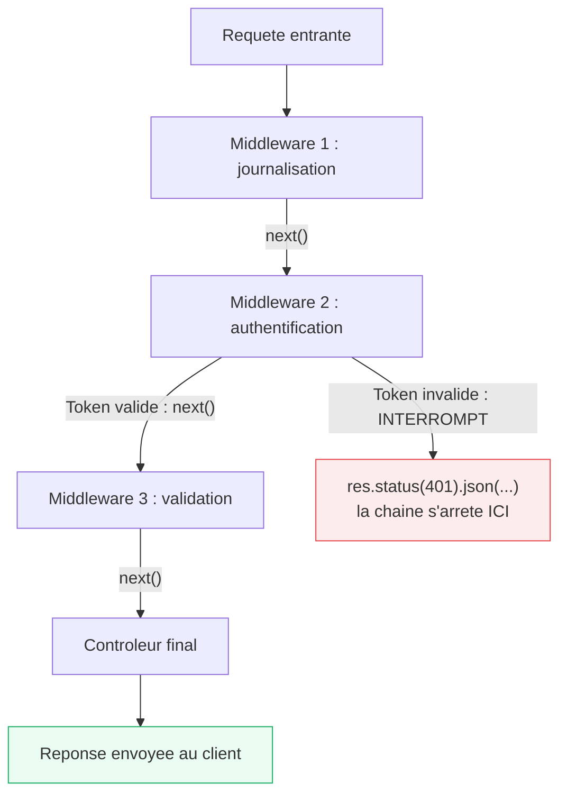

<div class="chapitre-titre-num">CHAPITRE 14</div>

# Middlewares

<div class="encadre objectif">
<span class="encadre-titre">🎯 Objectif du chapitre</span>
Comprendre le concept central des middlewares Express, savoir en écrire des personnalisés, et connaître les middlewares les plus utilisés en production. À la fin de ce chapitre, tu sauras écrire un middleware qui inspecte, modifie ou interrompt une requête, et tu comprendras pourquoi l'ordre de déclaration des middlewares n'est jamais un détail anodin.
</div>

<div class="encadre scenario">
<span class="encadre-titre">🎬 Mise en situation</span>
Un client signale un bug de sécurité troublant : certains utilisateurs non connectés arrivent à consulter une route censée être protégée par authentification. En inspectant `app.js`, tu découvres que la route en question a été déclarée **avant** le middleware d'authentification, lors d'un ajout rapide en fin de journée quelques semaines plus tôt. Express a fidèlement exécuté le code exactement dans l'ordre où il a été écrit — la faille n'est pas un bug d'Express, mais une conséquence directe de ne pas avoir compris que l'ordre des middlewares n'est jamais neutre. Ce chapitre t'évite exactement ce genre d'incident.
</div>

## 14.1 Qu'est-ce qu'un middleware

Un **middleware** est une fonction qui a accès à la requête (`req`), la réponse (`res`), et une fonction `next()` permettant de passer la main au middleware **suivant** dans la chaîne. C'est le mécanisme fondamental qui rend Express extensible : chaque middleware peut inspecter, modifier, ou interrompre le traitement d'une requête.



<div class="encadre astuce">
<span class="encadre-titre">💡 Explication du schéma</span>
Deux issues possibles à chaque middleware : appeler `next()` pour **poursuivre** la chaîne (chemin vert), ou répondre directement pour l'**interrompre** (chemin rouge) — exactement le mécanisme derrière l'incident de la mise en situation d'ouverture, où l'ordre de déclaration déterminait si le middleware d'authentification avait seulement l'occasion d'intervenir.
</div>

## 14.2 Anatomie d'un middleware

```js
function monMiddleware(req, res, next) {
  console.log(`${req.method} ${req.url}`); // inspecte la requête
  next(); // OBLIGATOIRE : passe la main au middleware/contrôleur suivant
}

app.use(monMiddleware); // appliqué à TOUTES les routes qui suivent cette ligne
```

<div class="encadre attention">
<span class="encadre-titre">⚠️ Oublier next() bloque la requête indéfiniment</span>

```js
function middlewareCasse(req, res, next) {
  console.log("Ce middleware s'exécute...");
  // ❌ next() jamais appelé : la requête reste bloquée ici pour toujours, le client n'obtient jamais de réponse
}
```
Sauf si le middleware envoie lui-même une réponse (`res.send()`, `res.json()`, `res.status(...).end()`), il **doit** appeler `next()` pour que la chaîne continue. Un middleware qui ne fait ni l'un ni l'autre bloque silencieusement la requête jusqu'au timeout du client.
</div>

<div class="encadre retenir">
<span class="encadre-titre">📌 À retenir</span>
Chaque middleware a exactement deux issues possibles, jamais une troisième : appeler <code>next()</code> (poursuivre), ou répondre directement (interrompre). Ne faire ni l'un ni l'autre est toujours un bug.
</div>

## 14.3 Middlewares appliqués globalement vs à une route précise

```js
// Global : s'applique à TOUTES les routes déclarées APRÈS cette ligne
app.use(express.json());
app.use(journalisation);

// Sur une route précise : s'applique UNIQUEMENT à cette route
app.get("/admin/utilisateurs", authentifier, verifierRoleAdmin, listerUtilisateurs);

// Sur un groupe de routes (Router), avec un préfixe
app.use("/api/admin", authentifier, verifierRoleAdmin, adminRoutes);
```

<div class="encadre astuce">
<span class="encadre-titre">💡 Plusieurs middlewares s'enchaînent dans l'ordre de déclaration</span>
`app.get("/route", middleware1, middleware2, controleur)` exécute `middleware1`, puis (si `next()` est appelé) `middleware2`, puis (si `next()` est appelé de nouveau) le contrôleur final — un enchaînement linéaire et prévisible.
</div>

## 14.4 Middleware personnalisé : journalisation simple

```js
function journalisation(req, res, next) {
  const debut = Date.now();
  console.log(`→ ${req.method} ${req.originalUrl}`);

  res.on("finish", () => { // événement déclenché quand la réponse est ENVOYÉE
    const duree = Date.now() - debut;
    console.log(`← ${req.method} ${req.originalUrl} ${res.statusCode} (${duree}ms)`);
  });

  next();
}
```

## 14.5 Middleware personnalisé : vérifier un en-tête d'API Key

```js
function verifierApiKey(req, res, next) {
  const cle = req.headers["x-api-key"];

  if (!cle || cle !== process.env.API_KEY) {
    return res.status(401).json({ message: "Clé API invalide ou manquante" });
  }

  next(); // clé valide : la requête peut continuer
}

app.use("/api/externe", verifierApiKey, externeRoutes);
```

## 14.6 Middlewares intégrés et tiers courants

```js
const express = require("express");
const cors = require("cors");
const helmet = require("helmet");
const morgan = require("morgan");

const app = express();

app.use(helmet());              // sécurise les en-têtes HTTP (chapitre 25)
app.use(cors());                // autorise les requêtes cross-origin (chapitre 25)
app.use(morgan("combined"));    // journalisation des requêtes HTTP (chapitre 20)
app.use(express.json());        // parse le corps JSON des requêtes
app.use(express.urlencoded({ extended: true })); // parse les corps de formulaires classiques
app.use(express.static("public")); // sert des fichiers statiques (images, CSS...) depuis le dossier "public"
```

## 14.7 Middleware avec paramètres (factory de middleware)

```js
// Une FONCTION qui RETOURNE un middleware, permettant de le paramétrer
function limiterTaille(tailleMaxOctets) {
  return function (req, res, next) {
    const taille = parseInt(req.headers["content-length"] || "0", 10);
    if (taille > tailleMaxOctets) {
      return res.status(413).json({ message: "Corps de requête trop volumineux" });
    }
    next();
  };
}

app.post("/upload", limiterTaille(5 * 1024 * 1024), gererUpload); // limite personnalisée : 5 Mo
```

## 14.8 L'ordre des middlewares compte

<div class="encadre attention">
<span class="encadre-titre">⚠️ Un middleware placé trop tard n'a aucun effet sur les routes précédentes</span>

```js
app.get("/utilisateurs", listerUtilisateurs); // ❌ déclarée AVANT le middleware d'authentification !
app.use(authentifier); // n'affecte que les routes déclarées APRÈS cette ligne
```
Express traite les middlewares et routes **dans l'ordre exact de leur déclaration** dans le code. Un middleware de sécurité (authentification, validation) doit toujours être déclaré **avant** les routes qu'il doit protéger — exactement la cause de l'incident de la mise en situation d'ouverture.
</div>

## Atelier — Reproduire et corriger la faille de la mise en situation

<div class="encadre exercice">
<span class="encadre-titre">🛠️ Atelier 14 — Ordre des middlewares en action</span>

**Objectif** : reproduire concrètement l'incident de sécurité de la mise en situation d'ouverture, puis le corriger.

**Préparation** : un projet Express avec une route `/admin` simulée et un middleware `authentifier` simple (rejette si un en-tête `Authorization` est absent).

**Étapes détaillées** :
1. Déclare `app.get("/admin", listerDonneesSensibles)` **avant** `app.use(authentifier)`.
2. Envoie une requête sans en-tête `Authorization` vers `/admin` : observe qu'elle réussit malgré l'absence d'authentification.
3. Déplace `app.use(authentifier)` **avant** la déclaration de la route `/admin`.
4. Relance la même requête sans en-tête : observe le rejet en 401 cette fois.

**Validation** : la même requête, sans aucun changement de son côté, doit passer de "acceptée à tort" à "rejetée correctement" uniquement en changeant l'ordre des lignes côté serveur.

**Résultat attendu** : la preuve concrète, reproduite par toi-même, que l'ordre des middlewares n'est jamais un détail — exactement la faille de la mise en situation d'ouverture.

**Dépannage** : si la route reste accessible même après le déplacement, vérifie qu'aucune autre déclaration de la même route n'existe ailleurs dans le code, qui pourrait être atteinte en premier.

**Nettoyage** : aucun.
</div>

## Erreurs fréquentes

<div class="encadre attention">
<span class="encadre-titre">⚠️ Erreur n°1 — Appeler next() ET envoyer une réponse dans le même middleware</span>

```js
function middlewareBogue(req, res, next) {
  res.json({ message: "Traité" });
  next(); // ❌ Erreur : "Cannot set headers after they are sent to the client" si un middleware suivant répond aussi
}
```
Un middleware doit soit **répondre** (et s'arrêter là, sans appeler `next()`), soit **passer la main** via `next()` (sans avoir déjà répondu) — jamais les deux à la fois.
</div>

<div class="encadre attention">
<span class="encadre-titre">⚠️ Erreur n°2 — Middleware de sécurité déclaré après les routes qu'il devrait protéger</span>
Exactement l'incident de la mise en situation d'ouverture — l'erreur la plus coûteuse possible dans ce chapitre, puisqu'elle a une conséquence de sécurité directe, pas seulement un bug fonctionnel.
</div>

## Débogage

<div class="encadre attention">
<span class="encadre-titre">🩺 Symptôme : "Cannot set headers after they are sent to the client"</span>

- **Cause** : un middleware (ou contrôleur) tente d'envoyer une réponse alors qu'une réponse a déjà été envoyée précédemment dans la même chaîne (erreur fréquente n°1, souvent un `next()` en trop après un `res.json()`).
- **Diagnostic** : rechercher, dans la chaîne de middlewares concernée, un endroit où une réponse est envoyée puis `next()` est quand même appelé.
- **Solution** : ajouter un `return` avant l'appel qui envoie la réponse, pour ne jamais atteindre le `next()` qui suit dans le même bloc.
</div>

<div class="encadre attention">
<span class="encadre-titre">🩺 Symptôme : une route censée être protégée reste accessible</span>

- **Cause probable** : middleware de protection déclaré après la route (erreur fréquente n°2, incident de la mise en situation d'ouverture).
- **Solution** : vérifier l'ordre exact des lignes dans `app.js`/le fichier de routes concerné.
</div>

## En entreprise

- **Revue de sécurité de l'ordre des middlewares** : un point de contrôle standard dans de nombreuses équipes avant toute mise en production, précisément à cause de la fréquence de ce type d'erreur.
- **Middlewares de sécurité systématiques** : `helmet()` et `cors()` configurés correctement (chapitre 25) font partie du socle attendu de toute API professionnelle, dès son tout premier déploiement.

## Entretien technique

<div class="encadre exercice">
<span class="encadre-titre">💼 Questions fréquemment posées en entretien</span>

**Q1. "Qu'est-ce qu'un middleware Express ?"**
Réponse attendue : une fonction avec accès à `req`, `res` et `next`, capable d'inspecter/modifier la requête, puis soit de passer la main via `next()`, soit de répondre directement pour interrompre la chaîne.

**Q2. "Pourquoi l'ordre de déclaration des middlewares est-il important ?"**
Réponse attendue : Express exécute les middlewares strictement dans l'ordre de leur déclaration dans le code ; un middleware de sécurité déclaré après une route qu'il devrait protéger n'a aucun effet sur cette route.

**Q3. "Qu'est-ce qu'une factory de middleware ?"**
Réponse attendue : une fonction qui retourne un middleware, permettant de le paramétrer (comme `limiterTaille(5 * 1024 * 1024)`), plutôt que d'écrire une version différente du middleware pour chaque paramètre possible.
</div>

## Optimisation, sécurité et maintenabilité

<div class="encadre securite">
<span class="encadre-titre">🔒 Sécurité</span>
Toujours déclarer les middlewares de sécurité (authentification, autorisation, validation) **avant** toute route qu'ils doivent protéger — une vérification simple à faire systématiquement en revue de code, qui aurait évité l'incident de la mise en situation d'ouverture.
</div>

<div class="encadre bonne-pratique">
<span class="encadre-titre">✅ Maintenabilité</span>
Regrouper visuellement, en tête de `app.js`, tous les middlewares globaux (`helmet`, `cors`, `express.json`...) avant les routes, pour que l'ordre d'exécution reste immédiatement lisible à quiconque ouvre le fichier.
</div>

## Résumé du chapitre

- Un middleware inspecte/modifie la requête ou la réponse, puis appelle `next()` pour continuer la chaîne, ou répond directement pour l'interrompre.
- Les middlewares s'appliquent globalement (`app.use`), sur une route précise, ou sur un groupe de routes (Router avec préfixe).
- L'ordre de déclaration détermine l'ordre d'exécution : un middleware de sécurité doit toujours précéder les routes qu'il protège.
- Une "factory" de middleware (fonction retournant un middleware) permet de le paramétrer.

## Quiz

<div class="encadre exercice">
<span class="encadre-titre">📝 QCM</span>

1. Que doit toujours faire un middleware qui ne répond pas lui-même à la requête ?
   - a) Rien de particulier
   - b) Appeler next()
   - c) Lancer une exception
   - d) Attendre 1 seconde

2. Un middleware de sécurité déclaré APRÈS une route protège-t-il cette route ?
   - a) Oui, toujours
   - b) Non, l'ordre de déclaration détermine ce qui est protégé
   - c) Seulement en production
   - d) Seulement si la route utilise async/await

3. Qu'est-ce qu'une factory de middleware ?
   - a) Un middleware qui crée des fichiers
   - b) Une fonction qui retourne un middleware paramétré
   - c) Un middleware exécuté en usine, hors du serveur
   - d) Un synonyme de app.use()

**Corrigé** : 1-b, 2-b, 3-b.
</div>

<div class="encadre exercice">
<span class="encadre-titre">📝 Vrai ou Faux</span>

1. Un middleware peut à la fois envoyer une réponse et appeler next() sans problème. — **Faux**.
2. app.use(middleware) s'applique uniquement à la route déclarée juste après. — **Faux** (à toutes les routes déclarées après, jusqu'à ce qu'il soit remplacé ou restreint).
3. L'ordre de déclaration des middlewares peut avoir des conséquences de sécurité. — **Vrai**.
</div>

<div class="encadre exercice">
<span class="encadre-titre">📝 Question ouverte</span>

Explique pourquoi l'erreur de la mise en situation d'ouverture n'est pas un bug d'Express, mais une erreur de code.

**Corrigé** : Express se contente d'exécuter fidèlement les middlewares et routes dans l'ordre exact où ils sont déclarés dans le code — c'est un comportement documenté et prévisible, pas un défaut du framework. La responsabilité de placer un middleware de sécurité avant les routes qu'il doit protéger revient entièrement au développeur ; Express n'a aucun moyen de deviner l'intention si l'ordre du code ne l'exprime pas correctement.
</div>

## Exercices

<div class="encadre exercice">
<span class="encadre-titre">📝 Exercice 14.1</span>

Écris un middleware `limiterFrequence(maxRequetes, fenetreMs)` (factory) qui autorise au maximum `maxRequetes` requêtes par IP dans une fenêtre de `fenetreMs` millisecondes, en utilisant une simple `Map` en mémoire pour compter les requêtes par IP.
</div>

**Corrigé :**
```js
function limiterFrequence(maxRequetes, fenetreMs) {
  const compteurs = new Map();

  return function (req, res, next) {
    const ip = req.ip;
    const maintenant = Date.now();
    const entree = compteurs.get(ip) || { compte: 0, debut: maintenant };

    if (maintenant - entree.debut > fenetreMs) {
      entree.compte = 0;
      entree.debut = maintenant;
    }

    entree.compte++;
    compteurs.set(ip, entree);

    if (entree.compte > maxRequetes) {
      return res.status(429).json({ message: "Trop de requêtes, réessaie plus tard" });
    }
    next();
  };
}
```

## Checklist de fin de chapitre

<ul class="checklist">
<li>☐ Je comprends ce qu'est un middleware et son rôle dans Express.</li>
<li>☐ Je sais écrire un middleware personnalisé (journalisation, vérification, factory).</li>
<li>☐ Je comprends la différence entre poursuivre (next()) et interrompre (répondre).</li>
<li>☐ Je place systématiquement les middlewares de sécurité avant les routes qu'ils protègent.</li>
<li>☐ Je connais les middlewares tiers courants (helmet, cors, morgan).</li>
</ul>

## FAQ

<dl class="faq">
<dt>Un middleware peut-il être asynchrone ?</dt>
<dd>Oui, un middleware peut être une fonction async — mais attention à bien gérer les erreurs (try/catch ou middleware de capture dédié, chapitre 19), sinon une erreur async non gérée peut ne jamais atteindre le gestionnaire d'erreurs global d'Express.</dd>

<dt>Combien de middlewares peut-on enchaîner sur une seule route ?</dt>
<dd>Aucune limite technique fixée par Express — mais au-delà de 3-4 middlewares sur une même route, il est souvent plus lisible de les regrouper dans un tableau nommé (`const protectionAdmin = [authentifier, verifierRoleAdmin]`) puis de l'utiliser via `app.get("/route", ...protectionAdmin, controleur)`.</dd>

<dt>Un middleware d'erreur est-il différent d'un middleware normal ?</dt>
<dd>Oui, un middleware d'erreur se reconnaît à ses 4 paramètres (`(err, req, res, next)`) au lieu de 3 — approfondi au chapitre 19 sur la gestion centralisée des erreurs.</dd>
</dl>

## Références et pour aller plus loin

- Documentation Express sur les middlewares : [https://expressjs.com/en/guide/using-middleware.html](https://expressjs.com/en/guide/using-middleware.html)
- Liste des middlewares tiers populaires : [https://expressjs.com/en/resources/middleware.html](https://expressjs.com/en/resources/middleware.html)

*Chapitre suivant : contrôleurs et services, pour bien répartir les responsabilités d'une route.*
