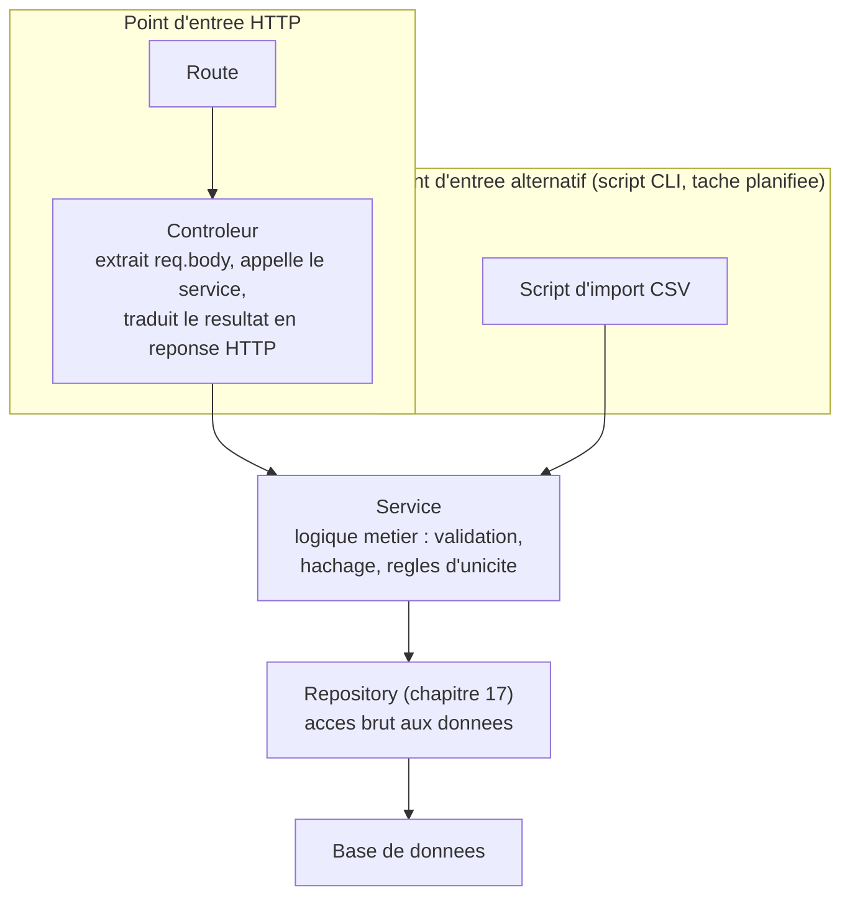

<div class="chapitre-titre-num">CHAPITRE 15</div>

# Contrôleurs et services

<div class="encadre objectif">
<span class="encadre-titre">🎯 Objectif du chapitre</span>
Comprendre la responsabilité précise d'un contrôleur par opposition à un service, et savoir répartir correctement la logique d'une fonctionnalité entre les deux. À la fin de ce chapitre, tu sauras écrire un contrôleur de quelques lignes seulement, avec toute la logique métier proprement isolée dans un service testable indépendamment.
</div>

<div class="encadre scenario">
<span class="encadre-titre">🎬 Mise en situation</span>
Le client demande une nouvelle fonctionnalité : un script d'import en masse qui crée des centaines d'utilisateurs depuis un fichier CSV fourni par le service RH, en dehors de toute requête HTTP. En ouvrant le code existant, tu découvres que toute la logique de création d'utilisateur (validation, vérification d'unicité de l'email, hachage du mot de passe) vit **à l'intérieur** du contrôleur HTTP, mêlée à `req`/`res`. Impossible de la réutiliser telle quelle dans un script CLI sans dupliquer entièrement la logique ou simuler artificiellement une fausse requête HTTP. Ce chapitre montre exactement comment éviter ce blocage, en gardant la logique métier indépendante de son point d'entrée.
</div>

## 15.1 Le problème : tout dans le contrôleur

```js
// ❌ Le contrôleur mélange HTTP, validation, logique métier et accès aux données
router.post("/utilisateurs", async (req, res) => {
  const { nom, email, motDePasse } = req.body;

  if (!email.includes("@")) {
    return res.status(400).json({ message: "Email invalide" });
  }

  const existant = await db.query("SELECT * FROM utilisateurs WHERE email = $1", [email]);
  if (existant.rows.length > 0) {
    return res.status(409).json({ message: "Email déjà utilisé" });
  }

  const motDePasseHash = await bcrypt.hash(motDePasse, 10);
  const resultat = await db.query(
    "INSERT INTO utilisateurs (nom, email, mot_de_passe) VALUES ($1, $2, $3) RETURNING *",
    [nom, email, motDePasseHash]
  );

  res.status(201).json(resultat.rows[0]);
});
```

Ce code fonctionne, mais mélange **quatre responsabilités différentes** dans une seule fonction : extraction des données HTTP, validation, règles métier (vérifier l'unicité, hacher le mot de passe), et accès direct à la base de données.

<div class="encadre astuce">
<span class="encadre-titre">💡 Analogie</span>
Un contrôleur qui fait tout, c'est un serveur de restaurant qui prendrait aussi la commande, cuisinerait le plat lui-même et gérerait les stocks du frigo — possible sur un tout petit établissement, mais qui ne passe pas à l'échelle et empêche quiconque d'utiliser la "recette" (la logique métier) sans repasser par la salle.
</div>

## 15.2 Le contrôleur : traduire HTTP ↔ logique métier

<div class="encadre astuce">
<span class="encadre-titre">💡 La responsabilité UNIQUE d'un contrôleur</span>
Un contrôleur ne devrait faire que : (1) extraire les données pertinentes de la requête (`req.body`, `req.params`, `req.query`), (2) appeler la méthode de service correspondante, (3) traduire le résultat (ou l'erreur) en réponse HTTP appropriée. **Aucune** logique métier, **aucun** accès direct aux données.
</div>

```js
// src/controllers/utilisateurs.controller.js
const UtilisateurService = require("../services/utilisateurs.service");

async function creer(req, res, next) {
  try {
    const { nom, email, motDePasse } = req.body;
    const nouvelUtilisateur = await UtilisateurService.creerUtilisateur({ nom, email, motDePasse });
    res.status(201).json(nouvelUtilisateur);
  } catch (erreur) {
    next(erreur); // délègue au middleware de gestion d'erreurs centralisé (chapitre 19)
  }
}

async function lister(req, res, next) {
  try {
    const utilisateurs = await UtilisateurService.listerUtilisateurs();
    res.json(utilisateurs);
  } catch (erreur) {
    next(erreur);
  }
}

module.exports = { creer, lister };
```

## 15.3 Le service : la logique métier pure

```js
// src/services/utilisateurs.service.js
const bcrypt = require("bcrypt");
const UtilisateurRepository = require("../repositories/utilisateurs.repository");
const { ConflitError } = require("../errors");

async function creerUtilisateur({ nom, email, motDePasse }) {
  const existant = await UtilisateurRepository.trouverParEmail(email);
  if (existant) {
    throw new ConflitError("Cet email est déjà utilisé"); // erreur métier personnalisée (chapitre 19)
  }

  const motDePasseHash = await bcrypt.hash(motDePasse, 10);
  const utilisateur = await UtilisateurRepository.creer({ nom, email, motDePasseHash });

  delete utilisateur.motDePasseHash; // ne JAMAIS renvoyer le hash, même haché, au client
  return utilisateur;
}

async function listerUtilisateurs() {
  const utilisateurs = await UtilisateurRepository.listerTous();
  return utilisateurs.map((u) => {
    const { motDePasseHash, ...utilisateurSansMotDePasse } = u;
    return utilisateurSansMotDePasse;
  });
}

module.exports = { creerUtilisateur, listerUtilisateurs };
```

<div class="encadre astuce">
<span class="encadre-titre">💡 Un service ne connaît RIEN de HTTP</span>
Remarque essentielle : `UtilisateurService` ne reçoit jamais `req`/`res`, ne connaît aucun code de statut HTTP, et ne lève que des erreurs métier génériques (`ConflitError`). Cette indépendance permet de **réutiliser** le service depuis un contexte totalement différent (une tâche planifiée, un script CLI, un test unitaire, chapitre 29) sans jamais avoir besoin d'un contexte HTTP simulé — exactement ce dont la mise en situation d'ouverture a besoin.
</div>

## 15.4 Le flux complet, illustré



<div class="encadre astuce">
<span class="encadre-titre">💡 Explication du schéma</span>
Le service occupe une position centrale, accessible aussi bien depuis le contrôleur HTTP que depuis n'importe quel autre point d'entrée (script CLI, tâche planifiée, un futur endpoint GraphQL) — précisément parce qu'il ne connaît rien de HTTP. C'est cette indépendance qui résout le blocage de la mise en situation d'ouverture : le script d'import CSV peut appeler `UtilisateurService.creerUtilisateur(...)` directement, sans jamais passer par une route.
</div>

## 15.5 Pourquoi cette séparation est-elle importante en pratique

- **Testabilité** : `UtilisateurService.creerUtilisateur(...)` se teste directement (chapitre 29), sans simuler de requête HTTP.
- **Réutilisabilité** : la même logique de création d'utilisateur peut être appelée depuis un script d'import en masse, sans dupliquer le code.
- **Lisibilité** : un contrôleur de 5-10 lignes se comprend d'un coup d'œil ; toute la complexité métier vit dans un endroit dédié et prévisible.
- **Évolution facilitée** : changer la base de données (chapitre 30-31) n'affecte que le repository, jamais le service ni le contrôleur.

<div class="encadre retenir">
<span class="encadre-titre">📌 À retenir</span>
Question à se poser systématiquement en écrivant du code dans un contrôleur : "cette ligne aurait-elle un sens si elle était appelée depuis un script sans requête HTTP ?" Si la réponse est non (elle utilise <code>req</code>/<code>res</code>), elle a sa place dans le contrôleur. Sinon, elle appartient au service.
</div>

## Atelier — Extraire un service depuis un contrôleur monolithique

<div class="encadre exercice">
<span class="encadre-titre">🛠️ Atelier 15 — Refactoriser vers la séparation contrôleur/service</span>

**Objectif** : reproduire la démarche de la mise en situation d'ouverture, en rendant une logique métier réutilisable hors HTTP.

**Préparation** : le code de la section 15.1 (contrôleur monolithique de création d'utilisateur).

**Étapes détaillées** :
1. Crée `services/utilisateurs.service.js` avec une fonction `creerUtilisateur({ nom, email, motDePasse })` reprenant la logique métier (sans `req`/`res`).
2. Réduis le contrôleur à l'extraction des données, l'appel du service, et la mise en forme de la réponse (section 15.2).
3. Écris un script indépendant `scripts/import-utilisateurs.js` qui lit un tableau JavaScript simulant un CSV, et appelle `UtilisateurService.creerUtilisateur(...)` pour chaque entrée, **sans jamais démarrer de serveur Express**.
4. Exécute ce script directement avec `node scripts/import-utilisateurs.js`.

**Validation** : le script doit fonctionner de bout en bout sans qu'aucune route HTTP ne soit impliquée, prouvant que le service est réellement indépendant de HTTP.

**Résultat attendu** : exactement la fonctionnalité demandée dans la mise en situation d'ouverture, rendue possible par la séparation contrôleur/service.

**Dépannage** : si le script échoue en tentant d'utiliser `req`/`res`, c'est que la logique métier n'a pas été entièrement extraite du contrôleur — revérifie la section 15.3.

**Nettoyage** : aucun, ce script peut rester comme outil réutilisable.
</div>

## Erreurs fréquentes

<div class="encadre attention">
<span class="encadre-titre">⚠️ Erreur n°1 — Un service qui retourne directement un objet issu de la base, sans transformation</span>

```js
// ❌ Expose potentiellement des champs sensibles (mot de passe haché, jetons internes) au client
async function trouverUtilisateur(id) {
  return UtilisateurRepository.trouverParId(id); // tel quel, SANS filtrage
}
```
Toujours filtrer explicitement les champs sensibles avant de retourner un objet issu de la base de données — ne jamais faire confiance au contrôleur pour "oublier" de les afficher.
</div>

<div class="encadre attention">
<span class="encadre-titre">⚠️ Erreur n°2 — Un service qui importe accidentellement Express</span>

```js
// ❌ Le service ne devrait JAMAIS avoir besoin d'importer express ou de connaître un code de statut HTTP
const express = require("express");
```
Si un service a besoin d'importer Express ou de manipuler un code de statut HTTP, c'est le signe qu'une responsabilité HTTP s'est glissée là où elle ne devrait pas être.
</div>

## Débogage

<div class="encadre attention">
<span class="encadre-titre">🩺 Symptôme : impossible de tester une fonctionnalité sans simuler une requête HTTP complète</span>

- **Cause** : la logique métier vit encore dans le contrôleur plutôt que dans un service indépendant.
- **Diagnostic** : identifier si la fonction testée reçoit `req`/`res` en paramètre — si oui, elle mélange probablement plusieurs responsabilités.
- **Solution** : extraire la logique dans un service prenant des paramètres simples (pas `req`/`res`), suivant le modèle de la section 15.3.
</div>

## En entreprise

- **Réutilisation multi-canal** : une même logique métier (créer un utilisateur, traiter une commande) sert souvent un contrôleur HTTP, une tâche planifiée (cron), un script d'administration, voire un futur endpoint GraphQL — jamais dupliquée si elle vit correctement dans un service.
- **Tests rapides et fiables** : les équipes qui respectent cette séparation testent leurs services par centaines en quelques secondes (chapitre 29), sans jamais démarrer un serveur HTTP réel pour ces tests.

## Entretien technique

<div class="encadre exercice">
<span class="encadre-titre">💼 Questions fréquemment posées en entretien</span>

**Q1. "Quelle est la différence entre un contrôleur et un service ?"**
Réponse attendue : le contrôleur traduit HTTP en appel de logique métier et inversement (extraction de `req`, mise en forme de `res`) ; le service porte la logique métier pure, sans jamais connaître `req`/`res` ni aucun concept HTTP.

**Q2. "Pourquoi un service ne devrait-il jamais recevoir req/res en paramètre ?"**
Réponse attendue : pour rester réutilisable depuis n'importe quel point d'entrée (script CLI, tâche planifiée, test unitaire), pas seulement depuis une requête HTTP — coupler un service à `req`/`res` briserait cette indépendance.

**Q3. "Où filtrerais-tu les champs sensibles (mot de passe haché) d'un objet utilisateur avant de le renvoyer au client ?"**
Réponse attendue : dans le service, avant de retourner la donnée au contrôleur — jamais en comptant sur le contrôleur pour s'en souvenir à chaque appel.
</div>

## Optimisation, sécurité et maintenabilité

<div class="encadre securite">
<span class="encadre-titre">🔒 Sécurité</span>
Filtrer les champs sensibles au niveau du service (jamais au niveau du contrôleur uniquement) garantit qu'aucun futur point d'entrée n'oubliera cette protection — une seule fois centralisée, jamais à répéter dans chaque contrôleur.
</div>

<div class="encadre bonne-pratique">
<span class="encadre-titre">✅ Maintenabilité</span>
Un contrôleur qui dépasse 10-15 lignes est presque toujours un signe qu'une responsabilité métier s'y est glissée par erreur — un bon réflexe de relecture rapide.
</div>

## Résumé du chapitre

- Le **contrôleur** traduit HTTP ↔ logique métier : extraction des données de requête, appel du service, mise en forme de la réponse — rien de plus.
- Le **service** porte la logique métier pure, sans jamais connaître `req`/`res` ni aucun concept HTTP.
- Cette séparation améliore testabilité, réutilisabilité et facilite l'évolution (changement de base de données, nouveaux points d'entrée non-HTTP).
- Toujours filtrer les champs sensibles (mots de passe hachés) avant de retourner un objet au client.

## Quiz

<div class="encadre exercice">
<span class="encadre-titre">📝 QCM</span>

1. Que devrait faire un contrôleur, et rien de plus ?
   - a) Toute la logique métier
   - b) Extraire les données de requête, appeler le service, formater la réponse
   - c) Les requêtes SQL directement
   - d) Le hachage des mots de passe

2. Pourquoi un service ne doit-il jamais recevoir req/res ?
   - a) Pour des raisons de performance uniquement
   - b) Pour rester réutilisable hors contexte HTTP
   - c) Express l'interdit techniquement
   - d) Aucune raison particulière

3. Où filtrer les champs sensibles avant de répondre au client ?
   - a) Dans le contrôleur uniquement
   - b) Dans le service, avant de retourner la donnée
   - c) Côté client
   - d) Peu importe l'endroit

**Corrigé** : 1-b, 2-b, 3-b.
</div>

<div class="encadre exercice">
<span class="encadre-titre">📝 Vrai ou Faux</span>

1. Un service peut être appelé depuis un script sans passer par une route HTTP. — **Vrai**.
2. Un contrôleur devrait contenir les requêtes SQL directes pour aller plus vite. — **Faux** (rôle du repository, via le service).
3. Un service qui importe express est un signe normal et attendu. — **Faux** (signe qu'une responsabilité HTTP s'est glissée à tort).
</div>

<div class="encadre exercice">
<span class="encadre-titre">📝 Question ouverte</span>

Pourquoi le script d'import CSV de la mise en situation d'ouverture aurait-il été bien plus difficile à écrire si la logique métier était restée dans le contrôleur ?

**Corrigé** : le contrôleur original recevait sa logique via `req`/`res`, des objets fournis par Express lors d'une vraie requête HTTP. Un script CLI n'a ni requête HTTP ni serveur Express en cours d'exécution — il aurait fallu soit dupliquer entièrement la logique métier dans le script (risque de divergence future entre les deux copies), soit fabriquer artificiellement de faux objets `req`/`res` uniquement pour satisfaire le contrôleur, une solution fragile et disproportionnée. Le service, indépendant de HTTP, s'appelle directement avec de simples paramètres, sans aucun de ces contournements.
</div>

## Exercices

<div class="encadre exercice">
<span class="encadre-titre">📝 Exercice 15.1</span>

Refactorise ce contrôleur monolithique en séparant contrôleur et service :
```js
router.get("/produits/:id", async (req, res) => {
  const produit = await db.query("SELECT * FROM produits WHERE id = $1", [req.params.id]);
  if (produit.rows.length === 0) {
    return res.status(404).json({ message: "Introuvable" });
  }
  res.json(produit.rows[0]);
});
```
</div>

**Corrigé :**
```js
// controllers/produits.controller.js
async function obtenir(req, res, next) {
  try {
    const produit = await ProduitService.trouverParId(req.params.id);
    if (!produit) return res.status(404).json({ message: "Introuvable" });
    res.json(produit);
  } catch (erreur) {
    next(erreur);
  }
}
```
```js
// services/produits.service.js
async function trouverParId(id) {
  return ProduitRepository.trouverParId(id);
}
```

## Checklist de fin de chapitre

<ul class="checklist">
<li>☐ Je sais distinguer la responsabilité d'un contrôleur de celle d'un service.</li>
<li>☐ Mes services ne reçoivent jamais req/res en paramètre.</li>
<li>☐ Je filtre les champs sensibles au niveau du service, pas du contrôleur.</li>
<li>☐ Je sais expliquer pourquoi cette séparation facilite les tests et la réutilisation.</li>
<li>☐ J'ai écrit un script indépendant appelant un service sans passer par HTTP (atelier 15).</li>
</ul>

## FAQ

<dl class="faq">
<dt>Un contrôleur peut-il appeler directement un repository, en sautant le service ?</dt>
<dd>Techniquement possible pour une opération triviale sans aucune règle métier, mais généralement déconseillé pour la cohérence : garder systématiquement le passage par un service évite d'avoir à se demander, cas par cas, si telle route "mérite" ou non cette étape.</dd>

<dt>Faut-il un service distinct par contrôleur ?</dt>
<dd>Le plus souvent oui, un service par domaine métier (utilisateurs, produits, commandes), reflétant la même découpe que les contrôleurs et repositories — cohérent avec la structure de dossiers du chapitre 5.</dd>

<dt>Un service peut-il appeler un autre service ?</dt>
<dd>Oui, c'est courant (un service de commandes peut appeler un service de notifications après une création réussie) — tant que cela ne crée pas de dépendance circulaire entre deux services qui s'appellent mutuellement.</dd>
</dl>

## Références et pour aller plus loin

- Article de référence sur les architectures en couches Node.js : [https://github.com/goldbergyoni/nodebestpractices#-11-project-structure-practices](https://github.com/goldbergyoni/nodebestpractices)

*Chapitre suivant : l'architecture MVC, pour formaliser cette organisation à l'échelle de toute une application.*
