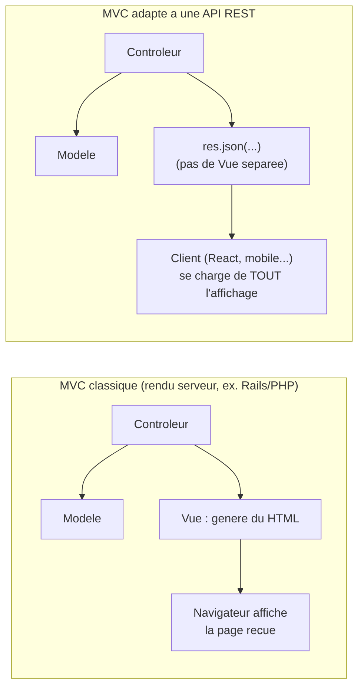

<div class="chapitre-titre-num">CHAPITRE 16</div>

# Architecture MVC

<div class="encadre objectif">
<span class="encadre-titre">🎯 Objectif du chapitre</span>
Situer le pattern MVC (Modèle-Vue-Contrôleur) dans le contexte spécifique d'une API REST (sans vue serveur classique), comprendre son origine et ses limites qui motivent l'architecture en couches du chapitre 17. À la fin de ce chapitre, tu sauras expliquer avec précision — y compris en entretien technique — pourquoi le terme "MVC" est à la fois très employé et souvent mal compris dans l'écosystème Express.
</div>

<div class="encadre scenario">
<span class="encadre-titre">🎬 Mise en situation</span>
En entretien technique, on te montre l'arborescence d'un projet Express avec des dossiers `controllers/` et `models/`, et on te demande : "ce projet suit-il une architecture MVC ?" Tu ouvres un contrôleur et découvres qu'il contient 150 lignes mêlant validation, requêtes SQL brutes et logique métier. Le recruteur veut savoir si tu sais reconnaître qu'un nommage de dossiers "à la MVC" ne garantit en rien une architecture MVC réellement bien appliquée. Ce chapitre te donne exactement les mots pour répondre avec précision — et pour comprendre pourquoi ce projet aurait grand besoin de l'architecture en couches du chapitre 17.
</div>

## 16.1 MVC : rappel du principe général et de son origine

<div class="encadre astuce">
<span class="encadre-titre">💡 Les trois rôles de MVC</span>
- **Modèle (Model)** : les données et leur structure (un schéma Prisma/Mongoose, chapitre 34-36).
- **Vue (View)** : la présentation du résultat à l'utilisateur.
- **Contrôleur (Controller)** : reçoit une requête, orchestre modèle et vue.
</div>

MVC n'est pas né avec le web : le pattern a été formalisé en 1979 par Trygve Reenskaug, alors chercheur chez Xerox PARC, pour l'environnement Smalltalk — bien avant l'existence du HTTP ou de JavaScript. Son objectif original était de séparer les données (Modèle) de leur représentation visuelle (Vue), avec un intermédiaire (Contrôleur) gérant les interactions utilisateur. Ce n'est que des décennies plus tard que le pattern a été adapté massivement au développement web (Ruby on Rails, ASP.NET MVC, puis Express).

<div class="encadre retenir">
<span class="encadre-titre">📌 À retenir</span>
MVC est un pattern **plus ancien que le web lui-même**. Cette origine explique pourquoi son adaptation à une API REST (sans aucun affichage visuel côté serveur) demande une réinterprétation, développée dans ce chapitre.
</div>

## 16.2 MVC dans une API REST : pas de "vue" traditionnelle

<div class="encadre attention">
<span class="encadre-titre">⚠️ Particularité importante : une API REST n'a pas de "vue" au sens classique</span>
Dans une application web traditionnelle générant du HTML côté serveur (comme un projet PHP ou une application Express avec des templates EJS/Pug), la "Vue" génère une page HTML. Dans une **API REST** (le sujet de ce manuel), il n'y a **aucun rendu HTML côté serveur** — la "vue" se réduit à la sérialisation JSON de la réponse, réalisée directement par le contrôleur via `res.json(...)`. Le client (une application React, mobile, ou un autre service) se charge lui-même de tout affichage.
</div>



<div class="encadre astuce">
<span class="encadre-titre">💡 Explication du schéma</span>
La différence structurelle essentielle : dans le MVC classique, le serveur produit lui-même une représentation visuelle complète (HTML). Dans une API REST, le serveur ne produit que des **données brutes structurées** — toute la responsabilité de "Vue" est déplacée entièrement côté client, un client que le serveur ne contrôle même pas (il pourrait s'agir d'une app React, d'une app mobile, ou d'un autre service backend).
</div>

## 16.3 Le Modèle dans une API : au-delà du simple schéma

```js
// src/models/utilisateur.model.js — avec Mongoose (chapitre 36), par exemple
const mongoose = require("mongoose");

const utilisateurSchema = new mongoose.Schema({
  nom: { type: String, required: true },
  email: { type: String, required: true, unique: true },
  motDePasseHash: { type: String, required: true },
  role: { type: String, enum: ["UTILISATEUR", "ADMIN"], default: "UTILISATEUR" },
}, { timestamps: true });

module.exports = mongoose.model("Utilisateur", utilisateurSchema);
```

Le "Modèle" en contexte Node.js/Express désigne généralement le **schéma de données** (via un ORM/ODM comme Prisma, Sequelize ou Mongoose, chapitres 34-36), définissant la structure et les contraintes des données — pas la logique métier elle-même (qui vit dans les services, chapitre 15).

## 16.4 MVC face à d'autres patterns de présentation (contexte, pas usage direct dans ce manuel)

| Pattern | Qui orchestre ? | Où va la logique de présentation ? | Contexte typique |
|---|---|---|---|
| **MVC** | Contrôleur | Vue (séparée du Contrôleur) | Applications web à rendu serveur (Rails, ASP.NET) |
| **MVP** (Model-View-Presenter) | Presenter | Le Presenter connaît la Vue via une interface, la manipule directement | Applications desktop, Android historique |
| **MVVM** (Model-View-ViewModel) | Aucun orchestrateur central ; liaison de données bidirectionnelle | Le ViewModel expose un état observé automatiquement par la Vue | Frontend riche (Vue.js, Angular, WPF) |

<div class="encadre astuce">
<span class="encadre-titre">💡 Pourquoi mentionner MVP et MVVM dans un manuel backend</span>
Ce manuel ne construit jamais d'interface graphique (l'API REST n'a pas de "vue" propre, section 16.2) — mais ces variantes reviennent fréquemment en entretien technique dès qu'on aborde l'architecture logicielle en général. Savoir les distinguer, même brièvement, évite d'être pris au dépourvu si la question dépasse le strict périmètre backend.
</div>

## 16.5 Pourquoi MVC seul devient insuffisant pour une API complexe

<div class="encadre astuce">
<span class="encadre-titre">💡 Le triangle Modèle-Vue-Contrôleur ne dit rien sur l'organisation interne de la logique métier</span>
MVC répond bien à la question "où va le code qui reçoit une requête et retourne une réponse ?" (Contrôleur), et "où vit la structure des données ?" (Modèle). Mais il ne précise **rien** sur l'organisation de la logique métier elle-même à mesure qu'elle grandit : validation complexe, règles métier à plusieurs étapes, accès à plusieurs sources de données. C'est exactement le vide que comble l'**architecture en couches** du chapitre 17, en introduisant explicitement les couches Service et Repository entre Contrôleur et Modèle.
</div>

## 16.6 MVC "à la Express" en pratique

```
src/
├── controllers/     # "C" de MVC — reçoit la requête, retourne la réponse
├── models/            # "M" de MVC — schémas de données (Prisma/Mongoose/Sequelize)
├── routes/             # associe URL + méthode HTTP à un contrôleur
└── (pas de dossier "views/" pour une API REST pure)
```

<div class="encadre attention">
<span class="encadre-titre">⚠️ Un contrôleur "MVC" qui contient toute la logique métier n'est pas du MVC bien appliqué</span>
Beaucoup de tutoriels simplifiés placent **toute** la logique (validation, règles métier, accès direct aux données) directement dans le contrôleur, sous prétexte de "faire du MVC". Ce n'est pas une application correcte du pattern — même en MVC classique, le contrôleur ne devrait qu'**orchestrer**, jamais porter lui-même toute la complexité métier. C'est cette dérive fréquente que l'architecture en couches (chapitre 17) corrige explicitement, exactement le problème rencontré dans la mise en situation d'ouverture.
</div>

<div class="encadre mauvaise-pratique">
<span class="encadre-titre">❌ Mauvaise pratique observée très fréquemment</span>

```js
// controllers/utilisateurs.controller.js — "MVC" de nom seulement
async function creer(req, res) {
  if (!req.body.email.includes("@")) return res.status(400).json({ message: "Email invalide" });
  const existant = await Utilisateur.findOne({ email: req.body.email }); // logique + accès donnees ICI
  if (existant) return res.status(409).json({ message: "Email deja utilise" });
  const utilisateur = await Utilisateur.create(req.body); // encore de la logique metier ICI
  res.status(201).json(utilisateur);
}
```
Ce contrôleur porte le nom "MVC", mais concentre validation, règle métier (unicité) et accès aux données — exactement le nœud que le chapitre 17 dénoue en introduisant Service et Repository entre Contrôleur et Modèle.
</div>

## Atelier — Diagnostiquer un faux MVC

<div class="encadre exercice">
<span class="encadre-titre">🛠️ Atelier 16 — Reconnaître un MVC mal appliqué</span>

**Objectif** : s'entraîner à repérer, comme dans la mise en situation d'ouverture, la différence entre un nommage "MVC" et une architecture MVC réellement bien appliquée.

**Préparation** : le contrôleur de la section 16.6 ("Mauvaise pratique observée").

**Étapes détaillées** :
1. Liste, ligne par ligne, à quelle responsabilité appartient chaque instruction du contrôleur ci-dessus (HTTP, validation, règle métier, accès aux données).
2. Compte combien de responsabilités différentes se trouvent dans cette seule fonction.
3. Réécris ce contrôleur en suivant la séparation contrôleur/service du chapitre 15 (sans encore introduire de repository, qui arrive au chapitre 17).
4. Compare la longueur et la lisibilité du contrôleur avant/après.

**Validation** : le contrôleur réécrit ne devrait contenir aucune ligne de validation métier ni d'accès direct aux données — uniquement l'extraction de `req`, l'appel au service, et la mise en forme de `res`.

**Résultat attendu** : la capacité à répondre, comme dans la mise en situation d'ouverture d'entretien, avec un diagnostic précis plutôt qu'un simple "oui/non" sur la présence de dossiers nommés `controllers/`/`models/`.

**Dépannage** : si tu hésites sur la responsabilité d'une ligne, pose-toi la question du chapitre 15 : "cette ligne aurait-elle un sens hors d'une requête HTTP ?"

**Nettoyage** : aucun.
</div>

## Erreurs fréquentes

<div class="encadre attention">
<span class="encadre-titre">⚠️ Erreur n°1 — Confondre "avoir des dossiers nommés MVC" et "appliquer correctement MVC"</span>
Exactement le piège de la mise en situation d'ouverture et de la section 16.6 — la présence de dossiers `controllers/`/`models/` ne garantit rien sur la qualité réelle de la séparation des responsabilités à l'intérieur de ces fichiers.
</div>

<div class="encadre attention">
<span class="encadre-titre">⚠️ Erreur n°2 — Chercher une "Vue" qui n'existe pas dans une API REST</span>
Un débutant qui découvre MVC via un tutoriel d'application web à rendu serveur peut chercher, à tort, un équivalent direct de "vue" dans une API REST pure. Il n'y en a pas au sens classique — seulement une sérialisation JSON, comme expliqué en section 16.2.
</div>

## Débogage

<div class="encadre attention">
<span class="encadre-titre">🩺 Symptôme : un contrôleur devient difficile à faire évoluer sans casser autre chose</span>

- **Cause probable** : trop de responsabilités mélangées dans le contrôleur (erreur fréquente n°1), un signe que MVC seul ne suffit plus.
- **Solution** : introduire la séparation contrôleur/service (chapitre 15), puis l'architecture en couches complète (chapitre 17) si la complexité continue de croître.
</div>

## En entreprise

- **Le terme "MVC" reste très employé, souvent de façon approximative** : de nombreuses équipes désignent par "MVC" une architecture qui, en pratique, est bien plus proche de l'architecture en couches du chapitre 17 (avec Service et Repository) — le nom "MVC" restant par habitude ou par simplicité de communication.
- **Frameworks avec MVC intégré** : des frameworks comme NestJS (inspiré d'Angular) structurent explicitement contrôleurs, services et modules, formalisant une architecture proche de celle enseignée aux chapitres 15-17, sans jamais avoir besoin de l'imposer manuellement comme avec Express.

## Entretien technique

<div class="encadre exercice">
<span class="encadre-titre">💼 Questions fréquemment posées en entretien</span>

**Q1. "Une API REST a-t-elle une 'Vue' au sens MVC classique ?"**
Réponse attendue : non, une API REST ne génère aucun rendu visuel côté serveur ; la sérialisation JSON tient lieu de "vue", réalisée directement dans le contrôleur via `res.json()`.

**Q2. "Un projet avec des dossiers controllers/ et models/ suit-il forcément une architecture MVC bien appliquée ?"**
Réponse attendue : non — le nommage des dossiers ne garantit rien sur la séparation réelle des responsabilités à l'intérieur des fichiers ; un contrôleur peut très bien porter toute la logique métier malgré une arborescence "MVC".

**Q3. "Pourquoi MVC seul est-il souvent jugé insuffisant pour une API complexe ?"**
Réponse attendue : parce qu'il ne précise rien sur l'organisation interne de la logique métier à mesure qu'elle grandit (validation, règles à plusieurs étapes, accès à plusieurs sources de données) — d'où l'introduction de couches supplémentaires (Service, Repository) au chapitre 17.
</div>

## Optimisation, sécurité et maintenabilité

<div class="encadre bonne-pratique">
<span class="encadre-titre">✅ Maintenabilité</span>
Ne jamais se satisfaire d'une arborescence "MVC" comme preuve suffisante de qualité architecturale — vérifier systématiquement le contenu réel des contrôleurs lors d'une revue de code, exactement la vigilance attendue dans la mise en situation d'ouverture.
</div>

## Résumé du chapitre

- MVC répartit responsabilités entre Modèle (données), Vue (présentation), Contrôleur (orchestration) — formalisé en 1979, bien avant le web.
- Dans une API REST, il n'y a pas de "vue" au sens classique : la sérialisation JSON en tient lieu, directement dans le contrôleur.
- MVC seul ne structure pas suffisamment la logique métier complexe — d'où l'architecture en couches (chapitre 17), qui introduit explicitement Service et Repository.
- Un contrôleur ne devrait jamais porter lui-même la logique métier, même en MVC "classique" — le nommage des dossiers ne garantit rien sur la qualité réelle de la séparation.

## Quiz

<div class="encadre exercice">
<span class="encadre-titre">📝 QCM</span>

1. Que représente la "Vue" dans une API REST pure ?
   - a) Un template HTML généré côté serveur
   - b) La sérialisation JSON de la réponse
   - c) Le fichier CSS de l'application
   - d) Rien, ce concept n'existe pas du tout

2. En quelle année MVC a-t-il été formalisé, et pour quel environnement ?
   - a) 2005, pour Ruby on Rails
   - b) 1995, pour Java
   - c) 1979, pour Smalltalk
   - d) 2010, pour Node.js

3. Un projet avec des dossiers controllers/ et models/ applique-t-il forcément MVC correctement ?
   - a) Oui, toujours
   - b) Non, le nommage ne garantit rien sur la séparation réelle des responsabilités
   - c) Seulement si le projet utilise MongoDB
   - d) Seulement en production

**Corrigé** : 1-b, 2-c, 3-b.
</div>

<div class="encadre exercice">
<span class="encadre-titre">📝 Vrai ou Faux</span>

1. MVC a été inventé pour le développement web. — **Faux** (Smalltalk, 1979, bien avant le web).
2. Une API REST pure génère du HTML via sa "Vue". — **Faux** (elle retourne du JSON, pas de rendu HTML).
3. MVC seul suffit à structurer toute la complexité d'une logique métier avancée. — **Faux** (d'où l'architecture en couches du chapitre 17).
</div>

<div class="encadre exercice">
<span class="encadre-titre">📝 Question ouverte</span>

Reprends la question de la mise en situation d'ouverture ("ce projet suit-il une architecture MVC ?") et rédige la réponse complète que tu donnerais, en 3-4 phrases.

**Corrigé (exemple de réponse)** : "Le projet a effectivement une arborescence nommée MVC (dossiers `controllers/` et `models/`), mais ce n'est pas une garantie suffisante. En ouvrant les contrôleurs, je vois qu'ils portent eux-mêmes la validation, les règles métier et l'accès direct aux données — ce qui correspond à un MVC mal appliqué, où le contrôleur devrait se limiter à orchestrer. Une vraie amélioration consisterait à extraire cette logique dans des services (chapitre 15) et repositories (chapitre 17), gardant les contrôleurs courts et testables."
</div>

## Exercices

<div class="encadre exercice">
<span class="encadre-titre">📝 Exercice 16.1</span>

Reprends le contrôleur "MVC de nom seulement" de la section 16.6 et réécris-le en séparant explicitement contrôleur et service, en t'appuyant sur le modèle du chapitre 15.
</div>

**Corrigé :**
```js
// controllers/utilisateurs.controller.js
async function creer(req, res, next) {
  try {
    const utilisateur = await UtilisateurService.creerUtilisateur(req.body);
    res.status(201).json(utilisateur);
  } catch (erreur) {
    next(erreur);
  }
}
```
```js
// services/utilisateurs.service.js
async function creerUtilisateur({ nom, email }) {
  if (!email.includes("@")) {
    throw new ValidationError("Email invalide");
  }
  const existant = await Utilisateur.findOne({ email });
  if (existant) {
    throw new ConflitError("Email déjà utilisé");
  }
  return Utilisateur.create({ nom, email });
}
```

## Checklist de fin de chapitre

<ul class="checklist">
<li>☐ Je connais l'origine du pattern MVC et son adaptation à une API REST.</li>
<li>☐ Je sais expliquer pourquoi une API REST n'a pas de "Vue" au sens classique.</li>
<li>☐ Je sais distinguer un nommage "MVC" d'une architecture MVC réellement bien appliquée.</li>
<li>☐ Je connais l'existence de MVP et MVVM, sans avoir besoin de les maîtriser en profondeur.</li>
<li>☐ Je comprends pourquoi MVC seul motive l'architecture en couches du chapitre 17.</li>
</ul>

## FAQ

<dl class="faq">
<dt>Express impose-t-il une architecture MVC ?</dt>
<dd>Non, Express est délibérément non-prescriptif — aucune structure de dossiers n'est imposée. La convention `controllers/`/`models/`/`routes/` est une pratique communautaire largement adoptée, pas une contrainte du framework.</dd>

<dt>Faut-il un dossier "views/" même pour une API REST ?</dt>
<dd>Non, sauf si l'application sert aussi des pages HTML rendues côté serveur (rare pour une API REST pure destinée à un frontend séparé) — dans ce cas uniquement, un moteur de templates (EJS, Pug) justifierait un dossier `views/`.</dd>

<dt>MVC et l'architecture en couches (chapitre 17) sont-ils incompatibles ?</dt>
<dd>Non, ils se complètent : l'architecture en couches peut être vue comme un raffinement du "C" de MVC, précisant comment organiser ce qui se passe entre le Contrôleur et le Modèle plutôt que de tout mélanger dans le Contrôleur.</dd>
</dl>

## Références et pour aller plus loin

- Article original de Trygve Reenskaug sur MVC (Xerox PARC, 1979) : [https://folk.universitetetioslo.no/trygver/themes/mvc/mvc-index.html](https://folk.universitetetioslo.no/trygver/themes/mvc/mvc-index.html)
- Documentation Express — absence de structure imposée : [https://expressjs.com/en/starter/faq.html](https://expressjs.com/en/starter/faq.html)

*Chapitre suivant : l'architecture en couches, qui structure la logique métier au-delà de ce que MVC formalise.*
