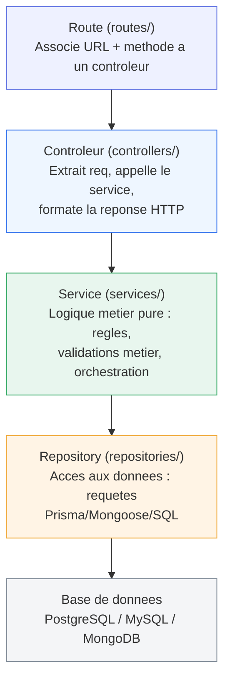

<div class="chapitre-titre-num">CHAPITRE 17</div>

# Architecture en couches (repository/DAO)

<div class="encadre objectif">
<span class="encadre-titre">🎯 Objectif du chapitre</span>
Introduire la couche Repository entre Service et base de données, comprendre son intérêt (indépendance vis-à-vis du système de stockage, testabilité), et assembler l'architecture complète à quatre couches de ce manuel. À la fin de ce chapitre, tu sauras pourquoi un changement de base de données ne devrait jamais toucher à ta logique métier, si l'architecture est bien respectée.
</div>

<div class="encadre scenario">
<span class="encadre-titre">🎬 Mise en situation</span>
Après 18 mois en production sur MongoDB, ton client décide de migrer vers PostgreSQL pour bénéficier de transactions plus strictes sur ses opérations financières. Dans un projet où les services appelaient directement Mongoose partout, cette migration obligerait à réécrire toute la logique métier. Dans un projet respectant la couche Repository de ce chapitre, seuls les fichiers du dossier `repositories/` changent — services et contrôleurs restent identiques au caractère près. Ce chapitre construit exactement cette garantie.
</div>

## 17.1 Le problème résolu par la couche Repository

Rappel du chapitre 15 : le service `UtilisateurService` appelle `UtilisateurRepository.trouverParEmail(...)`. Sans cette couche intermédiaire, le service contiendrait directement des requêtes SQL/Prisma/Mongoose — le mélangeant à la logique métier, et le liant **rigidement** à une technologie de stockage précise.

<div class="encadre astuce">
<span class="encadre-titre">💡 Analogie</span>
Le Repository, c'est une prise électrique universelle : peu importe si la centrale électrique derrière change (hydraulique, solaire, thermique), l'appareil branché dessus (le service) continue de fonctionner sans rien savoir de cette source, tant que la prise (l'interface du repository) reste la même.
</div>

## 17.2 Le Repository : encapsuler l'accès aux données

```js
// src/repositories/utilisateurs.repository.js — implémentation avec Prisma (chapitre 34)
const prisma = require("../config/prisma");

async function trouverParEmail(email) {
  return prisma.utilisateur.findUnique({ where: { email } });
}

async function trouverParId(id) {
  return prisma.utilisateur.findUnique({ where: { id } });
}

async function creer({ nom, email, motDePasseHash }) {
  return prisma.utilisateur.create({
    data: { nom, email, motDePasseHash },
  });
}

async function listerTous() {
  return prisma.utilisateur.findMany({ orderBy: { nom: "asc" } });
}

module.exports = { trouverParEmail, trouverParId, creer, listerTous };
```

<div class="encadre astuce">
<span class="encadre-titre">💡 Le service ne sait pas (et n'a pas besoin de savoir) que Prisma est utilisé derrière</span>
`UtilisateurService.creerUtilisateur(...)` (chapitre 15) appelle `UtilisateurRepository.creer(...)` sans connaître les détails d'implémentation — que ce soit du Prisma, du Mongoose, ou même du SQL brut avec le driver `pg`. Si la technologie de stockage change un jour (migration de MongoDB vers PostgreSQL, par exemple, exactement la mise en situation d'ouverture), **seul** le repository doit être réécrit ; service et contrôleur restent totalement inchangés.
</div>

## 17.3 L'architecture complète à quatre couches



<div class="encadre astuce">
<span class="encadre-titre">💡 Chaque couche ne parle qu'à ses voisines immédiates</span>
Un contrôleur n'appelle **jamais** directement un repository (il passe toujours par le service) ; un repository ne contient **jamais** de logique métier (seulement des requêtes de données). Cette discipline stricte garantit que chaque couche reste remplaçable et testable indépendamment des autres.
</div>

<div class="encadre retenir">
<span class="encadre-titre">📌 À retenir</span>
Cette architecture à quatre couches est celle utilisée dans le reste de ce manuel, y compris le projet final MediAPI (chapitres 41-47). La retenir maintenant évite de devoir la redécouvrir plus tard.
</div>

## 17.4 Interface de Repository (pour un couplage encore plus faible)

```js
// Un "contrat" implicite que toute implémentation de repository doit respecter
// (JavaScript n'a pas d'interfaces formelles comme Java/TypeScript, mais la convention reste utile)

// repositories/utilisateurs.repository.prisma.js
module.exports = {
  trouverParEmail: async (email) => { /* ... implémentation Prisma ... */ },
  creer: async (donnees) => { /* ... */ },
};

// repositories/utilisateurs.repository.memoire.js — pour les TESTS (chapitre 29), sans vraie base de données
let utilisateurs = [];
module.exports = {
  trouverParEmail: async (email) => utilisateurs.find((u) => u.email === email) || null,
  creer: async (donnees) => {
    const nouveau = { id: utilisateurs.length + 1, ...donnees };
    utilisateurs.push(nouveau);
    return nouveau;
  },
};
```

```js
// Le service reçoit son repository en paramètre (injection de dépendance)
function creerUtilisateurService(utilisateurRepository) {
  return async function creerUtilisateur({ nom, email, motDePasse }) {
    const existant = await utilisateurRepository.trouverParEmail(email);
    // ...
  };
}

// En production
const UtilisateurService = creerUtilisateurService(require("./repositories/utilisateurs.repository.prisma"));

// Dans un test (chapitre 29), sans base de données réelle
const UtilisateurServiceTest = creerUtilisateurService(require("./repositories/utilisateurs.repository.memoire"));
```

## 17.5 TypeScript rend ce contrat explicite

<div class="encadre astuce">
<span class="encadre-titre">💡 Sans TypeScript, le contrat de repository reste une simple convention</span>
En JavaScript pur, rien n'empêche techniquement une implémentation de repository d'oublier une méthode attendue — l'erreur ne se manifesterait qu'à l'exécution. En **TypeScript**, une véritable interface ferait détecter cette omission **à la compilation**, avant même de lancer le code.
</div>

```typescript
// repositories/utilisateurs.repository.interface.ts
export interface Utilisateur {
  id: number;
  nom: string;
  email: string;
  motDePasseHash: string;
}

export interface UtilisateurRepository {
  trouverParEmail(email: string): Promise<Utilisateur | null>;
  trouverParId(id: number): Promise<Utilisateur | null>;
  creer(donnees: Omit<Utilisateur, "id">): Promise<Utilisateur>;
  listerTous(): Promise<Utilisateur[]>;
}
```

```typescript
// repositories/utilisateurs.repository.prisma.ts
import { UtilisateurRepository, Utilisateur } from "./utilisateurs.repository.interface";
import { prisma } from "../config/prisma";

// "implements" force le compilateur a verifier que TOUTES les methodes de l'interface
// sont bien presentes, avec la BONNE signature — une methode manquante ou mal typee
// est une erreur de COMPILATION, jamais une surprise decouverte en production.
export const utilisateurRepositoryPrisma: UtilisateurRepository = {
  async trouverParEmail(email) {
    return prisma.utilisateur.findUnique({ where: { email } });
  },
  async trouverParId(id) {
    return prisma.utilisateur.findUnique({ where: { id } });
  },
  async creer(donnees) {
    return prisma.utilisateur.create({ data: donnees });
  },
  async listerTous() {
    return prisma.utilisateur.findMany({ orderBy: { nom: "asc" } });
  },
};
```

<div class="encadre performance">
<span class="encadre-titre">🚀 Maintenabilité — ce que gagne concrètement l'équipe</span>
Si un développeur ajoute une méthode `supprimer(id)` à l'interface `UtilisateurRepository` mais oublie de l'implémenter dans `utilisateurs.repository.memoire.ts` (utilisée pour les tests), TypeScript refuse de compiler avec un message précis — l'erreur est détectée **avant** d'exécuter le moindre test, pas découverte au moment où un test échoue mystérieusement.
</div>

## Atelier — Rendre un service interchangeable entre deux repositories

<div class="encadre exercice">
<span class="encadre-titre">🛠️ Atelier 17 — Migration simulée entre deux implémentations</span>

**Objectif** : simuler concrètement la migration de la mise en situation d'ouverture, à petite échelle.

**Préparation** : le service et repository "produits" de l'exercice 17.1 (en mémoire).

**Étapes détaillées** :
1. Crée une seconde implémentation de repository `produits.repository.fichier.js`, qui stocke les produits dans un fichier JSON sur disque (via `fs/promises`, chapitre 11) au lieu d'un tableau en mémoire, mais respecte exactement les mêmes méthodes (`listerTous`, `trouverParId`, `creer`).
2. Modifie le service pour qu'il reçoive son repository en paramètre (pattern de la section 17.4), au lieu de l'importer directement.
3. Fais fonctionner le service d'abord avec le repository en mémoire, puis avec le repository fichier, **sans modifier une seule ligne du service**.

**Validation** : le service doit produire un comportement identique quel que soit le repository injecté, prouvant son indépendance vis-à-vis du mécanisme de stockage.

**Résultat attendu** : la preuve concrète, à petite échelle, de ce que permettrait une vraie migration MongoDB → PostgreSQL sans toucher à la logique métier.

**Dépannage** : si le service doit être modifié pour fonctionner avec la seconde implémentation, c'est que les deux repositories n'exposent pas exactement la même interface (mêmes noms de méthodes, mêmes types de retour) — corrige l'écart.

**Nettoyage** : supprime le fichier JSON de test créé.
</div>

## Erreurs fréquentes

<div class="encadre attention">
<span class="encadre-titre">⚠️ Erreur n°1 — Un contrôleur qui appelle directement un repository, en sautant le service</span>

```js
// ❌ Le contrôleur contourne le service, appelle directement le repository
async function lister(req, res) {
  const utilisateurs = await UtilisateurRepository.listerTous(); // ⚠️ aucune règle métier appliquée (filtrage des mots de passe, etc.)
  res.json(utilisateurs);
}
```
Ce raccourci semble anodin sur une lecture simple, mais **casse la garantie** que toute donnée sortant de la base passe par les règles métier du service (filtrage des champs sensibles, transformation, autorisation fine) — toujours passer par le service, même pour une simple lecture.
</div>

<div class="encadre attention">
<span class="encadre-titre">⚠️ Erreur n°2 — Un repository qui contient de la logique métier</span>

```js
// ❌ Le repository ne devrait JAMAIS decider si un email est "valide" — c'est une regle metier
async function creer({ nom, email }) {
  if (!email.includes("@")) throw new Error("Email invalide"); // n'a rien a faire ICI
  return prisma.utilisateur.create({ data: { nom, email } });
}
```
Un repository ne devrait exécuter que des opérations de stockage/lecture pures — toute règle métier (validation, calcul, décision) appartient au service qui l'appelle.
</div>

## Débogage

<div class="encadre attention">
<span class="encadre-titre">🩺 Symptôme : une donnée sensible (mot de passe haché) apparaît dans une réponse API</span>

- **Cause probable** : un contrôleur qui appelle directement le repository, sans passer par le filtrage du service (erreur fréquente n°1).
- **Solution** : vérifier que toutes les routes de lecture passent bien par un service qui filtre les champs sensibles avant de retourner la donnée.
</div>

## En entreprise

- **Migration de base de données facilitée** : exactement la mise en situation d'ouverture — une architecture en couches bien respectée réduit une migration de base de données à une réécriture du seul dossier `repositories/`.
- **Tests rapides sans vraie base de données** : de nombreuses équipes utilisent une implémentation de repository "en mémoire" (section 17.4) pour exécuter des centaines de tests de service en quelques secondes, réservant les tests avec une vraie base de données aux tests d'intégration (chapitre 30).

## Entretien technique

<div class="encadre exercice">
<span class="encadre-titre">💼 Questions fréquemment posées en entretien</span>

**Q1. "Quel est le rôle du repository dans une architecture en couches ?"**
Réponse attendue : encapsuler l'accès aux données (requêtes vers la base), isolant le service de la technologie de stockage précise — un changement de base de données ne devrait toucher que le repository.

**Q2. "Pourquoi un contrôleur ne devrait-il jamais appeler directement un repository ?"**
Réponse attendue : pour garantir que toute donnée passe par les règles métier du service (filtrage, validation, transformation) avant d'atteindre le client ou d'être persistée.

**Q3. "Comment TypeScript renforce-t-il le pattern Repository ?"**
Réponse attendue : une interface TypeScript formalise le contrat attendu (méthodes, signatures), et le compilateur refuse de compiler une implémentation incomplète ou incorrecte — une erreur détectée avant l'exécution, pas en production.
</div>

## Optimisation, sécurité et maintenabilité

<div class="encadre bonne-pratique">
<span class="encadre-titre">✅ Maintenabilité</span>
Adopter dès le départ la convention "un repository par ressource, jamais de logique métier à l'intérieur" — une règle simple à vérifier en revue de code, qui évite la dérive de l'erreur fréquente n°2.
</div>

## Résumé du chapitre

- Le **Repository** encapsule l'accès aux données, isolant le service de la technologie de stockage précise (Prisma, Mongoose, SQL brut).
- L'architecture complète à quatre couches (Route → Contrôleur → Service → Repository → BDD) garantit que chaque couche ne communique qu'avec ses voisines immédiates.
- Une implémentation de repository "en mémoire" facilite grandement les tests unitaires du service, sans dépendre d'une vraie base de données.
- TypeScript rend le contrat de repository explicite et vérifiable à la compilation, via une interface formelle.
- Un contrôleur ne doit jamais appeler directement un repository, même pour une simple lecture — toujours passer par le service.

## Quiz

<div class="encadre exercice">
<span class="encadre-titre">📝 QCM</span>

1. Que devrait contenir un repository ?
   - a) De la logique métier complexe
   - b) Uniquement des opérations d'accès aux données
   - c) Le rendu des réponses HTTP
   - d) La validation des entrées utilisateur

2. Si la base de données change (MongoDB vers PostgreSQL), quelle couche doit changer ?
   - a) Le contrôleur
   - b) Le repository uniquement
   - c) Toute l'application
   - d) Uniquement les routes

3. Que garantit une interface TypeScript sur un repository ?
   - a) Une meilleure performance d'exécution
   - b) Une vérification du contrat à la compilation
   - c) Un chiffrement automatique des données
   - d) Rien de particulier

**Corrigé** : 1-b, 2-b, 3-b.
</div>

<div class="encadre exercice">
<span class="encadre-titre">📝 Vrai ou Faux</span>

1. Un contrôleur peut légitimement appeler directement un repository pour une simple lecture. — **Faux**.
2. Un repository en mémoire facilite les tests unitaires d'un service. — **Vrai**.
3. Un repository devrait valider les règles métier avant de sauvegarder une donnée. — **Faux** (rôle du service).
</div>

<div class="encadre exercice">
<span class="encadre-titre">📝 Question ouverte</span>

Pourquoi l'injection du repository en paramètre du service (section 17.4) est-elle particulièrement utile pour les tests, comparée à un `require()` direct à l'intérieur du service ?

**Corrigé** : avec un `require()` direct, le service reste lié en dur à une implémentation précise (souvent celle de production, avec une vraie base de données) — impossible de le tester sans cette dépendance réelle. En recevant le repository en paramètre, le même service peut être testé avec une implémentation en mémoire rapide et prévisible, ou utilisé en production avec l'implémentation réelle, sans aucune modification de son propre code.
</div>

## Exercices

<div class="encadre exercice">
<span class="encadre-titre">📝 Exercice 17.1</span>

Crée un repository `produits.repository.js` (avec une implémentation en mémoire simple, un tableau JavaScript) exposant `listerTous()`, `trouverParId(id)`, `creer(donnees)`, puis un service `produits.service.js` qui l'utilise pour exposer `listerProduitsDisponibles()` (ne retournant que les produits avec `stock > 0`).
</div>

**Corrigé :**
```js
// repositories/produits.repository.js
let produits = [
  { id: 1, nom: "Riz", stock: 10 },
  { id: 2, nom: "Savon", stock: 0 },
];

module.exports = {
  listerTous: async () => produits,
  trouverParId: async (id) => produits.find((p) => p.id === id) || null,
  creer: async (donnees) => {
    const nouveau = { id: produits.length + 1, ...donnees };
    produits.push(nouveau);
    return nouveau;
  },
};
```
```js
// services/produits.service.js
const ProduitRepository = require("../repositories/produits.repository");

async function listerProduitsDisponibles() {
  const produits = await ProduitRepository.listerTous();
  return produits.filter((p) => p.stock > 0);
}

module.exports = { listerProduitsDisponibles };
```

## Checklist de fin de chapitre

<ul class="checklist">
<li>☐ Je comprends le rôle exact du repository dans l'architecture en couches.</li>
<li>☐ Je sais expliquer pourquoi un service ne doit pas connaître la technologie de stockage.</li>
<li>☐ Je sais créer une implémentation de repository en mémoire pour les tests.</li>
<li>☐ Je comprends comment TypeScript formalise le contrat d'un repository.</li>
<li>☐ Je ne fais jamais appeler un repository directement depuis un contrôleur.</li>
</ul>

## FAQ

<dl class="faq">
<dt>Faut-il toujours une interface TypeScript pour un repository ?</dt>
<dd>Non, ce n'est utile que si le projet utilise TypeScript. En JavaScript pur, la convention de nommage cohérente entre implémentations (mêmes méthodes, mêmes types de retour) reste la seule protection, moins stricte mais suffisante pour beaucoup de projets.</dd>

<dt>Le repository doit-il gérer les transactions de base de données ?</dt>
<dd>Souvent oui pour des opérations simples, mais des transactions complexes impliquant plusieurs repositories sont généralement orchestrées au niveau du service, qui connaît la portée métier complète de l'opération.</dd>

<dt>Un projet avec un seul type de base de données a-t-il vraiment besoin d'un repository ?</dt>
<dd>Même sans changement de base de données prévu, le repository apporte un bénéfice réel pour les tests (implémentation en mémoire) et la lisibilité (séparation claire des responsabilités) — un bénéfice qui dépasse la seule portabilité technologique.</dd>
</dl>

## Références et pour aller plus loin

- Pattern Repository (Martin Fowler, Patterns of Enterprise Application Architecture) : [https://martinfowler.com/eaaCatalog/repository.html](https://martinfowler.com/eaaCatalog/repository.html)
- Documentation TypeScript sur les interfaces : [https://www.typescriptlang.org/docs/handbook/2/objects.html](https://www.typescriptlang.org/docs/handbook/2/objects.html)

*Chapitre suivant : la validation des données, pour garantir qu'aucune donnée invalide n'atteigne la logique métier.*
