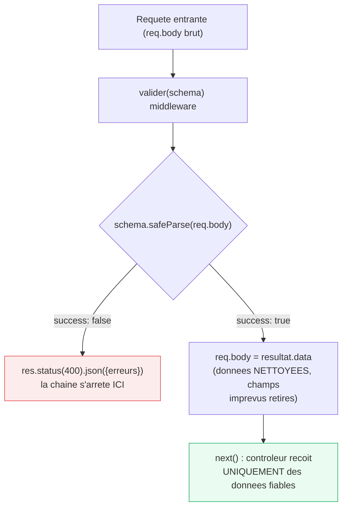

<div class="chapitre-titre-num">CHAPITRE 18</div>

# Validation des données

<div class="encadre objectif">
<span class="encadre-titre">🎯 Objectif du chapitre</span>
Comprendre pourquoi valider les entrées est non négociable pour une API, et maîtriser Zod comme solution de validation moderne, avec un aperçu de Joi et express-validator. À la fin de ce chapitre, tu sauras écrire un schéma de validation déclaratif réutilisable, et tu ne considéreras plus jamais qu'une validation frontend suffit à protéger une API.
</div>

<div class="encadre scenario">
<span class="encadre-titre">🎬 Mise en situation</span>
Un audit de sécurité externe, commandé par un client avant sa mise en production, révèle qu'un attaquant peut envoyer directement `{"nom": "", "age": -5, "role": "ADMIN"}` à l'endpoint de création d'utilisateur via Postman, sans jamais passer par le formulaire frontend — et que l'API l'accepte tel quel, y compris le champ `role` que le formulaire ne propose jamais mais que l'API traite naïvement comme n'importe quel autre champ. Le rapport d'audit conclut : "la validation frontend n'est pas une mesure de sécurité." Ce chapitre construit exactement la protection qui manquait.
</div>

## 18.1 Pourquoi valider systématiquement les entrées

<div class="encadre attention">
<span class="encadre-titre">⚠️ Ne jamais faire confiance aux données venant du client</span>
Toute donnée provenant d'une requête HTTP (`req.body`, `req.params`, `req.query`) doit être considérée comme **potentiellement malveillante ou incorrecte**, quel que soit le frontend censé l'envoyer correctement — un client mal codé, un outil comme Postman/curl, ou une tentative délibérée d'exploitation peuvent tous envoyer des données arbitraires directement à l'API, en contournant totalement le frontend.
</div>

<div class="encadre securite">
<span class="encadre-titre">🔒 Sécurité — le piège du champ "role" de la mise en situation</span>
Une validation qui se contente de vérifier "les champs attendus sont-ils présents et bien formés ?" sans **rejeter explicitement** les champs non attendus (comme `role` dans la mise en situation) laisse la porte ouverte à une attaque de "mass assignment" — un client qui ajoute un champ non prévu par le formulaire mais accepté silencieusement par l'API. Un bon schéma de validation définit une liste **fermée** de champs acceptés, rejetant tout le reste.
</div>

## 18.2 Validation manuelle (le point de départ, et ses limites)

```js
function validerCreationUtilisateur(req, res, next) {
  const { nom, email, motDePasse } = req.body;

  if (!nom || typeof nom !== "string" || nom.length < 2) {
    return res.status(400).json({ message: "Le nom doit contenir au moins 2 caractères" });
  }
  if (!email || !email.includes("@")) {
    return res.status(400).json({ message: "Email invalide" });
  }
  if (!motDePasse || motDePasse.length < 8) {
    return res.status(400).json({ message: "Le mot de passe doit contenir au moins 8 caractères" });
  }

  next();
}
```

Cette approche devient vite répétitive et fragile sur des objets complexes (champs imbriqués, tableaux, règles croisées) — exactement le problème que Zod (section 18.3) résout avec une syntaxe déclarative et réutilisable.

## 18.3 Zod : validation déclarative avec schémas

```
$ npm install zod
```

```js
// src/validators/utilisateurs.validator.js
const { z } = require("zod");

const creerUtilisateurSchema = z.object({
  nom: z.string().min(2, "Le nom doit contenir au moins 2 caractères").max(100),
  email: z.string().email("Format d'email invalide"),
  motDePasse: z.string().min(8, "8 caractères minimum"),
  age: z.number().int().min(18, "Doit être majeur").optional(),
});

module.exports = { creerUtilisateurSchema };
```

<div class="encadre astuce">
<span class="encadre-titre">💡 Zod rejette par défaut les champs non déclarés dans le schéma</span>
`z.object({...})` ignore silencieusement les clés en trop par défaut (comportement "strip") — un champ `role` envoyé par un attaquant (mise en situation) est automatiquement retiré de `resultat.data`, jamais transmis au service. Utiliser `.strict()` sur le schéma pour **rejeter explicitement** la requête entière si un champ inattendu est présent, un comportement encore plus strict recommandé pour les endpoints sensibles.
</div>

## 18.4 Middleware de validation générique avec Zod

```js
// src/middlewares/valider.middleware.js
function valider(schema) {
  return (req, res, next) => {
    const resultat = schema.safeParse(req.body);

    if (!resultat.success) {
      const erreurs = resultat.error.issues.map((issue) => ({
        champ: issue.path.join("."),
        message: issue.message,
      }));
      return res.status(400).json({ message: "Données invalides", erreurs });
    }

    req.body = resultat.data; // remplace req.body par la version VALIDÉE ET TYPÉE (valeurs coercées si nécessaire)
    next();
  };
}

module.exports = { valider };
```

```js
// routes/utilisateurs.routes.js
const { valider } = require("../middlewares/valider.middleware");
const { creerUtilisateurSchema } = require("../validators/utilisateurs.validator");

router.post("/", valider(creerUtilisateurSchema), utilisateursController.creer);
```

<div class="encadre astuce">
<span class="encadre-titre">💡 safeParse plutôt que parse dans un middleware</span>
`schema.parse(data)` lève une exception si la validation échoue (nécessitant un `try/catch`) ; `schema.safeParse(data)` retourne toujours un objet `{ success, data ou error }`, sans jamais lever d'exception — plus adapté à un contrôle de flux explicite dans un middleware.
</div>



<div class="encadre astuce">
<span class="encadre-titre">💡 Explication du schéma</span>
Après ce middleware, `req.body` n'est plus la donnée brute envoyée par le client — c'est une version validée, typée, et nettoyée des champs non attendus. Le contrôleur peut faire une confiance totale à `req.body` à partir de ce point, exactement ce qui manquait dans la mise en situation d'ouverture.
</div>

## 18.5 Validation des paramètres d'URL et de la query string

```js
const idParamSchema = z.object({
  id: z.string().regex(/^\d+$/, "L'id doit être un nombre").transform(Number),
});

function validerParams(schema) {
  return (req, res, next) => {
    const resultat = schema.safeParse(req.params);
    if (!resultat.success) {
      return res.status(400).json({ message: "Paramètres invalides" });
    }
    req.params = resultat.data;
    next();
  };
}

router.get("/:id", validerParams(idParamSchema), utilisateursController.obtenir);
```

## 18.6 Validation conditionnelle et règles croisées

```js
const creerCompteSchema = z
  .object({
    typeCompte: z.enum(["COURANT", "EPARGNE"]),
    soldeInitial: z.number().min(0),
    tauxInteret: z.number().min(0).max(1).optional(),
  })
  .refine(
    (donnees) => donnees.typeCompte !== "EPARGNE" || donnees.tauxInteret !== undefined,
    { message: "Le taux d'intérêt est obligatoire pour un compte épargne", path: ["tauxInteret"] }
  );
```

## 18.7 Alternatives : Joi et express-validator

```js
// Joi : syntaxe déclarative similaire à Zod, très répandue historiquement dans l'écosystème Express
const Joi = require("joi");

const schema = Joi.object({
  nom: Joi.string().min(2).max(100).required(),
  email: Joi.string().email().required(),
  motDePasse: Joi.string().min(8).required(),
});

const { error, value } = schema.validate(req.body);
```

```js
// express-validator : validation directement au niveau des middlewares de route, style "chaîné"
const { body, validationResult } = require("express-validator");

router.post(
  "/utilisateurs",
  body("email").isEmail().withMessage("Email invalide"),
  body("motDePasse").isLength({ min: 8 }).withMessage("8 caractères minimum"),
  (req, res, next) => {
    const erreurs = validationResult(req);
    if (!erreurs.isEmpty()) {
      return res.status(400).json({ erreurs: erreurs.array() });
    }
    next();
  }
);
```

| Critère | Zod | Joi | express-validator |
|---|---|---|---|
| Style | Schéma déclaratif, chaîné | Schéma déclaratif, chaîné | Chaîné directement sur la route |
| Intégration TypeScript | Excellente (type inféré automatiquement du schéma) | Correcte, mais type à déclarer séparément | Correcte, mais type à déclarer séparément |
| Rejet des champs non déclarés | Oui (`.strip()` par défaut, `.strict()` pour rejeter) | Oui, avec configuration explicite | Manuel (whitelist à gérer soi-même) |
| Popularité en 2026 | Croissante, standard de facto pour du code neuf | Élevée, très répandue dans du code existant | Élevée pour des validations simples ponctuelles |
| Cas d'usage idéal | Nouveau projet, surtout si TypeScript envisagé | Projet existant l'utilisant déjà | Validation ponctuelle simple, sans schéma séparé |

<div class="encadre astuce">
<span class="encadre-titre">💡 Pourquoi ce manuel privilégie Zod</span>
Zod combine une syntaxe concise, un typage TypeScript automatique si le projet l'adopte plus tard (chapitre 17), et une popularité croissante qui en fait un choix pérenne pour un nouveau projet. Joi reste parfaitement valide (très répandu dans du code existant) ; express-validator convient bien à des validations simples directement au niveau de la route, sans schéma séparé.
</div>

## Atelier — Bloquer l'attaque de la mise en situation d'ouverture

<div class="encadre exercice">
<span class="encadre-titre">🛠️ Atelier 18 — Rejeter un champ non attendu (mass assignment)</span>

**Objectif** : reproduire puis bloquer exactement l'attaque décrite dans la mise en situation d'ouverture.

**Préparation** : une route `POST /utilisateurs` avec le schéma Zod de la section 18.3, mais sans `.strict()`.

**Étapes détaillées** :
1. Envoie une requête avec Postman incluant un champ supplémentaire non prévu : `{"nom": "Test", "email": "test@test.com", "motDePasse": "12345678", "role": "ADMIN"}`.
2. Inspecte `req.body` après le middleware de validation (ajoute temporairement un `console.log(req.body)`) : observe que `role` a disparu (comportement `strip` par défaut de Zod).
3. Modifie le schéma pour utiliser `.strict()` au lieu du comportement par défaut.
4. Renvoie la même requête : observe cette fois un rejet complet en 400, avec un message signalant le champ non reconnu.

**Validation** : dans les deux cas (strip ou strict), le champ `role` ne doit jamais atteindre le service ou la base de données de façon incontrôlée.

**Résultat attendu** : comprendre la nuance entre "ignorer silencieusement" (`strip`, comportement par défaut) et "rejeter explicitement" (`.strict()`) un champ non attendu — et choisir consciemment lequel convient à chaque endpoint.

**Dépannage** : si `role` apparaît malgré tout dans `req.body` après validation, vérifie que le middleware de validation est bien appliqué **avant** le contrôleur dans la chaîne de la route.

**Nettoyage** : retire le `console.log` de debug ajouté à l'étape 2.
</div>

## Erreurs fréquentes

<div class="encadre attention">
<span class="encadre-titre">⚠️ Erreur n°1 — Valider uniquement côté frontend, jamais côté API</span>
La validation frontend améliore l'expérience utilisateur (retour immédiat), mais n'empêche **jamais** un client malveillant d'envoyer une requête directement à l'API en contournant totalement l'interface — exactement la découverte de l'audit de la mise en situation d'ouverture. La validation côté serveur (ce chapitre) est la **seule** qui compte réellement pour la sécurité et l'intégrité des données.
</div>

<div class="encadre attention">
<span class="encadre-titre">⚠️ Erreur n°2 — Valider après avoir déjà utilisé les données</span>

```js
async function creer(req, res, next) {
  const utilisateur = await UtilisateurService.creer(req.body); // ❌ utilisé AVANT toute validation !
  // ...
}
```
La validation doit **toujours** intervenir dans un middleware exécuté **avant** le contrôleur, jamais après coup dans la logique métier — sinon des données invalides peuvent déjà avoir causé des effets de bord (écriture en base, appel externe) avant d'être détectées comme invalides.
</div>

<div class="encadre attention">
<span class="encadre-titre">⚠️ Erreur n°3 — Ne pas rejeter les champs non déclarés (mass assignment)</span>
Exactement la faille de la mise en situation d'ouverture — un schéma qui ne borne pas explicitement les champs acceptés laisse potentiellement passer un champ sensible (`role`, `isAdmin`, `soldeCompte`) qu'un attaquant ajoute délibérément à sa requête.
</div>

## Débogage

<div class="encadre attention">
<span class="encadre-titre">🩺 Symptôme : un champ sensible se retrouve modifié alors qu'aucun formulaire ne le propose</span>

- **Cause** : mass assignment — un schéma de validation qui accepte silencieusement des champs non prévus (erreur fréquente n°3).
- **Diagnostic** : inspecter le schéma Zod concerné : utilise-t-il `.strict()`, ou le service extrait-il explicitement seulement les champs attendus après validation ?
- **Solution** : ajouter `.strict()` au schéma, ou explicitement déstructurer uniquement les champs attendus avant de les transmettre au repository.
</div>

## En entreprise

- **Validation systématique en CI** : de nombreuses équipes exigent qu'aucune route ne soit fusionnée sans middleware de validation associé, vérifié en revue de code.
- **Schémas partagés frontend/backend** : avec TypeScript, certaines équipes partagent le même schéma Zod entre frontend et backend (dans un paquet commun d'un monorepo, chapitre 4), garantissant une cohérence totale des règles de validation des deux côtés.

## Entretien technique

<div class="encadre exercice">
<span class="encadre-titre">💼 Questions fréquemment posées en entretien</span>

**Q1. "Pourquoi la validation frontend ne suffit-elle jamais pour sécuriser une API ?"**
Réponse attendue : un client peut envoyer une requête directement à l'API (via Postman, curl, ou un script malveillant) en contournant entièrement le frontend et sa validation — seule la validation côté serveur garantit l'intégrité réelle des données.

**Q2. "Qu'est-ce qu'une attaque de mass assignment, et comment Zod protège-t-il contre elle ?"**
Réponse attendue : l'envoi de champs non prévus par le formulaire mais acceptés silencieusement par l'API (comme un champ `role`) ; Zod retire par défaut les champs non déclarés du schéma (`strip`), ou peut les rejeter explicitement avec `.strict()`.

**Q3. "Pourquoi utiliser safeParse plutôt que parse dans un middleware Express ?"**
Réponse attendue : `safeParse` retourne toujours un objet `{ success, data/error }` sans lever d'exception, s'intégrant naturellement à un contrôle de flux explicite (`if (!resultat.success)`) plutôt que d'exiger un `try/catch`.
</div>

## Optimisation, sécurité et maintenabilité

<div class="encadre securite">
<span class="encadre-titre">🔒 Sécurité</span>
Considérer `.strict()` par défaut pour tout endpoint manipulant des champs sensibles (rôles, permissions, montants financiers) — le confort de `strip` (ignorer silencieusement) ne doit jamais s'appliquer là où un champ oublié pourrait avoir des conséquences de sécurité.
</div>

<div class="encadre bonne-pratique">
<span class="encadre-titre">✅ Maintenabilité</span>
Centraliser les schémas Zod dans un dossier `validators/` dédié (rappel du chapitre 5), réutilisables entre la création et la modification d'une même ressource via `.partial()` (rendant tous les champs optionnels pour un `PATCH`, par exemple).
</div>

## Résumé du chapitre

- Aucune donnée reçue du client ne doit être utilisée sans validation préalable côté serveur — la validation frontend n'est qu'un confort d'UX.
- Zod définit des schémas déclaratifs, réutilisables, avec `safeParse` pour un contrôle de flux explicite dans un middleware.
- `req.params` et `req.query` doivent être validés au même titre que `req.body`.
- Un schéma doit borner explicitement les champs acceptés (`.strict()`) pour se prémunir du mass assignment.
- Joi et express-validator restent des alternatives valables, selon les préférences d'équipe ou le code existant.

## Quiz

<div class="encadre exercice">
<span class="encadre-titre">📝 QCM</span>

1. Pourquoi la validation frontend ne suffit-elle jamais ?
   - a) Elle est toujours buggée
   - b) Un client peut contourner le frontend et envoyer une requête directement à l'API
   - c) Le frontend ne peut pas valider les emails
   - d) Ce n'est pas vrai, elle suffit largement

2. Que fait schema.safeParse(data) en cas d'échec de validation ?
   - a) Lève une exception
   - b) Retourne un objet { success: false, error }
   - c) Bloque le processus Node.js
   - d) Retourne undefined

3. Qu'est-ce qu'une attaque de mass assignment ?
   - a) Envoyer trop de requêtes en même temps
   - b) Envoyer un champ non prévu par le formulaire, accepté silencieusement par l'API
   - c) Une attaque par déni de service
   - d) Une faille propre à MongoDB uniquement

**Corrigé** : 1-b, 2-b, 3-b.
</div>

<div class="encadre exercice">
<span class="encadre-titre">📝 Vrai ou Faux</span>

1. Zod ignore par défaut les champs non déclarés dans le schéma. — **Vrai** (comportement "strip").
2. Valider req.params n'est pas nécessaire, seul req.body compte. — **Faux**.
3. La validation doit intervenir avant que le contrôleur n'utilise les données. — **Vrai**.
</div>

<div class="encadre exercice">
<span class="encadre-titre">📝 Question ouverte</span>

Pourquoi la découverte de l'audit de sécurité (mise en situation d'ouverture) aurait-elle été évitée si l'équipe avait utilisé `.strict()` dès le départ ?

**Corrigé** : avec `.strict()`, tout champ non explicitement déclaré dans le schéma (comme `role`) provoque un rejet complet de la requête en 400, plutôt que d'être silencieusement ignoré ou pire, silencieusement accepté par une validation manuelle incomplète. L'attaquant aurait reçu une erreur claire au lieu de réussir à faire passer un champ non prévu, rendant l'attaque immédiatement visible plutôt que découverte des mois plus tard par un audit externe.
</div>

## Exercices

<div class="encadre exercice">
<span class="encadre-titre">📝 Exercice 18.1</span>

Écris un schéma Zod pour la création d'un produit (`nom`: string 3-100 caractères, `prix`: nombre positif, `categorie`: une valeur parmi `"alimentaire"`, `"hygiene"`, `"autre"`), puis le middleware de validation correspondant appliqué à la route `POST /produits`.
</div>

**Corrigé :**
```js
const creerProduitSchema = z.object({
  nom: z.string().min(3).max(100),
  prix: z.number().positive("Le prix doit être positif"),
  categorie: z.enum(["alimentaire", "hygiene", "autre"]),
});

router.post("/", valider(creerProduitSchema), produitsController.creer);
```

## Checklist de fin de chapitre

<ul class="checklist">
<li>☐ Je sais expliquer pourquoi la validation frontend ne suffit jamais.</li>
<li>☐ Je sais écrire un schéma Zod avec règles simples et conditionnelles.</li>
<li>☐ Je sais créer un middleware de validation générique et réutilisable.</li>
<li>☐ Je valide systématiquement req.params et req.query, pas seulement req.body.</li>
<li>☐ Je comprends le risque de mass assignment et comment .strict() s'en protège.</li>
</ul>

## FAQ

<dl class="faq">
<dt>Faut-il valider aussi les réponses envoyées au client, pas seulement les entrées ?</dt>
<dd>Moins critique pour la sécurité (les données sortantes viennent du serveur, pas d'un client potentiellement malveillant), mais utile pour détecter des bugs de sérialisation — certaines équipes valident aussi leurs réponses en développement/test, rarement en production pour des raisons de performance.</dd>

<dt>Zod peut-il valider des fichiers uploadés ?</dt>
<dd>Zod valide des données structurées (JSON) ; la validation de fichiers (taille, type MIME) relève plutôt de Multer (chapitre 26), les deux pouvant coexister sur une même route.</dd>

<dt>Que faire si le même schéma sert à la fois la création et la modification (PATCH) ?</dt>
<dd>Zod propose `.partial()`, qui rend tous les champs d'un schéma existant optionnels — utile pour un `PATCH` où seuls certains champs sont fournis, sans dupliquer le schéma de création.</dd>
</dl>

## Références et pour aller plus loin

- Documentation Zod : [https://zod.dev](https://zod.dev)
- Documentation Joi : [https://joi.dev](https://joi.dev)
- Documentation express-validator : [https://express-validator.github.io](https://express-validator.github.io)
- OWASP sur le mass assignment : [https://owasp.org/www-project-web-security-testing-guide/](https://owasp.org/www-project-web-security-testing-guide/)

*Ceci clôt la Partie 3 (Express.js et architecture). Chapitre suivant : la gestion centralisée des erreurs, première étape de la Partie 4 (robustesse d'une API).*
