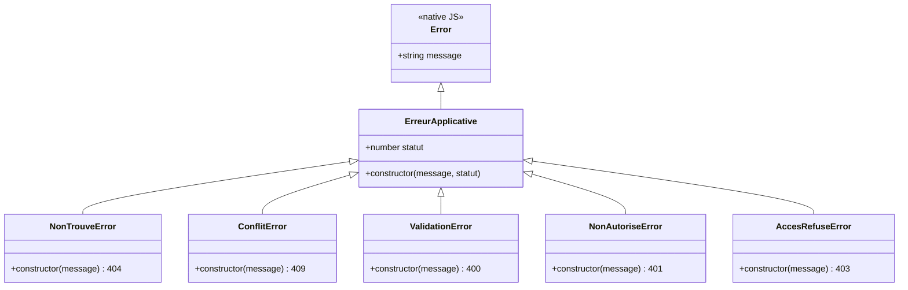
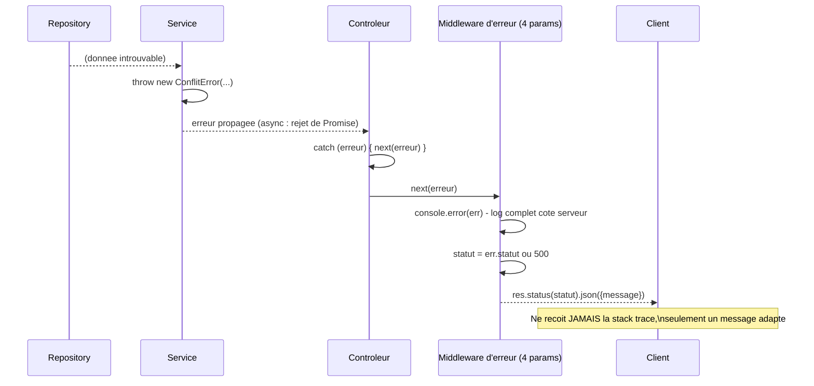

<div class="chapitre-titre-num">CHAPITRE 19</div>

# Gestion centralisée des erreurs

<div class="encadre objectif">
<span class="encadre-titre">🎯 Objectif du chapitre</span>
Comprendre le middleware d'erreur spécial d'Express, créer des classes d'erreurs métier personnalisées, et éviter le piège des erreurs asynchrones non capturées. À la fin de ce chapitre, tu sauras construire un système de gestion d'erreurs cohérent, où chaque contrôleur reste court et où aucune erreur inattendue ne fuite de détails techniques sensibles vers le client.
</div>

<div class="encadre scenario">
<span class="encadre-titre">🎬 Mise en situation</span>
Un client signale, capture d'écran à l'appui, qu'une erreur affichée à ses utilisateurs contient un extrait de requête SQL et un chemin de fichier serveur complet (`/home/deploy/api-production/src/services/...`). L'erreur elle-même était bénigne (une contrainte de base de données violée), mais la façon dont elle a été renvoyée au client expose des détails internes qu'un attaquant pourrait exploiter pour mieux comprendre l'architecture du serveur. Ce chapitre construit exactement le système qui empêche ce genre de fuite, tout en gardant les vrais détails disponibles pour le débogage côté serveur.
</div>

## 19.1 Le problème : gestion d'erreur dupliquée partout

```js
// ❌ Chaque contrôleur répète sa propre logique de traduction erreur → réponse HTTP
async function creer(req, res) {
  try {
    const utilisateur = await UtilisateurService.creerUtilisateur(req.body);
    res.status(201).json(utilisateur);
  } catch (erreur) {
    if (erreur.message === "Email déjà utilisé") {
      res.status(409).json({ message: erreur.message });
    } else {
      res.status(500).json({ message: "Erreur serveur" });
    }
  }
}
```

Répéter ce `catch` avec sa logique de traduction dans **chaque** contrôleur devient vite source d'incohérences (un contrôleur oublie un cas, un autre renvoie un format d'erreur différent).

## 19.2 Le middleware d'erreur spécial d'Express

<div class="encadre astuce">
<span class="encadre-titre">💡 Un middleware à QUATRE paramètres est traité différemment par Express</span>
Express reconnaît un middleware de gestion d'erreurs à sa signature particulière : **quatre** paramètres `(err, req, res, next)`, au lieu des trois habituels. Ce middleware doit être déclaré en **dernier**, après toutes les routes.
</div>

```js
// src/middlewares/erreur.middleware.js
function gestionnaireErreurs(err, req, res, next) {
  console.error(err); // toujours journaliser l'erreur complète côté serveur (chapitre 20)

  const statut = err.statut || 500;
  const message = err.statut ? err.message : "Une erreur interne est survenue";

  res.status(statut).json({ message });
}

module.exports = gestionnaireErreurs;
```

```js
// app.js
// ... toutes les routes déclarées AVANT ...
app.use(gestionnaireErreurs); // TOUJOURS en dernier
```

## 19.3 Classes d'erreurs métier personnalisées

```js
// src/errors/index.js
class ErreurApplicative extends Error {
  constructor(message, statut) {
    super(message);
    this.statut = statut;
    this.name = this.constructor.name;
  }
}

class NonTrouveError extends ErreurApplicative {
  constructor(message = "Ressource introuvable") {
    super(message, 404);
  }
}

class ConflitError extends ErreurApplicative {
  constructor(message = "Conflit avec une ressource existante") {
    super(message, 409);
  }
}

class ValidationError extends ErreurApplicative {
  constructor(message = "Données invalides") {
    super(message, 400);
  }
}

class NonAutoriseError extends ErreurApplicative {
  constructor(message = "Authentification requise") {
    super(message, 401);
  }
}

class AccesRefuseError extends ErreurApplicative {
  constructor(message = "Accès refusé") {
    super(message, 403);
  }
}

module.exports = { ErreurApplicative, NonTrouveError, ConflitError, ValidationError, NonAutoriseError, AccesRefuseError };
```



<div class="encadre astuce">
<span class="encadre-titre">💡 Explication du schéma</span>
Chaque erreur métier hérite de `ErreurApplicative`, qui porte déjà `statut` — le middleware d'erreur centralisé (section 19.2) n'a donc jamais besoin d'un `if/else` géant pour chaque type d'erreur : il lit simplement `err.statut`, quelle que soit la sous-classe concrète levée.
</div>

```js
// services/utilisateurs.service.js
const { ConflitError } = require("../errors");

async function creerUtilisateur({ nom, email, motDePasse }) {
  const existant = await UtilisateurRepository.trouverParEmail(email);
  if (existant) {
    throw new ConflitError("Cet email est déjà utilisé"); // porte SON PROPRE code de statut HTTP
  }
  // ...
}
```

Avec ces classes, le middleware d'erreur centralisé (section 19.2) fonctionne **sans modification** pour n'importe quelle nouvelle erreur métier : `err.statut` est déjà correctement défini par la classe elle-même.

## 19.4 Le parcours complet d'une erreur à travers les couches



<div class="encadre astuce">
<span class="encadre-titre">💡 Explication du schéma</span>
Une erreur levée n'importe où dans les couches (souvent au niveau du service ou du repository) remonte automatiquement grâce au mécanisme de rejet de Promise (chapitre 9), jusqu'à ce qu'un `catch`/`next(erreur)` l'intercepte dans le contrôleur et la transmette explicitement au middleware d'erreur centralisé — le seul endroit où la traduction erreur → réponse HTTP est réellement décidée, résolvant exactement la fuite de détails techniques de la mise en situation d'ouverture.
</div>

## 19.5 Le piège des erreurs asynchrones non capturées (avant Express 5)

<div class="encadre attention">
<span class="encadre-titre">⚠️ Une erreur dans un contrôleur async sans try/catch n'atteint PAS le middleware d'erreur (Express 4)</span>

```js
// ❌ Avec Express 4 : une erreur ici ne sera JAMAIS transmise au middleware d'erreurs !
async function creer(req, res) {
  const utilisateur = await UtilisateurService.creerUtilisateur(req.body); // si ça lève une erreur...
  res.status(201).json(utilisateur); // ... cette ligne n'est jamais atteinte, et Express 4 ne sait pas quoi en faire
}
```
Express 4 (toujours largement utilisé) ne capture **pas** automatiquement les rejets de Promise dans les gestionnaires de route — une erreur async non entourée de `try/catch` (ou sans `next(erreur)` explicite) reste silencieuse côté client, qui n'obtient jamais de réponse (la requête reste bloquée jusqu'au timeout). **Express 5** (plus récent) corrige ce comportement nativement, mais tant qu'un projet reste sur Express 4, la vigilance manuelle reste nécessaire.
</div>

```js
// ✅ Solution 1 (Express 4 et 5) : try/catch explicite avec next(erreur)
async function creer(req, res, next) {
  try {
    const utilisateur = await UtilisateurService.creerUtilisateur(req.body);
    res.status(201).json(utilisateur);
  } catch (erreur) {
    next(erreur); // transmet explicitement au middleware d'erreur centralisé
  }
}
```

## 19.6 Wrapper asyncHandler : éviter la répétition du try/catch

```js
// src/utils/asyncHandler.js
function asyncHandler(fonctionControleur) {
  return function (req, res, next) {
    Promise.resolve(fonctionControleur(req, res, next)).catch(next); // capture tout rejet et le transmet à next()
  };
}

module.exports = asyncHandler;
```

```js
// controllers/utilisateurs.controller.js
const asyncHandler = require("../utils/asyncHandler");

const creer = asyncHandler(async (req, res) => {
  const utilisateur = await UtilisateurService.creerUtilisateur(req.body);
  res.status(201).json(utilisateur); // plus besoin de try/catch : asyncHandler s'en charge
});

module.exports = { creer };
```

<div class="encadre astuce">
<span class="encadre-titre">💡 asyncHandler élimine la répétition sans changer le comportement</span>
`asyncHandler` enveloppe chaque contrôleur async, transformant automatiquement tout rejet de Promise en appel à `next(erreur)` — évitant de répéter le même bloc `try/catch` dans chaque contrôleur du projet, tout en conservant exactement le même comportement de transmission au middleware d'erreurs centralisé.
</div>

## 19.7 Middleware pour les routes inexistantes (404)

```js
// app.js — juste AVANT le gestionnaire d'erreurs, après TOUTES les routes
app.use((req, res, next) => {
  const { NonTrouveError } = require("./errors");
  next(new NonTrouveError(`Route ${req.method} ${req.originalUrl} introuvable`));
});

app.use(gestionnaireErreurs); // traite cette erreur 404 comme n'importe quelle autre
```

## 19.8 Ne jamais exposer les détails techniques en production

```js
function gestionnaireErreurs(err, req, res, next) {
  console.error(err); // le détail COMPLET (avec stack trace) reste dans les LOGS serveur (chapitre 20)

  const statut = err.statut || 500;
  const message = err.statut
    ? err.message
    : process.env.NODE_ENV === "production"
      ? "Une erreur interne est survenue" // message GÉNÉRIQUE en production pour les erreurs non anticipées
      : err.message; // détail complet en développement, utile pour déboguer

  res.status(statut).json({ message });
}
```

<div class="encadre attention">
<span class="encadre-titre">⚠️ Ne jamais renvoyer une stack trace au client en production</span>
Une stack trace complète peut révéler la structure interne du code, les chemins de fichiers serveur, voire des fragments de requêtes SQL — des informations précieuses pour un attaquant. En production, seules les erreurs **métier anticipées** (avec un `statut` défini explicitement) devraient exposer leur message réel au client ; toute erreur inattendue (bug, panne) doit renvoyer un message générique, tout en étant journalisée en détail côté serveur — exactement la correction attendue par le client de la mise en situation d'ouverture.
</div>

## Atelier — Construire le système d'erreurs complet

<div class="encadre exercice">
<span class="encadre-titre">🛠️ Atelier 19 — De la fuite de détails techniques à un système propre</span>

**Objectif** : reproduire puis corriger exactement l'incident de la mise en situation d'ouverture.

**Préparation** : un projet Express avec une route qui déclenche volontairement une erreur de base de données non anticipée (par exemple, une contrainte SQL violée simulée par un simple `throw new Error("duplicate key value violates unique constraint")`).

**Étapes détaillées** :
1. Sans middleware d'erreur centralisé, observe ce que le client reçoit par défaut quand cette erreur est levée (souvent une page d'erreur HTML complète avec stack trace, le comportement par défaut d'Express).
2. Mets en place le middleware d'erreur centralisé (section 19.2) et les classes d'erreurs (section 19.3).
3. Configure-le pour masquer le détail en production (`NODE_ENV=production`) mais l'afficher en développement (section 19.8).
4. Reteste la même erreur dans les deux modes, et compare la réponse reçue par le client.

**Validation** : en mode production, le client ne doit recevoir qu'un message générique et un code 500 ; en développement, le détail complet reste visible pour faciliter le débogage.

**Résultat attendu** : le système exact qui aurait empêché l'incident signalé par le client dans la mise en situation d'ouverture.

**Dépannage** : si le détail apparaît quand même en production, vérifie que `NODE_ENV=production` est bien défini dans l'environnement de test, et que le middleware d'erreur est bien le dernier `app.use()` déclaré.

**Nettoyage** : retire la route de test créée pour l'atelier.
</div>

## Erreurs fréquentes

<div class="encadre attention">
<span class="encadre-titre">⚠️ Erreur n°1 — Oublier de déclarer le middleware d'erreur en dernier</span>
Un middleware à 4 paramètres déclaré avant certaines routes ne les protège pas — rappel du principe d'ordre des middlewares (chapitre 14), qui s'applique aussi au middleware d'erreur.
</div>

<div class="encadre attention">
<span class="encadre-titre">⚠️ Erreur n°2 — Exposer le détail technique d'une erreur inattendue en production</span>
Exactement l'incident de la mise en situation d'ouverture — une stack trace ou un fragment de requête SQL visible par le client en production est une fuite d'information exploitable.
</div>

<div class="encadre attention">
<span class="encadre-titre">⚠️ Erreur n°3 — Oublier next(erreur) dans un contrôleur async sans asyncHandler</span>
Rappel de la section 19.5 : sur Express 4, une telle omission bloque silencieusement la requête jusqu'au timeout, sans jamais atteindre le middleware d'erreur.
</div>

## Débogage

<div class="encadre attention">
<span class="encadre-titre">🩺 Symptôme : le client reçoit une page HTML d'erreur au lieu d'un JSON propre</span>

- **Cause** : aucun middleware d'erreur centralisé n'est configuré ; Express utilise son gestionnaire d'erreur par défaut (page HTML).
- **Solution** : ajouter le middleware de la section 19.2, en dernier dans `app.js`.
</div>

<div class="encadre attention">
<span class="encadre-titre">🩺 Symptôme : une requête reste bloquée indéfiniment après une erreur</span>

- **Cause** : erreur async non capturée (erreur fréquente n°3), typiquement sur Express 4 sans `try/catch` ni `asyncHandler`.
- **Solution** : envelopper le contrôleur avec `asyncHandler` (section 19.6), ou ajouter un `try/catch` explicite.
</div>

## En entreprise

- **Outils de suivi d'erreurs (Sentry, Datadog)** : de nombreuses équipes branchent le middleware d'erreur centralisé à un service de suivi externe, capturant automatiquement chaque erreur inattendue avec son contexte complet, sans jamais exposer ce détail au client.
- **Format d'erreur standardisé** : les API professionnelles définissent souvent un format de réponse d'erreur cohérent dans toute l'organisation (`{ message, code, erreurs? }`), documenté dans la spécification Swagger (chapitre 28).

## Entretien technique

<div class="encadre exercice">
<span class="encadre-titre">💼 Questions fréquemment posées en entretien</span>

**Q1. "Comment Express reconnaît-il un middleware de gestion d'erreurs ?"**
Réponse attendue : à sa signature à quatre paramètres `(err, req, res, next)`, au lieu des trois habituels, et il doit être déclaré en dernier dans la chaîne de middlewares.

**Q2. "Pourquoi créer des classes d'erreurs personnalisées plutôt que de lancer des Error génériques ?"**
Réponse attendue : pour porter directement le code de statut HTTP approprié (`err.statut`), permettant au middleware d'erreur centralisé de traiter n'importe quelle erreur métier sans `if/else` dédié pour chaque cas.

**Q3. "Pourquoi ne jamais exposer une stack trace au client en production ?"**
Réponse attendue : une stack trace peut révéler la structure interne du code, des chemins de fichiers serveur ou des fragments de requêtes, des informations exploitables par un attaquant — le détail complet doit rester dans les logs serveur, jamais dans la réponse au client.
</div>

## Optimisation, sécurité et maintenabilité

<div class="encadre securite">
<span class="encadre-titre">🔒 Sécurité</span>
Toujours distinguer les erreurs "anticipées" (métier, avec un statut et un message sûrs à exposer) des erreurs "inattendues" (bugs, pannes, dont seul un message générique doit sortir) — exactement la logique de la section 19.8.
</div>

<div class="encadre bonne-pratique">
<span class="encadre-titre">✅ Maintenabilité</span>
Centraliser toutes les classes d'erreurs métier dans un seul fichier `errors/index.js` (section 19.3), pour qu'un nouveau développeur les découvre immédiatement sans avoir à les chercher dans plusieurs endroits du code.
</div>

## Résumé du chapitre

- Le middleware d'erreur Express se reconnaît à sa signature à quatre paramètres `(err, req, res, next)`, déclaré en dernier.
- Des classes d'erreurs métier personnalisées (héritant d'`Error`, portant leur propre `statut` HTTP) centralisent la traduction erreur → réponse HTTP.
- Sur Express 4, une erreur async non capturée par `try/catch` (ou un wrapper `asyncHandler`) n'atteint jamais le middleware d'erreurs — Express 5 corrige ce comportement nativement.
- Ne jamais exposer de détails techniques (stack trace) au client en production ; toujours journaliser le détail complet côté serveur.

## Quiz

<div class="encadre exercice">
<span class="encadre-titre">📝 QCM</span>

1. À quoi Express reconnaît-il un middleware d'erreur ?
   - a) À son nom de fonction
   - b) À sa signature à 4 paramètres (err, req, res, next)
   - c) À sa position dans le fichier
   - d) À un décorateur spécial

2. Que doit contenir une classe d'erreur métier personnalisée pour fonctionner avec le middleware centralisé ?
   - a) Une méthode toJSON()
   - b) Une propriété statut (code HTTP)
   - c) Un timestamp
   - d) Rien de spécial

3. Que faut-il faire en production face à une erreur inattendue (non métier) ?
   - a) Renvoyer la stack trace complète pour transparence
   - b) Renvoyer un message générique, journaliser le détail côté serveur
   - c) Ne rien renvoyer du tout
   - d) Redémarrer le serveur automatiquement

**Corrigé** : 1-b, 2-b, 3-b.
</div>

<div class="encadre exercice">
<span class="encadre-titre">📝 Vrai ou Faux</span>

1. Le middleware d'erreur peut être déclaré n'importe où dans app.js. — **Faux** (doit être en dernier).
2. Sur Express 5, une erreur async non capturée atteint automatiquement le middleware d'erreur. — **Vrai**.
3. Une stack trace complète peut être renvoyée sans risque au client en production. — **Faux**.
</div>

<div class="encadre exercice">
<span class="encadre-titre">📝 Question ouverte</span>

Pourquoi les classes d'erreurs métier (section 19.3) rendent-elles le middleware d'erreur centralisé "générique", capable de gérer n'importe quelle nouvelle erreur sans modification ?

**Corrigé** : chaque classe d'erreur métier porte déjà, dans son propre constructeur, le code de statut HTTP approprié (`this.statut = statut`). Le middleware centralisé n'a donc besoin que de lire `err.statut` (avec un repli sur 500 si absent) pour savoir comment répondre — il n'a jamais besoin de connaître à l'avance la liste de toutes les erreurs métier possibles. Ajouter une nouvelle erreur métier ne nécessite donc aucune modification du middleware lui-même.
</div>

## Exercices

<div class="encadre exercice">
<span class="encadre-titre">📝 Exercice 19.1</span>

Crée une classe d'erreur `StockInsuffisantError` (statut 409) et utilise-la dans un service de vente qui vérifie la disponibilité du stock avant de créer une commande.
</div>

**Corrigé :**
```js
class StockInsuffisantError extends ErreurApplicative {
  constructor(produitNom) {
    super(`Stock insuffisant pour le produit : ${produitNom}`, 409);
  }
}

async function creerVente(produitId, quantite) {
  const produit = await ProduitRepository.trouverParId(produitId);
  if (produit.stock < quantite) {
    throw new StockInsuffisantError(produit.nom);
  }
  // ... création de la vente ...
}
```

## Checklist de fin de chapitre

<ul class="checklist">
<li>☐ Je sais créer un middleware d'erreur centralisé (4 paramètres).</li>
<li>☐ Je sais créer des classes d'erreurs métier héritant d'ErreurApplicative.</li>
<li>☐ Je comprends le piège des erreurs async non capturées sur Express 4.</li>
<li>☐ Je sais utiliser asyncHandler pour éviter la répétition de try/catch.</li>
<li>☐ Je masque systématiquement les détails techniques en production.</li>
</ul>

## FAQ

<dl class="faq">
<dt>Faut-il migrer immédiatement vers Express 5 pour éviter le piège des erreurs async ?</dt>
<dd>Pas nécessairement dans l'urgence : `asyncHandler` (section 19.6) ou un `try/catch` systématique résolvent le problème tout aussi bien sur Express 4, qui reste largement utilisé en production.</dd>

<dt>Un contrôleur peut-il lancer directement une erreur générique (new Error()) plutôt qu'une classe métier ?</dt>
<dd>Techniquement oui, mais elle sera traitée comme une erreur inattendue (statut 500 par défaut) — préférer une classe métier dès que le cas est anticipé et mérite un code de statut plus précis.</dd>

<dt>Le middleware 404 (section 19.7) doit-il être avant ou après le middleware d'erreur ?</dt>
<dd>Avant : il transforme une route non trouvée en une vraie erreur `NonTrouveError`, transmise ensuite au middleware d'erreur qui la traite exactement comme n'importe quelle autre erreur métier.</dd>
</dl>

## Références et pour aller plus loin

- Documentation Express sur la gestion d'erreurs : [https://expressjs.com/en/guide/error-handling.html](https://expressjs.com/en/guide/error-handling.html)
- Notes de version Express 5 (gestion async native) : [https://expressjs.com/en/guide/migrating-5.html](https://expressjs.com/en/guide/migrating-5.html)

*Chapitre suivant : la journalisation, pour garder une trace fiable de ce qui se passe réellement en production.*
