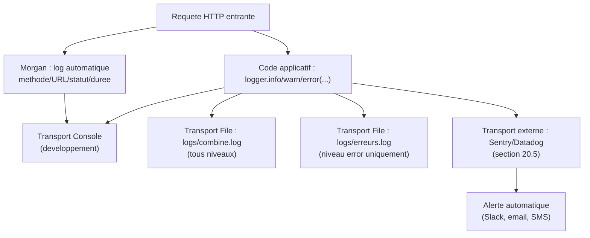

<div class="chapitre-titre-num">CHAPITRE 20</div>

# Journalisation (Winston/Morgan)

<div class="encadre objectif">
<span class="encadre-titre">🎯 Objectif du chapitre</span>
Comprendre pourquoi `console.log` est insuffisant en production, et mettre en place une vraie stratégie de journalisation avec Morgan (requêtes HTTP), Winston (logs applicatifs structurés), et une intégration vers un service de supervision externe. À la fin de ce chapitre, tu sauras diagnostiquer un incident en production à partir de logs structurés, sans jamais avoir eu besoin d'ajouter un `console.log` de dépannage dans le code déjà déployé.
</div>

<div class="encadre scenario">
<span class="encadre-titre">🎬 Mise en situation</span>
Un dimanche soir, l'API d'un client tombe en panne pendant 20 minutes. Le lundi matin, le client demande : "que s'est-il passé exactement, et à quelle heure précise ?" Le serveur utilisait uniquement `console.log`, dont la sortie n'était nulle part conservée après le redémarrage du processus qui a suivi le crash — impossible de répondre avec certitude. Ce chapitre construit exactement le système qui aurait permis de répondre en quelques minutes : logs structurés, conservés, et idéalement une alerte automatique envoyée **avant** même que le client ne s'en aperçoive.
</div>

## 20.1 Pourquoi console.log ne suffit pas en production

<div class="encadre attention">
<span class="encadre-titre">⚠️ Les limites de console.log en environnement de production</span>
`console.log` écrit dans la sortie standard, sans niveau de gravité (info, avertissement, erreur), sans horodatage structuré, sans possibilité de filtrer ou de rediriger vers un fichier/service externe, et sans distinction entre environnements. Sur un serveur de production traitant des milliers de requêtes, cela devient vite inutilisable pour diagnostiquer un problème réel — exactement la situation de la mise en situation d'ouverture.
</div>

<div class="encadre astuce">
<span class="encadre-titre">💡 Analogie</span>
`console.log` seul, c'est comme un veilleur de nuit qui garde tout en mémoire sans jamais rien noter sur un registre : utile pendant qu'il est présent et attentif, mais dès qu'il change d'équipe (le processus redémarre), tout ce qu'il savait disparaît. Un vrai système de journalisation, c'est le registre écrit, daté, conservé — consultable même longtemps après l'incident.
</div>

## 20.2 Morgan : journaliser les requêtes HTTP

```
$ npm install morgan
```

```js
const morgan = require("morgan");

app.use(morgan("dev")); // format concis et coloré, adapté au développement
// app.use(morgan("combined")); // format détaillé de type Apache, adapté à la production
```

```
GET /api/utilisateurs 200 15.234 ms - 348
POST /api/utilisateurs 201 45.102 ms - 156
GET /api/produits/999 404 3.012 ms - 42
```

Morgan journalise **automatiquement** chaque requête HTTP traitée (méthode, URL, code de statut, temps de réponse), sans avoir à l'écrire manuellement dans chaque contrôleur.

## 20.3 Winston : logs applicatifs structurés

```
$ npm install winston
```

```js
// src/config/logger.js
const winston = require("winston");

const logger = winston.createLogger({
  level: process.env.NODE_ENV === "production" ? "info" : "debug",
  format: winston.format.combine(
    winston.format.timestamp(),
    winston.format.json() // format JSON structuré, exploitable par des outils d'analyse de logs
  ),
  transports: [
    new winston.transports.Console(),
    new winston.transports.File({ filename: "logs/erreurs.log", level: "error" }),
    new winston.transports.File({ filename: "logs/combine.log" }),
  ],
});

module.exports = logger;
```

```js
const logger = require("./config/logger");

logger.info("Serveur démarré", { port: 3000 });
logger.warn("Tentative de connexion avec un email inexistant", { email: "test@test.com" });
logger.error("Échec de connexion à la base de données", { erreur: err.message });
```

```json
{"level":"info","message":"Serveur démarré","port":3000,"timestamp":"2026-07-05T10:00:00.000Z"}
{"level":"error","message":"Échec de connexion à la base de données","erreur":"ECONNREFUSED","timestamp":"2026-07-05T10:00:05.000Z"}
```



<div class="encadre astuce">
<span class="encadre-titre">💡 Explication du schéma</span>
Un même appel `logger.error(...)` peut alimenter simultanément plusieurs destinations (transports) : un fichier local pour l'historique, la console pour le développement, et un service externe qui peut déclencher une alerte automatique — exactement ce qui aurait permis, dans la mise en situation d'ouverture, d'être notifié **avant** l'appel du client plutôt qu'après.
</div>

## 20.4 Les niveaux de log

| Niveau | Usage |
|---|---|
| `error` | Une erreur nécessitant une attention (échec de connexion BDD, exception inattendue) |
| `warn` | Une situation anormale mais non bloquante (tentative de connexion échouée, dépréciation) |
| `info` | Événements normaux notables (démarrage du serveur, création d'un utilisateur) |
| `debug` | Détails utiles seulement en développement, jamais activés en production par défaut |

<div class="encadre astuce">
<span class="encadre-titre">💡 Adapter le niveau de log selon l'environnement</span>
En développement, un niveau `debug` (tout afficher) aide à comprendre ce qui se passe. En production, un niveau `info` (ou `warn`) évite de saturer les logs avec des détails inutiles, tout en gardant une trace des événements réellement significatifs.
</div>

## 20.5 Aller plus loin : intégration à un service de supervision externe

<div class="encadre securite">
<span class="encadre-titre">🔒 Fiabilité — pourquoi des fichiers de logs locaux ne suffisent pas toujours</span>
Des fichiers de logs stockés uniquement sur le serveur lui-même posent un problème concret : si le serveur plante complètement, redémarre, ou si le disque devient inaccessible (exactement le risque de la mise en situation d'ouverture), les logs peuvent devenir difficiles à consulter au moment précis où on en a le plus besoin. Des services comme **Sentry** (spécialisé dans le suivi d'erreurs) ou **Datadog** (supervision plus large : logs, métriques, traces) centralisent cette information **en dehors** du serveur applicatif, avec alerte automatique.
</div>

```js
// Exemple d'intégration Sentry (service tiers, nécessite un compte et un DSN)
const Sentry = require("@sentry/node");

Sentry.init({
  dsn: process.env.SENTRY_DSN,
  environment: process.env.NODE_ENV,
  tracesSampleRate: 0.1, // n'échantillonne que 10% des transactions, pour limiter le volume/coût
});

// Dans le middleware d'erreur centralisé (chapitre 19), en complément de Winston
function gestionnaireErreurs(err, req, res, next) {
  logger.error(err.message, { stack: err.stack, url: req.originalUrl });

  if (!err.statut || err.statut >= 500) {
    Sentry.captureException(err); // n'envoie a Sentry QUE les erreurs inattendues (statut >= 500)
  }

  res.status(err.statut || 500).json({
    message: err.statut ? err.message : "Une erreur interne est survenue",
  });
}
```

| Solution | Portée | Alertes automatiques | Coût typique |
|---|---|---|---|
| Fichiers locaux (Winston seul) | Logs applicatifs uniquement, sur le serveur | Non (nécessite un script/outil dédié) | Gratuit |
| Sentry | Erreurs applicatives, avec contexte détaillé et regroupement automatique | Oui (email, Slack, etc.) | Gratuit pour un petit volume, payant au-delà |
| Datadog | Logs + métriques + traces + supervision infrastructure complète | Oui, très configurable | Payant, adapté à une échelle plus grande |

<div class="encadre retenir">
<span class="encadre-titre">📌 À retenir</span>
Pour la majorité des projets de ce manuel (missions freelance, petites équipes), Winston + fichiers locaux suffit largement en développement, et Sentry (offre gratuite généreuse) apporte un vrai bénéfice de fiabilité en production pour un coût nul ou minime. Datadog se justifie à partir d'une échelle où l'observabilité de toute l'infrastructure (pas seulement l'application) devient un besoin réel.
</div>

## 20.6 Journaliser les erreurs dans le middleware centralisé (lien avec le chapitre 19)

```js
const logger = require("../config/logger");

function gestionnaireErreurs(err, req, res, next) {
  logger.error(err.message, {
    stack: err.stack,
    url: req.originalUrl,
    methode: req.method,
    statut: err.statut || 500,
  });

  res.status(err.statut || 500).json({
    message: err.statut ? err.message : "Une erreur interne est survenue",
  });
}
```

## Atelier — Diagnostiquer un incident à partir des logs

<div class="encadre exercice">
<span class="encadre-titre">🛠️ Atelier 20 — Reconstituer un incident comme dans la mise en situation</span>

**Objectif** : simuler l'incident de la mise en situation d'ouverture, et vérifier qu'un vrai système de journalisation permet d'y répondre.

**Préparation** : un projet Express avec Morgan et Winston configurés selon les sections 20.2 et 20.3.

**Étapes détaillées** :
1. Démarre le serveur, effectue quelques requêtes normales, puis provoque volontairement une erreur (route qui lance une exception).
2. Arrête brutalement le processus (`Ctrl+C` ou équivalent d'un crash), comme si le serveur "tombait" à ce moment précis.
3. Redémarre le serveur, puis consulte `logs/erreurs.log` et `logs/combine.log`.
4. À partir de ces seuls fichiers, reconstitue : à quelle heure précise l'erreur est survenue, quelle route était concernée, et quel était le message d'erreur exact.

**Validation** : tu dois pouvoir répondre aux trois questions de l'étape 4 sans avoir eu besoin d'accéder à autre chose que les fichiers de logs.

**Résultat attendu** : exactement la réponse que le client de la mise en situation d'ouverture attendait le lundi matin — rendue possible uniquement parce que les logs ont survécu au redémarrage du processus, contrairement à un simple `console.log`.

**Dépannage** : si les fichiers de logs sont vides, vérifie que le dossier `logs/` existe (Winston ne le crée pas toujours automatiquement selon la configuration) et que les permissions d'écriture sont correctes.

**Nettoyage** : supprime les fichiers de logs de test générés.
</div>

## Erreurs fréquentes

<div class="encadre attention">
<span class="encadre-titre">⚠️ Erreur n°1 — Journaliser des données sensibles</span>

```js
logger.info("Connexion réussie", { email: utilisateur.email, motDePasse: req.body.motDePasse }); // ❌ JAMAIS !
```
Ne jamais journaliser un mot de passe (même échoué), un token JWT complet, un numéro de carte bancaire, ou toute autre donnée sensible — les fichiers de logs sont souvent moins protégés que la base de données elle-même, et constituent une cible d'exfiltration fréquente en cas de compromission.
</div>

<div class="encadre attention">
<span class="encadre-titre">⚠️ Erreur n°2 — Compter uniquement sur des logs locaux non conservés</span>
Exactement le piège de la mise en situation d'ouverture — des logs qui ne survivent pas à un redémarrage de processus (ou qui ne sont jamais consultés faute de centralisation) n'apportent aucune valeur au moment critique où ils seraient utiles.
</div>

<div class="encadre attention">
<span class="encadre-titre">⚠️ Erreur n°3 — Envoyer TOUTES les erreurs à un service externe payant à l'usage</span>
Envoyer indistinctement les erreurs métier anticipées (comme un email déjà utilisé, statut 400/409) au même titre que les erreurs inattendues (statut 500) vers Sentry gonfle inutilement le volume et le coût — filtrer, comme dans l'exemple de la section 20.5, pour n'envoyer que ce qui mérite réellement une alerte.
</div>

## Débogage

<div class="encadre attention">
<span class="encadre-titre">🩺 Symptôme : aucun fichier de log n'est créé</span>

- **Cause** : le dossier cible (`logs/`) n'existe pas, ou les permissions d'écriture sont insuffisantes.
- **Solution** : créer le dossier explicitement au démarrage de l'application (`fs.mkdirSync("logs", { recursive: true })`, chapitre 11), avant l'initialisation du logger.
</div>

## En entreprise

- **Logs comme première source de vérité en incident** : dans la quasi-totalité des équipes, la première question posée face à un incident de production est "que disent les logs ?" — jamais une reproduction manuelle en local, souvent bien plus lente.
- **Rétention des logs réglementée** : certains secteurs (finance, santé) imposent une durée de conservation minimale des logs applicatifs, un facteur à considérer dès le choix de l'outil de journalisation.

## Entretien technique

<div class="encadre exercice">
<span class="encadre-titre">💼 Questions fréquemment posées en entretien</span>

**Q1. "Pourquoi console.log ne suffit-il pas en production ?"**
Réponse attendue : absence de niveaux de gravité, de structure exploitable, de persistance garantie après un redémarrage, et d'intégration à un système d'alerte — Winston (ou équivalent) résout ces limites.

**Q2. "Quelle est la différence entre Morgan et Winston ?"**
Réponse attendue : Morgan journalise automatiquement les requêtes HTTP (méthode, statut, durée) ; Winston structure les logs applicatifs personnalisés (événements métier, erreurs) avec des niveaux et des transports configurables.

**Q3. "Que ne faut-il jamais journaliser, et pourquoi ?"**
Réponse attendue : jamais de mots de passe, tokens complets, ou données bancaires — les fichiers de logs sont une cible d'exfiltration fréquente, souvent moins protégée que la base de données principale.
</div>

## Optimisation, sécurité et maintenabilité

<div class="encadre securite">
<span class="encadre-titre">🔒 Sécurité</span>
Considérer les fichiers de logs comme des données potentiellement sensibles à protéger (permissions restreintes, rotation, purge après une durée définie) — pas de simples fichiers texte anodins.
</div>

<div class="encadre performance">
<span class="encadre-titre">🚀 Performance</span>
Un niveau de log trop verbeux (`debug` en production) peut ralentir l'application et saturer le disque rapidement — toujours ajuster le niveau selon l'environnement (section 20.4).
</div>

## Résumé du chapitre

- `console.log` est insuffisant en production : pas de niveaux de gravité, pas de structure exploitable, pas de redirection possible.
- **Morgan** journalise automatiquement chaque requête HTTP (méthode, statut, durée) sans code manuel dans les contrôleurs.
- **Winston** structure les logs applicatifs (JSON, niveaux, fichiers séparés par gravité), adaptés à l'analyse et à la supervision en production.
- Un service externe (Sentry, Datadog) centralise les logs hors du serveur et peut déclencher des alertes automatiques, utile en production.
- Ne jamais journaliser de données sensibles (mots de passe, tokens complets, données bancaires).

## Quiz

<div class="encadre exercice">
<span class="encadre-titre">📝 QCM</span>

1. Que journalise automatiquement Morgan ?
   - a) Les erreurs métier personnalisées
   - b) Les requêtes HTTP (méthode, statut, durée)
   - c) Les requêtes SQL
   - d) Les variables d'environnement

2. Pourquoi utiliser un service externe comme Sentry en plus des logs locaux ?
   - a) Pour remplacer entièrement Winston
   - b) Pour centraliser hors du serveur et permettre des alertes automatiques
   - c) C'est obligatoire pour toute API Node.js
   - d) Pour ralentir volontairement l'application

3. Que ne faut-il jamais journaliser ?
   - a) Le code de statut HTTP
   - b) Un mot de passe, même en cas d'échec de connexion
   - c) L'URL de la requête
   - d) La durée de traitement

**Corrigé** : 1-b, 2-b, 3-b.
</div>

<div class="encadre exercice">
<span class="encadre-titre">📝 Vrai ou Faux</span>

1. console.log conserve automatiquement son historique après un redémarrage du processus. — **Faux**.
2. Winston peut écrire simultanément vers plusieurs destinations (console, fichiers, service externe). — **Vrai**.
3. Il faut envoyer toutes les erreurs, y compris les erreurs métier anticipées, à Sentry. — **Faux** (filtrer selon la sévérité, section 20.5).
</div>

<div class="encadre exercice">
<span class="encadre-titre">📝 Question ouverte</span>

Pourquoi la question du client de la mise en situation d'ouverture ("que s'est-il passé, à quelle heure précise ?") aurait-elle eu une réponse immédiate avec Winston configuré, mais pas avec `console.log` seul ?

**Corrigé** : `console.log` écrit uniquement dans la sortie standard du processus, qui n'est généralement pas conservée après un redémarrage (sauf redirection manuelle explicite, rarement mise en place par défaut). Winston, configuré avec un transport fichier, persiste chaque entrée sur disque avec un horodatage structuré — consultable après coup, y compris après un crash et un redémarrage complet du serveur, permettant de reconstituer précisément la chronologie de l'incident.
</div>

## Exercices

<div class="encadre exercice">
<span class="encadre-titre">📝 Exercice 20.1</span>

Configure Winston avec deux transports : la console (niveau `debug` en développement) et un fichier `logs/erreurs.log` (niveau `error` uniquement), puis journalise un message d'erreur de test.
</div>

**Corrigé :** Voir la configuration de la section 20.3 (déjà exactement structurée ainsi) ; `logger.error("Message de test")` écrit à la fois dans la console et dans `logs/erreurs.log`.

<div class="encadre exercice">
<span class="encadre-titre">📝 Exercice 20.2</span>

Modifie le middleware d'erreur centralisé (chapitre 19) pour qu'il journalise chaque erreur via Winston avec son contexte complet (URL, méthode, statut), **et** n'envoie à un service externe simulé (une simple fonction `envoyerAlerte(err)` de ton cru) que les erreurs de statut 500 ou plus.
</div>

**Corrigé :**
```js
function envoyerAlerte(err) {
  console.log(`[ALERTE SIMULÉE] Erreur critique : ${err.message}`);
}

function gestionnaireErreurs(err, req, res, next) {
  const statut = err.statut || 500;
  logger.error(err.message, { url: req.originalUrl, methode: req.method, statut, stack: err.stack });

  if (statut >= 500) {
    envoyerAlerte(err);
  }

  res.status(statut).json({ message: err.statut ? err.message : "Une erreur interne est survenue" });
}
```

## Checklist de fin de chapitre

<ul class="checklist">
<li>☐ Je comprends les limites de console.log en production.</li>
<li>☐ Je sais configurer Morgan pour journaliser les requêtes HTTP.</li>
<li>☐ Je sais configurer Winston avec plusieurs transports et niveaux.</li>
<li>☐ Je sais quand et comment intégrer un service externe (Sentry).</li>
<li>☐ Je ne journalise jamais de données sensibles.</li>
</ul>

## FAQ

<dl class="faq">
<dt>Faut-il utiliser à la fois Morgan et Winston ?</dt>
<dd>Oui, ils sont complémentaires : Morgan couvre automatiquement les requêtes HTTP, Winston couvre les événements applicatifs personnalisés (erreurs métier, actions significatives) que Morgan ne connaît pas.</dd>

<dt>Sentry est-il gratuit ?</dt>
<dd>Sentry propose une offre gratuite avec un volume mensuel limité d'événements, largement suffisante pour un projet freelance ou une petite équipe ; les offres payantes s'adressent à un volume de production plus important.</dd>

<dt>Faut-il journaliser chaque requête réussie en détail en production ?</dt>
<dd>Pas nécessairement en détail : Morgan en format "combined" suffit souvent pour les requêtes normales ; le détail applicatif (Winston) se concentre davantage sur les événements significatifs (erreurs, actions sensibles) plutôt que sur chaque requête réussie individuellement.</dd>
</dl>

## Références et pour aller plus loin

- Documentation Winston : [https://github.com/winstonjs/winston](https://github.com/winstonjs/winston)
- Documentation Morgan : [https://github.com/expressjs/morgan](https://github.com/expressjs/morgan)
- Documentation Sentry pour Node.js : [https://docs.sentry.io/platforms/node/](https://docs.sentry.io/platforms/node/)

*Chapitre suivant : pagination, recherche, tri et filtrage — les fonctionnalités attendues de toute API listant des ressources.*
