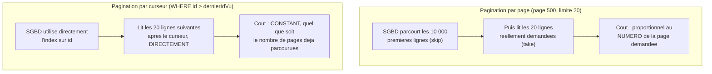

<div class="chapitre-titre-num">CHAPITRE 21</div>

# Pagination, recherche, tri et filtrage

<div class="encadre objectif">
<span class="encadre-titre">🎯 Objectif du chapitre</span>
Implémenter une API de listing complète et professionnelle : pagination par page, recherche textuelle, tri dynamique et filtrage multicritère, combinés dans un seul point d'entrée cohérent. À la fin de ce chapitre, tu sauras construire un endpoint de listing capable de gérer des dizaines de milliers de lignes sans jamais renvoyer plus que ce dont le client a réellement besoin.
</div>

<div class="encadre scenario">
<span class="encadre-titre">🎬 Mise en situation</span>
Un client se plaint que la page catalogue de son application ralentit de plus en plus depuis qu'il a dépassé les 15 000 produits en boutique. En inspectant le code, tu découvres un simple `GET /produits` sans aucune pagination — la table entière est chargée et renvoyée au frontend à chaque affichage de la page, qui n'en montre pourtant que 20 à la fois. Ce chapitre construit exactement ce qui manque, et t'explique une nuance de performance que peu de développeurs découvrent avant d'y être confrontés directement : la différence entre paginer par page et paginer par curseur.
</div>

## 21.1 Le problème : renvoyer toutes les lignes d'une table

<div class="encadre attention">
<span class="encadre-titre">⚠️ GET /produits sans pagination devient rapidement inutilisable</span>
Une table de quelques dizaines de milliers de produits renvoyée intégralement à chaque requête `GET /produits` gaspille de la bande passante, ralentit la réponse, et peut même épuiser la mémoire du serveur ou du client. La **pagination** est une attente de base pour toute API listant des ressources potentiellement nombreuses — exactement le problème rencontré dans la mise en situation d'ouverture.
</div>

## 21.2 Pagination par page (offset-based)

```js
// GET /produits?page=2&limite=20
async function lister(req, res, next) {
  try {
    const page = Math.max(1, parseInt(req.query.page) || 1);
    const limite = Math.min(100, parseInt(req.query.limite) || 20); // plafond pour éviter les abus
    const decalage = (page - 1) * limite;

    const { produits, total } = await ProduitService.lister({ decalage, limite });

    res.json({
      donnees: produits,
      pagination: {
        page,
        limite,
        total,
        totalPages: Math.ceil(total / limite),
      },
    });
  } catch (erreur) {
    next(erreur);
  }
}
```

```js
// services/produits.service.js
async function lister({ decalage, limite }) {
  const [produits, total] = await Promise.all([
    ProduitRepository.listerAvecPagination(decalage, limite),
    ProduitRepository.compter(),
  ]);
  return { produits, total };
}
```

```js
// repositories/produits.repository.js — avec Prisma (chapitre 34)
async function listerAvecPagination(decalage, limite) {
  return prisma.produit.findMany({ skip: decalage, take: limite });
}
async function compter() {
  return prisma.produit.count();
}
```

<div class="encadre astuce">
<span class="encadre-titre">💡 Toujours plafonner la limite demandée par le client</span>
Sans plafond (`Math.min(100, ...)`), un client pourrait demander `?limite=1000000`, forçant le serveur à charger une quantité déraisonnable de données en une seule requête — un vecteur d'attaque par déni de service (chapitre 25) facile à éviter avec une limite maximale raisonnable.
</div>

## 21.3 Pagination par curseur (cursor-based)

<div class="encadre astuce">
<span class="encadre-titre">💡 Quand préférer la pagination par curseur</span>
La pagination par page (`skip`/`take`) devient **inefficace** sur de très grandes tables (le SGBD doit quand même parcourir tous les enregistrements sautés). La pagination par **curseur** (utilisant l'id ou une date du dernier élément vu comme point de départ de la page suivante, `WHERE id > dernierIdVu LIMIT ...`) reste performante quel que soit le nombre total de lignes — au prix d'une navigation "page précédente/suivante" uniquement, sans accès direct à une page arbitraire (comme "page 50").
</div>



<div class="encadre astuce">
<span class="encadre-titre">💡 Explication du schéma</span>
Avec l'offset, demander la page 500 oblige le SGBD à compter (et écarter) les 9 980 lignes précédentes avant de trouver les 20 lignes réellement demandées — un coût qui grandit avec le numéro de page. Avec un curseur, l'index sur la colonne triée (souvent `id` ou une date) permet de sauter directement au bon endroit, avec un coût quasi constant, peu importe combien de pages ont déjà été parcourues.
</div>

```js
// GET /produits?curseur=142&limite=20 (curseur = id du dernier produit vu sur la page precedente)
async function listerAvecCurseur(req, res, next) {
  try {
    const curseur = req.query.curseur ? Number(req.query.curseur) : undefined;
    const limite = Math.min(100, parseInt(req.query.limite) || 20);

    const produits = await prisma.produit.findMany({
      take: limite,
      ...(curseur && { cursor: { id: curseur }, skip: 1 }), // skip:1 = ne pas re-inclure le curseur lui-meme
      orderBy: { id: "asc" },
    });

    const dernierProduit = produits[produits.length - 1];
    res.json({
      donnees: produits,
      prochainCurseur: dernierProduit ? dernierProduit.id : null,
    });
  } catch (erreur) {
    next(erreur);
  }
}
```

<div class="encadre retenir">
<span class="encadre-titre">📌 À retenir</span>
Règle de décision : quelques milliers de lignes, besoin d'accéder à une page arbitraire (page 1, page 50, page 3) → pagination par page (offset), plus simple à implémenter et à comprendre. Table potentiellement très volumineuse (des millions de lignes), défilement infini ("scroll infini") sans besoin de "sauter" à une page précise → pagination par curseur, nettement plus performante à grande échelle.
</div>

## 21.4 Recherche textuelle

```js
// GET /produits?recherche=riz
async function listerAvecRecherche(req, res, next) {
  try {
    const { recherche } = req.query;
    const produits = await ProduitRepository.rechercherParNom(recherche);
    res.json(produits);
  } catch (erreur) {
    next(erreur);
  }
}
```

```js
// Avec Prisma : recherche insensible à la casse, correspondance partielle
async function rechercherParNom(motCle) {
  if (!motCle) return prisma.produit.findMany();
  return prisma.produit.findMany({
    where: { nom: { contains: motCle, mode: "insensitive" } },
  });
}
```

## 21.5 Tri dynamique

```js
// GET /produits?trierPar=prix&ordre=desc
const CHAMPS_TRI_AUTORISES = ["nom", "prix", "createdAt"]; // liste blanche, JAMAIS accepter n'importe quel champ

async function listerAvecTri(req, res, next) {
  try {
    const trierPar = CHAMPS_TRI_AUTORISES.includes(req.query.trierPar) ? req.query.trierPar : "nom";
    const ordre = req.query.ordre === "desc" ? "desc" : "asc";

    const produits = await prisma.produit.findMany({
      orderBy: { [trierPar]: ordre },
    });
    res.json(produits);
  } catch (erreur) {
    next(erreur);
  }
}
```

<div class="encadre attention">
<span class="encadre-titre">⚠️ Ne jamais transmettre directement req.query.trierPar à la base sans validation</span>

```js
// ❌ DANGEREUX : un champ arbitraire (voire une tentative d'injection selon l'ORM) transmis directement
const produits = await prisma.produit.findMany({ orderBy: { [req.query.trierPar]: "asc" } });
```
Toujours valider le nom du champ de tri contre une **liste blanche explicite** (`CHAMPS_TRI_AUTORISES`) avant de l'utiliser — accepter n'importe quelle valeur permettrait à un client de tenter de trier sur un champ sensible non censé être exposé, ou de provoquer une erreur serveur avec un nom de champ inexistant.
</div>

## 21.6 Filtrage multicritère

```js
// GET /produits?categorie=alimentaire&prixMin=100&prixMax=500&disponible=true
async function construireFiltres(query) {
  const filtres = {};

  if (query.categorie) {
    filtres.categorie = query.categorie;
  }
  if (query.prixMin || query.prixMax) {
    filtres.prix = {};
    if (query.prixMin) filtres.prix.gte = Number(query.prixMin);
    if (query.prixMax) filtres.prix.lte = Number(query.prixMax);
  }
  if (query.disponible !== undefined) {
    filtres.stock = query.disponible === "true" ? { gt: 0 } : { equals: 0 };
  }

  return filtres;
}

async function listerAvecFiltres(req, res, next) {
  try {
    const filtres = await construireFiltres(req.query);
    const produits = await prisma.produit.findMany({ where: filtres });
    res.json(produits);
  } catch (erreur) {
    next(erreur);
  }
}
```

## 21.7 Tout combiner : un point d'entrée complet et professionnel

```js
async function listerComplet(req, res, next) {
  try {
    const page = Math.max(1, parseInt(req.query.page) || 1);
    const limite = Math.min(100, parseInt(req.query.limite) || 20);
    const trierPar = CHAMPS_TRI_AUTORISES.includes(req.query.trierPar) ? req.query.trierPar : "nom";
    const ordre = req.query.ordre === "desc" ? "desc" : "asc";
    const filtres = await construireFiltres(req.query);

    if (req.query.recherche) {
      filtres.nom = { contains: req.query.recherche, mode: "insensitive" };
    }

    const [produits, total] = await Promise.all([
      prisma.produit.findMany({
        where: filtres,
        orderBy: { [trierPar]: ordre },
        skip: (page - 1) * limite,
        take: limite,
      }),
      prisma.produit.count({ where: filtres }),
    ]);

    res.json({
      donnees: produits,
      pagination: { page, limite, total, totalPages: Math.ceil(total / limite) },
    });
  } catch (erreur) {
    next(erreur);
  }
}
```

## Atelier — Mesurer la différence offset vs curseur

<div class="encadre exercice">
<span class="encadre-titre">🛠️ Atelier 21 — Reproduire le ralentissement de la mise en situation</span>

**Objectif** : constater concrètement pourquoi le catalogue de 15 000 produits de la mise en situation d'ouverture a besoin de pagination, et comparer les deux approches.

**Préparation** : une table avec plusieurs dizaines de milliers de lignes générées (un script de seed simple suffit).

**Étapes détaillées** :
1. Mesure le temps de réponse de `GET /produits` sans aucune pagination (chargement complet).
2. Implémente la pagination par page (section 21.2) et mesure le temps de réponse pour la page 1, puis pour une page très éloignée (page 500, par exemple).
3. Implémente la pagination par curseur (section 21.3) et mesure le temps de réponse pour un curseur proche du début, puis pour un curseur très éloigné.
4. Compare les quatre mesures.

**Validation** : le chargement complet doit être nettement plus lent que toute forme de pagination ; en pagination par page, la page 500 doit être mesurablement plus lente que la page 1 ; en pagination par curseur, les deux mesures doivent rester proches.

**Résultat attendu** : la preuve chronométrée de la nuance de performance offset vs curseur, au-delà de la seule explication théorique.

**Dépannage** : si la différence page 1 / page 500 n'est pas mesurable, vérifie que la table de test contient réellement assez de lignes (plusieurs dizaines de milliers) pour que l'effet devienne significatif.

**Nettoyage** : supprime les données de test générées si elles ne sont pas nécessaires par la suite.
</div>

## Erreurs fréquentes

<div class="encadre attention">
<span class="encadre-titre">⚠️ Erreur n°1 — Oublier de recompter le total APRÈS application des filtres</span>

```js
// ❌ "total" ignore les filtres appliqués : totalPages devient incohérent avec les résultats filtrés
const produits = await prisma.produit.findMany({ where: filtres, skip, take: limite });
const total = await prisma.produit.count(); // compte TOUS les produits, pas seulement ceux filtrés !
```
Le comptage total doit **toujours** utiliser le même objet `where` que la requête de données elle-même, sinon la pagination affichée au client devient incohérente avec les résultats réellement filtrés.
</div>

<div class="encadre attention">
<span class="encadre-titre">⚠️ Erreur n°2 — Ne jamais paginer, comme dans la mise en situation d'ouverture</span>
Un endpoint de listing sans aucune pagination fonctionne en apparence tant que la table reste petite, puis se dégrade progressivement à mesure que les données s'accumulent — un problème de performance qui apparaît souvent tardivement, bien après la mise en production initiale.
</div>

## Débogage

<div class="encadre attention">
<span class="encadre-titre">🩺 Symptôme : les pages profondes (page 100+) sont nettement plus lentes que les premières</span>

- **Cause** : pagination par offset (`skip`/`take`) sur une table volumineuse — comportement attendu de ce mécanisme, pas un bug.
- **Solution** : envisager une migration vers la pagination par curseur (section 21.3) si l'usage réel implique de naviguer profondément dans les résultats.
</div>

## En entreprise

- **API publiques bien connues** : GitHub, Stripe et la plupart des grandes API publiques utilisent une pagination par curseur pour leurs endpoints de listing à fort volume, précisément pour cette raison de performance.
- **Limite de pagination imposée côté serveur** : quasi systématique en production, pour éviter qu'un client (ou un script malveillant) ne demande une page de taille déraisonnable.

## Entretien technique

<div class="encadre exercice">
<span class="encadre-titre">💼 Questions fréquemment posées en entretien</span>

**Q1. "Quelle est la différence entre pagination par offset et par curseur ?"**
Réponse attendue : l'offset (`skip`/`take`) demande au SGBD de parcourir puis écarter les lignes précédentes, un coût qui croît avec le numéro de page ; le curseur utilise un point de repère (souvent un id indexé) pour sauter directement à la bonne position, avec un coût quasi constant.

**Q2. "Pourquoi valider le champ de tri contre une liste blanche plutôt que d'accepter n'importe quelle valeur ?"**
Réponse attendue : pour éviter qu'un client ne tente de trier sur un champ sensible non censé être exposé, ou ne provoque une erreur serveur avec un nom de champ inexistant transmis directement à l'ORM.

**Q3. "Pourquoi le total de la pagination doit-il utiliser les mêmes filtres que la requête de données ?"**
Réponse attendue : sinon le nombre total de pages affiché au client ne correspond pas aux résultats réellement filtrés, produisant une pagination incohérente (par exemple, une "dernière page" vide).
</div>

## Optimisation, sécurité et maintenabilité

<div class="encadre performance">
<span class="encadre-titre">🚀 Performance</span>
Un index de base de données sur la colonne utilisée comme curseur (souvent `id` ou une date) est indispensable pour que la pagination par curseur tienne réellement sa promesse de performance constante.
</div>

<div class="encadre securite">
<span class="encadre-titre">🔒 Sécurité</span>
Plafonner systématiquement la limite de pagination côté serveur (jamais faire confiance à la valeur envoyée par le client) protège contre une tentative de déni de service par requête volontairement coûteuse.
</div>

## Résumé du chapitre

- La pagination (offset-based ou cursor-based) est une attente de base pour tout endpoint listant des ressources potentiellement nombreuses.
- Toujours plafonner la limite de pagination demandée par le client, pour éviter les abus.
- La pagination par curseur reste performante quel que soit le volume de données, contrairement à l'offset dont le coût croît avec le numéro de page.
- Le tri dynamique doit valider le champ demandé contre une liste blanche explicite, jamais l'accepter tel quel.
- Le comptage total pour la pagination doit utiliser exactement les mêmes filtres que la requête de données.

## Quiz

<div class="encadre exercice">
<span class="encadre-titre">📝 QCM</span>

1. Pourquoi plafonner la limite de pagination côté serveur ?
   - a) Pour des raisons purement esthétiques
   - b) Pour éviter qu'un client ne demande une quantité déraisonnable de données
   - c) Express l'exige techniquement
   - d) Ce n'est jamais nécessaire

2. Quel type de pagination reste performant même sur une table de plusieurs millions de lignes ?
   - a) Offset (skip/take)
   - b) Curseur
   - c) Les deux sont identiques en performance
   - d) Aucun des deux ne fonctionne à cette échelle

3. Pourquoi valider le champ de tri contre une liste blanche ?
   - a) Pour des raisons de style de code uniquement
   - b) Pour empêcher un client de trier sur un champ sensible ou inexistant
   - c) Prisma l'exige obligatoirement
   - d) Ce n'est jamais nécessaire

**Corrigé** : 1-b, 2-b, 3-b.
</div>

<div class="encadre exercice">
<span class="encadre-titre">📝 Vrai ou Faux</span>

1. La pagination par curseur permet d'accéder directement à une page arbitraire (page 50). — **Faux** (navigation séquentielle uniquement).
2. Le total pour la pagination doit utiliser les mêmes filtres que la requête de données. — **Vrai**.
3. Sans limite plafonnée, un client pourrait demander une quantité de données arbitrairement grande. — **Vrai**.
</div>

<div class="encadre exercice">
<span class="encadre-titre">📝 Question ouverte</span>

Le catalogue de la mise en situation d'ouverture (15 000 produits) a-t-il vraiment besoin d'une pagination par curseur, ou l'offset suffit-il ?

**Corrigé** : à 15 000 lignes, l'offset reste largement suffisant — le coût de "sauter" les lignes précédentes reste négligeable à cette échelle, et la possibilité d'accéder directement à une page arbitraire (utile pour une interface de catalogue classique avec numéros de page) est un vrai avantage. Le curseur se justifierait si le volume grandissait à plusieurs centaines de milliers ou millions de lignes, ou si l'interface adoptait un défilement infini plutôt que des numéros de page.
</div>

## Exercices

<div class="encadre exercice">
<span class="encadre-titre">📝 Exercice 21.1</span>

Ajoute un filtre `dateDebut`/`dateFin` (sur le champ `createdAt`) à la fonction `construireFiltres` de la section 21.6.
</div>

**Corrigé :**
```js
if (query.dateDebut || query.dateFin) {
  filtres.createdAt = {};
  if (query.dateDebut) filtres.createdAt.gte = new Date(query.dateDebut);
  if (query.dateFin) filtres.createdAt.lte = new Date(query.dateFin);
}
```

## Checklist de fin de chapitre

<ul class="checklist">
<li>☐ Je sais implémenter une pagination par page (offset) complète.</li>
<li>☐ Je comprends la différence de performance avec la pagination par curseur.</li>
<li>☐ Je valide toujours le champ de tri contre une liste blanche.</li>
<li>☐ Je recompte toujours le total avec les mêmes filtres que la requête de données.</li>
<li>☐ Je plafonne systématiquement la limite de pagination demandée par le client.</li>
</ul>

## FAQ

<dl class="faq">
<dt>Faut-il implémenter les deux types de pagination dans un même projet ?</dt>
<dd>Rarement nécessaire : choisir l'une ou l'autre selon le volume de données attendu et le besoin d'interface (numéros de page vs défilement infini) suffit pour la grande majorité des projets.</dd>

<dt>La recherche textuelle avec "contains" est-elle adaptée à un très gros volume de données ?</dt>
<dd>Pour un volume important avec recherche fréquente, un moteur de recherche dédié (Elasticsearch, ou l'extension de recherche plein texte native de PostgreSQL) devient plus adapté qu'un simple `contains`, qui ne bénéficie pas d'index optimisé pour ce type de requête.</dd>

<dt>Comment gérer un tri sur plusieurs champs à la fois ?</dt>
<dd>Prisma accepte un tableau d'objets `orderBy` (`orderBy: [{ categorie: "asc" }, { prix: "desc" }]`), chaque champ devant toujours être validé contre la même liste blanche que pour un tri simple.</dd>
</dl>

## Références et pour aller plus loin

- Documentation Prisma sur la pagination : [https://www.prisma.io/docs/orm/prisma-client/queries/pagination](https://www.prisma.io/docs/orm/prisma-client/queries/pagination)
- Article de référence sur la pagination par curseur (API GitHub) : [https://docs.github.com/en/rest/using-the-rest-api/using-pagination-in-the-rest-api](https://docs.github.com/en/rest/using-the-rest-api/using-pagination-in-the-rest-api)

*Ceci clôt la Partie 4 (robustesse d'une API). Chapitre suivant : le hachage des mots de passe avec bcrypt, première étape de la Partie 5 (sécurité et authentification).*
