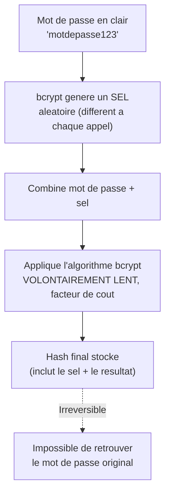

<div class="chapitre-titre-num">CHAPITRE 22</div>

# Hachage des mots de passe (bcrypt)

<div class="encadre objectif">
<span class="encadre-titre">🎯 Objectif du chapitre</span>
Comprendre pourquoi un mot de passe ne doit jamais être stocké en clair, ni même simplement chiffré, et maîtriser bcrypt pour le hachage sécurisé avec salage automatique. À la fin de ce chapitre, tu sauras expliquer, y compris en entretien technique, pourquoi bcrypt est volontairement lent, et tu connaîtras ses alternatives modernes.
</div>

<div class="encadre scenario">
<span class="encadre-titre">🎬 Mise en situation</span>
Un client te transmet une base de données héritée d'un ancien prestataire, où la colonne "mot_de_passe" contient des chaînes comme `5f4dcc3b5aa765d61d8327deb882cf99` — un hash MD5, reconnaissable à sa longueur fixe de 32 caractères hexadécimaux. Le client te demande si c'est "sécurisé". Ce chapitre te donne exactement les arguments pour répondre non, et pour expliquer pourquoi une migration vers bcrypt (ou une alternative moderne) est nécessaire avant toute mise en production sérieuse — au-delà d'un simple "c'est mieux", avec des raisons techniques précises.
</div>

## 22.1 Pourquoi jamais stocker un mot de passe en clair

<div class="encadre attention">
<span class="encadre-titre">⚠️ Une base de données compromise expose alors TOUS les mots de passe en clair</span>
Si une base de données contenant des mots de passe en clair est un jour compromise (fuite de données, erreur de configuration, employé malveillant), **tous** les comptes utilisateurs sont immédiatement exposés — d'autant plus grave que beaucoup d'utilisateurs réutilisent le même mot de passe sur plusieurs services.
</div>

## 22.2 Pourquoi le chiffrement (réversible) n'est pas non plus la solution

<div class="encadre astuce">
<span class="encadre-titre">💡 Hachage vs chiffrement : une distinction fondamentale</span>
Le **chiffrement** est réversible : avec la bonne clé, on peut retrouver la donnée d'origine. Le **hachage** est **irréversible par conception** : impossible de retrouver le mot de passe original à partir du hash, même en connaissant l'algorithme utilisé. Pour un mot de passe, on veut justement ne **jamais** avoir besoin de le retrouver en clair — seulement vérifier qu'un mot de passe saisi correspond au hash stocké. Le hachage est donc la bonne primitive, jamais le chiffrement.
</div>

## 22.3 Pourquoi pas un simple hachage MD5/SHA-256

<div class="encadre attention">
<span class="encadre-titre">⚠️ MD5 et SHA-256 sont conçus pour être RAPIDES — un défaut pour les mots de passe</span>
MD5 et SHA-256 sont des fonctions de hachage **génériques**, optimisées pour être calculées très rapidement (utiles pour vérifier l'intégrité d'un fichier, par exemple). Cette rapidité est un **problème** pour les mots de passe : un attaquant disposant d'une liste de hashs volés peut tester des **milliards** de mots de passe par seconde sur du matériel dédié (GPU), rendant une attaque par force brute ou par dictionnaire réalisable en un temps raisonnable — exactement le risque du hash MD5 découvert dans la mise en situation d'ouverture.
</div>

## 22.4 bcrypt : conçu spécifiquement pour les mots de passe

**bcrypt** est un algorithme de hachage **volontairement lent** et **paramétrable** (facteur de coût), rendant les attaques par force brute nettement plus coûteuses en temps de calcul — un ralentissement négligeable pour une seule vérification légitime (quelques centaines de millisecondes), mais rédhibitoire à l'échelle de milliards de tentatives.

```
$ npm install bcrypt
```

```js
const bcrypt = require("bcrypt");

async function hacherMotDePasse(motDePasse) {
  const facteurCout = 10; // plus élevé = plus lent = plus résistant, mais coûte aussi plus cher en calcul serveur
  return bcrypt.hash(motDePasse, facteurCout);
}

async function verifierMotDePasse(motDePasseSaisi, hashStocke) {
  return bcrypt.compare(motDePasseSaisi, hashStocke); // retourne true/false
}
```



<div class="encadre astuce">
<span class="encadre-titre">💡 Explication du schéma</span>
Le sel est généré **avant** le calcul du hash et intégré directement dans le résultat final stocké — c'est pourquoi `bcrypt.compare()` (section suivante) n'a besoin que du hash stocké pour vérifier un mot de passe, sans avoir à retenir le sel séparément.
</div>

```js
// Utilisation dans le service d'inscription (rappel du chapitre 15)
const utilisateur = await creerUtilisateur({
  nom,
  email,
  motDePasseHash: await hacherMotDePasse(motDePasse), // ne JAMAIS stocker motDePasse tel quel
});
```

```js
// Utilisation lors de la connexion
async function connecter(email, motDePasse) {
  const utilisateur = await UtilisateurRepository.trouverParEmail(email);
  if (!utilisateur) {
    throw new NonAutoriseError("Email ou mot de passe incorrect"); // message VOLONTAIREMENT vague, section 22.6
  }

  const motDePasseValide = await bcrypt.compare(motDePasse, utilisateur.motDePasseHash);
  if (!motDePasseValide) {
    throw new NonAutoriseError("Email ou mot de passe incorrect");
  }

  return utilisateur;
}
```

## 22.5 Le sel (salt) automatique de bcrypt

<div class="encadre astuce">
<span class="encadre-titre">💡 Pourquoi deux mots de passe identiques produisent des hashs différents</span>

```js
console.log(await bcrypt.hash("motdepasse123", 10));
// $2b$10$N9qo8uLOickgx2ZMRZoMye...
console.log(await bcrypt.hash("motdepasse123", 10));
// $2b$10$KIXQ3vN8YQZ7fD5jRp2Xxe...  ← DIFFÉRENT, bien que le mot de passe soit identique !
```
bcrypt génère automatiquement un **sel** (une valeur aléatoire) différent à chaque hachage, intégré directement dans le hash final produit. Cela empêche les attaques par "table arc-en-ciel" (rainbow table, des hashs précalculés pour des mots de passe courants) : même un mot de passe très commun ("123456") produit un hash unique à chaque compte, rendant ces tables précalculées inutiles — exactement ce que le hash MD5 de la mise en situation d'ouverture ne fait pas (un MD5 de "123456" est identique partout, et déjà répertorié dans des tables publiques).
</div>

## 22.6 Ne jamais révéler si c'est l'email ou le mot de passe qui est incorrect

<div class="encadre attention">
<span class="encadre-titre">⚠️ "Email incorrect" vs "Mot de passe incorrect" : une fuite d'information</span>

```js
// ❌ Révèle à un attaquant si un email est enregistré dans le système, même sans connaître le mot de passe
if (!utilisateur) throw new NonAutoriseError("Cet email n'existe pas");
if (!motDePasseValide) throw new NonAutoriseError("Mot de passe incorrect");
```
Un message d'erreur différencié permet à un attaquant de **vérifier** quels emails sont enregistrés (énumération de comptes), une information précieuse pour cibler ensuite une attaque de phishing ou de force brute. Toujours utiliser le **même** message générique ("Email ou mot de passe incorrect") dans les deux cas.
</div>

## 22.7 Choisir le bon facteur de coût

<div class="encadre astuce">
<span class="encadre-titre">💡 Le facteur de coût doit évoluer avec la puissance de calcul disponible</span>
Un facteur de coût de **10-12** est généralement recommandé en 2026 pour un bon compromis sécurité/performance serveur. Ce nombre devrait être **augmenté périodiquement** à mesure que le matériel informatique devient plus puissant (et donc plus rapide à casser un hash faiblement coûteux) — bcrypt a été spécifiquement conçu pour permettre cet ajustement sans changer d'algorithme.
</div>

## 22.8 Alternatives modernes : argon2 et scrypt

<div class="encadre astuce">
<span class="encadre-titre">💡 bcrypt n'est plus le seul choix sérieux en 2026</span>
**Argon2** (vainqueur du concours Password Hashing Competition en 2015) est aujourd'hui recommandé par de nombreux experts en cryptographie comme successeur de bcrypt, notamment pour sa résistance renforcée face aux attaques utilisant du matériel spécialisé (GPU, ASIC) grâce à un coût mémoire configurable, en plus du coût de calcul. **scrypt** (module natif de Node.js depuis longtemps, `crypto.scrypt`) partage cette même philosophie de coût mémoire élevé.
</div>

| Algorithme | Résistance GPU/ASIC | Configuration | Maturité/adoption | Disponibilité Node.js |
|---|---|---|---|---|
| **bcrypt** | Bonne | Facteur de coût unique (temps) | Très large, standard historique | Paquet npm `bcrypt` |
| **argon2** | Excellente (coût mémoire + temps) | Coût mémoire, temps, parallélisme, séparément réglables | Croissante, recommandé pour du code neuf | Paquet npm `argon2` |
| **scrypt** | Très bonne (coût mémoire) | Coût mémoire et temps réglables | Établie, moins répandue que bcrypt dans l'écosystème web | Natif (`crypto.scrypt`) |

```js
// Exemple avec argon2 (npm install argon2)
const argon2 = require("argon2");

async function hacherMotDePasseArgon2(motDePasse) {
  return argon2.hash(motDePasse); // parametres par defaut deja raisonnables
}

async function verifierMotDePasseArgon2(motDePasseSaisi, hashStocke) {
  return argon2.verify(hashStocke, motDePasseSaisi);
}
```

<div class="encadre retenir">
<span class="encadre-titre">📌 À retenir</span>
Ce manuel utilise bcrypt dans ses exemples (encore extrêmement répandu, largement documenté, et parfaitement sûr avec un facteur de coût correct). Pour un **nouveau** projet sans contrainte de compatibilité, argon2 est une direction moderne défendable — mais bcrypt reste un choix parfaitement acceptable et très largement utilisé en production en 2026.
</div>

## Atelier — Migrer un hash MD5 vers bcrypt

<div class="encadre exercice">
<span class="encadre-titre">🛠️ Atelier 22 — Corriger l'héritage de la mise en situation d'ouverture</span>

**Objectif** : mettre en place une stratégie réaliste de migration d'un ancien système de hachage faible (MD5, comme dans la mise en situation) vers bcrypt, sans forcer tous les utilisateurs à réinitialiser leur mot de passe le même jour.

**Préparation** : une table utilisateurs simulée avec une colonne `motDePasseHash` contenant des hashs MD5 (32 caractères hex) et un champ `algorithmeHash` valant `"md5"`.

**Étapes détaillées** :
1. Écris une fonction `connecter(email, motDePasse)` qui, si `algorithmeHash === "md5"`, vérifie d'abord avec un hash MD5 classique (`crypto.createHash("md5")`).
2. Si la vérification MD5 réussit, **re-hache immédiatement** le mot de passe avec bcrypt et met à jour `motDePasseHash`/`algorithmeHash` à `"bcrypt"` dans le même flux de connexion.
3. Si `algorithmeHash === "bcrypt"`, vérifie normalement avec `bcrypt.compare()`.
4. Teste une connexion avec un compte "MD5" existant : vérifie qu'après cette connexion, le compte est bien passé à bcrypt.

**Validation** : chaque connexion réussie d'un compte encore en MD5 doit migrer silencieusement ce compte vers bcrypt, sans jamais demander à l'utilisateur de changer son mot de passe.

**Résultat attendu** : une migration progressive et transparente, réaliste pour un vrai projet en production avec des utilisateurs actifs — la réponse concrète à donner au client de la mise en situation d'ouverture.

**Dépannage** : si la migration ne se déclenche jamais, vérifie que le champ `algorithmeHash` est bien mis à jour avant la fin de la fonction `connecter`, pas seulement calculé sans être sauvegardé.

**Nettoyage** : aucun.
</div>

## Erreurs fréquentes

<div class="encadre attention">
<span class="encadre-titre">⚠️ Erreur n°1 — Oublier que bcrypt.hash() et bcrypt.compare() sont asynchrones</span>

```js
// ❌ bcrypt.hashSync existe, mais BLOQUE le thread principal (rappel du chapitre 1) — à éviter dans un serveur
const hash = bcrypt.hashSync(motDePasse, 10);
```
```js
// ✅ Toujours utiliser la version asynchrone dans le code serveur
const hash = await bcrypt.hash(motDePasse, 10);
```
</div>

<div class="encadre attention">
<span class="encadre-titre">⚠️ Erreur n°2 — Comparer un mot de passe avec === au lieu de bcrypt.compare()</span>

```js
if (motDePasseSaisi === utilisateur.motDePasseHash) { ... } // ❌ ne fonctionnera JAMAIS, le hash n'est pas le mot de passe
```
Le mot de passe saisi (en clair) ne peut **jamais** être comparé directement au hash stocké — seule `bcrypt.compare()` sait recalculer et comparer correctement, en tenant compte du sel intégré au hash.
</div>

<div class="encadre attention">
<span class="encadre-titre">⚠️ Erreur n°3 — Utiliser MD5/SHA-256 "parce que c'est plus rapide"</span>
Exactement le piège découvert dans la mise en situation d'ouverture — la rapidité de MD5/SHA-256 est précisément ce qui les rend inadaptés aux mots de passe, jamais un avantage dans ce contexte.
</div>

## Débogage

<div class="encadre attention">
<span class="encadre-titre">🩺 Symptôme : bcrypt.compare() retourne toujours false, même avec le bon mot de passe</span>

- **Cause probable** : le hash stocké a été tronqué (colonne de base de données trop courte pour la longueur réelle d'un hash bcrypt, environ 60 caractères) ou corrompu lors d'une migration de données.
- **Diagnostic** : vérifier la longueur exacte du hash stocké et la comparer à un hash bcrypt fraîchement généré.
- **Solution** : s'assurer que la colonne de base de données accepte au moins 60 caractères pour ce champ.
</div>

## En entreprise

- **Migration progressive de hachage** : exactement l'atelier de ce chapitre — une pratique courante quand un système hérité utilise un algorithme faible, permettant une transition sans réinitialisation forcée massive.
- **Politique de mot de passe minimale** : de nombreuses équipes combinent bcrypt avec une exigence de complexité minimale (longueur, mélange de caractères) validée avant le hachage lui-même (chapitre 18).

## Entretien technique

<div class="encadre exercice">
<span class="encadre-titre">💼 Questions fréquemment posées en entretien</span>

**Q1. "Pourquoi bcrypt est-il préférable à SHA-256 pour hacher un mot de passe ?"**
Réponse attendue : bcrypt est volontairement lent et paramétrable (facteur de coût), rendant les attaques par force brute nettement plus coûteuses, contrairement à SHA-256 conçu pour être rapide (un atout pour l'intégrité de fichiers, un défaut pour les mots de passe).

**Q2. "À quoi sert le sel (salt) dans bcrypt ?"**
Réponse attendue : une valeur aléatoire générée à chaque hachage, intégrée au résultat final, garantissant que deux mots de passe identiques produisent des hashs différents — neutralisant les tables arc-en-ciel précalculées.

**Q3. "Connaissez-vous des alternatives à bcrypt ?"**
Réponse attendue : argon2 (vainqueur du concours de référence en cryptographie, coût mémoire configurable) et scrypt (natif Node.js), tous deux offrant une résistance renforcée face aux attaques par matériel spécialisé.
</div>

## Optimisation, sécurité et maintenabilité

<div class="encadre securite">
<span class="encadre-titre">🔒 Sécurité</span>
Ne jamais réduire le facteur de coût de bcrypt "pour la performance" sans mesurer l'impact réel — le ralentissement d'une connexion utilisateur (quelques centaines de millisecondes) est un compromis largement acceptable face au gain de résistance aux attaques.
</div>

<div class="encadre performance">
<span class="encadre-titre">🚀 Performance</span>
Le hachage bcrypt étant délibérément coûteux en CPU, éviter de l'appeler inutilement plusieurs fois pour la même opération (par exemple, ne jamais re-hacher un mot de passe déjà haché par erreur de logique).
</div>

## Résumé du chapitre

- Un mot de passe ne doit jamais être stocké en clair, ni chiffré de façon réversible — seul le hachage irréversible convient.
- bcrypt est volontairement lent et paramétrable (facteur de coût), résistant aux attaques par force brute à grande échelle, contrairement à MD5/SHA-256.
- bcrypt intègre un sel aléatoire automatiquement, rendant deux hashs d'un même mot de passe toujours différents.
- argon2 et scrypt sont des alternatives modernes, avec un coût mémoire configurable en plus du coût de calcul.
- Toujours utiliser un message d'erreur générique ("email ou mot de passe incorrect"), jamais différencier les deux cas.

## Quiz

<div class="encadre exercice">
<span class="encadre-titre">📝 QCM</span>

1. Pourquoi MD5/SHA-256 ne conviennent-ils pas pour hacher un mot de passe ?
   - a) Ils sont trop lents
   - b) Ils sont conçus pour être rapides, facilitant les attaques par force brute
   - c) Ils ne fonctionnent pas avec Node.js
   - d) Ils ne produisent pas de hash unique

2. À quoi sert le sel (salt) dans bcrypt ?
   - a) À accélérer le hachage
   - b) À garantir que deux mots de passe identiques produisent des hashs différents
   - c) À chiffrer le mot de passe de façon réversible
   - d) À compresser le hash final

3. Quel algorithme offre un coût mémoire configurable en plus du coût de calcul ?
   - a) MD5
   - b) SHA-256
   - c) argon2
   - d) Base64

**Corrigé** : 1-b, 2-b, 3-c.
</div>

<div class="encadre exercice">
<span class="encadre-titre">📝 Vrai ou Faux</span>

1. Le hachage est réversible avec la bonne clé. — **Faux** (c'est le chiffrement qui est réversible, pas le hachage).
2. bcrypt.hashSync() est recommandé dans un serveur en production. — **Faux** (bloque le thread principal, préférer la version async).
3. argon2 est une alternative moderne à bcrypt. — **Vrai**.
</div>

<div class="encadre exercice">
<span class="encadre-titre">📝 Question ouverte</span>

Pourquoi le hash MD5 découvert dans la mise en situation d'ouverture ("5f4dcc3b5aa765d61d8327deb882cf99") est-il particulièrement dangereux, au-delà du simple fait que MD5 soit rapide ?

**Corrigé** : ce hash spécifique est en réalité le hash MD5 bien connu du mot de passe "password" — déjà répertorié dans de nombreuses tables arc-en-ciel publiques et bases de données de hashs cassés, librement consultables en ligne. N'importe qui reconnaissant ce hash peut immédiatement en déduire le mot de passe en clair, sans même avoir besoin de le casser par force brute — un risque bien plus immédiat qu'un simple calcul rapide.
</div>

## Exercices

<div class="encadre exercice">
<span class="encadre-titre">📝 Exercice 22.1</span>

Écris une fonction `changerMotDePasse(utilisateurId, ancienMotDePasse, nouveauMotDePasse)` qui vérifie l'ancien mot de passe via bcrypt avant de hacher et enregistrer le nouveau.
</div>

**Corrigé :**
```js
async function changerMotDePasse(utilisateurId, ancienMotDePasse, nouveauMotDePasse) {
  const utilisateur = await UtilisateurRepository.trouverParId(utilisateurId);

  const ancienValide = await bcrypt.compare(ancienMotDePasse, utilisateur.motDePasseHash);
  if (!ancienValide) {
    throw new NonAutoriseError("Ancien mot de passe incorrect");
  }

  const nouveauHash = await bcrypt.hash(nouveauMotDePasse, 10);
  await UtilisateurRepository.mettreAJourMotDePasse(utilisateurId, nouveauHash);
}
```

## Checklist de fin de chapitre

<ul class="checklist">
<li>☐ Je sais expliquer la différence entre hachage et chiffrement.</li>
<li>☐ Je comprends pourquoi MD5/SHA-256 sont inadaptés aux mots de passe.</li>
<li>☐ Je sais hacher et vérifier un mot de passe avec bcrypt (version asynchrone).</li>
<li>☐ Je comprends le rôle du sel automatique de bcrypt.</li>
<li>☐ Je connais l'existence d'argon2 et scrypt comme alternatives modernes.</li>
<li>☐ J'utilise systématiquement un message d'erreur générique à la connexion.</li>
</ul>

## FAQ

<dl class="faq">
<dt>Faut-il migrer immédiatement un projet existant de bcrypt vers argon2 ?</dt>
<dd>Pas nécessairement dans l'urgence — bcrypt reste sûr avec un facteur de coût correct. Une migration se justifie surtout pour un nouveau projet, ou si un audit de sécurité le recommande spécifiquement.</dd>

<dt>Peut-on augmenter le facteur de coût d'un hash bcrypt déjà stocké ?</dt>
<dd>Non directement — il faut re-hacher le mot de passe (ce qui nécessite de le connaître en clair, donc seulement possible au moment d'une connexion réussie, comme dans l'atelier de migration de ce chapitre).</dd>

<dt>bcrypt a-t-il une limite de longueur de mot de passe ?</dt>
<dd>Oui, bcrypt tronque silencieusement les mots de passe au-delà de 72 octets — une limitation à connaître, rarement un problème en pratique mais bonne à documenter si l'application accepte des mots de passe très longs.</dd>
</dl>

## Références et pour aller plus loin

- Documentation npm bcrypt : [https://www.npmjs.com/package/bcrypt](https://www.npmjs.com/package/bcrypt)
- Documentation npm argon2 : [https://www.npmjs.com/package/argon2](https://www.npmjs.com/package/argon2)
- OWASP — Password Storage Cheat Sheet : [https://cheatsheetseries.owasp.org/cheatsheets/Password_Storage_Cheat_Sheet.html](https://cheatsheetseries.owasp.org/cheatsheets/Password_Storage_Cheat_Sheet.html)

*Chapitre suivant : l'authentification JWT, pour identifier un utilisateur à travers ses requêtes suivantes sans lui redemander son mot de passe.*
