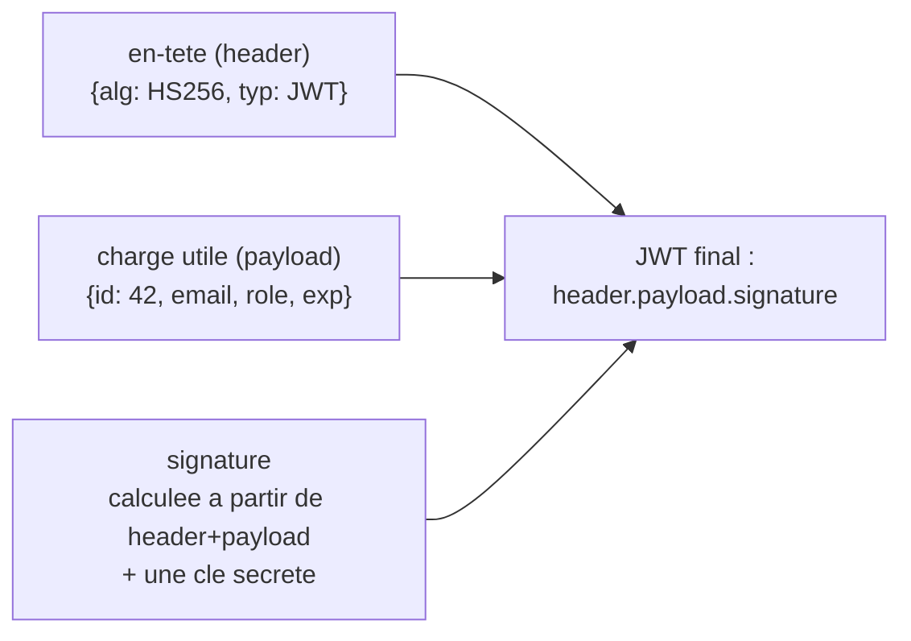
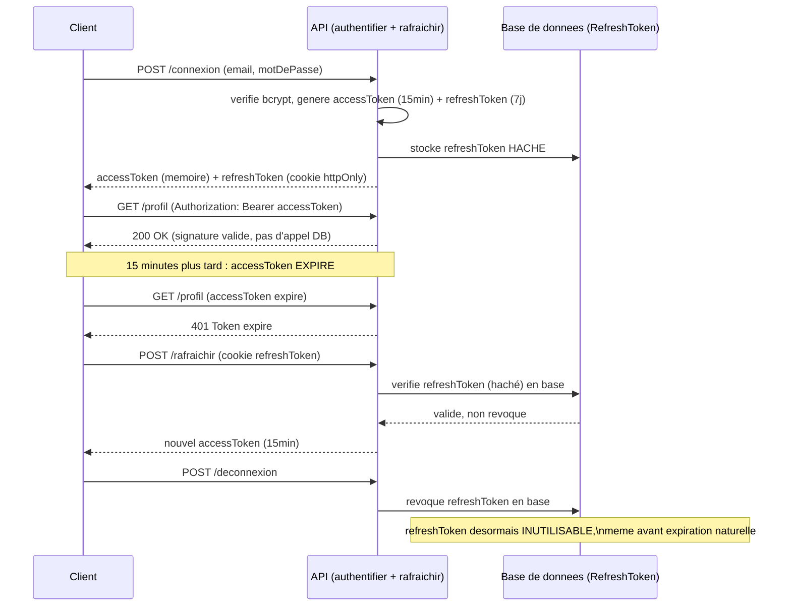

<div class="chapitre-titre-num">CHAPITRE 23</div>

# Authentification JWT

<div class="encadre objectif">
<span class="encadre-titre">🎯 Objectif du chapitre</span>
Comprendre le principe des JSON Web Tokens, implémenter la connexion et le middleware de vérification, et adopter le modèle access/refresh token pour une sécurité robuste. À la fin de ce chapitre, tu sauras expliquer le cycle de vie complet d'une session JWT — de la connexion jusqu'à la déconnexion réelle — et pourquoi un token unique longue durée est un choix risqué.
</div>

<div class="encadre scenario">
<span class="encadre-titre">🎬 Mise en situation</span>
Un utilisateur signale avoir perdu son téléphone, sur lequel son compte restait connecté. Le client te demande : "peut-on déconnecter cet appareil à distance, immédiatement ?" Si le projet utilise un unique JWT valable 7 jours sans aucun mécanisme de révocation, la réponse honnête est non — le token reste utilisable jusqu'à son expiration naturelle, quoi qu'il arrive. Ce chapitre construit exactement le modèle qui permet de répondre oui à cette question, tout en gardant les bénéfices de performance d'une authentification sans état.
</div>

## 23.1 Le problème : HTTP est sans état (stateless)

Chaque requête HTTP est, par nature, **indépendante** des précédentes — le serveur ne "se souvient" pas nativement qu'un utilisateur s'est connecté lors d'une requête antérieure. Un mécanisme d'authentification doit permettre à chaque nouvelle requête de **prouver** l'identité de l'utilisateur, sans redemander email/mot de passe à chaque fois.

## 23.2 Qu'est-ce qu'un JWT

Un **JWT** (*JSON Web Token*) est une chaîne encodée en trois parties, séparées par des points : `en-tête.charge_utile.signature`.



<div class="encadre attention">
<span class="encadre-titre">⚠️ Un JWT est encodé, PAS chiffré : son contenu est lisible par n'importe qui</span>
N'importe qui peut décoder un JWT (essaie sur jwt.io) et lire son contenu — seule la **signature** empêche de le modifier sans être détecté (falsifier le rôle "ADMIN", par exemple). Ne jamais placer d'information sensible (mot de passe, numéro de carte) dans le payload d'un JWT.
</div>

## 23.3 JWT vs Session : deux modèles d'authentification

| Critère | JWT (sans état) | Session (avec état, côté serveur) |
|---|---|---|
| Stockage de l'état de connexion | Dans le token lui-même, côté client | En mémoire/base côté serveur (souvent Redis) |
| Scalabilité horizontale | Excellente (aucun état partagé entre serveurs) | Nécessite un stockage de session partagé entre instances |
| Révocation immédiate | Difficile (le token reste valide jusqu'à expiration) | Facile (supprimer la session côté serveur) |
| Charge serveur par requête | Faible (juste une vérification de signature) | Une lecture du stockage de session à chaque requête |
| Cas d'usage typique | API REST, mobile, microservices | Applications web traditionnelles à rendu serveur |

<div class="encadre astuce">
<span class="encadre-titre">💡 Pourquoi ce manuel privilégie JWT</span>
Ce manuel construit des API REST consommées par des clients variés (React, mobile) sur plusieurs instances de serveur potentielles (chapitre 39) — le modèle JWT sans état s'y prête naturellement, sans nécessiter un stockage de session partagé. Le modèle access/refresh token (section 23.6) compense justement la principale faiblesse de JWT (révocation difficile), résolvant exactement le problème de la mise en situation d'ouverture.
</div>

## 23.4 Générer un JWT à la connexion

```
$ npm install jsonwebtoken
```

```js
const jwt = require("jsonwebtoken");
const bcrypt = require("bcrypt");

async function connecter(email, motDePasse) {
  const utilisateur = await UtilisateurRepository.trouverParEmail(email);
  if (!utilisateur || !(await bcrypt.compare(motDePasse, utilisateur.motDePasseHash))) {
    throw new NonAutoriseError("Email ou mot de passe incorrect");
  }

  const token = jwt.sign(
    { id: utilisateur.id, email: utilisateur.email, role: utilisateur.role }, // le payload
    process.env.JWT_SECRET, // la clé secrète, JAMAIS codée en dur (rappel du chapitre 12)
    { expiresIn: "15m" } // durée de vie courte pour un access token (section 23.6)
  );

  return { token, utilisateur };
}
```

## 23.5 Middleware de vérification du token

```js
// src/middlewares/authentifier.middleware.js
const jwt = require("jsonwebtoken");
const { NonAutoriseError } = require("../errors");

function authentifier(req, res, next) {
  const enTete = req.headers.authorization; // format attendu : "Bearer eyJhbGci..."

  if (!enTete || !enTete.startsWith("Bearer ")) {
    return next(new NonAutoriseError("Token d'authentification manquant"));
  }

  const token = enTete.split(" ")[1];

  try {
    const payload = jwt.verify(token, process.env.JWT_SECRET); // lève une erreur si invalide/expiré
    req.utilisateur = payload; // attache l'utilisateur décodé à la requête, pour les middlewares/contrôleurs suivants
    next();
  } catch (erreur) {
    next(new NonAutoriseError("Token invalide ou expiré"));
  }
}

module.exports = authentifier;
```

```js
// routes/utilisateurs.routes.js
const authentifier = require("../middlewares/authentifier.middleware");

router.get("/profil", authentifier, utilisateursController.obtenirProfil);
```

```js
// controllers/utilisateurs.controller.js
async function obtenirProfil(req, res) {
  // req.utilisateur a été attaché par le middleware authentifier — contient { id, email, role }
  const utilisateur = await UtilisateurService.trouverParId(req.utilisateur.id);
  res.json(utilisateur);
}
```

## 23.6 Où stocker le token côté client (aperçu, développé côté frontend)

<div class="encadre astuce">
<span class="encadre-titre">💡 Rappel des risques déjà détaillés côté frontend</span>
Le manuel React de ce même auteur détaille en profondeur ce sujet (chapitres 26 et 28) : stocker un token longue durée dans `localStorage` l'expose au vol via une faille XSS. La bonne pratique reste un **access token court en mémoire** côté client + un **refresh token en cookie httpOnly** — exactement le modèle détaillé dans la section suivante, côté serveur cette fois.
</div>

## 23.7 Le modèle access token + refresh token

<div class="encadre attention">
<span class="encadre-titre">⚠️ Un seul token longue durée est un risque de sécurité</span>
Un JWT unique valable 7 jours, s'il est volé (XSS, interception réseau non chiffrée), reste utilisable **jusqu'à son expiration naturelle** — aucun moyen de le révoquer immédiatement. Le modèle à deux tokens résout ce problème, exactement le besoin exprimé dans la mise en situation d'ouverture.
</div>



<div class="encadre astuce">
<span class="encadre-titre">💡 Explication du schéma</span>
Ce cycle complet est exactement ce qui manque à un système à token unique : l'access token expire vite (limitant l'impact d'un vol), le refresh token permet de rester connecté sans re-saisir ses identifiants, et surtout — la déconnexion (ou la perte de l'appareil de la mise en situation d'ouverture) **révoque réellement** l'accès en base, rendant le refresh token inutilisable immédiatement, sans attendre son expiration naturelle de 7 jours.
</div>

```js
async function connecter(email, motDePasse) {
  const utilisateur = await verifierIdentifiants(email, motDePasse);

  const accessToken = jwt.sign(
    { id: utilisateur.id, role: utilisateur.role },
    process.env.JWT_ACCESS_SECRET,
    { expiresIn: "15m" } // COURTE durée : même volé, son impact reste limité dans le temps
  );

  const refreshToken = jwt.sign(
    { id: utilisateur.id },
    process.env.JWT_REFRESH_SECRET, // clé DIFFÉRENTE de celle de l'access token
    { expiresIn: "7d" } // LONGUE durée, mais révocable (section suivante)
  );

  // Stocker le refresh token (haché) en base, pour pouvoir le révoquer explicitement
  await RefreshTokenRepository.creer({ utilisateurId: utilisateur.id, tokenHash: hacherToken(refreshToken) });

  return { accessToken, refreshToken };
}
```

```js
// Route de rafraîchissement : échange un refresh token valide contre un nouvel access token
async function rafraichir(req, res, next) {
  try {
    const { refreshToken } = req.cookies; // envoyé via un cookie httpOnly, jamais accessible en JavaScript client
    const payload = jwt.verify(refreshToken, process.env.JWT_REFRESH_SECRET);

    const tokenEnBase = await RefreshTokenRepository.trouver(payload.id, hacherToken(refreshToken));
    if (!tokenEnBase || tokenEnBase.revoque) {
      throw new NonAutoriseError("Session invalide, merci de te reconnecter");
    }

    const nouvelAccessToken = jwt.sign({ id: payload.id }, process.env.JWT_ACCESS_SECRET, { expiresIn: "15m" });
    res.json({ accessToken: nouvelAccessToken });
  } catch (erreur) {
    next(new NonAutoriseError("Session expirée"));
  }
}
```

## 23.8 Déconnexion réelle : révoquer le refresh token

```js
async function deconnecter(utilisateurId, refreshToken) {
  await RefreshTokenRepository.revoquer(utilisateurId, hacherToken(refreshToken));
  // Le refresh token ne pourra PLUS jamais être échangé contre un nouvel access token,
  // même s'il n'a pas encore expiré naturellement.
}
```

<div class="encadre astuce">
<span class="encadre-titre">💡 Pourquoi stocker le refresh token (haché) en base</span>
Contrairement à l'access token (vérifié uniquement par sa signature, sans aller en base — rapide), le refresh token est vérifié **contre une entrée en base de données**, ce qui permet de le révoquer **immédiatement** (déconnexion, changement de mot de passe, compte compromis) — un access token JWT classique, lui, ne peut jamais être invalidé avant sa propre expiration naturelle, d'où l'intérêt de le garder très court (15 minutes).
</div>

<div class="encadre retenir">
<span class="encadre-titre">📌 À retenir</span>
Cette architecture répond précisément à la question de la mise en situation d'ouverture : "peut-on déconnecter cet appareil à distance ?" — oui, en révoquant son refresh token en base. Il redevient inutilisable dans un délai maximal de 15 minutes (le temps que son access token actuel expire), jamais 7 jours.
</div>

## Atelier — Simuler la perte d'un appareil

<div class="encadre exercice">
<span class="encadre-titre">🛠️ Atelier 23 — Révocation à distance, comme dans la mise en situation</span>

**Objectif** : reproduire concrètement le scénario de la mise en situation d'ouverture et vérifier que la révocation fonctionne réellement.

**Préparation** : le système access/refresh token complet (sections 23.7-23.8) mis en place.

**Étapes détaillées** :
1. Connecte-toi et récupère un access token et un refresh token valides.
2. Utilise l'access token pour accéder à `/profil` : vérifie que ça fonctionne.
3. Sans attendre l'expiration, appelle `deconnecter(utilisateurId, refreshToken)` directement (simulant une action "déconnecter cet appareil" côté admin ou côté utilisateur sur un autre appareil).
4. Attends l'expiration de l'access token (ou modifie temporairement `expiresIn` à "5s" pour accélérer le test), puis tente de le rafraîchir via `/rafraichir` avec le refresh token révoqué.

**Validation** : la tentative de rafraîchissement après révocation doit échouer avec un message clair ("Session invalide"), même si le refresh token n'a pas encore atteint sa date d'expiration naturelle de 7 jours.

**Résultat attendu** : la preuve concrète que la réponse à la question du client de la mise en situation d'ouverture est bien "oui, on peut déconnecter cet appareil à distance".

**Dépannage** : si le rafraîchissement réussit malgré la révocation, vérifie que `RefreshTokenRepository.trouver` vérifie bien le champ `revoque`, pas seulement l'existence de l'entrée.

**Nettoyage** : aucun.
</div>

## Erreurs fréquentes

<div class="encadre attention">
<span class="encadre-titre">⚠️ Erreur n°1 — Utiliser la même clé secrète pour access token et refresh token</span>
Utiliser `JWT_SECRET` unique pour les deux types de tokens signifie qu'une fuite de cette clé compromet l'ensemble du système d'authentification en une seule fois. Deux clés distinctes (`JWT_ACCESS_SECRET`, `JWT_REFRESH_SECRET`) limitent l'impact d'une éventuelle fuite partielle.
</div>

<div class="encadre attention">
<span class="encadre-titre">⚠️ Erreur n°2 — Ne pas vérifier l'expiration côté serveur, se fier uniquement au client</span>
`jwt.verify()` vérifie **automatiquement** l'expiration (`exp`) et lève une erreur si le token est expiré — ne jamais désactiver cette vérification, et ne jamais faire confiance à un token juste parce que le client prétend qu'il est encore valide.
</div>

<div class="encadre attention">
<span class="encadre-titre">⚠️ Erreur n°3 — Stocker le refresh token en clair en base de données</span>
Comme un mot de passe (chapitre 22), le refresh token stocké en base doit être haché — un dump de base de données ne devrait jamais livrer un token de session directement réutilisable.
</div>

## Débogage

<div class="encadre attention">
<span class="encadre-titre">🩺 Symptôme : "jwt malformed" ou "invalid signature"</span>

- **Cause** : token corrompu, tronqué, ou vérifié avec la mauvaise clé secrète (par exemple, un access token vérifié avec `JWT_REFRESH_SECRET`).
- **Diagnostic** : décoder le token sur jwt.io pour vérifier sa structure ; vérifier quelle clé secrète est utilisée à la vérification.
- **Solution** : s'assurer que la bonne clé secrète correspond au bon type de token.
</div>

<div class="encadre attention">
<span class="encadre-titre">🩺 Symptôme : un utilisateur reste connecté après une déconnexion explicite</span>

- **Cause** : le refresh token n'a pas été réellement révoqué en base (erreur fréquente n°3, ou logique de révocation absente).
- **Solution** : vérifier que `deconnecter()` (section 23.8) est bien appelée et que la vérification du champ `revoque` est bien effective côté `/rafraichir`.
</div>

## En entreprise

- **Rotation de refresh token** : certaines équipes vont plus loin en générant un **nouveau** refresh token à chaque rafraîchissement (rotation), invalidant l'ancien immédiatement — détectant ainsi un vol si l'ancien refresh token est réutilisé après coup.
- **Séparation stricte des rôles dans le payload** : de nombreuses équipes évitent de placer des informations métier volumineuses dans le payload JWT (gardé minimal : id, rôle), préférant recharger les détails depuis la base à chaque requête si nécessaire.

## Entretien technique

<div class="encadre exercice">
<span class="encadre-titre">💼 Questions fréquemment posées en entretien</span>

**Q1. "JWT est-il chiffré ?"**
Réponse attendue : non, il est encodé (lisible par tous en le décodant), pas chiffré — seule sa signature garantit qu'il n'a pas été modifié, jamais que son contenu reste confidentiel.

**Q2. "Comment révoquer un JWT avant son expiration naturelle ?"**
Réponse attendue : un access token classique ne peut pas être révoqué directement (vérifié uniquement par signature) ; la solution pratique est le modèle access/refresh token, où le refresh token est vérifié en base et peut être révoqué immédiatement, limitant l'impact à la durée de vie courte de l'access token restant.

**Q3. "Pourquoi utiliser deux clés secrètes différentes pour access et refresh tokens ?"**
Réponse attendue : pour limiter l'impact d'une fuite partielle — la compromission d'une seule clé ne compromet pas l'autre type de token.
</div>

## Optimisation, sécurité et maintenabilité

<div class="encadre securite">
<span class="encadre-titre">🔒 Sécurité</span>
Ne jamais placer d'information sensible dans le payload JWT (mot de passe, même haché, numéro de carte bancaire) — le contenu est lisible par quiconque intercepte le token, sans avoir besoin de le casser.
</div>

<div class="encadre performance">
<span class="encadre-titre">🚀 Performance</span>
La vérification d'un access token (signature seule, sans requête base de données) est nettement plus rapide que la vérification d'une session classique — un avantage réel à l'échelle, tant que le refresh token (plus coûteux, avec accès base) reste rarement sollicité (une fois toutes les 15 minutes par utilisateur actif, dans cet exemple).
</div>

## Résumé du chapitre

- Un JWT est encodé (lisible par tous), pas chiffré ; seule sa signature garantit qu'il n'a pas été altéré.
- `jwt.sign()` génère un token signé avec une clé secrète ; `jwt.verify()` le vérifie et lève une erreur s'il est invalide/expiré.
- JWT (sans état) convient bien aux API REST scalables ; les sessions classiques restent pertinentes pour des applications à rendu serveur.
- Le modèle access token (courte durée, vérifié par signature seule) + refresh token (longue durée, vérifié en base, révocable) limite l'impact d'un vol de token et permet une vraie déconnexion à distance.
- Deux clés secrètes distinctes pour access et refresh tokens réduisent l'impact d'une fuite partielle.

## Quiz

<div class="encadre exercice">
<span class="encadre-titre">📝 QCM</span>

1. Un JWT est-il chiffré ?
   - a) Oui, totalement illisible sans la clé
   - b) Non, seulement encodé et signé
   - c) Oui, mais uniquement le payload
   - d) Cela dépend de l'algorithme utilisé

2. Comment révoquer immédiatement l'accès d'un utilisateur avec le modèle access/refresh token ?
   - a) Impossible, il faut attendre l'expiration
   - b) Révoquer le refresh token en base ; l'access token restant expire rapidement de lui-même
   - c) Redémarrer le serveur
   - d) Changer le nom de la base de données

3. Pourquoi utiliser des clés secrètes distinctes pour access et refresh tokens ?
   - a) Pour respecter une convention de nommage
   - b) Pour limiter l'impact d'une fuite partielle de l'une des deux clés
   - c) jsonwebtoken l'exige techniquement
   - d) Aucune raison particulière

**Corrigé** : 1-b, 2-b, 3-b.
</div>

<div class="encadre exercice">
<span class="encadre-titre">📝 Vrai ou Faux</span>

1. N'importe qui peut lire le contenu d'un JWT sans connaître la clé secrète. — **Vrai** (encodé, pas chiffré).
2. Un access token JWT classique peut être révoqué instantanément sans mécanisme additionnel. — **Faux**.
3. Le refresh token doit être stocké haché en base de données. — **Vrai**.
</div>

<div class="encadre exercice">
<span class="encadre-titre">📝 Question ouverte</span>

Pourquoi la réponse "on ne peut pas déconnecter cet appareil, il faut attendre 7 jours" aurait-elle été inacceptable pour le client de la mise en situation d'ouverture, et comment le modèle de ce chapitre l'évite-t-il ?

**Corrigé** : un utilisateur ayant perdu son téléphone attend une action immédiate, pas une promesse que l'accès expirera "un jour" — 7 jours représente une fenêtre de risque bien trop large si l'appareil tombe dans de mauvaises mains. Le modèle access/refresh token résout cela en rendant le refresh token révocable immédiatement en base ; l'access token restant (JWT classique, non révocable) expire de lui-même en 15 minutes maximum, réduisant la fenêtre de risque réelle à ce court délai plutôt qu'à la durée de vie complète du refresh token.
</div>

## Exercices

<div class="encadre exercice">
<span class="encadre-titre">📝 Exercice 23.1</span>

Écris le middleware `authentifier` (section 23.5) en gérant explicitement le cas où le token est expiré (`TokenExpiredError` de la librairie `jsonwebtoken`) avec un message différent d'un token simplement invalide.
</div>

**Corrigé :**
```js
function authentifier(req, res, next) {
  const enTete = req.headers.authorization;
  if (!enTete?.startsWith("Bearer ")) {
    return next(new NonAutoriseError("Token manquant"));
  }
  const token = enTete.split(" ")[1];

  try {
    req.utilisateur = jwt.verify(token, process.env.JWT_ACCESS_SECRET);
    next();
  } catch (erreur) {
    if (erreur.name === "TokenExpiredError") {
      return next(new NonAutoriseError("Session expirée, merci de te reconnecter"));
    }
    next(new NonAutoriseError("Token invalide"));
  }
}
```

## Checklist de fin de chapitre

<ul class="checklist">
<li>☐ Je sais expliquer la structure d'un JWT et pourquoi il n'est pas chiffré.</li>
<li>☐ Je sais générer et vérifier un JWT avec jsonwebtoken.</li>
<li>☐ Je comprends la différence entre JWT et session classique.</li>
<li>☐ Je sais implémenter le modèle access/refresh token complet.</li>
<li>☐ Je sais révoquer réellement un accès (déconnexion effective).</li>
</ul>

## FAQ

<dl class="faq">
<dt>Faut-il toujours utiliser le modèle access/refresh token, même pour un petit projet ?</dt>
<dd>Pour un prototype ou un projet sans besoin de révocation immédiate, un access token unique à durée modérée peut suffire. Dès qu'une vraie déconnexion à distance ou une gestion de sessions multiples devient nécessaire (la quasi-totalité des projets destinés à de vrais utilisateurs), le modèle à deux tokens apporte une réelle valeur.</dd>

<dt>Peut-on stocker des informations métier volumineuses dans le payload JWT ?</dt>
<dd>Techniquement oui, mais déconseillé : un payload volumineux alourdit chaque requête (le JWT est envoyé à chaque appel), et toute donnée qui change fréquemment (comme un rôle modifiable) resterait obsolète dans le token jusqu'à sa prochaine émission.</dd>

<dt>Que se passe-t-il si JWT_ACCESS_SECRET change (rotation de clé) ?</dt>
<dd>Tous les access tokens émis avec l'ancienne clé deviennent immédiatement invalides — une rotation de clé doit donc être planifiée consciemment, souvent accompagnée d'une communication aux utilisateurs actifs qui devront se reconnecter.</dd>
</dl>

## Références et pour aller plus loin

- Spécification JWT (RFC 7519) : [https://datatracker.ietf.org/doc/html/rfc7519](https://datatracker.ietf.org/doc/html/rfc7519)
- Documentation jsonwebtoken (npm) : [https://github.com/auth0/node-jsonwebtoken](https://github.com/auth0/node-jsonwebtoken)
- jwt.io (décodeur/débogueur interactif) : [https://jwt.io](https://jwt.io)

*Chapitre suivant : l'autorisation basée sur les rôles (RBAC), pour contrôler précisément qui peut faire quoi une fois authentifié.*
