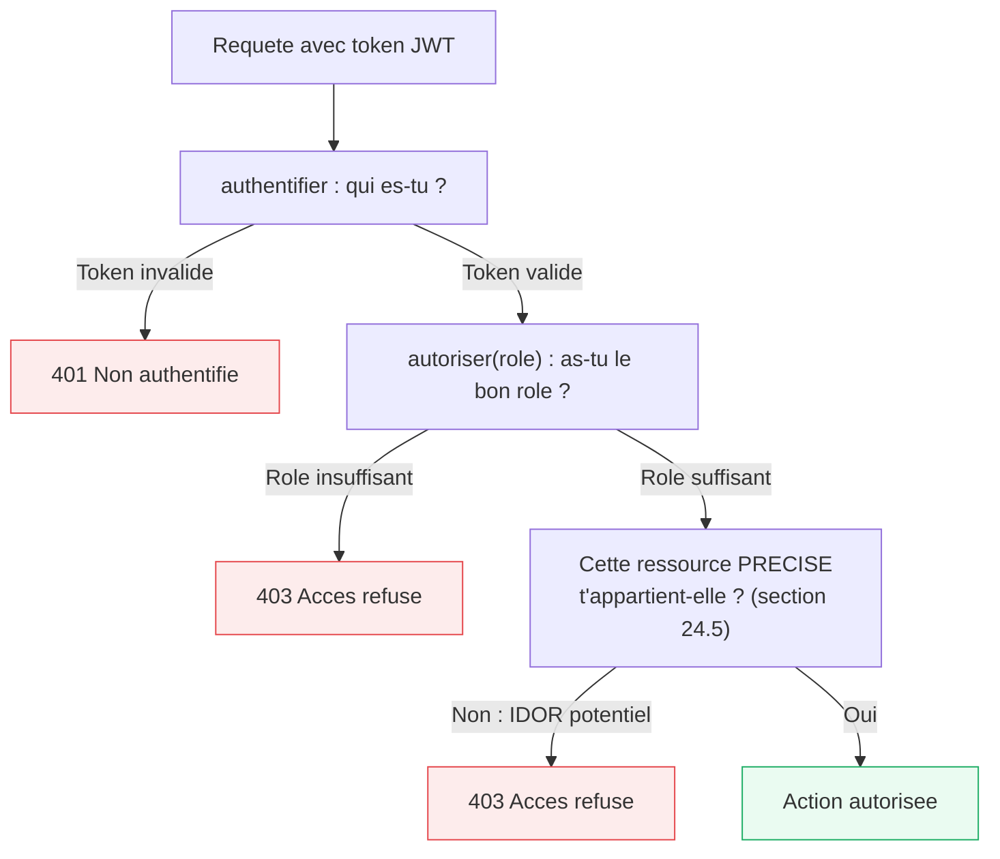

<div class="chapitre-titre-num">CHAPITRE 24</div>

# Autorisation basée sur les rôles (RBAC)

<div class="encadre objectif">
<span class="encadre-titre">🎯 Objectif du chapitre</span>
Distinguer authentification et autorisation, implémenter un middleware de vérification de rôle, et concevoir un système de permissions plus fin qu'une simple liste de rôles. À la fin de ce chapitre, tu sauras identifier et corriger une faille IDOR — l'une des vulnérabilités les plus fréquentes et les plus sous-estimées des API REST, y compris par des développeurs expérimentés.
</div>

<div class="encadre scenario">
<span class="encadre-titre">🎬 Mise en situation</span>
Un utilisateur de l'application MediAPI (le projet fil rouge de ce manuel, chapitres 41-47) remarque, en modifiant simplement l'id dans l'URL de sa propre consultation (`/api/consultations/58` devenu `/api/consultations/59`), qu'il accède au dossier médical d'un **autre patient** — nom, diagnostics, prescriptions. Le rôle vérifié était correct (`EMPLOYE`), mais rien ne vérifiait que la consultation demandée appartenait bien au bon contexte. C'est une faille **IDOR** (*Insecure Direct Object Reference*), l'une des vulnérabilités les plus fréquentes du classement OWASP — et l'objet central de ce chapitre, au-delà du simple RBAC par rôle.
</div>

## 24.1 Authentification vs autorisation

- **Authentification** (chapitre 23) : *qui es-tu ?*
- **Autorisation** (ce chapitre) : *qu'as-tu le droit de faire, une fois identifié ?*

Le **RBAC** (*Role-Based Access Control*) est le modèle le plus répandu : chaque utilisateur a un rôle (`UTILISATEUR`, `EMPLOYE`, `ADMIN`), et chaque rôle donne accès à un ensemble précis d'actions.



<div class="encadre astuce">
<span class="encadre-titre">💡 Explication du schéma</span>
Trois vérifications distinctes, souvent confondues : authentification (qui es-tu), autorisation par rôle (as-tu le bon rôle en général), et autorisation par ressource (as-tu le droit sur CETTE ressource précise). La mise en situation d'ouverture échoue précisément à la troisième étape — celle que ce chapitre développe en profondeur en section 24.5.
</div>

## 24.2 Middleware de vérification de rôle

```js
// src/middlewares/autoriser.middleware.js
const { AccesRefuseError } = require("../errors");

function autoriser(...rolesAutorises) {
  return function (req, res, next) {
    // req.utilisateur a été attaché par le middleware authentifier (chapitre 23), qui doit TOUJOURS précéder celui-ci
    if (!rolesAutorises.includes(req.utilisateur.role)) {
      return next(new AccesRefuseError("Tu n'as pas les droits nécessaires pour cette action"));
    }
    next();
  };
}

module.exports = autoriser;
```

```js
// routes/admin.routes.js
const authentifier = require("../middlewares/authentifier.middleware");
const autoriser = require("../middlewares/autoriser.middleware");

router.get(
  "/utilisateurs",
  authentifier,               // 1. Vérifie l'identité
  autoriser("ADMIN"),          // 2. Vérifie le rôle
  adminController.listerUtilisateurs
);

router.get(
  "/rapports",
  authentifier,
  autoriser("ADMIN", "EMPLOYE"), // plusieurs rôles autorisés pour cette route
  rapportsController.obtenir
);
```

<div class="encadre astuce">
<span class="encadre-titre">💡 L'ordre des middlewares est essentiel : authentifier AVANT autoriser</span>
`autoriser(...)` lit `req.utilisateur.role`, une propriété que **seul** le middleware `authentifier` (chapitre 23) attache à la requête. Inverser l'ordre (`autoriser` avant `authentifier`) provoquerait une erreur (`req.utilisateur` serait `undefined`).
</div>

## 24.3 RBAC hiérarchique

```js
const NIVEAU_ROLE = {
  UTILISATEUR: 1,
  EMPLOYE: 2,
  ADMIN: 3,
};

function autoriserNiveauMinimum(roleMinimum) {
  return function (req, res, next) {
    const niveauUtilisateur = NIVEAU_ROLE[req.utilisateur.role] || 0;
    const niveauRequis = NIVEAU_ROLE[roleMinimum];

    if (niveauUtilisateur < niveauRequis) {
      return next(new AccesRefuseError("Niveau d'accès insuffisant"));
    }
    next();
  };
}

router.get("/rapports", authentifier, autoriserNiveauMinimum("EMPLOYE"), rapportsController.obtenir);
// Un ADMIN (niveau 3) satisfait automatiquement cette exigence, sans avoir à lister explicitement chaque rôle supérieur
```

## 24.4 Permissions fines : au-delà des rôles simples

<div class="encadre astuce">
<span class="encadre-titre">💡 Quand le RBAC simple devient insuffisant</span>
Un système avec de nombreuses fonctionnalités distinctes bénéficie souvent d'un modèle de **permissions** plus granulaire qu'une simple hiérarchie de rôles — chaque rôle associé à un ensemble précis de permissions nommées, plutôt qu'à un simple niveau numérique.
</div>

```js
const PERMISSIONS_PAR_ROLE = {
  UTILISATEUR: ["voir_profil", "modifier_profil"],
  EMPLOYE: ["voir_profil", "modifier_profil", "voir_patients", "creer_consultation"],
  ADMIN: ["voir_profil", "modifier_profil", "voir_patients", "creer_consultation", "gerer_utilisateurs", "voir_rapports_financiers"],
};

function autoriserPermission(permissionRequise) {
  return function (req, res, next) {
    const permissions = PERMISSIONS_PAR_ROLE[req.utilisateur.role] || [];
    if (!permissions.includes(permissionRequise)) {
      return next(new AccesRefuseError(`Permission requise : ${permissionRequise}`));
    }
    next();
  };
}

router.post("/consultations", authentifier, autoriserPermission("creer_consultation"), consultationsController.creer);
```

## 24.5 Autorisation sur la ressource elle-même : corriger l'IDOR de la mise en situation

<div class="encadre attention">
<span class="encadre-titre">⚠️ Le RBAC seul ne protège pas contre l'IDOR (Insecure Direct Object Reference)</span>
Vérifier **seulement** le rôle (`ADMIN`, `EMPLOYE`) ne suffit pas si la route manipule une ressource identifiée par un id dans l'URL (`/consultations/:id`) — un `EMPLOYE` authentifié pourrait, sans cette vérification supplémentaire, accéder à la consultation d'un **autre** patient en changeant simplement l'id dans l'URL, exactement la faille découverte dans la mise en situation d'ouverture.
</div>

```js
// ❌ VULNERABLE : verifie le role, mais jamais si CETTE consultation appartient au bon contexte
async function obtenirConsultation(req, res, next) {
  try {
    const consultation = await ConsultationService.trouverParId(req.params.id);
    if (!consultation) return res.status(404).json({ message: "Introuvable" });
    res.json(consultation); // ⚠️ n'importe quel EMPLOYE authentifie peut lire N'IMPORTE QUELLE consultation
  } catch (erreur) {
    next(erreur);
  }
}
```

```js
// ✅ CORRIGE : verifie que la consultation appartient bien a l'etablissement/au perimetre de l'employe
async function obtenirConsultation(req, res, next) {
  try {
    const consultation = await ConsultationService.trouverParId(req.params.id);
    if (!consultation) return res.status(404).json({ message: "Introuvable" });

    // Verification IDOR : l'employe ne peut consulter que les dossiers de SON etablissement
    if (consultation.etablissementId !== req.utilisateur.etablissementId) {
      return next(new AccesRefuseError("Cette consultation n'appartient pas a votre etablissement"));
    }

    res.json(consultation);
  } catch (erreur) {
    next(erreur);
  }
}
```

```js
// Un utilisateur peut modifier SON PROPRE profil, ou un admin peut modifier n'importe quel profil
async function autoriserProprietaireOuAdmin(req, res, next) {
  const idCible = parseInt(req.params.id);
  const estProprietaire = req.utilisateur.id === idCible;
  const estAdmin = req.utilisateur.role === "ADMIN";

  if (!estProprietaire && !estAdmin) {
    return next(new AccesRefuseError("Tu ne peux modifier que ton propre profil"));
  }
  next();
}

router.put("/utilisateurs/:id", authentifier, autoriserProprietaireOuAdmin, utilisateursController.modifier);
```

<div class="encadre retenir">
<span class="encadre-titre">📌 À retenir</span>
Toute route manipulant une ressource par identifiant (<code>/ressource/:id</code>) doit répondre à DEUX questions, pas une seule : "l'utilisateur a-t-il le bon rôle ?" ET "cette ressource précise lui appartient-elle (ou relève-t-elle de son périmètre) ?" Oublier la seconde question est exactement ce qui a causé l'incident de la mise en situation d'ouverture.
</div>

## Atelier — Exploiter puis corriger une vraie faille IDOR

<div class="encadre exercice">
<span class="encadre-titre">🛠️ Atelier 24 — De l'exploitation à la correction</span>

**Objectif** : reproduire toi-même exactement la découverte de la mise en situation d'ouverture, puis la corriger et vérifier la correction.

**Préparation** : une API avec deux "patients" appartenant à deux comptes utilisateurs différents, chacun avec au moins une consultation, et un employé authentifié avec un rôle `EMPLOYE`.

**Étapes détaillées** :
1. Connecte-toi en tant qu'employé, récupère l'id d'une consultation légitime (`/api/consultations/58`), vérifie l'accès normal.
2. Sans rien changer côté serveur, essaie `/api/consultations/59` (ou un autre id existant appartenant à un patient différent) : observe si l'accès est accordé à tort.
3. Si oui (comportement vulnérable), applique la correction de la section 24.5 (vérification `etablissementId`, ou équivalent selon ton modèle de données).
4. Reteste la même requête après correction : elle doit maintenant être rejetée en 403.

**Validation** : après correction, un `EMPLOYE` ne doit accéder qu'aux ressources relevant explicitement de son périmètre, jamais à une ressource arbitraire simplement parce qu'il possède le bon rôle général.

**Résultat attendu** : la démonstration complète, de la découverte à la correction vérifiée, de l'une des vulnérabilités les plus fréquentes du classement OWASP.

**Dépannage** : si la correction bloque aussi les accès légitimes, vérifie que le champ de comparaison (`etablissementId`, `proprietaireId`...) est bien celui qui définit réellement le périmètre attendu dans ton modèle de données.

**Nettoyage** : aucun.
</div>

## Erreurs fréquentes

<div class="encadre attention">
<span class="encadre-titre">⚠️ Erreur n°1 — Faire confiance à un rôle envoyé par le client</span>

```js
// ❌ DANGEREUX : accepte le rôle directement depuis le corps de la requête
router.get("/admin/utilisateurs", (req, res) => {
  if (req.body.role === "ADMIN") { ... } // n'importe qui peut envoyer { "role": "ADMIN" } dans sa requête !
});
```
Le rôle de l'utilisateur doit **toujours** provenir du token JWT vérifié (`req.utilisateur.role`, attaché par le middleware `authentifier`), jamais d'une valeur envoyée directement par le client dans le corps ou les paramètres de la requête.
</div>

<div class="encadre attention">
<span class="encadre-titre">⚠️ Erreur n°2 — Vérifier le rôle mais jamais la propriété de la ressource (IDOR)</span>
Exactement la faille de la mise en situation d'ouverture — la vérification la plus fréquemment oubliée, précisément parce que le RBAC par rôle "semble" suffisant à première vue.
</div>

## Débogage

<div class="encadre attention">
<span class="encadre-titre">🩺 Symptôme : un utilisateur accède à une ressource qui ne lui appartient pas</span>

- **Cause** : faille IDOR — la route vérifie le rôle mais pas l'appartenance de la ressource précise (erreur fréquente n°2).
- **Diagnostic** : pour chaque route manipulant un id dans l'URL, vérifier explicitement si une comparaison de propriété/périmètre existe dans le code, pas seulement une vérification de rôle.
- **Solution** : ajouter la vérification manquante (section 24.5), testée systématiquement dans un audit de sécurité (chapitre 25).
</div>

## En entreprise

- **L'IDOR dans le classement OWASP** : régulièrement cité parmi les vulnérabilités les plus fréquentes des API REST en production, précisément parce qu'elle est facile à introduire par inattention et difficile à détecter sans test dédié (elle ne casse rien visuellement, contrairement à un bug fonctionnel classique).
- **Tests de sécurité systématiques** : de nombreuses équipes intègrent des tests automatisés vérifiant explicitement qu'un utilisateur A ne peut jamais accéder aux ressources d'un utilisateur B, pour chaque route manipulant un identifiant.

## Entretien technique

<div class="encadre exercice">
<span class="encadre-titre">💼 Questions fréquemment posées en entretien</span>

**Q1. "Qu'est-ce qu'une faille IDOR, et comment la préviens-tu ?"**
Réponse attendue : l'accès non autorisé à une ressource en manipulant directement son identifiant dans l'URL/les paramètres, alors que le rôle de l'utilisateur était pourtant correct ; la prévention consiste à vérifier systématiquement que la ressource demandée appartient bien au périmètre légitime de l'utilisateur, pas seulement son rôle général.

**Q2. "Pourquoi le rôle d'un utilisateur ne doit-il jamais venir du corps de la requête ?"**
Réponse attendue : un client peut envoyer n'importe quelle valeur dans `req.body` ; seul un token JWT signé et vérifié (chapitre 23) garantit que le rôle affiché correspond réellement à celui attribué lors de l'authentification.

**Q3. "Quelle est la différence entre RBAC simple et un système de permissions fines ?"**
Réponse attendue : le RBAC simple associe un rôle à un ensemble d'actions autorisées de façon globale ; un système de permissions fines nomme explicitement chaque action et les associe à un ou plusieurs rôles, offrant plus de granularité sans dupliquer la logique de vérification.
</div>

## Optimisation, sécurité et maintenabilité

<div class="encadre securite">
<span class="encadre-titre">🔒 Sécurité</span>
Pour chaque nouvelle route manipulant un identifiant de ressource, se poser systématiquement la question de la section 24.5 : "cette ressource appartient-elle réellement au périmètre de l'utilisateur qui la demande ?" — une checklist mentale simple qui aurait évité l'incident de la mise en situation d'ouverture.
</div>

<div class="encadre bonne-pratique">
<span class="encadre-titre">✅ Maintenabilité</span>
Centraliser la logique de vérification de périmètre (comme `etablissementId`) dans le service plutôt que de la dupliquer dans chaque contrôleur (rappel du chapitre 15) — un point de vérification unique, plus facile à auditer et à corriger si nécessaire.
</div>

## Résumé du chapitre

- L'autorisation (RBAC) détermine les actions permises **après** authentification réussie.
- Un middleware `autoriser(...roles)` doit toujours être précédé du middleware `authentifier`.
- Une hiérarchie de rôles (niveaux numériques) ou un système de permissions nommées structurent des besoins plus fins qu'une simple liste de rôles.
- Le RBAC seul ne protège pas contre l'IDOR : vérifier aussi que l'utilisateur a le droit d'accéder à **cette ressource précise**, pas seulement qu'il a le bon rôle.
- Le rôle doit toujours provenir du token JWT vérifié, jamais d'une valeur envoyée par le client.

## Quiz

<div class="encadre exercice">
<span class="encadre-titre">📝 QCM</span>

1. Qu'est-ce qu'une faille IDOR ?
   - a) Un rôle mal configuré dans le middleware
   - b) L'accès à une ressource d'autrui en manipulant son identifiant, malgré un rôle correct
   - c) Une erreur de syntaxe dans les routes
   - d) Un token JWT expiré

2. D'où doit toujours provenir le rôle d'un utilisateur vérifié ?
   - a) Du corps de la requête (req.body)
   - b) Du token JWT vérifié (req.utilisateur.role)
   - c) D'un paramètre d'URL
   - d) D'un cookie non signé

3. Le RBAC par rôle suffit-il à empêcher l'IDOR ?
   - a) Oui, toujours
   - b) Non, il faut aussi vérifier l'appartenance de la ressource précise
   - c) Seulement si le rôle est ADMIN
   - d) L'IDOR n'existe pas en Node.js

**Corrigé** : 1-b, 2-b, 3-b.
</div>

<div class="encadre exercice">
<span class="encadre-titre">📝 Vrai ou Faux</span>

1. Un middleware autoriser() peut fonctionner sans middleware authentifier() préalable. — **Faux**.
2. Vérifier uniquement le rôle d'un utilisateur suffit à sécuriser une route manipulant un id de ressource. — **Faux** (risque IDOR).
3. Le rôle d'un utilisateur peut légitimement être envoyé dans le corps d'une requête POST. — **Faux**.
</div>

<div class="encadre exercice">
<span class="encadre-titre">📝 Question ouverte</span>

Pourquoi la faille de la mise en situation d'ouverture n'aurait-elle jamais été détectée par un simple test "l'employé peut-il accéder à /api/consultations/:id avec le bon rôle ?" ?

**Corrigé** : ce test vérifierait uniquement que l'accès fonctionne pour UN id donné (souvent celui d'une ressource légitimement accessible), sans jamais tester si un id appartenant à un AUTRE périmètre est bien rejeté. Un test de sécurité pertinent pour l'IDOR doit spécifiquement essayer d'accéder à une ressource qui n'appartient PAS à l'utilisateur testé, et vérifier que l'accès est refusé — un scénario que les tests fonctionnels "happy path" (chapitre 29-30) ne couvrent jamais par défaut.
</div>

## Exercices

<div class="encadre exercice">
<span class="encadre-titre">📝 Exercice 24.1</span>

Ajoute un rôle `MODERATEUR` au système hiérarchique de la section 24.3, positionné entre `UTILISATEUR` et `EMPLOYE`.
</div>

**Corrigé :**
```js
const NIVEAU_ROLE = {
  UTILISATEUR: 1,
  MODERATEUR: 2,
  EMPLOYE: 3,
  ADMIN: 4,
};
```
Aucun autre fichier n'a besoin d'être modifié : `autoriserNiveauMinimum` fonctionne immédiatement avec ce nouveau rôle.

<div class="encadre exercice">
<span class="encadre-titre">📝 Exercice 24.2</span>

Écris un middleware générique `autoriserProprietaireDeRessource(nomService, champProprietaire)` qui, pour une route `/ressource/:id`, charge la ressource via le service fourni et vérifie que `req.utilisateur.id === ressource[champProprietaire]`, sinon un `ADMIN` outrepasse cette vérification.
</div>

**Corrigé :**
```js
function autoriserProprietaireDeRessource(service, champProprietaire) {
  return async function (req, res, next) {
    try {
      const ressource = await service.trouverParId(req.params.id);
      if (!ressource) return res.status(404).json({ message: "Introuvable" });

      const estProprietaire = ressource[champProprietaire] === req.utilisateur.id;
      const estAdmin = req.utilisateur.role === "ADMIN";

      if (!estProprietaire && !estAdmin) {
        return next(new AccesRefuseError("Cette ressource ne vous appartient pas"));
      }

      req.ressource = ressource; // evite de la recharger dans le controleur
      next();
    } catch (erreur) {
      next(erreur);
    }
  };
}

router.put(
  "/commandes/:id",
  authentifier,
  autoriserProprietaireDeRessource(CommandeService, "clientId"),
  commandesController.modifier
);
```

## Checklist de fin de chapitre

<ul class="checklist">
<li>☐ Je distingue clairement authentification et autorisation.</li>
<li>☐ Je sais implémenter un middleware de vérification de rôle.</li>
<li>☐ Je sais reconnaître et corriger une faille IDOR.</li>
<li>☐ Je vérifie toujours l'appartenance d'une ressource précise, pas seulement le rôle général.</li>
<li>☐ Le rôle d'un utilisateur ne vient jamais du corps de la requête dans mon code.</li>
</ul>

## FAQ

<dl class="faq">
<dt>L'IDOR concerne-t-il uniquement les API avec des rôles multiples ?</dt>
<dd>Non, même une application avec un seul rôle ("UTILISATEUR" pour tous) peut souffrir d'IDOR si elle ne vérifie jamais qu'une ressource appartient bien à l'utilisateur qui la demande — le problème est indépendant du nombre de rôles.</dd>

<dt>Un ORM comme Prisma protège-t-il automatiquement contre l'IDOR ?</dt>
<dd>Non, un ORM exécute fidèlement la requête qu'on lui demande — si le code ne filtre jamais par propriétaire/périmètre dans la clause `where`, l'ORM renverra la ressource demandée sans distinction, quel que soit son propriétaire réel.</dd>

<dt>Comment tester systématiquement l'absence d'IDOR sur une API ?</dt>
<dd>Créer, dans les tests automatisés (chapitres 29-30), des scénarios explicites où un utilisateur A tente d'accéder à une ressource appartenant à un utilisateur B, et vérifier que l'accès est bien refusé — pas seulement tester le chemin "heureux" où chacun accède à ses propres ressources.</dd>
</dl>

## Références et pour aller plus loin

- OWASP — Broken Object Level Authorization (IDOR) : [https://owasp.org/API-Security/editions/2023/en/0xa1-broken-object-level-authorization/](https://owasp.org/API-Security/editions/2023/en/0xa1-broken-object-level-authorization/)
- OWASP Top 10 : [https://owasp.org/www-project-top-ten/](https://owasp.org/www-project-top-ten/)

*Chapitre suivant : la sécurité applicative (Helmet, CORS, Rate Limiting, prévention des injections), pour durcir l'ensemble de l'API.*
